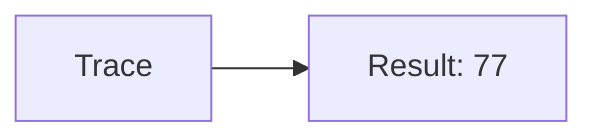
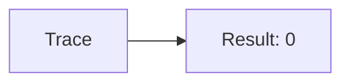
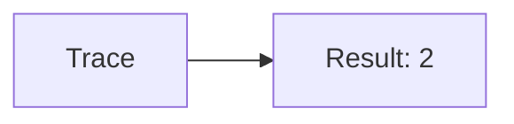
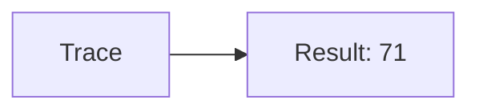
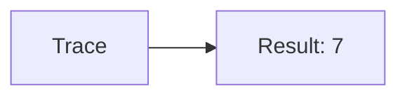
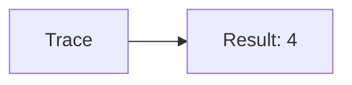
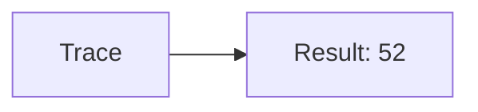
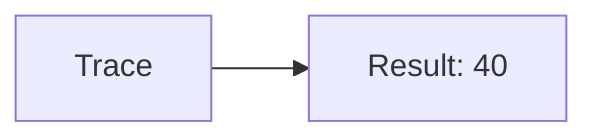
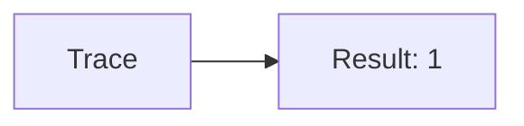
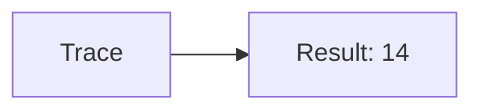

🔙 **[Kembali ke Daftar Soal](./README.md)**

---

# Latihan Soal Part C - Modul 01 - Set 11

### Soal 251
```cpp
// Semen: Casting
double val = 77.61;
int res = (int)val;
```
**Pertanyaan:**
1. Berapakah hasil akhirnya?
2. Deskripsikan alur pikir 'Compiler Manusia' untuk soal ini!

**Jawaban & Diagnosis:**
1. **77**
2. Mengubah 77.61 jadi integer (pangkas koma) jadi 77.

**Mermaid Flowchart:**


---
### Soal 252
```cpp
// Besi: Pembagian
int besi = 31, bagi = 8;
int hasil = besi / bagi;
```
**Pertanyaan:**
1. Berapakah hasil akhirnya?
2. Deskripsikan alur pikir 'Compiler Manusia' untuk soal ini!

**Jawaban & Diagnosis:**
1. **3**
2. Membagi 31 Besi ke 8 bagian. Hasil bulat: 3.

**Mermaid Flowchart:**


---
### Soal 253
```cpp
// Kayu: Modulo
int kayu = 10, bagi = 2;
int sisa = kayu % bagi;
```
**Pertanyaan:**
1. Berapakah hasil akhirnya?
2. Deskripsikan alur pikir 'Compiler Manusia' untuk soal ini!

**Jawaban & Diagnosis:**
1. **0**
2. 10 Kayu dibagi 2 sisa 0.

**Mermaid Flowchart:**


---
### Soal 254
```cpp
// Paku: Casting
double val = 96.41;
int res = (int)val;
```
**Pertanyaan:**
1. Berapakah hasil akhirnya?
2. Deskripsikan alur pikir 'Compiler Manusia' untuk soal ini!

**Jawaban & Diagnosis:**
1. **96**
2. Mengubah 96.41 jadi integer (pangkas koma) jadi 96.

**Mermaid Flowchart:**


---
### Soal 255
```cpp
// Cat: Pembagian
int cat = 18, bagi = 5;
int hasil = cat / bagi;
```
**Pertanyaan:**
1. Berapakah hasil akhirnya?
2. Deskripsikan alur pikir 'Compiler Manusia' untuk soal ini!

**Jawaban & Diagnosis:**
1. **3**
2. Membagi 18 Cat ke 5 bagian. Hasil bulat: 3.

**Mermaid Flowchart:**


---
### Soal 256
```cpp
// Kuas: Modulo
int kuas = 14, bagi = 6;
int sisa = kuas % bagi;
```
**Pertanyaan:**
1. Berapakah hasil akhirnya?
2. Deskripsikan alur pikir 'Compiler Manusia' untuk soal ini!

**Jawaban & Diagnosis:**
1. **2**
2. 14 Kuas dibagi 6 sisa 2.

**Mermaid Flowchart:**


---
### Soal 257
```cpp
// Tang: Casting
double val = 71.61;
int res = (int)val;
```
**Pertanyaan:**
1. Berapakah hasil akhirnya?
2. Deskripsikan alur pikir 'Compiler Manusia' untuk soal ini!

**Jawaban & Diagnosis:**
1. **71**
2. Mengubah 71.61 jadi integer (pangkas koma) jadi 71.

**Mermaid Flowchart:**


---
### Soal 258
```cpp
// Obeng: Pembagian
int obeng = 56, bagi = 8;
int hasil = obeng / bagi;
```
**Pertanyaan:**
1. Berapakah hasil akhirnya?
2. Deskripsikan alur pikir 'Compiler Manusia' untuk soal ini!

**Jawaban & Diagnosis:**
1. **7**
2. Membagi 56 Obeng ke 8 bagian. Hasil bulat: 7.

**Mermaid Flowchart:**


---
### Soal 259
```cpp
// Palu: Modulo
int palu = 25, bagi = 7;
int sisa = palu % bagi;
```
**Pertanyaan:**
1. Berapakah hasil akhirnya?
2. Deskripsikan alur pikir 'Compiler Manusia' untuk soal ini!

**Jawaban & Diagnosis:**
1. **4**
2. 25 Palu dibagi 7 sisa 4.

**Mermaid Flowchart:**


---
### Soal 260
```cpp
// Gergaji: Casting
double val = 49.61;
int res = (int)val;
```
**Pertanyaan:**
1. Berapakah hasil akhirnya?
2. Deskripsikan alur pikir 'Compiler Manusia' untuk soal ini!

**Jawaban & Diagnosis:**
1. **49**
2. Mengubah 49.61 jadi integer (pangkas koma) jadi 49.

**Mermaid Flowchart:**


---
### Soal 261
```cpp
// Bor: Pembagian
int bor = 25, bagi = 7;
int hasil = bor / bagi;
```
**Pertanyaan:**
1. Berapakah hasil akhirnya?
2. Deskripsikan alur pikir 'Compiler Manusia' untuk soal ini!

**Jawaban & Diagnosis:**
1. **3**
2. Membagi 25 Bor ke 7 bagian. Hasil bulat: 3.

**Mermaid Flowchart:**


---
### Soal 262
```cpp
// Baut: Modulo
int baut = 14, bagi = 2;
int sisa = baut % bagi;
```
**Pertanyaan:**
1. Berapakah hasil akhirnya?
2. Deskripsikan alur pikir 'Compiler Manusia' untuk soal ini!

**Jawaban & Diagnosis:**
1. **0**
2. 14 Baut dibagi 2 sisa 0.

**Mermaid Flowchart:**


---
### Soal 263
```cpp
// Sekrup: Casting
double val = 52.31;
int res = (int)val;
```
**Pertanyaan:**
1. Berapakah hasil akhirnya?
2. Deskripsikan alur pikir 'Compiler Manusia' untuk soal ini!

**Jawaban & Diagnosis:**
1. **52**
2. Mengubah 52.31 jadi integer (pangkas koma) jadi 52.

**Mermaid Flowchart:**


---
### Soal 264
```cpp
// KunciInggris: Pembagian
int kunciinggris = 39, bagi = 4;
int hasil = kunciinggris / bagi;
```
**Pertanyaan:**
1. Berapakah hasil akhirnya?
2. Deskripsikan alur pikir 'Compiler Manusia' untuk soal ini!

**Jawaban & Diagnosis:**
1. **9**
2. Membagi 39 KunciInggris ke 4 bagian. Hasil bulat: 9.

**Mermaid Flowchart:**


---
### Soal 265
```cpp
// Gembok: Modulo
int gembok = 96, bagi = 7;
int sisa = gembok % bagi;
```
**Pertanyaan:**
1. Berapakah hasil akhirnya?
2. Deskripsikan alur pikir 'Compiler Manusia' untuk soal ini!

**Jawaban & Diagnosis:**
1. **5**
2. 96 Gembok dibagi 7 sisa 5.

**Mermaid Flowchart:**


---
### Soal 266
```cpp
// Rantai: Casting
double val = 40.61;
int res = (int)val;
```
**Pertanyaan:**
1. Berapakah hasil akhirnya?
2. Deskripsikan alur pikir 'Compiler Manusia' untuk soal ini!

**Jawaban & Diagnosis:**
1. **40**
2. Mengubah 40.61 jadi integer (pangkas koma) jadi 40.

**Mermaid Flowchart:**


---
### Soal 267
```cpp
// Tali: Pembagian
int tali = 12, bagi = 4;
int hasil = tali / bagi;
```
**Pertanyaan:**
1. Berapakah hasil akhirnya?
2. Deskripsikan alur pikir 'Compiler Manusia' untuk soal ini!

**Jawaban & Diagnosis:**
1. **3**
2. Membagi 12 Tali ke 4 bagian. Hasil bulat: 3.

**Mermaid Flowchart:**


---
### Soal 268
```cpp
// Karet: Modulo
int karet = 13, bagi = 3;
int sisa = karet % bagi;
```
**Pertanyaan:**
1. Berapakah hasil akhirnya?
2. Deskripsikan alur pikir 'Compiler Manusia' untuk soal ini!

**Jawaban & Diagnosis:**
1. **1**
2. 13 Karet dibagi 3 sisa 1.

**Mermaid Flowchart:**


---
### Soal 269
```cpp
// Plastik: Casting
double val = 26.41;
int res = (int)val;
```
**Pertanyaan:**
1. Berapakah hasil akhirnya?
2. Deskripsikan alur pikir 'Compiler Manusia' untuk soal ini!

**Jawaban & Diagnosis:**
1. **26**
2. Mengubah 26.41 jadi integer (pangkas koma) jadi 26.

**Mermaid Flowchart:**


---
### Soal 270
```cpp
// Kertas: Pembagian
int kertas = 71, bagi = 5;
int hasil = kertas / bagi;
```
**Pertanyaan:**
1. Berapakah hasil akhirnya?
2. Deskripsikan alur pikir 'Compiler Manusia' untuk soal ini!

**Jawaban & Diagnosis:**
1. **14**
2. Membagi 71 Kertas ke 5 bagian. Hasil bulat: 14.

**Mermaid Flowchart:**


---
### Soal 271
```cpp
// Kardus: Modulo
int kardus = 17, bagi = 4;
int sisa = kardus % bagi;
```
**Pertanyaan:**
1. Berapakah hasil akhirnya?
2. Deskripsikan alur pikir 'Compiler Manusia' untuk soal ini!

**Jawaban & Diagnosis:**
1. **1**
2. 17 Kardus dibagi 4 sisa 1.

**Mermaid Flowchart:**
```mermaid
graph LR
A[Trace] --> B[Result: 1]
```

---
### Soal 272
```cpp
// Plastik: Casting
double val = 76.81;
int res = (int)val;
```
**Pertanyaan:**
1. Berapakah hasil akhirnya?
2. Deskripsikan alur pikir 'Compiler Manusia' untuk soal ini!

**Jawaban & Diagnosis:**
1. **76**
2. Mengubah 76.81 jadi integer (pangkas koma) jadi 76.

**Mermaid Flowchart:**
```mermaid
graph LR
A[Trace] --> B[Result: 76]
```

---
### Soal 273
```cpp
// Kaca: Pembagian
int kaca = 92, bagi = 8;
int hasil = kaca / bagi;
```
**Pertanyaan:**
1. Berapakah hasil akhirnya?
2. Deskripsikan alur pikir 'Compiler Manusia' untuk soal ini!

**Jawaban & Diagnosis:**
1. **11**
2. Membagi 92 Kaca ke 8 bagian. Hasil bulat: 11.

**Mermaid Flowchart:**
```mermaid
graph LR
A[Trace] --> B[Result: 11]
```

---
### Soal 274
```cpp
// Logam: Modulo
int logam = 18, bagi = 8;
int sisa = logam % bagi;
```
**Pertanyaan:**
1. Berapakah hasil akhirnya?
2. Deskripsikan alur pikir 'Compiler Manusia' untuk soal ini!

**Jawaban & Diagnosis:**
1. **2**
2. 18 Logam dibagi 8 sisa 2.

**Mermaid Flowchart:**
```mermaid
graph LR
A[Trace] --> B[Result: 2]
```

---
### Soal 275
```cpp
// Kain: Casting
double val = 89.41;
int res = (int)val;
```
**Pertanyaan:**
1. Berapakah hasil akhirnya?
2. Deskripsikan alur pikir 'Compiler Manusia' untuk soal ini!

**Jawaban & Diagnosis:**
1. **89**
2. Mengubah 89.41 jadi integer (pangkas koma) jadi 89.

**Mermaid Flowchart:**
```mermaid
graph LR
A[Trace] --> B[Result: 89]
```

---
