🔙 **[Kembali ke Daftar Soal](./README.md)**

---

# Latihan Soal Part C - Modul 01 - Set 12

### Soal 276
```cpp
double val = 13.21;
int res = (int)val;
```
**Pertanyaan:**
1. Berapakah hasil akhirnya?
2. Mengapa demikian?

**Jawaban & Diagnosis:**
1. **13**
2. Lihat Tracing.

**Mermaid Flowchart:**
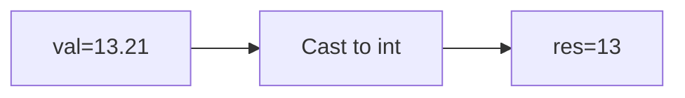

**📖 Penjelasan:**
**Langkah Tracing:**
1. val=13.21.
2. Desimal dihilangkan.
3. Hasil: 13.

---
### Soal 277
```cpp
int n = 22;
int m = 10;
int res = n % m;
```
**Pertanyaan:**
1. Berapakah hasil akhirnya?
2. Mengapa demikian?

**Jawaban & Diagnosis:**
1. **2**
2. Lihat Tracing.

**Mermaid Flowchart:**
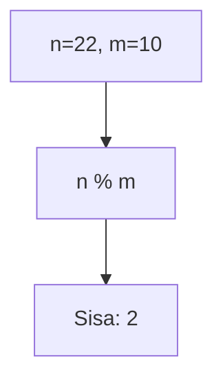

**📖 Penjelasan:**
**Langkah Tracing:**
1. n=22, m=10.
2. 22 dibagi 10 sisa 2.
3. Hasil: 2.

---
### Soal 278
```cpp
int n = 11;
int m = 3;
int res = n % m;
```
**Pertanyaan:**
1. Berapakah hasil akhirnya?
2. Mengapa demikian?

**Jawaban & Diagnosis:**
1. **2**
2. Lihat Tracing.

**Mermaid Flowchart:**
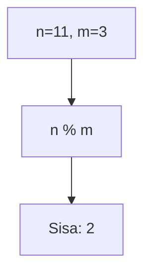

**📖 Penjelasan:**
**Langkah Tracing:**
1. n=11, m=3.
2. 11 dibagi 3 sisa 2.
3. Hasil: 2.

---
### Soal 279
```cpp
double val = 66.97;
int res = (int)val;
```
**Pertanyaan:**
1. Berapakah hasil akhirnya?
2. Mengapa demikian?

**Jawaban & Diagnosis:**
1. **66**
2. Lihat Tracing.

**Mermaid Flowchart:**
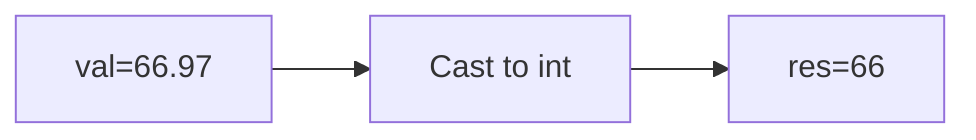

**📖 Penjelasan:**
**Langkah Tracing:**
1. val=66.97.
2. Desimal dihilangkan.
3. Hasil: 66.

---
### Soal 280
```cpp
char ch = 'X';
ch = ch + (5);
```
**Pertanyaan:**
1. Berapakah hasil akhirnya?
2. Mengapa demikian?

**Jawaban & Diagnosis:**
1. **]**
2. Lihat Tracing.

**Mermaid Flowchart:**
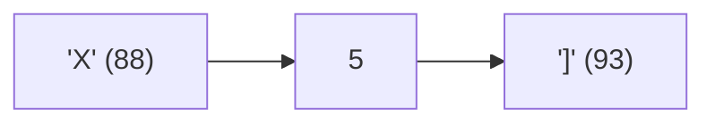

**📖 Penjelasan:**
**Langkah Tracing:**
1. ch='X' (ASCII 88).
2. 88 + (5) = 93.
3. Hasil: ']'.

---
### Soal 281
```cpp
double val = 70.00;
int res = (int)val;
```
**Pertanyaan:**
1. Berapakah hasil akhirnya?
2. Mengapa demikian?

**Jawaban & Diagnosis:**
1. **69**
2. Lihat Tracing.

**Mermaid Flowchart:**
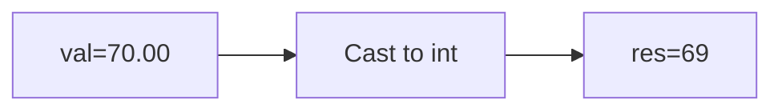

**📖 Penjelasan:**
**Langkah Tracing:**
1. val=70.00.
2. Desimal dihilangkan.
3. Hasil: 69.

---
### Soal 282
```cpp
double val = 89.76;
int res = (int)val;
```
**Pertanyaan:**
1. Berapakah hasil akhirnya?
2. Mengapa demikian?

**Jawaban & Diagnosis:**
1. **89**
2. Lihat Tracing.

**Mermaid Flowchart:**
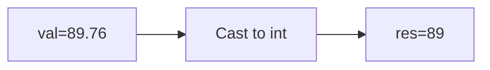

**📖 Penjelasan:**
**Langkah Tracing:**
1. val=89.76.
2. Desimal dihilangkan.
3. Hasil: 89.

---
### Soal 283
```cpp
double val = 36.77;
int res = (int)val;
```
**Pertanyaan:**
1. Berapakah hasil akhirnya?
2. Mengapa demikian?

**Jawaban & Diagnosis:**
1. **36**
2. Lihat Tracing.

**Mermaid Flowchart:**
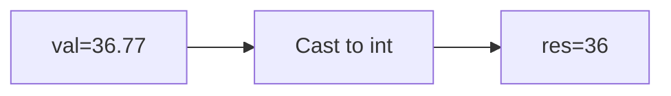

**📖 Penjelasan:**
**Langkah Tracing:**
1. val=36.77.
2. Desimal dihilangkan.
3. Hasil: 36.

---
### Soal 284
```cpp
char ch = 'm';
ch = ch + (5);
```
**Pertanyaan:**
1. Berapakah hasil akhirnya?
2. Mengapa demikian?

**Jawaban & Diagnosis:**
1. **r**
2. Lihat Tracing.

**Mermaid Flowchart:**
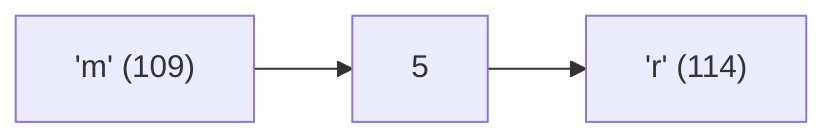

**📖 Penjelasan:**
**Langkah Tracing:**
1. ch='m' (ASCII 109).
2. 109 + (5) = 114.
3. Hasil: 'r'.

---
### Soal 285
```cpp
int n = 19;
int m = 2;
int res = n % m;
```
**Pertanyaan:**
1. Berapakah hasil akhirnya?
2. Mengapa demikian?

**Jawaban & Diagnosis:**
1. **1**
2. Lihat Tracing.

**Mermaid Flowchart:**
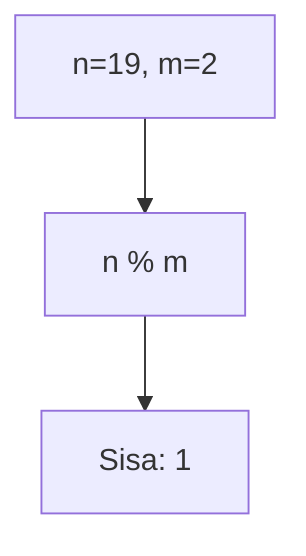

**📖 Penjelasan:**
**Langkah Tracing:**
1. n=19, m=2.
2. 19 dibagi 2 sisa 1.
3. Hasil: 1.

---
### Soal 286
```cpp
int a = 34, b = 2;
int res = a / b;
```
**Pertanyaan:**
1. Berapakah hasil akhirnya?
2. Mengapa demikian?

**Jawaban & Diagnosis:**
1. **17**
2. Lihat Tracing.

**Mermaid Flowchart:**
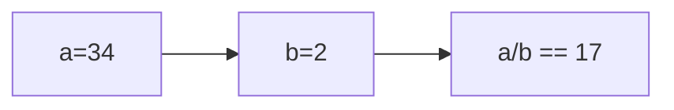

**📖 Penjelasan:**
**Langkah Tracing:**
1. a=34, b=2.
2. 34/2 = 17.00. Karena `int`, desimal dibuang.
3. Hasil: 17.

---
### Soal 287
```cpp
int x = 42, m = 9;
int res = x / m;
```
**Pertanyaan:**
1. Berapakah hasil akhirnya?
2. Mengapa demikian?

**Jawaban & Diagnosis:**
1. **4**
2. Lihat Tracing.

**Mermaid Flowchart:**
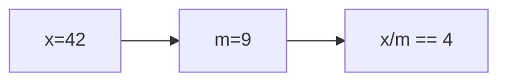

**📖 Penjelasan:**
**Langkah Tracing:**
1. x=42, m=9.
2. 42/9 = 4.67. Karena `int`, desimal dibuang.
3. Hasil: 4.

---
### Soal 288
```cpp
double val = 88.65;
int res = (int)val;
```
**Pertanyaan:**
1. Berapakah hasil akhirnya?
2. Mengapa demikian?

**Jawaban & Diagnosis:**
1. **88**
2. Lihat Tracing.

**Mermaid Flowchart:**
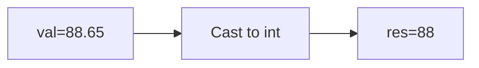

**📖 Penjelasan:**
**Langkah Tracing:**
1. val=88.65.
2. Desimal dihilangkan.
3. Hasil: 88.

---
### Soal 289
```cpp
int x = 64, m = 6;
int res = x / m;
```
**Pertanyaan:**
1. Berapakah hasil akhirnya?
2. Mengapa demikian?

**Jawaban & Diagnosis:**
1. **10**
2. Lihat Tracing.

**Mermaid Flowchart:**
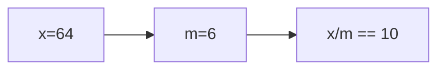

**📖 Penjelasan:**
**Langkah Tracing:**
1. x=64, m=6.
2. 64/6 = 10.67. Karena `int`, desimal dibuang.
3. Hasil: 10.

---
### Soal 290
```cpp
char ch = 'P';
ch = ch + (5);
```
**Pertanyaan:**
1. Berapakah hasil akhirnya?
2. Mengapa demikian?

**Jawaban & Diagnosis:**
1. **U**
2. Lihat Tracing.

**Mermaid Flowchart:**
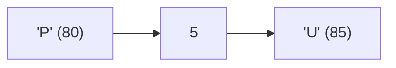

**📖 Penjelasan:**
**Langkah Tracing:**
1. ch='P' (ASCII 80).
2. 80 + (5) = 85.
3. Hasil: 'U'.

---
### Soal 291
```cpp
int n = 19;
int m = 5;
int res = n % m;
```
**Pertanyaan:**
1. Berapakah hasil akhirnya?
2. Mengapa demikian?

**Jawaban & Diagnosis:**
1. **4**
2. Lihat Tracing.

**Mermaid Flowchart:**
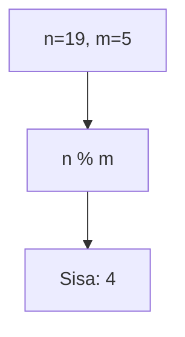

**📖 Penjelasan:**
**Langkah Tracing:**
1. n=19, m=5.
2. 19 dibagi 5 sisa 4.
3. Hasil: 4.

---
### Soal 292
```cpp
char ch = 'A';
ch = ch + (1);
```
**Pertanyaan:**
1. Berapakah hasil akhirnya?
2. Mengapa demikian?

**Jawaban & Diagnosis:**
1. **B**
2. Lihat Tracing.

**Mermaid Flowchart:**
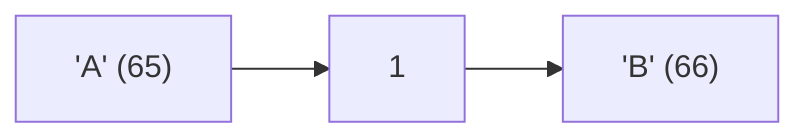

**📖 Penjelasan:**
**Langkah Tracing:**
1. ch='A' (ASCII 65).
2. 65 + (1) = 66.
3. Hasil: 'B'.

---
### Soal 293
```cpp
int n = 37;
int m = 10;
int res = n % m;
```
**Pertanyaan:**
1. Berapakah hasil akhirnya?
2. Mengapa demikian?

**Jawaban & Diagnosis:**
1. **7**
2. Lihat Tracing.

**Mermaid Flowchart:**
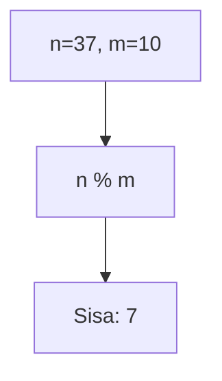

**📖 Penjelasan:**
**Langkah Tracing:**
1. n=37, m=10.
2. 37 dibagi 10 sisa 7.
3. Hasil: 7.

---
### Soal 294
```cpp
double val = 79.14;
int res = (int)val;
```
**Pertanyaan:**
1. Berapakah hasil akhirnya?
2. Mengapa demikian?

**Jawaban & Diagnosis:**
1. **79**
2. Lihat Tracing.

**Mermaid Flowchart:**
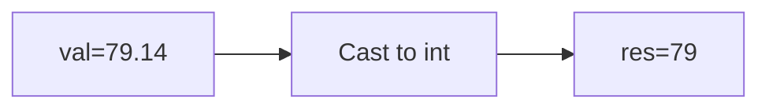

**📖 Penjelasan:**
**Langkah Tracing:**
1. val=79.14.
2. Desimal dihilangkan.
3. Hasil: 79.

---
### Soal 295
```cpp
int x = 78, m = 4;
int res = x / m;
```
**Pertanyaan:**
1. Berapakah hasil akhirnya?
2. Mengapa demikian?

**Jawaban & Diagnosis:**
1. **19**
2. Lihat Tracing.

**Mermaid Flowchart:**
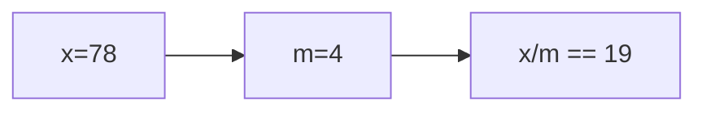

**📖 Penjelasan:**
**Langkah Tracing:**
1. x=78, m=4.
2. 78/4 = 19.50. Karena `int`, desimal dibuang.
3. Hasil: 19.

---
### Soal 296
```cpp
int n = 84, b = 5;
int res = n / b;
```
**Pertanyaan:**
1. Berapakah hasil akhirnya?
2. Mengapa demikian?

**Jawaban & Diagnosis:**
1. **16**
2. Lihat Tracing.

**Mermaid Flowchart:**
```mermaid
graph LR
A["n=84"] --> B["b=5"]
B --> C["n/b == 16"]
```

**📖 Penjelasan:**
**Langkah Tracing:**
1. n=84, b=5.
2. 84/5 = 16.80. Karena `int`, desimal dibuang.
3. Hasil: 16.

---
### Soal 297
```cpp
double val = 63.62;
int res = (int)val;
```
**Pertanyaan:**
1. Berapakah hasil akhirnya?
2. Mengapa demikian?

**Jawaban & Diagnosis:**
1. **63**
2. Lihat Tracing.

**Mermaid Flowchart:**
```mermaid
graph LR
A["val=63.62"] --> B["Cast to int"]
B --> C["res=63"]
```

**📖 Penjelasan:**
**Langkah Tracing:**
1. val=63.62.
2. Desimal dihilangkan.
3. Hasil: 63.

---
### Soal 298
```cpp
int n = 33;
int m = 3;
int res = n % m;
```
**Pertanyaan:**
1. Berapakah hasil akhirnya?
2. Mengapa demikian?

**Jawaban & Diagnosis:**
1. **0**
2. Lihat Tracing.

**Mermaid Flowchart:**
```mermaid
graph TD
A["n=33, m=3"] --> B["n % m"]
B --> C["Sisa: 0"]
```

**📖 Penjelasan:**
**Langkah Tracing:**
1. n=33, m=3.
2. 33 dibagi 3 sisa 0.
3. Hasil: 0.

---
### Soal 299
```cpp
char ch = 'm';
ch = ch + (4);
```
**Pertanyaan:**
1. Berapakah hasil akhirnya?
2. Mengapa demikian?

**Jawaban & Diagnosis:**
1. **q**
2. Lihat Tracing.

**Mermaid Flowchart:**
```mermaid
graph LR
A["'m' (109)"] --> B["4"]
B --> C["'q' (113)"]
```

**📖 Penjelasan:**
**Langkah Tracing:**
1. ch='m' (ASCII 109).
2. 109 + (4) = 113.
3. Hasil: 'q'.

---
### Soal 300
```cpp
double val = 13.50;
int res = (int)val;
```
**Pertanyaan:**
1. Berapakah hasil akhirnya?
2. Mengapa demikian?

**Jawaban & Diagnosis:**
1. **13**
2. Lihat Tracing.

**Mermaid Flowchart:**
```mermaid
graph LR
A["val=13.50"] --> B["Cast to int"]
B --> C["res=13"]
```

**📖 Penjelasan:**
**Langkah Tracing:**
1. val=13.50.
2. Desimal dihilangkan.
3. Hasil: 13.

---
