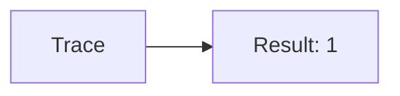
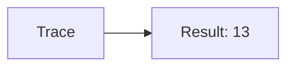
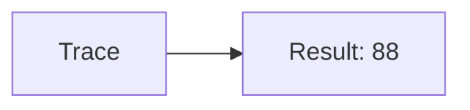
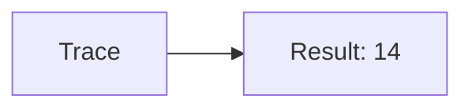
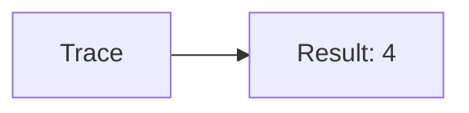
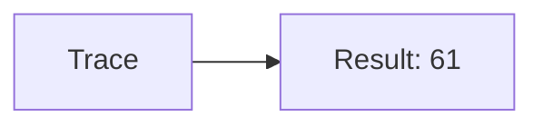
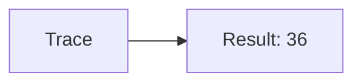
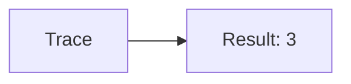

🔙 **[Kembali ke Daftar Soal](./README.md)**

---

# Latihan Soal Part C - Modul 01 - Set 12

### Soal 276
```cpp
// Benang: Pembagian
int benang = 66, bagi = 3;
int hasil = benang / bagi;
```
**Pertanyaan:**
1. Berapakah hasil akhirnya?
2. Deskripsikan alur pikir 'Compiler Manusia' untuk soal ini!

**Jawaban & Diagnosis:**
1. **22**
2. Membagi 66 Benang ke 3 bagian. Hasil bulat: 22.

**Mermaid Flowchart:**


---
### Soal 277
```cpp
// Jarum: Modulo
int jarum = 57, bagi = 4;
int sisa = jarum % bagi;
```
**Pertanyaan:**
1. Berapakah hasil akhirnya?
2. Deskripsikan alur pikir 'Compiler Manusia' untuk soal ini!

**Jawaban & Diagnosis:**
1. **1**
2. 57 Jarum dibagi 4 sisa 1.

**Mermaid Flowchart:**


---
### Soal 278
```cpp
// Gunting: Casting
double val = 95.71;
int res = (int)val;
```
**Pertanyaan:**
1. Berapakah hasil akhirnya?
2. Deskripsikan alur pikir 'Compiler Manusia' untuk soal ini!

**Jawaban & Diagnosis:**
1. **95**
2. Mengubah 95.71 jadi integer (pangkas koma) jadi 95.

**Mermaid Flowchart:**


---
### Soal 279
```cpp
// Lem: Pembagian
int lem = 82, bagi = 6;
int hasil = lem / bagi;
```
**Pertanyaan:**
1. Berapakah hasil akhirnya?
2. Deskripsikan alur pikir 'Compiler Manusia' untuk soal ini!

**Jawaban & Diagnosis:**
1. **13**
2. Membagi 82 Lem ke 6 bagian. Hasil bulat: 13.

**Mermaid Flowchart:**


---
### Soal 280
```cpp
// Isolasi: Modulo
int isolasi = 73, bagi = 3;
int sisa = isolasi % bagi;
```
**Pertanyaan:**
1. Berapakah hasil akhirnya?
2. Deskripsikan alur pikir 'Compiler Manusia' untuk soal ini!

**Jawaban & Diagnosis:**
1. **1**
2. 73 Isolasi dibagi 3 sisa 1.

**Mermaid Flowchart:**


---
### Soal 281
```cpp
// Lakban: Casting
double val = 88.51;
int res = (int)val;
```
**Pertanyaan:**
1. Berapakah hasil akhirnya?
2. Deskripsikan alur pikir 'Compiler Manusia' untuk soal ini!

**Jawaban & Diagnosis:**
1. **88**
2. Mengubah 88.51 jadi integer (pangkas koma) jadi 88.

**Mermaid Flowchart:**


---
### Soal 282
```cpp
// Tipex: Pembagian
int tipex = 57, bagi = 4;
int hasil = tipex / bagi;
```
**Pertanyaan:**
1. Berapakah hasil akhirnya?
2. Deskripsikan alur pikir 'Compiler Manusia' untuk soal ini!

**Jawaban & Diagnosis:**
1. **14**
2. Membagi 57 Tipex ke 4 bagian. Hasil bulat: 14.

**Mermaid Flowchart:**


---
### Soal 283
```cpp
// Stabilo: Modulo
int stabilo = 40, bagi = 3;
int sisa = stabilo % bagi;
```
**Pertanyaan:**
1. Berapakah hasil akhirnya?
2. Deskripsikan alur pikir 'Compiler Manusia' untuk soal ini!

**Jawaban & Diagnosis:**
1. **1**
2. 40 Stabilo dibagi 3 sisa 1.

**Mermaid Flowchart:**


---
### Soal 284
```cpp
// Spidol: Casting
double val = 57.41;
int res = (int)val;
```
**Pertanyaan:**
1. Berapakah hasil akhirnya?
2. Deskripsikan alur pikir 'Compiler Manusia' untuk soal ini!

**Jawaban & Diagnosis:**
1. **57**
2. Mengubah 57.41 jadi integer (pangkas koma) jadi 57.

**Mermaid Flowchart:**


---
### Soal 285
```cpp
// Crayon: Pembagian
int crayon = 16, bagi = 4;
int hasil = crayon / bagi;
```
**Pertanyaan:**
1. Berapakah hasil akhirnya?
2. Deskripsikan alur pikir 'Compiler Manusia' untuk soal ini!

**Jawaban & Diagnosis:**
1. **4**
2. Membagi 16 Crayon ke 4 bagian. Hasil bulat: 4.

**Mermaid Flowchart:**


---
### Soal 286
```cpp
// CatAir: Modulo
int catair = 25, bagi = 2;
int sisa = catair % bagi;
```
**Pertanyaan:**
1. Berapakah hasil akhirnya?
2. Deskripsikan alur pikir 'Compiler Manusia' untuk soal ini!

**Jawaban & Diagnosis:**
1. **1**
2. 25 CatAir dibagi 2 sisa 1.

**Mermaid Flowchart:**


---
### Soal 287
```cpp
// Kuas: Casting
double val = 61.51;
int res = (int)val;
```
**Pertanyaan:**
1. Berapakah hasil akhirnya?
2. Deskripsikan alur pikir 'Compiler Manusia' untuk soal ini!

**Jawaban & Diagnosis:**
1. **61**
2. Mengubah 61.51 jadi integer (pangkas koma) jadi 61.

**Mermaid Flowchart:**


---
### Soal 288
```cpp
// Kanvas: Pembagian
int kanvas = 14, bagi = 3;
int hasil = kanvas / bagi;
```
**Pertanyaan:**
1. Berapakah hasil akhirnya?
2. Deskripsikan alur pikir 'Compiler Manusia' untuk soal ini!

**Jawaban & Diagnosis:**
1. **4**
2. Membagi 14 Kanvas ke 3 bagian. Hasil bulat: 4.

**Mermaid Flowchart:**


---
### Soal 289
```cpp
// Palet: Modulo
int palet = 49, bagi = 6;
int sisa = palet % bagi;
```
**Pertanyaan:**
1. Berapakah hasil akhirnya?
2. Deskripsikan alur pikir 'Compiler Manusia' untuk soal ini!

**Jawaban & Diagnosis:**
1. **1**
2. 49 Palet dibagi 6 sisa 1.

**Mermaid Flowchart:**


---
### Soal 290
```cpp
// Easel: Casting
double val = 73.21;
int res = (int)val;
```
**Pertanyaan:**
1. Berapakah hasil akhirnya?
2. Deskripsikan alur pikir 'Compiler Manusia' untuk soal ini!

**Jawaban & Diagnosis:**
1. **73**
2. Mengubah 73.21 jadi integer (pangkas koma) jadi 73.

**Mermaid Flowchart:**


---
### Soal 291
```cpp
// Patung: Pembagian
int patung = 72, bagi = 2;
int hasil = patung / bagi;
```
**Pertanyaan:**
1. Berapakah hasil akhirnya?
2. Deskripsikan alur pikir 'Compiler Manusia' untuk soal ini!

**Jawaban & Diagnosis:**
1. **36**
2. Membagi 72 Patung ke 2 bagian. Hasil bulat: 36.

**Mermaid Flowchart:**


---
### Soal 292
```cpp
// Ukiran: Modulo
int ukiran = 41, bagi = 6;
int sisa = ukiran % bagi;
```
**Pertanyaan:**
1. Berapakah hasil akhirnya?
2. Deskripsikan alur pikir 'Compiler Manusia' untuk soal ini!

**Jawaban & Diagnosis:**
1. **5**
2. 41 Ukiran dibagi 6 sisa 5.

**Mermaid Flowchart:**


---
### Soal 293
```cpp
// Lukisan: Casting
double val = 21.51;
int res = (int)val;
```
**Pertanyaan:**
1. Berapakah hasil akhirnya?
2. Deskripsikan alur pikir 'Compiler Manusia' untuk soal ini!

**Jawaban & Diagnosis:**
1. **21**
2. Mengubah 21.51 jadi integer (pangkas koma) jadi 21.

**Mermaid Flowchart:**


---
### Soal 294
```cpp
// Foto: Pembagian
int foto = 15, bagi = 3;
int hasil = foto / bagi;
```
**Pertanyaan:**
1. Berapakah hasil akhirnya?
2. Deskripsikan alur pikir 'Compiler Manusia' untuk soal ini!

**Jawaban & Diagnosis:**
1. **5**
2. Membagi 15 Foto ke 3 bagian. Hasil bulat: 5.

**Mermaid Flowchart:**


---
### Soal 295
```cpp
// Bingkai: Modulo
int bingkai = 63, bagi = 5;
int sisa = bingkai % bagi;
```
**Pertanyaan:**
1. Berapakah hasil akhirnya?
2. Deskripsikan alur pikir 'Compiler Manusia' untuk soal ini!

**Jawaban & Diagnosis:**
1. **3**
2. 63 Bingkai dibagi 5 sisa 3.

**Mermaid Flowchart:**


---
### Soal 296
```cpp
// Album: Casting
double val = 94.81;
int res = (int)val;
```
**Pertanyaan:**
1. Berapakah hasil akhirnya?
2. Deskripsikan alur pikir 'Compiler Manusia' untuk soal ini!

**Jawaban & Diagnosis:**
1. **94**
2. Mengubah 94.81 jadi integer (pangkas koma) jadi 94.

**Mermaid Flowchart:**
```mermaid
graph LR
A[Trace] --> B[Result: 94]
```

---
### Soal 297
```cpp
// Kaset: Pembagian
int kaset = 66, bagi = 4;
int hasil = kaset / bagi;
```
**Pertanyaan:**
1. Berapakah hasil akhirnya?
2. Deskripsikan alur pikir 'Compiler Manusia' untuk soal ini!

**Jawaban & Diagnosis:**
1. **16**
2. Membagi 66 Kaset ke 4 bagian. Hasil bulat: 16.

**Mermaid Flowchart:**
```mermaid
graph LR
A[Trace] --> B[Result: 16]
```

---
### Soal 298
```cpp
// CD: Modulo
int cd = 76, bagi = 6;
int sisa = cd % bagi;
```
**Pertanyaan:**
1. Berapakah hasil akhirnya?
2. Deskripsikan alur pikir 'Compiler Manusia' untuk soal ini!

**Jawaban & Diagnosis:**
1. **4**
2. 76 CD dibagi 6 sisa 4.

**Mermaid Flowchart:**
```mermaid
graph LR
A[Trace] --> B[Result: 4]
```

---
### Soal 299
```cpp
// DVD: Casting
double val = 28.71;
int res = (int)val;
```
**Pertanyaan:**
1. Berapakah hasil akhirnya?
2. Deskripsikan alur pikir 'Compiler Manusia' untuk soal ini!

**Jawaban & Diagnosis:**
1. **28**
2. Mengubah 28.71 jadi integer (pangkas koma) jadi 28.

**Mermaid Flowchart:**
```mermaid
graph LR
A[Trace] --> B[Result: 28]
```

---
### Soal 300
```cpp
// VCD: Pembagian
int vcd = 37, bagi = 2;
int hasil = vcd / bagi;
```
**Pertanyaan:**
1. Berapakah hasil akhirnya?
2. Deskripsikan alur pikir 'Compiler Manusia' untuk soal ini!

**Jawaban & Diagnosis:**
1. **18**
2. Membagi 37 VCD ke 2 bagian. Hasil bulat: 18.

**Mermaid Flowchart:**
```mermaid
graph LR
A[Trace] --> B[Result: 18]
```

---
