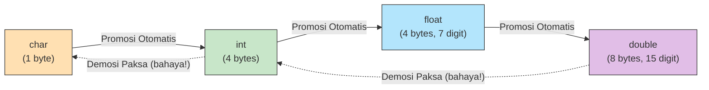

# 1. Tipe Data & Operator Dasar (Loker Kelas & Pembagian Permen)

Selamat datang di markas besar *Compiler Manusia*! 
Di sini, mesin Juri OSN-K akan melempar sebaris dua baris kode berbahasa **C++** yang memanipulasi rentetan angka. Sebagai *Compiler Manusia*, kamu wajib tahu sifat-sifat kejam kodingan C++ yang sering kali **berlawanan dengan hukum matematika di sekolah**.

Mari kita bedah dua konsep penjebak massal: **Sifat Kejam Kotak Integer** dan **Sihir Modulo (`%`)**.

---

---
 
 ## 📋 A. Pemanasan: Aturan Dasar Menulis Kode
 
 Sebelum kita masuk ke angka, ada 3 aturan "Sopan Santun" di C++ yang wajib muridmu tahu:
 
 1. **Titik Koma (`;`) adalah Titik**: Setiap satu perintah selesai, wajib diakhiri `;`. Tanpa ini, C++ akan bingung mana awal dan mana akhir kalimat.
 2. **Komentar (`//`) adalah Catatan**: Tulis apapun setelah `//` tidak akan dibaca oleh komputer. Ini tempat kita curhat atau memberi petunjuk untuk diri sendiri.
 3. **Nama Loker (Variabel)**: Nama laci tidak boleh pakai **Spasi** dan tidak boleh diawali **Angka**. (Contoh: `uang jajan` ❌, `uang_jajan` ✅).
 
 ---
 
 ---
 
 ## 🚪 B. Pintu Masuk & Keluar (Input `cin` & Output `cout`)
 
 Variabel adalah laci, tapi bagaimana cara memasukkan barang ke dalamnya dari dunia nyata? C++ punya dua "Pintu" utama:
 
 1. **`cin >> laci;` (Input)**: Bayangkan ada **Ban Berjalan** dari keyboard. Tanda `>>` adalah corong yang mengalirkan apa yang kamu ketik ke dalam laci. 
 2. **`cout << "Teks";` (Output)**: Tanda `<<` adalah corong yang menyemburkan isi laci atau teks ke arah **Layar Monitor**.
 
 > [!TIP]
 > **Cara Hafal Panahnya:** 
 > - `cin >>` $\rightarrow$ Panah masuk ke variabel. 
 > - `cout <<` $\rightarrow$ Panah keluar dari teks/variabel menuju layar.
 
 ---
 
 ## 📦 C. Aturan Main Kotak (Tipe Data `int`)

Di bahasa C++, kamu tidak bisa sembarangan menaruh barang ke udara kosong. Kamu butuh **"Kotak Loker"** (Variabel). Kotak ini ada label nama tipe datanya, yang paling sering memakan korban adalah:

- `int` (Kotak Semen): Cuma bisa diisi **Bilangan Bulat** antara minus 2 miliar sampai plus 2 miliar.
- `long long` (Peti Kemas): Sama kayak `int`, cuma kapsitasnya raksasa (sampai triliunan `10^18`).

### ⚠️ Jebakan Batman #1: Integer Division (Membagi Tanpa Ampun)

Guru Matematika di sekolah mengajarkan: $5 \div 2 = 2.5$. Benar kan?
**Di dunia C++, `5 / 2` HASILNYA ADALAH `2`!** Lho kok bisa? Kemana sisa $0.5$ nya?

**Analogi Loker & Pembagian Permen Mentah:**
Bayangkan tipe `int` itu adalah **Laci Semen keras tanpa celah karet (desimal)**.
Kalau Pak Dengklek menyuruh mesin C++ membagi 5 biji permen mentah ke 2 anak (Budi dan Wati). 
- Budi dapat 2 biji.
- Wati dapat 2 biji.
Sisa 1 biji lagi gak bisa dibelah pisau karena kodratnya di kodingan variabel `int` (Bilangan Bulat) melarang keras adanya "serpihan desimal"!!
Karena komputer itu robot bodoh, dia cuma nanya: *"Eh satu anak dapet utuh berapa bulatnya?"* Jawabnya 2. Sisa serpihannya? **DIBUANG KE TONG SAMPAH, DIABAIKAN, DIBAKAR!**

Jadi jangan heran kalau disodorkan kode begini di kertas OSN-K:
```cpp
int a = 20;
int b = 3;
int hasil = a / b;
// Hasil yang tercetak BUKAN 6.666, TAPI MURNI 6!
```
*Aturan Emas Tracing C++:* Kalau tipe datanya `int`, setiap ada rumus Pembagian `/`, **potong buang semua angka koma di belakangnya tanpa pembulatan ke atas**.

---

## 🔮 D. Sihir Sisa Bagi (Modulo `%`)

Nah, tadi kan sisa 1 permennya dibuang tuh sama operator pembagi `/`. Terus kalau kita mau cari tahu permen sisa yang gak bisa dibagi rata itu berapa, ke mana kita mencarinya?
Jawabannya adalah **Operator Modulo (Simbolnya `%`)**.

Modulo artinya: **"Cari Sisa Baginya!"**

**Analogi Kelereng Harian:**
Kamu punya 14 kelereng. Kamu ingin membagikannya adil ke 4 temanmu.
- Bagi Rata ($14 \div 4$): Setiap anak dapet 3 biji utuh (`14 / 4 = 3`).
- Sisa Kelereng ($14 \pmod 4$): Total yang dibagikan $3 \times 4 = 12$ biji. Tanganmu sisa $14 - 12 = 2$ biji kelereng yang gak bisa dibagi. Inilah hasil Modulonya! (`14 % 4 = 2`).

### ⚠️ Jebakan Batman #2: Sifat Modulo Bikin Pusing
**1. Modulo Angka Kecil terhadap Angka Besar**
Coba jawab cepat! Berapa hasil `3 % 7` (3 sisa bagi 7)?
- Insting salah: `4` (Dikurangin aja $7-3$). Ini jelas Sesat!
- **Analogi Logis:** Pak Dengklek punya 3 kelereng. Disuruh membagikan merata ke 7 anak. Apa yang terjadi? Ya nggak mungkin! Kelerengnya kurang dari jumlah anak, nggak bisa dibagi satu pun ke siapa-siapa. Kesimpulannya: Kelereng di tangan Pak Dengklek utuh tidak berkurang. 
- Hasilnya: **`3 % 7 = 3`**.
*Aturan Emas Modulo OSN-K:* Jika angka kiri *lebih kecil* dari angka kanan ($A \pmod B$ dimana $A < B$), **jawabannya adalah Angka Kiri itu sendiri ($A$)**.

**2. Pendeteksi Genap-Ganjil Instant**
Di soal operasi *looping* array panjang, Modulo `2` seringkali nongol mendadak.
```cpp
if (x % 2 == 0) { ... }
```
Jangan panik ngitung sisa bagi angka gila! `% 2 == 0` terjemahan bahasa Indonesianya murni satu kalimat: **"Apakah `x` ini genap?"**.
Dan jika `x % 2 != 0`, artinya variabel itu sedang memegang angka saklek **Ganjil**.

---

---
 
 ## ➕ E. Operator Aritmatika & Hierarki (KABATAKU)
 
 Karena kamu belajar dari 0, ingatlah bahwa komputer itu seperti kalkulator super cepat. Namun, ia punya aturan "Siapa yang dikerjakan duluan?".
 
 **1. Anggota Keluarga Aritmatika:**
 - `+` (Tambah), `-` (Kurang), `*` (Kali), `/` (Bagi), `%` (Modulo).
 
 **2. Hukum KABATAKU (Kali, Bagi, Tambah, Kurang):**
 Komputer tidak mengerjakan dari kiri ke kanan saja. Ia punya kasta:
 1. Lingkaran Kurung `( )` $\rightarrow$ **Kasta Tertinggi** (Wajib duluan!).
 2. Perkalian `*`, Pembagian `/`, dan Modulo `%` $\rightarrow$ **Kasta Menengah**.
 3. Penjumlahan `+` dan Pengurangan `-` $\rightarrow$ **Kasta Rakyat**.
 
 > [!TIP]
 > Jika ada `2 + 3 * 4`, hasilnya adalah **14** (karena $3 \times 4$ dikerjakan duluan), bukan 20!
 
 ---
 
 ---
 
 ## 🚚 F. Operator Assignment (Pindah Barang)
 
 Di matematika, `=` artinya "Sama Dengan". Di kodingan, `=` artinya **"Pindah Barang!"**.
 
 **1. `a = 5` (Assignment Dasar)**
 - **Analogi:** Ambil angka 5, lalu **masukkan** ke dalam laci bernama `a`.
 - Isi laci `a` yang lama akan **dibuang** dan diganti total dengan angka 5 yang baru.
 
 **2. Shortcut Penjumlahan (`+=`, `-=`, `*=`)**
 Seringkali kita ingin menambah isi laci yang sudah ada.
 - `a = a + 2` $\rightarrow$ Artinya: "Ambil isi laci `a` sekarang, tambahkan 2, lalu masukkan lagi ke laci `a`."
 - Karena kodingan di atas kepanjangan, pembuat C++ menciptakan shortcut: **`a += 2`**. (Artinya sama persis!).
 
 **3. Increment & Decrement (`++`, `--`)**
 Ini adalah perintah yang paling sering muncul di perulangan (*looping*).
 - `a++` $\rightarrow$ "Tambah isi laci `a` sebanyak 1 biji." (Sama dengan `a = a + 1`).
 - `a--` $\rightarrow$ "Kurangi isi laci `a` sebanyak 1 biji." (Sama dengan `a = a - 1`).
 
 ---
 
 ## ⚖️ G. Operator Perbandingan (Timbangan Benar-Salah)
 
 Setelah pandai menghitung, kamu akan sering disuruh membandingkan dua angka. Di sini, hasilnya bukan lagi angka, tapi **Benar (`true`)** atau **Salah (`false`)**.
 
 - `==` (Sama dengan): `"Apakah dia kembaran?"`. (Ingat: `=` pindah barang, `==` tanya kabar).
 - `!=` (Tidak sama dengan): `"Apakah mereka musuhan?"`.
 - `<`, `>`, `<=`, `>=`: Seperti di sekolah, tapi di kodingan hasilnya berubah jadi sinyal Logika.
 
 > [!IMPORTANT]
 > Di OSN-K, Hati-hati dengan `if (a = 5)`. Juri jahat suka sengaja menghilangkan satu tanda `=`. Jika tertulis `=`, itu artinya laci `a` **dipaksa** jadi 5, dan kondisinya dianggap **Benar**! Selalu cari `==` untuk perbandingan murni.
 
 ---
 
 ## 🗑️ H. Jebakan Laci Bekas (Garbage Value)
 
 Apa yang terjadi jika kamu membuat laci tapi tidak menaruh angka apa-apa?
 ```cpp
 int saldo;
 cout << saldo;
 ```
 **Analogi Laci Bekas Penghuni Lama:**
 Bayangkan kamu menyewa loker di sekolah, tapi tidak mengisinya. Saat kamu buka laci itu besok, eh ternyata di dalamnya ada **"Sampah"** berupa angka acak yang sangat besar (misal: `-858993460`).
 
 Komputer tidak otomatis mengosongkan laci. Ia membiarkan angka sisa dari program lain tertinggal di sana.
 - **Pelajaran:** Selalu biasakan memberi nilai awal (**Inisialisasi**) saat membuat variabel, misalnya: `int saldo = 0;`. 
 
 ---
 
 ## 🔤 I. Perang Kasta Tipe Data (Char, Int, Float, Double)

Selain loker semen (`int`), kamu akan berhadapan dengan tipe data lain yang punya hukum kasta dan cara bergaul yang sangat aneh di dalam mesin C++. Mari kita bedah lebih dalam apa yang terjadi jika mereka saling bertabrakan (Type Casting).


**📖 Cara Membaca Diagram Hierarki Kasta:**
- Panah **Garis Padat ke Kanan** = Promosi Otomatis (*Type Promotion*). C++ melakukannya sendiri tanpa disuruh. Aman! Contoh: `char` + `int` → otomatis naik kasta jadi `int`.
- Panah **Garis Putus-Putus ke Kiri** = Demosi Paksa (*Narrowing*). Berbahaya! Jika kamu memasukkan `double` ke dalam kotak `int`, komanya akan **dibakar hangus** tanpa peringatan (contoh: `int x = 3.9;` → `x` berisi `3`, bukan `4`!).
- Semakin ke kanan = Semakin "Suci" kastanya. Saat dua tipe berbeda bertarung dalam satu rumus, **kasta tertinggi selalu menang** dan memaksa semua anggota lainnya naik level.

### 1. `char` vs `int` (Karakter adalah Angka yang Bersembunyi!)
`char` dikhususkan untuk **Satu Huruf Tunggal** (misal `'A'`, `'x'`, `'9'`). 
Namun di mata arsitektur memori C++, **Huruf itu sejatinya fiktif! Komputer hanya mengenal angka.** 
Untuk menerjemahkan angka menjadi huruf, C++ menggunakan buku kamus rahasia bernama **Tabel ASCII** (American Standard Code).

**Fakta ASCII Wajib Hafal Cepat di OSN-K:**
- Huruf besar `'A'` $\rightarrow$ batin angkanya adalah **65**. (`'B'`=66, `'C'`=67, dst).
- Huruf kecil `'a'` $\rightarrow$ batin angkanya adalah **97**. (Selisih 32 poin dari huruf besar).
- Huruf angka `'0'` $\rightarrow$ batin angkanya **BUKAN NOL**, melainkan **48**. (`'1'`=49, dst).

**Tragedi Casting (Perubahan Kasta Otomatis):**
Apa yang terjadi jika Si Huruf dijodohkan dengan Si Angka? C++ memiliki hukum **Type Promotion** (Kasta rendah otomatis naik ke kasta tinggi). `int` kastanya lebih tinggi dari `char`.
```cpp
char huruf = 'C';           // Batin: 67
int lompat = 2;
char hasil_huruf = huruf + lompat;  // 67 + 2 = 69. ASCII 69 adalah 'E'.
int hasil_angka = huruf + lompat;   // 69. Disimpan mentah sebagai wujud aslinya: 69.
```
*(Ini adalah jurus rahasia Juri untuk mengetes logikamu membuat Mesin Sandi Caesar Cipher).*

### 2. `float` vs `double` vs `int` (Gelas Air Pecahan vs Laci Semen)
Jika `int` hanya mampu menyimpan bilangan bulat, maka **`float` (32-bit)** dan **`double` (64-bit)** adalah Gelas Ukur yang dirancang murni untuk menyimpan tetesan air desimal / angka pecahan ($1.5$, $3.1415$, dll).

- **`float`**: Presisi rendah (Akurat sampai 7 angka di belakang koma).
- **`double`**: Presisi tinggi (Akurat sampai 15 angka di belakang koma). Di era C++ modern OSN-K, juri **selalu menyarankan menggunakan `double`** ketimbang `float` agar tidak terjadi eror akurasi (*Precision Loss*) saat menghitung miliaran koma.

**Tragedi Pembagian Beda Kasta (Jebakan Terbesar OSN-K!):**
Komputer C++ itu ibarat hakim yang kaku. Perhatikan 3 kasus mutlak ini baik-baik!

**Kasus A: `int` dibagi `int` (Pembantaian Koma)**
```cpp
double gelas = 5 / 2;
// Nilai isi gelasnya adalah 2.0! BUKAN 2.5!
```
*Mengapa?* Karena `5` itu `int`, `2` itu `int`. Pertarungannya terjadi di ranah angka bulat. Mesin langsung memanipulasi $5/2 = 2.5 \rightarrow$ komanya dibakar abis jadi mutlak `2`. Setelah pertumpahan darah selesai dan tersisa bangkai mutlak `2`, barulah angka itu dimasukkan ke `double gelas`. Mesin melihat `2` murni, dan meresmikannya jadi `2.0`. Telat!

**Kasus B: Skuad Pertolongan (Salah satu berwujud Koma)**
```cpp
double gelas = 5.0 / 2;
// Nilai isi gelasnya adalah 2.5! SELAMAT!
```
*Mengapa?* Terdapat angka `5.0`. Adanya kehadiran titik `.0` mendadak membangkitkan entitas `double`. Sesuai Hukum Kasta: `double` lebih suci dari `int`. Maka angka `2` dipaksa berevolusi (*Type Promotion*) menjadi `2.0`. Jadilah rumus $5.0 / 2.0 = 2.5$. Angka koma sukses terselamatkan!

**Kasus C: Pemaksaan Jasmaniah (Explicit Casting `(double)`)**
Kadang kita tidak bisa menulis `.0` karena angkanya berasal dari di dalam laci variabel lain. Maka kita pakai sihir pemaksa `(double)` di depannya.
TAPI LIHAT POSISI KURUNGNYA! Beda kurung = Beda Takdir!
```cpp
int a = 5, b = 2;
double hasil_cerdas = (double) a / b;     // HASIL: 2.5 (a dipaksa koma duluan)
double hasil_tolol  = (double) (a / b);   // HASIL: 2.0 (Dibunuh di dalam kurung dulu (5/2=2), baru dipaksa koma ke luar jadi 2.0)
```

Selalu ingat: **Koma hanya selamat jika operasinya dikawal oleh minimal satu elemen pecahan (sejarah Kastanya tinggi), sebelum pedang pembagian `/` ditebaskan!**

---

## 🌍 J. Wilayah Kekuasaan Variabel (Scope Global vs Lokal)

Di kodingan OSN-K, juri sangat benci melihatmu bahagia. Mereka suka menamai **Dua Variabel Berbeda dengan NAMA YANG SAMA PERSIS** untuk mengecoh otakmu!

**Analogi Ketua OSIS (Global) vs Ketua Kelas (Lokal):**
```cpp
int uang = 100; // GLOBAL (Ketua OSIS, semua murid kenal dia)

void cek_dompet() {
    int uang = 5; // LOKAL (Ketua Kelas 12A)
    printf("%d", uang);
}
```
**Hukum Kesopanan C++:** "Orang Dalam Lebih Berkuasa".
Saat mesin berada di dalam kamar fungsi `cek_dompet()`, ia melihat ada ketua OSIS (`100`) dan ada ketua kelasnya sendiri (`5`). Siapa yang lebih ia taati? Tentu saja yang terdekat! Fungsi itu akan mencetak mutlak **`5`**. Uang `100` di luar sana sama sekali tak dianggap (Tertimpa bayangan/ *Shadowing*).
*Aturan Emas Tracing:* Selalu lirik letak kurung kurawal `{ }` saat mencatat variabel. Jangan sampai nilai variabel tetangga kecoret!

---

---
 
 ## 📦 K. Analogi Tambahan: Gudang Rahasia Komputer
 
 Jika analogi di atas masih membuatmu penasaran, mari kita lihat dari sudut pandang lain yang sering ditemui di kehidupan sehari-hari:
 
 ### 💡 1. Bool: Saklar Lampu Ajaib
 Tipe data **`bool`** adalah yang paling irit. Ia tidak punya angka 2, 3, apalagi 100.
 - **Analogi:** Ia hanyalah sebuah **Saklar Lampu**. 
 - Cuma ada dua kondisi: **ON** (Nyala / `true` / 1) atau **OFF** (Mati / `false` / 0). 
 - Di OSN-K, jika kamu melihat `if (1)`, itu artinya lampunya nyala, perintah di bawahnya pasti dijalankan!
 
 ### 🛁 2. Long Long vs Int: Gayung vs Bak Mandi
 Mengapa kita butuh `long long` jika sudah ada `int`? 
 - **Analogi:** `int` adalah sebuah **Gayung**. Cukup untuk mandi satu orang. 
 - Tapi kalau kamu disuruh menampung air hujan se-RT (misal hasil perkalian `100.000 * 100.000`), gayungmu akan tumpah meluap (*Overflow*).
 - Kamu butuh **Bak Mandi** (`long long`) yang bisa menampung air jauh lebih banyak tanpa tumpah setetes pun.
 
 ### 🧩 3. Type Casting: Mainan Balok Anak-anak
 Memasukkan `double` (angka koma) ke dalam `int` (angka bulat).
 - **Analogi:** Ingat mainan balok anak-anak yang harus memasukkan bentuk ke lubang yang pas? 
 - `int` adalah **Lubang Kotak**, sedangkan `double` adalah **Balok Bintang** yang punya banyak sudut (koma). 
 - Kamu bisa memaksa balok bintang masuk ke lubang kotak, tapi kamu harus **memotong/mengamplas** semua sudut bintangnya sampai rata. Hasilnya? Bentuk bintang yang indah tadi (komanya) hilang selamanya, tersisa kotak polos saja. 
 
 ---
 
 ### Siap Di Uji Tracing?
Diberikan kutipan variabel *Compiler Manusia* berikut ini:
```cpp
int uang_jajan = 15;
int teman_nabrak = 6;

int disita_guru = uang_jajan % teman_nabrak;
int jatah_nongkrong = uang_jajan / teman_nabrak;
int hasil_akhir = (disita_guru + jatah_nongkrong) * (uang_jajan % 2);
```
**Berapakah nilai `hasil_akhir` yang ada di otak program?**

**Diagnosis Logika Papan Tulis:**
- `uang_jajan % teman_nabrak` $\rightarrow 15 \pmod 6$. Sisa bagi kelereng. $15$ dibagi $6$ dapat $2 (12)$. Sisanya $15-12 = 3$. Makmurnya, `disita_guru = 3`.
- `uang_jajan / teman_nabrak` $\rightarrow 15 \div 6$. Pembagian kejam *Integer*! $15/6$ hasilnya $2.5$. Karena `int`, komanya dibakar abadi. `jatah_nongkrong = 2`.
- `uang_jajan % 2` $\rightarrow$ Apakah 15 ganjil? Angka Ganjil kalau di-modulo 2 Sisa `1`. 
- `hasil_akhir = (3 + 2) * 1 = 5 * 1 = 5`.

Gampang dan cantik bukan? Ingat selalu permen dan sisa kelereng di kepala saat mencoret soal ini!

---

### 📝 Latihan Soal Tracing
Sudah paham teorinya? Uji ketajaman matamu di sini:
👉 **[Bank Soal Modul 01: Tipe Data & Operator (300 Soal)](./latihan/README.md)**

---

⏩ **Lanjut ke Modul Kedua:** [Logika Percabangan (Razia BP)](../02-percabangan/materi.md)
