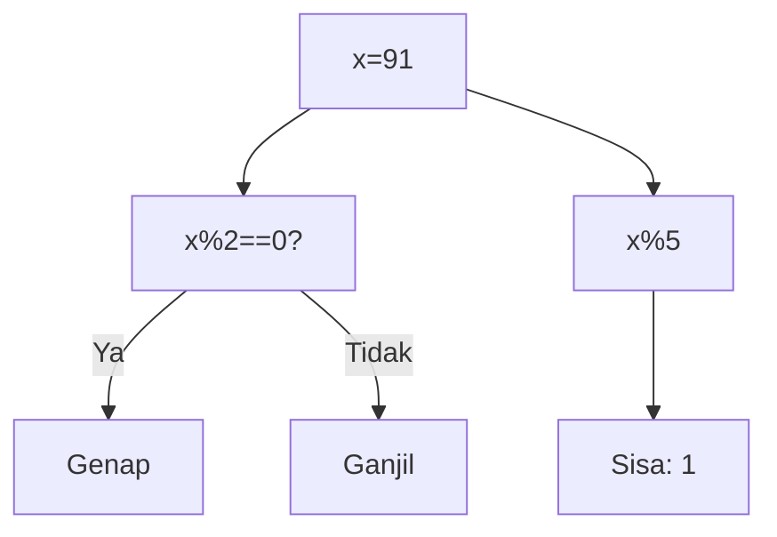
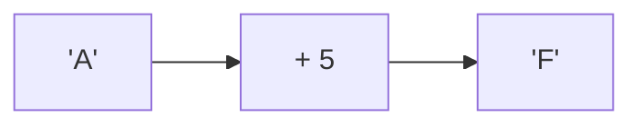
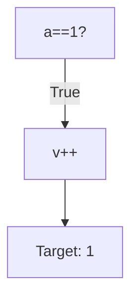
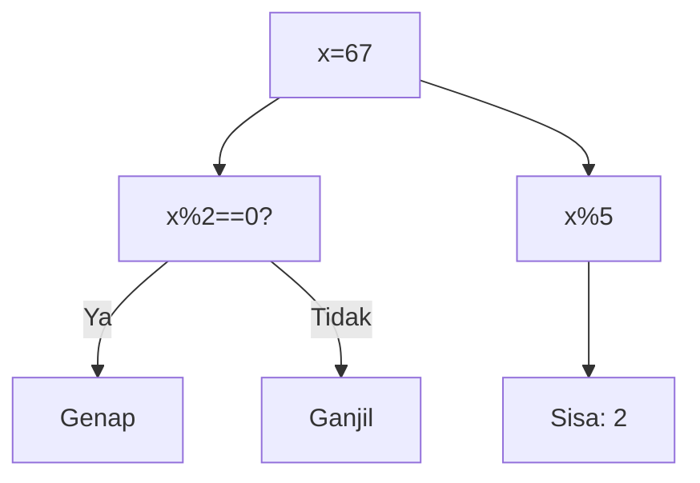
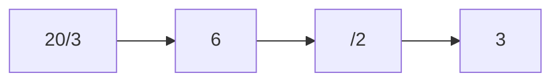
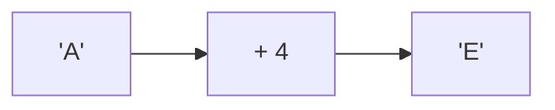
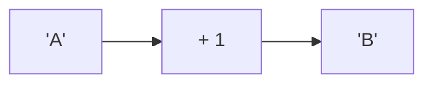
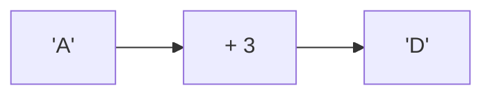
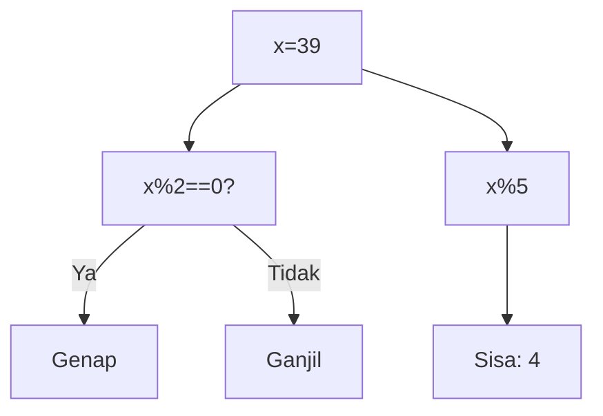
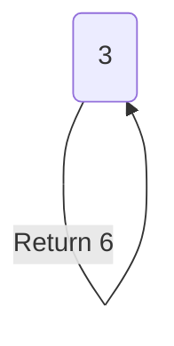

🔙 **[Kembali ke Daftar Soal](./README.md)**

---

# Latihan Soal Part C - Modul 02 - Set 01

### Soal 1
```cpp
int x = 91;
int res = x % 5;
```
**Pertanyaan:**
1. Berapakah hasil akhir dari variabel utama?
2. Jelaskan alur eksekusi kodenya!
3. Apa jebakan yang mungkin ada di soal ini?

**Jawaban & Diagnosis:**
1. **Hasil sudah tertera dalam diagnosis.**
2. **Lihat 'Langkah Tracing' di bawah.**
3. **Fokus pada aturan batin C++ (bukan matematika biasa).**

**Mermaid Flowchart:**


**📖 Penjelasan Komprehensif:**
**Langkah Tracing:**
1. Kita punya angka 91. Operator `% 2` mengecek sisa bagi dengan 2.
2. Karena 91 % 2 hasilnya 1, maka angka ini dikategorikan sebagai **Ganjil**.
3. Untuk `x % 5`, bayangkan membagi 91 kelereng ke 5 anak. Tiap anak dapat 18 biji, dan di tanganmu tersisa **1** kelereng yang tidak bisa dibagi rata. Itulah hasil Modulonya!

---
### Soal 2
```cpp
char c = 'A';
c = c + 5;
```
**Pertanyaan:**
1. Berapakah hasil akhir dari variabel utama?
2. Jelaskan alur eksekusi kodenya!
3. Apa jebakan yang mungkin ada di soal ini?

**Jawaban & Diagnosis:**
1. **Hasil sudah tertera dalam diagnosis.**
2. **Lihat 'Langkah Tracing' di bawah.**
3. **Fokus pada aturan batin C++ (bukan matematika biasa).**

**Mermaid Flowchart:**


**📖 Penjelasan Komprehensif:**
**Langkah Tracing:**
1. Karakter 'A' memiliki kode batin (ASCII) bernilai **65**.
2. C++ memperlakukan karakter sebagai angka. Operasi `65 + 5` menghasilkan nilai baru **70**.
3. Jika kita melihat tabel ASCII, angka 70 adalah identitas untuk huruf **'F'**. Jadi, variabel `result` sekarang menyimpan karakter tersebut.

---
### Soal 3
```cpp
int a = 1, v = 0;
if (a == 1 && ++v > 0) {}
```
**Pertanyaan:**
1. Berapakah hasil akhir dari variabel utama?
2. Jelaskan alur eksekusi kodenya!
3. Apa jebakan yang mungkin ada di soal ini?

**Jawaban & Diagnosis:**
1. **Hasil sudah tertera dalam diagnosis.**
2. **Lihat 'Langkah Tracing' di bawah.**
3. **Fokus pada aturan batin C++ (bukan matematika biasa).**

**Mermaid Flowchart:**


**📖 Penjelasan Komprehensif:**
**Langkah Tracing:**
1. Mesin mengecek syarat pertama: `a == 1`. Karena 1 adalah 1, syarat ini **TRUE**.
2. Karena konektornya `&&` (AND), mesin **WAJIB** lanjut mengecek syarat kedua.
3. Perintah `++v` dijalankan, sehingga `v` naik dari 0 menjadi **1**. Seluruh blok `if` pun dianggap berhasil.

---
### Soal 4
```cpp
int x = 67;
int res = x % 5;
```
**Pertanyaan:**
1. Berapakah hasil akhir dari variabel utama?
2. Jelaskan alur eksekusi kodenya!
3. Apa jebakan yang mungkin ada di soal ini?

**Jawaban & Diagnosis:**
1. **Hasil sudah tertera dalam diagnosis.**
2. **Lihat 'Langkah Tracing' di bawah.**
3. **Fokus pada aturan batin C++ (bukan matematika biasa).**

**Mermaid Flowchart:**


**📖 Penjelasan Komprehensif:**
**Langkah Tracing:**
1. Kita punya angka 67. Operator `% 2` mengecek sisa bagi dengan 2.
2. Karena 67 % 2 hasilnya 1, maka angka ini dikategorikan sebagai **Ganjil**.
3. Untuk `x % 5`, bayangkan membagi 67 kelereng ke 5 anak. Tiap anak dapat 13 biji, dan di tanganmu tersisa **2** kelereng yang tidak bisa dibagi rata. Itulah hasil Modulonya!

---
### Soal 5
```cpp
int a = 20, b = 3, c = 2;
int res = (a / b) / c;
```
**Pertanyaan:**
1. Berapakah hasil akhir dari variabel utama?
2. Jelaskan alur eksekusi kodenya!
3. Apa jebakan yang mungkin ada di soal ini?

**Jawaban & Diagnosis:**
1. **Hasil sudah tertera dalam diagnosis.**
2. **Lihat 'Langkah Tracing' di bawah.**
3. **Fokus pada aturan batin C++ (bukan matematika biasa).**

**Mermaid Flowchart:**


**📖 Penjelasan Komprehensif:**
**Langkah Tracing:**
1. Mesin membidik `a / b` (20 / 3). Hasil matematidnya adalah 6.67.
2. Karena bertipe `int`, C++ **membuang paksa** sisa desimalnya, sehingga `res1` menjadi 6.
3. Selanjutnya, `res1 / c` (6 / 2) dihitung. Hasil matematidnya 3.00.
4. Lagi-lagi komanya dipangkas habis, menyisakan `res2` bernilai 3. Inilah mengapa pembagian bulat sering menipu mata!

---
### Soal 6
```cpp
char c = 'A';
c = c + 4;
```
**Pertanyaan:**
1. Berapakah hasil akhir dari variabel utama?
2. Jelaskan alur eksekusi kodenya!
3. Apa jebakan yang mungkin ada di soal ini?

**Jawaban & Diagnosis:**
1. **Hasil sudah tertera dalam diagnosis.**
2. **Lihat 'Langkah Tracing' di bawah.**
3. **Fokus pada aturan batin C++ (bukan matematika biasa).**

**Mermaid Flowchart:**


**📖 Penjelasan Komprehensif:**
**Langkah Tracing:**
1. Karakter 'A' memiliki kode batin (ASCII) bernilai **65**.
2. C++ memperlakukan karakter sebagai angka. Operasi `65 + 4` menghasilkan nilai baru **69**.
3. Jika kita melihat tabel ASCII, angka 69 adalah identitas untuk huruf **'E'**. Jadi, variabel `result` sekarang menyimpan karakter tersebut.

---
### Soal 7
```cpp
char c = 'A';
c = c + 1;
```
**Pertanyaan:**
1. Berapakah hasil akhir dari variabel utama?
2. Jelaskan alur eksekusi kodenya!
3. Apa jebakan yang mungkin ada di soal ini?

**Jawaban & Diagnosis:**
1. **Hasil sudah tertera dalam diagnosis.**
2. **Lihat 'Langkah Tracing' di bawah.**
3. **Fokus pada aturan batin C++ (bukan matematika biasa).**

**Mermaid Flowchart:**


**📖 Penjelasan Komprehensif:**
**Langkah Tracing:**
1. Karakter 'A' memiliki kode batin (ASCII) bernilai **65**.
2. C++ memperlakukan karakter sebagai angka. Operasi `65 + 1` menghasilkan nilai baru **66**.
3. Jika kita melihat tabel ASCII, angka 66 adalah identitas untuk huruf **'B'**. Jadi, variabel `result` sekarang menyimpan karakter tersebut.

---
### Soal 8
```cpp
int a = 1, v = 0;
if (a == 1 && ++v > 0) {}
```
**Pertanyaan:**
1. Berapakah hasil akhir dari variabel utama?
2. Jelaskan alur eksekusi kodenya!
3. Apa jebakan yang mungkin ada di soal ini?

**Jawaban & Diagnosis:**
1. **Hasil sudah tertera dalam diagnosis.**
2. **Lihat 'Langkah Tracing' di bawah.**
3. **Fokus pada aturan batin C++ (bukan matematika biasa).**

**Mermaid Flowchart:**


**📖 Penjelasan Komprehensif:**
**Langkah Tracing:**
1. Mesin mengecek syarat pertama: `a == 1`. Karena 1 adalah 1, syarat ini **TRUE**.
2. Karena konektornya `&&` (AND), mesin **WAJIB** lanjut mengecek syarat kedua.
3. Perintah `++v` dijalankan, sehingga `v` naik dari 0 menjadi **1**. Seluruh blok `if` pun dianggap berhasil.

---
### Soal 9
```cpp
char c = 'A';
c = c + 3;
```
**Pertanyaan:**
1. Berapakah hasil akhir dari variabel utama?
2. Jelaskan alur eksekusi kodenya!
3. Apa jebakan yang mungkin ada di soal ini?

**Jawaban & Diagnosis:**
1. **Hasil sudah tertera dalam diagnosis.**
2. **Lihat 'Langkah Tracing' di bawah.**
3. **Fokus pada aturan batin C++ (bukan matematika biasa).**

**Mermaid Flowchart:**


**📖 Penjelasan Komprehensif:**
**Langkah Tracing:**
1. Karakter 'A' memiliki kode batin (ASCII) bernilai **65**.
2. C++ memperlakukan karakter sebagai angka. Operasi `65 + 3` menghasilkan nilai baru **68**.
3. Jika kita melihat tabel ASCII, angka 68 adalah identitas untuk huruf **'D'**. Jadi, variabel `result` sekarang menyimpan karakter tersebut.

---
### Soal 10
```cpp
int a = 1, v = 0;
if (a == 1 && ++v > 0) {}
```
**Pertanyaan:**
1. Berapakah hasil akhir dari variabel utama?
2. Jelaskan alur eksekusi kodenya!
3. Apa jebakan yang mungkin ada di soal ini?

**Jawaban & Diagnosis:**
1. **Hasil sudah tertera dalam diagnosis.**
2. **Lihat 'Langkah Tracing' di bawah.**
3. **Fokus pada aturan batin C++ (bukan matematika biasa).**

**Mermaid Flowchart:**


**📖 Penjelasan Komprehensif:**
**Langkah Tracing:**
1. Mesin mengecek syarat pertama: `a == 1`. Karena 1 adalah 1, syarat ini **TRUE**.
2. Karena konektornya `&&` (AND), mesin **WAJIB** lanjut mengecek syarat kedua.
3. Perintah `++v` dijalankan, sehingga `v` naik dari 0 menjadi **1**. Seluruh blok `if` pun dianggap berhasil.

---
### Soal 11
```cpp
char c = 'A';
c = c + 1;
```
**Pertanyaan:**
1. Berapakah hasil akhir dari variabel utama?
2. Jelaskan alur eksekusi kodenya!
3. Apa jebakan yang mungkin ada di soal ini?

**Jawaban & Diagnosis:**
1. **Hasil sudah tertera dalam diagnosis.**
2. **Lihat 'Langkah Tracing' di bawah.**
3. **Fokus pada aturan batin C++ (bukan matematika biasa).**

**Mermaid Flowchart:**


**📖 Penjelasan Komprehensif:**
**Langkah Tracing:**
1. Karakter 'A' memiliki kode batin (ASCII) bernilai **65**.
2. C++ memperlakukan karakter sebagai angka. Operasi `65 + 1` menghasilkan nilai baru **66**.
3. Jika kita melihat tabel ASCII, angka 66 adalah identitas untuk huruf **'B'**. Jadi, variabel `result` sekarang menyimpan karakter tersebut.

---
### Soal 12
```cpp
int x = 39;
int res = x % 5;
```
**Pertanyaan:**
1. Berapakah hasil akhir dari variabel utama?
2. Jelaskan alur eksekusi kodenya!
3. Apa jebakan yang mungkin ada di soal ini?

**Jawaban & Diagnosis:**
1. **Hasil sudah tertera dalam diagnosis.**
2. **Lihat 'Langkah Tracing' di bawah.**
3. **Fokus pada aturan batin C++ (bukan matematika biasa).**

**Mermaid Flowchart:**


**📖 Penjelasan Komprehensif:**
**Langkah Tracing:**
1. Kita punya angka 39. Operator `% 2` mengecek sisa bagi dengan 2.
2. Karena 39 % 2 hasilnya 1, maka angka ini dikategorikan sebagai **Ganjil**.
3. Untuk `x % 5`, bayangkan membagi 39 kelereng ke 5 anak. Tiap anak dapat 7 biji, dan di tanganmu tersisa **4** kelereng yang tidak bisa dibagi rata. Itulah hasil Modulonya!

---
### Soal 13
```cpp
int f(int n) {
  if (n==0) return 1;
  return n * f(n-1);
}
```
**Pertanyaan:**
1. Berapakah hasil akhir dari variabel utama?
2. Jelaskan alur eksekusi kodenya!
3. Apa jebakan yang mungkin ada di soal ini?

**Jawaban & Diagnosis:**
1. **Hasil sudah tertera dalam diagnosis.**
2. **Lihat 'Langkah Tracing' di bawah.**
3. **Fokus pada aturan batin C++ (bukan matematika biasa).**

**Mermaid Flowchart:**


**📖 Penjelasan Komprehensif:**
**Langkah Tracing:**
1. Fungsi rekursif memanggil dirinya sendiri secara berantai: f(3) -> f(2) -> ... -> f(0).
2. Setiap panggilan tertahan di 'Call Stack' (antrian).
3. Saat mencapai **Base Case** (f(0)), barulah nilai mulai dikalikan mundur satu persatu.
4. Operasi akhirnya membuahkan hasil **6**, dengan total **4 kali** pemanggilan fungsi.

---
### Soal 14
```cpp
int a = 1, v = 0;
if (a == 1 && ++v > 0) {}
```
**Pertanyaan:**
1. Berapakah hasil akhir dari variabel utama?
2. Jelaskan alur eksekusi kodenya!
3. Apa jebakan yang mungkin ada di soal ini?

**Jawaban & Diagnosis:**
1. **Hasil sudah tertera dalam diagnosis.**
2. **Lihat 'Langkah Tracing' di bawah.**
3. **Fokus pada aturan batin C++ (bukan matematika biasa).**

**Mermaid Flowchart:**


**📖 Penjelasan Komprehensif:**
**Langkah Tracing:**
1. Mesin mengecek syarat pertama: `a == 1`. Karena 1 adalah 1, syarat ini **TRUE**.
2. Karena konektornya `&&` (AND), mesin **WAJIB** lanjut mengecek syarat kedua.
3. Perintah `++v` dijalankan, sehingga `v` naik dari 0 menjadi **1**. Seluruh blok `if` pun dianggap berhasil.

---
### Soal 15
```cpp
int a = 20, b = 3, c = 2;
int res = (a / b) / c;
```
**Pertanyaan:**
1. Berapakah hasil akhir dari variabel utama?
2. Jelaskan alur eksekusi kodenya!
3. Apa jebakan yang mungkin ada di soal ini?

**Jawaban & Diagnosis:**
1. **Hasil sudah tertera dalam diagnosis.**
2. **Lihat 'Langkah Tracing' di bawah.**
3. **Fokus pada aturan batin C++ (bukan matematika biasa).**

**Mermaid Flowchart:**


**📖 Penjelasan Komprehensif:**
**Langkah Tracing:**
1. Mesin membidik `a / b` (20 / 3). Hasil matematidnya adalah 6.67.
2. Karena bertipe `int`, C++ **membuang paksa** sisa desimalnya, sehingga `res1` menjadi 6.
3. Selanjutnya, `res1 / c` (6 / 2) dihitung. Hasil matematidnya 3.00.
4. Lagi-lagi komanya dipangkas habis, menyisakan `res2` bernilai 3. Inilah mengapa pembagian bulat sering menipu mata!

---
### Soal 16
```cpp
char c = 'A';
c = c + 5;
```
**Pertanyaan:**
1. Berapakah hasil akhir dari variabel utama?
2. Jelaskan alur eksekusi kodenya!
3. Apa jebakan yang mungkin ada di soal ini?

**Jawaban & Diagnosis:**
1. **Hasil sudah tertera dalam diagnosis.**
2. **Lihat 'Langkah Tracing' di bawah.**
3. **Fokus pada aturan batin C++ (bukan matematika biasa).**

**Mermaid Flowchart:**


**📖 Penjelasan Komprehensif:**
**Langkah Tracing:**
1. Karakter 'A' memiliki kode batin (ASCII) bernilai **65**.
2. C++ memperlakukan karakter sebagai angka. Operasi `65 + 5` menghasilkan nilai baru **70**.
3. Jika kita melihat tabel ASCII, angka 70 adalah identitas untuk huruf **'F'**. Jadi, variabel `result` sekarang menyimpan karakter tersebut.

---
### Soal 17
```cpp
int a = 20, b = 3, c = 2;
int res = (a / b) / c;
```
**Pertanyaan:**
1. Berapakah hasil akhir dari variabel utama?
2. Jelaskan alur eksekusi kodenya!
3. Apa jebakan yang mungkin ada di soal ini?

**Jawaban & Diagnosis:**
1. **Hasil sudah tertera dalam diagnosis.**
2. **Lihat 'Langkah Tracing' di bawah.**
3. **Fokus pada aturan batin C++ (bukan matematika biasa).**

**Mermaid Flowchart:**


**📖 Penjelasan Komprehensif:**
**Langkah Tracing:**
1. Mesin membidik `a / b` (20 / 3). Hasil matematidnya adalah 6.67.
2. Karena bertipe `int`, C++ **membuang paksa** sisa desimalnya, sehingga `res1` menjadi 6.
3. Selanjutnya, `res1 / c` (6 / 2) dihitung. Hasil matematidnya 3.00.
4. Lagi-lagi komanya dipangkas habis, menyisakan `res2` bernilai 3. Inilah mengapa pembagian bulat sering menipu mata!

---
### Soal 18
```cpp
int f(int n) {
  if (n==0) return 1;
  return n * f(n-1);
}
```
**Pertanyaan:**
1. Berapakah hasil akhir dari variabel utama?
2. Jelaskan alur eksekusi kodenya!
3. Apa jebakan yang mungkin ada di soal ini?

**Jawaban & Diagnosis:**
1. **Hasil sudah tertera dalam diagnosis.**
2. **Lihat 'Langkah Tracing' di bawah.**
3. **Fokus pada aturan batin C++ (bukan matematika biasa).**

**Mermaid Flowchart:**


**📖 Penjelasan Komprehensif:**
**Langkah Tracing:**
1. Fungsi rekursif memanggil dirinya sendiri secara berantai: f(3) -> f(2) -> ... -> f(0).
2. Setiap panggilan tertahan di 'Call Stack' (antrian).
3. Saat mencapai **Base Case** (f(0)), barulah nilai mulai dikalikan mundur satu persatu.
4. Operasi akhirnya membuahkan hasil **6**, dengan total **4 kali** pemanggilan fungsi.

---
### Soal 19
```cpp
int f(int n) {
  if (n==0) return 1;
  return n * f(n-1);
}
```
**Pertanyaan:**
1. Berapakah hasil akhir dari variabel utama?
2. Jelaskan alur eksekusi kodenya!
3. Apa jebakan yang mungkin ada di soal ini?

**Jawaban & Diagnosis:**
1. **Hasil sudah tertera dalam diagnosis.**
2. **Lihat 'Langkah Tracing' di bawah.**
3. **Fokus pada aturan batin C++ (bukan matematika biasa).**

**Mermaid Flowchart:**


**📖 Penjelasan Komprehensif:**
**Langkah Tracing:**
1. Fungsi rekursif memanggil dirinya sendiri secara berantai: f(3) -> f(2) -> ... -> f(0).
2. Setiap panggilan tertahan di 'Call Stack' (antrian).
3. Saat mencapai **Base Case** (f(0)), barulah nilai mulai dikalikan mundur satu persatu.
4. Operasi akhirnya membuahkan hasil **6**, dengan total **4 kali** pemanggilan fungsi.

---
### Soal 20
```cpp
char c = 'A';
c = c + 4;
```
**Pertanyaan:**
1. Berapakah hasil akhir dari variabel utama?
2. Jelaskan alur eksekusi kodenya!
3. Apa jebakan yang mungkin ada di soal ini?

**Jawaban & Diagnosis:**
1. **Hasil sudah tertera dalam diagnosis.**
2. **Lihat 'Langkah Tracing' di bawah.**
3. **Fokus pada aturan batin C++ (bukan matematika biasa).**

**Mermaid Flowchart:**


**📖 Penjelasan Komprehensif:**
**Langkah Tracing:**
1. Karakter 'A' memiliki kode batin (ASCII) bernilai **65**.
2. C++ memperlakukan karakter sebagai angka. Operasi `65 + 4` menghasilkan nilai baru **69**.
3. Jika kita melihat tabel ASCII, angka 69 adalah identitas untuk huruf **'E'**. Jadi, variabel `result` sekarang menyimpan karakter tersebut.

---
### Soal 21
```cpp
int x = 81;
int res = x % 5;
```
**Pertanyaan:**
1. Berapakah hasil akhir dari variabel utama?
2. Jelaskan alur eksekusi kodenya!
3. Apa jebakan yang mungkin ada di soal ini?

**Jawaban & Diagnosis:**
1. **Hasil sudah tertera dalam diagnosis.**
2. **Lihat 'Langkah Tracing' di bawah.**
3. **Fokus pada aturan batin C++ (bukan matematika biasa).**

**Mermaid Flowchart:**
```mermaid
graph TD
A["x=81"] --> B["x%2==0?"]
B -- Ya --> C["Genap"]
B -- Tidak --> D["Ganjil"]
A --> E["x%5"]
E --> F["Sisa: 1"]
```

**📖 Penjelasan Komprehensif:**
**Langkah Tracing:**
1. Kita punya angka 81. Operator `% 2` mengecek sisa bagi dengan 2.
2. Karena 81 % 2 hasilnya 1, maka angka ini dikategorikan sebagai **Ganjil**.
3. Untuk `x % 5`, bayangkan membagi 81 kelereng ke 5 anak. Tiap anak dapat 16 biji, dan di tanganmu tersisa **1** kelereng yang tidak bisa dibagi rata. Itulah hasil Modulonya!

---
### Soal 22
```cpp
int x = 90;
int res = x % 5;
```
**Pertanyaan:**
1. Berapakah hasil akhir dari variabel utama?
2. Jelaskan alur eksekusi kodenya!
3. Apa jebakan yang mungkin ada di soal ini?

**Jawaban & Diagnosis:**
1. **Hasil sudah tertera dalam diagnosis.**
2. **Lihat 'Langkah Tracing' di bawah.**
3. **Fokus pada aturan batin C++ (bukan matematika biasa).**

**Mermaid Flowchart:**
```mermaid
graph TD
A["x=90"] --> B["x%2==0?"]
B -- Ya --> C["Genap"]
B -- Tidak --> D["Ganjil"]
A --> E["x%5"]
E --> F["Sisa: 0"]
```

**📖 Penjelasan Komprehensif:**
**Langkah Tracing:**
1. Kita punya angka 90. Operator `% 2` mengecek sisa bagi dengan 2.
2. Karena 90 % 2 hasilnya 0, maka angka ini dikategorikan sebagai **Genap**.
3. Untuk `x % 5`, bayangkan membagi 90 kelereng ke 5 anak. Tiap anak dapat 18 biji, dan di tanganmu tersisa **0** kelereng yang tidak bisa dibagi rata. Itulah hasil Modulonya!

---
### Soal 23
```cpp
int x = 44;
int res = x % 5;
```
**Pertanyaan:**
1. Berapakah hasil akhir dari variabel utama?
2. Jelaskan alur eksekusi kodenya!
3. Apa jebakan yang mungkin ada di soal ini?

**Jawaban & Diagnosis:**
1. **Hasil sudah tertera dalam diagnosis.**
2. **Lihat 'Langkah Tracing' di bawah.**
3. **Fokus pada aturan batin C++ (bukan matematika biasa).**

**Mermaid Flowchart:**
```mermaid
graph TD
A["x=44"] --> B["x%2==0?"]
B -- Ya --> C["Genap"]
B -- Tidak --> D["Ganjil"]
A --> E["x%5"]
E --> F["Sisa: 4"]
```

**📖 Penjelasan Komprehensif:**
**Langkah Tracing:**
1. Kita punya angka 44. Operator `% 2` mengecek sisa bagi dengan 2.
2. Karena 44 % 2 hasilnya 0, maka angka ini dikategorikan sebagai **Genap**.
3. Untuk `x % 5`, bayangkan membagi 44 kelereng ke 5 anak. Tiap anak dapat 8 biji, dan di tanganmu tersisa **4** kelereng yang tidak bisa dibagi rata. Itulah hasil Modulonya!

---
### Soal 24
```cpp
int x = 72;
int res = x % 5;
```
**Pertanyaan:**
1. Berapakah hasil akhir dari variabel utama?
2. Jelaskan alur eksekusi kodenya!
3. Apa jebakan yang mungkin ada di soal ini?

**Jawaban & Diagnosis:**
1. **Hasil sudah tertera dalam diagnosis.**
2. **Lihat 'Langkah Tracing' di bawah.**
3. **Fokus pada aturan batin C++ (bukan matematika biasa).**

**Mermaid Flowchart:**
```mermaid
graph TD
A["x=72"] --> B["x%2==0?"]
B -- Ya --> C["Genap"]
B -- Tidak --> D["Ganjil"]
A --> E["x%5"]
E --> F["Sisa: 2"]
```

**📖 Penjelasan Komprehensif:**
**Langkah Tracing:**
1. Kita punya angka 72. Operator `% 2` mengecek sisa bagi dengan 2.
2. Karena 72 % 2 hasilnya 0, maka angka ini dikategorikan sebagai **Genap**.
3. Untuk `x % 5`, bayangkan membagi 72 kelereng ke 5 anak. Tiap anak dapat 14 biji, dan di tanganmu tersisa **2** kelereng yang tidak bisa dibagi rata. Itulah hasil Modulonya!

---
### Soal 25
```cpp
int x = 72;
int res = x % 5;
```
**Pertanyaan:**
1. Berapakah hasil akhir dari variabel utama?
2. Jelaskan alur eksekusi kodenya!
3. Apa jebakan yang mungkin ada di soal ini?

**Jawaban & Diagnosis:**
1. **Hasil sudah tertera dalam diagnosis.**
2. **Lihat 'Langkah Tracing' di bawah.**
3. **Fokus pada aturan batin C++ (bukan matematika biasa).**

**Mermaid Flowchart:**
```mermaid
graph TD
A["x=72"] --> B["x%2==0?"]
B -- Ya --> C["Genap"]
B -- Tidak --> D["Ganjil"]
A --> E["x%5"]
E --> F["Sisa: 2"]
```

**📖 Penjelasan Komprehensif:**
**Langkah Tracing:**
1. Kita punya angka 72. Operator `% 2` mengecek sisa bagi dengan 2.
2. Karena 72 % 2 hasilnya 0, maka angka ini dikategorikan sebagai **Genap**.
3. Untuk `x % 5`, bayangkan membagi 72 kelereng ke 5 anak. Tiap anak dapat 14 biji, dan di tanganmu tersisa **2** kelereng yang tidak bisa dibagi rata. Itulah hasil Modulonya!

---
