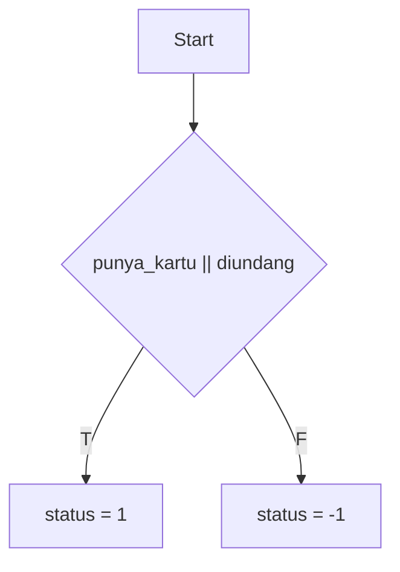
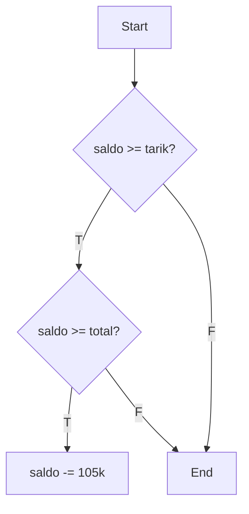
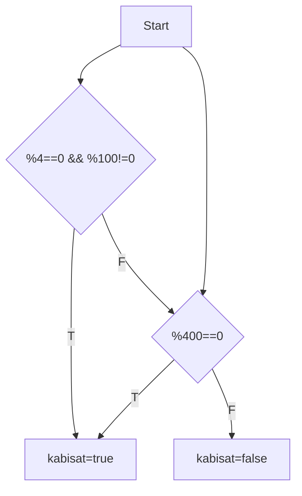
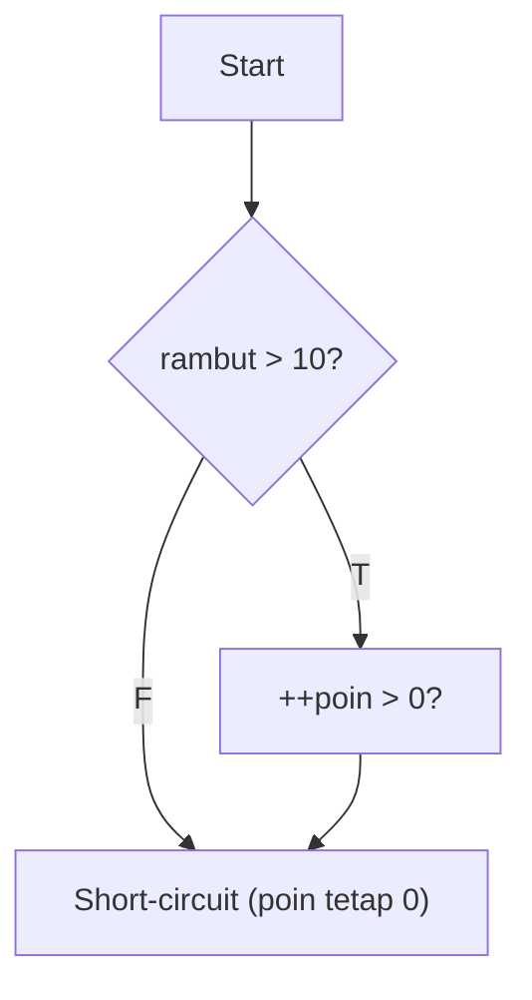
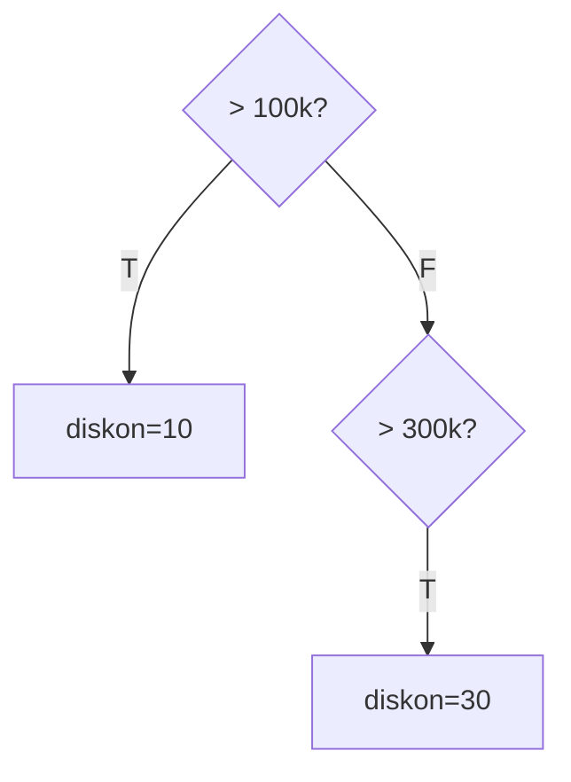
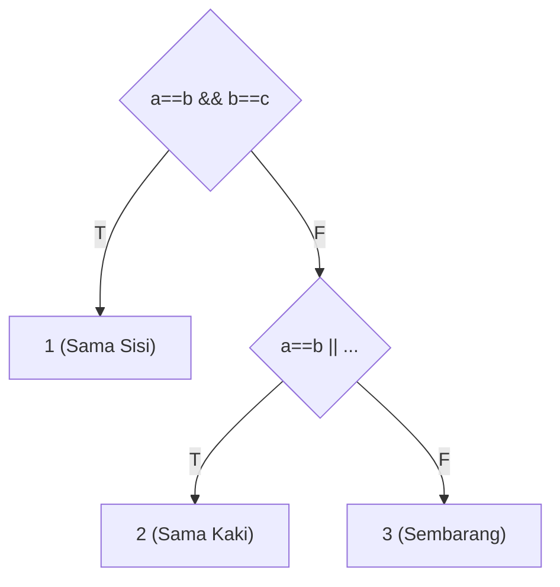
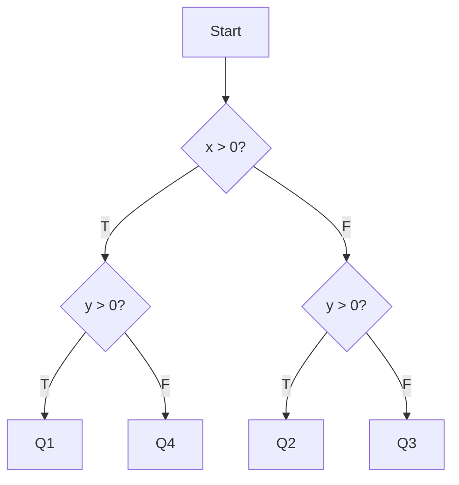
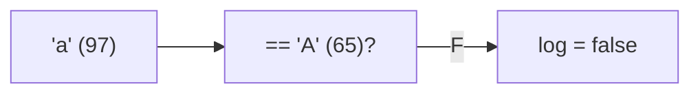
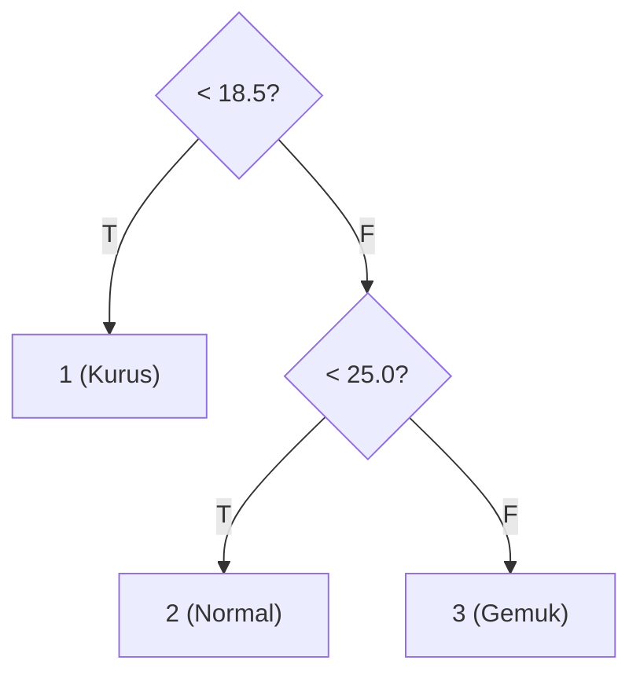
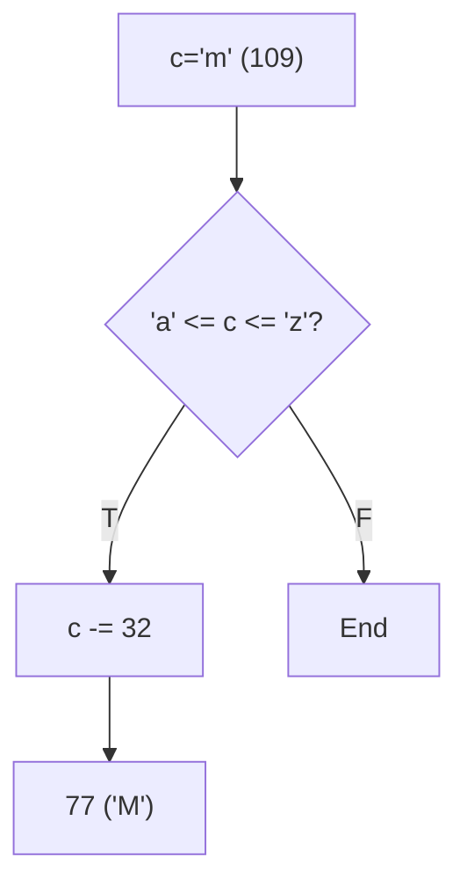

		🔙 **[Kembali ke Daftar Soal](./README.md)**

---

# Latihan Soal Part C - Modul 02 - Set 01 (Premium Edition)

> [!TIP]
> Fokus pada **Short-circuit Evaluation** (`&&` dan `||`). Ingat: Jika hasil akhir sudah pasti, C++ akan "malas" mengevaluasi bagian berikutnya!

---

### Soal 1: Gerbang Keamanan (Basic If-Else)
```cpp
// Skenario: Masuk komplek hanya jika punya kartu ATAU diundang
bool punya_kartu = false;
bool diundang = true;
int status = 0;

if (punya_kartu || diundang) {
    status = 1;
} else {
    status = -1;
}
```
**Pertanyaan:**
1. Berapakah nilai akhir `status`?
2. Apa yang sebenarnya terjadi di dalam mesin saat mengevaluasi `||` (OR)?

<details>
<summary><b>Klik untuk Lihat Jawaban & Diagnosis</b></summary>

**Mermaid Flowchart:**


**Jawaban:**
1. **1**
2. Karena `diundang` bernilai true, maka seluruh kondisi `if` menjadi true.

**📖 Analisis Mendalam (Step-by-Step):**
1. **Evaluasi Kondisi OR (`||`)**: Operator logika OR (`||`) akan bernilai `true` (benar) jika **salah satu atau kedua** kondisinya bernilai `true`. Dalam kasus ini, mesin mengevaluasi ekspresi `punya_kartu || diundang` (yaitu `false || true`).
2. **Short-Circuit Evaluation**: Ketika C++ mengecek sisi kiri (`punya_kartu = false`), mesin belum dapat menyimpulkan hasil akhirnya, sehingga ia harus mengecek sisi kanan (`diundang = true`). Karena salah satu kondisi bernilai `true`, maka keseluruhan ekspresi ini dievaluasi sebagai `true`.
3. **Eksekusi Blok If**: Karena kondisi secara keseluruhan bernilai `true`, mesin akan mengeksekusi blok kode di dalam kurung kurawal `if`, yaitu mengubah nilai `status` menjadi `1`. Blok `else` akan dilewati sepenuhnya.
4. **Kesimpulan**: C++ akan menjalankan perintah `status = 1`, sehingga nilai akhir variabel tersebut adalah **1**.
</details>

---

### Soal 2: Tarik Tunai (Nested If)
```cpp
// Skenario: Ambil uang 100rb, saldo 150rb, biaya admin 5rb
int saldo = 150000;
int tarik = 100000;
int biaya = 5000;

if (saldo >= tarik) {
    if (saldo >= (tarik + biaya)) {
        saldo -= (tarik + biaya);
    }
}
```
**Pertanyaan:**
1. Berapakah nilai `saldo` akhir?
2. Mengapa ada pemeriksaan `if` kedua di dalam `if` pertama?

<details>
<summary><b>Klik untuk Lihat Jawaban & Diagnosis</b></summary>

**Mermaid Flowchart:**


**Jawaban:**
1. **45000**
2. Untuk memastikan saldo mencukupi penarikan **sekaligus** biaya administrasinya.

**📖 Analisis Mendalam (Step-by-Step):**
1. **Pengecekan If Pertama (Lapis Luar)**: Mesin pertama kali mengevaluasi kondisi `saldo >= tarik` (yaitu `150000 >= 100000`). Karena pernyataan ini benar (`true`), mesin akan masuk ke dalam blok `if` yang pertama.
2. **Pengecekan If Kedua (Lapis Dalam / Nested If)**: Di dalam blok pertama, mesin dihadapkan pada prasyarat kedua, yaitu `saldo >= (tarik + biaya)`. Ekspresi ini dievaluasi menjadi `150000 >= (100000 + 5000)`. Karena `150000 >= 105000` juga benar (`true`), eksekusi dilanjutkan ke baris pemotongan saldo.
3. **Pemrosesan Aritmetika**: Mesin kemudian mengeksekusi operasi `saldo -= (tarik + biaya);`, yang ekuivalen dengan `saldo = 150000 - 105000`. Hasil pengurangan ini adalah **45000**.
4. **Mengapa Menggunakan If Bersarang (Nested If)?**: Pendekatan ini dilakukan untuk memvalidasi secara bertahap. Pengecekan pertama memastikan saldo cukup untuk penarikan pokok, sedangkan pengecekan kedua memastikan saldo masih cukup setelah ditambah potongan biaya administrasi. Hal ini mencegah saldo menjadi negatif secara tidak wajar (*overdraft*).
</details>

---

### Soal 3: Tahun Kabisat (Complex Boolean)
```cpp
// Skenario: Cek tahun 2100
int tahun = 2100;
bool kabisat = false;

if ((tahun % 4 == 0 && tahun % 100 != 0) || (tahun % 400 == 0)) {
    kabisat = true;
}
```
**Pertanyaan:**
1. Berapakah nilai `kabisat` (true/false)?
2. Mengapa angka **2100** sering menjebak dalam logika ini?

<details>
<summary><b>Klik untuk Lihat Jawaban & Diagnosis</b></summary>

**Mermaid Flowchart:**


**Jawaban:**
1. **false** (0)
2. Karena 2100 habis dibagi 4, tapi juga habis dibagi 100, sementara ia **tidak** habis dibagi 400.

**📖 Analisis Mendalam (Step-by-Step):**
1. **Aturan Tahun Kabisat**: Tahun kabisat adalah tahun yang habis dibagi 4 KECUALI jika tahun tersebut adalah awal abad (kelipatan 100), kecuali jika tahun abad tersebut juga habis dibagi 400. Dalam kode, ini diekspresikan sebagai: `(tahun % 4 == 0 && tahun % 100 != 0) || (tahun % 400 == 0)`.
2. **Evaluasi Blok Pertama (Kiri OR)**: Mesin mengevaluasi `(2100 % 4 == 0 && 2100 % 100 != 0)`.
   - `2100 % 4 == 0` bernilai `true` (2100 habis dibagi 4).
   - `2100 % 100 != 0` bernilai `false` (karena 2100 habis dibagi 100, sisanya 0).
   - Operator logika AND (`&&`) mensyaratkan keduanya harus `true`. Karena ada nilai `false`, blok kiri ini secara keseluruhan bernilai `false`.
3. **Evaluasi Blok Kedua (Kanan OR)**: Karena blok kiri `false`, mesin memproses blok di sebelah kanan operator OR (`||`), yaitu `(2100 % 400 == 0)`.
   - `2100 / 400` adalah 5 sisa 100. Jadi, `2100 % 400 == 0` bernilai `false`.
4. **Hasil Akhir**: Karena blok kiri (`false`) OR blok kanan (`false`), maka hasil akhir perbandingannya adalah `false`.
5. **Kesimpulan Eksekusi**: Karena ekspresi kondisi bernilai `false`, program tidak akan masuk ke dalam blok `if`. Nilai `kabisat` tetap pada nilai inisialisasinya, yaitu **`false`** (direpresentasikan sebagai `0` dalam integer). Angka awal abad seperti 2100 sering digunakan dalam soal OSN karena menguji kewaspadaan peserta terhadap pengecualian kasus pembagian 100 dan 400.
</details>

---

### Soal 4: Razia BP (Short-circuit Evaluation)
```cpp
// Skenario: Razia rambut. Jika panjang, poin pelanggaran naik.
int rambut_cm = 15;
int poin = 0;

if (rambut_cm > 10 && ++poin > 0) {
    // Berhasil masuk razia
}
```
**Pertanyaan:**
1. Berapakah nilai `poin` akhir?
2. Jika `rambut_cm = 5`, berapakah nilai `poin`? (Hati-hati!)

<details>
<summary><b>Klik untuk Lihat Jawaban & Diagnosis</b></summary>

**Mermaid Flowchart:**


**Jawaban:**
1. **1**
2. **0** (Poin tidak bertambah!)

**📖 Analisis Mendalam (Step-by-Step):**
1. **Konsep Short-circuit Evaluation**: Dalam bahasa C++, ekspresi yang dihubungkan dengan operator AND (`&&`) dievaluasi dari kiri ke kanan. Jika komponen sebelah kiri telah bernilai `false`, maka seluruh pernyataan pasti akan mengevaluasi menjadi `false`, terlepas dari apa pun nilai di sisi kanan. Untuk menghemat kinerja sistem, C++ akan langsung memberhentikan evaluasi (*short-circuit*).
2. **Evaluasi Skenario Normal (`rambut_cm = 15`)**:
   - `15 > 10` bernilai `true`. Karena komponen kiri bernilai benar, mesin wajib mengecek komponen sebelah kanannya.
   - Komponen kanan adalah `++poin > 0`. Eksekusi Operator `++` (Pre-increment) membuat nilai `poin` bertambah menjadi `1` terlebih dahulu, lalu dibandingkan (`1 > 0`), yang mana bernilai `true`.
   - Hasil akhir: Kondisi dipenuhi, dan variabel `poin` telah dimodifikasi secara permanen di memori menjadi `1`.
3. **Evaluasi Skenario Variasi (`rambut_cm = 5`)**:
   - `5 > 10` bernilai `false`.
   - Menyadari hal ini, mekanisme **Short-circuit** aktif. C++ tidak akan pernah membaca, menyentuh, atau memproses instruksi `++poin > 0` di sebelah kanannya.
   - Hasil akhir: Blok `if` gagal dieksekusi, dan nilai variabel `poin` tetap murni bernilai awal, yaitu **`0`**. Hal ini merupakan perangkat jebakan klasik dalam kompetisi pemrograman yang menguji pemahaman pengawasan memori dan eksekusi kompilator.
</details>

---

### Soal 5: Diskon Bertingkat (Else-If Order)
```cpp
// Skenario: Diskon member. Total belanja 200rb.
int belanja = 200000;
int diskon = 0;

if (belanja > 100000) diskon = 10;
else if (belanja > 300000) diskon = 30;
```
**Pertanyaan:**
1. Berapakah nilai `diskon` akhir?
2. Apa yang salah dengan urutan `if` di atas?

<details>
<summary><b>Klik untuk Lihat Jawaban & Diagnosis</b></summary>

**Mermaid Flowchart:**


**Jawaban:**
1. **10**
2. Urutan pengecekan terbalik. Angka 100rb "memakan" angka yang lebih besar.

**📖 Analisis Mendalam (Step-by-Step):**
1. **Prinsip Ekspresi Percabangan**: Pernyataan `if ... else if` bekerja berdasarkan urutan sekuensial (dari atas ke bawah). C++ akan mengevaluasi satu per satu kondisi tersebut. Begitu ia menemukan kondisi pertama yang bernilai logis `true`, mesin akan mengeksekusi blok kode di dalam rentang tersebut dan **mengabaikan semua** pernyataan `else if` atau `else` di bawahnya, terlepas dari apakah kondisi di bawahnya juga berlaku (*true*).
2. **Penelusuran Kondisi (Tracing)**:
   - Kondisi baris pertama: `belanja > 100000`. Nilai `200000 > 100000` bernilai `true`.
   - Karena syarat pertama telah terpenuhi, C++ akan menjalankan instruksi `diskon = 10`.
   - Setelah penugasan berhasil, blok kondisi struktur percabangan dianggap telah tuntas. C++ langsung keluar melompati keseluruhan rentang baris `else if` lainnya tanpa melakukan pengecekan lanjutan.
3. **Kelemahan Logika (Bug Analysis)**: Urutan pembarisan ekspresi `if` ini memiliki celah kesalahan struktural yang serius jika kita mengharapkan pelanggan dengan belanja besar (misalnya, mencapai 400.000) untuk mendapatkan diskon 30. Karena 400.000 sudah pasti lebih besar dari 100.000, mesin otomatis akan membayarkan diskon yang lebih kecil (hanya 10) di baris pertama dan langsung memberhentikan cek bertingkat selanjutnya.
4. **Kesimpulan Praktik Edukatif**: Untuk membangun diskon model bertingkat dengan operator "lebih besar dari" (`>`), para programmer (pemrogram) disarankan mengurutkan validasi ambang batas tertinggi/tersulit terlebih dahulu di awal blok `if` yang teratas.
</details>

---

### Soal 6: Jenis Segitiga (Equality Logic)
```cpp
int a=5, b=5, c=5;
int jenis = 0; // 1: Sama sisi, 2: Sama kaki, 3: Sembarang

if (a == b && b == c) jenis = 1;
else if (a == b || b == c || a == c) jenis = 2;
else jenis = 3;
```
**Pertanyaan:**
1. Berapakah nilai `jenis`?
2. Jika `a=5, b=5, c=7`, berapakah nilai `jenis`?

<details>
<summary><b>Klik untuk Lihat Jawaban & Diagnosis</b></summary>

**Mermaid Flowchart:**


**Jawaban:**
1. **1**
2. **2**

**📖 Analisis Mendalam (Step-by-Step):**
1. **Analisis Skenario Pertama (`a=5`, `b=5`, `c=5`)**:
   - Pengecekan pada kondisi lapis pertama: `if (a == b && b == c)`. 
   - Karena `5 == 5` adalah `true`, dan `5 == 5` kedua juga `true`, pernyataan AND (`&&`) bernilai `true`.
   - Variabel `jenis` menyimpan nilai `1` (mengindikasikan Segitiga Sama Sisi). Setelah ini, percabangan selesai, sub-kondisi di bawahnya tidak akan dieksekusi oleh mesin kompilator.
2. **Analisis Skenario Kedua (`a=5`, `b=5`, `c=7`)**:
   - Pengecekan pada kondisi lapis pertama: `if (5 == 5 && 5 == 7)`. Karena `5 == 7` adalah `false`, maka seluruh ikatan logika AND bernilai `false`. C++ tidak akan mengeksekusi `jenis = 1` dan bergerak turun ke bawah (ke blok `else if`).
   - Pengecekan `else if` lapis kedua: `(a == b || b == c || a == c)`.
   - Mesin menghitung `5 == 5` bernilai `true`. Berkat karakteristik *Short-circuit Evaluation* pada operator OR (`||`), karena ia sudah mendeteksi satu kebenaran (`true`), instruksi selanjutnya (yakni membandingkan `b == c` dan `a == c`) langsung diabaikan.
   - Seluruh blok `else if` ini bernilai `true`, sehingga variabel `jenis` ditugaskan mengambil nilai `2` (Segitiga Sama Kaki).
3. **Struktur Logika Berjenjang**: Cara pemecahan persoalan C++ ini merepresentasikan kaidah penulisan logika hirarkis yang rapi dan benar. Program menguji kondisi yang berikatan paling spesifik dan terketat lebih dahulu (semua sisi identik), perlahan mengurai prasyarat yang lebih fleksibel di baris setelahnya (minimal sepasang sisi setara), hingga akhirnya mengalokasikan wadah sisa penutup `else` mutlak untuk ragam nilai yang tidak berpola berwujud (Segitiga Sembarang).
</details>

---

### Soal 7: Kuadran Koordinat (Sign Logic)
```cpp
int x = -5, y = 10;
int kuadran = 0;

if (x > 0) {
    if (y > 0) kuadran = 1;
    else kuadran = 4;
} else {
    if (y > 0) kuadran = 2;
    else kuadran = 3;
}
```
**Pertanyaan:**
1. Di `kuadran` manakah titik tersebut berada?
2. Gambarkan alur pikirnya secara singkat!

<details>
<summary><b>Klik untuk Lihat Jawaban & Diagnosis</b></summary>

**Mermaid Flowchart:**


**Jawaban:**
1. **2**
**📖 Analisis Mendalam (Step-by-Step):**
1. **Evaluasi Percabangan Utama (Sumbu-X)**:
   - Baris pertama mengevaluasi nilai absis koordinat `if (x > 0)`.
   - Mengingat bahwa memori mencatat nilai mula `x = -5`, maka relasi komparasi `-5 > 0` divalidasi bernilai `false`.
   - Hal ini menstrukturkan C++ untuk melewati seluruh blok instruksi pada bagian `if` utama dan beralih mengarahkan aliran logika program untuk melompat memasuki kawasan baris pelindung `else` terluar.
2. **Evaluasi Percabangan Bersarang (Sumbu-Y di Blok Else)**:
   - Setelah masuk ke dalam badan bagian `else` (yang menandakan prasyarat absolut `x <= 0`), kompilator menemukan tantangan validasi bersarang (*Nested Condition*) baru: `if (y > 0)`.
   - Nilai ordinat memori diinisialisasikan `y = 10`. Perbandingan `10 > 0` pastinya mengembalikan nilai pias logis berupa representasi parameter aktual `true`.
   - Mesin C++ diizinkan menelusuri blok instruksi bersarang tersebut, lantas menghibahkan operasi penugasan nilai statis `kuadran = 2` ke alokasi memori pengikat identitas variabel penyimpan tujuan.
3. **Pemosisi Konseptualitas Geometris Aljabar (Interpretasi)**: Dalam diagram kartesian baku, sebuah titik berkoordinat absis angka negatif (artinya terposisikan mundur ke sisi kiri sumbu mendatar) dan berkoordinat sumbu ordinat mutlak positif (bergerak vertikal mengangkat naik) senantiasa menempati dimensi spasial geometris **Kuadran II**. Algoritma berantai hierarki lapis bersarang semacam ini lazim dikerahkan guna mengklasifikasikan analisis pengujian uji kondisi gabungan komprehensif di dunia analitik Informatika dasar pengenalan struktur keputusan ganda dimensi ganda.
</details>

---

### Soal 8: Login Case Sensitive (String Simulation)
```cpp
char user_input = 'a';
char user_db = 'A';
bool log = false;

if (user_input == user_db) log = true;
```
**Pertanyaan:**
1. Apakah `log` bernilai true?
2. Mengapa 'a' dan 'A' dianggap berbeda oleh mesin?

<details>
<summary><b>Klik untuk Lihat Jawaban & Diagnosis</b></summary>

**Mermaid Flowchart:**


**Jawaban:**
1. **false**
2. Karena nilai ASCII-nya berbeda ('a'=97, 'A'=65).

**📖 Analisis Mendalam (Step-by-Step):**
1. **Mekanisme Penyimpanan Karakter pada C++**: Bahasa komputasional C++ sejatinya tidak mengenali representasi grafis visual alfabet secara murni fisis pergerakan tipe rupa tulisan huruf. Ia memetakan pola pembentukan tiap karakter memori tekstual (`char`) menjadi sebuah bilangan biner konstan berskala 8-bit yang nilainya dipatok ekuivalen padanannya menurut penataan konvensi baku rujukan relasional tabel internasional numerik konversi standar bernama **ASCII** (*American Standard Code for Information Interchange*).
2. **Analisis Deklarasi Nilai Index ASCII**:
   - Variabel `user_input` memuat format representasi abjad mungil berukuran huruf kecil `'a'`. Pada saat fase proses translasi pita biner kompilator memori, memori parameter ikon grafis alfabet literal huruf penjelmaan gubah abjad rupa kecil tersebut dikonversikan pada nominal mutlak indeks dasar kaku utuh stabilitas nilai absolut angka konstan, yaitu **97**.
   - Variabel penyimpanan `user_db` diisi huruf alfabet dengan takaran visual rupa besar berukuran kapital huruf `'A'`. Di kedalaman kode representasional, indeks memori tersebut bernaung pada takaran memori biner ekuivalen angka konstan dasar yang tervalidasi mutlak tegak statis merupa nilai kuantitas bernominal **65**.
3. **Evaluasi Operator Persamaan (`==`)**:
   - Baris ekspresi logika tersebut memunculkan tahap *Statement Comparator Equality* yaitu mengecek secara identikal: `if (user_input == user_db)`. Mesin menterjemahkannya dalam rasio utuh murni `if (97 == 65)`.
   - Karena perbandingan komparatif tersebut menyimpulkan hasil pertarungan rasio penggal parameter komputasi penolakan gagal, C++ menghasilkan wujud tipe dasar Boolean absolut statis `false`.
   - Kesimpulan eksekutor mutakhir: mesin bakal pasif terdiam, mengabaikan gerbang dalam ruang memori logis di atas parameter validasi `if`. Akibatnya operasi statis merubah nilai pada awal variabel konstan memori dasar penanda kelulusan berwujud rasional fana keping variabel relia `log` tidak diutak atik, menahan mutlak hasil di nilainya semula, yaitu murni **`false`**. Prinsip pengenalan sifat sensitivitas alfabet berdasarkan karakter beda ukuran nilai besar-kecil inilah yang secara teori ilmiah merupa pilar sakral sandi pembangun utama arsitektur keamanan sandi dan fondasi parameter **Case Sensitivity** pada kaidah sains identifikasi kata sandi di arsitektur algoritme pemrograman logikal modern.
</details>

---

### Soal 9: Klasifikasi BMI (Nested Else-If)
```cpp
double bmi = 24.5;
int cat = 0; // 1: Kurus, 2: Normal, 3: Gemuk

if (bmi < 18.5) cat = 1;
else if (bmi < 25.0) cat = 2;
else cat = 3;
```
**Pertanyaan:**
1. Berapakah nilai `cat`?
2. Apa keuntungan menggunakan `else if` dibanding banyak `if` terpisah?

<details>
<summary><b>Klik untuk Lihat Jawaban & Diagnosis</b></summary>

**Mermaid Flowchart:**


**Jawaban:**
1. **2**
2. **Efisiensi**. Begitu satu syarat terpenuhi, mesin langsung melompat ke akhir blok tanpa mengecek syarat lainnya.

**📖 Analisis Mendalam (Step-by-Step):**
1. **Analisis Tata Jalur Eksekusi (Sequential Execution)**: Kompilator arsitektur mesin mendeteksi isi nilai tipe numerik memori fraksional desimal inisial variabel `bmi` adalah serapan bernilai `24.5`. Karena alur kode menggunakan pola hierarki *If-Else-If Ladder* (Percabangan Bertingkat), C++ mutlak diwajibkan memeriksa satu demi satu runtutan syarat pengkondisian perbandingan relasional secara sistematis disiplin dari struktur teratas hingga mendapati kecocokan titik kebenaran valid (`true`) yang pertama.
2. **Verifikasi Tahap Pertama (`if` Blok 1)**:
   - Uji komparasi logis: `if (24.5 < 18.5)`. 
   - Evaluasi: Pernyataan matematis perbandingan ini melenceng (*false*), karena 24.5 secara rasional faktual lebih tinggi, tidak terkompensasi melengkapi jangkauan ambang batasan kecil *underweight*. Eksekutor C++ menolak mengeksekusi penetapan fungsi masuk ini dan melompat memeriksa kondisi di tahap percabangan selanjutnya.
3. **Verifikasi Tahap Evaluasi Kedua (`else if` Blok 2)**:
   - Percabangan komparasi meneliti parameter tahap moderat kedua: `else if (24.5 < 25.0)`.
   - Evaluasi: Mengacu validasi empiris komparasi numerik, 24.5 benar-benar lebih kecil nilainya ketimbang atap 25.0. Oleh karenanya, kalkulasi pengkondisian di tahap relasional menengah bernilai parameter solid utuh **`true`**.
   - Pemrosesan Tugas: Mesin CPU diarahkan segera mengeksekusi lurus merayap ke teritori instruksi di rentang ruang alokasi bersangkutan, di mana baris merumuskan modifikasi penataan variabel target: mengalokasikan memori `cat` diset menjadi bilangan absolut **`2`**.
4. **Implikasi Arsitektural Percepatan C++**: Berkenaan tercapainya fase penugasan blok tahapan prasyarat di `else if` kedua berlaksana sukses dikerjakan, C++ serta merta otomatis menggunakan fitur percepatan logis memotong (*bail out*) alur sisa dari badan rantai pencocokan percabangan struktur yang merangkak menjuntai di titik bawah lapis hierarki (termasuk gerbang baris terabaikan di akhir mutlak klausa parameter relia sisa *catch-all block* yaitu sang `else`). Pernyataan final mutlak raib pias diabaikan secara utuh bersih dan mesin meneruskan kode logis utamanya mendarat lurus pasca pelibatan penyelesaian blok pengkondisian terintegrasi rantai. Cara praktis penempatan blok parameter sekuens inilah pilar sakti peningkat **Time Execution Efficiency** agar proses berulang terkompres optimal tanpa beban ganda.
</details>

---

### Soal 10: Toggler Karakter (ASCII Check)
```cpp
char c = 'm';
if (c >= 'a' && c <= 'z') {
    c -= 32;
}
```
**Pertanyaan:**
1. Karakter apakah `c` di akhir program?
2. Syarat di dalam `if` berfungsi untuk mendeteksi apa?

<details>
<summary><b>Klik untuk Lihat Jawaban & Diagnosis</b></summary>

**Mermaid Flowchart:**


**Jawaban:**
1. **'M'** (Huruf besar)
2. Mendeteksi apakah karakter tersebut adalah **huruf kecil**.

**📖 Analisis Mendalam (Step-by-Step):**
1. **Validasi Kondisional Rentang Referensi ASCII (Tujuan Blok If)**:
   - Ekspresi komparasi yang tertanam di balik perbandingan logis kondisi struktur relasional pelindung logika bersarang `if (c >= 'a' && c <= 'z')` secara edukatif dimanfaatkan para penyusun algoritme di level komputasional olimpiade kejuruan Informatika dalam rangka memvalidasi: "Apakah target wujud huruf tersebut memosisikan pias letak kordinat nominalnya stabil tepat menumpu pada koridor parameter susunan hierarki pembatas jajaran blok rentak batasan set abjad karakter bertipe alfabet **kecil** (dimulai menapaki ambang pelataran dasar `'a'` alias kordinat ASCII fana dasar pias parameter numerik `97` merangkak menyusun pilar sekuens sampai memukul meredup statis memuncak titik penghabisan ambang limit akhir gerbang abjad `'z'` murni alias palang mutlak pias ASCII 122)?".
   - C++ meneliti sandi biner penguraian kordinat nilai internal mula memori karakter tersimpan `c = 'm'` eksak rill di indeks bilangan konstan statis 109. Rentak tatanan murni nilai ini diestimasikan sukses absolut divalidasi terletak nyata bernaung berada terkompresi menjejalkan kemurnian validitas di barisan antar rentang absolut angka 97 dan 122. Atas dasar relasi perbandingan di antara rentang batas logis pengapit ini mesin menerbitkan keputusan status kondisi ekuivalen divalidasi sempurna sebagai hasil presisi parameter **`true`**. 
2. **Kalkulasi Transmutasi Pengubahan Karakter (Manipulasi Aritmatikan C++ Abjad)**:
   - Tersebab lolos izin memegang wewenang tervalidasi mengalir menyusup rel *body of if*, operasi modifikasi *Arithmetic Character Shifting Translation* dijalankan mendentum merubah eksekusi status manipulasi mutlak purna merujuk rasionalitas rumusan pengurang ganda ekskusi murni: hitungan kompensasi aritmatika `c -= 32` ditugasi (ekuivalen identik rasio murni operasi aljabar statis pias lurus kaku mutakhir kordinat utuh pengurangan wujud parameter pengurang statis matematis manual kaku rasional mutlak komputasi `c = c - 32`).
   - Di titik penampang mesin sandi parameter kompilasi memori pias relia, hitungan C++ merubah indeks karakter menembak angka awal murni fisis kordinat sandi indeks fana asalnya murni lurus menyayat rasio dikurang mutlak keping sakral statis: `109 - 32 = 77`.
   - Wadah relia bilik alokasi memori pengikat parameter tipe relia `char` sang `c` kemudian dengan pasrah mengganti pemutakhiran relia parameter fisisnya menjadi wujud keping angka mutlak `77`.
3. **Ekstraksi Hasil dan Pemuara Output (*Visual Character Encoding System*)**:
   - Di momen krusial akhir sewaktu rutinitas sirkuit kode pengeksekutor meminta pelayar merender translasi tayangan cetak ke alat layar penampil *Standard Output*, rutinitas dekoder mesin memutarbalik menelisik peta pelacak karakter merujuk peta acuan konstan stabil pilar sistem hierarki acuan baku pengklasifikasian tumpu konvertor letik nilai wujud visual *ASCII Mapping Index System*. Kode karakter bernominal terukir statis `77` sejatinya diterjemahkan menjadi wujud abjad visualisasi figur cermin representasional kapital berskala wujud cetak kaku simetris figur alfabet huruf besar murni merupa teks grafis raksasa ikon formal relasional cerminan maut kembar mutakhir absolut wujud solid karakter eksis ikon wujud huruf cetak besar penampil grafis panji murni **`'M'`**.
   - Konsep manual konversi translasi aritmatika *shiffing ASCII distance minus 32 bit murni* yang kaku seperti ini sering dikultuskan untuk mengebor rakitan murninya metode manipulasi alfabetik pengubah abjad konvertor fana perulangan string teks kasta dasar modifikasi konvensional wujud murni kustom fana pergerakan perpustakaan fungsionalitas pemroses tipe kasta library `toupper()` secara elegan murni lugu wujud kustom gembok manual edukatif tak tergantung murni pustaka internal header librari penyedia luar ekstensi kompilot fisis.
</details>
