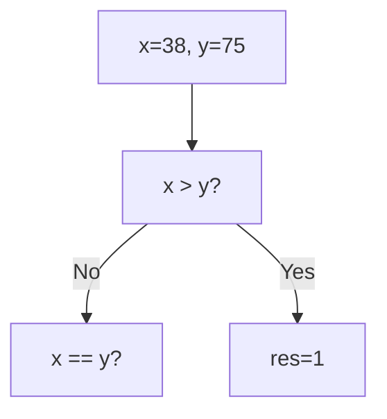
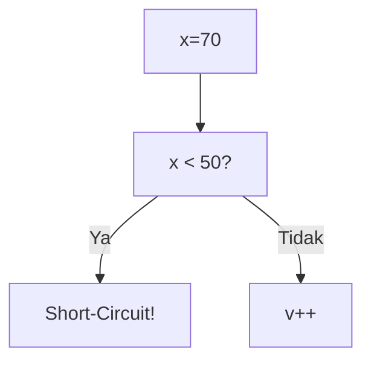
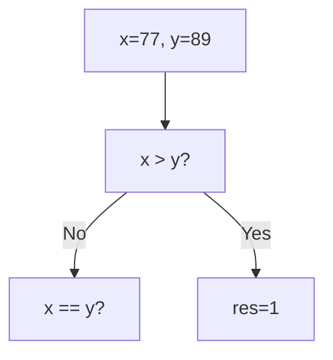
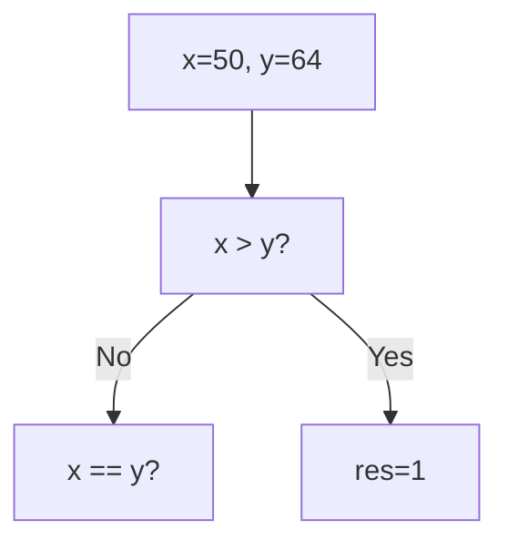
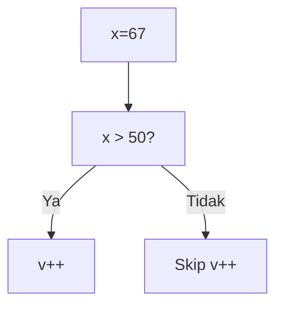

🔙 **[Kembali ke Daftar Soal](./README.md)**

---

# Latihan Soal Part C - Modul 02 - Set 01

### Soal 1
```cpp
int x = 69, v = 0;
if (x < 50 || ++v > 0) { x = 0; }
```
**Pertanyaan:**
1. Berapakah hasil akhirnya?
2. Mengapa demikian?

**Jawaban & Diagnosis:**
1. **v=1**
2. Lihat Tracing.

**Mermaid Flowchart:**


**📖 Penjelasan:**
**Langkah Tracing:**
1. x=69. Cek x < 50.
2. Jika Ya, syarat kedua di-skip (v=0). Jika Tidak, v++ (v=1).
3. Nilai v akhir: 1.

---
### Soal 2
```cpp
int x = 76, v = 0;
if (x > 50 && ++v > 0) { x = 100; }
```
**Pertanyaan:**
1. Berapakah hasil akhirnya?
2. Mengapa demikian?

**Jawaban & Diagnosis:**
1. **v=1, x=100**
2. Lihat Tracing.

**Mermaid Flowchart:**


**📖 Penjelasan:**
**Langkah Tracing:**
1. x=76. Cek x > 50.
2. Jika Ya, v naik jadi 1. Jika Tidak, v tetap 0 (Short-circuit).
3. Nilai v akhir: 1.

---
### Soal 3
```cpp
int x = 36, v = 0;
if (x > 50 && ++v > 0) { x = 100; }
```
**Pertanyaan:**
1. Berapakah hasil akhirnya?
2. Mengapa demikian?

**Jawaban & Diagnosis:**
1. **v=0, x=36**
2. Lihat Tracing.

**Mermaid Flowchart:**


**📖 Penjelasan:**
**Langkah Tracing:**
1. x=36. Cek x > 50.
2. Jika Ya, v naik jadi 1. Jika Tidak, v tetap 0 (Short-circuit).
3. Nilai v akhir: 0.

---
### Soal 4
```cpp
int x=38, y=75;
if (x > y) res = 1;
else if (x == y) res = 0;
else res = -1;
```
**Pertanyaan:**
1. Berapakah hasil akhirnya?
2. Mengapa demikian?

**Jawaban & Diagnosis:**
1. **-1**
2. Lihat Tracing.

**Mermaid Flowchart:**


**📖 Penjelasan:**
**Langkah Tracing:**
1. Bandingkan 38 dan 75.
2. Hasil: -1.

---
### Soal 5
```cpp
int x = 14, v = 0;
if (x < 50 || ++v > 0) { x = 0; }
```
**Pertanyaan:**
1. Berapakah hasil akhirnya?
2. Mengapa demikian?

**Jawaban & Diagnosis:**
1. **v=0**
2. Lihat Tracing.

**Mermaid Flowchart:**


**📖 Penjelasan:**
**Langkah Tracing:**
1. x=14. Cek x < 50.
2. Jika Ya, syarat kedua di-skip (v=0). Jika Tidak, v++ (v=1).
3. Nilai v akhir: 0.

---
### Soal 6
```cpp
int x = 86, v = 0;
if (x > 50 && ++v > 0) { x = 100; }
```
**Pertanyaan:**
1. Berapakah hasil akhirnya?
2. Mengapa demikian?

**Jawaban & Diagnosis:**
1. **v=1, x=100**
2. Lihat Tracing.

**Mermaid Flowchart:**


**📖 Penjelasan:**
**Langkah Tracing:**
1. x=86. Cek x > 50.
2. Jika Ya, v naik jadi 1. Jika Tidak, v tetap 0 (Short-circuit).
3. Nilai v akhir: 1.

---
### Soal 7
```cpp
int x = 70, v = 0;
if (x < 50 || ++v > 0) { x = 0; }
```
**Pertanyaan:**
1. Berapakah hasil akhirnya?
2. Mengapa demikian?

**Jawaban & Diagnosis:**
1. **v=1**
2. Lihat Tracing.

**Mermaid Flowchart:**


**📖 Penjelasan:**
**Langkah Tracing:**
1. x=70. Cek x < 50.
2. Jika Ya, syarat kedua di-skip (v=0). Jika Tidak, v++ (v=1).
3. Nilai v akhir: 1.

---
### Soal 8
```cpp
int x = 77, v = 0;
if (x > 50 && ++v > 0) { x = 100; }
```
**Pertanyaan:**
1. Berapakah hasil akhirnya?
2. Mengapa demikian?

**Jawaban & Diagnosis:**
1. **v=1, x=100**
2. Lihat Tracing.

**Mermaid Flowchart:**


**📖 Penjelasan:**
**Langkah Tracing:**
1. x=77. Cek x > 50.
2. Jika Ya, v naik jadi 1. Jika Tidak, v tetap 0 (Short-circuit).
3. Nilai v akhir: 1.

---
### Soal 9
```cpp
int x = 65, v = 0;
if (x < 50 || ++v > 0) { x = 0; }
```
**Pertanyaan:**
1. Berapakah hasil akhirnya?
2. Mengapa demikian?

**Jawaban & Diagnosis:**
1. **v=1**
2. Lihat Tracing.

**Mermaid Flowchart:**


**📖 Penjelasan:**
**Langkah Tracing:**
1. x=65. Cek x < 50.
2. Jika Ya, syarat kedua di-skip (v=0). Jika Tidak, v++ (v=1).
3. Nilai v akhir: 1.

---
### Soal 10
```cpp
int x=77, y=89;
if (x > y) res = 1;
else if (x == y) res = 0;
else res = -1;
```
**Pertanyaan:**
1. Berapakah hasil akhirnya?
2. Mengapa demikian?

**Jawaban & Diagnosis:**
1. **-1**
2. Lihat Tracing.

**Mermaid Flowchart:**


**📖 Penjelasan:**
**Langkah Tracing:**
1. Bandingkan 77 dan 89.
2. Hasil: -1.

---
### Soal 11
```cpp
int x=46, y=10;
if (x > y) res = 1;
else if (x == y) res = 0;
else res = -1;
```
**Pertanyaan:**
1. Berapakah hasil akhirnya?
2. Mengapa demikian?

**Jawaban & Diagnosis:**
1. **1**
2. Lihat Tracing.

**Mermaid Flowchart:**


**📖 Penjelasan:**
**Langkah Tracing:**
1. Bandingkan 46 dan 10.
2. Hasil: 1.

---
### Soal 12
```cpp
int x=50, y=64;
if (x > y) res = 1;
else if (x == y) res = 0;
else res = -1;
```
**Pertanyaan:**
1. Berapakah hasil akhirnya?
2. Mengapa demikian?

**Jawaban & Diagnosis:**
1. **-1**
2. Lihat Tracing.

**Mermaid Flowchart:**


**📖 Penjelasan:**
**Langkah Tracing:**
1. Bandingkan 50 dan 64.
2. Hasil: -1.

---
### Soal 13
```cpp
int x = 61, v = 0;
if (x < 50 || ++v > 0) { x = 0; }
```
**Pertanyaan:**
1. Berapakah hasil akhirnya?
2. Mengapa demikian?

**Jawaban & Diagnosis:**
1. **v=1**
2. Lihat Tracing.

**Mermaid Flowchart:**


**📖 Penjelasan:**
**Langkah Tracing:**
1. x=61. Cek x < 50.
2. Jika Ya, syarat kedua di-skip (v=0). Jika Tidak, v++ (v=1).
3. Nilai v akhir: 1.

---
### Soal 14
```cpp
int x = 67, v = 0;
if (x > 50 && ++v > 0) { x = 100; }
```
**Pertanyaan:**
1. Berapakah hasil akhirnya?
2. Mengapa demikian?

**Jawaban & Diagnosis:**
1. **v=1, x=100**
2. Lihat Tracing.

**Mermaid Flowchart:**


**📖 Penjelasan:**
**Langkah Tracing:**
1. x=67. Cek x > 50.
2. Jika Ya, v naik jadi 1. Jika Tidak, v tetap 0 (Short-circuit).
3. Nilai v akhir: 1.

---
### Soal 15
```cpp
int x = 78, v = 0;
if (x < 50 || ++v > 0) { x = 0; }
```
**Pertanyaan:**
1. Berapakah hasil akhirnya?
2. Mengapa demikian?

**Jawaban & Diagnosis:**
1. **v=1**
2. Lihat Tracing.

**Mermaid Flowchart:**


**📖 Penjelasan:**
**Langkah Tracing:**
1. x=78. Cek x < 50.
2. Jika Ya, syarat kedua di-skip (v=0). Jika Tidak, v++ (v=1).
3. Nilai v akhir: 1.

---
### Soal 16
```cpp
int x = 61, v = 0;
if (x < 50 || ++v > 0) { x = 0; }
```
**Pertanyaan:**
1. Berapakah hasil akhirnya?
2. Mengapa demikian?

**Jawaban & Diagnosis:**
1. **v=1**
2. Lihat Tracing.

**Mermaid Flowchart:**


**📖 Penjelasan:**
**Langkah Tracing:**
1. x=61. Cek x < 50.
2. Jika Ya, syarat kedua di-skip (v=0). Jika Tidak, v++ (v=1).
3. Nilai v akhir: 1.

---
### Soal 17
```cpp
int x = 20, v = 0;
if (x < 50 || ++v > 0) { x = 0; }
```
**Pertanyaan:**
1. Berapakah hasil akhirnya?
2. Mengapa demikian?

**Jawaban & Diagnosis:**
1. **v=0**
2. Lihat Tracing.

**Mermaid Flowchart:**


**📖 Penjelasan:**
**Langkah Tracing:**
1. x=20. Cek x < 50.
2. Jika Ya, syarat kedua di-skip (v=0). Jika Tidak, v++ (v=1).
3. Nilai v akhir: 0.

---
### Soal 18
```cpp
int x = 95, v = 0;
if (x > 50 && ++v > 0) { x = 100; }
```
**Pertanyaan:**
1. Berapakah hasil akhirnya?
2. Mengapa demikian?

**Jawaban & Diagnosis:**
1. **v=1, x=100**
2. Lihat Tracing.

**Mermaid Flowchart:**


**📖 Penjelasan:**
**Langkah Tracing:**
1. x=95. Cek x > 50.
2. Jika Ya, v naik jadi 1. Jika Tidak, v tetap 0 (Short-circuit).
3. Nilai v akhir: 1.

---
### Soal 19
```cpp
int x=67, y=93;
if (x > y) res = 1;
else if (x == y) res = 0;
else res = -1;
```
**Pertanyaan:**
1. Berapakah hasil akhirnya?
2. Mengapa demikian?

**Jawaban & Diagnosis:**
1. **-1**
2. Lihat Tracing.

**Mermaid Flowchart:**


**📖 Penjelasan:**
**Langkah Tracing:**
1. Bandingkan 67 dan 93.
2. Hasil: -1.

---
### Soal 20
```cpp
int x = 65, v = 0;
if (x < 50 || ++v > 0) { x = 0; }
```
**Pertanyaan:**
1. Berapakah hasil akhirnya?
2. Mengapa demikian?

**Jawaban & Diagnosis:**
1. **v=1**
2. Lihat Tracing.

**Mermaid Flowchart:**


**📖 Penjelasan:**
**Langkah Tracing:**
1. x=65. Cek x < 50.
2. Jika Ya, syarat kedua di-skip (v=0). Jika Tidak, v++ (v=1).
3. Nilai v akhir: 1.

---
### Soal 21
```cpp
int x = 56, v = 0;
if (x > 50 && ++v > 0) { x = 100; }
```
**Pertanyaan:**
1. Berapakah hasil akhirnya?
2. Mengapa demikian?

**Jawaban & Diagnosis:**
1. **v=1, x=100**
2. Lihat Tracing.

**Mermaid Flowchart:**
```mermaid
graph TD
A["x=56"] --> B["x > 50?"]
B -- Ya --> C["v++"]
B -- Tidak --> D["Skip v++"]
```

**📖 Penjelasan:**
**Langkah Tracing:**
1. x=56. Cek x > 50.
2. Jika Ya, v naik jadi 1. Jika Tidak, v tetap 0 (Short-circuit).
3. Nilai v akhir: 1.

---
### Soal 22
```cpp
int x = 70, v = 0;
if (x > 50 && ++v > 0) { x = 100; }
```
**Pertanyaan:**
1. Berapakah hasil akhirnya?
2. Mengapa demikian?

**Jawaban & Diagnosis:**
1. **v=1, x=100**
2. Lihat Tracing.

**Mermaid Flowchart:**
```mermaid
graph TD
A["x=70"] --> B["x > 50?"]
B -- Ya --> C["v++"]
B -- Tidak --> D["Skip v++"]
```

**📖 Penjelasan:**
**Langkah Tracing:**
1. x=70. Cek x > 50.
2. Jika Ya, v naik jadi 1. Jika Tidak, v tetap 0 (Short-circuit).
3. Nilai v akhir: 1.

---
### Soal 23
```cpp
int x = 74, v = 0;
if (x > 50 && ++v > 0) { x = 100; }
```
**Pertanyaan:**
1. Berapakah hasil akhirnya?
2. Mengapa demikian?

**Jawaban & Diagnosis:**
1. **v=1, x=100**
2. Lihat Tracing.

**Mermaid Flowchart:**
```mermaid
graph TD
A["x=74"] --> B["x > 50?"]
B -- Ya --> C["v++"]
B -- Tidak --> D["Skip v++"]
```

**📖 Penjelasan:**
**Langkah Tracing:**
1. x=74. Cek x > 50.
2. Jika Ya, v naik jadi 1. Jika Tidak, v tetap 0 (Short-circuit).
3. Nilai v akhir: 1.

---
### Soal 24
```cpp
int x = 61, v = 0;
if (x < 50 || ++v > 0) { x = 0; }
```
**Pertanyaan:**
1. Berapakah hasil akhirnya?
2. Mengapa demikian?

**Jawaban & Diagnosis:**
1. **v=1**
2. Lihat Tracing.

**Mermaid Flowchart:**
```mermaid
graph TD
A["x=61"] --> B["x < 50?"]
B -- Ya --> C["Short-Circuit!"]
B -- Tidak --> D["v++"]
```

**📖 Penjelasan:**
**Langkah Tracing:**
1. x=61. Cek x < 50.
2. Jika Ya, syarat kedua di-skip (v=0). Jika Tidak, v++ (v=1).
3. Nilai v akhir: 1.

---
### Soal 25
```cpp
int x = 32, v = 0;
if (x < 50 || ++v > 0) { x = 0; }
```
**Pertanyaan:**
1. Berapakah hasil akhirnya?
2. Mengapa demikian?

**Jawaban & Diagnosis:**
1. **v=0**
2. Lihat Tracing.

**Mermaid Flowchart:**
```mermaid
graph TD
A["x=32"] --> B["x < 50?"]
B -- Ya --> C["Short-Circuit!"]
B -- Tidak --> D["v++"]
```

**📖 Penjelasan:**
**Langkah Tracing:**
1. x=32. Cek x < 50.
2. Jika Ya, syarat kedua di-skip (v=0). Jika Tidak, v++ (v=1).
3. Nilai v akhir: 0.

---
