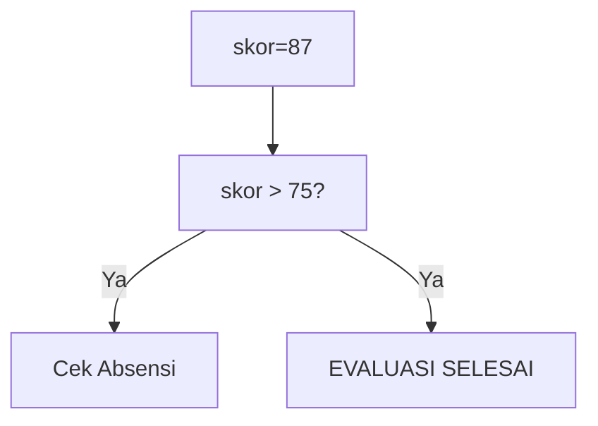
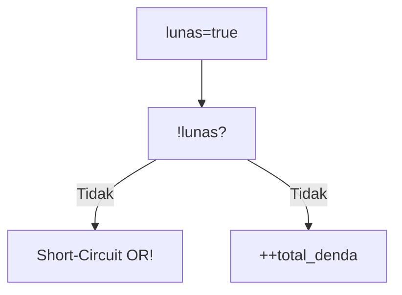
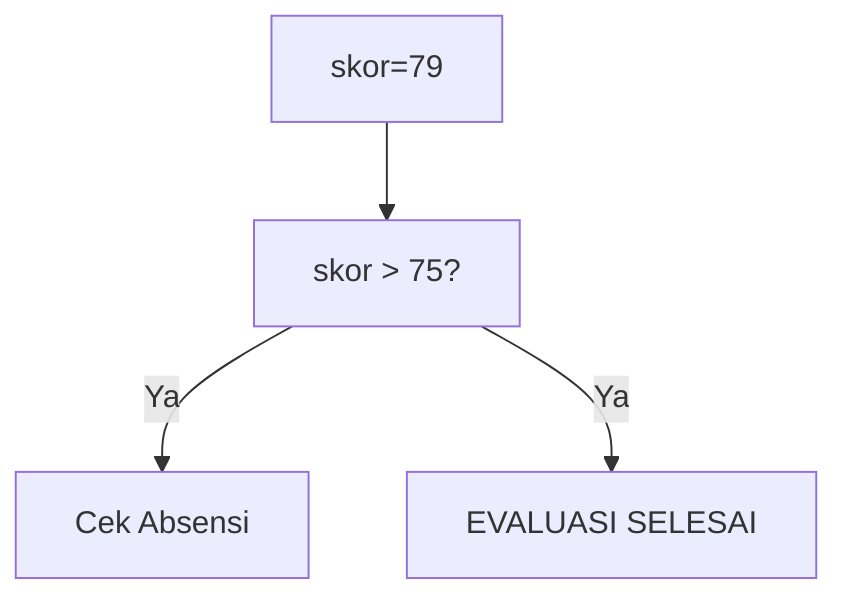
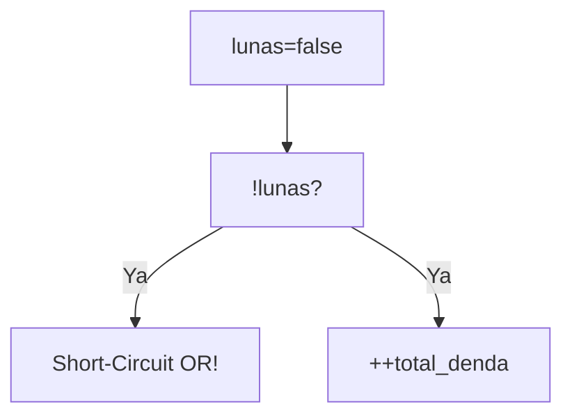
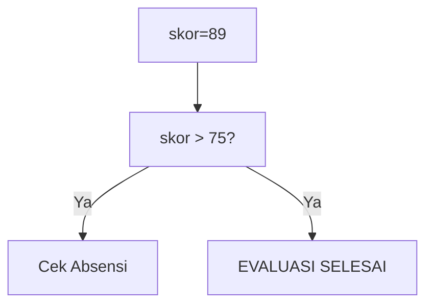
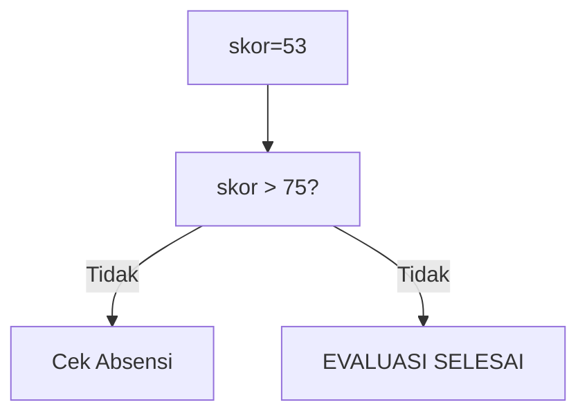

🔙 **[Kembali ke Daftar Soal](./README.md)**

---

# Latihan Soal Part C - Modul 02 - Set 01

### Soal 1
```cpp
int skor_siswa = 87, absensi = 85;
if (skor_siswa > 75 && absensi > 80) hasil = 1;
else hasil = 0;
```
**Pertanyaan:**
1. Berapakah hasil akhirnya?
2. Deskripsikan langkah robot compiler saat memproses kode ini!

**Jawaban & Diagnosis:**
1. **1**
2. Baca bagian 'Analisis Mendalam' di bawah.

**Mermaid Flowchart:**


**📖 Penjelasan Komprehensif:**
**Analisis Mendalam (Compiler Manusia):**
1. **Logika &&**: Syarat pertama adalah `skor_siswa > 75`. Karena nilaimu 87, statusnya LULUS.
2. **Short-Circuit**: Karena lulus syarat 1, mesin lanjut cek absensi.
3. **Hasil Akhir**: hasil = **1**.

---
### Soal 2
```cpp
int skor_siswa = 70, absensi = 85;
if (skor_siswa > 75 && absensi > 80) hasil = 1;
else hasil = 0;
```
**Pertanyaan:**
1. Berapakah hasil akhirnya?
2. Deskripsikan langkah robot compiler saat memproses kode ini!

**Jawaban & Diagnosis:**
1. **0**
2. Baca bagian 'Analisis Mendalam' di bawah.

**Mermaid Flowchart:**


**📖 Penjelasan Komprehensif:**
**Analisis Mendalam (Compiler Manusia):**
1. **Logika &&**: Syarat pertama adalah `skor_siswa > 75`. Karena nilaimu 70, statusnya GAGAL.
2. **Short-Circuit**: Karena sudah gagal di skor, mesin malas (short-circuit) dan tidak peduli absensi.
3. **Hasil Akhir**: hasil = **0**.

---
### Soal 3
```cpp
bool lunas = true;
int total_denda = 0;
if (!lunas || ++total_denda > 5) status = 0;
```
**Pertanyaan:**
1. Berapakah hasil akhirnya?
2. Deskripsikan langkah robot compiler saat memproses kode ini!

**Jawaban & Diagnosis:**
1. **0**
2. Baca bagian 'Analisis Mendalam' di bawah.

**Mermaid Flowchart:**


**📖 Penjelasan Komprehensif:**
**Analisis Mendalam (Compiler Manusia):**
1. **Logika ||**: Operator OR mencari satu saja kebenaran. 
2. **Tracing**: `!lunas` bernilai False (SUDAH LUNAS).
3. **Dampak**: Karena False, mesin harus ngecek syarat kedua, denda naik jadi 1.
4. **Hasil**: `total_denda` = **0**.

---
### Soal 4
```cpp
bool lunas = true;
int total_denda = 0;
if (!lunas || ++total_denda > 5) status = 0;
```
**Pertanyaan:**
1. Berapakah hasil akhirnya?
2. Deskripsikan langkah robot compiler saat memproses kode ini!

**Jawaban & Diagnosis:**
1. **0**
2. Baca bagian 'Analisis Mendalam' di bawah.

**Mermaid Flowchart:**


**📖 Penjelasan Komprehensif:**
**Analisis Mendalam (Compiler Manusia):**
1. **Logika ||**: Operator OR mencari satu saja kebenaran. 
2. **Tracing**: `!lunas` bernilai False (SUDAH LUNAS).
3. **Dampak**: Karena False, mesin harus ngecek syarat kedua, denda naik jadi 1.
4. **Hasil**: `total_denda` = **0**.

---
### Soal 5
```cpp
bool lunas = true;
int total_denda = 0;
if (!lunas || ++total_denda > 5) status = 0;
```
**Pertanyaan:**
1. Berapakah hasil akhirnya?
2. Deskripsikan langkah robot compiler saat memproses kode ini!

**Jawaban & Diagnosis:**
1. **0**
2. Baca bagian 'Analisis Mendalam' di bawah.

**Mermaid Flowchart:**


**📖 Penjelasan Komprehensif:**
**Analisis Mendalam (Compiler Manusia):**
1. **Logika ||**: Operator OR mencari satu saja kebenaran. 
2. **Tracing**: `!lunas` bernilai False (SUDAH LUNAS).
3. **Dampak**: Karena False, mesin harus ngecek syarat kedua, denda naik jadi 1.
4. **Hasil**: `total_denda` = **0**.

---
### Soal 6
```cpp
int skor_siswa = 79, absensi = 85;
if (skor_siswa > 75 && absensi > 80) hasil = 1;
else hasil = 0;
```
**Pertanyaan:**
1. Berapakah hasil akhirnya?
2. Deskripsikan langkah robot compiler saat memproses kode ini!

**Jawaban & Diagnosis:**
1. **1**
2. Baca bagian 'Analisis Mendalam' di bawah.

**Mermaid Flowchart:**


**📖 Penjelasan Komprehensif:**
**Analisis Mendalam (Compiler Manusia):**
1. **Logika &&**: Syarat pertama adalah `skor_siswa > 75`. Karena nilaimu 79, statusnya LULUS.
2. **Short-Circuit**: Karena lulus syarat 1, mesin lanjut cek absensi.
3. **Hasil Akhir**: hasil = **1**.

---
### Soal 7
```cpp
bool lunas = false;
int total_denda = 0;
if (!lunas || ++total_denda > 5) status = 0;
```
**Pertanyaan:**
1. Berapakah hasil akhirnya?
2. Deskripsikan langkah robot compiler saat memproses kode ini!

**Jawaban & Diagnosis:**
1. **1**
2. Baca bagian 'Analisis Mendalam' di bawah.

**Mermaid Flowchart:**


**📖 Penjelasan Komprehensif:**
**Analisis Mendalam (Compiler Manusia):**
1. **Logika ||**: Operator OR mencari satu saja kebenaran. 
2. **Tracing**: `!lunas` bernilai True (BELUM BAYAR).
3. **Dampak**: Karena sudah True, denda tidak dicek (denda tetap 0).
4. **Hasil**: `total_denda` = **1**.

---
### Soal 8
```cpp
bool lunas = false;
int total_denda = 0;
if (!lunas || ++total_denda > 5) status = 0;
```
**Pertanyaan:**
1. Berapakah hasil akhirnya?
2. Deskripsikan langkah robot compiler saat memproses kode ini!

**Jawaban & Diagnosis:**
1. **1**
2. Baca bagian 'Analisis Mendalam' di bawah.

**Mermaid Flowchart:**


**📖 Penjelasan Komprehensif:**
**Analisis Mendalam (Compiler Manusia):**
1. **Logika ||**: Operator OR mencari satu saja kebenaran. 
2. **Tracing**: `!lunas` bernilai True (BELUM BAYAR).
3. **Dampak**: Karena sudah True, denda tidak dicek (denda tetap 0).
4. **Hasil**: `total_denda` = **1**.

---
### Soal 9
```cpp
bool lunas = false;
int total_denda = 0;
if (!lunas || ++total_denda > 5) status = 0;
```
**Pertanyaan:**
1. Berapakah hasil akhirnya?
2. Deskripsikan langkah robot compiler saat memproses kode ini!

**Jawaban & Diagnosis:**
1. **1**
2. Baca bagian 'Analisis Mendalam' di bawah.

**Mermaid Flowchart:**


**📖 Penjelasan Komprehensif:**
**Analisis Mendalam (Compiler Manusia):**
1. **Logika ||**: Operator OR mencari satu saja kebenaran. 
2. **Tracing**: `!lunas` bernilai True (BELUM BAYAR).
3. **Dampak**: Karena sudah True, denda tidak dicek (denda tetap 0).
4. **Hasil**: `total_denda` = **1**.

---
### Soal 10
```cpp
int skor_siswa = 67, absensi = 85;
if (skor_siswa > 75 && absensi > 80) hasil = 1;
else hasil = 0;
```
**Pertanyaan:**
1. Berapakah hasil akhirnya?
2. Deskripsikan langkah robot compiler saat memproses kode ini!

**Jawaban & Diagnosis:**
1. **0**
2. Baca bagian 'Analisis Mendalam' di bawah.

**Mermaid Flowchart:**


**📖 Penjelasan Komprehensif:**
**Analisis Mendalam (Compiler Manusia):**
1. **Logika &&**: Syarat pertama adalah `skor_siswa > 75`. Karena nilaimu 67, statusnya GAGAL.
2. **Short-Circuit**: Karena sudah gagal di skor, mesin malas (short-circuit) dan tidak peduli absensi.
3. **Hasil Akhir**: hasil = **0**.

---
### Soal 11
```cpp
int skor_siswa = 86, absensi = 85;
if (skor_siswa > 75 && absensi > 80) hasil = 1;
else hasil = 0;
```
**Pertanyaan:**
1. Berapakah hasil akhirnya?
2. Deskripsikan langkah robot compiler saat memproses kode ini!

**Jawaban & Diagnosis:**
1. **1**
2. Baca bagian 'Analisis Mendalam' di bawah.

**Mermaid Flowchart:**


**📖 Penjelasan Komprehensif:**
**Analisis Mendalam (Compiler Manusia):**
1. **Logika &&**: Syarat pertama adalah `skor_siswa > 75`. Karena nilaimu 86, statusnya LULUS.
2. **Short-Circuit**: Karena lulus syarat 1, mesin lanjut cek absensi.
3. **Hasil Akhir**: hasil = **1**.

---
### Soal 12
```cpp
bool lunas = false;
int total_denda = 0;
if (!lunas || ++total_denda > 5) status = 0;
```
**Pertanyaan:**
1. Berapakah hasil akhirnya?
2. Deskripsikan langkah robot compiler saat memproses kode ini!

**Jawaban & Diagnosis:**
1. **1**
2. Baca bagian 'Analisis Mendalam' di bawah.

**Mermaid Flowchart:**


**📖 Penjelasan Komprehensif:**
**Analisis Mendalam (Compiler Manusia):**
1. **Logika ||**: Operator OR mencari satu saja kebenaran. 
2. **Tracing**: `!lunas` bernilai True (BELUM BAYAR).
3. **Dampak**: Karena sudah True, denda tidak dicek (denda tetap 0).
4. **Hasil**: `total_denda` = **1**.

---
### Soal 13
```cpp
int skor_siswa = 74, absensi = 85;
if (skor_siswa > 75 && absensi > 80) hasil = 1;
else hasil = 0;
```
**Pertanyaan:**
1. Berapakah hasil akhirnya?
2. Deskripsikan langkah robot compiler saat memproses kode ini!

**Jawaban & Diagnosis:**
1. **0**
2. Baca bagian 'Analisis Mendalam' di bawah.

**Mermaid Flowchart:**


**📖 Penjelasan Komprehensif:**
**Analisis Mendalam (Compiler Manusia):**
1. **Logika &&**: Syarat pertama adalah `skor_siswa > 75`. Karena nilaimu 74, statusnya GAGAL.
2. **Short-Circuit**: Karena sudah gagal di skor, mesin malas (short-circuit) dan tidak peduli absensi.
3. **Hasil Akhir**: hasil = **0**.

---
### Soal 14
```cpp
int skor_siswa = 48, absensi = 85;
if (skor_siswa > 75 && absensi > 80) hasil = 1;
else hasil = 0;
```
**Pertanyaan:**
1. Berapakah hasil akhirnya?
2. Deskripsikan langkah robot compiler saat memproses kode ini!

**Jawaban & Diagnosis:**
1. **0**
2. Baca bagian 'Analisis Mendalam' di bawah.

**Mermaid Flowchart:**


**📖 Penjelasan Komprehensif:**
**Analisis Mendalam (Compiler Manusia):**
1. **Logika &&**: Syarat pertama adalah `skor_siswa > 75`. Karena nilaimu 48, statusnya GAGAL.
2. **Short-Circuit**: Karena sudah gagal di skor, mesin malas (short-circuit) dan tidak peduli absensi.
3. **Hasil Akhir**: hasil = **0**.

---
### Soal 15
```cpp
int skor_siswa = 54, absensi = 85;
if (skor_siswa > 75 && absensi > 80) hasil = 1;
else hasil = 0;
```
**Pertanyaan:**
1. Berapakah hasil akhirnya?
2. Deskripsikan langkah robot compiler saat memproses kode ini!

**Jawaban & Diagnosis:**
1. **0**
2. Baca bagian 'Analisis Mendalam' di bawah.

**Mermaid Flowchart:**


**📖 Penjelasan Komprehensif:**
**Analisis Mendalam (Compiler Manusia):**
1. **Logika &&**: Syarat pertama adalah `skor_siswa > 75`. Karena nilaimu 54, statusnya GAGAL.
2. **Short-Circuit**: Karena sudah gagal di skor, mesin malas (short-circuit) dan tidak peduli absensi.
3. **Hasil Akhir**: hasil = **0**.

---
### Soal 16
```cpp
int skor_siswa = 62, absensi = 85;
if (skor_siswa > 75 && absensi > 80) hasil = 1;
else hasil = 0;
```
**Pertanyaan:**
1. Berapakah hasil akhirnya?
2. Deskripsikan langkah robot compiler saat memproses kode ini!

**Jawaban & Diagnosis:**
1. **0**
2. Baca bagian 'Analisis Mendalam' di bawah.

**Mermaid Flowchart:**


**📖 Penjelasan Komprehensif:**
**Analisis Mendalam (Compiler Manusia):**
1. **Logika &&**: Syarat pertama adalah `skor_siswa > 75`. Karena nilaimu 62, statusnya GAGAL.
2. **Short-Circuit**: Karena sudah gagal di skor, mesin malas (short-circuit) dan tidak peduli absensi.
3. **Hasil Akhir**: hasil = **0**.

---
### Soal 17
```cpp
int skor_siswa = 89, absensi = 85;
if (skor_siswa > 75 && absensi > 80) hasil = 1;
else hasil = 0;
```
**Pertanyaan:**
1. Berapakah hasil akhirnya?
2. Deskripsikan langkah robot compiler saat memproses kode ini!

**Jawaban & Diagnosis:**
1. **1**
2. Baca bagian 'Analisis Mendalam' di bawah.

**Mermaid Flowchart:**


**📖 Penjelasan Komprehensif:**
**Analisis Mendalam (Compiler Manusia):**
1. **Logika &&**: Syarat pertama adalah `skor_siswa > 75`. Karena nilaimu 89, statusnya LULUS.
2. **Short-Circuit**: Karena lulus syarat 1, mesin lanjut cek absensi.
3. **Hasil Akhir**: hasil = **1**.

---
### Soal 18
```cpp
int skor_siswa = 52, absensi = 85;
if (skor_siswa > 75 && absensi > 80) hasil = 1;
else hasil = 0;
```
**Pertanyaan:**
1. Berapakah hasil akhirnya?
2. Deskripsikan langkah robot compiler saat memproses kode ini!

**Jawaban & Diagnosis:**
1. **0**
2. Baca bagian 'Analisis Mendalam' di bawah.

**Mermaid Flowchart:**


**📖 Penjelasan Komprehensif:**
**Analisis Mendalam (Compiler Manusia):**
1. **Logika &&**: Syarat pertama adalah `skor_siswa > 75`. Karena nilaimu 52, statusnya GAGAL.
2. **Short-Circuit**: Karena sudah gagal di skor, mesin malas (short-circuit) dan tidak peduli absensi.
3. **Hasil Akhir**: hasil = **0**.

---
### Soal 19
```cpp
int skor_siswa = 53, absensi = 85;
if (skor_siswa > 75 && absensi > 80) hasil = 1;
else hasil = 0;
```
**Pertanyaan:**
1. Berapakah hasil akhirnya?
2. Deskripsikan langkah robot compiler saat memproses kode ini!

**Jawaban & Diagnosis:**
1. **0**
2. Baca bagian 'Analisis Mendalam' di bawah.

**Mermaid Flowchart:**


**📖 Penjelasan Komprehensif:**
**Analisis Mendalam (Compiler Manusia):**
1. **Logika &&**: Syarat pertama adalah `skor_siswa > 75`. Karena nilaimu 53, statusnya GAGAL.
2. **Short-Circuit**: Karena sudah gagal di skor, mesin malas (short-circuit) dan tidak peduli absensi.
3. **Hasil Akhir**: hasil = **0**.

---
### Soal 20
```cpp
bool lunas = true;
int total_denda = 0;
if (!lunas || ++total_denda > 5) status = 0;
```
**Pertanyaan:**
1. Berapakah hasil akhirnya?
2. Deskripsikan langkah robot compiler saat memproses kode ini!

**Jawaban & Diagnosis:**
1. **0**
2. Baca bagian 'Analisis Mendalam' di bawah.

**Mermaid Flowchart:**


**📖 Penjelasan Komprehensif:**
**Analisis Mendalam (Compiler Manusia):**
1. **Logika ||**: Operator OR mencari satu saja kebenaran. 
2. **Tracing**: `!lunas` bernilai False (SUDAH LUNAS).
3. **Dampak**: Karena False, mesin harus ngecek syarat kedua, denda naik jadi 1.
4. **Hasil**: `total_denda` = **0**.

---
### Soal 21
```cpp
bool lunas = true;
int total_denda = 0;
if (!lunas || ++total_denda > 5) status = 0;
```
**Pertanyaan:**
1. Berapakah hasil akhirnya?
2. Deskripsikan langkah robot compiler saat memproses kode ini!

**Jawaban & Diagnosis:**
1. **0**
2. Baca bagian 'Analisis Mendalam' di bawah.

**Mermaid Flowchart:**
```mermaid
graph TD
A["lunas=true"] --> B["!lunas?"]
B -- Tidak --> C["Short-Circuit OR!"]
B -- Tidak --> D["++total_denda"]
```

**📖 Penjelasan Komprehensif:**
**Analisis Mendalam (Compiler Manusia):**
1. **Logika ||**: Operator OR mencari satu saja kebenaran. 
2. **Tracing**: `!lunas` bernilai False (SUDAH LUNAS).
3. **Dampak**: Karena False, mesin harus ngecek syarat kedua, denda naik jadi 1.
4. **Hasil**: `total_denda` = **0**.

---
### Soal 22
```cpp
bool lunas = false;
int total_denda = 0;
if (!lunas || ++total_denda > 5) status = 0;
```
**Pertanyaan:**
1. Berapakah hasil akhirnya?
2. Deskripsikan langkah robot compiler saat memproses kode ini!

**Jawaban & Diagnosis:**
1. **1**
2. Baca bagian 'Analisis Mendalam' di bawah.

**Mermaid Flowchart:**
```mermaid
graph TD
A["lunas=false"] --> B["!lunas?"]
B -- Ya --> C["Short-Circuit OR!"]
B -- Ya --> D["++total_denda"]
```

**📖 Penjelasan Komprehensif:**
**Analisis Mendalam (Compiler Manusia):**
1. **Logika ||**: Operator OR mencari satu saja kebenaran. 
2. **Tracing**: `!lunas` bernilai True (BELUM BAYAR).
3. **Dampak**: Karena sudah True, denda tidak dicek (denda tetap 0).
4. **Hasil**: `total_denda` = **1**.

---
### Soal 23
```cpp
int skor_siswa = 41, absensi = 85;
if (skor_siswa > 75 && absensi > 80) hasil = 1;
else hasil = 0;
```
**Pertanyaan:**
1. Berapakah hasil akhirnya?
2. Deskripsikan langkah robot compiler saat memproses kode ini!

**Jawaban & Diagnosis:**
1. **0**
2. Baca bagian 'Analisis Mendalam' di bawah.

**Mermaid Flowchart:**
```mermaid
graph TD
A["skor=41"] --> B["skor > 75?"]
B -- Tidak --> C["Cek Absensi"]
B -- Tidak --> D["EVALUASI SELESAI"]
```

**📖 Penjelasan Komprehensif:**
**Analisis Mendalam (Compiler Manusia):**
1. **Logika &&**: Syarat pertama adalah `skor_siswa > 75`. Karena nilaimu 41, statusnya GAGAL.
2. **Short-Circuit**: Karena sudah gagal di skor, mesin malas (short-circuit) dan tidak peduli absensi.
3. **Hasil Akhir**: hasil = **0**.

---
### Soal 24
```cpp
int skor_siswa = 50, absensi = 85;
if (skor_siswa > 75 && absensi > 80) hasil = 1;
else hasil = 0;
```
**Pertanyaan:**
1. Berapakah hasil akhirnya?
2. Deskripsikan langkah robot compiler saat memproses kode ini!

**Jawaban & Diagnosis:**
1. **0**
2. Baca bagian 'Analisis Mendalam' di bawah.

**Mermaid Flowchart:**
```mermaid
graph TD
A["skor=50"] --> B["skor > 75?"]
B -- Tidak --> C["Cek Absensi"]
B -- Tidak --> D["EVALUASI SELESAI"]
```

**📖 Penjelasan Komprehensif:**
**Analisis Mendalam (Compiler Manusia):**
1. **Logika &&**: Syarat pertama adalah `skor_siswa > 75`. Karena nilaimu 50, statusnya GAGAL.
2. **Short-Circuit**: Karena sudah gagal di skor, mesin malas (short-circuit) dan tidak peduli absensi.
3. **Hasil Akhir**: hasil = **0**.

---
### Soal 25
```cpp
bool lunas = true;
int total_denda = 0;
if (!lunas || ++total_denda > 5) status = 0;
```
**Pertanyaan:**
1. Berapakah hasil akhirnya?
2. Deskripsikan langkah robot compiler saat memproses kode ini!

**Jawaban & Diagnosis:**
1. **0**
2. Baca bagian 'Analisis Mendalam' di bawah.

**Mermaid Flowchart:**
```mermaid
graph TD
A["lunas=true"] --> B["!lunas?"]
B -- Tidak --> C["Short-Circuit OR!"]
B -- Tidak --> D["++total_denda"]
```

**📖 Penjelasan Komprehensif:**
**Analisis Mendalam (Compiler Manusia):**
1. **Logika ||**: Operator OR mencari satu saja kebenaran. 
2. **Tracing**: `!lunas` bernilai False (SUDAH LUNAS).
3. **Dampak**: Karena False, mesin harus ngecek syarat kedua, denda naik jadi 1.
4. **Hasil**: `total_denda` = **0**.

---
