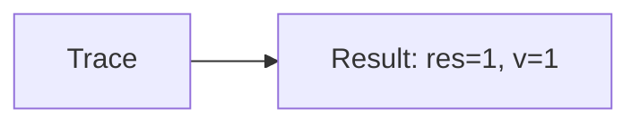

🔙 **[Kembali ke Daftar Soal](./README.md)**

---

# Latihan Soal Part C - Modul 02 - Set 01

### Soal 1
```cpp
// Razia: Short-Circuit AND
int razia = 52, v = 0;
if (razia > 50 && ++v > 0) res = 1;
else res = 0;
```
**Pertanyaan:**
1. Berapakah hasil akhirnya?
2. Deskripsikan alur pikir 'Compiler Manusia' untuk soal ini!

**Jawaban & Diagnosis:**
1. **res=1, v=1**
2. Razia 52 > 50? Ya (v naik).

**Mermaid Flowchart:**


---
### Soal 2
```cpp
// Ujian: Short-Circuit OR
int ujian = 18, v = 0;
if (ujian < 50 || ++v > 0) res = 1;
else res = 0;
```
**Pertanyaan:**
1. Berapakah hasil akhirnya?
2. Deskripsikan alur pikir 'Compiler Manusia' untuk soal ini!

**Jawaban & Diagnosis:**
1. **res=1, v=0**
2. Ujian 18 < 50? Ya (v=0).

**Mermaid Flowchart:**


---
### Soal 3
```cpp
// Promo: Short-Circuit AND
int promo = 99, v = 0;
if (promo > 50 && ++v > 0) res = 1;
else res = 0;
```
**Pertanyaan:**
1. Berapakah hasil akhirnya?
2. Deskripsikan alur pikir 'Compiler Manusia' untuk soal ini!

**Jawaban & Diagnosis:**
1. **res=1, v=1**
2. Promo 99 > 50? Ya (v naik).

**Mermaid Flowchart:**


---
### Soal 4
```cpp
// Level: Short-Circuit OR
int level = 71, v = 0;
if (level < 50 || ++v > 0) res = 1;
else res = 0;
```
**Pertanyaan:**
1. Berapakah hasil akhirnya?
2. Deskripsikan alur pikir 'Compiler Manusia' untuk soal ini!

**Jawaban & Diagnosis:**
1. **res=1, v=1**
2. Level 71 < 50? Tidak (v naik).

**Mermaid Flowchart:**


---
### Soal 5
```cpp
// Tiket: Short-Circuit AND
int tiket = 61, v = 0;
if (tiket > 50 && ++v > 0) res = 1;
else res = 0;
```
**Pertanyaan:**
1. Berapakah hasil akhirnya?
2. Deskripsikan alur pikir 'Compiler Manusia' untuk soal ini!

**Jawaban & Diagnosis:**
1. **res=1, v=1**
2. Tiket 61 > 50? Ya (v naik).

**Mermaid Flowchart:**


---
### Soal 6
```cpp
// VIP: Short-Circuit OR
int vip = 99, v = 0;
if (vip < 50 || ++v > 0) res = 1;
else res = 0;
```
**Pertanyaan:**
1. Berapakah hasil akhirnya?
2. Deskripsikan alur pikir 'Compiler Manusia' untuk soal ini!

**Jawaban & Diagnosis:**
1. **res=1, v=1**
2. VIP 99 < 50? Tidak (v naik).

**Mermaid Flowchart:**


---
### Soal 7
```cpp
// Denda: Short-Circuit AND
int denda = 77, v = 0;
if (denda > 50 && ++v > 0) res = 1;
else res = 0;
```
**Pertanyaan:**
1. Berapakah hasil akhirnya?
2. Deskripsikan alur pikir 'Compiler Manusia' untuk soal ini!

**Jawaban & Diagnosis:**
1. **res=1, v=1**
2. Denda 77 > 50? Ya (v naik).

**Mermaid Flowchart:**


---
### Soal 8
```cpp
// Bonus: Short-Circuit OR
int bonus = 30, v = 0;
if (bonus < 50 || ++v > 0) res = 1;
else res = 0;
```
**Pertanyaan:**
1. Berapakah hasil akhirnya?
2. Deskripsikan alur pikir 'Compiler Manusia' untuk soal ini!

**Jawaban & Diagnosis:**
1. **res=1, v=0**
2. Bonus 30 < 50? Ya (v=0).

**Mermaid Flowchart:**


---
### Soal 9
```cpp
// Stok: Short-Circuit AND
int stok = 12, v = 0;
if (stok > 50 && ++v > 0) res = 1;
else res = 0;
```
**Pertanyaan:**
1. Berapakah hasil akhirnya?
2. Deskripsikan alur pikir 'Compiler Manusia' untuk soal ini!

**Jawaban & Diagnosis:**
1. **res=0, v=0**
2. Stok 12 > 50? Tidak (v=0).

**Mermaid Flowchart:**


---
### Soal 10
```cpp
// Cuaca: Short-Circuit OR
int cuaca = 45, v = 0;
if (cuaca < 50 || ++v > 0) res = 1;
else res = 0;
```
**Pertanyaan:**
1. Berapakah hasil akhirnya?
2. Deskripsikan alur pikir 'Compiler Manusia' untuk soal ini!

**Jawaban & Diagnosis:**
1. **res=1, v=0**
2. Cuaca 45 < 50? Ya (v=0).

**Mermaid Flowchart:**


---
### Soal 11
```cpp
// Lampu: Short-Circuit AND
int lampu = 97, v = 0;
if (lampu > 50 && ++v > 0) res = 1;
else res = 0;
```
**Pertanyaan:**
1. Berapakah hasil akhirnya?
2. Deskripsikan alur pikir 'Compiler Manusia' untuk soal ini!

**Jawaban & Diagnosis:**
1. **res=1, v=1**
2. Lampu 97 > 50? Ya (v naik).

**Mermaid Flowchart:**


---
### Soal 12
```cpp
// Saklar: Short-Circuit OR
int saklar = 53, v = 0;
if (saklar < 50 || ++v > 0) res = 1;
else res = 0;
```
**Pertanyaan:**
1. Berapakah hasil akhirnya?
2. Deskripsikan alur pikir 'Compiler Manusia' untuk soal ini!

**Jawaban & Diagnosis:**
1. **res=1, v=1**
2. Saklar 53 < 50? Tidak (v naik).

**Mermaid Flowchart:**


---
### Soal 13
```cpp
// Pintu: Short-Circuit AND
int pintu = 54, v = 0;
if (pintu > 50 && ++v > 0) res = 1;
else res = 0;
```
**Pertanyaan:**
1. Berapakah hasil akhirnya?
2. Deskripsikan alur pikir 'Compiler Manusia' untuk soal ini!

**Jawaban & Diagnosis:**
1. **res=1, v=1**
2. Pintu 54 > 50? Ya (v naik).

**Mermaid Flowchart:**


---
### Soal 14
```cpp
// Alarm: Short-Circuit OR
int alarm = 96, v = 0;
if (alarm < 50 || ++v > 0) res = 1;
else res = 0;
```
**Pertanyaan:**
1. Berapakah hasil akhirnya?
2. Deskripsikan alur pikir 'Compiler Manusia' untuk soal ini!

**Jawaban & Diagnosis:**
1. **res=1, v=1**
2. Alarm 96 < 50? Tidak (v naik).

**Mermaid Flowchart:**


---
### Soal 15
```cpp
// Suhu: Short-Circuit AND
int suhu = 89, v = 0;
if (suhu > 50 && ++v > 0) res = 1;
else res = 0;
```
**Pertanyaan:**
1. Berapakah hasil akhirnya?
2. Deskripsikan alur pikir 'Compiler Manusia' untuk soal ini!

**Jawaban & Diagnosis:**
1. **res=1, v=1**
2. Suhu 89 > 50? Ya (v naik).

**Mermaid Flowchart:**


---
### Soal 16
```cpp
// Listrik: Short-Circuit OR
int listrik = 57, v = 0;
if (listrik < 50 || ++v > 0) res = 1;
else res = 0;
```
**Pertanyaan:**
1. Berapakah hasil akhirnya?
2. Deskripsikan alur pikir 'Compiler Manusia' untuk soal ini!

**Jawaban & Diagnosis:**
1. **res=1, v=1**
2. Listrik 57 < 50? Tidak (v naik).

**Mermaid Flowchart:**


---
### Soal 17
```cpp
// Air: Short-Circuit AND
int air = 25, v = 0;
if (air > 50 && ++v > 0) res = 1;
else res = 0;
```
**Pertanyaan:**
1. Berapakah hasil akhirnya?
2. Deskripsikan alur pikir 'Compiler Manusia' untuk soal ini!

**Jawaban & Diagnosis:**
1. **res=0, v=0**
2. Air 25 > 50? Tidak (v=0).

**Mermaid Flowchart:**


---
### Soal 18
```cpp
// Gas: Short-Circuit OR
int gas = 88, v = 0;
if (gas < 50 || ++v > 0) res = 1;
else res = 0;
```
**Pertanyaan:**
1. Berapakah hasil akhirnya?
2. Deskripsikan alur pikir 'Compiler Manusia' untuk soal ini!

**Jawaban & Diagnosis:**
1. **res=1, v=1**
2. Gas 88 < 50? Tidak (v naik).

**Mermaid Flowchart:**


---
### Soal 19
```cpp
// Bensin: Short-Circuit AND
int bensin = 98, v = 0;
if (bensin > 50 && ++v > 0) res = 1;
else res = 0;
```
**Pertanyaan:**
1. Berapakah hasil akhirnya?
2. Deskripsikan alur pikir 'Compiler Manusia' untuk soal ini!

**Jawaban & Diagnosis:**
1. **res=1, v=1**
2. Bensin 98 > 50? Ya (v naik).

**Mermaid Flowchart:**


---
### Soal 20
```cpp
// Uang: Short-Circuit OR
int uang = 52, v = 0;
if (uang < 50 || ++v > 0) res = 1;
else res = 0;
```
**Pertanyaan:**
1. Berapakah hasil akhirnya?
2. Deskripsikan alur pikir 'Compiler Manusia' untuk soal ini!

**Jawaban & Diagnosis:**
1. **res=1, v=1**
2. Uang 52 < 50? Tidak (v naik).

**Mermaid Flowchart:**


---
### Soal 21
```cpp
// Dompet: Short-Circuit AND
int dompet = 77, v = 0;
if (dompet > 50 && ++v > 0) res = 1;
else res = 0;
```
**Pertanyaan:**
1. Berapakah hasil akhirnya?
2. Deskripsikan alur pikir 'Compiler Manusia' untuk soal ini!

**Jawaban & Diagnosis:**
1. **res=1, v=1**
2. Dompet 77 > 50? Ya (v naik).

**Mermaid Flowchart:**
```mermaid
graph LR
A[Trace] --> B[Result: res=1, v=1]
```

---
### Soal 22
```cpp
// Saldo: Short-Circuit OR
int saldo = 97, v = 0;
if (saldo < 50 || ++v > 0) res = 1;
else res = 0;
```
**Pertanyaan:**
1. Berapakah hasil akhirnya?
2. Deskripsikan alur pikir 'Compiler Manusia' untuk soal ini!

**Jawaban & Diagnosis:**
1. **res=1, v=1**
2. Saldo 97 < 50? Tidak (v naik).

**Mermaid Flowchart:**
```mermaid
graph LR
A[Trace] --> B[Result: res=1, v=1]
```

---
### Soal 23
```cpp
// Transfer: Short-Circuit AND
int transfer = 26, v = 0;
if (transfer > 50 && ++v > 0) res = 1;
else res = 0;
```
**Pertanyaan:**
1. Berapakah hasil akhirnya?
2. Deskripsikan alur pikir 'Compiler Manusia' untuk soal ini!

**Jawaban & Diagnosis:**
1. **res=0, v=0**
2. Transfer 26 > 50? Tidak (v=0).

**Mermaid Flowchart:**
```mermaid
graph LR
A[Trace] --> B[Result: res=0, v=0]
```

---
### Soal 24
```cpp
// Bayar: Short-Circuit OR
int bayar = 17, v = 0;
if (bayar < 50 || ++v > 0) res = 1;
else res = 0;
```
**Pertanyaan:**
1. Berapakah hasil akhirnya?
2. Deskripsikan alur pikir 'Compiler Manusia' untuk soal ini!

**Jawaban & Diagnosis:**
1. **res=1, v=0**
2. Bayar 17 < 50? Ya (v=0).

**Mermaid Flowchart:**
```mermaid
graph LR
A[Trace] --> B[Result: res=1, v=0]
```

---
### Soal 25
```cpp
// Hutang: Short-Circuit AND
int hutang = 68, v = 0;
if (hutang > 50 && ++v > 0) res = 1;
else res = 0;
```
**Pertanyaan:**
1. Berapakah hasil akhirnya?
2. Deskripsikan alur pikir 'Compiler Manusia' untuk soal ini!

**Jawaban & Diagnosis:**
1. **res=1, v=1**
2. Hutang 68 > 50? Ya (v naik).

**Mermaid Flowchart:**
```mermaid
graph LR
A[Trace] --> B[Result: res=1, v=1]
```

---
