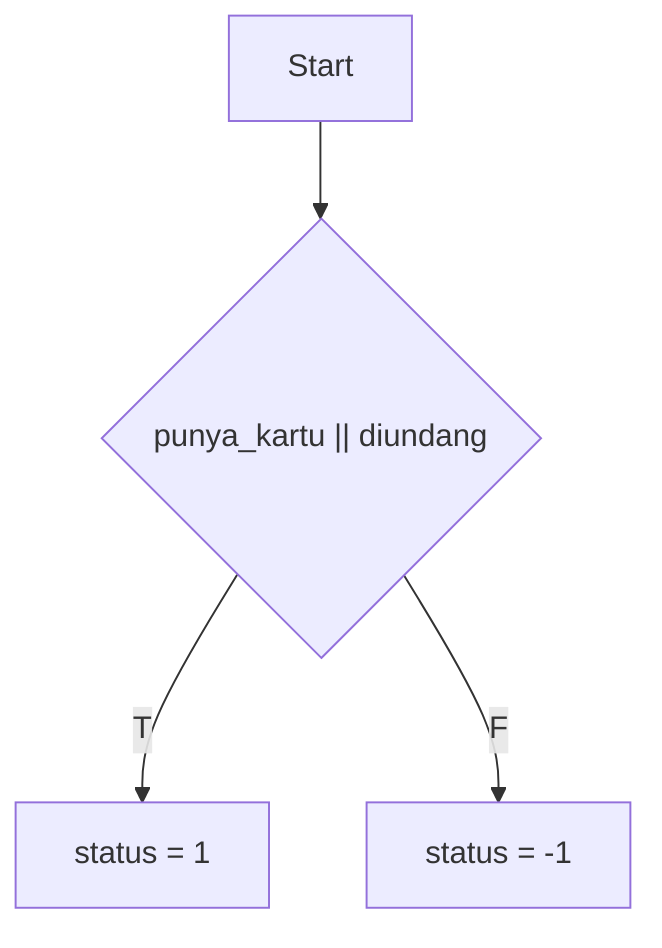
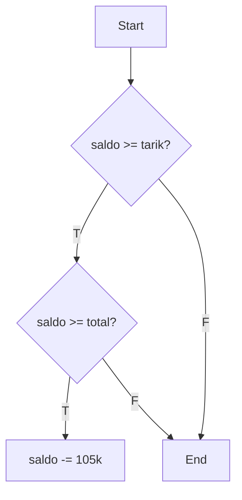
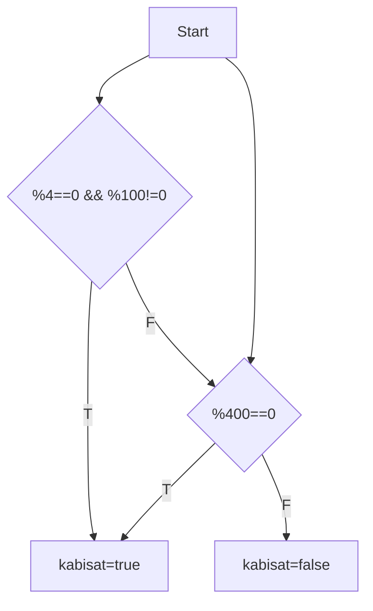
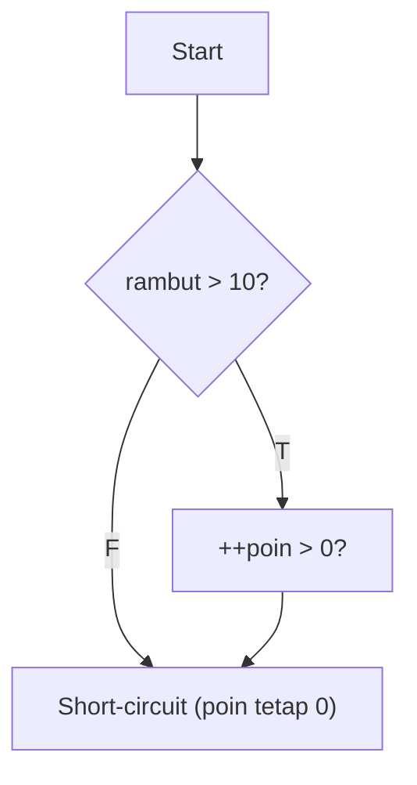
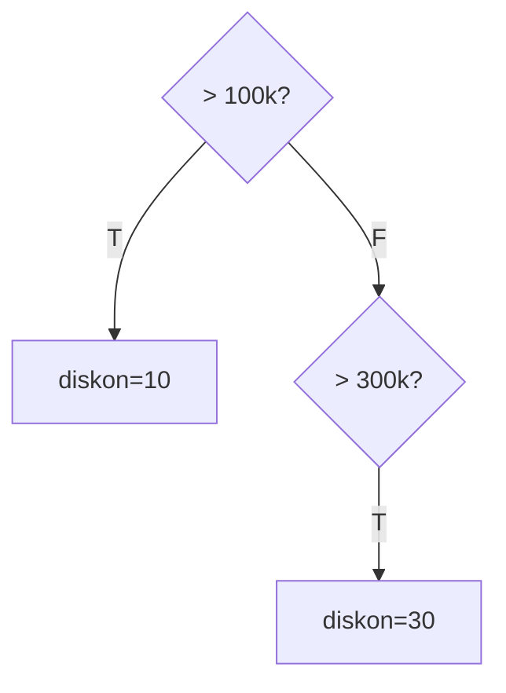
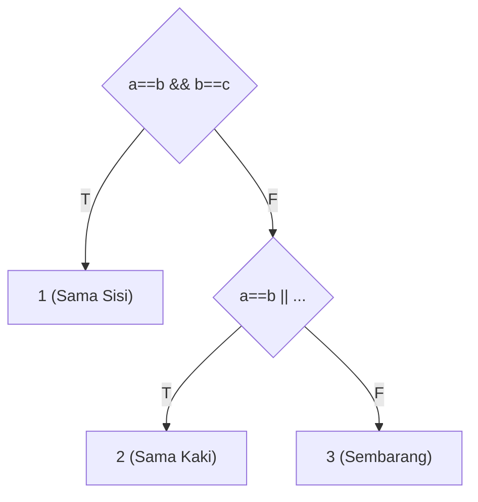
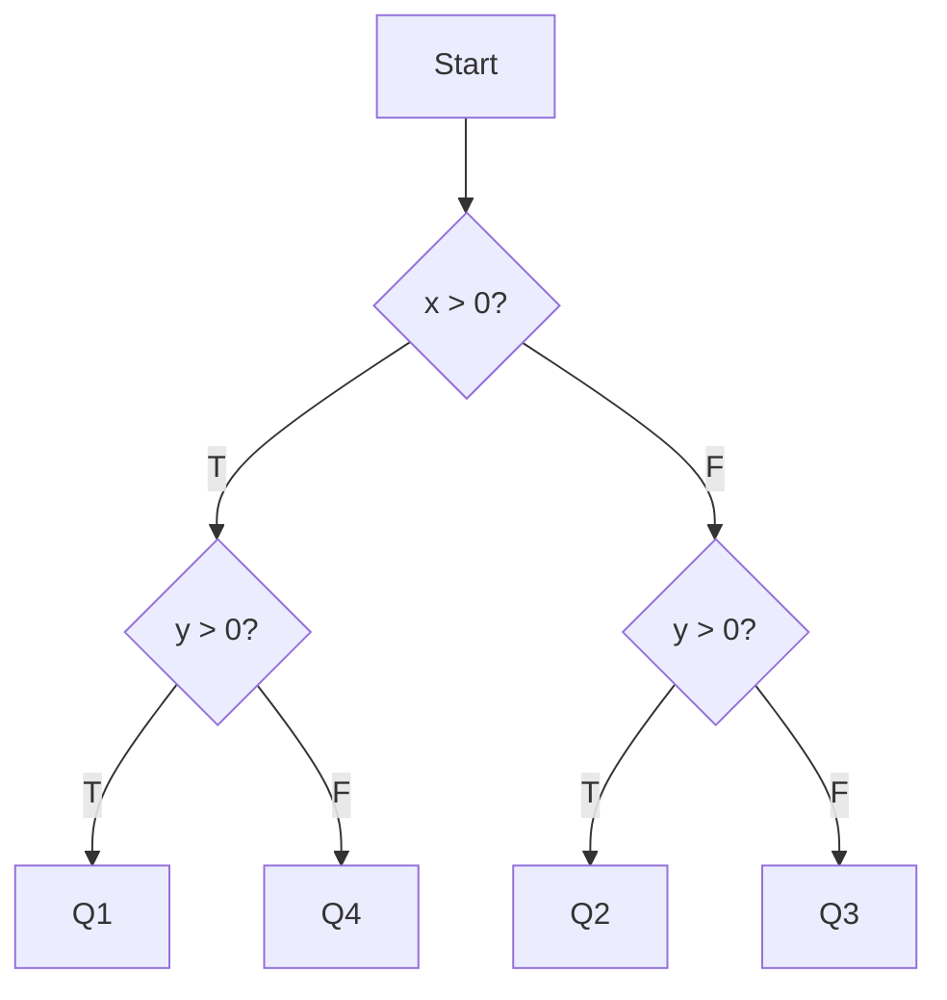
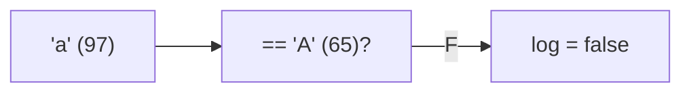
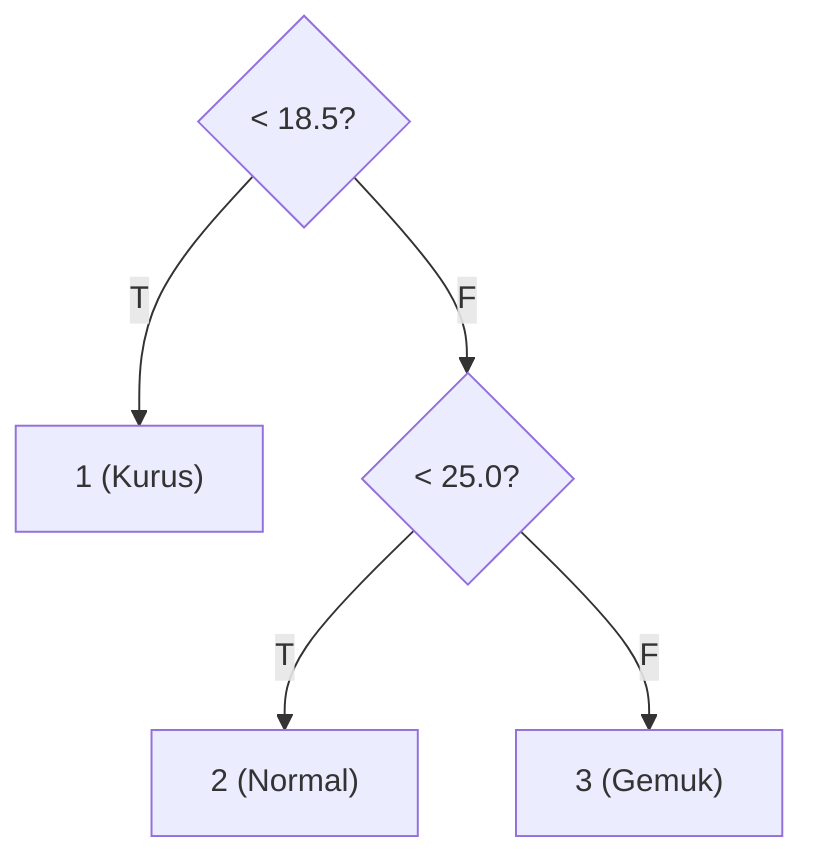
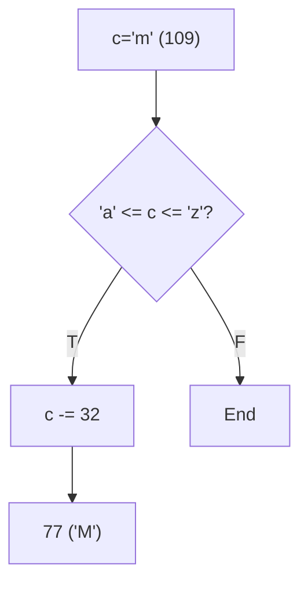

		🔙 **[Kembali ke Daftar Soal](./README.md)**

---

# Latihan Soal Part C - Modul 02 - Set 01 (Premium Edition)

> [!TIP]
> Fokus pada **Short-circuit Evaluation** (`&&` dan `||`). Ingat: Jika hasil akhir sudah pasti, C++ akan "malas" mengevaluasi bagian berikutnya!

---

### Soal 1: Gerbang Keamanan (Basic If-Else)
```cpp
// Skenario: Masuk komplek hanya jika punya kartu ATAU diundang
bool punya_kartu = false;
bool diundang = true;
int status = 0;

if (punya_kartu || diundang) {
    status = 1;
} else {
    status = -1;
}
```
**Pertanyaan:**
1. Berapakah nilai akhir `status`?
2. Apa yang sebenarnya terjadi di dalam mesin saat mengevaluasi `||` (OR)?

<details>
<summary><b>Klik untuk Lihat Jawaban & Diagnosis</b></summary>

**Mermaid Flowchart:**


**Jawaban:**
1. **1**
2. Karena `diundang` bernilai true, maka seluruh kondisi `if` menjadi true.

**📖 Analisis Mendalam:**
Ini adalah operasi logika OR standar. Cukup salah satu bernilai true, maka gerbang terbuka.
</details>

---

### Soal 2: Tarik Tunai (Nested If)
```cpp
// Skenario: Ambil uang 100rb, saldo 150rb, biaya admin 5rb
int saldo = 150000;
int tarik = 100000;
int biaya = 5000;

if (saldo >= tarik) {
    if (saldo >= (tarik + biaya)) {
        saldo -= (tarik + biaya);
    }
}
```
**Pertanyaan:**
1. Berapakah nilai `saldo` akhir?
2. Mengapa ada pemeriksaan `if` kedua di dalam `if` pertama?

<details>
<summary><b>Klik untuk Lihat Jawaban & Diagnosis</b></summary>

**Mermaid Flowchart:**


**Jawaban:**
1. **45000**
2. Untuk memastikan saldo mencukupi penarikan **sekaligus** biaya administrasinya.

**📖 Analisis Mendalam:**
Nested if memastikan pengecekan bertahap. Meskipun `150rb >= 100rb`, mesin dicek lagi apakah `150rb >= 105rb`. Karena benar, saldo berkurang.
</details>

---

### Soal 3: Tahun Kabisat (Complex Boolean)
```cpp
// Skenario: Cek tahun 2100
int tahun = 2100;
bool kabisat = false;

if ((tahun % 4 == 0 && tahun % 100 != 0) || (tahun % 400 == 0)) {
    kabisat = true;
}
```
**Pertanyaan:**
1. Berapakah nilai `kabisat` (true/false)?
2. Mengapa angka **2100** sering menjebak dalam logika ini?

<details>
<summary><b>Klik untuk Lihat Jawaban & Diagnosis</b></summary>

**Mermaid Flowchart:**


**Jawaban:**
1. **false** (0)
2. Karena 2100 habis dibagi 4, tapi juga habis dibagi 100, sementara ia **tidak** habis dibagi 400.

**📖 Analisis Mendalam:**
Logika kabisat asli: Kelipatan 4 tapi bukan 100, KECUALI kelipatan 400. 2100 gugur di syarat pertama (`tahun % 100 != 0` bernilai false) dan gugur di syarat kedua.
</details>

---

### Soal 4: Razia BP (Short-circuit Evaluation)
```cpp
// Skenario: Razia rambut. Jika panjang, poin pelanggaran naik.
int rambut_cm = 15;
int poin = 0;

if (rambut_cm > 10 && ++poin > 0) {
    // Berhasil masuk razia
}
```
**Pertanyaan:**
1. Berapakah nilai `poin` akhir?
2. Jika `rambut_cm = 5`, berapakah nilai `poin`? (Hati-hati!)

<details>
<summary><b>Klik untuk Lihat Jawaban & Diagnosis</b></summary>

**Mermaid Flowchart:**


**Jawaban:**
1. **1**
2. **0** (Poin tidak bertambah!)

**📖 Analisis Mendalam:**
Inilah **Short-circuit AND**. Jika bagian kiri (`5 > 10`) sudah False, C++ **TIDAK AKAN PERNAH** menjalankan bagian kanan (`++poin`). Mesin sudah tahu hasilnya pasti False, jadi ia tidak repot-repot menambah poin.
</details>

---

### Soal 5: Diskon Bertingkat (Else-If Order)
```cpp
// Skenario: Diskon member. Total belanja 200rb.
int belanja = 200000;
int diskon = 0;

if (belanja > 100000) diskon = 10;
else if (belanja > 300000) diskon = 30;
```
**Pertanyaan:**
1. Berapakah nilai `diskon` akhir?
2. Apa yang salah dengan urutan `if` di atas?

<details>
<summary><b>Klik untuk Lihat Jawaban & Diagnosis</b></summary>

**Mermaid Flowchart:**


**Jawaban:**
1. **10**
2. Urutan pengecekan terbalik. Angka 100rb "memakan" angka yang lebih besar.

**📖 Analisis Mendalam:**
Karena 200rb sudah memenuhi syarat `> 100rb`, ia langsung masuk ke blok pertama. C++ tidak akan mengecek blok `else if` di bawahnya lagi. Untuk diskon bertingkat, taruhlah syarat yang paling besar/sulit di paling atas!
</details>

---

### Soal 6: Jenis Segitiga (Equality Logic)
```cpp
int a=5, b=5, c=5;
int jenis = 0; // 1: Sama sisi, 2: Sama kaki, 3: Sembarang

if (a == b && b == c) jenis = 1;
else if (a == b || b == c || a == c) jenis = 2;
else jenis = 3;
```
**Pertanyaan:**
1. Berapakah nilai `jenis`?
2. Jika `a=5, b=5, c=7`, berapakah nilai `jenis`?

<details>
<summary><b>Klik untuk Lihat Jawaban & Diagnosis</b></summary>

**Mermaid Flowchart:**


**Jawaban:**
1. **1**
2. **2**

**📖 Analisis Mendalam:**
Pengecekan dimulai dari yang paling spesifik (ketiganya sama). Jika gagal, baru cek apakah ada minimal sepasang yang sama.
</details>

---

### Soal 7: Kuadran Koordinat (Sign Logic)
```cpp
int x = -5, y = 10;
int kuadran = 0;

if (x > 0) {
    if (y > 0) kuadran = 1;
    else kuadran = 4;
} else {
    if (y > 0) kuadran = 2;
    else kuadran = 3;
}
```
**Pertanyaan:**
1. Di `kuadran` manakah titik tersebut berada?
2. Gambarkan alur pikirnya secara singkat!

<details>
<summary><b>Klik untuk Lihat Jawaban & Diagnosis</b></summary>

**Mermaid Flowchart:**


**Jawaban:**
1. **2**
2. x negatif (kiri), y positif (atas) -> Kuadran 2.
</details>

---

### Soal 8: Login Case Sensitive (String Simulation)
```cpp
char user_input = 'a';
char user_db = 'A';
bool log = false;

if (user_input == user_db) log = true;
```
**Pertanyaan:**
1. Apakah `log` bernilai true?
2. Mengapa 'a' dan 'A' dianggap berbeda oleh mesin?

<details>
<summary><b>Klik untuk Lihat Jawaban & Diagnosis</b></summary>

**Mermaid Flowchart:**


**Jawaban:**
1. **false**
2. Karena nilai ASCII-nya berbeda ('a'=97, 'A'=65).

**📖 Analisis Mendalam:**
Operator `==` pada tipe data primitif C++ sangat kaku. Ia membandingkan bit batinnya, bukan "kemiripan huruf" menurut kacamata manusia.
</details>

---

### Soal 9: Klasifikasi BMI (Nested Else-If)
```cpp
double bmi = 24.5;
int cat = 0; // 1: Kurus, 2: Normal, 3: Gemuk

if (bmi < 18.5) cat = 1;
else if (bmi < 25.0) cat = 2;
else cat = 3;
```
**Pertanyaan:**
1. Berapakah nilai `cat`?
2. Apa keuntungan menggunakan `else if` dibanding banyak `if` terpisah?

<details>
<summary><b>Klik untuk Lihat Jawaban & Diagnosis</b></summary>

**Mermaid Flowchart:**


**Jawaban:**
1. **2**
2. **Efisiensi**. Begitu satu syarat terpenuhi, mesin langsung melompat ke akhir blok tanpa mengecek syarat lainnya.

**📖 Analisis Mendalam:**
Karena 24.5 masuk ke rentang `< 25.0`, maka `cat = 2`. Blok `else` tidak akan pernah tersentuh.
</details>

---

### Soal 10: Toggler Karakter (ASCII Check)
```cpp
char c = 'm';
if (c >= 'a' && c <= 'z') {
    c -= 32;
}
```
**Pertanyaan:**
1. Karakter apakah `c` di akhir program?
2. Syarat di dalam `if` berfungsi untuk mendeteksi apa?

<details>
<summary><b>Klik untuk Lihat Jawaban & Diagnosis</b></summary>

**Mermaid Flowchart:**


**Jawaban:**
1. **'M'** (Huruf besar)
2. Mendeteksi apakah karakter tersebut adalah **huruf kecil**.

**📖 Analisis Mendalam:**
Ini adalah implementasi fungsi `toupper()` secara manual. Mengurangi 32 dari ASCII huruf kecil akan mengubahnya menjadi versi huruf besarnya.
</details>
