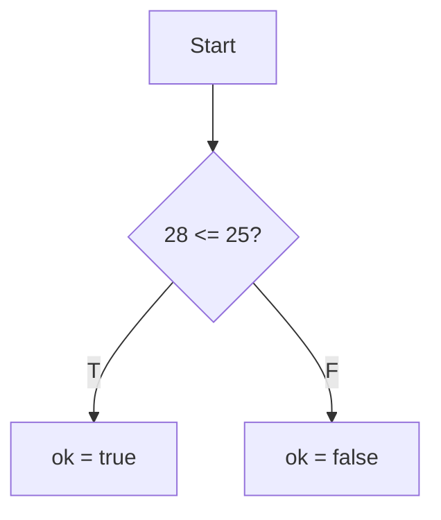
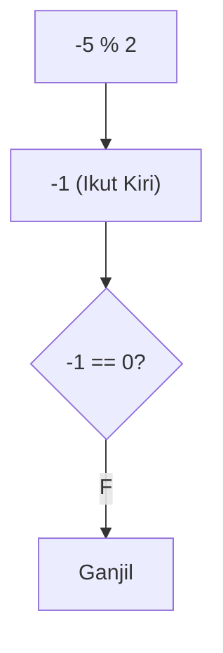
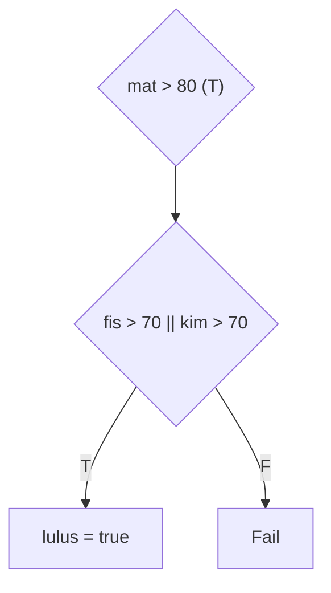
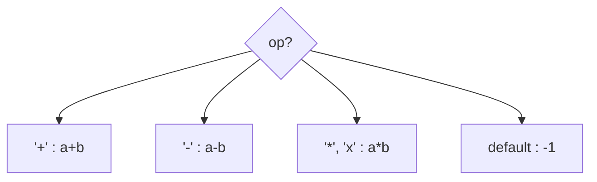
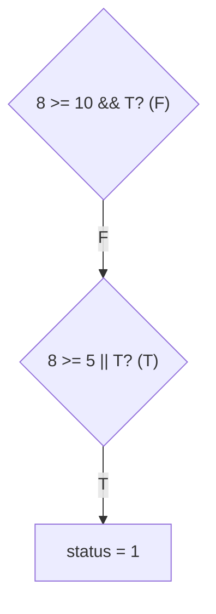
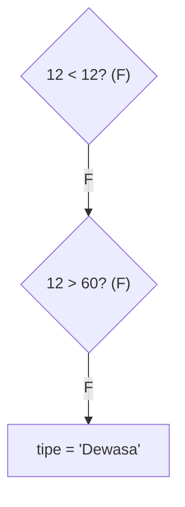
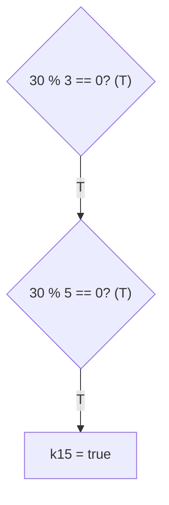
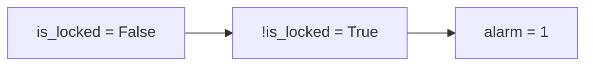
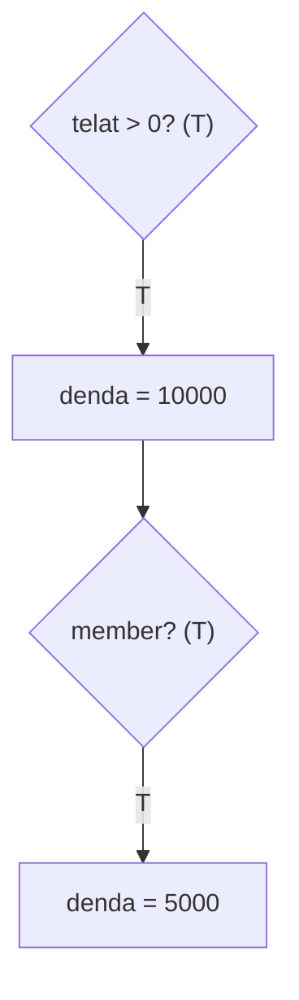
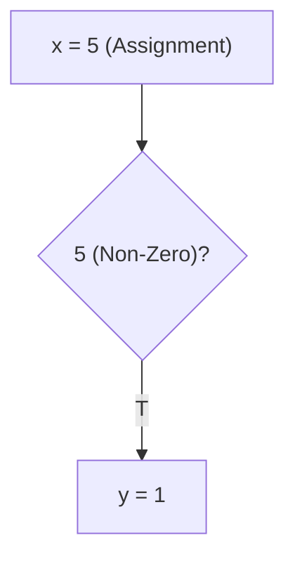

		🔙 **[Kembali ke Daftar Soal](./README.md)**

---

# Latihan Soal Part C - Modul 02 - Set 02 (Premium Edition)

---

### Soal 11: Validasi Voucher (Expiry Logic)
```cpp
// Skenario: Voucher valid jika hari ini <= tanggal kadaluarsa
int hari_ini = 28;
int kadaluarsa = 25;
bool ok = false;

if (hari_ini <= kadaluarsa) {
    ok = true;
}
```
**Pertanyaan:**
1. Berapakah nilai `ok` (0 atau 1)?
2. Apakah voucher masih bisa digunakan?

<details>
<summary><b>Klik untuk Lihat Jawaban & Diagnosis</b></summary>

**Mermaid Flowchart:**


**Jawaban:**
1. **0** (False)
2. **Tidak.** Karena `28 <= 25` bernilai salah.

**📖 Analisis Mendalam:**
Logika perbandingan ini sering digunakan untuk memvalidasi tenggat waktu (deadline).
</details>

---

### Soal 12: Modulo Negatif (Ganjil-Genap)
```cpp
int n = -5;
int hasil = n % 2;

if (hasil == 0) {
    // Genap
} else {
    // Ganjil
}
```
**Pertanyaan:**
1. Berapakah nilai `hasil`?
2. Apakah `-5` akan terdeteksi sebagai Ganjil dalam kode di atas?

<details>
<summary><b>Klik untuk Lihat Jawaban & Diagnosis</b></summary>

**Mermaid Flowchart:**


**Jawaban:**
1. **-1**
2. **Ya.** Karena `-1 != 0`, maka blok `else` dieksekusi.

**📖 Analisis Mendalam:**
Ingat aturan batin C++: Tanda `%` mengikuti angka di kiri. `-5 % 2` menghasilkan `-1`. Karena `-1` tidak sama dengan `0`, maka angka tersebut dikategorikan Ganjil.
</details>

---

### Soal 13: Seleksi Masuk (Compound Logic)
```cpp
// Lulus jika Matematika > 80 DAN (Fisika > 70 ATAU Kimia > 70)
int mat = 85, fis = 65, kim = 75;
bool lulus = false;

if (mat > 80 && (fis > 70 || kim > 70)) {
    lulus = true;
}
```
**Pertanyaan:**
1. Berapakah nilai `lulus`?
2. Mengapa tanda kurung `(...)` pada bagian Fisika dan Kimia sangat penting?

<details>
<summary><b>Klik untuk Lihat Jawaban & Diagnosis</b></summary>

**Mermaid Flowchart:**


**Jawaban:**
1. **true** (1)
2. Untuk memastikan operasi `||` dikerjakan sebagai satu kesatuan syarat pendukung.

**📖 Analisis Mendalam:**
`mat > 80` adalah true. `(65 > 70 || 75 > 70)` $\rightarrow$ `(false || true)` $\rightarrow$ true. Hasil akhirnya: `true && true` $\rightarrow$ **true**.
</details>

---

### Soal 14: Kalkulator Switch (Switch Case)
```cpp
char op = 'x';
int a = 10, b = 5, hasil = 0;

switch(op) {
    case '+': hasil = a + b; break;
    case '-': hasil = a - b; break;
    case '*': 
    case 'x': hasil = a * b; break;
    default: hasil = -1;
}
```
**Pertanyaan:**
1. Berapakah nilai `hasil`?
2. Mengapa `case '*'` tidak memiliki kode sendiri?

<details>
<summary><b>Klik untuk Lihat Jawaban & Diagnosis</b></summary>

**Mermaid Flowchart:**


**Jawaban:**
1. **50**
2. Untuk mendukung **Multiple Cases** (simbol '*' dan 'x' memiliki efek yang sama).

**📖 Analisis Mendalam:**
Ini adalah teknik *fallthrough* yang disengaja. Jika `op` adalah '*', dia akan "jatuh" ke kode milik 'x'.
</details>

---

### Soal 15: Akses Level (Prasyarat)
```cpp
int level = 8;
bool punya_kunci = true;
int status = 0;

if (level >= 10 && punya_kunci) {
    status = 2; // Akses Bos
} else if (level >= 5 || punya_kunci) {
    status = 1; // Akses Normal
}
```
**Pertanyaan:**
1. Berapakah nilai `status`?
2. Jika `punya_kunci = false`, berapakah nilai `status`?

<details>
<summary><b>Klik untuk Lihat Jawaban & Diagnosis</b></summary>

**Mermaid Flowchart:**


**Jawaban:**
1. **1**
2. **1** (Karena `level >= 5` masih true).

**📖 Analisis Mendalam:**
Syarat pertama gagal karena level kurang. Syarat kedua berhasil karena level mencukupi (atau punya kunci).
</details>

---

### Soal 16: Tiket Bioskop (Kategori Umur)
```cpp
int umur = 12;
string tipe = "Dewasa";

if (umur < 12) tipe = "Anak";
else if (umur > 60) tipe = "Lansia";
```
**Pertanyaan:**
1. Berapakah nilai `tipe`?
2. Kenapa umur 12 tidak masuk kategori "Anak"?

<details>
<summary><b>Klik untuk Lihat Jawaban & Diagnosis</b></summary>

**Mermaid Flowchart:**


**Jawaban:**
1. **"Dewasa"**
2. Karena syaratnya adalah `< 12` (kurang dari), bukan `<= 12` (kurang dari atau sama dengan).
</details>

---

### Soal 17: Kelipatan 15 (Common Divisor)
```cpp
int n = 30;
bool k15 = false;

if (n % 3 == 0) {
    if (n % 5 == 0) {
        k15 = true;
    }
}
```
**Pertanyaan:**
1. Berapakah nilai `k15`?
2. Tuliskan satu baris perintah `if` yang setara dengan kode di atas!

<details>
<summary><b>Klik untuk Lihat Jawaban & Diagnosis</b></summary>

**Mermaid Flowchart:**


**Jawaban:**
1. **true**
2. `if (n % 3 == 0 && n % 5 == 0)` atau `if (n % 15 == 0)`.
</details>

---

### Soal 18: Inversi Logika (Not Operator)
```cpp
bool is_locked = false;
int alarm = 0;

if (!is_locked) {
    alarm = 1;
}
```
**Pertanyaan:**
1. Berapakah nilai `alarm`?
2. Apa maksud dari simbol `!`?

<details>
<summary><b>Klik untuk Lihat Jawaban & Diagnosis</b></summary>

**Mermaid Flowchart:**


**Jawaban:**
1. **1**
2. **NOT** (Membalikkan nilai: true jadi false, false jadi true).
</details>

---

### Soal 19: Denda Perpustakaan (Nested Logic)
```cpp
int telat = 5;
bool member = true;
int denda = 0;

if (telat > 0) {
    denda = telat * 2000;
    if (member) {
        denda /= 2;
    }
}
```
**Pertanyaan:**
1. Berapakah nilai `denda` akhir?
2. Berapa denda jika `member = false`?

<details>
<summary><b>Klik untuk Lihat Jawaban & Diagnosis</b></summary>

**Mermaid Flowchart:**


**Jawaban:**
1. **5000**
2. **10000**
</details>

---

### Soal 20: ⚠️ Jebakan Maut (Assignment Trace)
```cpp
int x = 10;
int y = 0;

if (x = 5) {
    y = 1;
} else {
    y = -1;
}
```
**Pertanyaan:**
1. Berapakah nilai `x` setelah blok `if` selesai?
2. Berapakah nilai `y`? (Hati-hati, ini soal tersulit di set ini!)

<details>
<summary><b>Klik untuk Lihat Jawaban & Diagnosis</b></summary>

**Mermaid Flowchart:**


**Jawaban:**
1. **5**
2. **1**

**📖 Analisis Mendalam:**
Perhatikan tandanya! `if (x = 5)` menggunakan **satu sama dengan** (Assignment), bukan dua (`==`). 
1. Mesin mengubah nilai `x` menjadi **5**. 
2. Hasil dari assignment `(x = 5)` adalah **5**. 
3. Di C++, angka non-nol (seperti 5) dianggap **true**.
Akibatnya, blok pertama `y = 1` dieksekusi! Ini adalah bug paling populer di dunia C++.
</details>
