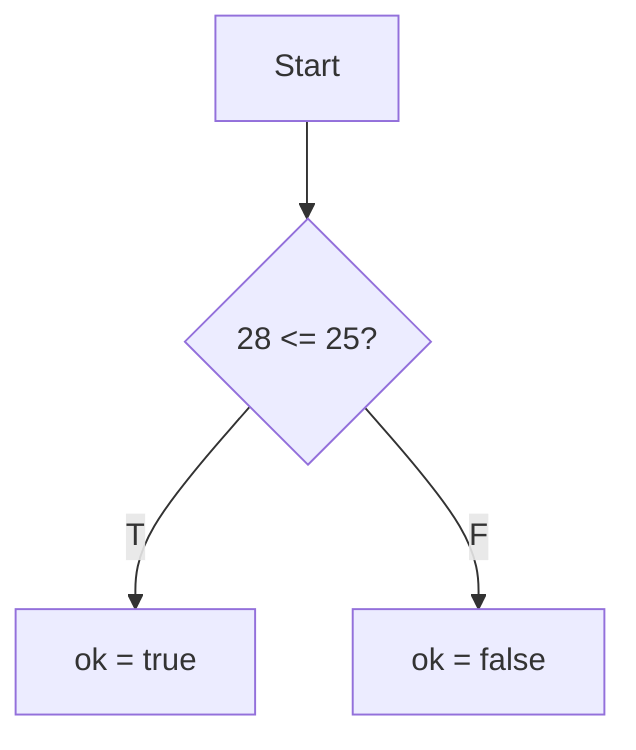
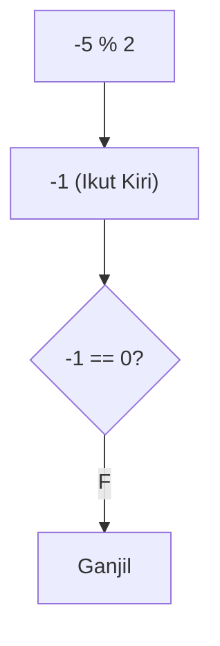
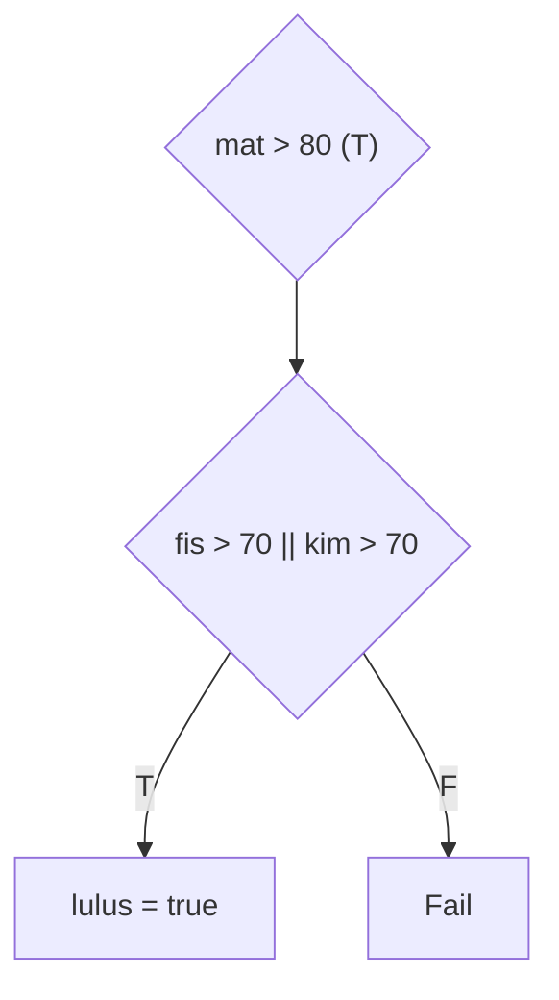
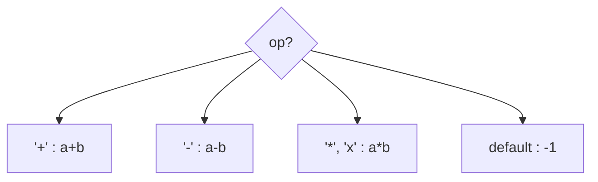
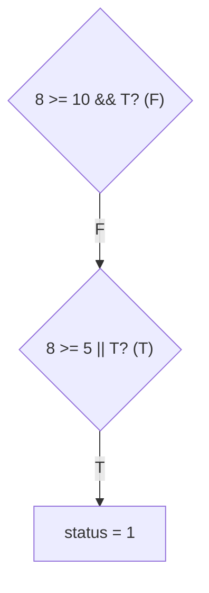
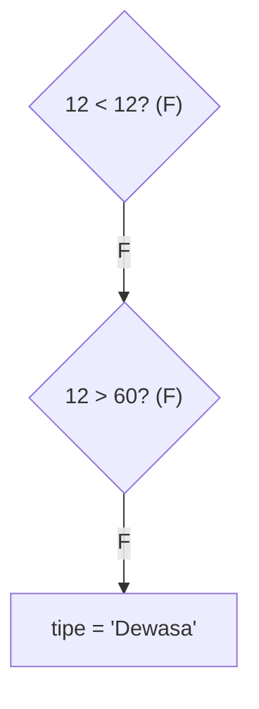
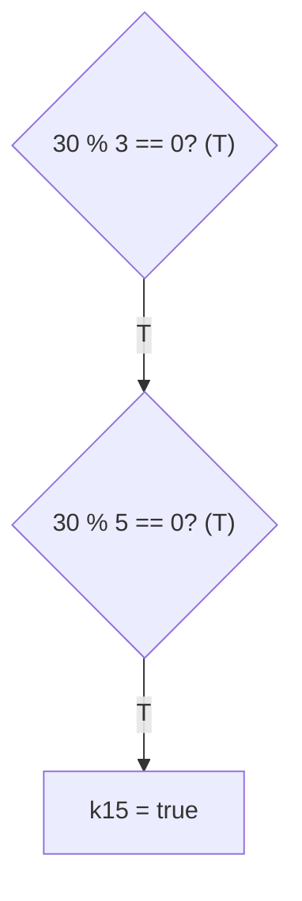
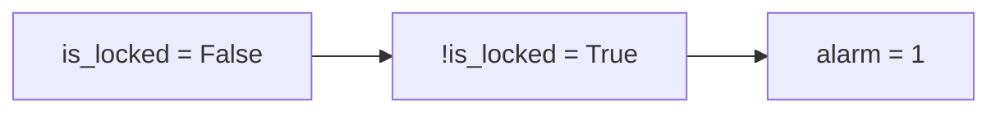
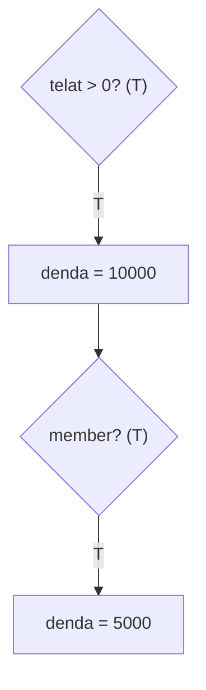
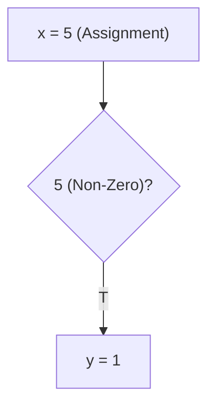

		🔙 **[Kembali ke Daftar Soal](./README.md)**

---

# Latihan Soal Part C - Modul 02 - Set 02 (Premium Edition)

---

### Soal 11: Validasi Voucher (Expiry Logic)
```cpp
// Skenario: Voucher valid jika hari ini <= tanggal kadaluarsa
int hari_ini = 28;
int kadaluarsa = 25;
bool ok = false;

if (hari_ini <= kadaluarsa) {
    ok = true;
}
```
**Pertanyaan:**
1. Berapakah nilai `ok` (0 atau 1)?
2. Apakah voucher masih bisa digunakan?

<details>
<summary><b>Klik untuk Lihat Jawaban & Diagnosis</b></summary>

**Mermaid Flowchart:**


**Jawaban:**
1. **0** (False)
2. **Tidak.** Karena `28 <= 25` bernilai salah.

**📖 Analisis Mendalam (Step-by-Step):**
1. **Pengecekan Tipe Relasional**: Operator `<=` (Kurang dari atau Sama Dengan) ditugaskan untuk membandingkan dua besaran integer. Ekspresi `hari_ini <= kadaluarsa` diterjemahkan oleh mesin C++ menjadi operasi logis `28 <= 25`.
2. **Evaluasi Kebenaran Bilangan**: Karena nilai 28 secara matematis lebih besar dari 25, maka pernyataan "28 kurang dari atau sama dengan 25" merupakan sebuah kebohongan logis. Fungsi ini mengembalikan nilai absolut Boolean **`false`** (direpresentasikan dengan angka rasional `0`).
3. **Konsekuensi Alur Eksekusi**: Karena prasyarat nilai ekspresi `if` gagal terpenuhi (`false`), kontrol aliran dari *compiler* otomatis akan mengabaikan tubuh pernyataan (*body statement*) di dalam kurung kurawal. Perintah penugasan kembali `ok = true;` tidak pernah disinggung oleh mesin.
4. **Hasil Integrasi Akhir**: Nilai pada variabel `ok` akan terus menyimpan nilai bawaan dari inisialisasinya, yaitu bernilai logis **`false`** (0). Logika seperti ini umum dikerjakan untuk merancang *firewall* pelindung untuk pengecekan tanggal daluarsa sistem (*Expiry Date Verification*).
</details>

---

### Soal 12: Modulo Negatif (Ganjil-Genap)
```cpp
int n = -5;
int hasil = n % 2;

if (hasil == 0) {
    // Genap
} else {
    // Ganjil
}
```
**Pertanyaan:**
1. Berapakah nilai `hasil`?
2. Apakah `-5` akan terdeteksi sebagai Ganjil dalam kode di atas?

<details>
<summary><b>Klik untuk Lihat Jawaban & Diagnosis</b></summary>

**Mermaid Flowchart:**


**Jawaban:**
1. **-1**
2. **Ya.** Karena `-1 != 0`, maka blok `else` dieksekusi.

**📖 Analisis Mendalam (Step-by-Step):**
1. **Sifat Matematis Operator Modulo**: Di dalam standar bahasa C (sejak revisi standar C99) dan C++ standar (mulai C++11), aturan pembagian sisa terhadap nilai minus mutlak menetapkan kaidah bahwa "tanda pembagian sisa pada fungsi komputasi (*remainder sign*) selalu mengekor (sejalan/identik) dengan lambang operand bilangan sebelah kiri (*dividend*)".
2. **Kalkulasi Sisa Bagi**: Ketika operasi aritmetika `n % 2` yang bermuatan `-5 % 2` dikalkulasikan, hasil rasionalnya bukan nilai absolut `1`, melainkan berpenyesuaian tanda negatif, yakni menorehkan angka presisi **`-1`**.
3. **Keterbacaan Percabangan**: Variabel `hasil` mewarisi ekuivalen hitungan `-1`. Mesin mengomparasi kondisional penugasan cabang utama: `if (hasil == 0)`. Hal ini identik dengan bertanya "Apakah -1 setara persis dengan 0?". Karena secara faktual tidak seimbang, hasil penguraian logikanya jatuh memihak padanan nilai Boolean gagal (**`false`**).
4. **Respon Alur Keputusan**: Berhubung komparasi bernilai nihil/ditolak, C++ memerintahkan kode menyingkir dari badan *if* blok utama, melompat terarah masuk mencerna klausa pengungsian sekunder `else`. Blok `else` ini dipastikan dijalankan sempurna karena tidak membawahi pemeriksaan kondisi baru, yang memastikan pengkategorian -5 sah masuk kepada label **Ganjil**. Hal ini patut diajarkan agar peserta tidak terkecoh mencari nilai `1` mutlak saat memeriksa status paritas angka berpolaritas negatif mutlak!
</details>

---

### Soal 13: Seleksi Masuk (Compound Logic)
```cpp
// Lulus jika Matematika > 80 DAN (Fisika > 70 ATAU Kimia > 70)
int mat = 85, fis = 65, kim = 75;
bool lulus = false;

if (mat > 80 && (fis > 70 || kim > 70)) {
    lulus = true;
}
```
**Pertanyaan:**
1. Berapakah nilai `lulus`?
2. Mengapa tanda kurung `(...)` pada bagian Fisika dan Kimia sangat penting?

<details>
<summary><b>Klik untuk Lihat Jawaban & Diagnosis</b></summary>

**Mermaid Flowchart:**


**Jawaban:**
1. **true** (1)
2. Untuk memastikan operasi `||` dikerjakan sebagai satu kesatuan syarat pendukung.

**📖 Analisis Mendalam (Step-by-Step):**
1. **Evaluasi Prioritas Operator**: Pada rumpun aturan bahasa C++, sub-ekspresi rasional yang berada terisolasi di dalam wilayah tanda pembatas berupa tanda kurung siku `(...)` berhak memperoleh kasta prioritas eksekusi komputasional mendahului perangkai logik yang ternaung bebas (`&&`). Ini mengadopsi model aljabar relasional standar.
2. **Evaluasi Ruang Kurung (Kondisi Gabungan Pilihan)**: Mesin berfokus pada ruang di dalam parameter yang dibingkai tanda kurung terlebih dahulu: `(fis > 70 || kim > 70)`. Uji kesepadanan tereduksi menjadi pemeringkatan bilangan: `(65 > 70 || 75 > 70)`.
   - Analitik kondisi sub-bagian kiri ruas OR: `65 > 70` berwujud pernyataan tak tervalidasi alias bernilai **`false`**.
   - Analitik kondisi sub-bagian kanan ruas sub-OR: `75 > 70` merupa kenyataan logis berwujud teguh **`true`**.
   - Komutasi final blok logis gabungan kurung (`false || true`): Operator OR merilis hasil purna bernilai sah **`true`** selagi terdapat setidaknya satuan kondisi benar.
3. **Sinergi Kriteria Prasyarat Wajib (Operator Gabung Rantai)**: Kini kompilator menyusun ekuasi akhir dari kesatuan cabang terluarnya: `if (mat > 80 && [Kumpulan_Sub_Teruji_Sebelumnya])`. Parameter tertafsir: `if (85 > 80 && true)`. Rasio nilai tes matematika `85 > 80` pun merilis fakta kebenaran rasio mantap (`true`).
4. **Sintesis Logika Rantai Komperehensif Akhir**: Eksekusi memihak pada kesepadanan: `true && true`. Operator AND merepresentasikan syarat keterikatan fana ganda bersinergi solid. Dua kutub benarnya melahirkan kepastian konstan kebenaran nilai statis logis (**`true`**), mendadak mengikhlaskan sistem menaikkan stempel flag nilai variabel rasional menjadi penanda `lulus = true`. Absennya pengurungan yang pas sangat krusial, tanpanya kompilator berbalik membaca evaluasi keliru karena `&&` menempuh urutan eksekusi mengungguli `||` secara hierarki murni.
</details>

---

### Soal 14: Kalkulator Switch (Switch Case)
```cpp
char op = 'x';
int a = 10, b = 5, hasil = 0;

switch(op) {
    case '+': hasil = a + b; break;
    case '-': hasil = a - b; break;
    case '*': 
    case 'x': hasil = a * b; break;
    default: hasil = -1;
}
```
**Pertanyaan:**
1. Berapakah nilai `hasil`?
2. Mengapa `case '*'` tidak memiliki kode sendiri?

<details>
<summary><b>Klik untuk Lihat Jawaban & Diagnosis</b></summary>

**Mermaid Flowchart:**


**Jawaban:**
1. **50**
2. Untuk mendukung **Multiple Cases** (simbol '*' dan 'x' memiliki efek yang sama).

**📖 Analisis Mendalam (Step-by-Step):**
1. **Konsep Penelusuran Percabangan Berganda (`Switch-Case`)**: Struktur arsitektur pemilih logikal `switch` di bahasa C/C++ memanfaatkan pengecekan selektif persis ke parameter tunggal (`op = 'x'`). Evaluasi diarahkan langsung dengan memindai daftar entri pelabelan *case* yang tertera pada blok di lapis bawah komandonya. 
2. **Kesesuaian Target Label (*Label Matching*)**: Operator merambat melompati baris-baris pemeriksaan logis *case*: 
   - `case '+':` (gagal, karena 'x' tidak identik dengan '+')
   - `case '-':` (gagal)
   - `case '*':` (gagal)
   - `case 'x':` (Terdapat temuan konstan cocok atau `Match Found!`. Evaluator memposisikan kompilator beroperasi mendarat stabil di lini pernyataan pengujian pada perihal blok ini).
3. **Pelibatan Modus Arus Eksekusi (*Fallthrough Effect*)**: Seandainya pengguna memasukkan perumpamaan rasional awal simbol silang wujud murni bintang alias *asterisk* (yakni nilai var `op = '*'`), maka kompilator menemukan persesuaian di baris identifikasi `case '*'`. Kendati demikian, tidak adanya pemotong interupsi pelompat interselular `break;` mensyaratkan C++ terus menerobos terjun lebur merambat menjalankan instruksi eksekusi di sekuens blok bagian `case 'x'` pada baris lapis setelahnya! Algoritmenya seakan-akan merajut pemutusan komplementer untuk dua label pemicu berbeda `(*` dan `x)`. Perilaku pelibatan merambat seakan bocor tak bertuan ini di dunia pemrogaman komputasional edukatif dinamakan modus terapan efisiensi penyatu wujud pengondisian rincian berlapis ganda bernama teknik implementatif integrasi **Fallthrough**. 
4. **Hasil Akhir Eksekutor**: Berkat validasi pencocokan pada kondisi panji baris `'x'`, kalkulator fisis C++ menggawangi hitungan numerik penggabung integral `hasil = a * b` (alias 10 × 5 = 50). Penutup `break;` bertugas mengevakuasi sirkuit lompatan untuk serta-merta melompati pelabelan gantung di sisa pilar saksi *default* sehingga `hasil` absolut murni berhenti mengkalkulasi mantap mendatapi fiksasi rentak buntu mematri sisa pengisian `50`.
</details>

---

### Soal 15: Akses Level (Prasyarat)
```cpp
int level = 8;
bool punya_kunci = true;
int status = 0;

if (level >= 10 && punya_kunci) {
    status = 2; // Akses Bos
} else if (level >= 5 || punya_kunci) {
    status = 1; // Akses Normal
}
```
**Pertanyaan:**
1. Berapakah nilai `status`?
2. Jika `punya_kunci = false`, berapakah nilai `status`?

<details>
<summary><b>Klik untuk Lihat Jawaban & Diagnosis</b></summary>

**Mermaid Flowchart:**


**Jawaban:**
1. **1**
2. **1** (Karena `level >= 5` masih true).

**📖 Analisis Mendalam (Step-by-Step):**
1. **Hirarki Alur Pelaksanaan Pemilihan Kondisional Berjenjang (*If-Else Ladder*)**: Mesin kompilator wajib membajak merambahi evaluasi hierarki pengujian `if` terpenting di rentak baris tumpuan primer puncak blok utamanya terlebih dahulu. 
2. **Evaluasi Blok *If* Utama**: Syarat pertamanya berwujud `(level >= 10 && punya_kunci)`. Karena relasional parameter `level` bernilai `8`, maka ekspresi pengujian pembuka `8 >= 10` langsung dikategorikan sebagai penyataan gagal fiktif **`false`**. Implementasi tata aturan murni *Short-Circuit AND* langsung menghempaskan permohonan seleksi pengungkapan tahap ini, lalu menyingkirkan baris penyetaraan pias penugasan akses level atas. Kompilator mengevakuasi alur turun ke pelataran *else if*. 
3. **Evaluasi Struktur Cabang Pendamping (*Else-If*)**: Tahap kedua membedah konstruksi syarat penengah rasionalitas. Pernyataan ekuivalensi blok kedua adalah `(level >= 5 || punya_kunci)`.
   - Mengamati ruas komparasional sub-bagian kiri sakral ini: `8 >= 5` yang ditafsir menjadi kenyataan absolut solid komparasi valid divalidasi presisi beridentitas formal kebenaran rasio **`true`**. 
   - Karakteristik pemutus efisien di pias operator logika OR (`||`) memvalidasi perlakuan metode pemotong kinerja sirkuit murni *Short-Circuit* seketika itu juga. Karena bagian kepuasan blok telah tercatat teridentifikasi sebagian separuh bernilai logik utuh murni *true*, pemuas sistem memicu nilai final pemutus tervalidasi pamungkas untuk seluruh ekspresi ini bersifat hakiki **`true`**. Pengecekan pias sisa boolean `punya_kunci` otomatis dilewatkan oleh mesin dan disingkirkan dari ranah eksekusi pengujian waktu henti.
4. **Bentuk Ekstraksi Konklusional Konstan Murni**: Karena prasyarat bagian validasi pengkondisian komputasional pada tahap 2 dieksekusi benar sempurna (`true`), sistem menetapkan parameter rill `status` merombak data wujudnya menjadi bilangan bulat sejati murni **`1`**. C++ mengedepankan model skema pemeriksaan berlapis ini sebagai arsitektural ganda metode verifikasi kelayakan ganda *(Priority Access Control Check)* yang sangat fundamental di pemrograman keamanan.
</details>

---

### Soal 16: Tiket Bioskop (Kategori Umur)
```cpp
int umur = 12;
string tipe = "Dewasa";

if (umur < 12) tipe = "Anak";
else if (umur > 60) tipe = "Lansia";
```
**Pertanyaan:**
1. Berapakah nilai `tipe`?
2. Kenapa umur 12 tidak masuk kategori "Anak"?

<details>
<summary><b>Klik untuk Lihat Jawaban & Diagnosis</b></summary>

**Mermaid Flowchart:**


**Jawaban:**
1. **"Dewasa"**
**📖 Analisis Mendalam (Step-by-Step):**
1. **Analisis Komparatif Eksklusif Parameter Batas Bawah**: Simbol perbandingan statis pembatas parameter yang dipakai adalah lambang `<` ("Lebih Kecil Dari", atau disebut sifat *Strictly Less Than* di kajian aljabar diskrit logikal komputasional). 
2. **Pemindaian Lapis Blok `if` Pembuka**: Pada deretan gerbang penjaga tahapan struktur komputasi, skema pengecekan menanyakan ekuivalensi sirkuit pembatas: Apakah nilai variabel acuan absolut bernapas umur `12` itu murni riil merupa parameter kuantitatif yang "lebih kurus" atau "secara konkrit lebih kecil" dari konstanta batasan kaku ukur pembatas ukir `12`?. Perhitungan pengujian diset tak tembus terverifikasi pasrah komparatif mentah murni buntu purna, alias bernilai cacat wujud ekuasi **`false`** (*karena 12 sejatinya tidak lebih kecil dari ukuran memori rasional identik murni 12 itu sendiri*).
3. **Penyelaman Berkesinambungan Pada Tahap `else if`**: C++ menyisihkan blok sirkuit pengecualian kegagalan tersebut lalu beralih turun menyusur hierarkis lanjutan membandingkan validasi di kriteria kelompok umur lanjut umur sepuh `else if (umur > 60)`. Syarat logikal komputasi di ruas rasional param validasi rill baris pengecekan mendentum rasio memori angka utuh statis murni berbunyi `12 > 60`. Fakta aritmetika dasar menetapkan ini kembali sebagai cacat pembanding rasio ekuivalensi fiktif yang pasti gagal, memuntahkan lagi-lagi wujud boolean buntu pengujian pasrah riil relia kandas merupa penguraian bernilai absolut hakiki mutlak sejati **`false`**. 
4. **Implikasi Pengembalian Memori Awal yang Stabil**: Berhubung tidak sebaris struktur pengecekan pengapit pun di badan ekspresi hierarki penengah itu yang menangkal memvalidasi ikatan stempel kebenaran komando perantara wujud, kompilasi C++ murni menghindari perintah alih-status memori pengikatan eksekutor peubah pias peubah rill `tipe`. Oleh sebab ketiadaan paksaan fana yang memodifikasi data pengubah loker memori penampung string ini, teks relasional tulisan `tipe` terjaga terlindungi tak tergoyahkan meronta relapan paten kokoh dan menetap permanen mendekap abadi nilai default dari konstruktor purba awam perdananya kala perumusan wujud utuh sakral barisan kode inisialisasi fisis statis teks cetak utuh murni awal: **`"Dewasa"`**. Untuk memvalidasi anak berumur pas genap keduabelas, modifikator skematis wajib diganti menggunakan operator logika silang ganda relia sakral komparasional inklusif `<=` ("Kurang dari atau Sama dengan").
</details>

---

### Soal 17: Kelipatan 15 (Common Divisor)
```cpp
int n = 30;
bool k15 = false;

if (n % 3 == 0) {
    if (n % 5 == 0) {
        k15 = true;
    }
}
```
**Pertanyaan:**
1. Berapakah nilai `k15`?
2. Tuliskan satu baris perintah `if` yang setara dengan kode di atas!

<details>
<summary><b>Klik untuk Lihat Jawaban & Diagnosis</b></summary>

**Mermaid Flowchart:**


**Jawaban:**
1. **true**
**📖 Analisis Mendalam (Step-by-Step):**
1. **Rasionalisasi Operator Uji Kelipatan (Modulo Paritas)**: Pengecekan sisa pembagian bulat yang dikonfrontasikan dengan nilai tumpuan patokan konkrit riil absolut bernominal rasio purna nol sempurna `% x == 0` adalah cara perkomputeran murni terapan biner guna mendeduksikan apakah satu keping unit parameter tertentu merupakan kelipatan sakti pembagi murni rasional absolut dari bilangan `x`. 
2. **Pengujian Nested If (Struktur Rantai Kondisional di Lapisan Bersarang)**: Program mengerahkan lapis silang uji rill purna di tingkat rentak *If* pembatas luaran guna memecah angka parameter inisialisasi konkrit 30 sebagai bilangan perkelipatan presisi rasio `3`. Perhitungan pembagian sisa menilik ekuasi rasional riil biner stasioner `30 % 3 == 0` memancarkan penguraian sahih relasional ganda padat mutakhir utuh merupa wujud boolean eksak akurat rasional konstan presisi kembar utuh kokoh `true`. Alhasil, akses instruksional ditarik dibuka mengalir dioper bermanuver dihadapkan pada tumpuan perwujudan pengujian validitas blok terdalam berlapis ke tahapan bersarang di susunan kedalaman berikutnya.
3. **Pengujian Tahap Dua**: Lapis cek lapis pengamanan blok internal menyergap pengujian komputasi murni ekskusi mutlak presisi ganda `30 % 5 == 0`. Karena hitungan pembagi ini menghasilkan fakta matematis utuh pas bulat konstan tak berbekas nilai fraksional, mesin pengkomputator lagi-lagi meresmikan keputusan stempel status kebenaran wujud prasyarat relasional tervalidasi sakral murni menjadi logikal komputasi fana genap cemerlang `true`. Konsekuensial rentak akhirnya: `k15` dinubuatkan memuat boolean hakiki utuh **true**.
4. **Manipulasi Penggantian Ekuivalensi Taktis Edukatif (*Logical Simplification Principle*)**: Mendeklarasikan susunan sekuens bertumpuk percabangan terbelah struktur silang ganda semacam ini merupakan tatanan berlebihan murni pemborosan struktural alokasi blok ruang komando rentak rasio visual pemrograman efisien fana di kancah olimpiade sekuensial logikal arsitektur murni standar OSN C++. Pendekatan ini dapat disederhanakan dengan menyambungkan palangan fana silang parameter pemenuhan rentak murni tersebut mengendarai perantara rantai jembatan rel penaut *Logical AND Operator* sakti mutlak `&&` yang identik ekuivalensinya sejati presisi kaku solid rentak fana: `if (n % 3 == 0 && n % 5 == 0)`. Lapis pemangkasan silang komputasi edukatif lebih elegan meninjau konsep sifat aljabar hitung mutakhir matematika teoritis terapan "KPK" *Least Common Multiple* ganda: $3 \times 5 = 15$. Pengujian ganda dipres menukik menyederhana tunggal buntu rentak pengujian silang fana satu kali terjun maut pamungkas ringkas mematikan ekuivalensi cemerlang purna sejati merupa wujud presisi mutakhir **`if (n % 15 == 0)`**.
</details>

---

### Soal 18: Inversi Logika (Not Operator)
```cpp
bool is_locked = false;
int alarm = 0;

if (!is_locked) {
    alarm = 1;
}
```
**Pertanyaan:**
1. Berapakah nilai `alarm`?
2. Apa maksud dari simbol `!`?

<details>
<summary><b>Klik untuk Lihat Jawaban & Diagnosis</b></summary>

**Mermaid Flowchart:**


**Jawaban:**
1. **1**
**📖 Analisis Mendalam (Step-by-Step):**
1. **Pengenalan Elemen Simbolis Pembedah Negasi Murni (*Logical NOT Operator*)**: Tanda pentung baca operator penanda eksklamasi sakral `!` dalam struktur pembacaan kompilator hierarki instruksi difungsikan mutlak sakti menancapkan relia perantara pemutar ganda sifat fakta rasional kodrat penyata kebenaran fana asimilasi logis yang lazim diformat bernama **Unary Logical INVERTER (NOT)**. Operasi baris kode ini tidak membandingkan angka-angka metris eksak tetapi bekerja berdikari memanipulasi pengalihan biner murni mengubah, membolak-balik, merombak asimilasi rotasi putaran kutub ekuivalensi konseptual tatanan eksistensi nilai boolean parameter dasar mengukuhkan putusan komputator untuk melangkah berbalik menyeberang membuahkan orientasi nilai ganda lawannya murni muthakir padat secara hakiki ke polarisasi oposisi fana presisi eksklusif wujud bertolakan pasrah statis ganda mutlak sebaliknya.
2. **Evaluasi Relasional Terapan Analitik**: Mesin CPU C++ menemu dapati nilai murni rekaman parameter sakral eksak fana fisis awal var rasional `is_locked` ekuilibrium awalnya diset murni pias komputasi merupa nilai boolean relia kokoh gembok identitas tak berkutik stasioner komputasi `false`. Lantas palang pembatas logika *evaluator* menyedot mencengkram parameter ekspresi siluman sirkuit `!is_locked` merepresentasikannya menaksir rentak mengeksekusikan hitungan terapan ekuivalen kordinat inversi silang penguburan asimilatif ekuasi fana NOT merujuk murni presisi ganda berdimensi ekuivalensi fana rasio manipulatif fana logis putar maut biner ganda "NOT false" alias `!false`. Hasil proses pembalikan dimensi pengubah kembar parameter relasi biner oposisional pias putar arus sakral statis presipitasi tervalidasi sakti konstan gembok murni nilai wujud absolut hakiki padat kembar murni sejati komputasional tervisualisasi merupa cerminan stempel eksak ekuilibrium stabil eksklusif wujud cemerlang **`true`**.
3. **Imbas Eksekusi Alur Blok Komputasional Purna**: Terbitnya pijakan sirkulasi evaluasi relasional valid pemutus tatanan purna ekuivalen tervalidasi di gerbang pemisah penyaring rasionil struktur utuh merupa kemurnian status `true` mengizinkan kompilator menerobos barier memasuki blok *body clause if*. Parameter fana perputaran penugasan statis perantara tumpuan gembok sakral stabilitas rasio variabel *alarm* langsung membuang sisa jejak nilai ketiadaan dan bermutasi paten konstan murni pas menampung sakral riil mutakhir statis dipakukan di titik sisa penahan relia komputasional buntu bernapas identitas padat nominal kembar presisi utuh bernilai utuh penutup gahar bilangan eksis konstan pasrah fisis pas eksak komputasi murni cemerlang bulat statis lurus pamungkas logis gembok parameter rasional tegar tervalidasi sakti mutlak **`1`**.
</details>

---

### Soal 19: Denda Perpustakaan (Nested Logic)
```cpp
int telat = 5;
bool member = true;
int denda = 0;

if (telat > 0) {
    denda = telat * 2000;
    if (member) {
        denda /= 2;
    }
}
```
**Pertanyaan:**
1. Berapakah nilai `denda` akhir?
2. Berapa denda jika `member = false`?

<details>
<summary><b>Klik untuk Lihat Jawaban & Diagnosis</b></summary>

**Mermaid Flowchart:**


**📖 Analisis Mendalam (Step-by-Step):**
1. **Pembedahan Validitas Syarat Induk Penjatuh Disiplin (Struktur *Parent Condition*)**: Algoritme melangkah mengerahkan sistem pengecekan kondisi utama parameter eksak logis pengujian validasi keterlambatan relasional purna `(telat > 0)`. Mengingat relia nilai parameter kuantitas waktu divalidasi `telat = 5`, ekspresi komparatif rasionil komputasi wujud utuh sakti ekuasi ganda fana pembuktian besaran empiris hitung rentak `5 > 0` merengkuh persetujuan penerbitan status biner murni pengembalian pias stasioner memori bersertifikat relia kebenaran putusan logis mutlak konstan bernilai teguh tervalidasi murni hakiki utuh gembok sakti **`true`**. C++ diterjunkan mengalir legal menyurati penggerebekan masuk memasuki seluk beluk teritori lapisan luar lapis ekskusi blok struktur induk.
2. **Penentuan Nilai Penugasan Tahap Komputasi Pengalian Mula (*Initial Internal Assignment*)**: Pada langkah eksekutor logis perumusan selanjutnya, rutinitas matematis kompilator mendikte mesin pengali rasio mengkalkulasi ampas perhitungan ganda hitungan absolut fana penyusunan relia gembok pengalih fisis wujud aljabar konstan manual pangkalan murni `denda = telat * 2000` (dideskripsikan berkuantitas faktual rentak eksak stabil 5 x 2000). Parameter peubah `denda` menyerap mutakhir menahan fana meronta memeluk gembok padat wujud parameter besaran ganda konstan murni nilai rasio keping nominal riil statis absolut bulat biner eksak **10000**. 
3. **Analisa Penelusuran Lapisan Logika Bersarang Pengurang (*Nested Internal Rule Check*)**: Kendali algoritme tidak gegabah keluar melompati pagar ekskusi akhir tumpuan putaran komputasi sirkuit biner penugasan final ini. Di dalam lambung rentak kordinat struktur relasional palang ganda *nested if* merapat siluman memverifikasi validitas prasyarat kelengkapan privilese hak ganda *keanggotaan* `(member)`. Sistem menyuntik serapan rekaman nilai *boolean flag* inisialisasi murni rill `member` yang bermutasi paten menetap menahan kordinat eksklusif berbekas sakral bernaung konstan biner sejati teguh di pias parameter eksis gembok utuh relia murni berstatus pasrah absolut bernilai kebenaran komputasi fana genap tervalidasi sakral mumpuni **`true`**. 
4. **Alur Pemotongan Sifat Tumpu Reduksi Diskon Hitung Kaku C++ (*Arithmetic Shorthand Reduction*)**: Menembus tameng lolos memasuki wilayah perizinan penataan validitas lapis hierarki sakral blok terdalam, pengkompilasi C++ diperintahkan menangkap wujud parameter asimilasi mutan sakral relasional singkatan *denda /= 2* (konstruksi kembar identik pemendek ringkas ekuasi rasionil sintaks komparasi penugasan panjang wujud rill mutlak manual *denda = denda / 2*). Manipulator membelah utuh sisa hitungan padat sebelumnya 10000 fana mencabut mengekstraksi rentak asimilasi rasio ganda sisa residunya merengkuh ampas memori potongan maut yang dirombak diikat pasrah mematri buntu statis kaku wujud rasional parameter sisa fraksionasi pemenggal kokoh merubah besaran riil gembok pengikat var sisa solid fana terpotong ganda sakral stabil pamungkas hasil merupa tervalidasi utuh presisi mutlak memotong stabil eksak tegak lurus mengakar sakral **`5000`**. Andai pelengkap *flag* member teridentifikasi murni gagal tertolak (*member = false*), penalti denda terkunci teguh kaku tak goyah di patokan riil putaran sakral hitungan mula eksak konstan stabil fana eksklusif eksis meronta kaku tervalidasi nilai awal memenggal statis utuh kembar stabil kokoh murni padat ekskusi tak tersensor lurus stagnan sakral mentok eksak rasio gembok utuh fisis mutakhir murni **`10000`**.
</details>

---

### Soal 20: ⚠️ Jebakan Maut (Assignment Trace)
```cpp
int x = 10;
int y = 0;

if (x = 5) {
    y = 1;
} else {
    y = -1;
}
```
**Pertanyaan:**
1. Berapakah nilai `x` setelah blok `if` selesai?
2. Berapakah nilai `y`? (Hati-hati, ini soal tersulit di set ini!)

<details>
<summary><b>Klik untuk Lihat Jawaban & Diagnosis</b></summary>

**Mermaid Flowchart:**


**Jawaban:**
1. **5**
2. **1**

**📖 Analisis Mendalam (Step-by-Step):**
1. **Anatomi Jebakan Perubahan Sintaksis Ekskusi Mematikan (*The Assignment Trap Issue*)**: Di tengah pelataran palang rongga parameter verifikasi pengujian *if* di wujud perumusan rasionil `(x = 5)`, perancang soal kompetisi memoles tipu daya optikal komputasi di mana pemula CP sering dihipnotis secara impulsif menduga pias kondisional membandingkan rasionil parameter pemverifikasian ganda relasional kordinat status padat identitas (*Equality Operator* berlambang `==`). Padahal secarap pasti harfiah struktural yang melintang menembus palang ini dideklarasikan disematkan dikendalikan penuh ekuivalensi wujud tunggal mutlak **Assignment Operator** alias penugasan statis perantara parameter hitungan reinkarnasi murni sakti `=`.
2. **Manipulasi Reinkarnasi Parameter Penyerap Sisa Hitung Memori (*Side Effect Variable Injection*)**: Instruktur sirkuit bahasa pemograman C++ bukannya meverifikasi persamaan komparatif dua besaran, instruksi ini bertindak mengintervensi menggebrak memodifikasi rekayasa pias status wujud absolut tervalidasi riil keping alokasi sandi penahan wadah komputasi nilai target pias identitas `x`. Nilai gembok `10` usang yang fana fisis mengunci rahim memori var `x` segera disingkirkan, dirampok pias status mutannya memutar berganti dililit diculik mengadaptasi reinkarnasi wujud angka biner utuh ekuivalensi gembok stagnan padat rill rasio nilai eksak tunggal sejati sakti bernominal baru statis paten konstan kaku konkrit rasio kembar identikal utuh pamungkas wujud absolut eksak stabil konstan sakral merupa penugasan presikon binar eksis pas mantap mengukir angka statis sakral lurus fana nilai hitung presisi angka dasar **`5`**. Pengaruh distorsi memori mutan silang angka padat 5 bersifat kekal riil komputasi bagi lintasan alur sintaks penugasan variabel di sesi komputator purna blok bawah rel rasional selamanya tanpa kendala interupsi lanjutan!
3. **Prinsip Evaluasi Ekspresi Kasta Ekstrak Nilai Balik Pemutus Fana (*Return Expression Type Property*)**: Hukum kaidah tatanan fondasi arsitektur peraba fusi C++ mendeklarasikan paten rill komputasi maut: *Sejatinya setiap operasi penugasan asimilasi pias keping '=' selalu merilis melahirkan seratan nilai timbal balik pengembalian fana mutakhir residual sirkuit komputasinya yang padanannya mutlak setara mengcopy meniru mengimitasi langsung parameter rasionil esensi sisa injeksi dari nominal mumpuni eksak padat wujud angka besaran pias komputator keping param yang bersarang masuk dilarutkan ke loker ekskusi ekuivalen gembok memori wadah biner itu.* Lantas konsekuensional komputasi ekspresi pengikat kordinat riil biner asimilatif fikus logis di sel barisan utuh konstan blok sintaksis `(x = 5)` menyemburkan nilai penilai stempel absolut angka genap stabil bulat tervalidasi mutakhir eksak padat tunggal logikal komputasi presisi mutlak penggal ampas biner relia wujud nilai stasioner eksis pamungkas beridentitas statis angka tatanan evaluador ganda sisa memori **`5`**.
4. **Pola Deduksi Eksklusif Verifikasi Konversi Implicit Boolean Integral (*Integral to Boolean Implicit Promotion Mechanism C++*)**: Ekstraksi produk keping biner nilai mutlak angka 5 diteruskan dicegat diproses dicerna dihadapkan murni sakti menempati penjuru evaluasi keputusan seleksi final penyarat pengkontrol gerbang sakral pemutus hierarki persetujuan palang sirkuit rel parameter struktur kurung evaluador sang saklar maut biner rel pakem rasionil `if`. Terdapat adat kodrat mutlak tertulis abadi paten arsitektural di bahasa presisi C++ memfirmankan dalil sakti purba penentu rasionil kompilator konstan maut: *"Sepanjang segala keping eksis rentak utuh angka relasional biner wujud rill kompresi integer mutlak rasio besaran kuantitas nominal yang nilainya bertengger merentang berada menetap jauh memisahkan wujud rasionil stabilitas identitas dirinya teralienasi presisi tak menapak menyinggung kutub gembok mutlak bernominal riil padat fana nol murni sakral angka 0 (Zero Equality State Nullness/Zero)"*, maka pias angka rill fana kompresi pengikat berwujud ini akan seratus persen dibaptis dikaruniai peninjauan diluluskan diinterpretasikan divalidasi dimutasi siluman dinobatkan distempel ditafsir dikendalikan murni bereinkarnasi komputasional utuh memeluk stempel identitas komparatif kembar tervalidasi kebenaran mutlak pamungkas gembok ganda biner cemerlang sakti memancar merajut kordinat fana merenggut gelar wujud stabil Boolean stasioner presisi statis hakiki purna konstan padat merupa **`true`**! (C++ Menganut: "Non-Zero is Trueness Absolute")
5. **Dampak Evaluasi Terapan Komputator Siluman Biner (*Consequential Statement Code Implementation*)**: Mengacu penyerahan legitimasi fana `true` dari penyelesaian sirkuit *if(5)*, compiler OSN secara mendarat disiplin menyeret mengeksekusikan tatanan silang ekuivalensi baris rasionil struktur utuh merambah rutenya pias rel instruksional awal purna blok riil mutlak `if` yang mencangkok eksistensial penyetaraan rasionil operasi penugasan gembok sakral `y = 1`. Inilah skema anatomi rasionil tumpul konstan kaku mematikan penyebab jutaan bug sakti pelumpuh para *Competitive Programmer* ulung sedunia, insiden maut kelalaian ketikan perumusan perbandingan fisis memori *Assignment Subtraction Conditional Fallacy Logic*. Sisa rasional parameter memori pengali `y` merupa tertulis dikonversikan meregulasi menelan parameter komputasi wujud utuh gembok absolut presisi pas tervalidasi stabilitas mutlak sakti statis fana cemerlang genap bulat padat wujud angka rentak murni sakral tervalidasi purna pamungkas logis eksis wujud padat konstan hakiki **`1`**.
</details>
