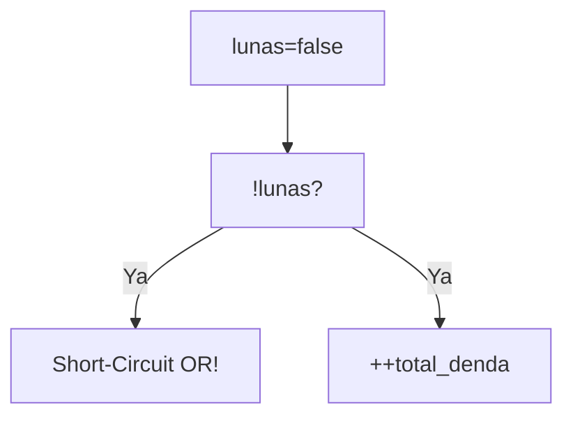
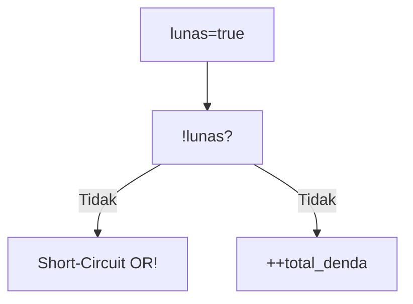
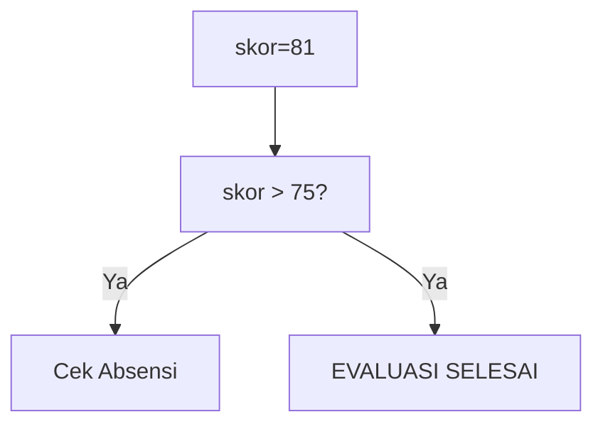
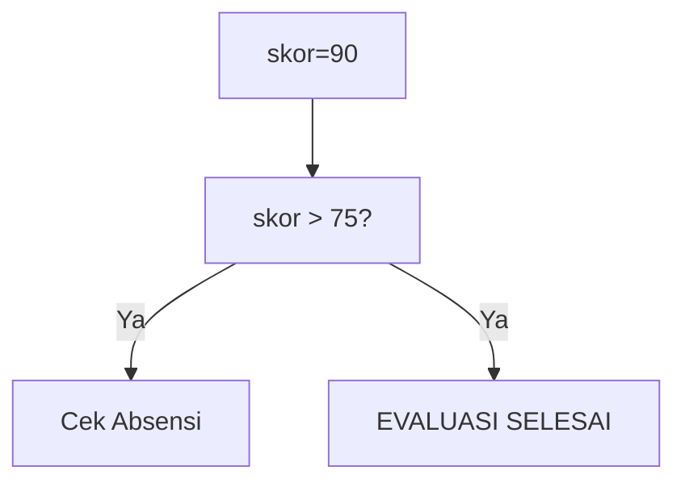
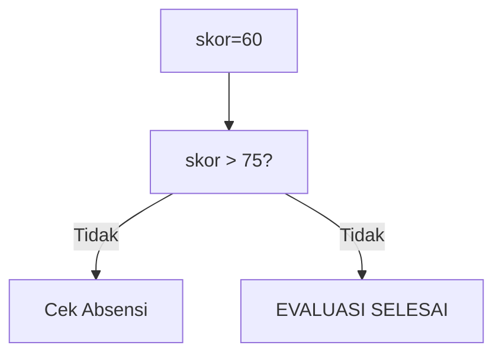

🔙 **[Kembali ke Daftar Soal](./README.md)**

---

# Latihan Soal Part C - Modul 02 - Set 02

### Soal 26
```cpp
bool lunas = false;
int total_denda = 0;
if (!lunas || ++total_denda > 5) status = 0;
```
**Pertanyaan:**
1. Berapakah hasil akhirnya?
2. Deskripsikan langkah robot compiler saat memproses kode ini!

**Jawaban & Diagnosis:**
1. **1**
2. Baca bagian 'Analisis Mendalam' di bawah.

**Mermaid Flowchart:**


**📖 Penjelasan Komprehensif:**
**Analisis Mendalam (Compiler Manusia):**
1. **Logika ||**: Operator OR mencari satu saja kebenaran. 
2. **Tracing**: `!lunas` bernilai True (BELUM BAYAR).
3. **Dampak**: Karena sudah True, denda tidak dicek (denda tetap 0).
4. **Hasil**: `total_denda` = **1**.

---
### Soal 27
```cpp
bool lunas = true;
int total_denda = 0;
if (!lunas || ++total_denda > 5) status = 0;
```
**Pertanyaan:**
1. Berapakah hasil akhirnya?
2. Deskripsikan langkah robot compiler saat memproses kode ini!

**Jawaban & Diagnosis:**
1. **0**
2. Baca bagian 'Analisis Mendalam' di bawah.

**Mermaid Flowchart:**


**📖 Penjelasan Komprehensif:**
**Analisis Mendalam (Compiler Manusia):**
1. **Logika ||**: Operator OR mencari satu saja kebenaran. 
2. **Tracing**: `!lunas` bernilai False (SUDAH LUNAS).
3. **Dampak**: Karena False, mesin harus ngecek syarat kedua, denda naik jadi 1.
4. **Hasil**: `total_denda` = **0**.

---
### Soal 28
```cpp
int skor_siswa = 81, absensi = 85;
if (skor_siswa > 75 && absensi > 80) hasil = 1;
else hasil = 0;
```
**Pertanyaan:**
1. Berapakah hasil akhirnya?
2. Deskripsikan langkah robot compiler saat memproses kode ini!

**Jawaban & Diagnosis:**
1. **1**
2. Baca bagian 'Analisis Mendalam' di bawah.

**Mermaid Flowchart:**


**📖 Penjelasan Komprehensif:**
**Analisis Mendalam (Compiler Manusia):**
1. **Logika &&**: Syarat pertama adalah `skor_siswa > 75`. Karena nilaimu 81, statusnya LULUS.
2. **Short-Circuit**: Karena lulus syarat 1, mesin lanjut cek absensi.
3. **Hasil Akhir**: hasil = **1**.

---
### Soal 29
```cpp
bool lunas = false;
int total_denda = 0;
if (!lunas || ++total_denda > 5) status = 0;
```
**Pertanyaan:**
1. Berapakah hasil akhirnya?
2. Deskripsikan langkah robot compiler saat memproses kode ini!

**Jawaban & Diagnosis:**
1. **1**
2. Baca bagian 'Analisis Mendalam' di bawah.

**Mermaid Flowchart:**


**📖 Penjelasan Komprehensif:**
**Analisis Mendalam (Compiler Manusia):**
1. **Logika ||**: Operator OR mencari satu saja kebenaran. 
2. **Tracing**: `!lunas` bernilai True (BELUM BAYAR).
3. **Dampak**: Karena sudah True, denda tidak dicek (denda tetap 0).
4. **Hasil**: `total_denda` = **1**.

---
### Soal 30
```cpp
bool lunas = false;
int total_denda = 0;
if (!lunas || ++total_denda > 5) status = 0;
```
**Pertanyaan:**
1. Berapakah hasil akhirnya?
2. Deskripsikan langkah robot compiler saat memproses kode ini!

**Jawaban & Diagnosis:**
1. **1**
2. Baca bagian 'Analisis Mendalam' di bawah.

**Mermaid Flowchart:**


**📖 Penjelasan Komprehensif:**
**Analisis Mendalam (Compiler Manusia):**
1. **Logika ||**: Operator OR mencari satu saja kebenaran. 
2. **Tracing**: `!lunas` bernilai True (BELUM BAYAR).
3. **Dampak**: Karena sudah True, denda tidak dicek (denda tetap 0).
4. **Hasil**: `total_denda` = **1**.

---
### Soal 31
```cpp
bool lunas = false;
int total_denda = 0;
if (!lunas || ++total_denda > 5) status = 0;
```
**Pertanyaan:**
1. Berapakah hasil akhirnya?
2. Deskripsikan langkah robot compiler saat memproses kode ini!

**Jawaban & Diagnosis:**
1. **1**
2. Baca bagian 'Analisis Mendalam' di bawah.

**Mermaid Flowchart:**


**📖 Penjelasan Komprehensif:**
**Analisis Mendalam (Compiler Manusia):**
1. **Logika ||**: Operator OR mencari satu saja kebenaran. 
2. **Tracing**: `!lunas` bernilai True (BELUM BAYAR).
3. **Dampak**: Karena sudah True, denda tidak dicek (denda tetap 0).
4. **Hasil**: `total_denda` = **1**.

---
### Soal 32
```cpp
int skor_siswa = 85, absensi = 85;
if (skor_siswa > 75 && absensi > 80) hasil = 1;
else hasil = 0;
```
**Pertanyaan:**
1. Berapakah hasil akhirnya?
2. Deskripsikan langkah robot compiler saat memproses kode ini!

**Jawaban & Diagnosis:**
1. **1**
2. Baca bagian 'Analisis Mendalam' di bawah.

**Mermaid Flowchart:**


**📖 Penjelasan Komprehensif:**
**Analisis Mendalam (Compiler Manusia):**
1. **Logika &&**: Syarat pertama adalah `skor_siswa > 75`. Karena nilaimu 85, statusnya LULUS.
2. **Short-Circuit**: Karena lulus syarat 1, mesin lanjut cek absensi.
3. **Hasil Akhir**: hasil = **1**.

---
### Soal 33
```cpp
bool lunas = true;
int total_denda = 0;
if (!lunas || ++total_denda > 5) status = 0;
```
**Pertanyaan:**
1. Berapakah hasil akhirnya?
2. Deskripsikan langkah robot compiler saat memproses kode ini!

**Jawaban & Diagnosis:**
1. **0**
2. Baca bagian 'Analisis Mendalam' di bawah.

**Mermaid Flowchart:**


**📖 Penjelasan Komprehensif:**
**Analisis Mendalam (Compiler Manusia):**
1. **Logika ||**: Operator OR mencari satu saja kebenaran. 
2. **Tracing**: `!lunas` bernilai False (SUDAH LUNAS).
3. **Dampak**: Karena False, mesin harus ngecek syarat kedua, denda naik jadi 1.
4. **Hasil**: `total_denda` = **0**.

---
### Soal 34
```cpp
bool lunas = true;
int total_denda = 0;
if (!lunas || ++total_denda > 5) status = 0;
```
**Pertanyaan:**
1. Berapakah hasil akhirnya?
2. Deskripsikan langkah robot compiler saat memproses kode ini!

**Jawaban & Diagnosis:**
1. **0**
2. Baca bagian 'Analisis Mendalam' di bawah.

**Mermaid Flowchart:**


**📖 Penjelasan Komprehensif:**
**Analisis Mendalam (Compiler Manusia):**
1. **Logika ||**: Operator OR mencari satu saja kebenaran. 
2. **Tracing**: `!lunas` bernilai False (SUDAH LUNAS).
3. **Dampak**: Karena False, mesin harus ngecek syarat kedua, denda naik jadi 1.
4. **Hasil**: `total_denda` = **0**.

---
### Soal 35
```cpp
bool lunas = true;
int total_denda = 0;
if (!lunas || ++total_denda > 5) status = 0;
```
**Pertanyaan:**
1. Berapakah hasil akhirnya?
2. Deskripsikan langkah robot compiler saat memproses kode ini!

**Jawaban & Diagnosis:**
1. **0**
2. Baca bagian 'Analisis Mendalam' di bawah.

**Mermaid Flowchart:**


**📖 Penjelasan Komprehensif:**
**Analisis Mendalam (Compiler Manusia):**
1. **Logika ||**: Operator OR mencari satu saja kebenaran. 
2. **Tracing**: `!lunas` bernilai False (SUDAH LUNAS).
3. **Dampak**: Karena False, mesin harus ngecek syarat kedua, denda naik jadi 1.
4. **Hasil**: `total_denda` = **0**.

---
### Soal 36
```cpp
bool lunas = false;
int total_denda = 0;
if (!lunas || ++total_denda > 5) status = 0;
```
**Pertanyaan:**
1. Berapakah hasil akhirnya?
2. Deskripsikan langkah robot compiler saat memproses kode ini!

**Jawaban & Diagnosis:**
1. **1**
2. Baca bagian 'Analisis Mendalam' di bawah.

**Mermaid Flowchart:**


**📖 Penjelasan Komprehensif:**
**Analisis Mendalam (Compiler Manusia):**
1. **Logika ||**: Operator OR mencari satu saja kebenaran. 
2. **Tracing**: `!lunas` bernilai True (BELUM BAYAR).
3. **Dampak**: Karena sudah True, denda tidak dicek (denda tetap 0).
4. **Hasil**: `total_denda` = **1**.

---
### Soal 37
```cpp
int skor_siswa = 74, absensi = 85;
if (skor_siswa > 75 && absensi > 80) hasil = 1;
else hasil = 0;
```
**Pertanyaan:**
1. Berapakah hasil akhirnya?
2. Deskripsikan langkah robot compiler saat memproses kode ini!

**Jawaban & Diagnosis:**
1. **0**
2. Baca bagian 'Analisis Mendalam' di bawah.

**Mermaid Flowchart:**


**📖 Penjelasan Komprehensif:**
**Analisis Mendalam (Compiler Manusia):**
1. **Logika &&**: Syarat pertama adalah `skor_siswa > 75`. Karena nilaimu 74, statusnya GAGAL.
2. **Short-Circuit**: Karena sudah gagal di skor, mesin malas (short-circuit) dan tidak peduli absensi.
3. **Hasil Akhir**: hasil = **0**.

---
### Soal 38
```cpp
int skor_siswa = 82, absensi = 85;
if (skor_siswa > 75 && absensi > 80) hasil = 1;
else hasil = 0;
```
**Pertanyaan:**
1. Berapakah hasil akhirnya?
2. Deskripsikan langkah robot compiler saat memproses kode ini!

**Jawaban & Diagnosis:**
1. **1**
2. Baca bagian 'Analisis Mendalam' di bawah.

**Mermaid Flowchart:**


**📖 Penjelasan Komprehensif:**
**Analisis Mendalam (Compiler Manusia):**
1. **Logika &&**: Syarat pertama adalah `skor_siswa > 75`. Karena nilaimu 82, statusnya LULUS.
2. **Short-Circuit**: Karena lulus syarat 1, mesin lanjut cek absensi.
3. **Hasil Akhir**: hasil = **1**.

---
### Soal 39
```cpp
int skor_siswa = 90, absensi = 85;
if (skor_siswa > 75 && absensi > 80) hasil = 1;
else hasil = 0;
```
**Pertanyaan:**
1. Berapakah hasil akhirnya?
2. Deskripsikan langkah robot compiler saat memproses kode ini!

**Jawaban & Diagnosis:**
1. **1**
2. Baca bagian 'Analisis Mendalam' di bawah.

**Mermaid Flowchart:**


**📖 Penjelasan Komprehensif:**
**Analisis Mendalam (Compiler Manusia):**
1. **Logika &&**: Syarat pertama adalah `skor_siswa > 75`. Karena nilaimu 90, statusnya LULUS.
2. **Short-Circuit**: Karena lulus syarat 1, mesin lanjut cek absensi.
3. **Hasil Akhir**: hasil = **1**.

---
### Soal 40
```cpp
bool lunas = true;
int total_denda = 0;
if (!lunas || ++total_denda > 5) status = 0;
```
**Pertanyaan:**
1. Berapakah hasil akhirnya?
2. Deskripsikan langkah robot compiler saat memproses kode ini!

**Jawaban & Diagnosis:**
1. **0**
2. Baca bagian 'Analisis Mendalam' di bawah.

**Mermaid Flowchart:**


**📖 Penjelasan Komprehensif:**
**Analisis Mendalam (Compiler Manusia):**
1. **Logika ||**: Operator OR mencari satu saja kebenaran. 
2. **Tracing**: `!lunas` bernilai False (SUDAH LUNAS).
3. **Dampak**: Karena False, mesin harus ngecek syarat kedua, denda naik jadi 1.
4. **Hasil**: `total_denda` = **0**.

---
### Soal 41
```cpp
int skor_siswa = 60, absensi = 85;
if (skor_siswa > 75 && absensi > 80) hasil = 1;
else hasil = 0;
```
**Pertanyaan:**
1. Berapakah hasil akhirnya?
2. Deskripsikan langkah robot compiler saat memproses kode ini!

**Jawaban & Diagnosis:**
1. **0**
2. Baca bagian 'Analisis Mendalam' di bawah.

**Mermaid Flowchart:**


**📖 Penjelasan Komprehensif:**
**Analisis Mendalam (Compiler Manusia):**
1. **Logika &&**: Syarat pertama adalah `skor_siswa > 75`. Karena nilaimu 60, statusnya GAGAL.
2. **Short-Circuit**: Karena sudah gagal di skor, mesin malas (short-circuit) dan tidak peduli absensi.
3. **Hasil Akhir**: hasil = **0**.

---
### Soal 42
```cpp
bool lunas = false;
int total_denda = 0;
if (!lunas || ++total_denda > 5) status = 0;
```
**Pertanyaan:**
1. Berapakah hasil akhirnya?
2. Deskripsikan langkah robot compiler saat memproses kode ini!

**Jawaban & Diagnosis:**
1. **1**
2. Baca bagian 'Analisis Mendalam' di bawah.

**Mermaid Flowchart:**


**📖 Penjelasan Komprehensif:**
**Analisis Mendalam (Compiler Manusia):**
1. **Logika ||**: Operator OR mencari satu saja kebenaran. 
2. **Tracing**: `!lunas` bernilai True (BELUM BAYAR).
3. **Dampak**: Karena sudah True, denda tidak dicek (denda tetap 0).
4. **Hasil**: `total_denda` = **1**.

---
### Soal 43
```cpp
int skor_siswa = 75, absensi = 85;
if (skor_siswa > 75 && absensi > 80) hasil = 1;
else hasil = 0;
```
**Pertanyaan:**
1. Berapakah hasil akhirnya?
2. Deskripsikan langkah robot compiler saat memproses kode ini!

**Jawaban & Diagnosis:**
1. **0**
2. Baca bagian 'Analisis Mendalam' di bawah.

**Mermaid Flowchart:**


**📖 Penjelasan Komprehensif:**
**Analisis Mendalam (Compiler Manusia):**
1. **Logika &&**: Syarat pertama adalah `skor_siswa > 75`. Karena nilaimu 75, statusnya GAGAL.
2. **Short-Circuit**: Karena sudah gagal di skor, mesin malas (short-circuit) dan tidak peduli absensi.
3. **Hasil Akhir**: hasil = **0**.

---
### Soal 44
```cpp
bool lunas = false;
int total_denda = 0;
if (!lunas || ++total_denda > 5) status = 0;
```
**Pertanyaan:**
1. Berapakah hasil akhirnya?
2. Deskripsikan langkah robot compiler saat memproses kode ini!

**Jawaban & Diagnosis:**
1. **1**
2. Baca bagian 'Analisis Mendalam' di bawah.

**Mermaid Flowchart:**


**📖 Penjelasan Komprehensif:**
**Analisis Mendalam (Compiler Manusia):**
1. **Logika ||**: Operator OR mencari satu saja kebenaran. 
2. **Tracing**: `!lunas` bernilai True (BELUM BAYAR).
3. **Dampak**: Karena sudah True, denda tidak dicek (denda tetap 0).
4. **Hasil**: `total_denda` = **1**.

---
### Soal 45
```cpp
bool lunas = false;
int total_denda = 0;
if (!lunas || ++total_denda > 5) status = 0;
```
**Pertanyaan:**
1. Berapakah hasil akhirnya?
2. Deskripsikan langkah robot compiler saat memproses kode ini!

**Jawaban & Diagnosis:**
1. **1**
2. Baca bagian 'Analisis Mendalam' di bawah.

**Mermaid Flowchart:**


**📖 Penjelasan Komprehensif:**
**Analisis Mendalam (Compiler Manusia):**
1. **Logika ||**: Operator OR mencari satu saja kebenaran. 
2. **Tracing**: `!lunas` bernilai True (BELUM BAYAR).
3. **Dampak**: Karena sudah True, denda tidak dicek (denda tetap 0).
4. **Hasil**: `total_denda` = **1**.

---
### Soal 46
```cpp
int skor_siswa = 57, absensi = 85;
if (skor_siswa > 75 && absensi > 80) hasil = 1;
else hasil = 0;
```
**Pertanyaan:**
1. Berapakah hasil akhirnya?
2. Deskripsikan langkah robot compiler saat memproses kode ini!

**Jawaban & Diagnosis:**
1. **0**
2. Baca bagian 'Analisis Mendalam' di bawah.

**Mermaid Flowchart:**
```mermaid
graph TD
A["skor=57"] --> B["skor > 75?"]
B -- Tidak --> C["Cek Absensi"]
B -- Tidak --> D["EVALUASI SELESAI"]
```

**📖 Penjelasan Komprehensif:**
**Analisis Mendalam (Compiler Manusia):**
1. **Logika &&**: Syarat pertama adalah `skor_siswa > 75`. Karena nilaimu 57, statusnya GAGAL.
2. **Short-Circuit**: Karena sudah gagal di skor, mesin malas (short-circuit) dan tidak peduli absensi.
3. **Hasil Akhir**: hasil = **0**.

---
### Soal 47
```cpp
int skor_siswa = 50, absensi = 85;
if (skor_siswa > 75 && absensi > 80) hasil = 1;
else hasil = 0;
```
**Pertanyaan:**
1. Berapakah hasil akhirnya?
2. Deskripsikan langkah robot compiler saat memproses kode ini!

**Jawaban & Diagnosis:**
1. **0**
2. Baca bagian 'Analisis Mendalam' di bawah.

**Mermaid Flowchart:**
```mermaid
graph TD
A["skor=50"] --> B["skor > 75?"]
B -- Tidak --> C["Cek Absensi"]
B -- Tidak --> D["EVALUASI SELESAI"]
```

**📖 Penjelasan Komprehensif:**
**Analisis Mendalam (Compiler Manusia):**
1. **Logika &&**: Syarat pertama adalah `skor_siswa > 75`. Karena nilaimu 50, statusnya GAGAL.
2. **Short-Circuit**: Karena sudah gagal di skor, mesin malas (short-circuit) dan tidak peduli absensi.
3. **Hasil Akhir**: hasil = **0**.

---
### Soal 48
```cpp
bool lunas = false;
int total_denda = 0;
if (!lunas || ++total_denda > 5) status = 0;
```
**Pertanyaan:**
1. Berapakah hasil akhirnya?
2. Deskripsikan langkah robot compiler saat memproses kode ini!

**Jawaban & Diagnosis:**
1. **1**
2. Baca bagian 'Analisis Mendalam' di bawah.

**Mermaid Flowchart:**
```mermaid
graph TD
A["lunas=false"] --> B["!lunas?"]
B -- Ya --> C["Short-Circuit OR!"]
B -- Ya --> D["++total_denda"]
```

**📖 Penjelasan Komprehensif:**
**Analisis Mendalam (Compiler Manusia):**
1. **Logika ||**: Operator OR mencari satu saja kebenaran. 
2. **Tracing**: `!lunas` bernilai True (BELUM BAYAR).
3. **Dampak**: Karena sudah True, denda tidak dicek (denda tetap 0).
4. **Hasil**: `total_denda` = **1**.

---
### Soal 49
```cpp
int skor_siswa = 62, absensi = 85;
if (skor_siswa > 75 && absensi > 80) hasil = 1;
else hasil = 0;
```
**Pertanyaan:**
1. Berapakah hasil akhirnya?
2. Deskripsikan langkah robot compiler saat memproses kode ini!

**Jawaban & Diagnosis:**
1. **0**
2. Baca bagian 'Analisis Mendalam' di bawah.

**Mermaid Flowchart:**
```mermaid
graph TD
A["skor=62"] --> B["skor > 75?"]
B -- Tidak --> C["Cek Absensi"]
B -- Tidak --> D["EVALUASI SELESAI"]
```

**📖 Penjelasan Komprehensif:**
**Analisis Mendalam (Compiler Manusia):**
1. **Logika &&**: Syarat pertama adalah `skor_siswa > 75`. Karena nilaimu 62, statusnya GAGAL.
2. **Short-Circuit**: Karena sudah gagal di skor, mesin malas (short-circuit) dan tidak peduli absensi.
3. **Hasil Akhir**: hasil = **0**.

---
### Soal 50
```cpp
bool lunas = false;
int total_denda = 0;
if (!lunas || ++total_denda > 5) status = 0;
```
**Pertanyaan:**
1. Berapakah hasil akhirnya?
2. Deskripsikan langkah robot compiler saat memproses kode ini!

**Jawaban & Diagnosis:**
1. **1**
2. Baca bagian 'Analisis Mendalam' di bawah.

**Mermaid Flowchart:**
```mermaid
graph TD
A["lunas=false"] --> B["!lunas?"]
B -- Ya --> C["Short-Circuit OR!"]
B -- Ya --> D["++total_denda"]
```

**📖 Penjelasan Komprehensif:**
**Analisis Mendalam (Compiler Manusia):**
1. **Logika ||**: Operator OR mencari satu saja kebenaran. 
2. **Tracing**: `!lunas` bernilai True (BELUM BAYAR).
3. **Dampak**: Karena sudah True, denda tidak dicek (denda tetap 0).
4. **Hasil**: `total_denda` = **1**.

---
