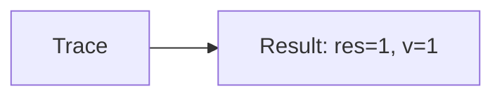
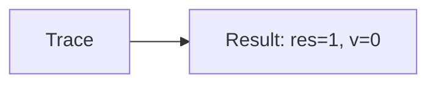

🔙 **[Kembali ke Daftar Soal](./README.md)**

---

# Latihan Soal Part C - Modul 02 - Set 02

### Soal 26
```cpp
// Piutang: Short-Circuit OR
int piutang = 63, v = 0;
if (piutang < 50 || ++v > 0) res = 1;
else res = 0;
```
**Pertanyaan:**
1. Berapakah hasil akhirnya?
2. Deskripsikan alur pikir 'Compiler Manusia' untuk soal ini!

**Jawaban & Diagnosis:**
1. **res=1, v=1**
2. Piutang 63 < 50? Tidak (v naik).

**Mermaid Flowchart:**


---
### Soal 27
```cpp
// Investasi: Short-Circuit AND
int investasi = 44, v = 0;
if (investasi > 50 && ++v > 0) res = 1;
else res = 0;
```
**Pertanyaan:**
1. Berapakah hasil akhirnya?
2. Deskripsikan alur pikir 'Compiler Manusia' untuk soal ini!

**Jawaban & Diagnosis:**
1. **res=0, v=0**
2. Investasi 44 > 50? Tidak (v=0).

**Mermaid Flowchart:**


---
### Soal 28
```cpp
// Saham: Short-Circuit OR
int saham = 59, v = 0;
if (saham < 50 || ++v > 0) res = 1;
else res = 0;
```
**Pertanyaan:**
1. Berapakah hasil akhirnya?
2. Deskripsikan alur pikir 'Compiler Manusia' untuk soal ini!

**Jawaban & Diagnosis:**
1. **res=1, v=1**
2. Saham 59 < 50? Tidak (v naik).

**Mermaid Flowchart:**


---
### Soal 29
```cpp
// Emas: Short-Circuit AND
int emas = 66, v = 0;
if (emas > 50 && ++v > 0) res = 1;
else res = 0;
```
**Pertanyaan:**
1. Berapakah hasil akhirnya?
2. Deskripsikan alur pikir 'Compiler Manusia' untuk soal ini!

**Jawaban & Diagnosis:**
1. **res=1, v=1**
2. Emas 66 > 50? Ya (v naik).

**Mermaid Flowchart:**


---
### Soal 30
```cpp
// Kurs: Short-Circuit OR
int kurs = 89, v = 0;
if (kurs < 50 || ++v > 0) res = 1;
else res = 0;
```
**Pertanyaan:**
1. Berapakah hasil akhirnya?
2. Deskripsikan alur pikir 'Compiler Manusia' untuk soal ini!

**Jawaban & Diagnosis:**
1. **res=1, v=1**
2. Kurs 89 < 50? Tidak (v naik).

**Mermaid Flowchart:**


---
### Soal 31
```cpp
// Pajak: Short-Circuit AND
int pajak = 78, v = 0;
if (pajak > 50 && ++v > 0) res = 1;
else res = 0;
```
**Pertanyaan:**
1. Berapakah hasil akhirnya?
2. Deskripsikan alur pikir 'Compiler Manusia' untuk soal ini!

**Jawaban & Diagnosis:**
1. **res=1, v=1**
2. Pajak 78 > 50? Ya (v naik).

**Mermaid Flowchart:**


---
### Soal 32
```cpp
// Diskon: Short-Circuit OR
int diskon = 57, v = 0;
if (diskon < 50 || ++v > 0) res = 1;
else res = 0;
```
**Pertanyaan:**
1. Berapakah hasil akhirnya?
2. Deskripsikan alur pikir 'Compiler Manusia' untuk soal ini!

**Jawaban & Diagnosis:**
1. **res=1, v=1**
2. Diskon 57 < 50? Tidak (v naik).

**Mermaid Flowchart:**


---
### Soal 33
```cpp
// Voucher: Short-Circuit AND
int voucher = 17, v = 0;
if (voucher > 50 && ++v > 0) res = 1;
else res = 0;
```
**Pertanyaan:**
1. Berapakah hasil akhirnya?
2. Deskripsikan alur pikir 'Compiler Manusia' untuk soal ini!

**Jawaban & Diagnosis:**
1. **res=0, v=0**
2. Voucher 17 > 50? Tidak (v=0).

**Mermaid Flowchart:**


---
### Soal 34
```cpp
// Kupon: Short-Circuit OR
int kupon = 72, v = 0;
if (kupon < 50 || ++v > 0) res = 1;
else res = 0;
```
**Pertanyaan:**
1. Berapakah hasil akhirnya?
2. Deskripsikan alur pikir 'Compiler Manusia' untuk soal ini!

**Jawaban & Diagnosis:**
1. **res=1, v=1**
2. Kupon 72 < 50? Tidak (v naik).

**Mermaid Flowchart:**


---
### Soal 35
```cpp
// Reward: Short-Circuit AND
int reward = 50, v = 0;
if (reward > 50 && ++v > 0) res = 1;
else res = 0;
```
**Pertanyaan:**
1. Berapakah hasil akhirnya?
2. Deskripsikan alur pikir 'Compiler Manusia' untuk soal ini!

**Jawaban & Diagnosis:**
1. **res=0, v=0**
2. Reward 50 > 50? Tidak (v=0).

**Mermaid Flowchart:**


---
### Soal 36
```cpp
// Poin: Short-Circuit OR
int poin = 93, v = 0;
if (poin < 50 || ++v > 0) res = 1;
else res = 0;
```
**Pertanyaan:**
1. Berapakah hasil akhirnya?
2. Deskripsikan alur pikir 'Compiler Manusia' untuk soal ini!

**Jawaban & Diagnosis:**
1. **res=1, v=1**
2. Poin 93 < 50? Tidak (v naik).

**Mermaid Flowchart:**


---
### Soal 37
```cpp
// Ranking: Short-Circuit AND
int ranking = 15, v = 0;
if (ranking > 50 && ++v > 0) res = 1;
else res = 0;
```
**Pertanyaan:**
1. Berapakah hasil akhirnya?
2. Deskripsikan alur pikir 'Compiler Manusia' untuk soal ini!

**Jawaban & Diagnosis:**
1. **res=0, v=0**
2. Ranking 15 > 50? Tidak (v=0).

**Mermaid Flowchart:**


---
### Soal 38
```cpp
// Skor: Short-Circuit OR
int skor = 36, v = 0;
if (skor < 50 || ++v > 0) res = 1;
else res = 0;
```
**Pertanyaan:**
1. Berapakah hasil akhirnya?
2. Deskripsikan alur pikir 'Compiler Manusia' untuk soal ini!

**Jawaban & Diagnosis:**
1. **res=1, v=0**
2. Skor 36 < 50? Ya (v=0).

**Mermaid Flowchart:**


---
### Soal 39
```cpp
// Winrate: Short-Circuit AND
int winrate = 65, v = 0;
if (winrate > 50 && ++v > 0) res = 1;
else res = 0;
```
**Pertanyaan:**
1. Berapakah hasil akhirnya?
2. Deskripsikan alur pikir 'Compiler Manusia' untuk soal ini!

**Jawaban & Diagnosis:**
1. **res=1, v=1**
2. Winrate 65 > 50? Ya (v naik).

**Mermaid Flowchart:**


---
### Soal 40
```cpp
// KDR: Short-Circuit OR
int kdr = 50, v = 0;
if (kdr < 50 || ++v > 0) res = 1;
else res = 0;
```
**Pertanyaan:**
1. Berapakah hasil akhirnya?
2. Deskripsikan alur pikir 'Compiler Manusia' untuk soal ini!

**Jawaban & Diagnosis:**
1. **res=1, v=1**
2. KDR 50 < 50? Tidak (v naik).

**Mermaid Flowchart:**


---
### Soal 41
```cpp
// Ping: Short-Circuit AND
int ping = 64, v = 0;
if (ping > 50 && ++v > 0) res = 1;
else res = 0;
```
**Pertanyaan:**
1. Berapakah hasil akhirnya?
2. Deskripsikan alur pikir 'Compiler Manusia' untuk soal ini!

**Jawaban & Diagnosis:**
1. **res=1, v=1**
2. Ping 64 > 50? Ya (v naik).

**Mermaid Flowchart:**


---
### Soal 42
```cpp
// FPS: Short-Circuit OR
int fps = 89, v = 0;
if (fps < 50 || ++v > 0) res = 1;
else res = 0;
```
**Pertanyaan:**
1. Berapakah hasil akhirnya?
2. Deskripsikan alur pikir 'Compiler Manusia' untuk soal ini!

**Jawaban & Diagnosis:**
1. **res=1, v=1**
2. FPS 89 < 50? Tidak (v naik).

**Mermaid Flowchart:**


---
### Soal 43
```cpp
// Lag: Short-Circuit AND
int lag = 60, v = 0;
if (lag > 50 && ++v > 0) res = 1;
else res = 0;
```
**Pertanyaan:**
1. Berapakah hasil akhirnya?
2. Deskripsikan alur pikir 'Compiler Manusia' untuk soal ini!

**Jawaban & Diagnosis:**
1. **res=1, v=1**
2. Lag 60 > 50? Ya (v naik).

**Mermaid Flowchart:**


---
### Soal 44
```cpp
// Crash: Short-Circuit OR
int crash = 18, v = 0;
if (crash < 50 || ++v > 0) res = 1;
else res = 0;
```
**Pertanyaan:**
1. Berapakah hasil akhirnya?
2. Deskripsikan alur pikir 'Compiler Manusia' untuk soal ini!

**Jawaban & Diagnosis:**
1. **res=1, v=0**
2. Crash 18 < 50? Ya (v=0).

**Mermaid Flowchart:**


---
### Soal 45
```cpp
// Update: Short-Circuit AND
int update = 35, v = 0;
if (update > 50 && ++v > 0) res = 1;
else res = 0;
```
**Pertanyaan:**
1. Berapakah hasil akhirnya?
2. Deskripsikan alur pikir 'Compiler Manusia' untuk soal ini!

**Jawaban & Diagnosis:**
1. **res=0, v=0**
2. Update 35 > 50? Tidak (v=0).

**Mermaid Flowchart:**


---
### Soal 46
```cpp
// Patch: Short-Circuit OR
int patch = 78, v = 0;
if (patch < 50 || ++v > 0) res = 1;
else res = 0;
```
**Pertanyaan:**
1. Berapakah hasil akhirnya?
2. Deskripsikan alur pikir 'Compiler Manusia' untuk soal ini!

**Jawaban & Diagnosis:**
1. **res=1, v=1**
2. Patch 78 < 50? Tidak (v naik).

**Mermaid Flowchart:**
```mermaid
graph LR
A[Trace] --> B[Result: res=1, v=1]
```

---
### Soal 47
```cpp
// Server: Short-Circuit AND
int server = 15, v = 0;
if (server > 50 && ++v > 0) res = 1;
else res = 0;
```
**Pertanyaan:**
1. Berapakah hasil akhirnya?
2. Deskripsikan alur pikir 'Compiler Manusia' untuk soal ini!

**Jawaban & Diagnosis:**
1. **res=0, v=0**
2. Server 15 > 50? Tidak (v=0).

**Mermaid Flowchart:**
```mermaid
graph LR
A[Trace] --> B[Result: res=0, v=0]
```

---
### Soal 48
```cpp
// Client: Short-Circuit OR
int client = 32, v = 0;
if (client < 50 || ++v > 0) res = 1;
else res = 0;
```
**Pertanyaan:**
1. Berapakah hasil akhirnya?
2. Deskripsikan alur pikir 'Compiler Manusia' untuk soal ini!

**Jawaban & Diagnosis:**
1. **res=1, v=0**
2. Client 32 < 50? Ya (v=0).

**Mermaid Flowchart:**
```mermaid
graph LR
A[Trace] --> B[Result: res=1, v=0]
```

---
### Soal 49
```cpp
// Database: Short-Circuit AND
int database = 71, v = 0;
if (database > 50 && ++v > 0) res = 1;
else res = 0;
```
**Pertanyaan:**
1. Berapakah hasil akhirnya?
2. Deskripsikan alur pikir 'Compiler Manusia' untuk soal ini!

**Jawaban & Diagnosis:**
1. **res=1, v=1**
2. Database 71 > 50? Ya (v naik).

**Mermaid Flowchart:**
```mermaid
graph LR
A[Trace] --> B[Result: res=1, v=1]
```

---
### Soal 50
```cpp
// API: Short-Circuit OR
int api = 71, v = 0;
if (api < 50 || ++v > 0) res = 1;
else res = 0;
```
**Pertanyaan:**
1. Berapakah hasil akhirnya?
2. Deskripsikan alur pikir 'Compiler Manusia' untuk soal ini!

**Jawaban & Diagnosis:**
1. **res=1, v=1**
2. API 71 < 50? Tidak (v naik).

**Mermaid Flowchart:**
```mermaid
graph LR
A[Trace] --> B[Result: res=1, v=1]
```

---
