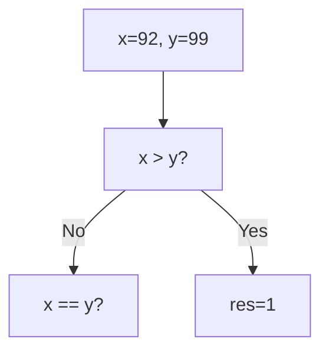
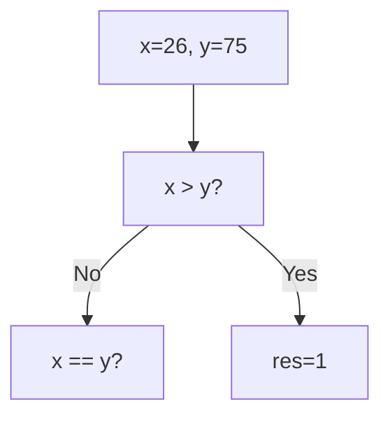
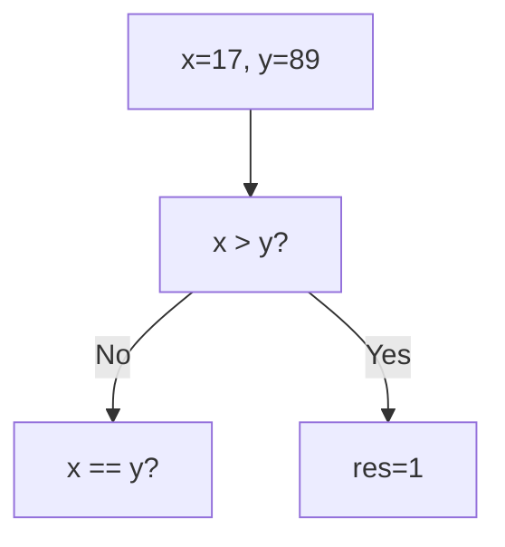
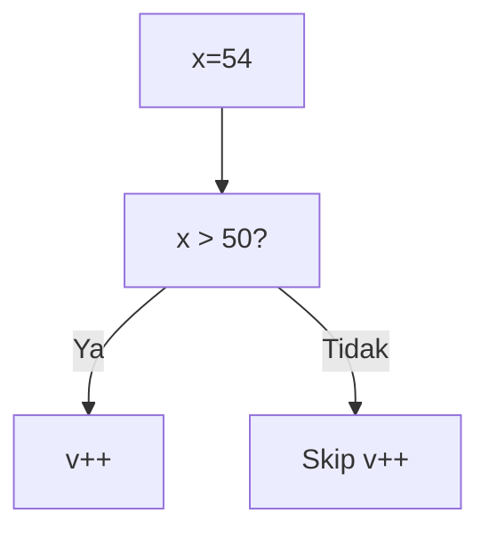
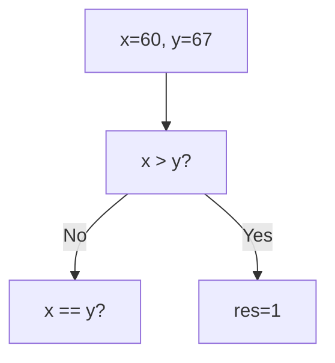
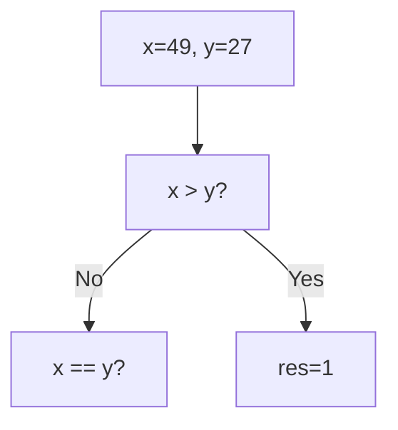
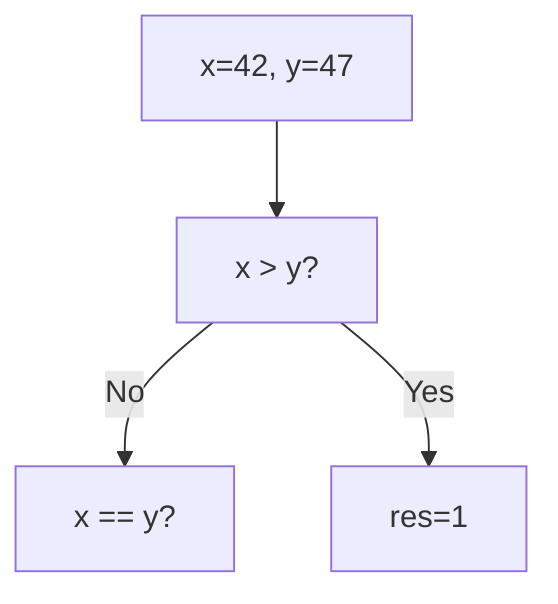
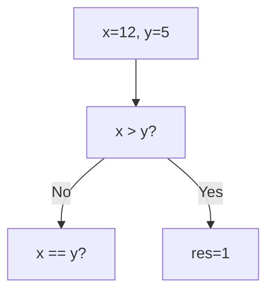
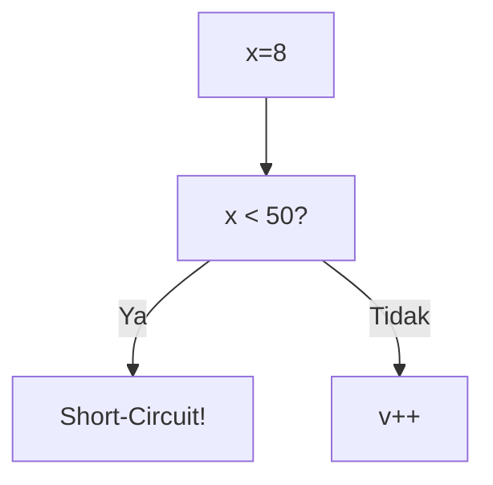

🔙 **[Kembali ke Daftar Soal](./README.md)**

---

# Latihan Soal Part C - Modul 02 - Set 02

### Soal 26
```cpp
int x=92, y=99;
if (x > y) res = 1;
else if (x == y) res = 0;
else res = -1;
```
**Pertanyaan:**
1. Berapakah hasil akhirnya?
2. Mengapa demikian?

**Jawaban & Diagnosis:**
1. **-1**
2. Lihat Tracing.

**Mermaid Flowchart:**


**📖 Penjelasan:**
**Langkah Tracing:**
1. Bandingkan 92 dan 99.
2. Hasil: -1.

---
### Soal 27
```cpp
int x = 39, v = 0;
if (x > 50 && ++v > 0) { x = 100; }
```
**Pertanyaan:**
1. Berapakah hasil akhirnya?
2. Mengapa demikian?

**Jawaban & Diagnosis:**
1. **v=0, x=39**
2. Lihat Tracing.

**Mermaid Flowchart:**


**📖 Penjelasan:**
**Langkah Tracing:**
1. x=39. Cek x > 50.
2. Jika Ya, v naik jadi 1. Jika Tidak, v tetap 0 (Short-circuit).
3. Nilai v akhir: 0.

---
### Soal 28
```cpp
int x=26, y=75;
if (x > y) res = 1;
else if (x == y) res = 0;
else res = -1;
```
**Pertanyaan:**
1. Berapakah hasil akhirnya?
2. Mengapa demikian?

**Jawaban & Diagnosis:**
1. **-1**
2. Lihat Tracing.

**Mermaid Flowchart:**


**📖 Penjelasan:**
**Langkah Tracing:**
1. Bandingkan 26 dan 75.
2. Hasil: -1.

---
### Soal 29
```cpp
int x=11, y=86;
if (x > y) res = 1;
else if (x == y) res = 0;
else res = -1;
```
**Pertanyaan:**
1. Berapakah hasil akhirnya?
2. Mengapa demikian?

**Jawaban & Diagnosis:**
1. **-1**
2. Lihat Tracing.

**Mermaid Flowchart:**


**📖 Penjelasan:**
**Langkah Tracing:**
1. Bandingkan 11 dan 86.
2. Hasil: -1.

---
### Soal 30
```cpp
int x = 79, v = 0;
if (x > 50 && ++v > 0) { x = 100; }
```
**Pertanyaan:**
1. Berapakah hasil akhirnya?
2. Mengapa demikian?

**Jawaban & Diagnosis:**
1. **v=1, x=100**
2. Lihat Tracing.

**Mermaid Flowchart:**


**📖 Penjelasan:**
**Langkah Tracing:**
1. x=79. Cek x > 50.
2. Jika Ya, v naik jadi 1. Jika Tidak, v tetap 0 (Short-circuit).
3. Nilai v akhir: 1.

---
### Soal 31
```cpp
int x=17, y=89;
if (x > y) res = 1;
else if (x == y) res = 0;
else res = -1;
```
**Pertanyaan:**
1. Berapakah hasil akhirnya?
2. Mengapa demikian?

**Jawaban & Diagnosis:**
1. **-1**
2. Lihat Tracing.

**Mermaid Flowchart:**


**📖 Penjelasan:**
**Langkah Tracing:**
1. Bandingkan 17 dan 89.
2. Hasil: -1.

---
### Soal 32
```cpp
int x = 67, v = 0;
if (x < 50 || ++v > 0) { x = 0; }
```
**Pertanyaan:**
1. Berapakah hasil akhirnya?
2. Mengapa demikian?

**Jawaban & Diagnosis:**
1. **v=1**
2. Lihat Tracing.

**Mermaid Flowchart:**


**📖 Penjelasan:**
**Langkah Tracing:**
1. x=67. Cek x < 50.
2. Jika Ya, syarat kedua di-skip (v=0). Jika Tidak, v++ (v=1).
3. Nilai v akhir: 1.

---
### Soal 33
```cpp
int x = 53, v = 0;
if (x > 50 && ++v > 0) { x = 100; }
```
**Pertanyaan:**
1. Berapakah hasil akhirnya?
2. Mengapa demikian?

**Jawaban & Diagnosis:**
1. **v=1, x=100**
2. Lihat Tracing.

**Mermaid Flowchart:**


**📖 Penjelasan:**
**Langkah Tracing:**
1. x=53. Cek x > 50.
2. Jika Ya, v naik jadi 1. Jika Tidak, v tetap 0 (Short-circuit).
3. Nilai v akhir: 1.

---
### Soal 34
```cpp
int x = 54, v = 0;
if (x > 50 && ++v > 0) { x = 100; }
```
**Pertanyaan:**
1. Berapakah hasil akhirnya?
2. Mengapa demikian?

**Jawaban & Diagnosis:**
1. **v=1, x=100**
2. Lihat Tracing.

**Mermaid Flowchart:**


**📖 Penjelasan:**
**Langkah Tracing:**
1. x=54. Cek x > 50.
2. Jika Ya, v naik jadi 1. Jika Tidak, v tetap 0 (Short-circuit).
3. Nilai v akhir: 1.

---
### Soal 35
```cpp
int x=60, y=67;
if (x > y) res = 1;
else if (x == y) res = 0;
else res = -1;
```
**Pertanyaan:**
1. Berapakah hasil akhirnya?
2. Mengapa demikian?

**Jawaban & Diagnosis:**
1. **-1**
2. Lihat Tracing.

**Mermaid Flowchart:**


**📖 Penjelasan:**
**Langkah Tracing:**
1. Bandingkan 60 dan 67.
2. Hasil: -1.

---
### Soal 36
```cpp
int x = 88, v = 0;
if (x < 50 || ++v > 0) { x = 0; }
```
**Pertanyaan:**
1. Berapakah hasil akhirnya?
2. Mengapa demikian?

**Jawaban & Diagnosis:**
1. **v=1**
2. Lihat Tracing.

**Mermaid Flowchart:**


**📖 Penjelasan:**
**Langkah Tracing:**
1. x=88. Cek x < 50.
2. Jika Ya, syarat kedua di-skip (v=0). Jika Tidak, v++ (v=1).
3. Nilai v akhir: 1.

---
### Soal 37
```cpp
int x = 77, v = 0;
if (x < 50 || ++v > 0) { x = 0; }
```
**Pertanyaan:**
1. Berapakah hasil akhirnya?
2. Mengapa demikian?

**Jawaban & Diagnosis:**
1. **v=1**
2. Lihat Tracing.

**Mermaid Flowchart:**


**📖 Penjelasan:**
**Langkah Tracing:**
1. x=77. Cek x < 50.
2. Jika Ya, syarat kedua di-skip (v=0). Jika Tidak, v++ (v=1).
3. Nilai v akhir: 1.

---
### Soal 38
```cpp
int x=49, y=27;
if (x > y) res = 1;
else if (x == y) res = 0;
else res = -1;
```
**Pertanyaan:**
1. Berapakah hasil akhirnya?
2. Mengapa demikian?

**Jawaban & Diagnosis:**
1. **1**
2. Lihat Tracing.

**Mermaid Flowchart:**


**📖 Penjelasan:**
**Langkah Tracing:**
1. Bandingkan 49 dan 27.
2. Hasil: 1.

---
### Soal 39
```cpp
int x=62, y=87;
if (x > y) res = 1;
else if (x == y) res = 0;
else res = -1;
```
**Pertanyaan:**
1. Berapakah hasil akhirnya?
2. Mengapa demikian?

**Jawaban & Diagnosis:**
1. **-1**
2. Lihat Tracing.

**Mermaid Flowchart:**


**📖 Penjelasan:**
**Langkah Tracing:**
1. Bandingkan 62 dan 87.
2. Hasil: -1.

---
### Soal 40
```cpp
int x=6, y=55;
if (x > y) res = 1;
else if (x == y) res = 0;
else res = -1;
```
**Pertanyaan:**
1. Berapakah hasil akhirnya?
2. Mengapa demikian?

**Jawaban & Diagnosis:**
1. **-1**
2. Lihat Tracing.

**Mermaid Flowchart:**


**📖 Penjelasan:**
**Langkah Tracing:**
1. Bandingkan 6 dan 55.
2. Hasil: -1.

---
### Soal 41
```cpp
int x=42, y=47;
if (x > y) res = 1;
else if (x == y) res = 0;
else res = -1;
```
**Pertanyaan:**
1. Berapakah hasil akhirnya?
2. Mengapa demikian?

**Jawaban & Diagnosis:**
1. **-1**
2. Lihat Tracing.

**Mermaid Flowchart:**


**📖 Penjelasan:**
**Langkah Tracing:**
1. Bandingkan 42 dan 47.
2. Hasil: -1.

---
### Soal 42
```cpp
int x=88, y=36;
if (x > y) res = 1;
else if (x == y) res = 0;
else res = -1;
```
**Pertanyaan:**
1. Berapakah hasil akhirnya?
2. Mengapa demikian?

**Jawaban & Diagnosis:**
1. **1**
2. Lihat Tracing.

**Mermaid Flowchart:**


**📖 Penjelasan:**
**Langkah Tracing:**
1. Bandingkan 88 dan 36.
2. Hasil: 1.

---
### Soal 43
```cpp
int x=12, y=5;
if (x > y) res = 1;
else if (x == y) res = 0;
else res = -1;
```
**Pertanyaan:**
1. Berapakah hasil akhirnya?
2. Mengapa demikian?

**Jawaban & Diagnosis:**
1. **1**
2. Lihat Tracing.

**Mermaid Flowchart:**


**📖 Penjelasan:**
**Langkah Tracing:**
1. Bandingkan 12 dan 5.
2. Hasil: 1.

---
### Soal 44
```cpp
int x = 8, v = 0;
if (x < 50 || ++v > 0) { x = 0; }
```
**Pertanyaan:**
1. Berapakah hasil akhirnya?
2. Mengapa demikian?

**Jawaban & Diagnosis:**
1. **v=0**
2. Lihat Tracing.

**Mermaid Flowchart:**


**📖 Penjelasan:**
**Langkah Tracing:**
1. x=8. Cek x < 50.
2. Jika Ya, syarat kedua di-skip (v=0). Jika Tidak, v++ (v=1).
3. Nilai v akhir: 0.

---
### Soal 45
```cpp
int x=90, y=52;
if (x > y) res = 1;
else if (x == y) res = 0;
else res = -1;
```
**Pertanyaan:**
1. Berapakah hasil akhirnya?
2. Mengapa demikian?

**Jawaban & Diagnosis:**
1. **1**
2. Lihat Tracing.

**Mermaid Flowchart:**


**📖 Penjelasan:**
**Langkah Tracing:**
1. Bandingkan 90 dan 52.
2. Hasil: 1.

---
### Soal 46
```cpp
int x = 24, v = 0;
if (x < 50 || ++v > 0) { x = 0; }
```
**Pertanyaan:**
1. Berapakah hasil akhirnya?
2. Mengapa demikian?

**Jawaban & Diagnosis:**
1. **v=0**
2. Lihat Tracing.

**Mermaid Flowchart:**
```mermaid
graph TD
A["x=24"] --> B["x < 50?"]
B -- Ya --> C["Short-Circuit!"]
B -- Tidak --> D["v++"]
```

**📖 Penjelasan:**
**Langkah Tracing:**
1. x=24. Cek x < 50.
2. Jika Ya, syarat kedua di-skip (v=0). Jika Tidak, v++ (v=1).
3. Nilai v akhir: 0.

---
### Soal 47
```cpp
int x=14, y=62;
if (x > y) res = 1;
else if (x == y) res = 0;
else res = -1;
```
**Pertanyaan:**
1. Berapakah hasil akhirnya?
2. Mengapa demikian?

**Jawaban & Diagnosis:**
1. **-1**
2. Lihat Tracing.

**Mermaid Flowchart:**
```mermaid
graph TD
A["x=14, y=62"] --> B["x > y?"]
B -- No --> C["x == y?"]
B -- Yes --> D[res=1]
```

**📖 Penjelasan:**
**Langkah Tracing:**
1. Bandingkan 14 dan 62.
2. Hasil: -1.

---
### Soal 48
```cpp
int x=79, y=76;
if (x > y) res = 1;
else if (x == y) res = 0;
else res = -1;
```
**Pertanyaan:**
1. Berapakah hasil akhirnya?
2. Mengapa demikian?

**Jawaban & Diagnosis:**
1. **1**
2. Lihat Tracing.

**Mermaid Flowchart:**
```mermaid
graph TD
A["x=79, y=76"] --> B["x > y?"]
B -- No --> C["x == y?"]
B -- Yes --> D[res=1]
```

**📖 Penjelasan:**
**Langkah Tracing:**
1. Bandingkan 79 dan 76.
2. Hasil: 1.

---
### Soal 49
```cpp
int x = 66, v = 0;
if (x > 50 && ++v > 0) { x = 100; }
```
**Pertanyaan:**
1. Berapakah hasil akhirnya?
2. Mengapa demikian?

**Jawaban & Diagnosis:**
1. **v=1, x=100**
2. Lihat Tracing.

**Mermaid Flowchart:**
```mermaid
graph TD
A["x=66"] --> B["x > 50?"]
B -- Ya --> C["v++"]
B -- Tidak --> D["Skip v++"]
```

**📖 Penjelasan:**
**Langkah Tracing:**
1. x=66. Cek x > 50.
2. Jika Ya, v naik jadi 1. Jika Tidak, v tetap 0 (Short-circuit).
3. Nilai v akhir: 1.

---
### Soal 50
```cpp
int x=90, y=54;
if (x > y) res = 1;
else if (x == y) res = 0;
else res = -1;
```
**Pertanyaan:**
1. Berapakah hasil akhirnya?
2. Mengapa demikian?

**Jawaban & Diagnosis:**
1. **1**
2. Lihat Tracing.

**Mermaid Flowchart:**
```mermaid
graph TD
A["x=90, y=54"] --> B["x > y?"]
B -- No --> C["x == y?"]
B -- Yes --> D[res=1]
```

**📖 Penjelasan:**
**Langkah Tracing:**
1. Bandingkan 90 dan 54.
2. Hasil: 1.

---
