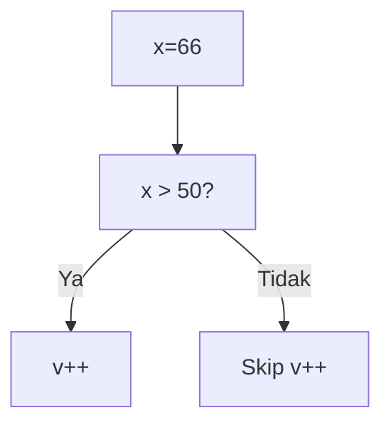
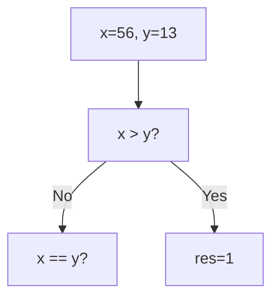
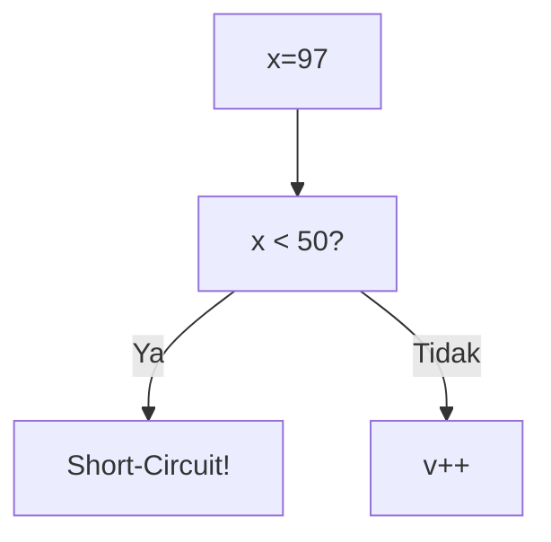
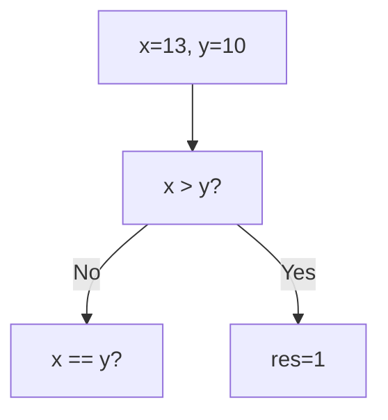

🔙 **[Kembali ke Daftar Soal](./README.md)**

---

# Latihan Soal Part C - Modul 02 - Set 03

### Soal 51
```cpp
int x = 83, v = 0;
if (x > 50 && ++v > 0) { x = 100; }
```
**Pertanyaan:**
1. Berapakah hasil akhirnya?
2. Mengapa demikian?

**Jawaban & Diagnosis:**
1. **v=1, x=100**
2. Lihat Tracing.

**Mermaid Flowchart:**


**📖 Penjelasan:**
**Langkah Tracing:**
1. x=83. Cek x > 50.
2. Jika Ya, v naik jadi 1. Jika Tidak, v tetap 0 (Short-circuit).
3. Nilai v akhir: 1.

---
### Soal 52
```cpp
int x=29, y=34;
if (x > y) res = 1;
else if (x == y) res = 0;
else res = -1;
```
**Pertanyaan:**
1. Berapakah hasil akhirnya?
2. Mengapa demikian?

**Jawaban & Diagnosis:**
1. **-1**
2. Lihat Tracing.

**Mermaid Flowchart:**


**📖 Penjelasan:**
**Langkah Tracing:**
1. Bandingkan 29 dan 34.
2. Hasil: -1.

---
### Soal 53
```cpp
int x = 50, v = 0;
if (x > 50 && ++v > 0) { x = 100; }
```
**Pertanyaan:**
1. Berapakah hasil akhirnya?
2. Mengapa demikian?

**Jawaban & Diagnosis:**
1. **v=0, x=50**
2. Lihat Tracing.

**Mermaid Flowchart:**


**📖 Penjelasan:**
**Langkah Tracing:**
1. x=50. Cek x > 50.
2. Jika Ya, v naik jadi 1. Jika Tidak, v tetap 0 (Short-circuit).
3. Nilai v akhir: 0.

---
### Soal 54
```cpp
int x = 66, v = 0;
if (x > 50 && ++v > 0) { x = 100; }
```
**Pertanyaan:**
1. Berapakah hasil akhirnya?
2. Mengapa demikian?

**Jawaban & Diagnosis:**
1. **v=1, x=100**
2. Lihat Tracing.

**Mermaid Flowchart:**


**📖 Penjelasan:**
**Langkah Tracing:**
1. x=66. Cek x > 50.
2. Jika Ya, v naik jadi 1. Jika Tidak, v tetap 0 (Short-circuit).
3. Nilai v akhir: 1.

---
### Soal 55
```cpp
int x = 68, v = 0;
if (x > 50 && ++v > 0) { x = 100; }
```
**Pertanyaan:**
1. Berapakah hasil akhirnya?
2. Mengapa demikian?

**Jawaban & Diagnosis:**
1. **v=1, x=100**
2. Lihat Tracing.

**Mermaid Flowchart:**


**📖 Penjelasan:**
**Langkah Tracing:**
1. x=68. Cek x > 50.
2. Jika Ya, v naik jadi 1. Jika Tidak, v tetap 0 (Short-circuit).
3. Nilai v akhir: 1.

---
### Soal 56
```cpp
int x=56, y=13;
if (x > y) res = 1;
else if (x == y) res = 0;
else res = -1;
```
**Pertanyaan:**
1. Berapakah hasil akhirnya?
2. Mengapa demikian?

**Jawaban & Diagnosis:**
1. **1**
2. Lihat Tracing.

**Mermaid Flowchart:**


**📖 Penjelasan:**
**Langkah Tracing:**
1. Bandingkan 56 dan 13.
2. Hasil: 1.

---
### Soal 57
```cpp
int x = 83, v = 0;
if (x > 50 && ++v > 0) { x = 100; }
```
**Pertanyaan:**
1. Berapakah hasil akhirnya?
2. Mengapa demikian?

**Jawaban & Diagnosis:**
1. **v=1, x=100**
2. Lihat Tracing.

**Mermaid Flowchart:**


**📖 Penjelasan:**
**Langkah Tracing:**
1. x=83. Cek x > 50.
2. Jika Ya, v naik jadi 1. Jika Tidak, v tetap 0 (Short-circuit).
3. Nilai v akhir: 1.

---
### Soal 58
```cpp
int x = 43, v = 0;
if (x > 50 && ++v > 0) { x = 100; }
```
**Pertanyaan:**
1. Berapakah hasil akhirnya?
2. Mengapa demikian?

**Jawaban & Diagnosis:**
1. **v=0, x=43**
2. Lihat Tracing.

**Mermaid Flowchart:**


**📖 Penjelasan:**
**Langkah Tracing:**
1. x=43. Cek x > 50.
2. Jika Ya, v naik jadi 1. Jika Tidak, v tetap 0 (Short-circuit).
3. Nilai v akhir: 0.

---
### Soal 59
```cpp
int x = 73, v = 0;
if (x > 50 && ++v > 0) { x = 100; }
```
**Pertanyaan:**
1. Berapakah hasil akhirnya?
2. Mengapa demikian?

**Jawaban & Diagnosis:**
1. **v=1, x=100**
2. Lihat Tracing.

**Mermaid Flowchart:**


**📖 Penjelasan:**
**Langkah Tracing:**
1. x=73. Cek x > 50.
2. Jika Ya, v naik jadi 1. Jika Tidak, v tetap 0 (Short-circuit).
3. Nilai v akhir: 1.

---
### Soal 60
```cpp
int x = 97, v = 0;
if (x < 50 || ++v > 0) { x = 0; }
```
**Pertanyaan:**
1. Berapakah hasil akhirnya?
2. Mengapa demikian?

**Jawaban & Diagnosis:**
1. **v=1**
2. Lihat Tracing.

**Mermaid Flowchart:**


**📖 Penjelasan:**
**Langkah Tracing:**
1. x=97. Cek x < 50.
2. Jika Ya, syarat kedua di-skip (v=0). Jika Tidak, v++ (v=1).
3. Nilai v akhir: 1.

---
### Soal 61
```cpp
int x = 98, v = 0;
if (x < 50 || ++v > 0) { x = 0; }
```
**Pertanyaan:**
1. Berapakah hasil akhirnya?
2. Mengapa demikian?

**Jawaban & Diagnosis:**
1. **v=1**
2. Lihat Tracing.

**Mermaid Flowchart:**


**📖 Penjelasan:**
**Langkah Tracing:**
1. x=98. Cek x < 50.
2. Jika Ya, syarat kedua di-skip (v=0). Jika Tidak, v++ (v=1).
3. Nilai v akhir: 1.

---
### Soal 62
```cpp
int x = 90, v = 0;
if (x > 50 && ++v > 0) { x = 100; }
```
**Pertanyaan:**
1. Berapakah hasil akhirnya?
2. Mengapa demikian?

**Jawaban & Diagnosis:**
1. **v=1, x=100**
2. Lihat Tracing.

**Mermaid Flowchart:**


**📖 Penjelasan:**
**Langkah Tracing:**
1. x=90. Cek x > 50.
2. Jika Ya, v naik jadi 1. Jika Tidak, v tetap 0 (Short-circuit).
3. Nilai v akhir: 1.

---
### Soal 63
```cpp
int x = 75, v = 0;
if (x < 50 || ++v > 0) { x = 0; }
```
**Pertanyaan:**
1. Berapakah hasil akhirnya?
2. Mengapa demikian?

**Jawaban & Diagnosis:**
1. **v=1**
2. Lihat Tracing.

**Mermaid Flowchart:**


**📖 Penjelasan:**
**Langkah Tracing:**
1. x=75. Cek x < 50.
2. Jika Ya, syarat kedua di-skip (v=0). Jika Tidak, v++ (v=1).
3. Nilai v akhir: 1.

---
### Soal 64
```cpp
int x=24, y=13;
if (x > y) res = 1;
else if (x == y) res = 0;
else res = -1;
```
**Pertanyaan:**
1. Berapakah hasil akhirnya?
2. Mengapa demikian?

**Jawaban & Diagnosis:**
1. **1**
2. Lihat Tracing.

**Mermaid Flowchart:**


**📖 Penjelasan:**
**Langkah Tracing:**
1. Bandingkan 24 dan 13.
2. Hasil: 1.

---
### Soal 65
```cpp
int x = 47, v = 0;
if (x > 50 && ++v > 0) { x = 100; }
```
**Pertanyaan:**
1. Berapakah hasil akhirnya?
2. Mengapa demikian?

**Jawaban & Diagnosis:**
1. **v=0, x=47**
2. Lihat Tracing.

**Mermaid Flowchart:**


**📖 Penjelasan:**
**Langkah Tracing:**
1. x=47. Cek x > 50.
2. Jika Ya, v naik jadi 1. Jika Tidak, v tetap 0 (Short-circuit).
3. Nilai v akhir: 0.

---
### Soal 66
```cpp
int x = 15, v = 0;
if (x < 50 || ++v > 0) { x = 0; }
```
**Pertanyaan:**
1. Berapakah hasil akhirnya?
2. Mengapa demikian?

**Jawaban & Diagnosis:**
1. **v=0**
2. Lihat Tracing.

**Mermaid Flowchart:**


**📖 Penjelasan:**
**Langkah Tracing:**
1. x=15. Cek x < 50.
2. Jika Ya, syarat kedua di-skip (v=0). Jika Tidak, v++ (v=1).
3. Nilai v akhir: 0.

---
### Soal 67
```cpp
int x = 36, v = 0;
if (x < 50 || ++v > 0) { x = 0; }
```
**Pertanyaan:**
1. Berapakah hasil akhirnya?
2. Mengapa demikian?

**Jawaban & Diagnosis:**
1. **v=0**
2. Lihat Tracing.

**Mermaid Flowchart:**


**📖 Penjelasan:**
**Langkah Tracing:**
1. x=36. Cek x < 50.
2. Jika Ya, syarat kedua di-skip (v=0). Jika Tidak, v++ (v=1).
3. Nilai v akhir: 0.

---
### Soal 68
```cpp
int x=13, y=10;
if (x > y) res = 1;
else if (x == y) res = 0;
else res = -1;
```
**Pertanyaan:**
1. Berapakah hasil akhirnya?
2. Mengapa demikian?

**Jawaban & Diagnosis:**
1. **1**
2. Lihat Tracing.

**Mermaid Flowchart:**


**📖 Penjelasan:**
**Langkah Tracing:**
1. Bandingkan 13 dan 10.
2. Hasil: 1.

---
### Soal 69
```cpp
int x = 66, v = 0;
if (x > 50 && ++v > 0) { x = 100; }
```
**Pertanyaan:**
1. Berapakah hasil akhirnya?
2. Mengapa demikian?

**Jawaban & Diagnosis:**
1. **v=1, x=100**
2. Lihat Tracing.

**Mermaid Flowchart:**


**📖 Penjelasan:**
**Langkah Tracing:**
1. x=66. Cek x > 50.
2. Jika Ya, v naik jadi 1. Jika Tidak, v tetap 0 (Short-circuit).
3. Nilai v akhir: 1.

---
### Soal 70
```cpp
int x = 5, v = 0;
if (x < 50 || ++v > 0) { x = 0; }
```
**Pertanyaan:**
1. Berapakah hasil akhirnya?
2. Mengapa demikian?

**Jawaban & Diagnosis:**
1. **v=0**
2. Lihat Tracing.

**Mermaid Flowchart:**


**📖 Penjelasan:**
**Langkah Tracing:**
1. x=5. Cek x < 50.
2. Jika Ya, syarat kedua di-skip (v=0). Jika Tidak, v++ (v=1).
3. Nilai v akhir: 0.

---
### Soal 71
```cpp
int x = 44, v = 0;
if (x > 50 && ++v > 0) { x = 100; }
```
**Pertanyaan:**
1. Berapakah hasil akhirnya?
2. Mengapa demikian?

**Jawaban & Diagnosis:**
1. **v=0, x=44**
2. Lihat Tracing.

**Mermaid Flowchart:**
```mermaid
graph TD
A["x=44"] --> B["x > 50?"]
B -- Ya --> C["v++"]
B -- Tidak --> D["Skip v++"]
```

**📖 Penjelasan:**
**Langkah Tracing:**
1. x=44. Cek x > 50.
2. Jika Ya, v naik jadi 1. Jika Tidak, v tetap 0 (Short-circuit).
3. Nilai v akhir: 0.

---
### Soal 72
```cpp
int x=14, y=32;
if (x > y) res = 1;
else if (x == y) res = 0;
else res = -1;
```
**Pertanyaan:**
1. Berapakah hasil akhirnya?
2. Mengapa demikian?

**Jawaban & Diagnosis:**
1. **-1**
2. Lihat Tracing.

**Mermaid Flowchart:**
```mermaid
graph TD
A["x=14, y=32"] --> B["x > y?"]
B -- No --> C["x == y?"]
B -- Yes --> D[res=1]
```

**📖 Penjelasan:**
**Langkah Tracing:**
1. Bandingkan 14 dan 32.
2. Hasil: -1.

---
### Soal 73
```cpp
int x = 94, v = 0;
if (x < 50 || ++v > 0) { x = 0; }
```
**Pertanyaan:**
1. Berapakah hasil akhirnya?
2. Mengapa demikian?

**Jawaban & Diagnosis:**
1. **v=1**
2. Lihat Tracing.

**Mermaid Flowchart:**
```mermaid
graph TD
A["x=94"] --> B["x < 50?"]
B -- Ya --> C["Short-Circuit!"]
B -- Tidak --> D["v++"]
```

**📖 Penjelasan:**
**Langkah Tracing:**
1. x=94. Cek x < 50.
2. Jika Ya, syarat kedua di-skip (v=0). Jika Tidak, v++ (v=1).
3. Nilai v akhir: 1.

---
### Soal 74
```cpp
int x = 47, v = 0;
if (x > 50 && ++v > 0) { x = 100; }
```
**Pertanyaan:**
1. Berapakah hasil akhirnya?
2. Mengapa demikian?

**Jawaban & Diagnosis:**
1. **v=0, x=47**
2. Lihat Tracing.

**Mermaid Flowchart:**
```mermaid
graph TD
A["x=47"] --> B["x > 50?"]
B -- Ya --> C["v++"]
B -- Tidak --> D["Skip v++"]
```

**📖 Penjelasan:**
**Langkah Tracing:**
1. x=47. Cek x > 50.
2. Jika Ya, v naik jadi 1. Jika Tidak, v tetap 0 (Short-circuit).
3. Nilai v akhir: 0.

---
### Soal 75
```cpp
int x=50, y=90;
if (x > y) res = 1;
else if (x == y) res = 0;
else res = -1;
```
**Pertanyaan:**
1. Berapakah hasil akhirnya?
2. Mengapa demikian?

**Jawaban & Diagnosis:**
1. **-1**
2. Lihat Tracing.

**Mermaid Flowchart:**
```mermaid
graph TD
A["x=50, y=90"] --> B["x > y?"]
B -- No --> C["x == y?"]
B -- Yes --> D[res=1]
```

**📖 Penjelasan:**
**Langkah Tracing:**
1. Bandingkan 50 dan 90.
2. Hasil: -1.

---
