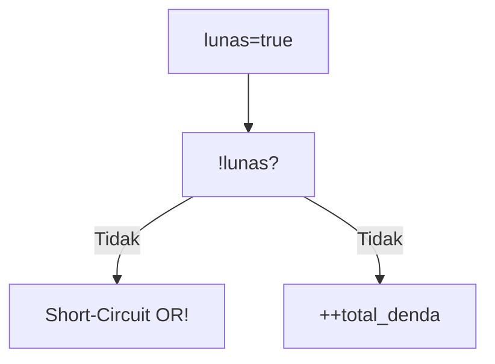
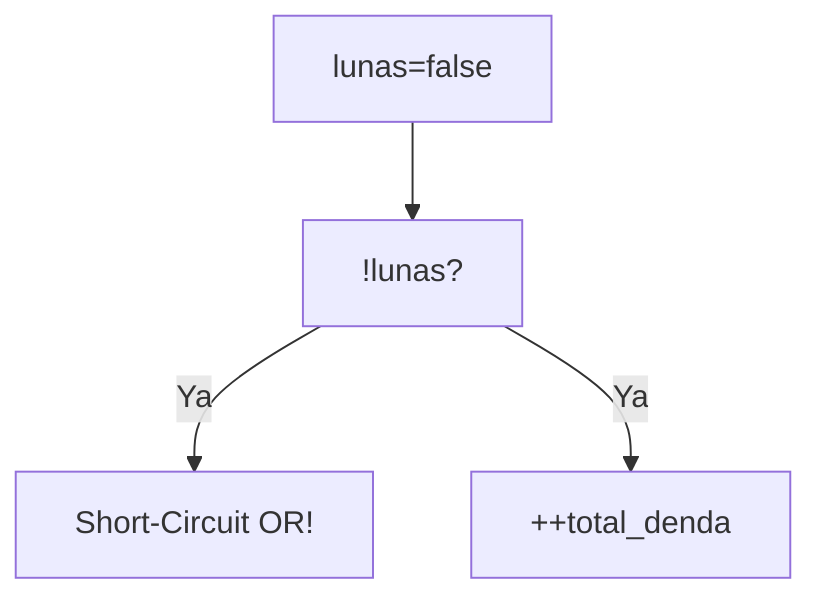
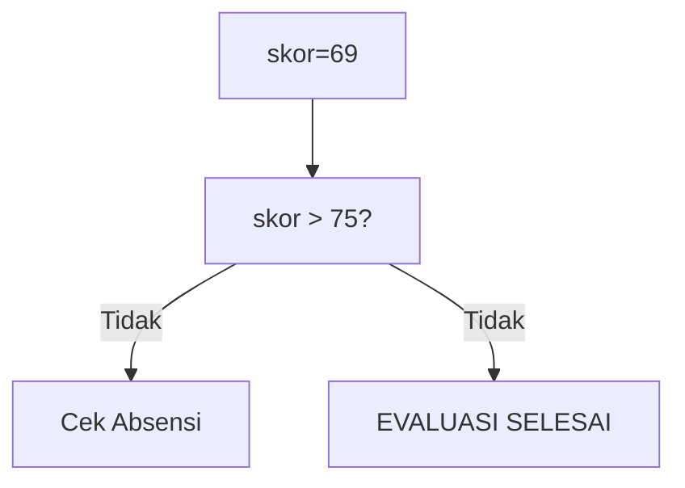

🔙 **[Kembali ke Daftar Soal](./README.md)**

---

# Latihan Soal Part C - Modul 02 - Set 03

### Soal 51
```cpp
bool lunas = true;
int total_denda = 0;
if (!lunas || ++total_denda > 5) status = 0;
```
**Pertanyaan:**
1. Berapakah hasil akhirnya?
2. Deskripsikan langkah robot compiler saat memproses kode ini!

**Jawaban & Diagnosis:**
1. **0**
2. Baca bagian 'Analisis Mendalam' di bawah.

**Mermaid Flowchart:**


**📖 Penjelasan Komprehensif:**
**Analisis Mendalam (Compiler Manusia):**
1. **Logika ||**: Operator OR mencari satu saja kebenaran. 
2. **Tracing**: `!lunas` bernilai False (SUDAH LUNAS).
3. **Dampak**: Karena False, mesin harus ngecek syarat kedua, denda naik jadi 1.
4. **Hasil**: `total_denda` = **0**.

---
### Soal 52
```cpp
int skor_siswa = 55, absensi = 85;
if (skor_siswa > 75 && absensi > 80) hasil = 1;
else hasil = 0;
```
**Pertanyaan:**
1. Berapakah hasil akhirnya?
2. Deskripsikan langkah robot compiler saat memproses kode ini!

**Jawaban & Diagnosis:**
1. **0**
2. Baca bagian 'Analisis Mendalam' di bawah.

**Mermaid Flowchart:**


**📖 Penjelasan Komprehensif:**
**Analisis Mendalam (Compiler Manusia):**
1. **Logika &&**: Syarat pertama adalah `skor_siswa > 75`. Karena nilaimu 55, statusnya GAGAL.
2. **Short-Circuit**: Karena sudah gagal di skor, mesin malas (short-circuit) dan tidak peduli absensi.
3. **Hasil Akhir**: hasil = **0**.

---
### Soal 53
```cpp
bool lunas = false;
int total_denda = 0;
if (!lunas || ++total_denda > 5) status = 0;
```
**Pertanyaan:**
1. Berapakah hasil akhirnya?
2. Deskripsikan langkah robot compiler saat memproses kode ini!

**Jawaban & Diagnosis:**
1. **1**
2. Baca bagian 'Analisis Mendalam' di bawah.

**Mermaid Flowchart:**


**📖 Penjelasan Komprehensif:**
**Analisis Mendalam (Compiler Manusia):**
1. **Logika ||**: Operator OR mencari satu saja kebenaran. 
2. **Tracing**: `!lunas` bernilai True (BELUM BAYAR).
3. **Dampak**: Karena sudah True, denda tidak dicek (denda tetap 0).
4. **Hasil**: `total_denda` = **1**.

---
### Soal 54
```cpp
int skor_siswa = 67, absensi = 85;
if (skor_siswa > 75 && absensi > 80) hasil = 1;
else hasil = 0;
```
**Pertanyaan:**
1. Berapakah hasil akhirnya?
2. Deskripsikan langkah robot compiler saat memproses kode ini!

**Jawaban & Diagnosis:**
1. **0**
2. Baca bagian 'Analisis Mendalam' di bawah.

**Mermaid Flowchart:**


**📖 Penjelasan Komprehensif:**
**Analisis Mendalam (Compiler Manusia):**
1. **Logika &&**: Syarat pertama adalah `skor_siswa > 75`. Karena nilaimu 67, statusnya GAGAL.
2. **Short-Circuit**: Karena sudah gagal di skor, mesin malas (short-circuit) dan tidak peduli absensi.
3. **Hasil Akhir**: hasil = **0**.

---
### Soal 55
```cpp
int skor_siswa = 75, absensi = 85;
if (skor_siswa > 75 && absensi > 80) hasil = 1;
else hasil = 0;
```
**Pertanyaan:**
1. Berapakah hasil akhirnya?
2. Deskripsikan langkah robot compiler saat memproses kode ini!

**Jawaban & Diagnosis:**
1. **0**
2. Baca bagian 'Analisis Mendalam' di bawah.

**Mermaid Flowchart:**


**📖 Penjelasan Komprehensif:**
**Analisis Mendalam (Compiler Manusia):**
1. **Logika &&**: Syarat pertama adalah `skor_siswa > 75`. Karena nilaimu 75, statusnya GAGAL.
2. **Short-Circuit**: Karena sudah gagal di skor, mesin malas (short-circuit) dan tidak peduli absensi.
3. **Hasil Akhir**: hasil = **0**.

---
### Soal 56
```cpp
bool lunas = false;
int total_denda = 0;
if (!lunas || ++total_denda > 5) status = 0;
```
**Pertanyaan:**
1. Berapakah hasil akhirnya?
2. Deskripsikan langkah robot compiler saat memproses kode ini!

**Jawaban & Diagnosis:**
1. **1**
2. Baca bagian 'Analisis Mendalam' di bawah.

**Mermaid Flowchart:**


**📖 Penjelasan Komprehensif:**
**Analisis Mendalam (Compiler Manusia):**
1. **Logika ||**: Operator OR mencari satu saja kebenaran. 
2. **Tracing**: `!lunas` bernilai True (BELUM BAYAR).
3. **Dampak**: Karena sudah True, denda tidak dicek (denda tetap 0).
4. **Hasil**: `total_denda` = **1**.

---
### Soal 57
```cpp
bool lunas = true;
int total_denda = 0;
if (!lunas || ++total_denda > 5) status = 0;
```
**Pertanyaan:**
1. Berapakah hasil akhirnya?
2. Deskripsikan langkah robot compiler saat memproses kode ini!

**Jawaban & Diagnosis:**
1. **0**
2. Baca bagian 'Analisis Mendalam' di bawah.

**Mermaid Flowchart:**


**📖 Penjelasan Komprehensif:**
**Analisis Mendalam (Compiler Manusia):**
1. **Logika ||**: Operator OR mencari satu saja kebenaran. 
2. **Tracing**: `!lunas` bernilai False (SUDAH LUNAS).
3. **Dampak**: Karena False, mesin harus ngecek syarat kedua, denda naik jadi 1.
4. **Hasil**: `total_denda` = **0**.

---
### Soal 58
```cpp
int skor_siswa = 48, absensi = 85;
if (skor_siswa > 75 && absensi > 80) hasil = 1;
else hasil = 0;
```
**Pertanyaan:**
1. Berapakah hasil akhirnya?
2. Deskripsikan langkah robot compiler saat memproses kode ini!

**Jawaban & Diagnosis:**
1. **0**
2. Baca bagian 'Analisis Mendalam' di bawah.

**Mermaid Flowchart:**


**📖 Penjelasan Komprehensif:**
**Analisis Mendalam (Compiler Manusia):**
1. **Logika &&**: Syarat pertama adalah `skor_siswa > 75`. Karena nilaimu 48, statusnya GAGAL.
2. **Short-Circuit**: Karena sudah gagal di skor, mesin malas (short-circuit) dan tidak peduli absensi.
3. **Hasil Akhir**: hasil = **0**.

---
### Soal 59
```cpp
bool lunas = true;
int total_denda = 0;
if (!lunas || ++total_denda > 5) status = 0;
```
**Pertanyaan:**
1. Berapakah hasil akhirnya?
2. Deskripsikan langkah robot compiler saat memproses kode ini!

**Jawaban & Diagnosis:**
1. **0**
2. Baca bagian 'Analisis Mendalam' di bawah.

**Mermaid Flowchart:**


**📖 Penjelasan Komprehensif:**
**Analisis Mendalam (Compiler Manusia):**
1. **Logika ||**: Operator OR mencari satu saja kebenaran. 
2. **Tracing**: `!lunas` bernilai False (SUDAH LUNAS).
3. **Dampak**: Karena False, mesin harus ngecek syarat kedua, denda naik jadi 1.
4. **Hasil**: `total_denda` = **0**.

---
### Soal 60
```cpp
bool lunas = false;
int total_denda = 0;
if (!lunas || ++total_denda > 5) status = 0;
```
**Pertanyaan:**
1. Berapakah hasil akhirnya?
2. Deskripsikan langkah robot compiler saat memproses kode ini!

**Jawaban & Diagnosis:**
1. **1**
2. Baca bagian 'Analisis Mendalam' di bawah.

**Mermaid Flowchart:**


**📖 Penjelasan Komprehensif:**
**Analisis Mendalam (Compiler Manusia):**
1. **Logika ||**: Operator OR mencari satu saja kebenaran. 
2. **Tracing**: `!lunas` bernilai True (BELUM BAYAR).
3. **Dampak**: Karena sudah True, denda tidak dicek (denda tetap 0).
4. **Hasil**: `total_denda` = **1**.

---
### Soal 61
```cpp
int skor_siswa = 54, absensi = 85;
if (skor_siswa > 75 && absensi > 80) hasil = 1;
else hasil = 0;
```
**Pertanyaan:**
1. Berapakah hasil akhirnya?
2. Deskripsikan langkah robot compiler saat memproses kode ini!

**Jawaban & Diagnosis:**
1. **0**
2. Baca bagian 'Analisis Mendalam' di bawah.

**Mermaid Flowchart:**


**📖 Penjelasan Komprehensif:**
**Analisis Mendalam (Compiler Manusia):**
1. **Logika &&**: Syarat pertama adalah `skor_siswa > 75`. Karena nilaimu 54, statusnya GAGAL.
2. **Short-Circuit**: Karena sudah gagal di skor, mesin malas (short-circuit) dan tidak peduli absensi.
3. **Hasil Akhir**: hasil = **0**.

---
### Soal 62
```cpp
bool lunas = false;
int total_denda = 0;
if (!lunas || ++total_denda > 5) status = 0;
```
**Pertanyaan:**
1. Berapakah hasil akhirnya?
2. Deskripsikan langkah robot compiler saat memproses kode ini!

**Jawaban & Diagnosis:**
1. **1**
2. Baca bagian 'Analisis Mendalam' di bawah.

**Mermaid Flowchart:**


**📖 Penjelasan Komprehensif:**
**Analisis Mendalam (Compiler Manusia):**
1. **Logika ||**: Operator OR mencari satu saja kebenaran. 
2. **Tracing**: `!lunas` bernilai True (BELUM BAYAR).
3. **Dampak**: Karena sudah True, denda tidak dicek (denda tetap 0).
4. **Hasil**: `total_denda` = **1**.

---
### Soal 63
```cpp
int skor_siswa = 69, absensi = 85;
if (skor_siswa > 75 && absensi > 80) hasil = 1;
else hasil = 0;
```
**Pertanyaan:**
1. Berapakah hasil akhirnya?
2. Deskripsikan langkah robot compiler saat memproses kode ini!

**Jawaban & Diagnosis:**
1. **0**
2. Baca bagian 'Analisis Mendalam' di bawah.

**Mermaid Flowchart:**


**📖 Penjelasan Komprehensif:**
**Analisis Mendalam (Compiler Manusia):**
1. **Logika &&**: Syarat pertama adalah `skor_siswa > 75`. Karena nilaimu 69, statusnya GAGAL.
2. **Short-Circuit**: Karena sudah gagal di skor, mesin malas (short-circuit) dan tidak peduli absensi.
3. **Hasil Akhir**: hasil = **0**.

---
### Soal 64
```cpp
int skor_siswa = 75, absensi = 85;
if (skor_siswa > 75 && absensi > 80) hasil = 1;
else hasil = 0;
```
**Pertanyaan:**
1. Berapakah hasil akhirnya?
2. Deskripsikan langkah robot compiler saat memproses kode ini!

**Jawaban & Diagnosis:**
1. **0**
2. Baca bagian 'Analisis Mendalam' di bawah.

**Mermaid Flowchart:**


**📖 Penjelasan Komprehensif:**
**Analisis Mendalam (Compiler Manusia):**
1. **Logika &&**: Syarat pertama adalah `skor_siswa > 75`. Karena nilaimu 75, statusnya GAGAL.
2. **Short-Circuit**: Karena sudah gagal di skor, mesin malas (short-circuit) dan tidak peduli absensi.
3. **Hasil Akhir**: hasil = **0**.

---
### Soal 65
```cpp
bool lunas = false;
int total_denda = 0;
if (!lunas || ++total_denda > 5) status = 0;
```
**Pertanyaan:**
1. Berapakah hasil akhirnya?
2. Deskripsikan langkah robot compiler saat memproses kode ini!

**Jawaban & Diagnosis:**
1. **1**
2. Baca bagian 'Analisis Mendalam' di bawah.

**Mermaid Flowchart:**


**📖 Penjelasan Komprehensif:**
**Analisis Mendalam (Compiler Manusia):**
1. **Logika ||**: Operator OR mencari satu saja kebenaran. 
2. **Tracing**: `!lunas` bernilai True (BELUM BAYAR).
3. **Dampak**: Karena sudah True, denda tidak dicek (denda tetap 0).
4. **Hasil**: `total_denda` = **1**.

---
### Soal 66
```cpp
int skor_siswa = 67, absensi = 85;
if (skor_siswa > 75 && absensi > 80) hasil = 1;
else hasil = 0;
```
**Pertanyaan:**
1. Berapakah hasil akhirnya?
2. Deskripsikan langkah robot compiler saat memproses kode ini!

**Jawaban & Diagnosis:**
1. **0**
2. Baca bagian 'Analisis Mendalam' di bawah.

**Mermaid Flowchart:**


**📖 Penjelasan Komprehensif:**
**Analisis Mendalam (Compiler Manusia):**
1. **Logika &&**: Syarat pertama adalah `skor_siswa > 75`. Karena nilaimu 67, statusnya GAGAL.
2. **Short-Circuit**: Karena sudah gagal di skor, mesin malas (short-circuit) dan tidak peduli absensi.
3. **Hasil Akhir**: hasil = **0**.

---
### Soal 67
```cpp
int skor_siswa = 45, absensi = 85;
if (skor_siswa > 75 && absensi > 80) hasil = 1;
else hasil = 0;
```
**Pertanyaan:**
1. Berapakah hasil akhirnya?
2. Deskripsikan langkah robot compiler saat memproses kode ini!

**Jawaban & Diagnosis:**
1. **0**
2. Baca bagian 'Analisis Mendalam' di bawah.

**Mermaid Flowchart:**


**📖 Penjelasan Komprehensif:**
**Analisis Mendalam (Compiler Manusia):**
1. **Logika &&**: Syarat pertama adalah `skor_siswa > 75`. Karena nilaimu 45, statusnya GAGAL.
2. **Short-Circuit**: Karena sudah gagal di skor, mesin malas (short-circuit) dan tidak peduli absensi.
3. **Hasil Akhir**: hasil = **0**.

---
### Soal 68
```cpp
int skor_siswa = 55, absensi = 85;
if (skor_siswa > 75 && absensi > 80) hasil = 1;
else hasil = 0;
```
**Pertanyaan:**
1. Berapakah hasil akhirnya?
2. Deskripsikan langkah robot compiler saat memproses kode ini!

**Jawaban & Diagnosis:**
1. **0**
2. Baca bagian 'Analisis Mendalam' di bawah.

**Mermaid Flowchart:**


**📖 Penjelasan Komprehensif:**
**Analisis Mendalam (Compiler Manusia):**
1. **Logika &&**: Syarat pertama adalah `skor_siswa > 75`. Karena nilaimu 55, statusnya GAGAL.
2. **Short-Circuit**: Karena sudah gagal di skor, mesin malas (short-circuit) dan tidak peduli absensi.
3. **Hasil Akhir**: hasil = **0**.

---
### Soal 69
```cpp
int skor_siswa = 44, absensi = 85;
if (skor_siswa > 75 && absensi > 80) hasil = 1;
else hasil = 0;
```
**Pertanyaan:**
1. Berapakah hasil akhirnya?
2. Deskripsikan langkah robot compiler saat memproses kode ini!

**Jawaban & Diagnosis:**
1. **0**
2. Baca bagian 'Analisis Mendalam' di bawah.

**Mermaid Flowchart:**


**📖 Penjelasan Komprehensif:**
**Analisis Mendalam (Compiler Manusia):**
1. **Logika &&**: Syarat pertama adalah `skor_siswa > 75`. Karena nilaimu 44, statusnya GAGAL.
2. **Short-Circuit**: Karena sudah gagal di skor, mesin malas (short-circuit) dan tidak peduli absensi.
3. **Hasil Akhir**: hasil = **0**.

---
### Soal 70
```cpp
bool lunas = true;
int total_denda = 0;
if (!lunas || ++total_denda > 5) status = 0;
```
**Pertanyaan:**
1. Berapakah hasil akhirnya?
2. Deskripsikan langkah robot compiler saat memproses kode ini!

**Jawaban & Diagnosis:**
1. **0**
2. Baca bagian 'Analisis Mendalam' di bawah.

**Mermaid Flowchart:**


**📖 Penjelasan Komprehensif:**
**Analisis Mendalam (Compiler Manusia):**
1. **Logika ||**: Operator OR mencari satu saja kebenaran. 
2. **Tracing**: `!lunas` bernilai False (SUDAH LUNAS).
3. **Dampak**: Karena False, mesin harus ngecek syarat kedua, denda naik jadi 1.
4. **Hasil**: `total_denda` = **0**.

---
### Soal 71
```cpp
int skor_siswa = 89, absensi = 85;
if (skor_siswa > 75 && absensi > 80) hasil = 1;
else hasil = 0;
```
**Pertanyaan:**
1. Berapakah hasil akhirnya?
2. Deskripsikan langkah robot compiler saat memproses kode ini!

**Jawaban & Diagnosis:**
1. **1**
2. Baca bagian 'Analisis Mendalam' di bawah.

**Mermaid Flowchart:**
```mermaid
graph TD
A["skor=89"] --> B["skor > 75?"]
B -- Ya --> C["Cek Absensi"]
B -- Ya --> D["EVALUASI SELESAI"]
```

**📖 Penjelasan Komprehensif:**
**Analisis Mendalam (Compiler Manusia):**
1. **Logika &&**: Syarat pertama adalah `skor_siswa > 75`. Karena nilaimu 89, statusnya LULUS.
2. **Short-Circuit**: Karena lulus syarat 1, mesin lanjut cek absensi.
3. **Hasil Akhir**: hasil = **1**.

---
### Soal 72
```cpp
int skor_siswa = 68, absensi = 85;
if (skor_siswa > 75 && absensi > 80) hasil = 1;
else hasil = 0;
```
**Pertanyaan:**
1. Berapakah hasil akhirnya?
2. Deskripsikan langkah robot compiler saat memproses kode ini!

**Jawaban & Diagnosis:**
1. **0**
2. Baca bagian 'Analisis Mendalam' di bawah.

**Mermaid Flowchart:**
```mermaid
graph TD
A["skor=68"] --> B["skor > 75?"]
B -- Tidak --> C["Cek Absensi"]
B -- Tidak --> D["EVALUASI SELESAI"]
```

**📖 Penjelasan Komprehensif:**
**Analisis Mendalam (Compiler Manusia):**
1. **Logika &&**: Syarat pertama adalah `skor_siswa > 75`. Karena nilaimu 68, statusnya GAGAL.
2. **Short-Circuit**: Karena sudah gagal di skor, mesin malas (short-circuit) dan tidak peduli absensi.
3. **Hasil Akhir**: hasil = **0**.

---
### Soal 73
```cpp
bool lunas = false;
int total_denda = 0;
if (!lunas || ++total_denda > 5) status = 0;
```
**Pertanyaan:**
1. Berapakah hasil akhirnya?
2. Deskripsikan langkah robot compiler saat memproses kode ini!

**Jawaban & Diagnosis:**
1. **1**
2. Baca bagian 'Analisis Mendalam' di bawah.

**Mermaid Flowchart:**
```mermaid
graph TD
A["lunas=false"] --> B["!lunas?"]
B -- Ya --> C["Short-Circuit OR!"]
B -- Ya --> D["++total_denda"]
```

**📖 Penjelasan Komprehensif:**
**Analisis Mendalam (Compiler Manusia):**
1. **Logika ||**: Operator OR mencari satu saja kebenaran. 
2. **Tracing**: `!lunas` bernilai True (BELUM BAYAR).
3. **Dampak**: Karena sudah True, denda tidak dicek (denda tetap 0).
4. **Hasil**: `total_denda` = **1**.

---
### Soal 74
```cpp
bool lunas = true;
int total_denda = 0;
if (!lunas || ++total_denda > 5) status = 0;
```
**Pertanyaan:**
1. Berapakah hasil akhirnya?
2. Deskripsikan langkah robot compiler saat memproses kode ini!

**Jawaban & Diagnosis:**
1. **0**
2. Baca bagian 'Analisis Mendalam' di bawah.

**Mermaid Flowchart:**
```mermaid
graph TD
A["lunas=true"] --> B["!lunas?"]
B -- Tidak --> C["Short-Circuit OR!"]
B -- Tidak --> D["++total_denda"]
```

**📖 Penjelasan Komprehensif:**
**Analisis Mendalam (Compiler Manusia):**
1. **Logika ||**: Operator OR mencari satu saja kebenaran. 
2. **Tracing**: `!lunas` bernilai False (SUDAH LUNAS).
3. **Dampak**: Karena False, mesin harus ngecek syarat kedua, denda naik jadi 1.
4. **Hasil**: `total_denda` = **0**.

---
### Soal 75
```cpp
int skor_siswa = 44, absensi = 85;
if (skor_siswa > 75 && absensi > 80) hasil = 1;
else hasil = 0;
```
**Pertanyaan:**
1. Berapakah hasil akhirnya?
2. Deskripsikan langkah robot compiler saat memproses kode ini!

**Jawaban & Diagnosis:**
1. **0**
2. Baca bagian 'Analisis Mendalam' di bawah.

**Mermaid Flowchart:**
```mermaid
graph TD
A["skor=44"] --> B["skor > 75?"]
B -- Tidak --> C["Cek Absensi"]
B -- Tidak --> D["EVALUASI SELESAI"]
```

**📖 Penjelasan Komprehensif:**
**Analisis Mendalam (Compiler Manusia):**
1. **Logika &&**: Syarat pertama adalah `skor_siswa > 75`. Karena nilaimu 44, statusnya GAGAL.
2. **Short-Circuit**: Karena sudah gagal di skor, mesin malas (short-circuit) dan tidak peduli absensi.
3. **Hasil Akhir**: hasil = **0**.

---
