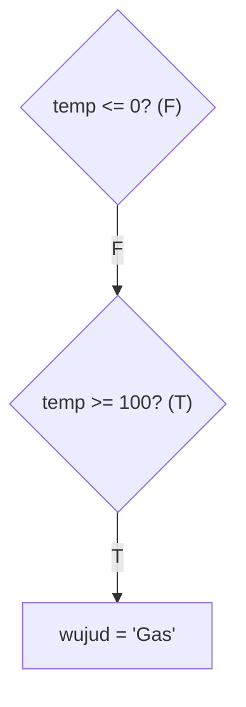
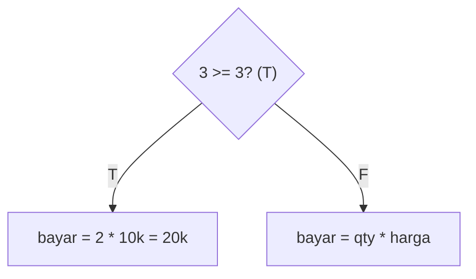
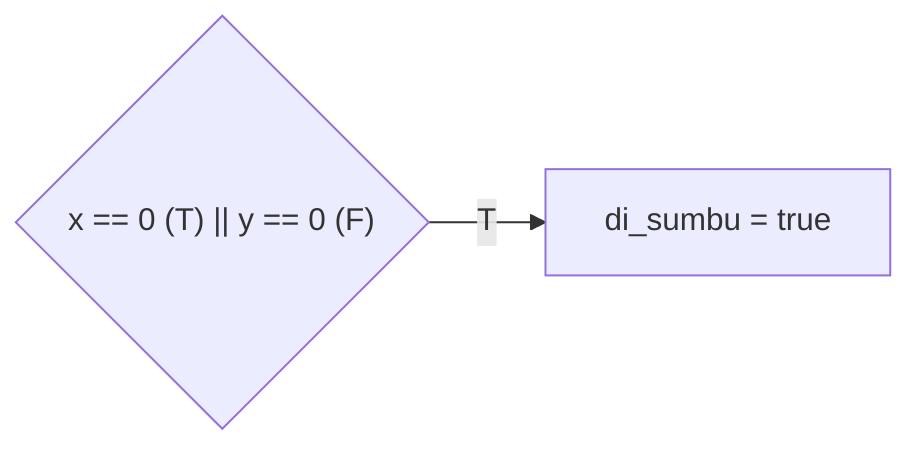
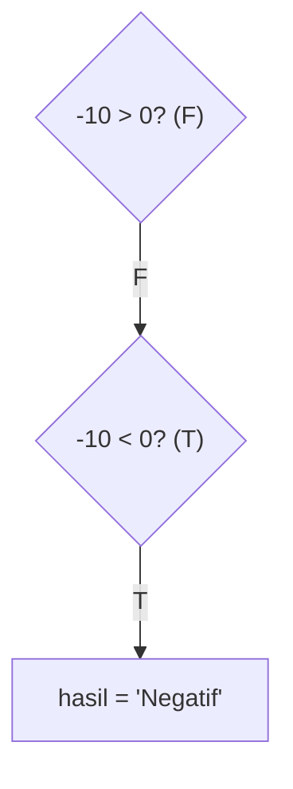
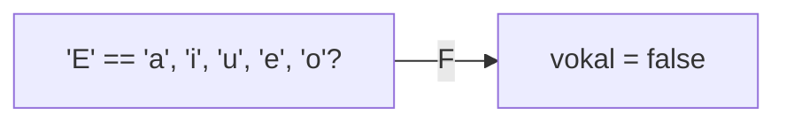
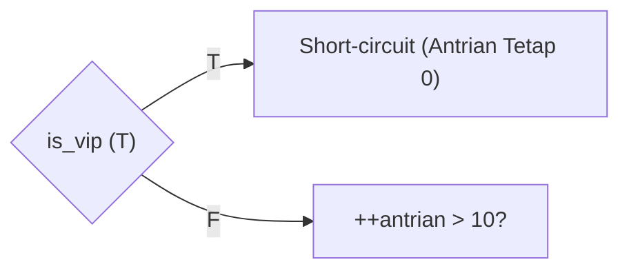
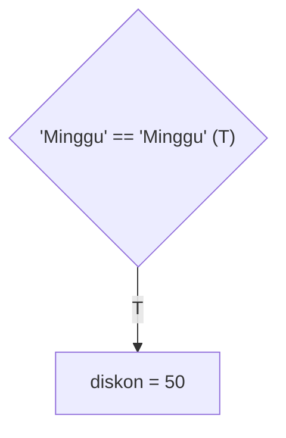
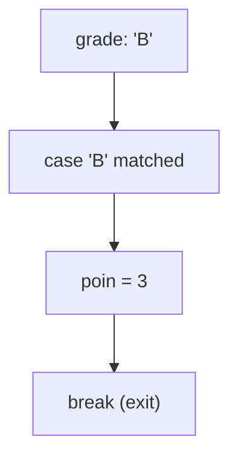
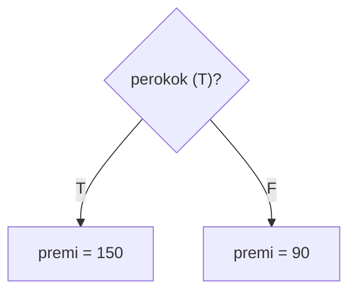
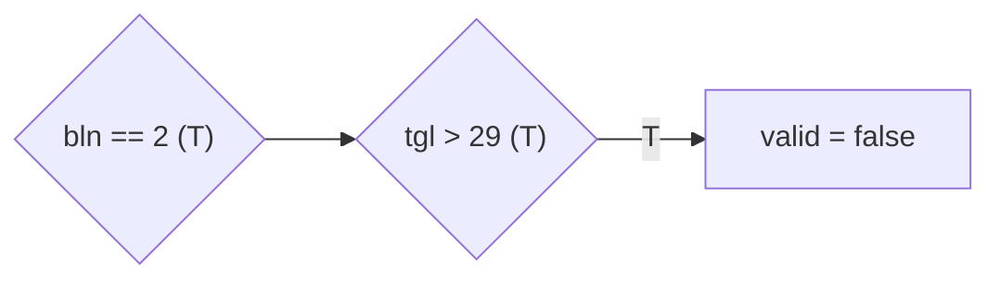

		🔙 **[Kembali ke Daftar Soal](./README.md)**

---

# Latihan Soal Part C - Modul 02 - Set 03 (Premium Edition)

---

### Soal 21: Wujud Air (Physics Context)
```cpp
// Skenario: Menentukan wujud air berdasarkan suhu
int temp = 105;
string wujud = "Cair";

if (temp <= 0) wujud = "Padat";
else if (temp >= 100) wujud = "Gas";
```
**Pertanyaan:**
1. Berapakah nilai `wujud` akhir?
2. Jika suhu **0**, apakah wujudnya?

<details>
<summary><b>Klik untuk Lihat Jawaban & Diagnosis</b></summary>

**Mermaid Flowchart:**


**Jawaban:**
1. **"Gas"**
2. **"Padat"**
</details>

---

### Soal 22: Promo Belanja (Buy 2 Get 1)
```cpp
// Beli 3 bayar 2. Harga per item 10rb.
int qty = 3;
int harga = 10000;
int bayar = 0;

if (qty >= 3) {
    bayar = (qty - 1) * harga;
} else {
    bayar = qty * harga;
}
```
**Pertanyaan:**
1. Berapakah nilai `bayar`?
2. Berapa bayar jika `qty = 2`?

<details>
<summary><b>Klik untuk Lihat Jawaban & Diagnosis</b></summary>

**Mermaid Flowchart:**


**Jawaban:**
1. **20000**
2. **20000**
</details>

---

### Soal 23: Garis Sumbu (Quadrant Zero)
```cpp
int x = 0, y = 5;
bool di_sumbu = false;

if (x == 0 || y == 0) {
    di_sumbu = true;
}
```
**Pertanyaan:**
1. Berapakah nilai `di_sumbu` (true/false)?
2. Apa maksud dari operator `||` di sini?

<details>
<summary><b>Klik untuk Lihat Jawaban & Diagnosis</b></summary>

**Mermaid Flowchart:**


**Jawaban:**
1. **true**
2. **OR** (Cukup satu nol, maka titik berada di garis sumbu).
</details>

---

### Soal 24: Positif-Negatif (Branching Flow)
```cpp
int n = -10;
string hasil = "";

if (n > 0) hasil = "Positif";
else if (n < 0) hasil = "Negatif";
else hasil = "Nol";
```
**Pertanyaan:**
1. Berapakah nilai `hasil`?
2. Jika `n = 0`, blok mana yang dieksekusi?

<details>
<summary><b>Klik untuk Lihat Jawaban & Diagnosis</b></summary>

**Mermaid Flowchart:**


**Jawaban:**
1. **"Negatif"**
2. **Blok else** (paling bawah).
</details>

---

### Soal 25: Filter Huruf (Vowel Check)
```cpp
char c = 'E';
bool vokal = false;

if (c == 'a' || c == 'i' || c == 'u' || c == 'e' || c == 'o') {
    vokal = true;
}
```
**Pertanyaan:**
1. Berapakah nilai `vokal` (true/false)?
2. Mengapa hasilnya **False** padahal 'E' adalah huruf vokal?

<details>
<summary><b>Klik untuk Lihat Jawaban & Diagnosis</b></summary>

**Mermaid Flowchart:**


**Jawaban:**
1. **false**
2. Karena 'E' (besarnya) berbeda dengan 'e' (kecilnya).
</details>

---

### Soal 26: Short-Circuit OR (Jebakan++ )
```cpp
// Skenario: Jika VIP, antrian tidak bertambah.
bool is_vip = true;
int antrian = 0;

if (is_vip || ++antrian > 10) {
    // Diproses
}
```
**Pertanyaan:**
1. Berapakah nilai `antrian` akhir?
2. Jika `is_vip = false`, berapakah nilai `antrian`?

<details>
<summary><b>Klik untuk Lihat Jawaban & Diagnosis</b></summary>

**Mermaid Flowchart:**


**Jawaban:**
1. **0**
2. **1**

**📖 Analisis Mendalam:**
Inilah **Short-circuit OR**. Karena `is_vip` sudah True, C++ **TIDAK BUTUH** mengecek syarat kedua. Mesin langsung masuk ke blok `if` tanpa mengerjakan `++antrian`.
</details>

---

### Soal 27: Diskon Akhir Pekan (String Compare)
```cpp
string hari = "Minggu";
int diskon = 0;

if (hari == "Sabtu" || hari == "Minggu") {
    diskon = 50;
} else {
    diskon = 0;
}
```
**Pertanyaan:**
1. Berapakah nilai `diskon` akhir?
2. Berapa diskon jika `hari = "Senin"`?

<details>
<summary><b>Klik untuk Lihat Jawaban & Diagnosis</b></summary>

**Mermaid Flowchart:**


**Jawaban:**
1. **50**
2. **0**
</details>

---

### Soal 28: Nilai Rapor (Conversion Table)
```cpp
char grade = 'B';
int poin = 0;

switch(grade) {
    case 'A': poin = 4; break;
    case 'B': poin = 3; break;
    case 'C': poin = 2; break;
    case 'D': poin = 1; break;
    default: poin = 0;
}
```
**Pertanyaan:**
1. Berapakah nilai `poin`?
2. Apa yang terjadi jika kita lupa menuliskan kata `break`?

<details>
<summary><b>Klik untuk Lihat Jawaban & Diagnosis</b></summary>

**Mermaid Flowchart:**


**Jawaban:**
1. **3**
2. Mesin akan terus "jatuh" ke bawah (*fallthrough*) dan mengambil nilai dari case berikutnya.
</details>

---

### Soal 29: Premi Asuransi (Boolean Flag)
```cpp
bool perokok = true;
int premi = 100;

if (perokok) {
    premi += 50;
} else {
    premi -= 10;
}
```
**Pertanyaan:**
1. Berapakah nilai `premi` akhir?
2. Jika `perokok = false`, berapakah nilai `premi`?

<details>
<summary><b>Klik untuk Lihat Jawaban & Diagnosis</b></summary>

**Mermaid Flowchart:**


**Jawaban:**
1. **150**
2. **90**
</details>

---

### Soal 30: Validasi Tanggal (Edge Case)
```cpp
int bln = 2;
int tgl = 30;
bool valid = true;

if (bln == 2 && tgl > 29) {
    valid = false;
}
```
**Pertanyaan:**
1. Berapakah nilai `valid` (true/false)?
2. Di bulan apakah tanggal 30 menjadi valid?

<details>
<summary><b>Klik untuk Lihat Jawaban & Diagnosis</b></summary>

**Mermaid Flowchart:**


**Jawaban:**
1. **false** (0)
2. Segala bulan selain Februari.
</details>
