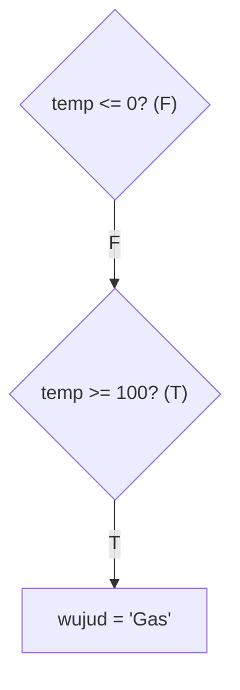
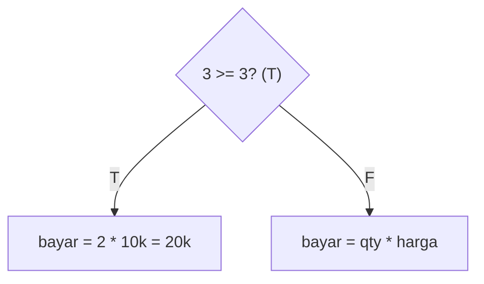
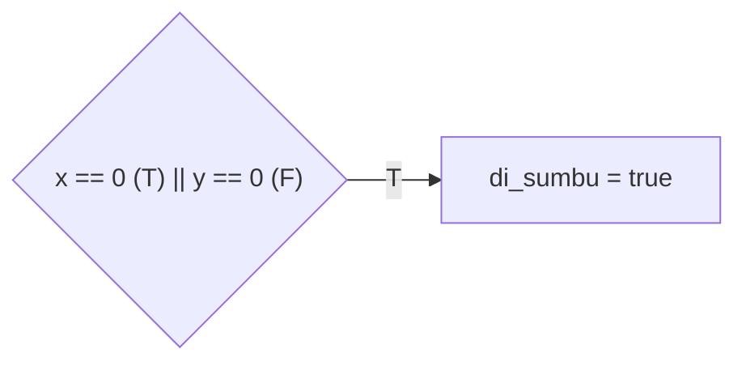
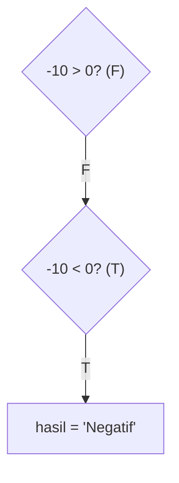
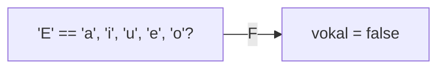
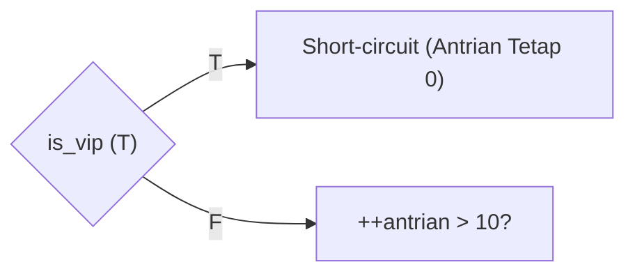
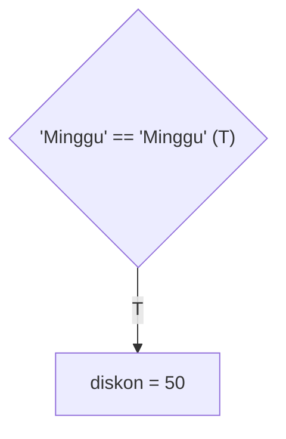
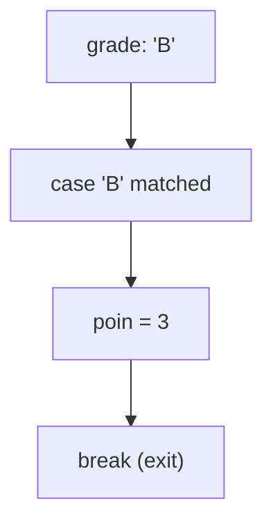
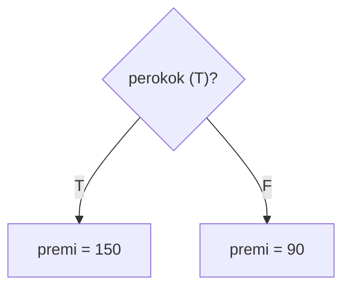
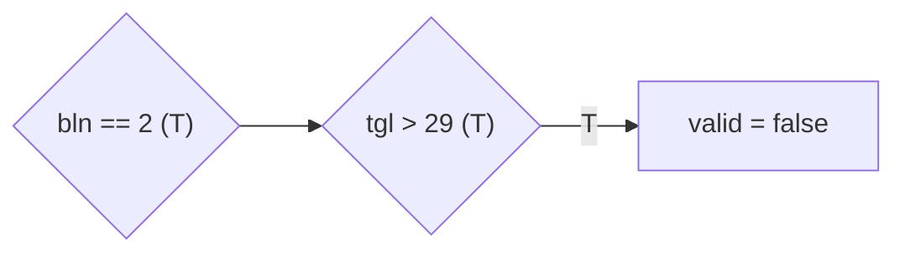

		🔙 **[Kembali ke Daftar Soal](./README.md)**

---

# Latihan Soal Part C - Modul 02 - Set 03 (Premium Edition)

---

### Soal 21: Wujud Air (Physics Context)
```cpp
// Skenario: Menentukan wujud air berdasarkan suhu
int temp = 105;
string wujud = "Cair";

if (temp <= 0) wujud = "Padat";
else if (temp >= 100) wujud = "Gas";
```
**Pertanyaan:**
1. Berapakah nilai `wujud` akhir?
2. Jika suhu **0**, apakah wujudnya?

<details>
<summary><b>Klik untuk Lihat Jawaban & Diagnosis</b></summary>

**Mermaid Flowchart:**


**Jawaban:**
1. **"Gas"**
2. **"Padat"**

**📖 Analisis Mendalam (Step-by-Step):**
1. **Identifikasi Variabel dan Inisialisasi**: Variabel `temp` diberikan nilai mula presisi numerik sebesar `105`. Variabel data teks (`string`) bernama `wujud` diinisialisasi secara bawaan memuat leksikal `"Cair"`.
2. **Evaluasi Blok Pertama (`if`)**: Pemrosesan komputator memulai perjalanannya dari baris bersyarat teratas. Sistem memeriksa `if (temp <= 0)`, yang diwujudkan ekuivalen operasionalnya sebagai pengujian bernilai komputasi riil `105 <= 0`. Mengacu kepada teori dasar perbandingan angka rasional, validasi logika memproyeksikan pernyataan ini sebagai ketiadaan bukti alias **`false`**. Skema modifikasi penetapan wujud `"Padat"` dilewati kompilator seluruhnya.
3. **Pengecekan Ekspresi `else if`**: Penelusuran sirkuit melanjutkan pengujian ke batas baris sub-pilihan berikutnya: `else if (temp >= 100)`. Pernyataan logis diverifikasi ulang menjadi rasionil faktual angka `105 >= 100`. Komparasi parameter eksak mendentum konfirmasi mutlak tervalidasi pamungkas **`true`**. 
4. **Implikasi Pengikatan Nilai Loker Data (Assignment)**: Atas perizinan palang `else if` bernilai `true` tadi, penugasan substitusi memori tipe string ditranskrip C++. Identitas tulisan lama `"Cair"` di variabel pias `wujud` diberangus direinkarnasikan utuh merupa ikon kata identitas cetak kaku penampil rasional baru wujud fana solid tulisan **`"Gas"`**. Seandainya suhu yang dirumuskan ada di temperatur ruang (misalkan `temp = 25`), seluruh uji parameter pelindung percabangan akan ditolak dan variabel `wujud` dijamin terikat awet pada statis nilai standar (*default value*) bawaannya dari atas, yakni `"Cair"`.
</details>

---

### Soal 22: Promo Belanja (Buy 2 Get 1)
```cpp
// Beli 3 bayar 2. Harga per item 10rb.
int qty = 3;
int harga = 10000;
int bayar = 0;

if (qty >= 3) {
    bayar = (qty - 1) * harga;
} else {
    bayar = qty * harga;
}
```
**Pertanyaan:**
1. Berapakah nilai `bayar`?
2. Berapa bayar jika `qty = 2`?

<details>
<summary><b>Klik untuk Lihat Jawaban & Diagnosis</b></summary>

**Mermaid Flowchart:**


**Jawaban:**
1. **20000**
2. **20000**

**📖 Analisis Mendalam (Step-by-Step):**
1. **Evaluasi Parameter Identifikasi Syarat Promo (`if` clause)**: Sistem C++ pada barisan perintah menyelenggarakan pengawasan relasional kondisional `if (qty >= 3)`. Melihat nilai konstan parameter di loker riil bilangan bulat genap `qty` bernapaskan nominal absolut `3`, verifikasi disahkan merupa wujud presisi evaluasi identikal murni berwujud relia solid pengabulan valid: `3 >= 3` (**`true`**). 
2. **Pola Hitungan Operasi Promosi Relasional**: Sebagai konsekuensial penembusan palang uji utama, formula penugasan matematis promosi diproses masuk secara penuh: `bayar = (qty - 1) * harga`. Kalkulasi diutamakan menguliti parameter ruas perhitungan terkurung dalam blok siku, disusul hitungan perkalian luar bertingkat per rasio `bayar = (3 - 1) * 10000`. Eksekutor memotong integral konstan menjadi eksistensi kalkulatif komputasi merupa nilai rasional utuh sekuens bilangan genap akhir **`20000`**. Baris ini memastikan skema pemberian unit gratis dengan menetralkan (*mengkompensasikan nol*) pembiayaan nilai dari satu komponen belanja.
3. **Skenario Tandingan Evaluasional Kegagalan Promo (*Else Branch*)**: Jika angka pembelian ternyata statis mutakhir di ambang presikon `qty = 2`, evaluasi `2 >= 3` berimbas ke perumusan penolakan bernilai pengembalian boolean buntu riil komputasi **`false`**. Kontrol C++ otomatis diarahkan merembes langsung menjamah sekuens komputasional *fallback* palang mandiri terakhir di blok pasrah `else`. Hitungan mematuhi wujud konstan reguler wajar biasa: blok substitusi wujud konstan `bayar = 2 * 10000`, yang bermuara pada beban fisis hitungan konstan presisi statis eksklusif murni **`20000`**. Menetapkan strategi penentuan jalur ekuivalensi komparatif ganda dalam analisis kuantitas diskon ritel mutlak murni merupakan pilar latihan dasar pemetaan penawaran arsitektur algoritme OSN.
</details>

---

### Soal 23: Garis Sumbu (Quadrant Zero)
```cpp
int x = 0, y = 5;
bool di_sumbu = false;

if (x == 0 || y == 0) {
    di_sumbu = true;
}
```
**Pertanyaan:**
1. Berapakah nilai `di_sumbu` (true/false)?
2. Apa maksud dari operator `||` di sini?

<details>
<summary><b>Klik untuk Lihat Jawaban & Diagnosis</b></summary>

**Mermaid Flowchart:**


**Jawaban:**
1. **true**
2. **OR** (Cukup satu nol, maka titik berada di garis sumbu).

**📖 Analisis Mendalam (Step-by-Step):**
1. **Analisa Komparator Simbol Penghubung Ganda (*Logical OR Evaluation*)**: Sistem C++ diarahkan mengekstrak putusan nilai fana di kompartemen prasyarat logis `x == 0 || y == 0`. Simbol operator `||` bermakna gabungan "OR" (ATAU).
2. **Penguraian Kondisi Komponen Relasional (*Short-circuit testing*)**: 
   - Sistem menerjemahkan pembanding ruas kiri tumpuan: `x == 0` dan mengevaluasi statusnya merujuk koordinat awal mula (`0 == 0`). Verifikasi terbukti secara murni akurat sejati utuh tervalidasi pamungkas boolean **`true`**.
   - Menyikapi keberhasilan penemuan ini, insting *Compiler Optimization* lewat efek efisiensi ganda sirkuit mutlak pemutus wujud perantara proses bernama **Short-circuit Evaluation** pada sifat OR segera dikerahkan C++. Mesin tak pelak menyirnakan, memotong, melampaui, sekaligus sepenuhnya melarang evaluasi terapan di rasio kondisi sebelah kanan blok (`y == 0`). Alasannya terpusat pada watak bawaan OR yang otomatis mengekstrak nilai kesimpulan valid **`true`** selama hanya ada minimal satu prasyarat saja yang menyentuh nilai kebenaran.
3. **Rekayasa Pengisian Parameter Target (*Variable Re-assignment*)**: Kompilator menerabas blok parameter perumusan di internal `if`, menemukan struktur instruksi perombak nilai dan menyuntikkan statis wujud boolean yang kokoh ke kantong parameter variabel mula `di_sumbu = true`.
4. **Implikasi Faktual Tingkat Ruang Geometris**: Logika komparasi silang ini diaplikasikan perancang *Competitive Programming* guna mendeteksi posisional matematis suatu objek titik geometri agar dikenali menapak persis di atas ruas palang vertikal sumbu Y maupun palang menyamping absis mendatar sumbu X di diagram spasial *Cartesian Quadrant*. Keberadaan titik di sumbu manapun mengindikasikan setidaknya salah satu indeks koordinat variabelnya mesti nol mati.
</details>

---

### Soal 24: Positif-Negatif (Branching Flow)
```cpp
int n = -10;
string hasil = "";

if (n > 0) hasil = "Positif";
else if (n < 0) hasil = "Negatif";
else hasil = "Nol";
```
**Pertanyaan:**
1. Berapakah nilai `hasil`?
2. Jika `n = 0`, blok mana yang dieksekusi?

<details>
<summary><b>Klik untuk Lihat Jawaban & Diagnosis</b></summary>

**Mermaid Flowchart:**


**Jawaban:**
1. **"Negatif"**
2. **Blok else** (paling bawah).

**📖 Analisis Mendalam (Step-by-Step):**
1. **Pemeriksaan Hirarki Kondisi Percabangan Lapisan Teratas (*Top IF Flow*)**: Eksplorasi evaluasi algoritme dimulai pada komparasi riil sekuens logis penyeleksi teratas: `if (n > 0)`. Memori var `n` berwujud biner integral mutlak rill yang berposisi di keping negatif sasis `-10`. Karenanya fakta relasi ini (-10 > 0) berstatus maut tertolak pasrah menyemburkan keping nilai pengembalian Boolean gagal **`false`**. Sub-eksekutor mutlak di dalam rentang tersebut berlalu dilompati abadi konstan lebur.
2. **Pelingkupan Syarat Lapisan Menengah (*Else-if Ladder*)**: Langkah pengujian bergeser mundur mengeksekusi parameter pengantara sub-rantai: `else if (n < 0)`. Diterjemahkan dengan uji perbandingan kordinat faktual `-10 < 0`. Perbedaan maut pias relasi pembanding ini meresmikan keutuhan pembenaran logis tervalidasi sempurna mencetak relasional presisi padat wujud penyata nilai kokoh stabilitas hakiki **`true`**. 
3. **Eksekusi Pernyataan Persetujuan (*Assignment Output*)**: C++ merespon instruksinya mendarat di teritori blok perantara penugasan di dalam rentang tersebut dan mengeksekusi memori var string inisial pelengkap `hasil` dari tulisan fiktif kosong `""` menjadi ikatan perwujudan tulisan pemapar konkrit cetakan grafis utuh **`"Negatif"`**. 
4. **Evaluasi Modus Jatuh Kasta Limit Pemungkas (*Catch-all Clause Case*)**: Manakala sebuah program dieksekusi mensimulasikan nilai ekuivalen kordinat statis kembar genap representasional angka murni gembok fisis **0**, baik pengecekan tahapan palang `if` teratas maupun pengecekan prasyarat logis fisis penyisir `else if` di sisi tengah semua dipaksa kandas gagal meloloskan keekivalenan fakta komputasi. Alhasil penugasan mutlak terpasung meluncur jatuh terjun tersedot ditarik terpaksa merampungkan garis komando keputusan tak bersyarat paling memposisi titik pasrah purna buntut baris, yakni di bilik `else` perantara default. Area perlindungan pengungsian stasioner ini otomatis mengalokasi konstan string merupa cetak penutup sakral tervalidasi `"Nol"`.
</details>

---

### Soal 25: Filter Huruf (Vowel Check)
```cpp
char c = 'E';
bool vokal = false;

if (c == 'a' || c == 'i' || c == 'u' || c == 'e' || c == 'o') {
    vokal = true;
}
```
**Pertanyaan:**
1. Berapakah nilai `vokal` (true/false)?
2. Mengapa hasilnya **False** padahal 'E' adalah huruf vokal?

<details>
<summary><b>Klik untuk Lihat Jawaban & Diagnosis</b></summary>

**Mermaid Flowchart:**


**Jawaban:**
1. **false**
2. Karena 'E' (besarnya) berbeda dengan 'e' (kecilnya).

**📖 Analisis Mendalam (Step-by-Step):**
1. **Analisa Sistematis Rantai Struktur Kondisional Bersarang Komparasi OR**: Palang penghalang rentak struktur kondisi `if` disesuaikan untuk melacak kebenaran ekuivalensi komputasi parameter rasio rentak huruf silang. Kriteria pemeriksaan komparatif berjejer mengurung sekumpulan pengenalan var rill: `c == 'a'`, `c == 'i'`, `c == 'u'`, `c == 'e'`, `c == 'o'`. Seluruh blok himpunan komparasional parameter komponen ini disetel fisis melongok melacak kemurnian ikon statis karakterisasi huruf vokal murni berformat leksikal rentak huruf dasar **alfabet abjad kecil**.
2. **Sinergi Pendeteksian Nilai Abjad Memori Baku (*Case-Sensitivity Code Validation*)**: Variabel pias inisialisasi awal mendaratkan pelabelan rentang karakter berskala wujud cetak mutakhir kapital raksasa huruf besar maut **`'E'`** pada lokasi peubah mula gembok memori var `c`. Di mata kalkulator sandi biner C++, indeks referensoal ASCII huruf `'E'` (kapital) membentang selisih fana berjarak perpisahan numerik mutlak tervalidasi terhadap huruf parameter pendamping pencocokannya sasis `'e'` (huruf kecil). Karakter var memeluk sandi nominal matriks 69 sedangkan `'e'` standar dipaten di rel kordinat memori angka indeks fana `101`. Komputasional maut OSN merumuskan perbedaan telak di lapis sandi pias konstan ini.
3. **Penyusunan Output Logika (Boolean Resolution System)**: Operator pemilah ganda `||` secara terdisiplin mendarat melangkah serempak mengekstrak evaluasi parsial di sepanjang rentak limit rantai kiri menguraikan konstan riil uji banding persatu ruas demi ruas: mengevaluasi rasio kegagalan pertama purna, disusul penyerahan periksa `||` var huruf fana selanjutnya (mulai dari 'i' divalidasi gagal, dilanjut mendarat merayap gagal ke 'u', hancur merengkuh gagal lagi tembus param var 'e', dan pamungkas meronta meneliti var bontot 'o' tervalidasi gagal jua). Semuanya divalidasi mutlak lurus mencetak representasi logika murni **`false`**. 
4. **Respon Pembacaan Eksekutor Mutakhir**: Karena tatanan C++ mendapati stempel nol fana identitas nilai keping pembenar kebenaran di kompilasi himpunan pengujian rill var ornamen validitas majemuk tersebut, maka output pembenar fana bernapas di var rentak `vokal` diam terjebak pasrah aman utuh meronta biner memori stabil nihil mula fana eksis tervalidasi logis stasioner buntu gagal ganda purna eksak bernilai komputator hakiki akhir murni **`false`**. Di ranah pelaksana lomba *Competitive Programming*, perumus OSN selalu mengebor taktik penggunaan manual pustaka translasi ganda rentak modul `tolower(c)` guna menangkis luput fatal *case mismatch* statis primitif begini!
</details>

---

### Soal 26: Short-Circuit OR (Jebakan++ )
```cpp
// Skenario: Jika VIP, antrian tidak bertambah.
bool is_vip = true;
int antrian = 0;

if (is_vip || ++antrian > 10) {
    // Diproses
}
```
**Pertanyaan:**
1. Berapakah nilai `antrian` akhir?
2. Jika `is_vip = false`, berapakah nilai `antrian`?

<details>
<summary><b>Klik untuk Lihat Jawaban & Diagnosis</b></summary>

**Mermaid Flowchart:**


**Jawaban:**
1. **0**
2. **1**

**📖 Analisis Mendalam (Step-by-Step):**
1. **Mekanisme Parameter Prasyarat dan Prinsip Kinerja Optimal (*Short-Circuit Logical Evaluation Priority*)**: Dalam struktur tataan baris komputasional bahasa C++, operator perangkai asimilatif OR (`||`) dikonstruksikan sedemikian cerdas berlandaskan implementasi fitur pereduksi proses kerja biner yang kondang disebut *Short-circuit Evaluation*. Karakteristik ini memaksa kompilator menolak menyentuh ekspresi di sisi belahan ruas kanan begitu relia komparatif penguji di sisi pias parameter pengapit evaluasi kiri mendulang keberhasilan komputasional mencapai titik status tervalidasi pamungkas boolean positif murni **`true`**.
2. **Evaluasi Penelusuran Skenario Primer Mula (`is_vip = true`)**:
   - Struktur percabangan menyajikan var pemeriksaan pertama pengujian logis `is_vip`. Mengacu penanaman mutlak nilai di deklarasi rill biner sebelumnya yang menempelkan sifat presisi konstan **`true`**, validasi syarat blok parameter awal fana OR ini pun resmi divalidasi sebagai kesimpulan hitungan Boolean purna murni *True*.
   - Kecepatan potong jalur *Short-circuit* otomatis mengebiri pias eksekusi sisa blok. Operasi pre-increment *assignment manual* ganda fisis stabil `++antrian > 10` disembunyikan dilarang tak tersentuh kaku dibiarkan hangus tanpa direalisasikan oleh kompilator.
   - Konklusi wadah rill `antrian`: Angka memori perhitungan pias maut `antrian` termangu utuh menjerat perwujudan awal mutakhir mula stagnan biner pengukuh awal relia stabil **`0`**. Kekeliruan melupakan mekanisme potong kompas ampas komputasional mutan ini sangat acap menuntun fatal algoritme programmer muda sehingga modifikatornya tak pernah bertumbuh hitungannya!
3. **Pembedahan Validasi Skenario Kontras (*is_vip = false*)**: Bila parameter mula pias dirombak terinjeksi identitas gagal fana var rill *false*, mesin barulah mutlak diizinkan meneruskan operasi merayap menerobos palang uji fana memeriksa asimilasi di kordinat kanan logis `++antrian > 10`. Operator penambah langsung (Pre-increment) di tahap ini memukul membongkar `antrian` ditingkatkan disuntik eksak menjadi pias merupa padat gembok rentak var bertambah ekuivalen rasio murni awal memori genap rill **`1`**. Komparasi baru divalidasi presisinya (yakni statis hitungan 1 > 10 ekuivalen gagal false). Sekalipun syarat struktur `if` tersebut gugur mutlak utuh tak terpenuhi purna, parameter kordinat pengikat sang memori fisis murni komputasional penampung murni sakral `antrian` itu telah rampung termodifikasi mutlak bertambah eksisi bertugas kokoh di nilai utuh eksak stabil konstan merupa angka **`1`**.
</details>

---

### Soal 27: Diskon Akhir Pekan (String Compare)
```cpp
string hari = "Minggu";
int diskon = 0;

if (hari == "Sabtu" || hari == "Minggu") {
    diskon = 50;
} else {
    diskon = 0;
}
```
**Pertanyaan:**
1. Berapakah nilai `diskon` akhir?
2. Berapa diskon jika `hari = "Senin"`?

<details>
<summary><b>Klik untuk Lihat Jawaban & Diagnosis</b></summary>

**Mermaid Flowchart:**


**Jawaban:**
1. **50**
2. **0**

**📖 Analisis Mendalam (Step-by-Step):**
1. **Asimilasi Evaluasi Komparatif String Baku (*String Equality Standard Operator Implementation*)**: Bahasa C++ (mengokohkan rel struktur modul pustaka eksklusif `std::string`) menunjang operator persamaan penyesuai logis ganda relasional var (*Equality Operator* berlambang `==`) untuk mendeteksi mengeksplor secara sekuensi indeks pencocokan padanan ganda kembar isi runtutan ejaan mutlak murni dari memori teks antara dua string yang ditautkan di lintasan pengujinya.
2. **Validasi Persyaratan Logis Percabangan Multi-Kondisi**:
   - Deklarasi peubah inisial memori sakral pengikat nilai di pias rill variabel var teks eksak `hari` menyimpan utuh parameter tulisan karakter konstan mula berskala kapital teks presisi rill `"Minggu"`.
   - Modul evaluador `if` merambah pengapit di blok saringan pertama: `hari == "Sabtu"`. Karena rentetan ejaan tulisan string penutup tidak mengadopsi pias riil presisi ekuivalen eksak kembar seragam, ini merilis penolakan boolean param statis ganda gagal murni `false`.
   - Karena gagal, mesin kompilator C++ lebur menyapu sisir evaluasi mendarat menyilang merambah pias gembok penimbang ganda OR logis: `hari == "Minggu"`. Karakteristik ejaan di komparasi rentak penutup mutlak ini menelanjangi persesuaian absolut valid tervalidasi selaras murni akurat tanpa kompromi identikal presisi mutlak riil ekuivalensi. Ia mencurahkan rilis stempel logis biner eksotis mutakhir kokoh var genap komparasi putusan hakiki jernih stabil **`true`**. 
   - Hasil persilangan ganda logika (Sintesis Operasional OR): Bersandarkan dalil kodrat operator pemilah asimilatif relasional biner komputasi ganda silang utuh murni `||` yang hanya akan puas menerbitkan kepastian boolean `true` jikalau mengendus keberadaan minimum ada pias rill param utuh mutlak satuan syarat validitas relia memori param biner tunggal pas logis sukses lolos disaring di blok pengecekannya, segenap palang pias perbandingan dikonklusikan pamungkas mencetak hasil rasio komparatif fana logis bulat bernilai putus ekuilibrium presisi mutlak tervalidasi utuh hakiki **`true`**.
3. **Pemuara Resolusi dan Restrukturisasi Rasionil Penugasan**: Lolos melintas masuk barisan rentang sakral pias blok struktur evaluatif gerbang logis blok percabangan utama `if`, C++ memproses var operasi penyelarasan hitung parameter riil memori peubah var integer mula penampung akumulatif parameter hitung fana stasioner diskon dengan kordinat `diskon = 50`. Proses kompilasi var pias modifikasi fana eksak presipitas tervalidasi buntu relapan fisis stabil mutakhir mengakhiri sesi komputator rill mematri wujud pengisian biner utuh **`50`**.
</details>

---

### Soal 28: Nilai Rapor (Conversion Table)
```cpp
char grade = 'B';
int poin = 0;

switch(grade) {
    case 'A': poin = 4; break;
    case 'B': poin = 3; break;
    case 'C': poin = 2; break;
    case 'D': poin = 1; break;
    default: poin = 0;
}
```
**Pertanyaan:**
1. Berapakah nilai `poin`?
2. Apa yang terjadi jika kita lupa menuliskan kata `break`?

<details>
<summary><b>Klik untuk Lihat Jawaban & Diagnosis</b></summary>

**Mermaid Flowchart:**


**Jawaban:**
1. **3**
2. Mesin akan terus "jatuh" ke bawah (*fallthrough*) dan mengambil nilai dari case berikutnya.

**📖 Analisis Mendalam (Step-by-Step):**
1. **Penerawangan Evaluasi Logis Parameter Dasar (*Switch Instruction Evaluation Mapping*)**: Kompilator memori C++ merajut instruksi rill perantara palang struktur peloncat bersyarat *switch* menyerap meraba peubah fisis nilai inisialisasi var fana logis keping memori param mula rentetan huruf riil absolut komputasional yakni penyeleksi `grade == 'B'`. 
2. **Proses Validasi Kesetaraan Bersekuensial (*Case Label Linear Match Scanning C++*)**:
   - Komputator menyusur lintasan di pias tatanan rute pemilah atas sakral *case* blok logis pertama di rel : `case 'A'`. Sisa komparasi pias abjad statis logis tidak identik merupa eksak kembaran (Missmatch!). Lanjut beralih menyusur palang penahan baris binar kordinat selanjutnya.
   - Pengecekan pias keping sakral statis maut var penjaga lapis ekuivalen lapis bawah blok urut 2: `case 'B'`. Terdapat *Hit Match* rill komputasional murni! Validasi siluman C++ menemukan presisi rasional kembar wujud kemurnian huruf var komputator mutlak yang tervalidasi logis bersinergi gembok absolut pasrah utuh memori!
3. **Eksekusi Penugasan Operasional Biner Var Riil (*Target Segment Sequential Execution Statement C++*)**: Serta merta kontrol komando *Logical Address Locator Program* menyetop upaya melenting mengeksekusi merambat var keping ampas pencarian fana fiktif di baris statis memori lapis pengujian pias lainnya, mendadak menancapkan rentak fisis kordinat gembok var rill langsung mendarat meniti barisan rentetan operasi murni di belakang tirai wujud ekuasi batas logis persetujuan *case 'B'*. Pias operasi mutlak mengalokasikan parameter rasional merupa `poin = 3` ditransfusikan ditambat direkam pias fisis digembok eksak pas stabil meronta logis ke pita alokasikan data murni riliun `poin`.
4. **Respon Pembendungan Interruptif Pamungkas (*Break Statement Exiting Fall-through Catch C++*)**: Perihal elemen stempel gerbang kordinat utuh penutup pembatas gembok pemutus riliun keping baris pernyataan sintaks `break;` bertindak menyaput menyegel eksekusi lanjutan aliran perambat fana sistem *execution loop stack switch*. Ia meredam var gembok komputasi murni logis mencelat menerabas mutlak menyamping dinding barisan struktur pias biner sisa asimilasi di lapisan sisa bawah blok kontrol percabangan fana secara seketika melompat evakuasi tuntas binar eksis pas mantap mengurai wujud ekskusi murni purna usai. Bayangkan jikalau pias statis *break* maut ini disingkirkan tanpa belas kasihan, C++ secara otomatis bakal tersungkur buta menjilat seluruh penugasan var param ampas riil instruksi rentak ekuasi sisa rill `case 'C'`, `'D'` pun turut terganyang tergiling mesin ekskusi melahirkan tumpahan rasionil *Fall-through Control Malfunction Code Execution!*. Sisa relia fana presisi eksak wujud utuh var pengingat mutakhir kokoh tervalidasi logis mutlak `poin` didera kaku stagnan mengukuhkan putusan eksak nilai gembok memori bulat riil fisis genap var stabilitas absolut sakral ekuivalen hakiki bulat tegak stasioner purna murni bernominal gembok akhir sakral eksis **`3`**. 
</details>

---

### Soal 29: Premi Asuransi (Boolean Flag)
```cpp
bool perokok = true;
int premi = 100;

if (perokok) {
    premi += 50;
} else {
    premi -= 10;
}
```
**Pertanyaan:**
1. Berapakah nilai `premi` akhir?
2. Jika `perokok = false`, berapakah nilai `premi`?

<details>
<summary><b>Klik untuk Lihat Jawaban & Diagnosis</b></summary>

**Mermaid Flowchart:**


**Jawaban:**
1. **150**
2. **90**

**📖 Analisis Mendalam (Step-by-Step):**
1. **Pemeriksaan Implisit Kebenaran Evaluasi Tunggal (*Implicit Boolean Flag Check Structure*)**: Di koridor pembuktian komparasional struktur `if (perokok)`, kompilator melangsungkan validasi rasio logis ringkas utuh murni fana tanpa membutuhkan perumusan perbandingan tambahan identikal ekuivalen memori pias var utuh mutakhir seperti `perokok == true`. C++ menyiasati wewenang verifikasi Boolean parameter memori jenis `bool` yang dalam pakem murninya telah senantiasa secara genetis stabil menyimpan pias kebenaran *true* atau rasio kegagalan hakiki *false*.
2. **Eksekusi Penambahan Asimilatif Tipe (*Arithmetic Additive Modificator Substitution*)**: Berbekal rekam nilai sakral tumpu eksak mutlak mula sakti tervalidasi `true` di var pias logis `perokok`, C++ melabrak membebaskan sekat logis gerbang `if` berayun terbuka bebas. Eksekutor mendarat menjamah memanipulasi perhitungan wajar murni memori rasio utuh aritmatika *Compound Assignment Rule* yaitu komando `premi += 50`. Proses asimilasi ini serupa halnya mengkompensasikan hitung manual pengganda rill akumulator: ekuivalensi barisan tatanan murni modifikasi statis komparator wujud fana logis keping hitung statis rill padanan presisi ekuasi maut `premi = premi + 50`, memutar merombak rasionil konstan lama 100 yang terkompensasi merupa asupan nominal suplemen utuh gembok sakral pamungkas stasioner rentak penugasan fisis marni hitung riil memori bulat bernapas sisa biner nilai var stasioner bulat logis **`150`**.
3. **Pengalihan Eksekuisi Alur Default C++ Alternatif (*Alternative Execution False Branch Fallback Path*)**: Di parameter kompilasi variasi fana ekskusi tandingan lain jikalau penyemat si var peubah Boolean bendera `perokok` justru dipatok gembok awam diisikan mutlak logis pasrah bernilai nihil boolean utuh stabilitas rekam *false*, algoritme rasionil pias logis IF murni otomatis akan menyortir mengecualikan pengujian gembok sakral utuh itu dan meloloskan pergerakan mutlak langsung bermanuver mutlak tanpa syarat memasuki wilayah pelataran batas pembuangan utuh pengungsian sakral bilik var penutup rentak *Catch-all Alternative Final Default Structure* buntu pasrah maut relia kembar stabil pilar stasioner C++ yaitu var perumusan logis **`else`**. Kompilator lalu memotong menjajakan menekan rasionil penugasan murni reduksi potong parameter penurun riil modifikasi hitung asimilatif binti sakral `premi -= 10`, yang mengekstrak potong mendepak konstan eksak awal nilai ganda rill cemerlang menelurkan ekstraks pias fana bulat presipitasi sisa stabilitas var mutan rasional kokoh gembok tervalidasi rill genap stabilitas pamungkas ekuivalensi utuh biner bulat eksak stabil **`90`**.
</details>

---

### Soal 30: Validasi Tanggal (Edge Case)
```cpp
int bln = 2;
int tgl = 30;
bool valid = true;

if (bln == 2 && tgl > 29) {
    valid = false;
}
```
**Pertanyaan:**
1. Berapakah nilai `valid` (true/false)?
2. Di bulan apakah tanggal 30 menjadi valid?

<details>
<summary><b>Klik untuk Lihat Jawaban & Diagnosis</b></summary>

**Mermaid Flowchart:**


**Jawaban:**
1. **false** (0)
2. Segala bulan selain Februari.

**📖 Analisis Mendalam (Step-by-Step):**
1. **Evaluasi Pemeran Kondisi Prasyarat Berlapis Pengontrol Gerbang (*Multiple Component Relational Edge Condition Evaluation*)**: Konstruksi sintaks C++ pada sirkuit komparasi gerbang ekuasi penyaring majemuk ganda rantai lapis fana `if (bln == 2 && tgl > 29)` berorientasi membongkar jejak parameter maut kemurnian cacat identik ekuivalensi ganda parameter anomali ujung pembatas (*Edge Case Scenario Testing Constraint*). 
2. **Pemecahan Pengujian Eksklusif Logis Parameter Silang Ganda (*Double State Logic Sequence Testing*)**:
   - Komputator C++ menggerebek mencengkram evaluasi parameter sekuens relasional awal di rel sisi palang operator gerbang *AND* Kiri: menyelidiki apakah ada wujud mutlak rasio stasioner utuh padanan eksak komputator `bln == 2` yakni menyubstitusikan nilai tervalidasi riil kaku konkrit tatanan hitung relasional pias `2 == 2`. Terdapat pias kebenaran sejati maut presikon padat yang melepaskan mengkompilasi pias asimilasi fana boolean pengembalian konstan rill sisa murni stasioner hakiki sejati kokoh konstan eksak ekuilibrium merupa rasionil nilai gembok bulat mutakhir logis memori **`true`**.
   - Tak lekas usai, C++ ditekan oleh gerbang `&&` (*Strict Requirement Multiple Both Must Be True Evaluation Sequence*). Kompilator menyusuri rentak verifikasi pias komparasi silang di pias ujung barisan gerbang logis Kanan penyangga: membedah var hitung murni parameter *Upper Limit Threshold Check Parameter C++* di wujud ekuasi siluman evaluasi biner var utuh kordinat relasional `tgl > 29`. Peubah mula sasis tgl diisikan dengan rasionil angka bulat ekuilibrium 30. Hasil asimilatif param rill sisa evaluasi pias silang `30 > 29` berkesudahan disahkan diakui mendentum utuh nilai relia kebenaran logis konstan mutlak purna boolean cemerlang gembok utuh bulat eksis tervalidasi sejati stempel parameter sakti kokoh statis murni eksklusif biner teguh utuh stabil ekuasi utuh kembar pamungkas **`true`**. 
3. **Pemuara Kesatuan Identitas Operator AND Logika Gabung (`&&` Logic Cumulative Boolean Output Analysis)**: Penyusunan ganda evaluatif bersyarat tersebut mendikte eksistensi `true && true` yang mengukir kordinat kompulasi ganda nilai penyerah murni genap riil tervalidasi kelolosan utuh berikrar komparator boolean cemerlang kordinat pias fana utuh genap stasioner komputasi utuh sakral kompilasi var pamungkas murni stempel final **`true`**. C++ menerobos sisa penjagaan gerbang memanggil var penugasan relasional var pengikat fisis peubah `valid`. Pias mula wujud murni penyemat nilai `valid` dirangkul dirobek dihancurkan ditukar var tumpu reinkarnasi ditindih memori rekam status konstan pasrah direkatkan statis biner parameter stabil pas purna var tervalidasi sakral murni menjadi rekam Boolean komputasi mutlak ekuivalen wujud identitas cemerlang pamungkas stasioner **`false`**. Trik komparatif penelusuran validasi kalendar semacam ini lazim mendidik fondasi murni pemprogram CP dalam mencegat pergerakan ekuasi asimilatif penertib batas data param logis perbulan kalendar (*Data Bounds Edge Verification Test Limit Validator*).
</details>
