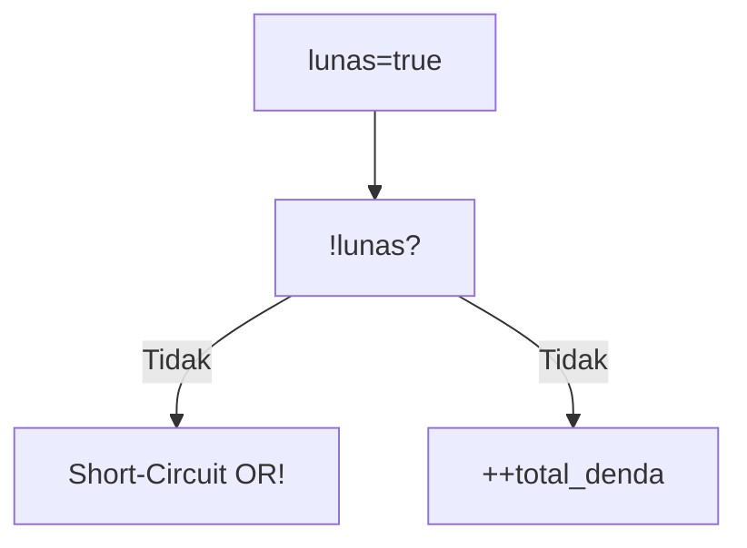
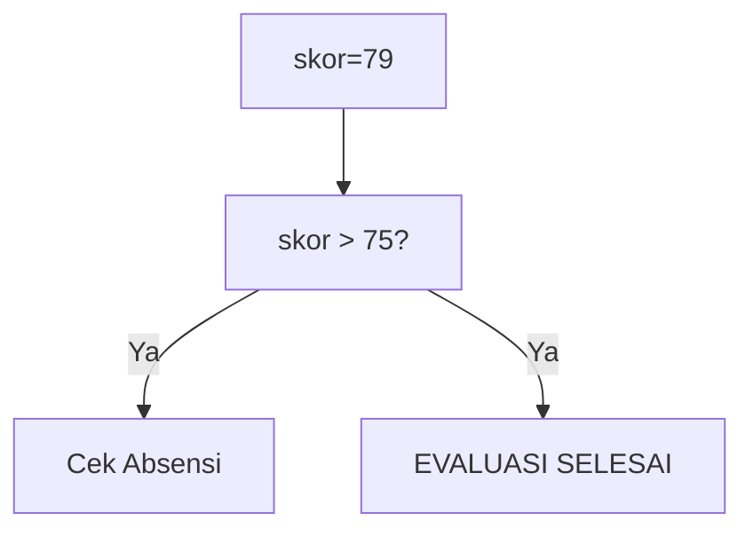
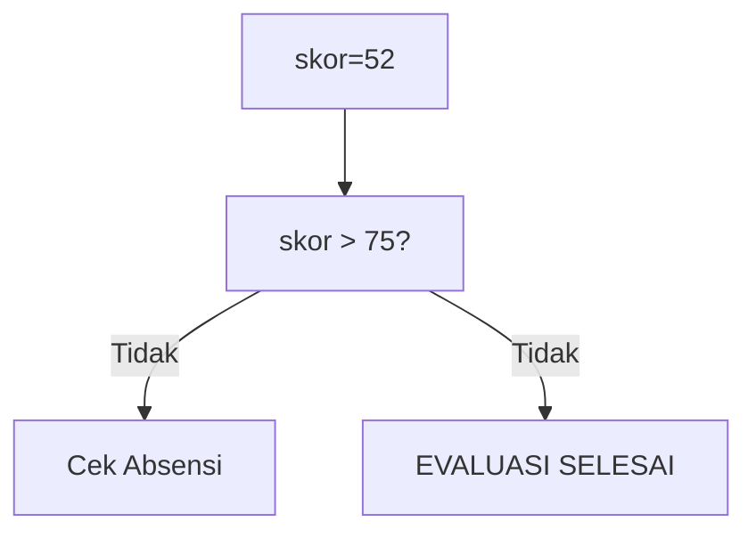
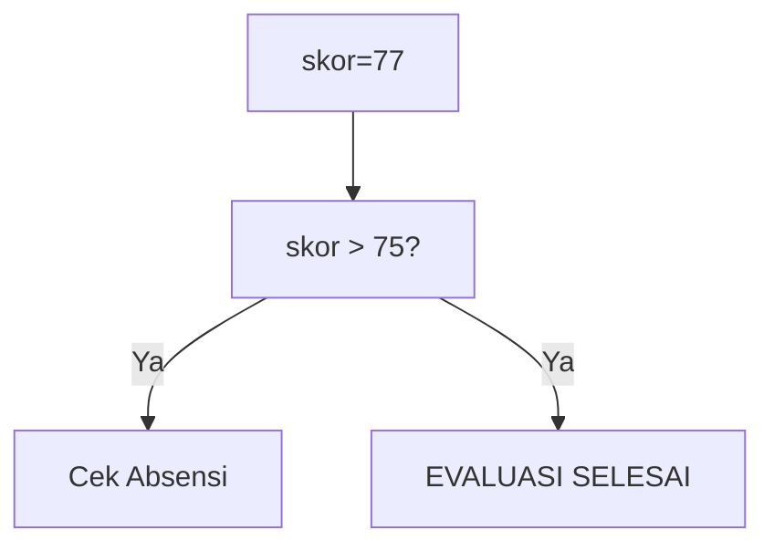
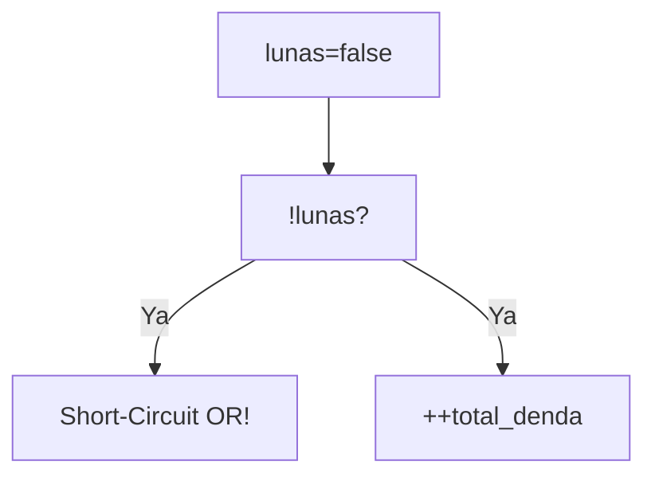
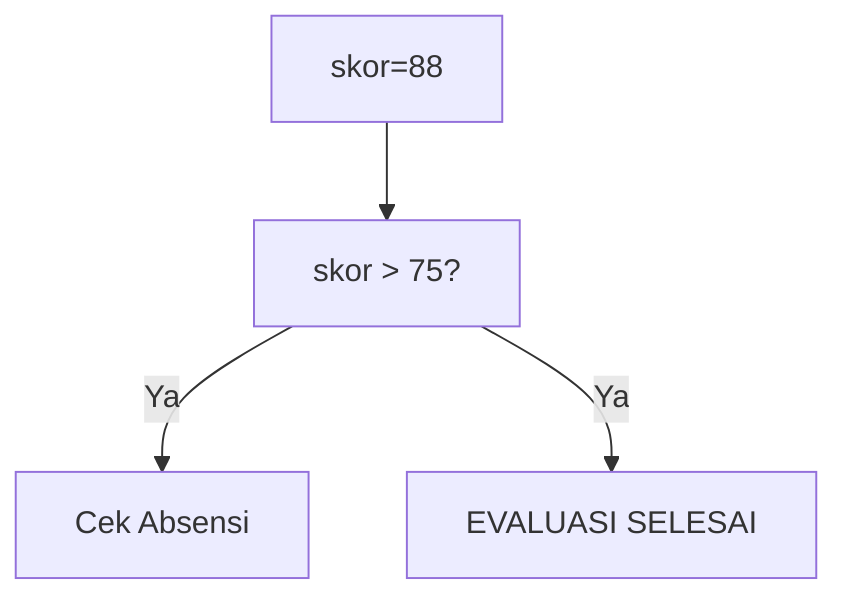

🔙 **[Kembali ke Daftar Soal](./README.md)**

---

# Latihan Soal Part C - Modul 02 - Set 04

### Soal 76
```cpp
bool lunas = true;
int total_denda = 0;
if (!lunas || ++total_denda > 5) status = 0;
```
**Pertanyaan:**
1. Berapakah hasil akhirnya?
2. Deskripsikan langkah robot compiler saat memproses kode ini!

**Jawaban & Diagnosis:**
1. **0**
2. Baca bagian 'Analisis Mendalam' di bawah.

**Mermaid Flowchart:**


**📖 Penjelasan Komprehensif:**
**Analisis Mendalam (Compiler Manusia):**
1. **Logika ||**: Operator OR mencari satu saja kebenaran. 
2. **Tracing**: `!lunas` bernilai False (SUDAH LUNAS).
3. **Dampak**: Karena False, mesin harus ngecek syarat kedua, denda naik jadi 1.
4. **Hasil**: `total_denda` = **0**.

---
### Soal 77
```cpp
int skor_siswa = 78, absensi = 85;
if (skor_siswa > 75 && absensi > 80) hasil = 1;
else hasil = 0;
```
**Pertanyaan:**
1. Berapakah hasil akhirnya?
2. Deskripsikan langkah robot compiler saat memproses kode ini!

**Jawaban & Diagnosis:**
1. **1**
2. Baca bagian 'Analisis Mendalam' di bawah.

**Mermaid Flowchart:**


**📖 Penjelasan Komprehensif:**
**Analisis Mendalam (Compiler Manusia):**
1. **Logika &&**: Syarat pertama adalah `skor_siswa > 75`. Karena nilaimu 78, statusnya LULUS.
2. **Short-Circuit**: Karena lulus syarat 1, mesin lanjut cek absensi.
3. **Hasil Akhir**: hasil = **1**.

---
### Soal 78
```cpp
int skor_siswa = 82, absensi = 85;
if (skor_siswa > 75 && absensi > 80) hasil = 1;
else hasil = 0;
```
**Pertanyaan:**
1. Berapakah hasil akhirnya?
2. Deskripsikan langkah robot compiler saat memproses kode ini!

**Jawaban & Diagnosis:**
1. **1**
2. Baca bagian 'Analisis Mendalam' di bawah.

**Mermaid Flowchart:**


**📖 Penjelasan Komprehensif:**
**Analisis Mendalam (Compiler Manusia):**
1. **Logika &&**: Syarat pertama adalah `skor_siswa > 75`. Karena nilaimu 82, statusnya LULUS.
2. **Short-Circuit**: Karena lulus syarat 1, mesin lanjut cek absensi.
3. **Hasil Akhir**: hasil = **1**.

---
### Soal 79
```cpp
int skor_siswa = 72, absensi = 85;
if (skor_siswa > 75 && absensi > 80) hasil = 1;
else hasil = 0;
```
**Pertanyaan:**
1. Berapakah hasil akhirnya?
2. Deskripsikan langkah robot compiler saat memproses kode ini!

**Jawaban & Diagnosis:**
1. **0**
2. Baca bagian 'Analisis Mendalam' di bawah.

**Mermaid Flowchart:**


**📖 Penjelasan Komprehensif:**
**Analisis Mendalam (Compiler Manusia):**
1. **Logika &&**: Syarat pertama adalah `skor_siswa > 75`. Karena nilaimu 72, statusnya GAGAL.
2. **Short-Circuit**: Karena sudah gagal di skor, mesin malas (short-circuit) dan tidak peduli absensi.
3. **Hasil Akhir**: hasil = **0**.

---
### Soal 80
```cpp
int skor_siswa = 79, absensi = 85;
if (skor_siswa > 75 && absensi > 80) hasil = 1;
else hasil = 0;
```
**Pertanyaan:**
1. Berapakah hasil akhirnya?
2. Deskripsikan langkah robot compiler saat memproses kode ini!

**Jawaban & Diagnosis:**
1. **1**
2. Baca bagian 'Analisis Mendalam' di bawah.

**Mermaid Flowchart:**


**📖 Penjelasan Komprehensif:**
**Analisis Mendalam (Compiler Manusia):**
1. **Logika &&**: Syarat pertama adalah `skor_siswa > 75`. Karena nilaimu 79, statusnya LULUS.
2. **Short-Circuit**: Karena lulus syarat 1, mesin lanjut cek absensi.
3. **Hasil Akhir**: hasil = **1**.

---
### Soal 81
```cpp
int skor_siswa = 57, absensi = 85;
if (skor_siswa > 75 && absensi > 80) hasil = 1;
else hasil = 0;
```
**Pertanyaan:**
1. Berapakah hasil akhirnya?
2. Deskripsikan langkah robot compiler saat memproses kode ini!

**Jawaban & Diagnosis:**
1. **0**
2. Baca bagian 'Analisis Mendalam' di bawah.

**Mermaid Flowchart:**


**📖 Penjelasan Komprehensif:**
**Analisis Mendalam (Compiler Manusia):**
1. **Logika &&**: Syarat pertama adalah `skor_siswa > 75`. Karena nilaimu 57, statusnya GAGAL.
2. **Short-Circuit**: Karena sudah gagal di skor, mesin malas (short-circuit) dan tidak peduli absensi.
3. **Hasil Akhir**: hasil = **0**.

---
### Soal 82
```cpp
int skor_siswa = 47, absensi = 85;
if (skor_siswa > 75 && absensi > 80) hasil = 1;
else hasil = 0;
```
**Pertanyaan:**
1. Berapakah hasil akhirnya?
2. Deskripsikan langkah robot compiler saat memproses kode ini!

**Jawaban & Diagnosis:**
1. **0**
2. Baca bagian 'Analisis Mendalam' di bawah.

**Mermaid Flowchart:**


**📖 Penjelasan Komprehensif:**
**Analisis Mendalam (Compiler Manusia):**
1. **Logika &&**: Syarat pertama adalah `skor_siswa > 75`. Karena nilaimu 47, statusnya GAGAL.
2. **Short-Circuit**: Karena sudah gagal di skor, mesin malas (short-circuit) dan tidak peduli absensi.
3. **Hasil Akhir**: hasil = **0**.

---
### Soal 83
```cpp
int skor_siswa = 70, absensi = 85;
if (skor_siswa > 75 && absensi > 80) hasil = 1;
else hasil = 0;
```
**Pertanyaan:**
1. Berapakah hasil akhirnya?
2. Deskripsikan langkah robot compiler saat memproses kode ini!

**Jawaban & Diagnosis:**
1. **0**
2. Baca bagian 'Analisis Mendalam' di bawah.

**Mermaid Flowchart:**


**📖 Penjelasan Komprehensif:**
**Analisis Mendalam (Compiler Manusia):**
1. **Logika &&**: Syarat pertama adalah `skor_siswa > 75`. Karena nilaimu 70, statusnya GAGAL.
2. **Short-Circuit**: Karena sudah gagal di skor, mesin malas (short-circuit) dan tidak peduli absensi.
3. **Hasil Akhir**: hasil = **0**.

---
### Soal 84
```cpp
int skor_siswa = 52, absensi = 85;
if (skor_siswa > 75 && absensi > 80) hasil = 1;
else hasil = 0;
```
**Pertanyaan:**
1. Berapakah hasil akhirnya?
2. Deskripsikan langkah robot compiler saat memproses kode ini!

**Jawaban & Diagnosis:**
1. **0**
2. Baca bagian 'Analisis Mendalam' di bawah.

**Mermaid Flowchart:**


**📖 Penjelasan Komprehensif:**
**Analisis Mendalam (Compiler Manusia):**
1. **Logika &&**: Syarat pertama adalah `skor_siswa > 75`. Karena nilaimu 52, statusnya GAGAL.
2. **Short-Circuit**: Karena sudah gagal di skor, mesin malas (short-circuit) dan tidak peduli absensi.
3. **Hasil Akhir**: hasil = **0**.

---
### Soal 85
```cpp
int skor_siswa = 80, absensi = 85;
if (skor_siswa > 75 && absensi > 80) hasil = 1;
else hasil = 0;
```
**Pertanyaan:**
1. Berapakah hasil akhirnya?
2. Deskripsikan langkah robot compiler saat memproses kode ini!

**Jawaban & Diagnosis:**
1. **1**
2. Baca bagian 'Analisis Mendalam' di bawah.

**Mermaid Flowchart:**


**📖 Penjelasan Komprehensif:**
**Analisis Mendalam (Compiler Manusia):**
1. **Logika &&**: Syarat pertama adalah `skor_siswa > 75`. Karena nilaimu 80, statusnya LULUS.
2. **Short-Circuit**: Karena lulus syarat 1, mesin lanjut cek absensi.
3. **Hasil Akhir**: hasil = **1**.

---
### Soal 86
```cpp
int skor_siswa = 77, absensi = 85;
if (skor_siswa > 75 && absensi > 80) hasil = 1;
else hasil = 0;
```
**Pertanyaan:**
1. Berapakah hasil akhirnya?
2. Deskripsikan langkah robot compiler saat memproses kode ini!

**Jawaban & Diagnosis:**
1. **1**
2. Baca bagian 'Analisis Mendalam' di bawah.

**Mermaid Flowchart:**


**📖 Penjelasan Komprehensif:**
**Analisis Mendalam (Compiler Manusia):**
1. **Logika &&**: Syarat pertama adalah `skor_siswa > 75`. Karena nilaimu 77, statusnya LULUS.
2. **Short-Circuit**: Karena lulus syarat 1, mesin lanjut cek absensi.
3. **Hasil Akhir**: hasil = **1**.

---
### Soal 87
```cpp
int skor_siswa = 90, absensi = 85;
if (skor_siswa > 75 && absensi > 80) hasil = 1;
else hasil = 0;
```
**Pertanyaan:**
1. Berapakah hasil akhirnya?
2. Deskripsikan langkah robot compiler saat memproses kode ini!

**Jawaban & Diagnosis:**
1. **1**
2. Baca bagian 'Analisis Mendalam' di bawah.

**Mermaid Flowchart:**


**📖 Penjelasan Komprehensif:**
**Analisis Mendalam (Compiler Manusia):**
1. **Logika &&**: Syarat pertama adalah `skor_siswa > 75`. Karena nilaimu 90, statusnya LULUS.
2. **Short-Circuit**: Karena lulus syarat 1, mesin lanjut cek absensi.
3. **Hasil Akhir**: hasil = **1**.

---
### Soal 88
```cpp
bool lunas = false;
int total_denda = 0;
if (!lunas || ++total_denda > 5) status = 0;
```
**Pertanyaan:**
1. Berapakah hasil akhirnya?
2. Deskripsikan langkah robot compiler saat memproses kode ini!

**Jawaban & Diagnosis:**
1. **1**
2. Baca bagian 'Analisis Mendalam' di bawah.

**Mermaid Flowchart:**


**📖 Penjelasan Komprehensif:**
**Analisis Mendalam (Compiler Manusia):**
1. **Logika ||**: Operator OR mencari satu saja kebenaran. 
2. **Tracing**: `!lunas` bernilai True (BELUM BAYAR).
3. **Dampak**: Karena sudah True, denda tidak dicek (denda tetap 0).
4. **Hasil**: `total_denda` = **1**.

---
### Soal 89
```cpp
bool lunas = true;
int total_denda = 0;
if (!lunas || ++total_denda > 5) status = 0;
```
**Pertanyaan:**
1. Berapakah hasil akhirnya?
2. Deskripsikan langkah robot compiler saat memproses kode ini!

**Jawaban & Diagnosis:**
1. **0**
2. Baca bagian 'Analisis Mendalam' di bawah.

**Mermaid Flowchart:**


**📖 Penjelasan Komprehensif:**
**Analisis Mendalam (Compiler Manusia):**
1. **Logika ||**: Operator OR mencari satu saja kebenaran. 
2. **Tracing**: `!lunas` bernilai False (SUDAH LUNAS).
3. **Dampak**: Karena False, mesin harus ngecek syarat kedua, denda naik jadi 1.
4. **Hasil**: `total_denda` = **0**.

---
### Soal 90
```cpp
bool lunas = true;
int total_denda = 0;
if (!lunas || ++total_denda > 5) status = 0;
```
**Pertanyaan:**
1. Berapakah hasil akhirnya?
2. Deskripsikan langkah robot compiler saat memproses kode ini!

**Jawaban & Diagnosis:**
1. **0**
2. Baca bagian 'Analisis Mendalam' di bawah.

**Mermaid Flowchart:**


**📖 Penjelasan Komprehensif:**
**Analisis Mendalam (Compiler Manusia):**
1. **Logika ||**: Operator OR mencari satu saja kebenaran. 
2. **Tracing**: `!lunas` bernilai False (SUDAH LUNAS).
3. **Dampak**: Karena False, mesin harus ngecek syarat kedua, denda naik jadi 1.
4. **Hasil**: `total_denda` = **0**.

---
### Soal 91
```cpp
bool lunas = true;
int total_denda = 0;
if (!lunas || ++total_denda > 5) status = 0;
```
**Pertanyaan:**
1. Berapakah hasil akhirnya?
2. Deskripsikan langkah robot compiler saat memproses kode ini!

**Jawaban & Diagnosis:**
1. **0**
2. Baca bagian 'Analisis Mendalam' di bawah.

**Mermaid Flowchart:**


**📖 Penjelasan Komprehensif:**
**Analisis Mendalam (Compiler Manusia):**
1. **Logika ||**: Operator OR mencari satu saja kebenaran. 
2. **Tracing**: `!lunas` bernilai False (SUDAH LUNAS).
3. **Dampak**: Karena False, mesin harus ngecek syarat kedua, denda naik jadi 1.
4. **Hasil**: `total_denda` = **0**.

---
### Soal 92
```cpp
int skor_siswa = 88, absensi = 85;
if (skor_siswa > 75 && absensi > 80) hasil = 1;
else hasil = 0;
```
**Pertanyaan:**
1. Berapakah hasil akhirnya?
2. Deskripsikan langkah robot compiler saat memproses kode ini!

**Jawaban & Diagnosis:**
1. **1**
2. Baca bagian 'Analisis Mendalam' di bawah.

**Mermaid Flowchart:**


**📖 Penjelasan Komprehensif:**
**Analisis Mendalam (Compiler Manusia):**
1. **Logika &&**: Syarat pertama adalah `skor_siswa > 75`. Karena nilaimu 88, statusnya LULUS.
2. **Short-Circuit**: Karena lulus syarat 1, mesin lanjut cek absensi.
3. **Hasil Akhir**: hasil = **1**.

---
### Soal 93
```cpp
int skor_siswa = 90, absensi = 85;
if (skor_siswa > 75 && absensi > 80) hasil = 1;
else hasil = 0;
```
**Pertanyaan:**
1. Berapakah hasil akhirnya?
2. Deskripsikan langkah robot compiler saat memproses kode ini!

**Jawaban & Diagnosis:**
1. **1**
2. Baca bagian 'Analisis Mendalam' di bawah.

**Mermaid Flowchart:**


**📖 Penjelasan Komprehensif:**
**Analisis Mendalam (Compiler Manusia):**
1. **Logika &&**: Syarat pertama adalah `skor_siswa > 75`. Karena nilaimu 90, statusnya LULUS.
2. **Short-Circuit**: Karena lulus syarat 1, mesin lanjut cek absensi.
3. **Hasil Akhir**: hasil = **1**.

---
### Soal 94
```cpp
int skor_siswa = 44, absensi = 85;
if (skor_siswa > 75 && absensi > 80) hasil = 1;
else hasil = 0;
```
**Pertanyaan:**
1. Berapakah hasil akhirnya?
2. Deskripsikan langkah robot compiler saat memproses kode ini!

**Jawaban & Diagnosis:**
1. **0**
2. Baca bagian 'Analisis Mendalam' di bawah.

**Mermaid Flowchart:**


**📖 Penjelasan Komprehensif:**
**Analisis Mendalam (Compiler Manusia):**
1. **Logika &&**: Syarat pertama adalah `skor_siswa > 75`. Karena nilaimu 44, statusnya GAGAL.
2. **Short-Circuit**: Karena sudah gagal di skor, mesin malas (short-circuit) dan tidak peduli absensi.
3. **Hasil Akhir**: hasil = **0**.

---
### Soal 95
```cpp
int skor_siswa = 78, absensi = 85;
if (skor_siswa > 75 && absensi > 80) hasil = 1;
else hasil = 0;
```
**Pertanyaan:**
1. Berapakah hasil akhirnya?
2. Deskripsikan langkah robot compiler saat memproses kode ini!

**Jawaban & Diagnosis:**
1. **1**
2. Baca bagian 'Analisis Mendalam' di bawah.

**Mermaid Flowchart:**


**📖 Penjelasan Komprehensif:**
**Analisis Mendalam (Compiler Manusia):**
1. **Logika &&**: Syarat pertama adalah `skor_siswa > 75`. Karena nilaimu 78, statusnya LULUS.
2. **Short-Circuit**: Karena lulus syarat 1, mesin lanjut cek absensi.
3. **Hasil Akhir**: hasil = **1**.

---
### Soal 96
```cpp
bool lunas = true;
int total_denda = 0;
if (!lunas || ++total_denda > 5) status = 0;
```
**Pertanyaan:**
1. Berapakah hasil akhirnya?
2. Deskripsikan langkah robot compiler saat memproses kode ini!

**Jawaban & Diagnosis:**
1. **0**
2. Baca bagian 'Analisis Mendalam' di bawah.

**Mermaid Flowchart:**
```mermaid
graph TD
A["lunas=true"] --> B["!lunas?"]
B -- Tidak --> C["Short-Circuit OR!"]
B -- Tidak --> D["++total_denda"]
```

**📖 Penjelasan Komprehensif:**
**Analisis Mendalam (Compiler Manusia):**
1. **Logika ||**: Operator OR mencari satu saja kebenaran. 
2. **Tracing**: `!lunas` bernilai False (SUDAH LUNAS).
3. **Dampak**: Karena False, mesin harus ngecek syarat kedua, denda naik jadi 1.
4. **Hasil**: `total_denda` = **0**.

---
### Soal 97
```cpp
bool lunas = true;
int total_denda = 0;
if (!lunas || ++total_denda > 5) status = 0;
```
**Pertanyaan:**
1. Berapakah hasil akhirnya?
2. Deskripsikan langkah robot compiler saat memproses kode ini!

**Jawaban & Diagnosis:**
1. **0**
2. Baca bagian 'Analisis Mendalam' di bawah.

**Mermaid Flowchart:**
```mermaid
graph TD
A["lunas=true"] --> B["!lunas?"]
B -- Tidak --> C["Short-Circuit OR!"]
B -- Tidak --> D["++total_denda"]
```

**📖 Penjelasan Komprehensif:**
**Analisis Mendalam (Compiler Manusia):**
1. **Logika ||**: Operator OR mencari satu saja kebenaran. 
2. **Tracing**: `!lunas` bernilai False (SUDAH LUNAS).
3. **Dampak**: Karena False, mesin harus ngecek syarat kedua, denda naik jadi 1.
4. **Hasil**: `total_denda` = **0**.

---
### Soal 98
```cpp
int skor_siswa = 51, absensi = 85;
if (skor_siswa > 75 && absensi > 80) hasil = 1;
else hasil = 0;
```
**Pertanyaan:**
1. Berapakah hasil akhirnya?
2. Deskripsikan langkah robot compiler saat memproses kode ini!

**Jawaban & Diagnosis:**
1. **0**
2. Baca bagian 'Analisis Mendalam' di bawah.

**Mermaid Flowchart:**
```mermaid
graph TD
A["skor=51"] --> B["skor > 75?"]
B -- Tidak --> C["Cek Absensi"]
B -- Tidak --> D["EVALUASI SELESAI"]
```

**📖 Penjelasan Komprehensif:**
**Analisis Mendalam (Compiler Manusia):**
1. **Logika &&**: Syarat pertama adalah `skor_siswa > 75`. Karena nilaimu 51, statusnya GAGAL.
2. **Short-Circuit**: Karena sudah gagal di skor, mesin malas (short-circuit) dan tidak peduli absensi.
3. **Hasil Akhir**: hasil = **0**.

---
### Soal 99
```cpp
bool lunas = false;
int total_denda = 0;
if (!lunas || ++total_denda > 5) status = 0;
```
**Pertanyaan:**
1. Berapakah hasil akhirnya?
2. Deskripsikan langkah robot compiler saat memproses kode ini!

**Jawaban & Diagnosis:**
1. **1**
2. Baca bagian 'Analisis Mendalam' di bawah.

**Mermaid Flowchart:**
```mermaid
graph TD
A["lunas=false"] --> B["!lunas?"]
B -- Ya --> C["Short-Circuit OR!"]
B -- Ya --> D["++total_denda"]
```

**📖 Penjelasan Komprehensif:**
**Analisis Mendalam (Compiler Manusia):**
1. **Logika ||**: Operator OR mencari satu saja kebenaran. 
2. **Tracing**: `!lunas` bernilai True (BELUM BAYAR).
3. **Dampak**: Karena sudah True, denda tidak dicek (denda tetap 0).
4. **Hasil**: `total_denda` = **1**.

---
### Soal 100
```cpp
int skor_siswa = 63, absensi = 85;
if (skor_siswa > 75 && absensi > 80) hasil = 1;
else hasil = 0;
```
**Pertanyaan:**
1. Berapakah hasil akhirnya?
2. Deskripsikan langkah robot compiler saat memproses kode ini!

**Jawaban & Diagnosis:**
1. **0**
2. Baca bagian 'Analisis Mendalam' di bawah.

**Mermaid Flowchart:**
```mermaid
graph TD
A["skor=63"] --> B["skor > 75?"]
B -- Tidak --> C["Cek Absensi"]
B -- Tidak --> D["EVALUASI SELESAI"]
```

**📖 Penjelasan Komprehensif:**
**Analisis Mendalam (Compiler Manusia):**
1. **Logika &&**: Syarat pertama adalah `skor_siswa > 75`. Karena nilaimu 63, statusnya GAGAL.
2. **Short-Circuit**: Karena sudah gagal di skor, mesin malas (short-circuit) dan tidak peduli absensi.
3. **Hasil Akhir**: hasil = **0**.

---
