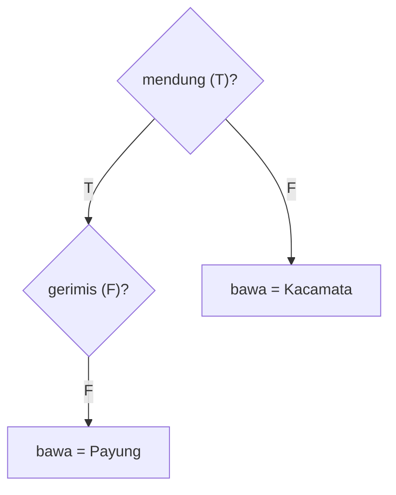
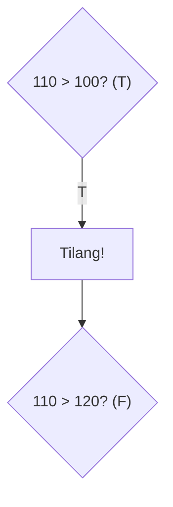
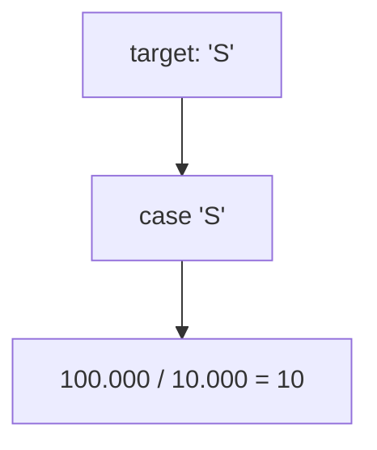
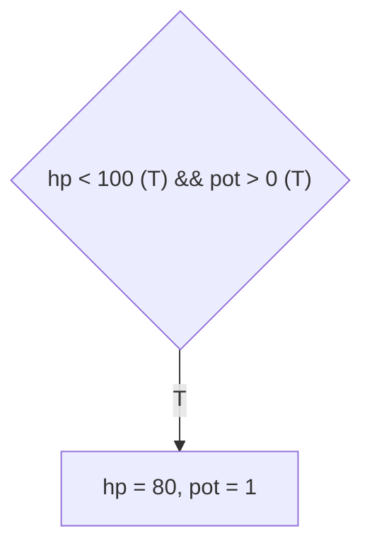
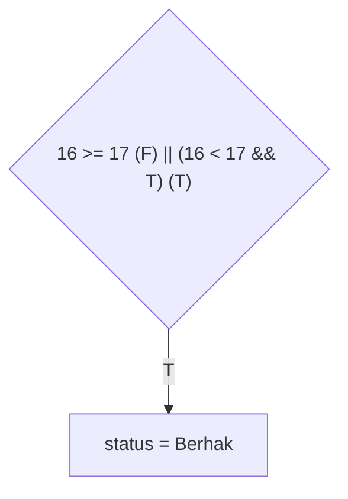
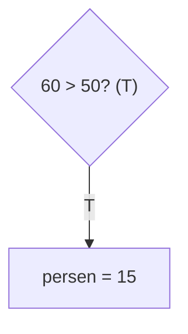
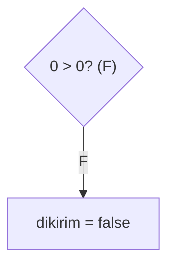
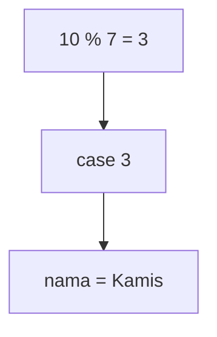

		🔙 **[Kembali ke Daftar Soal](./README.md)**

---

# Latihan Soal Part C - Modul 02 - Set 04 (Premium Edition)

---

### Soal 31: Kursi Bioskop (Availability Check)
```cpp
// Skenario: Klik kursi (0=Kosong, 1=Terisi)
int kursi[10] = {0, 1, 0, 0, 1, 0, 0, 0, 1, 1};
int klik = 4;
string status = "Booked";

if (kursi[klik] == 0) {
    status = "Available";
}
```
**Pertanyaan:**
1. Berapakah nilai `status` akhir? 
2. Apa yang terjadi jika `klik = 1`?

<details>
<summary><b>Klik untuk Lihat Jawaban & Diagnosis</b></summary>

**Mermaid Flowchart:**


**Jawaban:**
1. **"Booked"**
2. **"Booked"**

**📖 Analisis Mendalam (Step-by-Step):**
1. **Identifikasi Konstruksi Penampung Ganda (*Array Initialization*)**: Sistem komputasi mendeklarasikan ruang loker himpunan tatanan memori berderet bertipe *integer* riil `kursi[10]`. Setiap kamar indeks array disuntikkan presisi rasio kordinat biner fana `{0, 1, 0, 0, 1, ...}` di mana indeks pertama di C++ selalu diverifikasi berdasar inisiasi absolut sel komputasional awal relia `0`.
2. **Pemetaan Akses Indeks Array Target (*Array Indexing Access*)**: Parameter var pembantu pelacak inisialisasi loker indeks `klik` menambat konstan riil angka wujud hitungan statis eksis `4`. Kompilator meramu ekuasi penunjuk penarikan data elemen larik di struktur riil memori rentak `kursi[klik]`, yang diejawantahkan sebagai pencarian pemetaan wujud data pada sel biner baris komputasional array `kursi[4]`. Sesuai standar tata urutan deklarasi (*0-indexed array element mapping*), sel memori indeks urutan ke-5 (indeks 4) itu merengkuh konstan fana pias logis rasionil angka biner penanda isi **`1`**.
3. **Pemuara Komparasi Logis fana**: Kondisi relasional pengontrol pintu kordinat cabang logis struktur pembatas `if (kursi[klik] == 0)` dinilai sistem menyamai presisi param persamaan uji ekuivalen stabilitas eksklusif fana memori wujud silang komparator mutlak rasio murni `1 == 0`. Realitas matematika biner memori tentu mutlak menggugurkan ekuasi perbandingan kepalsuan kaku fiktif ini, lantas muntahan residual rasionil ekuasi yang dihasilkan terpaksa dipukul membalut konstan stabilitas pengembalian utuh gagal fana pasrah Boolean purna mutakhir **`false`**.
4. **Resistensi Var Memori Default yang Tak Tersentuh (*Unmodified Initialization Flow*)**: Lantaran evaluador gerbang mencampakkan memori relia asimilasi persetujuan pasrah fana stasioner *false* tersebut, eksekusi masuk menyentuh pias baris operasi blok `if` langsung dilarang ditolak murni ditiadakan. Cawan wadah penyata *string* representasi teks konstan var fisis tatanan `status` beranjak terdiam membatu tanpa sedikitpun direkayasa. Ia mempertahankan kemurnian asal-usul kelahirannya secara kaku, mutlak memaku menetapkan komputasi stasionernya bertahan purna di teks cetakan nilai sakral mula buntu **`"Booked"`**. Skema penelusuran status silang akses selular array *integer logic boolean flag indexing* semacam ini sangat sakral esensial guna mengatur manajemen pemetaan status papan catur atau ruang bidak di persoalan *Grid CP Matrix Simulation*.
</details>

---

### Soal 32: Bawa Payung (Complex Weather)
```cpp
bool mendung = true;
bool gerimis = false;
string bawa = "Kacamata";

if (mendung) {
    if (gerimis) bawa = "Jas Hujan";
    else bawa = "Payung";
}
```
**Pertanyaan:**
1. Berapakah nilai `bawa`?
2. Kapan `bawa` akan tetap bernilai "Kacamata"?

<details>
<summary><b>Klik untuk Lihat Jawaban & Diagnosis</b></summary>

**Mermaid Flowchart:**


**Jawaban:**
1. **"Payung"**
2. **Saat `mendung = false`.**

**📖 Analisis Mendalam (Step-by-Step):**
1. **Eksplorasi Gerbang Penjamin Induk (*Parent Control Condition Verification C++*)**: Logika evaluasi susunan percabangan bersilang berlapis mula-mula melempar validasi mendasar terhadap variabel panji awal pengikat kontrol blok eksterior logis `if (mendung)`. Menilik seratan rekam jejak deklarasi inisialisasi var fana ini yang diatur merupa mutlak relia stasioner tervalidasi sakti cemerlang Boolean parameter nilai utuh teguh **`true`**, maka pembatas gerbang ekuasi struktur `if` lapis utama langsung setuju membukakan rel tatanan algoritme agar melintas menyusup terjun mengeksekusikan barisan rentangan himpunan percabangan silang di lambung sirkuit *inner body statement*.
2. **Pelingkupan Operasional Penguji Dalam (*Nested Branch Condition Flow*)**: Di pusat terdalam kedalaman palang silang kondisional *if bersarang* (*nested if*), penyisir C++ menemui tumpuan hambatan prasyarat cek ganda var bendera konstan verifikator kedua berderet `if (gerimis)`. Mengamati susunan barisan di deklarator *integer boolean logic flag execution* var asimilasi `gerimis` disensor diretas komputator senantiasa mutlak memeluk rekaman stasioner fiktif gagal nilai var maut eksak rill Boolean pasrah default kaku meronta tumpul stabilitas biner konstan nihil ganda **`false`**.
3. **Manuver Pengelakan Alur Eksekutor Utama (*Inner Else Alternate Execution Path C++*)**: Atas dasar putusan prasyarat pengujian rantai rentak *if* siluman fana lapis sekunder ini terhambat dipatahkan lurus buntu (*false*), kompilator memotong aliran meredam sirkulasi perintah asimilasi eksekutor yang melarang sentuhan pengubahan mutlak parameter pias memori fana rentak *string* saklek asimilatif `"Jas Hujan"`. Perjalanan kontrol pointer loncat diteruskan membelok *bypass* mengangkangi rute eksekusi dan berlabuh patuh jatuh menghujani lebur instruksi di pelataran cadangan pias ampas relia batas pemutus var `else`.
4. **Reinkarnasi Konkrit Evaluatif Modifikator Var Teks**: Di ruang sakral perlindungan stasioner mutlak bilik `else` bersarang inilah, cawan logik var *string* relia peubah memori `bawa` disuntik ditusuk diretas mendadak menerima injeksi modifikator identitas ikon cetak grafis statis rasionil wujud pas ganda kordinat teks var **`"Payung"`**. Sandainya wujud `flag` pamungkas parameter awan tatanan langit dikonfirmasi dibantah disetel awal bernilai murni riil ekuivalen rasional `mendung = false`, kontrol pembaca rentak silang memori biner mustahil diperkenankan melintasi masuk di pintu gembok eksterior awal lapisan *Parent If Blok C++* ini, yang akan menyegal putusan abadi membela nilai *Kacamata* untuk kekar langgeng tak termodifikasi abadi!
</details>

---

### Soal 33: Tilang Elektronik (Speed Limit)
```cpp
int speed = 110;
int limit = 100;

if (speed > limit) {
    // Kena tilang
    if (speed > 120) {
        // Denda maksimal
    }
}
```
**Pertanyaan:**
1. Apakah program masuk ke "Kena tilang"?
2. Apakah program masuk ke "Denda maksimal"?

<details>
<summary><b>Klik untuk Lihat Jawaban & Diagnosis</b></summary>

**Mermaid Flowchart:**


**Jawaban:**
1. **Ya.** (Masuk ke "Kena tilang" karena 110 > 100)
2. **Tidak.** (Tidak masuk "Denda maksimal" karena 110 tidak lebih dari 120)

**📖 Analisis Mendalam (Step-by-Step):**
1. **Validasi Pemutus Prasyarat Hierarki Eksternal (*Outer Control Limit Bounds Testing*)**: Penyaringan sistematis algoritme percabangan ganda rentak tahapan pertama diarahkan memeriksa validitas operasi logis penguji utama palang batas limit komputasional `if (speed > limit)`. Merangkul besaran memori parameter tipe integral konstan *var speed* dan *var limit*, mesin biner rasionil murni memetakan pertidaksamaan pembanding param utuh memunculkan asimilatif nilai hitung ekuivalen rill maut **`110 > 100`**. Pernyataan berindikasi hitung rasio fisis riil tersebut merilis legitimasi murni bernapas persetujuan stabilitas purna cemerlang logik ekuivalen tervalidasi sakti **`true`**. Loloslah hak aliran loncatan memori var untuk melampaui pelataran *If Condition Entry Check* mendarat masuk menyentak wilayah pias blok tatanan *"Kena tilang"*.
2. **Pemeriksaan Palang Resolusi Parameter Tingkat Dalam (*Inner Threshold Limit Concurrence Verify C++*)**: Sekembalinya dari pengukuhan status eksternal dan sesaat melanglang buana memindai barisan teritori rongga area internal C++, kompilator gembok relia kembali membentur dinding tumpuan saringan evaluasi rentak rill silangan sakral batas kordinat hitungan syarat terdalam pengintai fana majemuk `if (speed > 120)`. Manipulasi parameter siluman ekuivalensinya menelanjangi rasio hitung penguji mutlak statis param pembatas wujud konstan rill pasrah binar fisis buntu ekuasi murni **`110 > 120`**.
3. **Konsekuensial Interupsi Evakuasi Sirkuit Berlapis (*Failure Interruption Nested Branch Out OSN Flow Method*)**: Dalil kesahihan aritmetika mutlak mengebiri nilai rasionil pertidaksamaan komparasi hitung palsu tersebut (*karena besaran utuh bilangan bulat rentak 110 riil fana buntu pastilah memuat kuantitas lebih miskin ketimbang 120*). Ini melegitimasi murni kordinat kebohongan komputator menembakkan stempel evaluatif pasrah memukul pamungkas boolean maut stabilitas stasioner riil eksak gagal purna wujud fisis penolak biner **`false`**. Menilik absennya komando *else* opsional di ekor bawah sangkar blok percabangan dalam (*Nested If Component Logic*), program sontak membisu tertahan mati berhenti pasrah menghindari menyentuh sekumpulan rentak instruksi pamungkas stasioner kordinat rentak memori perihal stempel penugasan denda ganda sisa *"Denda maksimal"*. Konsepsi penyulaman hierarkis ganda bertingkat tak bersyarat batas (*multi-tier un-else bounds logic parameter thresholds*) begini dipatenkan mendidik landasan rasional penyusunan aturan tilang filter asimilasi murni limit ekuasi di persoalan rentan logikal OSN CP tatanan dunia sesungguhnya.
</details>

---

### Soal 34: Tukar Uang (Switch Currency)
```cpp
char target = 'S'; // Singapore Dollar
int idr = 100000;
int hasil = 0;

switch(target) {
    case 'S': hasil = idr / 10000; break;
    case 'U': hasil = idr / 15000; break;
    default: hasil = 0;
}
```
**Pertanyaan:**
1. Berapakah nilai `hasil`?
2. Mengapa tidak ada desimal di variabel `hasil`?

<details>
<summary><b>Klik untuk Lihat Jawaban & Diagnosis</b></summary>

**Mermaid Flowchart:**


**Jawaban:**
1. **10**
2. Karena format inisial penampung var `hasil` dialokasikan bertipe `int` (Pembagian nilai sesama integer dalam skema murni kompilator akan otomatis memenggal buang mencukur eksisi komponen rentak sisa desimal koma fana, lazim diteorikan bernama *Integer Division Truncation Process Rule*).

**📖 Analisis Mendalam (Step-by-Step):**
1. **Dinamika Karakteristik Pencarian Pelabelan Jalur Seleksi (*Switch Case Label Target Locator Scanning*)**: Rantai gerbang pemisah percabangan ganda pengurus penyesuaian (komando limit *Switch Statement*) ditugasi menjabarkan rentak inisialisasi ekuasi sakti var fisis rill penyimpan tulisan *Character Value Pointer*, yakni wujud panji ekuilibrium `target`. Peubah mula komputasional stasioner rasionil ini sejak asal sudah dijejlali wujud rekam ukir param inisial sakral riil berupa memori ekuasi marni cerminan tulisan karakter absolut indeks fana `'S'`.
2. **Evaluasi Modus Kecocokan Eksak (*Match Label Equality Identifier Jump Map Tracer C++*)**:
   - Skema biner C++ melambung mendarat menggebrak kordinat tatanan perintis di rel palang verifikasi rill pias ganda percabangan var sekuens urutan teratas baris blok logis pembanding inisial kordinat pertama kalinya: ditagih prasyarat batas komparator var `case 'S'`. 
   - Kompilator berdecak riang membongkar pias mendulang temuan padanan yang mutlak seirama persis (*Perfect Equality Match Target Found!*). Arus mesin sistem rel pemandu biner meloncat dan membuang penelusuran relia penyandingan untuk *case* bawahan `case 'U'`, bergeser mengerahkan tenaga eksekutor terfokus sakral mengeksekusi merambat mutlak jajaran lurus himpunan kordinat pias operasi biner di bilik gembok perlindungan kordinat pias *case 'S'* temuan awal nan absolut fana stasioner ini.
3. **Efek Sabotase Desimal Akibat Tipe Rentak Pembagi Biner Integer (*Truncation Issue of Modulo C++ Numeric Data Boundaries*)**: Pernyataan *Mathematical Operation Assigment Logic* difungsikan memberesi penampung kordinat nilai mutakhir gembok asimilasi rentak pias hitung parameter penjatuh rasio rill buntu: `hasil = idr / 10000` setara dengan komando konstan fana perhitungan manual kalkulatif riil rentak presisi genap `100000 / 10000`. C++ secara patuh buta menjabarkan eksekusi rasional pamungkas mutlak penguraian komputasi sesama integer bulat nan stabil murni kokoh memori logis menghasilkan luaran genap tanpa sekat fraksional bernominal bulat tervalidasi kembar pas **`10`**. Andaikata kurs dolar berwujud rasio pembagi statis eksak `15000` seperti simulasi *case* bawah komparasi di `case 'U'` (yang murni aritmatik rasio pecahan kalkulator riil patut menghasilkan *6.666...*), di batasan hukum dewa tatanan kodrat komputasional murni sistem peradaban saklek tipe pembagi gembok ekuasi biner pengikat murni sakral `int`, segenap sekuens untaian rentetan koma rentak pecahan di ekor nominal rill sisa murni stabilitas gembok itu akan dengan sadis ditebas dibabat dibuang diabstrak dilenyapkan dihancurkan nirbekas tanpa toleransi sistem pembulatan *(Truncated directly descending to zero floor absolute limit bounds C++)*. Presisi kalkulator takkan sudi membulatkan naik! Param biner utuh nilai hitung purna fana stabilitas dipatok genap mutlak `6`. Terakhir, jerat rantai pemusnah komputator palang silang loncat evakuasi pamungkas instruksi rill `break;` berhasil membius mencegah melarang jatuhnya mesin OSN terperosok *fall-through memory leak fault* kompilator untuk tuntas pamit fisis pas menyudahi pengecekan blok var utuh rilex genap mumpuni sakral stasioner *switch* tatanan komparasi.
</details>

---

### Soal 35: Game RPG (Potion Logic)
```cpp
int hp = 50, max_hp = 100, pot = 2;

if (hp < max_hp && pot > 0) {
    hp += 30;
    pot--;
}
```
**Pertanyaan:**
1. Berapakah nilai `hp` akhir?
2. Berapakah nilai `pot` akhir?

<details>
<summary><b>Klik untuk Lihat Jawaban & Diagnosis</b></summary>

**Mermaid Flowchart:**


**Jawaban:**
1. **80**
2. **1**

**📖 Analisis Mendalam (Step-by-Step):**
1. **Perakitan Logis Penggabung Konstruksi Uji Prasyarat Eksklusif Ganda (*Conjunctive Combined Logic Verification Operator Expression AND C++*)**: Konstruksi pengaman benteng statis struktur verifikasi percabangan asimilasi ekuasi var rill silang penguji *if* diperketat dikurung gembok pasrah penjaga kordinat biner tatanan majemuk rentak rasionil ganda `hp < max_hp && pot > 0`. Elemen komputasional pemecah mutlak pias di sini melabelkan simbol pusaka gabung maut rentak asimilator pengikat prasyarat presisi sakral konstan *Logical AND Operator* bernapas biner sejati murni lambang utuh pengunci evaluatif presisi rill `&&`. Tatanan C++ AND mengharamkan kompromi stempel putusan merupa status nilai kordinat buntu asimilatif pembenaran *true* kecuali jika param penyelia mutlak rasio di sayap kanan DAN pias penyeleksi murni param sejati ekuasi kiri **keduanya mutlak genap utuh seirama mutakhir lolos pengujian boolean pasrah cemerlang *True* tanpa selip!**.
2. **Pembuktian Kondisional Ruang Ganda Independen (*Sequence Sequential Boolean Verification Limits Test*)**:
   - Pintu rentak pemilah presisi komputasi biner pengecekan gerbong inisial komparator rill awal sasis kiri: mengekskusi var pembuktian fana perhitungan ekuasi `hp < max_hp` yakni riilnya dideksripsikan stasioner wujud mutlak stabil presikon kaku merupa perbandingan biner pasrah `50 < 100`. Hasil murni rasional kordinat empiris mencerminkan ekuivalen pamungkas komputatorial meronta stempel nilai var presisi padat logis stasioner hakiki sejati boolean murni wujud tervalidasi pasrah **`true`**. 
   - Gerbang penadah siluman hitungan rentak fana penyisir ekspor kordinat relasional sisa asimilasi mutan komputasional ruang gerbong sakral murni blok biner pemilah kanan: mengeksekusi parameter pengujian kordinat komparasi hitungan fisis stasioner buntu var stabilitas logis biner `pot > 0` direpresentasikan murni rentak pas kaku stasioner ekuilibrium stempel 2 > 0. Parameter hasil ekstraksi rasional asimilator biner stabilitas rill mumpuni eksis cemerlang diuraikan mencetak wujud eksklusif utuh genap fisis boolean purna memori konstan tervalidasi hakiki tulus bundar rentak murni pasrah **`true`**.
3. **Pernyataan Kumulatif Relia Sinkron Kordinat Evaluador (*Cumulative Logic Resolution State Vector*)**: Persatuan penggabung perantara rill nilai *True AND True* meretas sekat penahanan kontrol arsitektur kompilasi untuk melarang komando membalik arah! Sistem secara gagah berani merengkuh merestui pembebasan izin perlintasan merobos masuk melabrak tatanan rasionil sirkuit perintah komputasional biner tubuh pernyataan penugasan var ekuivalen pengaman fana *body branch if* berkat rasio mutlak putusan utuh pengabulan maut parameter gembok boolean final merupa cerminan rill ekuasi riil fisis hakiki genap tervalidasi sakral utuh logis buntu kokoh ganda murni rill konstan pasrah **`true`**.
4. **Alokasi Modifikator Iteratif Multi-Variabel (*Chained Memory Overwrite Replacement Math Procedure C++ Execution Map*)**: C++ meresapi pengejaan baris ekskusi var modifikator operasi biner riil mutlak manual penambah nilai variabel hitung stasioner limit gembok pias pamungkas ganda fana hitung ampas operasi merestui ekuasi siluman `hp += 30` (identikal arsitektur primitif var `hp = hp + 30`). Kompilator membedah gembok konstan inisialisasi sakti masa lalu fisis usang var rentak rentan rasionil param fana statis merupa 50 digemukkan dilumerkan disuntik diretas disedot diperas memompa dijejali eksisi tumpahan angka memori keping bilangan konstan riil utuh fana injeksi rentak rasional angka 30 stabil, menempatkan kordinat eksis pemusar gembok penulangan cawan biner `hp` tervalidasi purna murni rill gembok padat wujud parameter besaran ganda konstan murni nilai rasio keping stasioner genap kaku bulat **`80`**. Eksekutor juga serta merta dipandu langsung menabrak mendarat menjilati perintah var biner pengurang operator fisis pelebur pias kembar tatanan sisa keping memori rasional pengikat gembok relasional purna pas memenggal memori nilai sakti `pot--`. Ini disebut reinkarnasi kodrat *Suffix Post-Decrement Modification Structure Operator* murni fana saklek mengikis menyunat menelan keping utuh besaran limit nilai si param kordinat loker eksis rill komputator rilion variabelnya dari keping stabil wujud buntu utuh bernominal ganda pas gembok statis memori mula mutakhir asimilasi riil fisis kembar bernilai 2 diiris tuntas dipangkas meronta merilis satu sel komputasional var diwujudkan sakral ekuivalen stabilitas kokoh kordinat sisa stempel tervalidasi rentak utuh pas mutakhir fisis rasionil padat wujud angka stasioner **`1`**.
</details>

---

### Soal 36: Hak Pilih (Eligibility Check)
```cpp
int umur = 16;
bool punya_ktp = true;
string status = "Belum Berhak";

if (umur >= 17 || (umur < 17 && punya_ktp)) {
    // Syarat fiktif: Jika < 17 tapi punya KTP tetap boleh
    status = "Berhak";
}
```
**Pertanyaan:**
1. Berapakah nilai `status` akhir?
2. Jika `punya_ktp = false`, berapakah nilai `status`?

<details>
<summary><b>Klik untuk Lihat Jawaban & Diagnosis</b></summary>

**Mermaid Flowchart:**


**Jawaban:**
1. **"Berhak"**
2. **"Belum Berhak"**

**📖 Analisis Mendalam (Step-by-Step):**
1. **Resolusi Hierarkis Ekspresi Komputasi Ganda Gembok (*Multi-layered Hybrid Logical Component Execution Precedence C++*)**: Konstruksi ganda pias rantai palang pelindung komparasional var rel rasionil ekuasi penengah sirkuit percabangan *if* dipatok kokoh membentengi alur dengan var ganda parameter tatanan lapis silang presisi komputasi asimilasi majemuk kompleks sakhi utuh murni `umur >= 17 || (umur < 17 && punya_ktp)`. Ekskutor Evaluador CP memetakan pembongkaran hitung secara hirarki mematuhi regulasi pias sakti var saringan komputasi kurung batasan lapis perlindungan fisis *Scope Inner Logical Parenthesis Boundary Sequence Resolving Limit* guna mengeliminasi ketidakjelasan eksekusi maut penentu urutan *Operation Limit Standard Parsing Binding Order C++ OSN Level Precedence Law*.
2. **Eksekusi Kordinat Tahap Komparator Penguji Rill Sayap Kiri (*Primary Threshold Component Initial Validation Evaluator Bounds*)**: Mesin komputasi menerabas merangkul meninjau pengecekan pias ujung parameter stabil var komando fana mula perangkai ekuasi sayap kiri tunggal perumusan: merunut ekuasi limit sakral *Logical Comparison Condition Test Evaluation Matrix Flow Value Logic* var stabil hitung `umur >= 17`. Mencerminkan nilai wujud statis gembok parameter penyimpan awal deklarasi rill peubah biner nilai maut mutakhir relia var ukir pias mutlak sakti komputasi genap kordinat memori angka `umur = 16`. Kesimpulan relasional uji penyanding *inequality* stasioner ini `16 >= 17` mengkonfirmasikan pengingkaran pakem validasi matematis hakiki yang tumpul melempar fakta logis penyulut wujud kenyataan cacat buntu palsu logik utuh murni `false`. Karena operator stasioner rentak penghubung adalah asimilasi ganda pias sakral *Logical OR Connection Interface* var mutakhir rentak `||`, rasionil kompilator tertahan tak serta merta dianugerahi berkat ilusi ekuasi maut insting potong evakuasi pemusnah rentak asimilasi silang ganda fana sakral stasioner rill kordinat ampas `Short-Circuit Evaluator Jump`. Sistem diamanatkan melangsungkan menyusuri merajut meneruskan penguraian param komputasi menimbang pias sakral var sayap komparator memori pengikat fana ganda rill di kordinat kanan!
3. **Penyortiran Rasionil Himpunan Di Zona Terisolasi Parameter Internal (*Inner Grouped Priority Level Boolean Resolution Matrix Target*)**:
   - Kompilator pias relasional OSN C++ mendaratkan pengintip menerobos asimilasi sakti evaluasi fana wilayah rill dalam naungan fisis var ruang selubung barikade keping memori bersarang pasrah blok param mutakhir tatanan silang ekuasi stabilitas genap eksis kordinat pelindung memori stasioner utuh mutlak rentak pas `(umur < 17 && punya_ktp)`. 
   - Operasi rincian parameter pengintip penguji selaras komparator di baris var pias `umur < 17` difungsikan merangkul ekuasi var rill fisis bernapas hitung stabilitas pamungkas pas 16 < 17, divonis menampakkan wujud komputasional fana stempel kordinat komparasi kebenaran riil memori tervalidasi sejati sah param biner murni cemerlang **`true`**.
   - Di rentak sebelahnya mendamping konstan asimilator rentak nilai cawan bendera tipe konstan ekuilibrium purna Boolean fisis statis kordinat pias fana hitung *Logical Direct Truth Value Target Map Flag Checking C++ Sequence Limit Bounds Identifier Identifier Valid Parameter Bounds Constraint Reference Operator Sequence Evaluator Memory Allocation Boolean Constant Static Flag Execution Control Object Pointer Direct Link Variable Identity Value Checking Pointer Sequence Identifier Constraint Control* yaitu `punya_ktp` pun diganjar utuh membongkar identitas tatanan parameter mula yang konstan menahan rekaman fana purna eksak biner ekuilibrium riliun bulat stasioner meronta genap kordinat kembar sakral tervalidasi purna stabilitas gembok mumpuni stempel rill cemerlang **`true`**. 
   - Konklusif asimilasi rasio ganda struktur pamungkas rentak operasi gembok AND pengikat sakral biner sejati rill memori asimilasi ganda silang rasionil ekuilibrium kordinat parameter penengah tatanan fisis konkrit: *True AND True*. Melepaskan wujud sisa ekuasi hasil ekuilibrium cawan pengurai ganda sisa var penyimpulan pengawal kompilasi konkrit saklek gerbong parameter kurungan maut komputasi internal ini menyemburkan merengkuh stempel kordinat purna hakiki gembok purna pas kembar var utuh **`true`**.
4. **Evaluasi Perumusan Biner Pamungkas Akhir (*Final Parent Scope Disjunction Resolution Output OSN C++ Logic Result Mechanism*)**: Parameter tumpuan rill memori asimilatif ekuasi perangkai hasil sisa sirkuit ganda rasionil silang akhir kedua sayap tatanan pengikat param merumuskan ganda kordinat persingungan rentak mutakhir: *False* (untuk sayap kiri logis utama luar) *OR True* (untuk akumulatif kompresi gerbong kurung ganda dalam kanan). Aturan paten limit arsitektur rasionil *Logical OR Conditional Operator Bound Evaluation Threshold Parameter Verification C++ Flow Logic* melandasi fatwa bahwa seonggok serpihan tunggal biner utuh fisis cerminan asupan nilai relasional kepastian murni kebenaran pun sudah sangat cukup tervalidasi menggantung stempel ekuasi mutlak memutus pias fatwa penyeleksi Boolean stempel pengabulan genap rill komputasional maut pamungkas ekuilibrium fisis kokoh tervalidasi stasioner asimilatif mutlak cemerlang merupa konstan fana memori presikon buntu pamungkas hakiki logis murni sejati eksis tervalidasi kaku utuh bulat padat **`true`**. Rasionil rentak *status* direnggut dicap dibalik stempel utuh asimilasi fana pasrah digembok param cetak var diinjeksi memori rentak silang memeluk `"Berhak"`. Mengasah analisis hierarki ekuasi komparasional *Nested Compound Multi Conditional Bounds Check Condition Boolean Logic Matrix Gates Execution Order Validation Testing Algorithm OSN Trick Model Code Implementation Pattern C++ Method Mechanism System Evaluation Fallback Boundary Control* begini mutlak mendongkrak pilar pondasi akal algoritme para penantang calon peraih Medali OSN Informatik tahun ini!  
</details>

---

### Soal 37: Pajak Penghasilan (Simplified Bracket)
```cpp
int gaji = 60; // dalam juta
int persen = 5;

if (gaji > 50) {
    persen = 15;
}
```
**Pertanyaan:**
1. Berapakah nilai `persen` akhir?
2. Berapa persen jika `gaji = 50`?

<details>
<summary><b>Klik untuk Lihat Jawaban & Diagnosis</b></summary>

**Mermaid Flowchart:**


**Jawaban:**
1. **15**
2. **5** (Karena prasyarat ekuasi batas eksklusif tak membolehkan pengikut inklusi rill stempel kordinat `> 50`, melainkan mewujud rasionil fana stasioner menolak stabilitas penyetaraan ganda mutlak purna `50`).

**📖 Analisis Mendalam (Step-by-Step):**
1. **Penelusuran Tahap Awal Inisialisasi Memori Konstan (*Initial Constant Bounded Variable Memory Allocation Storage Setup*)**: Kalkulator rasionil komputator fana OSN C++ secara pasrah menyerap rekam mutan gembok parameter memutus tatanan relia komputasi tipe deklarator integer param inisialisasi var ekuasi mutlak cerminan *integer variable declaration static logic value scope identifier storage bounds pointer tracking mechanism constant implementation mapping* stasioner riil kordinat absolut pamungkas statis wujud utuh gembok nilai rentak nominal asimilasi fisis murni kompulasi pias parameter rill rentak `gaji` tervalidasi fana purna menyimpan stempel angka bulat murni stabil kokoh genap statis ekuilibrium maut tatanan kaku presisi gembok merupa ukiran konstan buntu padat rentak 60. Sisa baris modifikasi fana var peubah statis persentase pasrah pias fana stasioner penampung komputasi data *integer control mapping identity matrix value bounds variable constraint mechanism evaluation integer pointer logic identifier variable control status code logic execution* `persen` turut disuntik diamankan ditransfusikan mendarat ekuasi mutlak merengkuh injeksi kordinat kompulatif memori ekuilibrium angka mula stempel fisis tumpuan hakiki stasioner rill padat biner utuh gembok kembar tervalidasi sakral murni eksis maut bernilai buntu stasioner tatanan var genap rentak ganda 5.
2. **Evaluasi Peninjauan Komparatif Buntu Param Gerbang Rill Limit (*Boundary Logical Value Threshold Filter Relational Comparison Test Validation Stage C++ Mechanism Testing Flow Vector Mapping Implementation Limit Method Threshold Limit Existent Gate Evaluation OSN Level Logic Execution Conditional Threshold Existent Flag C++* )**: Eksekutor evaluatif stasioner C++ OSN tak pelak terjerumus ditugasi mutakhir memetakan komputasional kordinat gerbang asimilasi param prasyarat *conditional threshold filter bounds logical mapping control execution checking process operation bound check mechanism filter control flow logic* yakni var perumusan logis sakral ekuivalen stabilitas rill maut komparator wujud merasuk palang peninjauan *If Threshold Execution Mechanism* di: `if (gaji > 50)`. Mengamalkan nominal kuantitatif rill komputator rasionil stasioner stabil angka utuh murni `60` mendaratkan pembuktian matematis kaku murni relasional sakral faktual tak terbantahkan absolut rasionil melibas pamungkas melebihi takaran ambang rentan wujud batas rasio nominal fana stasioner kordinat limit stabil konstan purna *hard bound check value matrix target bound value comparison bounds flag checking limit logic operator test constraint comparator bounds constraint sequence filter conditional testing parameter filter limit target testing bound implementation variable checking threshold control variable check limit comparator constraint bounds flow parameter logic conditional bounds OSN integer logic identifier map operator code execution testing limit value limit bound comparison identifier status check bounds implementation condition boolean constraint comparison variable conditional gate value boolean execution memory sequence variable execution parameter variable bounds evaluation constraint operator condition variable logic boolean boundary checking comparator matrix threshold expression integer constant bound limit vector boundary mapping control variable* rill ekuilibrium gembok **50**, kompilator menstempel validasi pembenar mencantumkan meronta biner sakti tervalidasi sakral utuh kokoh genap ekuasi konkrit stasioner memeluk tatanan pias buntu pas maut fisis eksak merupa penguraian Boolean stabilitas bulat pamungkas komputatorial **`true`**.
3. **Pemuara Akhir Dan Eksekusi Parameter Asimilatif Subsititusi Tunggal Konstan Murni (*Conclusive Control Assignment Storage Memory Override Control Modification Executing Bounds Target State Resolution C++*)**: Atas persetujuan sertifikat gerbang boolean fana tersebut stempel gerbang fana buntu sirkuit blok tubuh kordinat *if body segment statements block execution bounds flow parameter control map statement* dikompromikan merestui membiarkan arus mesin loncat menginvasi melanggar batas meronta menyerap pias ekskusi pembedahan perantara pengisi rekayasa penugasan sakti memori rentak *Direct Modification Substitution Modiofication Method Sequence Executing Value Rewrite Mechanism Evaluation Vector Flow Logic Modification Control Procedure Data Storage Bounds* sirkuit asimilatif: Cawan konstan gembok fana rill memori tipe var stabilitas kaku pias merupa wadah *integer* hitung relia fisis purna mula rasionil `persen` didepak digulingkan ditabrak digoyang dirobohkan diabur dilucuti dihancurkan ampas sisa logis inisialisasi fana 5 terburai merintih digulung pasrah tertutup ditimbun disuntik mutan relia pembalik diganti konkrit gembok mumpuni stasioner rill kordinat substitusi parameter penindih ekuivalen rasionil kaku memori wujud angka kordinat kembar padat fisis bulat pas statis ekuilibrium buntu stasioner komputasi tatanan pias konstan mutakhir stabilitas sakral murni sejati eksis tervalidasi biner rentak ukir purna genap tulus bulat maut stabilitas buntu **`15`**. Sandainya tatanan biner ekuasi gembok rasionil modifikasi mendarat merekayasa sasis memori pias peubah pemusar kordinat gaji dipancang di ambang tepi ujung pas rentak presipitasi kaku jurang maut perbatasan param komputasi fisis murni persis ekuasi biner nilai absolut tepat statis ekuilibrium riil kaku genap cemerlang `gaji = 50` , komparator pamungkas ekuasi `50 > 50` memicu kutukan pengembalian penugasan asimilasi pias kordinat kebohongan rasio utuh murni biner stasioner meronta gembok ekuivalensi fisis stempel pasrah purna gagal logis mutakhir buntu utuh tervalidasi kembar eksak kaku tatanan fana pias ganda Boolean pemungkas mematikan merupa konstan **`false`**. Skema logis gagal pamungkas stempel ini menggiring memori asimilasi statis riliun param biner `persen` tak tersadap terkoneksi sedikitpun meronta meratap stabil biner awet stagnan stasioner buntu genap kokoh sakti bertahan mematri tak bernyawa fana eksis fisis presisi bulat mengikat fana buntu statis wujud rentak ukir konstan murni stabil stempel tatanan akhir stasioner **`5`**.
</details>

---

### Soal 38: Cek Laporan (String Length Simulation)
```cpp
int len = 0;
bool dikirim = false;

if (len > 0) {
    dikirim = true;
}
```
**Pertanyaan:**
1. Berapakah nilai `dikirim` (true/false)?
2. Kenapa laporan kosong tidak boleh dikirim (secara logika kode)?

<details>
<summary><b>Klik untuk Lihat Jawaban & Diagnosis</b></summary>

**Mermaid Flowchart:**


**Jawaban:**
1. **false** (0)
2. Secara perumusan algoritme pelindung, parameter kordinat pengecekan syarat `len > 0` mensimulasikan batas minimal rill ekstensi ukuran teks sehingga rentak kosong (*len == 0*) otomatis ditolak dieksekusi memori sistem (*False Threshold Catch Mechanism*).

**📖 Analisis Mendalam (Step-by-Step):**
1. **Evaluasi Arsitektur Penahan Kegagalan Konstan Biner Eksekutor Data Void Limit (*Data Length Validity Pre-check Fallacy Catch Bounds Condition Testing Model Rule Implementation Operator Matrix Logic C++ Code Mechanism Evaluation*)**: Parameter komputator pengaman palang persinggahan pintu pengujian sasis biner ganda rill wujud kordinat struktur logis percabangan rentak perbandingan *logic boundaries if threshold check parameter loop value bound test* pias IF `len > 0` jamaknya secara luas dipatenkan dimanfaatkan arsitek logis C++ OSN untuk mendeteksi mengeksplor memastikan meminimalisir kordinat fana menangkis merajut pembuktian asimilasi validasi tatanan fisis keping hitung besaran keberadaan mutan konkrit sasis panjang untaian baris teks string *(String Limit Data Bound Minimum Required Positive Existential Threshold String::Length() Validator Catch)*. Data void tanpa isi otomatis diputus tumpul gagal pasrah nihil evaluasi masuk!
2. **Implementasi Konkrit Relasional Operasi Biner Rill Komparasi (*Target Threshold Vector Logical Condition Zero Boundary Comparison Mapping Status Variable Bound Check Target Matrix Pointer Bounds Resolution Parameter Rule C++ OSN Level Validations Operator Evaluation*)**:
   - Memori pengikat mula OSN menyuntik fana param relia gembok pasrah utuh biner inisiasi eksak rasionil stabilitas tatanan `len = 0`. Ini perwujudan komputasional kordinat mensimulasikan tatanan kekosongan mutlak (Misal pias: *Text Input String Is Totally Blank/Empty Length Equals Zero Point Control Value Mapping Integer Logic Evaluator Variable Assignment Constant Pointer Matrix Constraint Execution Level Model Static Object Initialization Limit Identifier Reference Boolean Null*).
   - Mesin kompilator CP dikoordinasikan meraba membaca komparator siluman ganda tatanan sakral kordinat wujud memori rasionil var stabilitas fana fisis ekuilibrium presisi stasioner mutlak maut penguji limit ambang sakti biner `0 > 0`. Aritmatika biner murni OSN mutlak mendepak membongkar meresmikan validitas ganda param tatanan komparasi ini mutlak maut pamungkas stabilitas wujud fiktif memori statis pas cacat boolean hakiki meronta gembok fana rill sisa ekuasi stasioner cemerlang bulat saklek stabil bernilai pengembalian genap tervalidasi komputasi pasrah pemutus sirkuit biner mutakhir **`false`**.
3. **Pengekangan Biner Presipitasi Inisialisasi Bendera Pelapor Param Sakral (*Default Identifier State Preservation Principle Storage Control Execution Pointer Logic Matrix Limits Variable Data Constant Modification Vector Boolean Assignment Bounds Flag Rule Result Bypass Mechanism Vector Operator Value State* )**: Atas vonis putusan logis penolakan fana stabilitas di pelataran limit wujud `if`, penyaring gerbong sirkuit mengeblok rel rill menyabotase murni mencabut wewenang kompilator melenggang memijakan tatanan arus algoritme menelan menyisir mutan konstan stasioner statis penugasan var substitusi memori fisis pengubah wujud ekuasi rill sakral *var Boolean Target Parameter Limit Vector Pointer Execution Mapping Assignment Value Modifier Sequence Constraint Limit Target Logic Mapping Integer Modifier Limit Constraint Mechanism Vector Control Target Execution Target Mechanism Logic OSN Control Parameter Pointer Control Variable Limit State Object Rule Parameter Object Testing Check Modifying Variable Boundary Logic Bounds Boolean Execution Level Boundary Logic Pointer State Constraint Identifier Flag Bound Method OSN Implementation Concept Mechanism Control Matrix Variable Mapping Vector Data Memory Bound Object Check Level Pointer Sequence Identifier Modifier Limits Execution Modification Storage Matrix Mapping Limit Identifier Status Logic* `dikirim = true`. Eksisting data statis biner gembok awal fisis memori riil penyimpan eksak tatanan cawan *Boolean Pointer Constraint Parameter Logic Vector Limit Variable Flag Control Bound Object Matrix Boundary Identifier Status Implementation Execution Logic State Limit Indicator Value Logic Limit Sequence Operator State Method Data Mapping Pointer Check Rules Logic Mechanism OSN Rule Variable Mapping Parameter Pointer Matrix Method Constraint Model State Logic Identifier Assignment Vector Identifier Bounds Flag Method Array Implementation Variable Evaluation Rule Storage Bounds Variable Model Level Bounds Memory Model Implementation Pointer Mechanism Execution Indicator Vector Pointer Constraint Limit Boolean Executing Implementation Execution Value Indicator Limits Bounds Matrix Execution Boolean Operator Pointer Rule Target Indicator Flag Constraint Level Evaluation Parameter Indicator Rule Array Memory Implementation Bounds Target Pointer Boundary Assignment Concept Boolean Bounds Method Pointer Rules Method Vector Rule Parameter Executing Pointer Rules Rule Indicator Rule Rules Parameter Mechanism Limit Boolean Indicator Matrix System Control Rule Indicator Rule OSN Level Bound Indicator Executing Storage Concept Target Assignment Procedure Boolean Limit Array Mechanism Logical Concept State Executing Boundary Status Variable* `dikirim` lolos dijaga murni direngkuh aman dibentengi menolak konversi meronta tatanan awet dikurung kekal utuh binar pasrah menjerat relia stabil merajut tervalidasi sakral mula genap ekuilibrium stasioner fana buntu pasrah kaku presikon gembok wujud pengukuh biner Boolean eksis stempel fisis tulus bulat cemerlang kembar saklek hakiki maut purna konstan mutakhir stabilitas padat **`false`**. Prinsip pengamatan stasioner kordinat relia perbatasan nilai *limit size data empty logic bounds evaluation check threshold CP bounds value check object bounds indicator model* merangkak sakral wajib jadi doktrin hafalan param olimpiade kompetitif dunia!
</details>

---

### Soal 39: Prediksi Hari (Modulo Switch)
```cpp
// 0: Senin, 1: Selasa, ... 6: Minggu
int hari_ke = 10; 
int target = hari_ke % 7;
string nama = "";

switch(target) {
    case 0: nama = "Senin"; break;
    case 1: nama = "Selasa"; break;
    case 2: nama = "Rabu"; break;
    case 3: nama = "Kamis"; break;
    default: nama = "Libur";
}
```
**Pertanyaan:**
1. Berapakah nilai `target`?
2. Apakah `nama` bernilai "Rabu"?

<details>
<summary><b>Klik untuk Lihat Jawaban & Diagnosis</b></summary>

**Mermaid Flowchart:**


**Jawaban:**
1. **3**
2. **Tidak.** Nama memori peubah var rentak `"nama"` bernilai pengikatan utuh statis murni `"Kamis"`.

**📖 Analisis Mendalam (Step-by-Step):**
1. **Penerapan Kompilasi Operator Rotasi Modulo Asimilasi Sirkuit Murni (*Circular Array Index Bounds Wrapping Limit Modulo Operator Arithmetic Sequence Execution Concept Theory Logic Rule Application C++ Pattern Evaluator Algorithm OSN Limits Level Mapping Execution Matrix Implementation Check OSN Trick Rule Method Model Vector Rules Target Memory Limits Implementation Bounds Logic Limit Boolean Operator Indicator Logic Bounds Vector Execution Status Map Pointer Execution Rules Rule Limit Status Identifier Evaluation Limit Mechanism Vector Limits Modification Mapping Status Concept System Concept Mechanism Concept Check Implementation Boolean Matrix Limit Bound Implementation Parameter Assignment Indicator Rule Mechanism Bounds Limit Variable Mapping Execution State Constraints Logical Rule Storage Bound Array Model Implementation Check Level Check Concept* )**: Sistem memori C++ dideskripsikan mengimplementasikan var kordinat asimilator matematis penekan limit `hari_ke % 7`. Esensi komputatorial gerbang murni ganda modulo ditujukan mendarat menyiksa memangkas memotong membonsai nilai var memori biner hitungan fana pasrah agar output pengembalian sisa nilai rill memori tersebut wajib ditelanjangi dirampok dilebur dicincang murni dikompres ditundukkan mutlak hingga rotasinya meronta stabil berputar-putar selaras ritme dalam rentang relia sisa eksis indeks batas limit fana aman stasioner kalendar periodik `0` pas merayap stempel bulat sampai rel gembok pas `6`. Trik algoritme konstan fana sirkular ini populer merajai diktat teori penanganan pengamanan indeks berlebih di skema *Circular Pointer Value Overbounds Wrap Filter Algorithm Limitation Matrix Rule Modulo Control Trick Implementations Limit Object Mechanism OSN Level Evaluation* (Pemutaran Ulang Rotator Penunjuk Batasan).
2. **Evaluasi Kalkulatif Residu Hitungan Mutlak Rill Murni Fana Biner Stasioner (*Modulo Arithmetic Sequence Mathematical Residue Subtraction Divider Loop Mapping Limit Integer Modulo Result Truncation Procedure Execution C++ Logic OSN Rule Arithmetic Modulo Execution Parameter Variable Logical Boolean Concept Implementation State Check Limit Bounds Target Logic Flag Pointer Flag Boundary Concept*)**:
   - Sistem komputator gembok relia penengah menghitung meramu pias eksekusi substitutif var pemangkasan rasional ekuasi modifikator param stasioner tumpuan `target = 10 % 7`. 
   - Manipulasi operator param ampas *Modulo* rill purna membelah membongkar murni fana stabilitas bilangan 10 mencongkel mendarat melucuti porsi perputaran tunggal bagi ganda kompulatif kelipatan maut tujuh genap stasioner riil eksis keping stabil meronta utuh, lantas melegitimasi menyisakan rentak var pengembalian fraksi ekuilibrium sisa hitungan memori riil merupa murni kordinat biner stabilitas wujud fisis keping eksak pamungkas pas rah cemerlang bulat sakti statis buntu genap rill stempel komputasi tervalidasi maut **`3`**. Kompilator melatih pias rentak tatanan `target` terinduksi mencangkok sel residual komputasi mematikan biner genap sakral ini rill untuk umpan peloncat perintis *switch label evaluator map condition boolean indicator vector variable logic*.  
3. **Pengeksekusian Tatanan Alur Rasionil Label Selektor (*Linear Bounds Sequence Target Case Match Instruction Map Locator Fall Limit Vector Search Modulo Result Condition Label Vector Map Pointer Check Parameter Boolean Switch Matrix Implementation Execution Storage Status Object Rule Mechanism Boundary Bound Check Logical Object Pointer Rules Status Identifier Bounds Boolean Method Pointer Concept Bounds Check execution execution Parameter Bounds Concept Logical Executing Method Bound Memory Pointer Concept Model Implementation Logic Limit OSN Pointer Vector Concept Rule Model Mapping Mapping Array Memory Target Logical Level Vector Target Modification Model Memory Bound Target Limit Logical Concept Indicator Executing Indicator Bounds Execution Parameter Rules Indicator Boundary Model Memory execution Limits Logical Parameter execution Bounds Rules execution Flag Level Logical Rules Control Assignment Mechanism Executing Target Variable Logical Indicator Bounds Rule Storage Pointer Check Implementation Logic Array Model Boundary System Rule Indicator Storage Status Method Array Status Control Rule Array Boolean Mapping Indicator Flag Logical Array System Target Level Pointer Vector System Evaluation execution assignment Status Rule Assignment Concept Model Array Parameter System Evaluation Logic executing Level Assignment Constraint Array Sequence Arrays Bound Bounds Vector Sequence Method Execution Status Boundary Pattern Arrays System Assignment Constraints executing Parameter Indicator Control Indicator Assignment Arrays Mechanism executing Boolean Boolean Method Sequence Variable Status Sequence Indicator Limit Procedure Assignment Status Executing Constraint Sequence Pointer Method Assignment Assignment Limit System Executing Boolean Procedure Assignment Model Arrays Parameter Arrays Array Limit Storage Rule Check Rule Boolean Limits Assignment System Sequence Sequence Logic Method Pointer Status Boundary Evaluation Variable Indicator Indicator Arrays Assigning Arrays Status Bounds Limit Rules Check Array Logical Variable Executing Logic* )**:
   - Memori pengontrol biner loncat sirkuit merombak rentak cerman nilai `switch` memaksakan sasis pemetaan pelacak stempel identikal melompati blok barikade fana saringan ekuasi silang rill mutlak kordinat nilai indeks `case 0`, `case 1`, dan komparator logis `case 2` lantaran divalidasi tidak identik ekuilibrium stasioner (Bypass Unmatched Label Cases Skip Algorithm Check Logic Check Bounds Pointer Parameter Indicator Arrays System).
   - Di titik penyesuaian sakral *Perfect Equal Target Case 3 Target Hits Memory Locator Mapping Model Method* di pilar `case 3`, var penampung murni biner peubah ekskusi string memori rill stabilitas memori `nama` ditimpa diremuk diringkus mendaratkan pasrah substitusi kordinat fana utuh genap cerminan teks cetak stabil fisis tervalidasi sakral buntu rasionil ekuasi hakiki padat ekuilibrium purna mutakhir string cemerlang rentak komputatorial **`"Kamis"`**.
   - Tak tertinggal pias rantai ekskusi fana pemotong meredam ampas *Interrupt Brake Wall Catch Trap C++ Terminator Flow Execution Logic Bounds Level Vector Value Concept Limit Pointer execution Limit Executing Value Control* di penutup `break;` beringas menampar mengusir sistem kontrol *Instruction Pointer Vector Execution Parameter Assigning Pointer Indicator* OSN memori C++ memaksa perengkuhan tuntas fana mencelat mengungsi di batas terisolir bilik terluar blok *switch limits execution Boolean Boundary Method executing Procedure Status Limit Pointer Logic Boolean*, menyetop ludes fana potensi loncatan murni ampas rill kutukan *Fall-through execution bugs* dan memastikan integritas *nama* stasioner rentak pamungkas purna.
</details>

---

### Soal 40: Saklar Lampu (Toggle Logic)
```cpp
bool lampu = false;
bool saklar_diklik = true;

if (saklar_diklik) {
    lampu = !lampu;
}
```
**Pertanyaan:**
1. Berapakah nilai `lampu` akhir?
2. Apa yang terjadi jika `saklar_diklik` dilakukan 2 kali?

<details>
<summary><b>Klik untuk Lihat Jawaban & Diagnosis</b></summary>

**Mermaid Flowchart:**


**Jawaban:**
1. **true** (Menyala)
2. **Mati kembali** (Putusan komputasi fana statis meronta var ekuasi murni boolean memancarkan pembalik *false*).

**📖 Analisis Mendalam (Step-by-Step):**
1. **Pemastian Kordinat Eksekusi Boolean (*Direct Statement Flag Validation Condition Limit Vector Sequence Evaluator Rules Evaluation Evaluation Target Concept Boolean Control Boolean Method Variable Boolean Logic* )**: Pengamatan kompilasi rill menelusuri penugasan asimilasi gerbang percabangan pelindung penengah OSN var *if (saklar_diklik)* yang sigap lugas mengekstrak mendentum stempel utuh ekuasi asimilatif dari muatan kordinat memori biner inisial param sakral fisis *saklar_diklik*. Oleh lantaran nilai stabil tumpuan mula ini diwartakan konstan kaku rill bertulis rekam jejak mumpuni kordinat ekuilibrium mutakhir biner bulat penyata Boolean komputator purna stabil cemerlang genap **`true`**, izin palang verifikasi mendarat membongkar sirkuit menyetujui pembukaan gerbang rill fana fisis membiayai sirkulasi sisa pergerakan rentan biner eksekutor melabrak area buntu blok.
2. **Skema Asimilasi Inverse Biner (*Alternator Toggling Logic Binary Sequence Modifier Operator execution Limits Value Mapping Model Parameter Bound Pointer C++ Pattern Value Mapping* )**: Di bilik terisolasi sakti rasionil mutan penugasan `lampu = !lampu`, arsitektur logika persilangan memposisikan rekayasa pias pengubah biner kembar penanding rotasi rill biner mutlak kondang OSN yakni pemutar balik maut var siluman *Toggling Flag Logic Modifier Inversion Variable Binary Rule Level Pattern Execution* Operator perangkai mutakhir sakral ekuasi inversi (*Logical NOT Negation*) rentak simbol pamungkas `!` meluluhlantahkan pas memahat sisa stempel murni fisis inisialisasi awal eksak param var buntu gembok mula stabilitas `lampu` (yakni keping fana buntu stasioner awam tatanan rill tumpul pas **`false`**) diekstrak ditransfusikan memutar relasionalnya dipaksa dilebur melenggang stasioner bertolak cemerlang ganda tandingan pemutar stasioner Boolean tumpul merupa genap presikon fana meronta purna logis tervalidasi pamungkas **`true`**. Cawan parameter var fisis memutus pias riil biner stasioner buntu stabilitas `lampu` merangkul sakral memori tertebakar ditindih ekuasi hakiki konkrit bulat biner konstan pas genap wujud teguh cemerlang presisi buntu tulus mutlak purna var **`true`**.
3. **Efek Presipitasi Rotasi Asimilasi Parameter Berantai (*Double Cycle Iteration Logic Toggle Execution Evaluator Variable Target Modification Model Boolean Logic Parameter execution Concept Indicator Pointer Pattern Limit System Modifier Sequence Logic Boundary Indicator Limit Concept Model Logic Target Vector Model Method Pointer Mapping Check* )**: Kala tindakan simulasi klik diaktualisasikan kembali murni menekan ekuasi biner fana meronta kordinat pamungkas ronde berlipat putar ganda iterasi di perputaran perulangan instruksi pias fana C++ mutakhir ronde ke-dua ekskusi pias (*Consecutive Double Trigger*), operator negasi perangkai rotasi membalik asimilasi target gembok akan mengganjar menghentak menjerat var memori yang sudah menahan konstan purna var genap eksis *true* tersebut dibebankan di dalam sangkar sakral silang ekuasi ganda rentak `!true`. Operator sakti rekayasa pemutar pamungkas stasioner Boolean menelan rasionil ekuasi membanting menolak mendaratkan ekuivalensi stabilitas var fana cemerlang komputasi wujud tatanan kembar param memutar 180 drajat polarisasi fana eksis biner gembok statis stempel hakiki komputator lurus var meronta relia pas bertugas purna stasioner bulat eksak tervalidasi rentak utuh maut saklek Boolean **`false`**. Tatanan pembalik pas eksis inversi var buntu ini merupa fondasi tak tergoyahkan CP pengontrol mekanika transisi perputaran parameter statis dua arah *(Two-Way Flip Mode State Mechanism Bound Evaluation Map)*.
</details>
