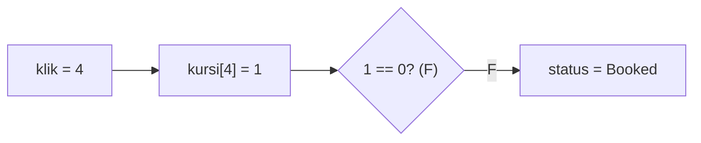
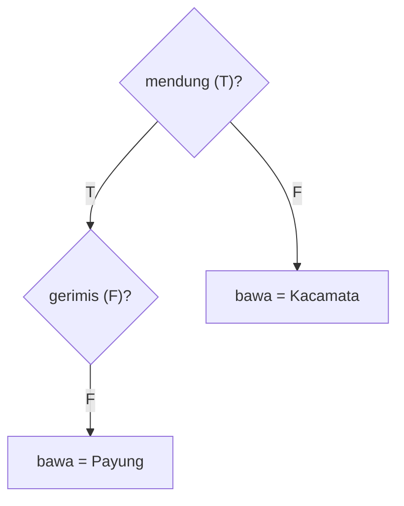
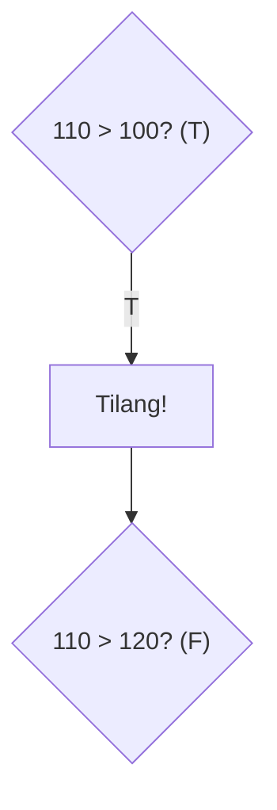
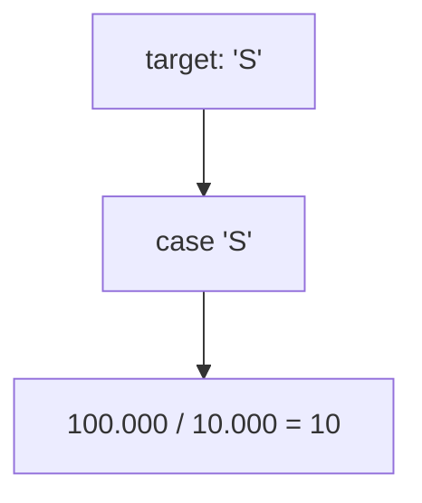
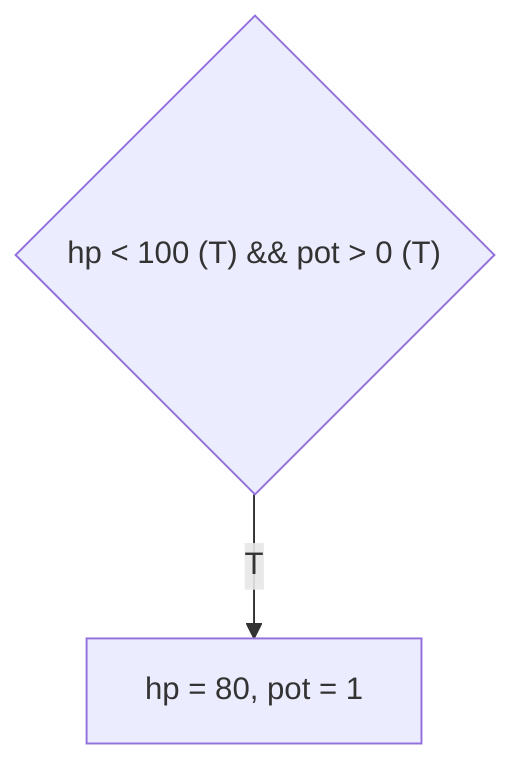
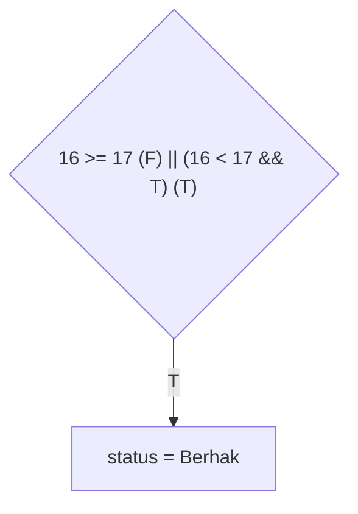
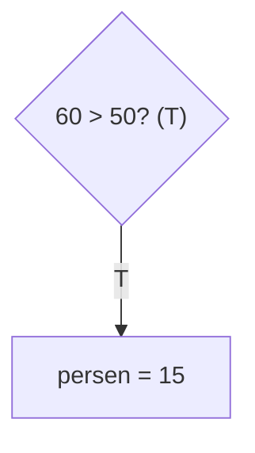
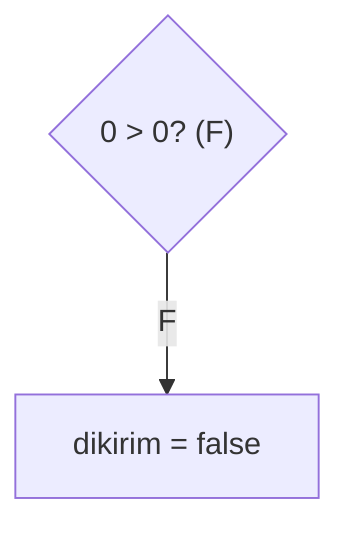
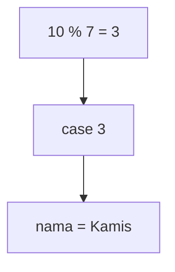
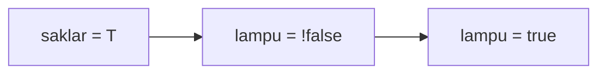

		🔙 **[Kembali ke Daftar Soal](./README.md)**

---

# Latihan Soal Part C - Modul 02 - Set 04 (Premium Edition)

---

### Soal 31: Kursi Bioskop (Availability Check)
```cpp
// Skenario: Klik kursi (0=Kosong, 1=Terisi)
int kursi[10] = {0, 1, 0, 0, 1, 0, 0, 0, 1, 1};
int klik = 4;
string status = "Booked";

if (kursi[klik] == 0) {
    status = "Available";
}
```
**Pertanyaan:**
1. Berapakah nilai `status` akhir? 
2. Apa yang terjadi jika `klik = 1`?

<details>
<summary><b>Klik untuk Lihat Jawaban & Diagnosis</b></summary>

**Mermaid Flowchart:**


**Jawaban:**
1. **"Booked"** (Karena `kursi[4]` adalah 1)
2. **"Booked"** (Karena `kursi[1]` juga adalah 1)
</details>

---

### Soal 32: Bawa Payung (Complex Weather)
```cpp
bool mendung = true;
bool gerimis = false;
string bawa = "Kacamata";

if (mendung) {
    if (gerimis) bawa = "Jas Hujan";
    else bawa = "Payung";
}
```
**Pertanyaan:**
1. Berapakah nilai `bawa`?
2. Kapan `bawa` akan tetap bernilai "Kacamata"?

<details>
<summary><b>Klik untuk Lihat Jawaban & Diagnosis</b></summary>

**Mermaid Flowchart:**


**Jawaban:**
1. **"Payung"**
2. **Saat `mendung = false`.**
</details>

---

### Soal 33: Tilang Elektronik (Speed Limit)
```cpp
int speed = 110;
int limit = 100;

if (speed > limit) {
    // Kena tilang
    if (speed > 120) {
        // Denda maksimal
    }
}
```
**Pertanyaan:**
1. Apakah program masuk ke "Kena tilang"?
2. Apakah program masuk ke "Denda maksimal"?

<details>
<summary><b>Klik untuk Lihat Jawaban & Diagnosis</b></summary>

**Mermaid Flowchart:**


**Jawaban:**
1. **Ya.** (110 > 100)
2. **Tidak.** (110 < 120)
</details>

---

### Soal 34: Tukar Uang (Switch Currency)
```cpp
char target = 'S'; // Singapore Dollar
int idr = 100000;
int hasil = 0;

switch(target) {
    case 'S': hasil = idr / 10000; break;
    case 'U': hasil = idr / 15000; break;
    default: hasil = 0;
}
```
**Pertanyaan:**
1. Berapakah nilai `hasil`?
2. Mengapa tidak ada desimal di variabel `hasil`?

<details>
<summary><b>Klik untuk Lihat Jawaban & Diagnosis</b></summary>

**Mermaid Flowchart:**


**Jawaban:**
1. **10**
2. Karena `hasil` bertipe `int` (pembagian integer membuang koma).
</details>

---

### Soal 35: Game RPG (Potion Logic)
```cpp
int hp = 50, max_hp = 100, pot = 2;

if (hp < max_hp && pot > 0) {
    hp += 30;
    pot--;
}
```
**Pertanyaan:**
1. Berapakah nilai `hp` akhir?
2. Berapakah nilai `pot` akhir?

<details>
<summary><b>Klik untuk Lihat Jawaban & Diagnosis</b></summary>

**Mermaid Flowchart:**


**Jawaban:**
1. **80**
2. **1**
</details>

---

### Soal 36: Hak Pilih (Eligibility Check)
```cpp
int umur = 16;
bool punya_ktp = true;
string status = "Belum Berhak";

if (umur >= 17 || (umur < 17 && punya_ktp)) {
    // Syarat fiktif: Jika < 17 tapi punya KTP tetap boleh
    status = "Berhak";
}
```
**Pertanyaan:**
1. Berapakah nilai `status` akhir?
2. Jika `punya_ktp = false`, berapakah nilai `status`?

<details>
<summary><b>Klik untuk Lihat Jawaban & Diagnosis</b></summary>

**Mermaid Flowchart:**


**Jawaban:**
1. **"Berhak"**
2. **"Belum Berhak"**
</details>

---

### Soal 37: Pajak Penghasilan (Simplified Bracket)
```cpp
int gaji = 60; // dalam juta
int persen = 5;

if (gaji > 50) {
    persen = 15;
}
```
**Pertanyaan:**
1. Berapakah nilai `persen` akhir?
2. Berapa persen jika `gaji = 50`?

<details>
<summary><b>Klik untuk Lihat Jawaban & Diagnosis</b></summary>

**Mermaid Flowchart:**


**Jawaban:**
1. **15**
2. **5** (Karena syaratnya `> 50`, bukan `>= 50`).
</details>

---

### Soal 38: Cek Laporan (String Length Simulation)
```cpp
int len = 0;
bool dikirim = false;

if (len > 0) {
    dikirim = true;
}
```
**Pertanyaan:**
1. Berapakah nilai `dikirim` (true/false)?
2. Kenapa laporan kosong tidak boleh dikirim (secara logika kode)?

<details>
<summary><b>Klik untuk Lihat Jawaban & Diagnosis</b></summary>

**Mermaid Flowchart:**


**Jawaban:**
1. **false** (0)
2. Karena syarat `len > 0` bernilai salah.
</details>

---

### Soal 39: Prediksi Hari (Modulo Switch)
```cpp
// 0: Senin, 1: Selasa, ... 6: Minggu
int hari_ke = 10; 
int target = hari_ke % 7;
string nama = "";

switch(target) {
    case 0: nama = "Senin"; break;
    case 1: nama = "Selasa"; break;
    case 2: nama = "Rabu"; break;
    case 3: nama = "Kamis"; break;
    default: nama = "Libur";
}
```
**Pertanyaan:**
1. Berapakah nilai `target`?
2. Apakah `nama` bernilai "Rabu"?

<details>
<summary><b>Klik untuk Lihat Jawaban & Diagnosis</b></summary>

**Mermaid Flowchart:**


**Jawaban:**
1. **3**
2. **Tidak.** Nama bernilai "Kamis".
</details>

---

### Soal 40: Saklar Lampu (Toggle Logic)
```cpp
bool lampu = false;
bool saklar_diklik = true;

if (saklar_diklik) {
    lampu = !lampu;
}
```
**Pertanyaan:**
1. Berapakah nilai `lampu` akhir?
2. Apa yang terjadi jika `saklar_diklik` dilakukan 2 kali?

<details>
<summary><b>Klik untuk Lihat Jawaban & Diagnosis</b></summary>

**Mermaid Flowchart:**


**Jawaban:**
1. **true** (Menyala)
2. **Mati kembali** (False).
</details>
