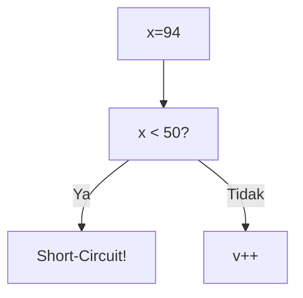
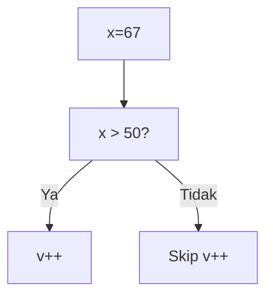
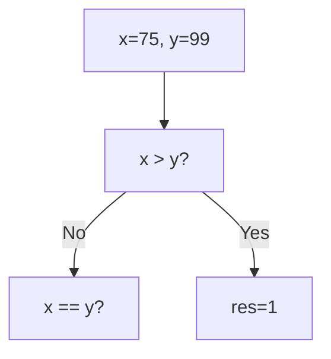
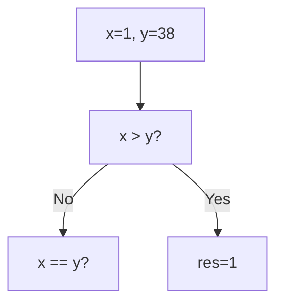
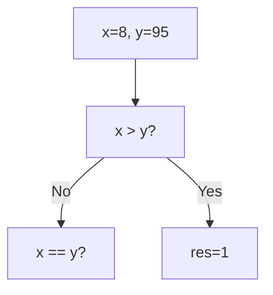
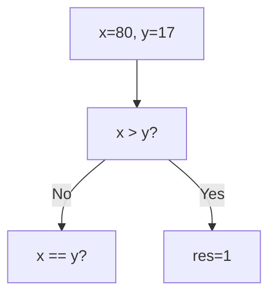

🔙 **[Kembali ke Daftar Soal](./README.md)**

---

# Latihan Soal Part C - Modul 02 - Set 04

### Soal 76
```cpp
int x = 6, v = 0;
if (x < 50 || ++v > 0) { x = 0; }
```
**Pertanyaan:**
1. Berapakah hasil akhirnya?
2. Mengapa demikian?

**Jawaban & Diagnosis:**
1. **v=0**
2. Lihat Tracing.

**Mermaid Flowchart:**


**📖 Penjelasan:**
**Langkah Tracing:**
1. x=6. Cek x < 50.
2. Jika Ya, syarat kedua di-skip (v=0). Jika Tidak, v++ (v=1).
3. Nilai v akhir: 0.

---
### Soal 77
```cpp
int x = 35, v = 0;
if (x > 50 && ++v > 0) { x = 100; }
```
**Pertanyaan:**
1. Berapakah hasil akhirnya?
2. Mengapa demikian?

**Jawaban & Diagnosis:**
1. **v=0, x=35**
2. Lihat Tracing.

**Mermaid Flowchart:**


**📖 Penjelasan:**
**Langkah Tracing:**
1. x=35. Cek x > 50.
2. Jika Ya, v naik jadi 1. Jika Tidak, v tetap 0 (Short-circuit).
3. Nilai v akhir: 0.

---
### Soal 78
```cpp
int x = 54, v = 0;
if (x < 50 || ++v > 0) { x = 0; }
```
**Pertanyaan:**
1. Berapakah hasil akhirnya?
2. Mengapa demikian?

**Jawaban & Diagnosis:**
1. **v=1**
2. Lihat Tracing.

**Mermaid Flowchart:**


**📖 Penjelasan:**
**Langkah Tracing:**
1. x=54. Cek x < 50.
2. Jika Ya, syarat kedua di-skip (v=0). Jika Tidak, v++ (v=1).
3. Nilai v akhir: 1.

---
### Soal 79
```cpp
int x = 94, v = 0;
if (x < 50 || ++v > 0) { x = 0; }
```
**Pertanyaan:**
1. Berapakah hasil akhirnya?
2. Mengapa demikian?

**Jawaban & Diagnosis:**
1. **v=1**
2. Lihat Tracing.

**Mermaid Flowchart:**


**📖 Penjelasan:**
**Langkah Tracing:**
1. x=94. Cek x < 50.
2. Jika Ya, syarat kedua di-skip (v=0). Jika Tidak, v++ (v=1).
3. Nilai v akhir: 1.

---
### Soal 80
```cpp
int x = 67, v = 0;
if (x > 50 && ++v > 0) { x = 100; }
```
**Pertanyaan:**
1. Berapakah hasil akhirnya?
2. Mengapa demikian?

**Jawaban & Diagnosis:**
1. **v=1, x=100**
2. Lihat Tracing.

**Mermaid Flowchart:**


**📖 Penjelasan:**
**Langkah Tracing:**
1. x=67. Cek x > 50.
2. Jika Ya, v naik jadi 1. Jika Tidak, v tetap 0 (Short-circuit).
3. Nilai v akhir: 1.

---
### Soal 81
```cpp
int x = 83, v = 0;
if (x > 50 && ++v > 0) { x = 100; }
```
**Pertanyaan:**
1. Berapakah hasil akhirnya?
2. Mengapa demikian?

**Jawaban & Diagnosis:**
1. **v=1, x=100**
2. Lihat Tracing.

**Mermaid Flowchart:**


**📖 Penjelasan:**
**Langkah Tracing:**
1. x=83. Cek x > 50.
2. Jika Ya, v naik jadi 1. Jika Tidak, v tetap 0 (Short-circuit).
3. Nilai v akhir: 1.

---
### Soal 82
```cpp
int x=75, y=99;
if (x > y) res = 1;
else if (x == y) res = 0;
else res = -1;
```
**Pertanyaan:**
1. Berapakah hasil akhirnya?
2. Mengapa demikian?

**Jawaban & Diagnosis:**
1. **-1**
2. Lihat Tracing.

**Mermaid Flowchart:**


**📖 Penjelasan:**
**Langkah Tracing:**
1. Bandingkan 75 dan 99.
2. Hasil: -1.

---
### Soal 83
```cpp
int x = 77, v = 0;
if (x > 50 && ++v > 0) { x = 100; }
```
**Pertanyaan:**
1. Berapakah hasil akhirnya?
2. Mengapa demikian?

**Jawaban & Diagnosis:**
1. **v=1, x=100**
2. Lihat Tracing.

**Mermaid Flowchart:**


**📖 Penjelasan:**
**Langkah Tracing:**
1. x=77. Cek x > 50.
2. Jika Ya, v naik jadi 1. Jika Tidak, v tetap 0 (Short-circuit).
3. Nilai v akhir: 1.

---
### Soal 84
```cpp
int x=1, y=38;
if (x > y) res = 1;
else if (x == y) res = 0;
else res = -1;
```
**Pertanyaan:**
1. Berapakah hasil akhirnya?
2. Mengapa demikian?

**Jawaban & Diagnosis:**
1. **-1**
2. Lihat Tracing.

**Mermaid Flowchart:**


**📖 Penjelasan:**
**Langkah Tracing:**
1. Bandingkan 1 dan 38.
2. Hasil: -1.

---
### Soal 85
```cpp
int x=41, y=8;
if (x > y) res = 1;
else if (x == y) res = 0;
else res = -1;
```
**Pertanyaan:**
1. Berapakah hasil akhirnya?
2. Mengapa demikian?

**Jawaban & Diagnosis:**
1. **1**
2. Lihat Tracing.

**Mermaid Flowchart:**


**📖 Penjelasan:**
**Langkah Tracing:**
1. Bandingkan 41 dan 8.
2. Hasil: 1.

---
### Soal 86
```cpp
int x=8, y=95;
if (x > y) res = 1;
else if (x == y) res = 0;
else res = -1;
```
**Pertanyaan:**
1. Berapakah hasil akhirnya?
2. Mengapa demikian?

**Jawaban & Diagnosis:**
1. **-1**
2. Lihat Tracing.

**Mermaid Flowchart:**


**📖 Penjelasan:**
**Langkah Tracing:**
1. Bandingkan 8 dan 95.
2. Hasil: -1.

---
### Soal 87
```cpp
int x=80, y=17;
if (x > y) res = 1;
else if (x == y) res = 0;
else res = -1;
```
**Pertanyaan:**
1. Berapakah hasil akhirnya?
2. Mengapa demikian?

**Jawaban & Diagnosis:**
1. **1**
2. Lihat Tracing.

**Mermaid Flowchart:**


**📖 Penjelasan:**
**Langkah Tracing:**
1. Bandingkan 80 dan 17.
2. Hasil: 1.

---
### Soal 88
```cpp
int x = 86, v = 0;
if (x > 50 && ++v > 0) { x = 100; }
```
**Pertanyaan:**
1. Berapakah hasil akhirnya?
2. Mengapa demikian?

**Jawaban & Diagnosis:**
1. **v=1, x=100**
2. Lihat Tracing.

**Mermaid Flowchart:**


**📖 Penjelasan:**
**Langkah Tracing:**
1. x=86. Cek x > 50.
2. Jika Ya, v naik jadi 1. Jika Tidak, v tetap 0 (Short-circuit).
3. Nilai v akhir: 1.

---
### Soal 89
```cpp
int x = 70, v = 0;
if (x < 50 || ++v > 0) { x = 0; }
```
**Pertanyaan:**
1. Berapakah hasil akhirnya?
2. Mengapa demikian?

**Jawaban & Diagnosis:**
1. **v=1**
2. Lihat Tracing.

**Mermaid Flowchart:**


**📖 Penjelasan:**
**Langkah Tracing:**
1. x=70. Cek x < 50.
2. Jika Ya, syarat kedua di-skip (v=0). Jika Tidak, v++ (v=1).
3. Nilai v akhir: 1.

---
### Soal 90
```cpp
int x = 22, v = 0;
if (x > 50 && ++v > 0) { x = 100; }
```
**Pertanyaan:**
1. Berapakah hasil akhirnya?
2. Mengapa demikian?

**Jawaban & Diagnosis:**
1. **v=0, x=22**
2. Lihat Tracing.

**Mermaid Flowchart:**


**📖 Penjelasan:**
**Langkah Tracing:**
1. x=22. Cek x > 50.
2. Jika Ya, v naik jadi 1. Jika Tidak, v tetap 0 (Short-circuit).
3. Nilai v akhir: 0.

---
### Soal 91
```cpp
int x = 70, v = 0;
if (x < 50 || ++v > 0) { x = 0; }
```
**Pertanyaan:**
1. Berapakah hasil akhirnya?
2. Mengapa demikian?

**Jawaban & Diagnosis:**
1. **v=1**
2. Lihat Tracing.

**Mermaid Flowchart:**


**📖 Penjelasan:**
**Langkah Tracing:**
1. x=70. Cek x < 50.
2. Jika Ya, syarat kedua di-skip (v=0). Jika Tidak, v++ (v=1).
3. Nilai v akhir: 1.

---
### Soal 92
```cpp
int x=46, y=38;
if (x > y) res = 1;
else if (x == y) res = 0;
else res = -1;
```
**Pertanyaan:**
1. Berapakah hasil akhirnya?
2. Mengapa demikian?

**Jawaban & Diagnosis:**
1. **1**
2. Lihat Tracing.

**Mermaid Flowchart:**


**📖 Penjelasan:**
**Langkah Tracing:**
1. Bandingkan 46 dan 38.
2. Hasil: 1.

---
### Soal 93
```cpp
int x = 57, v = 0;
if (x > 50 && ++v > 0) { x = 100; }
```
**Pertanyaan:**
1. Berapakah hasil akhirnya?
2. Mengapa demikian?

**Jawaban & Diagnosis:**
1. **v=1, x=100**
2. Lihat Tracing.

**Mermaid Flowchart:**


**📖 Penjelasan:**
**Langkah Tracing:**
1. x=57. Cek x > 50.
2. Jika Ya, v naik jadi 1. Jika Tidak, v tetap 0 (Short-circuit).
3. Nilai v akhir: 1.

---
### Soal 94
```cpp
int x=49, y=45;
if (x > y) res = 1;
else if (x == y) res = 0;
else res = -1;
```
**Pertanyaan:**
1. Berapakah hasil akhirnya?
2. Mengapa demikian?

**Jawaban & Diagnosis:**
1. **1**
2. Lihat Tracing.

**Mermaid Flowchart:**


**📖 Penjelasan:**
**Langkah Tracing:**
1. Bandingkan 49 dan 45.
2. Hasil: 1.

---
### Soal 95
```cpp
int x = 84, v = 0;
if (x < 50 || ++v > 0) { x = 0; }
```
**Pertanyaan:**
1. Berapakah hasil akhirnya?
2. Mengapa demikian?

**Jawaban & Diagnosis:**
1. **v=1**
2. Lihat Tracing.

**Mermaid Flowchart:**


**📖 Penjelasan:**
**Langkah Tracing:**
1. x=84. Cek x < 50.
2. Jika Ya, syarat kedua di-skip (v=0). Jika Tidak, v++ (v=1).
3. Nilai v akhir: 1.

---
### Soal 96
```cpp
int x = 25, v = 0;
if (x < 50 || ++v > 0) { x = 0; }
```
**Pertanyaan:**
1. Berapakah hasil akhirnya?
2. Mengapa demikian?

**Jawaban & Diagnosis:**
1. **v=0**
2. Lihat Tracing.

**Mermaid Flowchart:**
```mermaid
graph TD
A["x=25"] --> B["x < 50?"]
B -- Ya --> C["Short-Circuit!"]
B -- Tidak --> D["v++"]
```

**📖 Penjelasan:**
**Langkah Tracing:**
1. x=25. Cek x < 50.
2. Jika Ya, syarat kedua di-skip (v=0). Jika Tidak, v++ (v=1).
3. Nilai v akhir: 0.

---
### Soal 97
```cpp
int x = 99, v = 0;
if (x < 50 || ++v > 0) { x = 0; }
```
**Pertanyaan:**
1. Berapakah hasil akhirnya?
2. Mengapa demikian?

**Jawaban & Diagnosis:**
1. **v=1**
2. Lihat Tracing.

**Mermaid Flowchart:**
```mermaid
graph TD
A["x=99"] --> B["x < 50?"]
B -- Ya --> C["Short-Circuit!"]
B -- Tidak --> D["v++"]
```

**📖 Penjelasan:**
**Langkah Tracing:**
1. x=99. Cek x < 50.
2. Jika Ya, syarat kedua di-skip (v=0). Jika Tidak, v++ (v=1).
3. Nilai v akhir: 1.

---
### Soal 98
```cpp
int x = 78, v = 0;
if (x < 50 || ++v > 0) { x = 0; }
```
**Pertanyaan:**
1. Berapakah hasil akhirnya?
2. Mengapa demikian?

**Jawaban & Diagnosis:**
1. **v=1**
2. Lihat Tracing.

**Mermaid Flowchart:**
```mermaid
graph TD
A["x=78"] --> B["x < 50?"]
B -- Ya --> C["Short-Circuit!"]
B -- Tidak --> D["v++"]
```

**📖 Penjelasan:**
**Langkah Tracing:**
1. x=78. Cek x < 50.
2. Jika Ya, syarat kedua di-skip (v=0). Jika Tidak, v++ (v=1).
3. Nilai v akhir: 1.

---
### Soal 99
```cpp
int x = 59, v = 0;
if (x < 50 || ++v > 0) { x = 0; }
```
**Pertanyaan:**
1. Berapakah hasil akhirnya?
2. Mengapa demikian?

**Jawaban & Diagnosis:**
1. **v=1**
2. Lihat Tracing.

**Mermaid Flowchart:**
```mermaid
graph TD
A["x=59"] --> B["x < 50?"]
B -- Ya --> C["Short-Circuit!"]
B -- Tidak --> D["v++"]
```

**📖 Penjelasan:**
**Langkah Tracing:**
1. x=59. Cek x < 50.
2. Jika Ya, syarat kedua di-skip (v=0). Jika Tidak, v++ (v=1).
3. Nilai v akhir: 1.

---
### Soal 100
```cpp
int x = 3, v = 0;
if (x > 50 && ++v > 0) { x = 100; }
```
**Pertanyaan:**
1. Berapakah hasil akhirnya?
2. Mengapa demikian?

**Jawaban & Diagnosis:**
1. **v=0, x=3**
2. Lihat Tracing.

**Mermaid Flowchart:**
```mermaid
graph TD
A["x=3"] --> B["x > 50?"]
B -- Ya --> C["v++"]
B -- Tidak --> D["Skip v++"]
```

**📖 Penjelasan:**
**Langkah Tracing:**
1. x=3. Cek x > 50.
2. Jika Ya, v naik jadi 1. Jika Tidak, v tetap 0 (Short-circuit).
3. Nilai v akhir: 0.

---
