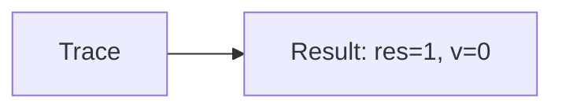
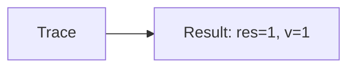

🔙 **[Kembali ke Daftar Soal](./README.md)**

---

# Latihan Soal Part C - Modul 02 - Set 04

### Soal 76
```cpp
// Bintang: Short-Circuit OR
int bintang = 36, v = 0;
if (bintang < 50 || ++v > 0) res = 1;
else res = 0;
```
**Pertanyaan:**
1. Berapakah hasil akhirnya?
2. Deskripsikan alur pikir 'Compiler Manusia' untuk soal ini!

**Jawaban & Diagnosis:**
1. **res=1, v=0**
2. Bintang 36 < 50? Ya (v=0).

**Mermaid Flowchart:**


---
### Soal 77
```cpp
// Planet: Short-Circuit AND
int planet = 56, v = 0;
if (planet > 50 && ++v > 0) res = 1;
else res = 0;
```
**Pertanyaan:**
1. Berapakah hasil akhirnya?
2. Deskripsikan alur pikir 'Compiler Manusia' untuk soal ini!

**Jawaban & Diagnosis:**
1. **res=1, v=1**
2. Planet 56 > 50? Ya (v naik).

**Mermaid Flowchart:**


---
### Soal 78
```cpp
// Bulan: Short-Circuit OR
int bulan = 86, v = 0;
if (bulan < 50 || ++v > 0) res = 1;
else res = 0;
```
**Pertanyaan:**
1. Berapakah hasil akhirnya?
2. Deskripsikan alur pikir 'Compiler Manusia' untuk soal ini!

**Jawaban & Diagnosis:**
1. **res=1, v=1**
2. Bulan 86 < 50? Tidak (v naik).

**Mermaid Flowchart:**


---
### Soal 79
```cpp
// Matahari: Short-Circuit AND
int matahari = 61, v = 0;
if (matahari > 50 && ++v > 0) res = 1;
else res = 0;
```
**Pertanyaan:**
1. Berapakah hasil akhirnya?
2. Deskripsikan alur pikir 'Compiler Manusia' untuk soal ini!

**Jawaban & Diagnosis:**
1. **res=1, v=1**
2. Matahari 61 > 50? Ya (v naik).

**Mermaid Flowchart:**


---
### Soal 80
```cpp
// Langit: Short-Circuit OR
int langit = 81, v = 0;
if (langit < 50 || ++v > 0) res = 1;
else res = 0;
```
**Pertanyaan:**
1. Berapakah hasil akhirnya?
2. Deskripsikan alur pikir 'Compiler Manusia' untuk soal ini!

**Jawaban & Diagnosis:**
1. **res=1, v=1**
2. Langit 81 < 50? Tidak (v naik).

**Mermaid Flowchart:**


---
### Soal 81
```cpp
// Awan: Short-Circuit AND
int awan = 14, v = 0;
if (awan > 50 && ++v > 0) res = 1;
else res = 0;
```
**Pertanyaan:**
1. Berapakah hasil akhirnya?
2. Deskripsikan alur pikir 'Compiler Manusia' untuk soal ini!

**Jawaban & Diagnosis:**
1. **res=0, v=0**
2. Awan 14 > 50? Tidak (v=0).

**Mermaid Flowchart:**


---
### Soal 82
```cpp
// Hujan: Short-Circuit OR
int hujan = 27, v = 0;
if (hujan < 50 || ++v > 0) res = 1;
else res = 0;
```
**Pertanyaan:**
1. Berapakah hasil akhirnya?
2. Deskripsikan alur pikir 'Compiler Manusia' untuk soal ini!

**Jawaban & Diagnosis:**
1. **res=1, v=0**
2. Hujan 27 < 50? Ya (v=0).

**Mermaid Flowchart:**


---
### Soal 83
```cpp
// Angin: Short-Circuit AND
int angin = 33, v = 0;
if (angin > 50 && ++v > 0) res = 1;
else res = 0;
```
**Pertanyaan:**
1. Berapakah hasil akhirnya?
2. Deskripsikan alur pikir 'Compiler Manusia' untuk soal ini!

**Jawaban & Diagnosis:**
1. **res=0, v=0**
2. Angin 33 > 50? Tidak (v=0).

**Mermaid Flowchart:**


---
### Soal 84
```cpp
// Petir: Short-Circuit OR
int petir = 65, v = 0;
if (petir < 50 || ++v > 0) res = 1;
else res = 0;
```
**Pertanyaan:**
1. Berapakah hasil akhirnya?
2. Deskripsikan alur pikir 'Compiler Manusia' untuk soal ini!

**Jawaban & Diagnosis:**
1. **res=1, v=1**
2. Petir 65 < 50? Tidak (v naik).

**Mermaid Flowchart:**


---
### Soal 85
```cpp
// Salju: Short-Circuit AND
int salju = 91, v = 0;
if (salju > 50 && ++v > 0) res = 1;
else res = 0;
```
**Pertanyaan:**
1. Berapakah hasil akhirnya?
2. Deskripsikan alur pikir 'Compiler Manusia' untuk soal ini!

**Jawaban & Diagnosis:**
1. **res=1, v=1**
2. Salju 91 > 50? Ya (v naik).

**Mermaid Flowchart:**


---
### Soal 86
```cpp
// Es: Short-Circuit OR
int es = 33, v = 0;
if (es < 50 || ++v > 0) res = 1;
else res = 0;
```
**Pertanyaan:**
1. Berapakah hasil akhirnya?
2. Deskripsikan alur pikir 'Compiler Manusia' untuk soal ini!

**Jawaban & Diagnosis:**
1. **res=1, v=0**
2. Es 33 < 50? Ya (v=0).

**Mermaid Flowchart:**


---
### Soal 87
```cpp
// Api: Short-Circuit AND
int api = 18, v = 0;
if (api > 50 && ++v > 0) res = 1;
else res = 0;
```
**Pertanyaan:**
1. Berapakah hasil akhirnya?
2. Deskripsikan alur pikir 'Compiler Manusia' untuk soal ini!

**Jawaban & Diagnosis:**
1. **res=0, v=0**
2. Api 18 > 50? Tidak (v=0).

**Mermaid Flowchart:**


---
### Soal 88
```cpp
// Asap: Short-Circuit OR
int asap = 80, v = 0;
if (asap < 50 || ++v > 0) res = 1;
else res = 0;
```
**Pertanyaan:**
1. Berapakah hasil akhirnya?
2. Deskripsikan alur pikir 'Compiler Manusia' untuk soal ini!

**Jawaban & Diagnosis:**
1. **res=1, v=1**
2. Asap 80 < 50? Tidak (v naik).

**Mermaid Flowchart:**


---
### Soal 89
```cpp
// Debu: Short-Circuit AND
int debu = 43, v = 0;
if (debu > 50 && ++v > 0) res = 1;
else res = 0;
```
**Pertanyaan:**
1. Berapakah hasil akhirnya?
2. Deskripsikan alur pikir 'Compiler Manusia' untuk soal ini!

**Jawaban & Diagnosis:**
1. **res=0, v=0**
2. Debu 43 > 50? Tidak (v=0).

**Mermaid Flowchart:**


---
### Soal 90
```cpp
// Polusi: Short-Circuit OR
int polusi = 93, v = 0;
if (polusi < 50 || ++v > 0) res = 1;
else res = 0;
```
**Pertanyaan:**
1. Berapakah hasil akhirnya?
2. Deskripsikan alur pikir 'Compiler Manusia' untuk soal ini!

**Jawaban & Diagnosis:**
1. **res=1, v=1**
2. Polusi 93 < 50? Tidak (v naik).

**Mermaid Flowchart:**


---
### Soal 91
```cpp
// Sampah: Short-Circuit AND
int sampah = 82, v = 0;
if (sampah > 50 && ++v > 0) res = 1;
else res = 0;
```
**Pertanyaan:**
1. Berapakah hasil akhirnya?
2. Deskripsikan alur pikir 'Compiler Manusia' untuk soal ini!

**Jawaban & Diagnosis:**
1. **res=1, v=1**
2. Sampah 82 > 50? Ya (v naik).

**Mermaid Flowchart:**


---
### Soal 92
```cpp
// DaurUlang: Short-Circuit OR
int daurulang = 35, v = 0;
if (daurulang < 50 || ++v > 0) res = 1;
else res = 0;
```
**Pertanyaan:**
1. Berapakah hasil akhirnya?
2. Deskripsikan alur pikir 'Compiler Manusia' untuk soal ini!

**Jawaban & Diagnosis:**
1. **res=1, v=0**
2. DaurUlang 35 < 50? Ya (v=0).

**Mermaid Flowchart:**


---
### Soal 93
```cpp
// Plastik: Short-Circuit AND
int plastik = 62, v = 0;
if (plastik > 50 && ++v > 0) res = 1;
else res = 0;
```
**Pertanyaan:**
1. Berapakah hasil akhirnya?
2. Deskripsikan alur pikir 'Compiler Manusia' untuk soal ini!

**Jawaban & Diagnosis:**
1. **res=1, v=1**
2. Plastik 62 > 50? Ya (v naik).

**Mermaid Flowchart:**


---
### Soal 94
```cpp
// Kaca: Short-Circuit OR
int kaca = 13, v = 0;
if (kaca < 50 || ++v > 0) res = 1;
else res = 0;
```
**Pertanyaan:**
1. Berapakah hasil akhirnya?
2. Deskripsikan alur pikir 'Compiler Manusia' untuk soal ini!

**Jawaban & Diagnosis:**
1. **res=1, v=0**
2. Kaca 13 < 50? Ya (v=0).

**Mermaid Flowchart:**


---
### Soal 95
```cpp
// Logam: Short-Circuit AND
int logam = 69, v = 0;
if (logam > 50 && ++v > 0) res = 1;
else res = 0;
```
**Pertanyaan:**
1. Berapakah hasil akhirnya?
2. Deskripsikan alur pikir 'Compiler Manusia' untuk soal ini!

**Jawaban & Diagnosis:**
1. **res=1, v=1**
2. Logam 69 > 50? Ya (v naik).

**Mermaid Flowchart:**


---
### Soal 96
```cpp
// Kayu: Short-Circuit OR
int kayu = 99, v = 0;
if (kayu < 50 || ++v > 0) res = 1;
else res = 0;
```
**Pertanyaan:**
1. Berapakah hasil akhirnya?
2. Deskripsikan alur pikir 'Compiler Manusia' untuk soal ini!

**Jawaban & Diagnosis:**
1. **res=1, v=1**
2. Kayu 99 < 50? Tidak (v naik).

**Mermaid Flowchart:**
```mermaid
graph LR
A[Trace] --> B[Result: res=1, v=1]
```

---
### Soal 97
```cpp
// Kertas: Short-Circuit AND
int kertas = 32, v = 0;
if (kertas > 50 && ++v > 0) res = 1;
else res = 0;
```
**Pertanyaan:**
1. Berapakah hasil akhirnya?
2. Deskripsikan alur pikir 'Compiler Manusia' untuk soal ini!

**Jawaban & Diagnosis:**
1. **res=0, v=0**
2. Kertas 32 > 50? Tidak (v=0).

**Mermaid Flowchart:**
```mermaid
graph LR
A[Trace] --> B[Result: res=0, v=0]
```

---
### Soal 98
```cpp
// Razia: Short-Circuit OR
int razia = 67, v = 0;
if (razia < 50 || ++v > 0) res = 1;
else res = 0;
```
**Pertanyaan:**
1. Berapakah hasil akhirnya?
2. Deskripsikan alur pikir 'Compiler Manusia' untuk soal ini!

**Jawaban & Diagnosis:**
1. **res=1, v=1**
2. Razia 67 < 50? Tidak (v naik).

**Mermaid Flowchart:**
```mermaid
graph LR
A[Trace] --> B[Result: res=1, v=1]
```

---
### Soal 99
```cpp
// Ujian: Short-Circuit AND
int ujian = 45, v = 0;
if (ujian > 50 && ++v > 0) res = 1;
else res = 0;
```
**Pertanyaan:**
1. Berapakah hasil akhirnya?
2. Deskripsikan alur pikir 'Compiler Manusia' untuk soal ini!

**Jawaban & Diagnosis:**
1. **res=0, v=0**
2. Ujian 45 > 50? Tidak (v=0).

**Mermaid Flowchart:**
```mermaid
graph LR
A[Trace] --> B[Result: res=0, v=0]
```

---
### Soal 100
```cpp
// Promo: Short-Circuit OR
int promo = 63, v = 0;
if (promo < 50 || ++v > 0) res = 1;
else res = 0;
```
**Pertanyaan:**
1. Berapakah hasil akhirnya?
2. Deskripsikan alur pikir 'Compiler Manusia' untuk soal ini!

**Jawaban & Diagnosis:**
1. **res=1, v=1**
2. Promo 63 < 50? Tidak (v naik).

**Mermaid Flowchart:**
```mermaid
graph LR
A[Trace] --> B[Result: res=1, v=1]
```

---
