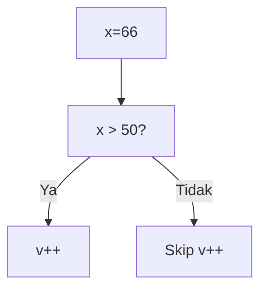
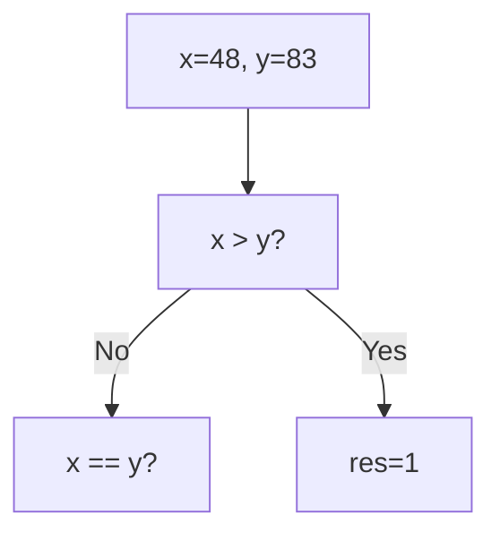
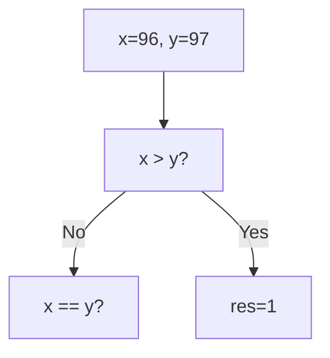
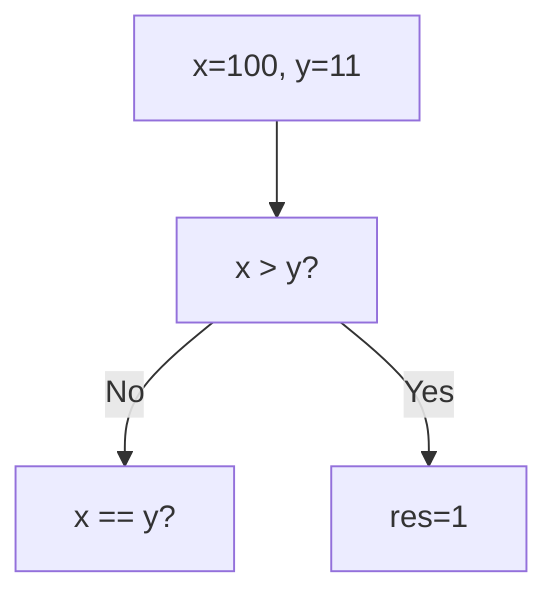
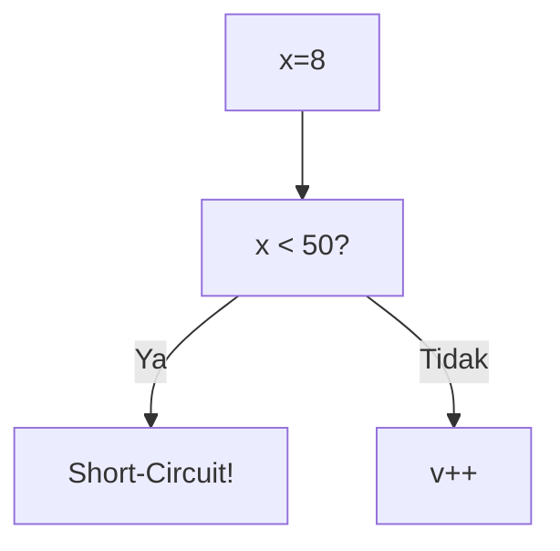
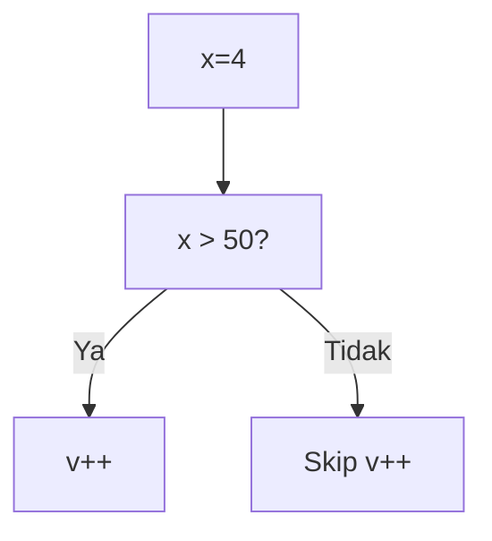

🔙 **[Kembali ke Daftar Soal](./README.md)**

---

# Latihan Soal Part C - Modul 02 - Set 05

### Soal 101
```cpp
int x = 66, v = 0;
if (x > 50 && ++v > 0) { x = 100; }
```
**Pertanyaan:**
1. Berapakah hasil akhirnya?
2. Mengapa demikian?

**Jawaban & Diagnosis:**
1. **v=1, x=100**
2. Lihat Tracing.

**Mermaid Flowchart:**


**📖 Penjelasan:**
**Langkah Tracing:**
1. x=66. Cek x > 50.
2. Jika Ya, v naik jadi 1. Jika Tidak, v tetap 0 (Short-circuit).
3. Nilai v akhir: 1.

---
### Soal 102
```cpp
int x = 65, v = 0;
if (x > 50 && ++v > 0) { x = 100; }
```
**Pertanyaan:**
1. Berapakah hasil akhirnya?
2. Mengapa demikian?

**Jawaban & Diagnosis:**
1. **v=1, x=100**
2. Lihat Tracing.

**Mermaid Flowchart:**


**📖 Penjelasan:**
**Langkah Tracing:**
1. x=65. Cek x > 50.
2. Jika Ya, v naik jadi 1. Jika Tidak, v tetap 0 (Short-circuit).
3. Nilai v akhir: 1.

---
### Soal 103
```cpp
int x=48, y=83;
if (x > y) res = 1;
else if (x == y) res = 0;
else res = -1;
```
**Pertanyaan:**
1. Berapakah hasil akhirnya?
2. Mengapa demikian?

**Jawaban & Diagnosis:**
1. **-1**
2. Lihat Tracing.

**Mermaid Flowchart:**


**📖 Penjelasan:**
**Langkah Tracing:**
1. Bandingkan 48 dan 83.
2. Hasil: -1.

---
### Soal 104
```cpp
int x=96, y=97;
if (x > y) res = 1;
else if (x == y) res = 0;
else res = -1;
```
**Pertanyaan:**
1. Berapakah hasil akhirnya?
2. Mengapa demikian?

**Jawaban & Diagnosis:**
1. **-1**
2. Lihat Tracing.

**Mermaid Flowchart:**


**📖 Penjelasan:**
**Langkah Tracing:**
1. Bandingkan 96 dan 97.
2. Hasil: -1.

---
### Soal 105
```cpp
int x=100, y=11;
if (x > y) res = 1;
else if (x == y) res = 0;
else res = -1;
```
**Pertanyaan:**
1. Berapakah hasil akhirnya?
2. Mengapa demikian?

**Jawaban & Diagnosis:**
1. **1**
2. Lihat Tracing.

**Mermaid Flowchart:**


**📖 Penjelasan:**
**Langkah Tracing:**
1. Bandingkan 100 dan 11.
2. Hasil: 1.

---
### Soal 106
```cpp
int x = 8, v = 0;
if (x < 50 || ++v > 0) { x = 0; }
```
**Pertanyaan:**
1. Berapakah hasil akhirnya?
2. Mengapa demikian?

**Jawaban & Diagnosis:**
1. **v=0**
2. Lihat Tracing.

**Mermaid Flowchart:**


**📖 Penjelasan:**
**Langkah Tracing:**
1. x=8. Cek x < 50.
2. Jika Ya, syarat kedua di-skip (v=0). Jika Tidak, v++ (v=1).
3. Nilai v akhir: 0.

---
### Soal 107
```cpp
int x = 33, v = 0;
if (x < 50 || ++v > 0) { x = 0; }
```
**Pertanyaan:**
1. Berapakah hasil akhirnya?
2. Mengapa demikian?

**Jawaban & Diagnosis:**
1. **v=0**
2. Lihat Tracing.

**Mermaid Flowchart:**


**📖 Penjelasan:**
**Langkah Tracing:**
1. x=33. Cek x < 50.
2. Jika Ya, syarat kedua di-skip (v=0). Jika Tidak, v++ (v=1).
3. Nilai v akhir: 0.

---
### Soal 108
```cpp
int x = 3, v = 0;
if (x < 50 || ++v > 0) { x = 0; }
```
**Pertanyaan:**
1. Berapakah hasil akhirnya?
2. Mengapa demikian?

**Jawaban & Diagnosis:**
1. **v=0**
2. Lihat Tracing.

**Mermaid Flowchart:**


**📖 Penjelasan:**
**Langkah Tracing:**
1. x=3. Cek x < 50.
2. Jika Ya, syarat kedua di-skip (v=0). Jika Tidak, v++ (v=1).
3. Nilai v akhir: 0.

---
### Soal 109
```cpp
int x = 14, v = 0;
if (x > 50 && ++v > 0) { x = 100; }
```
**Pertanyaan:**
1. Berapakah hasil akhirnya?
2. Mengapa demikian?

**Jawaban & Diagnosis:**
1. **v=0, x=14**
2. Lihat Tracing.

**Mermaid Flowchart:**


**📖 Penjelasan:**
**Langkah Tracing:**
1. x=14. Cek x > 50.
2. Jika Ya, v naik jadi 1. Jika Tidak, v tetap 0 (Short-circuit).
3. Nilai v akhir: 0.

---
### Soal 110
```cpp
int x = 81, v = 0;
if (x > 50 && ++v > 0) { x = 100; }
```
**Pertanyaan:**
1. Berapakah hasil akhirnya?
2. Mengapa demikian?

**Jawaban & Diagnosis:**
1. **v=1, x=100**
2. Lihat Tracing.

**Mermaid Flowchart:**


**📖 Penjelasan:**
**Langkah Tracing:**
1. x=81. Cek x > 50.
2. Jika Ya, v naik jadi 1. Jika Tidak, v tetap 0 (Short-circuit).
3. Nilai v akhir: 1.

---
### Soal 111
```cpp
int x = 19, v = 0;
if (x < 50 || ++v > 0) { x = 0; }
```
**Pertanyaan:**
1. Berapakah hasil akhirnya?
2. Mengapa demikian?

**Jawaban & Diagnosis:**
1. **v=0**
2. Lihat Tracing.

**Mermaid Flowchart:**


**📖 Penjelasan:**
**Langkah Tracing:**
1. x=19. Cek x < 50.
2. Jika Ya, syarat kedua di-skip (v=0). Jika Tidak, v++ (v=1).
3. Nilai v akhir: 0.

---
### Soal 112
```cpp
int x = 52, v = 0;
if (x > 50 && ++v > 0) { x = 100; }
```
**Pertanyaan:**
1. Berapakah hasil akhirnya?
2. Mengapa demikian?

**Jawaban & Diagnosis:**
1. **v=1, x=100**
2. Lihat Tracing.

**Mermaid Flowchart:**


**📖 Penjelasan:**
**Langkah Tracing:**
1. x=52. Cek x > 50.
2. Jika Ya, v naik jadi 1. Jika Tidak, v tetap 0 (Short-circuit).
3. Nilai v akhir: 1.

---
### Soal 113
```cpp
int x = 4, v = 0;
if (x > 50 && ++v > 0) { x = 100; }
```
**Pertanyaan:**
1. Berapakah hasil akhirnya?
2. Mengapa demikian?

**Jawaban & Diagnosis:**
1. **v=0, x=4**
2. Lihat Tracing.

**Mermaid Flowchart:**


**📖 Penjelasan:**
**Langkah Tracing:**
1. x=4. Cek x > 50.
2. Jika Ya, v naik jadi 1. Jika Tidak, v tetap 0 (Short-circuit).
3. Nilai v akhir: 0.

---
### Soal 114
```cpp
int x = 17, v = 0;
if (x < 50 || ++v > 0) { x = 0; }
```
**Pertanyaan:**
1. Berapakah hasil akhirnya?
2. Mengapa demikian?

**Jawaban & Diagnosis:**
1. **v=0**
2. Lihat Tracing.

**Mermaid Flowchart:**


**📖 Penjelasan:**
**Langkah Tracing:**
1. x=17. Cek x < 50.
2. Jika Ya, syarat kedua di-skip (v=0). Jika Tidak, v++ (v=1).
3. Nilai v akhir: 0.

---
### Soal 115
```cpp
int x=41, y=20;
if (x > y) res = 1;
else if (x == y) res = 0;
else res = -1;
```
**Pertanyaan:**
1. Berapakah hasil akhirnya?
2. Mengapa demikian?

**Jawaban & Diagnosis:**
1. **1**
2. Lihat Tracing.

**Mermaid Flowchart:**


**📖 Penjelasan:**
**Langkah Tracing:**
1. Bandingkan 41 dan 20.
2. Hasil: 1.

---
### Soal 116
```cpp
int x = 16, v = 0;
if (x > 50 && ++v > 0) { x = 100; }
```
**Pertanyaan:**
1. Berapakah hasil akhirnya?
2. Mengapa demikian?

**Jawaban & Diagnosis:**
1. **v=0, x=16**
2. Lihat Tracing.

**Mermaid Flowchart:**


**📖 Penjelasan:**
**Langkah Tracing:**
1. x=16. Cek x > 50.
2. Jika Ya, v naik jadi 1. Jika Tidak, v tetap 0 (Short-circuit).
3. Nilai v akhir: 0.

---
### Soal 117
```cpp
int x = 32, v = 0;
if (x > 50 && ++v > 0) { x = 100; }
```
**Pertanyaan:**
1. Berapakah hasil akhirnya?
2. Mengapa demikian?

**Jawaban & Diagnosis:**
1. **v=0, x=32**
2. Lihat Tracing.

**Mermaid Flowchart:**


**📖 Penjelasan:**
**Langkah Tracing:**
1. x=32. Cek x > 50.
2. Jika Ya, v naik jadi 1. Jika Tidak, v tetap 0 (Short-circuit).
3. Nilai v akhir: 0.

---
### Soal 118
```cpp
int x = 52, v = 0;
if (x > 50 && ++v > 0) { x = 100; }
```
**Pertanyaan:**
1. Berapakah hasil akhirnya?
2. Mengapa demikian?

**Jawaban & Diagnosis:**
1. **v=1, x=100**
2. Lihat Tracing.

**Mermaid Flowchart:**


**📖 Penjelasan:**
**Langkah Tracing:**
1. x=52. Cek x > 50.
2. Jika Ya, v naik jadi 1. Jika Tidak, v tetap 0 (Short-circuit).
3. Nilai v akhir: 1.

---
### Soal 119
```cpp
int x = 64, v = 0;
if (x > 50 && ++v > 0) { x = 100; }
```
**Pertanyaan:**
1. Berapakah hasil akhirnya?
2. Mengapa demikian?

**Jawaban & Diagnosis:**
1. **v=1, x=100**
2. Lihat Tracing.

**Mermaid Flowchart:**


**📖 Penjelasan:**
**Langkah Tracing:**
1. x=64. Cek x > 50.
2. Jika Ya, v naik jadi 1. Jika Tidak, v tetap 0 (Short-circuit).
3. Nilai v akhir: 1.

---
### Soal 120
```cpp
int x = 84, v = 0;
if (x < 50 || ++v > 0) { x = 0; }
```
**Pertanyaan:**
1. Berapakah hasil akhirnya?
2. Mengapa demikian?

**Jawaban & Diagnosis:**
1. **v=1**
2. Lihat Tracing.

**Mermaid Flowchart:**


**📖 Penjelasan:**
**Langkah Tracing:**
1. x=84. Cek x < 50.
2. Jika Ya, syarat kedua di-skip (v=0). Jika Tidak, v++ (v=1).
3. Nilai v akhir: 1.

---
### Soal 121
```cpp
int x=31, y=99;
if (x > y) res = 1;
else if (x == y) res = 0;
else res = -1;
```
**Pertanyaan:**
1. Berapakah hasil akhirnya?
2. Mengapa demikian?

**Jawaban & Diagnosis:**
1. **-1**
2. Lihat Tracing.

**Mermaid Flowchart:**
```mermaid
graph TD
A["x=31, y=99"] --> B["x > y?"]
B -- No --> C["x == y?"]
B -- Yes --> D[res=1]
```

**📖 Penjelasan:**
**Langkah Tracing:**
1. Bandingkan 31 dan 99.
2. Hasil: -1.

---
### Soal 122
```cpp
int x = 96, v = 0;
if (x < 50 || ++v > 0) { x = 0; }
```
**Pertanyaan:**
1. Berapakah hasil akhirnya?
2. Mengapa demikian?

**Jawaban & Diagnosis:**
1. **v=1**
2. Lihat Tracing.

**Mermaid Flowchart:**
```mermaid
graph TD
A["x=96"] --> B["x < 50?"]
B -- Ya --> C["Short-Circuit!"]
B -- Tidak --> D["v++"]
```

**📖 Penjelasan:**
**Langkah Tracing:**
1. x=96. Cek x < 50.
2. Jika Ya, syarat kedua di-skip (v=0). Jika Tidak, v++ (v=1).
3. Nilai v akhir: 1.

---
### Soal 123
```cpp
int x=64, y=42;
if (x > y) res = 1;
else if (x == y) res = 0;
else res = -1;
```
**Pertanyaan:**
1. Berapakah hasil akhirnya?
2. Mengapa demikian?

**Jawaban & Diagnosis:**
1. **1**
2. Lihat Tracing.

**Mermaid Flowchart:**
```mermaid
graph TD
A["x=64, y=42"] --> B["x > y?"]
B -- No --> C["x == y?"]
B -- Yes --> D[res=1]
```

**📖 Penjelasan:**
**Langkah Tracing:**
1. Bandingkan 64 dan 42.
2. Hasil: 1.

---
### Soal 124
```cpp
int x=31, y=83;
if (x > y) res = 1;
else if (x == y) res = 0;
else res = -1;
```
**Pertanyaan:**
1. Berapakah hasil akhirnya?
2. Mengapa demikian?

**Jawaban & Diagnosis:**
1. **-1**
2. Lihat Tracing.

**Mermaid Flowchart:**
```mermaid
graph TD
A["x=31, y=83"] --> B["x > y?"]
B -- No --> C["x == y?"]
B -- Yes --> D[res=1]
```

**📖 Penjelasan:**
**Langkah Tracing:**
1. Bandingkan 31 dan 83.
2. Hasil: -1.

---
### Soal 125
```cpp
int x=13, y=74;
if (x > y) res = 1;
else if (x == y) res = 0;
else res = -1;
```
**Pertanyaan:**
1. Berapakah hasil akhirnya?
2. Mengapa demikian?

**Jawaban & Diagnosis:**
1. **-1**
2. Lihat Tracing.

**Mermaid Flowchart:**
```mermaid
graph TD
A["x=13, y=74"] --> B["x > y?"]
B -- No --> C["x == y?"]
B -- Yes --> D[res=1]
```

**📖 Penjelasan:**
**Langkah Tracing:**
1. Bandingkan 13 dan 74.
2. Hasil: -1.

---
