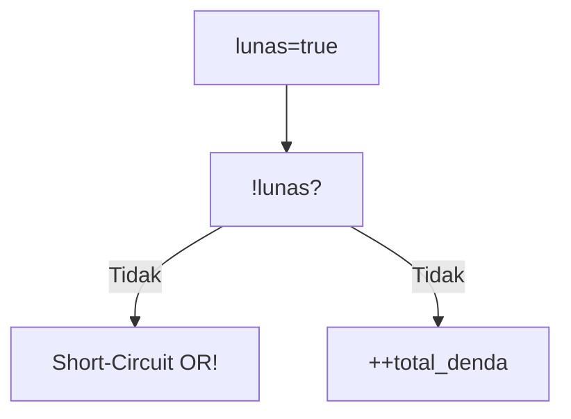
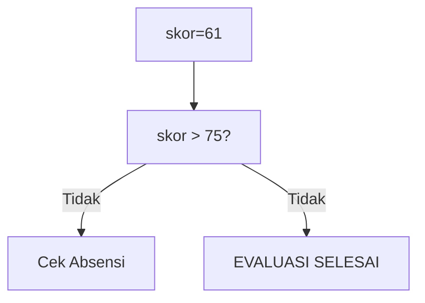
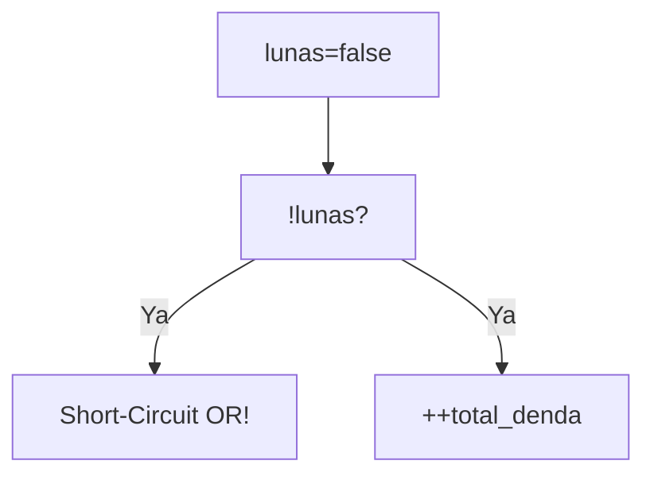
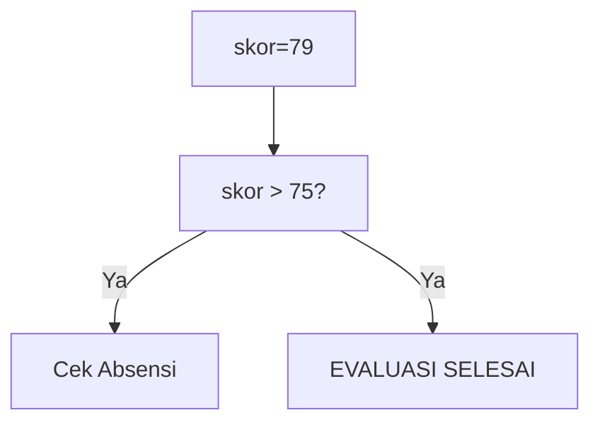
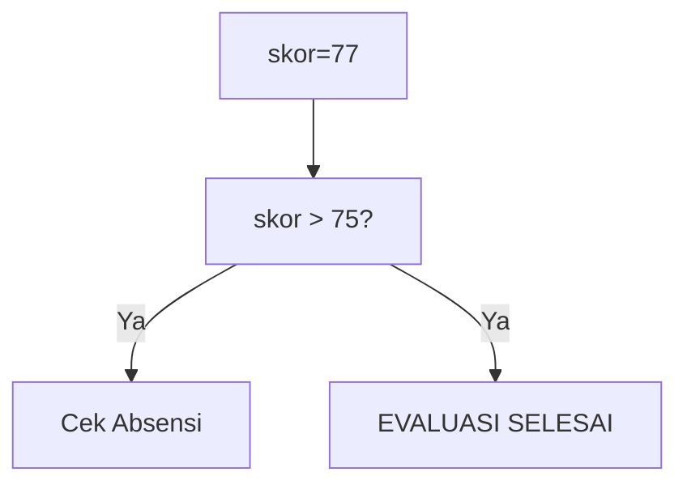

🔙 **[Kembali ke Daftar Soal](./README.md)**

---

# Latihan Soal Part C - Modul 02 - Set 05

### Soal 101
```cpp
bool lunas = true;
int total_denda = 0;
if (!lunas || ++total_denda > 5) status = 0;
```
**Pertanyaan:**
1. Berapakah hasil akhirnya?
2. Deskripsikan langkah robot compiler saat memproses kode ini!

**Jawaban & Diagnosis:**
1. **0**
2. Baca bagian 'Analisis Mendalam' di bawah.

**Mermaid Flowchart:**


**📖 Penjelasan Komprehensif:**
**Analisis Mendalam (Compiler Manusia):**
1. **Logika ||**: Operator OR mencari satu saja kebenaran. 
2. **Tracing**: `!lunas` bernilai False (SUDAH LUNAS).
3. **Dampak**: Karena False, mesin harus ngecek syarat kedua, denda naik jadi 1.
4. **Hasil**: `total_denda` = **0**.

---
### Soal 102
```cpp
int skor_siswa = 76, absensi = 85;
if (skor_siswa > 75 && absensi > 80) hasil = 1;
else hasil = 0;
```
**Pertanyaan:**
1. Berapakah hasil akhirnya?
2. Deskripsikan langkah robot compiler saat memproses kode ini!

**Jawaban & Diagnosis:**
1. **1**
2. Baca bagian 'Analisis Mendalam' di bawah.

**Mermaid Flowchart:**


**📖 Penjelasan Komprehensif:**
**Analisis Mendalam (Compiler Manusia):**
1. **Logika &&**: Syarat pertama adalah `skor_siswa > 75`. Karena nilaimu 76, statusnya LULUS.
2. **Short-Circuit**: Karena lulus syarat 1, mesin lanjut cek absensi.
3. **Hasil Akhir**: hasil = **1**.

---
### Soal 103
```cpp
int skor_siswa = 61, absensi = 85;
if (skor_siswa > 75 && absensi > 80) hasil = 1;
else hasil = 0;
```
**Pertanyaan:**
1. Berapakah hasil akhirnya?
2. Deskripsikan langkah robot compiler saat memproses kode ini!

**Jawaban & Diagnosis:**
1. **0**
2. Baca bagian 'Analisis Mendalam' di bawah.

**Mermaid Flowchart:**


**📖 Penjelasan Komprehensif:**
**Analisis Mendalam (Compiler Manusia):**
1. **Logika &&**: Syarat pertama adalah `skor_siswa > 75`. Karena nilaimu 61, statusnya GAGAL.
2. **Short-Circuit**: Karena sudah gagal di skor, mesin malas (short-circuit) dan tidak peduli absensi.
3. **Hasil Akhir**: hasil = **0**.

---
### Soal 104
```cpp
bool lunas = true;
int total_denda = 0;
if (!lunas || ++total_denda > 5) status = 0;
```
**Pertanyaan:**
1. Berapakah hasil akhirnya?
2. Deskripsikan langkah robot compiler saat memproses kode ini!

**Jawaban & Diagnosis:**
1. **0**
2. Baca bagian 'Analisis Mendalam' di bawah.

**Mermaid Flowchart:**


**📖 Penjelasan Komprehensif:**
**Analisis Mendalam (Compiler Manusia):**
1. **Logika ||**: Operator OR mencari satu saja kebenaran. 
2. **Tracing**: `!lunas` bernilai False (SUDAH LUNAS).
3. **Dampak**: Karena False, mesin harus ngecek syarat kedua, denda naik jadi 1.
4. **Hasil**: `total_denda` = **0**.

---
### Soal 105
```cpp
bool lunas = false;
int total_denda = 0;
if (!lunas || ++total_denda > 5) status = 0;
```
**Pertanyaan:**
1. Berapakah hasil akhirnya?
2. Deskripsikan langkah robot compiler saat memproses kode ini!

**Jawaban & Diagnosis:**
1. **1**
2. Baca bagian 'Analisis Mendalam' di bawah.

**Mermaid Flowchart:**


**📖 Penjelasan Komprehensif:**
**Analisis Mendalam (Compiler Manusia):**
1. **Logika ||**: Operator OR mencari satu saja kebenaran. 
2. **Tracing**: `!lunas` bernilai True (BELUM BAYAR).
3. **Dampak**: Karena sudah True, denda tidak dicek (denda tetap 0).
4. **Hasil**: `total_denda` = **1**.

---
### Soal 106
```cpp
bool lunas = false;
int total_denda = 0;
if (!lunas || ++total_denda > 5) status = 0;
```
**Pertanyaan:**
1. Berapakah hasil akhirnya?
2. Deskripsikan langkah robot compiler saat memproses kode ini!

**Jawaban & Diagnosis:**
1. **1**
2. Baca bagian 'Analisis Mendalam' di bawah.

**Mermaid Flowchart:**


**📖 Penjelasan Komprehensif:**
**Analisis Mendalam (Compiler Manusia):**
1. **Logika ||**: Operator OR mencari satu saja kebenaran. 
2. **Tracing**: `!lunas` bernilai True (BELUM BAYAR).
3. **Dampak**: Karena sudah True, denda tidak dicek (denda tetap 0).
4. **Hasil**: `total_denda` = **1**.

---
### Soal 107
```cpp
bool lunas = true;
int total_denda = 0;
if (!lunas || ++total_denda > 5) status = 0;
```
**Pertanyaan:**
1. Berapakah hasil akhirnya?
2. Deskripsikan langkah robot compiler saat memproses kode ini!

**Jawaban & Diagnosis:**
1. **0**
2. Baca bagian 'Analisis Mendalam' di bawah.

**Mermaid Flowchart:**


**📖 Penjelasan Komprehensif:**
**Analisis Mendalam (Compiler Manusia):**
1. **Logika ||**: Operator OR mencari satu saja kebenaran. 
2. **Tracing**: `!lunas` bernilai False (SUDAH LUNAS).
3. **Dampak**: Karena False, mesin harus ngecek syarat kedua, denda naik jadi 1.
4. **Hasil**: `total_denda` = **0**.

---
### Soal 108
```cpp
bool lunas = false;
int total_denda = 0;
if (!lunas || ++total_denda > 5) status = 0;
```
**Pertanyaan:**
1. Berapakah hasil akhirnya?
2. Deskripsikan langkah robot compiler saat memproses kode ini!

**Jawaban & Diagnosis:**
1. **1**
2. Baca bagian 'Analisis Mendalam' di bawah.

**Mermaid Flowchart:**


**📖 Penjelasan Komprehensif:**
**Analisis Mendalam (Compiler Manusia):**
1. **Logika ||**: Operator OR mencari satu saja kebenaran. 
2. **Tracing**: `!lunas` bernilai True (BELUM BAYAR).
3. **Dampak**: Karena sudah True, denda tidak dicek (denda tetap 0).
4. **Hasil**: `total_denda` = **1**.

---
### Soal 109
```cpp
bool lunas = false;
int total_denda = 0;
if (!lunas || ++total_denda > 5) status = 0;
```
**Pertanyaan:**
1. Berapakah hasil akhirnya?
2. Deskripsikan langkah robot compiler saat memproses kode ini!

**Jawaban & Diagnosis:**
1. **1**
2. Baca bagian 'Analisis Mendalam' di bawah.

**Mermaid Flowchart:**


**📖 Penjelasan Komprehensif:**
**Analisis Mendalam (Compiler Manusia):**
1. **Logika ||**: Operator OR mencari satu saja kebenaran. 
2. **Tracing**: `!lunas` bernilai True (BELUM BAYAR).
3. **Dampak**: Karena sudah True, denda tidak dicek (denda tetap 0).
4. **Hasil**: `total_denda` = **1**.

---
### Soal 110
```cpp
bool lunas = false;
int total_denda = 0;
if (!lunas || ++total_denda > 5) status = 0;
```
**Pertanyaan:**
1. Berapakah hasil akhirnya?
2. Deskripsikan langkah robot compiler saat memproses kode ini!

**Jawaban & Diagnosis:**
1. **1**
2. Baca bagian 'Analisis Mendalam' di bawah.

**Mermaid Flowchart:**


**📖 Penjelasan Komprehensif:**
**Analisis Mendalam (Compiler Manusia):**
1. **Logika ||**: Operator OR mencari satu saja kebenaran. 
2. **Tracing**: `!lunas` bernilai True (BELUM BAYAR).
3. **Dampak**: Karena sudah True, denda tidak dicek (denda tetap 0).
4. **Hasil**: `total_denda` = **1**.

---
### Soal 111
```cpp
int skor_siswa = 40, absensi = 85;
if (skor_siswa > 75 && absensi > 80) hasil = 1;
else hasil = 0;
```
**Pertanyaan:**
1. Berapakah hasil akhirnya?
2. Deskripsikan langkah robot compiler saat memproses kode ini!

**Jawaban & Diagnosis:**
1. **0**
2. Baca bagian 'Analisis Mendalam' di bawah.

**Mermaid Flowchart:**


**📖 Penjelasan Komprehensif:**
**Analisis Mendalam (Compiler Manusia):**
1. **Logika &&**: Syarat pertama adalah `skor_siswa > 75`. Karena nilaimu 40, statusnya GAGAL.
2. **Short-Circuit**: Karena sudah gagal di skor, mesin malas (short-circuit) dan tidak peduli absensi.
3. **Hasil Akhir**: hasil = **0**.

---
### Soal 112
```cpp
int skor_siswa = 79, absensi = 85;
if (skor_siswa > 75 && absensi > 80) hasil = 1;
else hasil = 0;
```
**Pertanyaan:**
1. Berapakah hasil akhirnya?
2. Deskripsikan langkah robot compiler saat memproses kode ini!

**Jawaban & Diagnosis:**
1. **1**
2. Baca bagian 'Analisis Mendalam' di bawah.

**Mermaid Flowchart:**


**📖 Penjelasan Komprehensif:**
**Analisis Mendalam (Compiler Manusia):**
1. **Logika &&**: Syarat pertama adalah `skor_siswa > 75`. Karena nilaimu 79, statusnya LULUS.
2. **Short-Circuit**: Karena lulus syarat 1, mesin lanjut cek absensi.
3. **Hasil Akhir**: hasil = **1**.

---
### Soal 113
```cpp
int skor_siswa = 48, absensi = 85;
if (skor_siswa > 75 && absensi > 80) hasil = 1;
else hasil = 0;
```
**Pertanyaan:**
1. Berapakah hasil akhirnya?
2. Deskripsikan langkah robot compiler saat memproses kode ini!

**Jawaban & Diagnosis:**
1. **0**
2. Baca bagian 'Analisis Mendalam' di bawah.

**Mermaid Flowchart:**


**📖 Penjelasan Komprehensif:**
**Analisis Mendalam (Compiler Manusia):**
1. **Logika &&**: Syarat pertama adalah `skor_siswa > 75`. Karena nilaimu 48, statusnya GAGAL.
2. **Short-Circuit**: Karena sudah gagal di skor, mesin malas (short-circuit) dan tidak peduli absensi.
3. **Hasil Akhir**: hasil = **0**.

---
### Soal 114
```cpp
int skor_siswa = 74, absensi = 85;
if (skor_siswa > 75 && absensi > 80) hasil = 1;
else hasil = 0;
```
**Pertanyaan:**
1. Berapakah hasil akhirnya?
2. Deskripsikan langkah robot compiler saat memproses kode ini!

**Jawaban & Diagnosis:**
1. **0**
2. Baca bagian 'Analisis Mendalam' di bawah.

**Mermaid Flowchart:**


**📖 Penjelasan Komprehensif:**
**Analisis Mendalam (Compiler Manusia):**
1. **Logika &&**: Syarat pertama adalah `skor_siswa > 75`. Karena nilaimu 74, statusnya GAGAL.
2. **Short-Circuit**: Karena sudah gagal di skor, mesin malas (short-circuit) dan tidak peduli absensi.
3. **Hasil Akhir**: hasil = **0**.

---
### Soal 115
```cpp
int skor_siswa = 49, absensi = 85;
if (skor_siswa > 75 && absensi > 80) hasil = 1;
else hasil = 0;
```
**Pertanyaan:**
1. Berapakah hasil akhirnya?
2. Deskripsikan langkah robot compiler saat memproses kode ini!

**Jawaban & Diagnosis:**
1. **0**
2. Baca bagian 'Analisis Mendalam' di bawah.

**Mermaid Flowchart:**


**📖 Penjelasan Komprehensif:**
**Analisis Mendalam (Compiler Manusia):**
1. **Logika &&**: Syarat pertama adalah `skor_siswa > 75`. Karena nilaimu 49, statusnya GAGAL.
2. **Short-Circuit**: Karena sudah gagal di skor, mesin malas (short-circuit) dan tidak peduli absensi.
3. **Hasil Akhir**: hasil = **0**.

---
### Soal 116
```cpp
bool lunas = false;
int total_denda = 0;
if (!lunas || ++total_denda > 5) status = 0;
```
**Pertanyaan:**
1. Berapakah hasil akhirnya?
2. Deskripsikan langkah robot compiler saat memproses kode ini!

**Jawaban & Diagnosis:**
1. **1**
2. Baca bagian 'Analisis Mendalam' di bawah.

**Mermaid Flowchart:**


**📖 Penjelasan Komprehensif:**
**Analisis Mendalam (Compiler Manusia):**
1. **Logika ||**: Operator OR mencari satu saja kebenaran. 
2. **Tracing**: `!lunas` bernilai True (BELUM BAYAR).
3. **Dampak**: Karena sudah True, denda tidak dicek (denda tetap 0).
4. **Hasil**: `total_denda` = **1**.

---
### Soal 117
```cpp
bool lunas = true;
int total_denda = 0;
if (!lunas || ++total_denda > 5) status = 0;
```
**Pertanyaan:**
1. Berapakah hasil akhirnya?
2. Deskripsikan langkah robot compiler saat memproses kode ini!

**Jawaban & Diagnosis:**
1. **0**
2. Baca bagian 'Analisis Mendalam' di bawah.

**Mermaid Flowchart:**


**📖 Penjelasan Komprehensif:**
**Analisis Mendalam (Compiler Manusia):**
1. **Logika ||**: Operator OR mencari satu saja kebenaran. 
2. **Tracing**: `!lunas` bernilai False (SUDAH LUNAS).
3. **Dampak**: Karena False, mesin harus ngecek syarat kedua, denda naik jadi 1.
4. **Hasil**: `total_denda` = **0**.

---
### Soal 118
```cpp
bool lunas = false;
int total_denda = 0;
if (!lunas || ++total_denda > 5) status = 0;
```
**Pertanyaan:**
1. Berapakah hasil akhirnya?
2. Deskripsikan langkah robot compiler saat memproses kode ini!

**Jawaban & Diagnosis:**
1. **1**
2. Baca bagian 'Analisis Mendalam' di bawah.

**Mermaid Flowchart:**


**📖 Penjelasan Komprehensif:**
**Analisis Mendalam (Compiler Manusia):**
1. **Logika ||**: Operator OR mencari satu saja kebenaran. 
2. **Tracing**: `!lunas` bernilai True (BELUM BAYAR).
3. **Dampak**: Karena sudah True, denda tidak dicek (denda tetap 0).
4. **Hasil**: `total_denda` = **1**.

---
### Soal 119
```cpp
int skor_siswa = 77, absensi = 85;
if (skor_siswa > 75 && absensi > 80) hasil = 1;
else hasil = 0;
```
**Pertanyaan:**
1. Berapakah hasil akhirnya?
2. Deskripsikan langkah robot compiler saat memproses kode ini!

**Jawaban & Diagnosis:**
1. **1**
2. Baca bagian 'Analisis Mendalam' di bawah.

**Mermaid Flowchart:**


**📖 Penjelasan Komprehensif:**
**Analisis Mendalam (Compiler Manusia):**
1. **Logika &&**: Syarat pertama adalah `skor_siswa > 75`. Karena nilaimu 77, statusnya LULUS.
2. **Short-Circuit**: Karena lulus syarat 1, mesin lanjut cek absensi.
3. **Hasil Akhir**: hasil = **1**.

---
### Soal 120
```cpp
int skor_siswa = 62, absensi = 85;
if (skor_siswa > 75 && absensi > 80) hasil = 1;
else hasil = 0;
```
**Pertanyaan:**
1. Berapakah hasil akhirnya?
2. Deskripsikan langkah robot compiler saat memproses kode ini!

**Jawaban & Diagnosis:**
1. **0**
2. Baca bagian 'Analisis Mendalam' di bawah.

**Mermaid Flowchart:**


**📖 Penjelasan Komprehensif:**
**Analisis Mendalam (Compiler Manusia):**
1. **Logika &&**: Syarat pertama adalah `skor_siswa > 75`. Karena nilaimu 62, statusnya GAGAL.
2. **Short-Circuit**: Karena sudah gagal di skor, mesin malas (short-circuit) dan tidak peduli absensi.
3. **Hasil Akhir**: hasil = **0**.

---
### Soal 121
```cpp
int skor_siswa = 84, absensi = 85;
if (skor_siswa > 75 && absensi > 80) hasil = 1;
else hasil = 0;
```
**Pertanyaan:**
1. Berapakah hasil akhirnya?
2. Deskripsikan langkah robot compiler saat memproses kode ini!

**Jawaban & Diagnosis:**
1. **1**
2. Baca bagian 'Analisis Mendalam' di bawah.

**Mermaid Flowchart:**
```mermaid
graph TD
A["skor=84"] --> B["skor > 75?"]
B -- Ya --> C["Cek Absensi"]
B -- Ya --> D["EVALUASI SELESAI"]
```

**📖 Penjelasan Komprehensif:**
**Analisis Mendalam (Compiler Manusia):**
1. **Logika &&**: Syarat pertama adalah `skor_siswa > 75`. Karena nilaimu 84, statusnya LULUS.
2. **Short-Circuit**: Karena lulus syarat 1, mesin lanjut cek absensi.
3. **Hasil Akhir**: hasil = **1**.

---
### Soal 122
```cpp
int skor_siswa = 90, absensi = 85;
if (skor_siswa > 75 && absensi > 80) hasil = 1;
else hasil = 0;
```
**Pertanyaan:**
1. Berapakah hasil akhirnya?
2. Deskripsikan langkah robot compiler saat memproses kode ini!

**Jawaban & Diagnosis:**
1. **1**
2. Baca bagian 'Analisis Mendalam' di bawah.

**Mermaid Flowchart:**
```mermaid
graph TD
A["skor=90"] --> B["skor > 75?"]
B -- Ya --> C["Cek Absensi"]
B -- Ya --> D["EVALUASI SELESAI"]
```

**📖 Penjelasan Komprehensif:**
**Analisis Mendalam (Compiler Manusia):**
1. **Logika &&**: Syarat pertama adalah `skor_siswa > 75`. Karena nilaimu 90, statusnya LULUS.
2. **Short-Circuit**: Karena lulus syarat 1, mesin lanjut cek absensi.
3. **Hasil Akhir**: hasil = **1**.

---
### Soal 123
```cpp
int skor_siswa = 85, absensi = 85;
if (skor_siswa > 75 && absensi > 80) hasil = 1;
else hasil = 0;
```
**Pertanyaan:**
1. Berapakah hasil akhirnya?
2. Deskripsikan langkah robot compiler saat memproses kode ini!

**Jawaban & Diagnosis:**
1. **1**
2. Baca bagian 'Analisis Mendalam' di bawah.

**Mermaid Flowchart:**
```mermaid
graph TD
A["skor=85"] --> B["skor > 75?"]
B -- Ya --> C["Cek Absensi"]
B -- Ya --> D["EVALUASI SELESAI"]
```

**📖 Penjelasan Komprehensif:**
**Analisis Mendalam (Compiler Manusia):**
1. **Logika &&**: Syarat pertama adalah `skor_siswa > 75`. Karena nilaimu 85, statusnya LULUS.
2. **Short-Circuit**: Karena lulus syarat 1, mesin lanjut cek absensi.
3. **Hasil Akhir**: hasil = **1**.

---
### Soal 124
```cpp
int skor_siswa = 54, absensi = 85;
if (skor_siswa > 75 && absensi > 80) hasil = 1;
else hasil = 0;
```
**Pertanyaan:**
1. Berapakah hasil akhirnya?
2. Deskripsikan langkah robot compiler saat memproses kode ini!

**Jawaban & Diagnosis:**
1. **0**
2. Baca bagian 'Analisis Mendalam' di bawah.

**Mermaid Flowchart:**
```mermaid
graph TD
A["skor=54"] --> B["skor > 75?"]
B -- Tidak --> C["Cek Absensi"]
B -- Tidak --> D["EVALUASI SELESAI"]
```

**📖 Penjelasan Komprehensif:**
**Analisis Mendalam (Compiler Manusia):**
1. **Logika &&**: Syarat pertama adalah `skor_siswa > 75`. Karena nilaimu 54, statusnya GAGAL.
2. **Short-Circuit**: Karena sudah gagal di skor, mesin malas (short-circuit) dan tidak peduli absensi.
3. **Hasil Akhir**: hasil = **0**.

---
### Soal 125
```cpp
bool lunas = false;
int total_denda = 0;
if (!lunas || ++total_denda > 5) status = 0;
```
**Pertanyaan:**
1. Berapakah hasil akhirnya?
2. Deskripsikan langkah robot compiler saat memproses kode ini!

**Jawaban & Diagnosis:**
1. **1**
2. Baca bagian 'Analisis Mendalam' di bawah.

**Mermaid Flowchart:**
```mermaid
graph TD
A["lunas=false"] --> B["!lunas?"]
B -- Ya --> C["Short-Circuit OR!"]
B -- Ya --> D["++total_denda"]
```

**📖 Penjelasan Komprehensif:**
**Analisis Mendalam (Compiler Manusia):**
1. **Logika ||**: Operator OR mencari satu saja kebenaran. 
2. **Tracing**: `!lunas` bernilai True (BELUM BAYAR).
3. **Dampak**: Karena sudah True, denda tidak dicek (denda tetap 0).
4. **Hasil**: `total_denda` = **1**.

---
