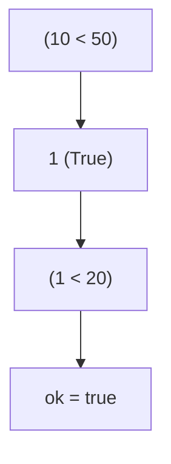
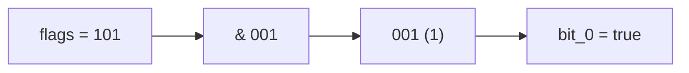
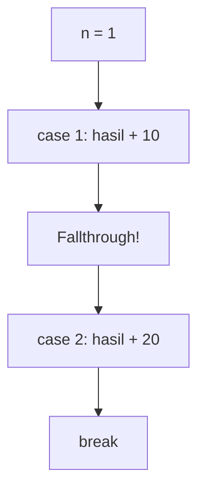
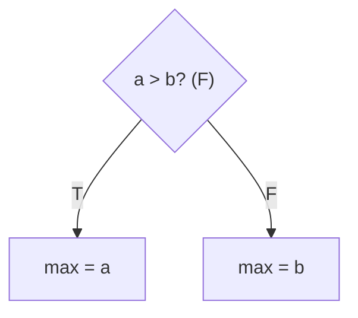
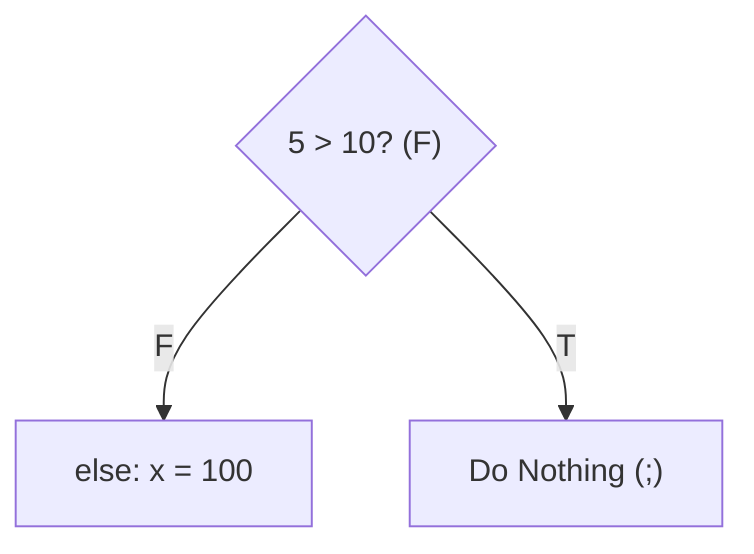
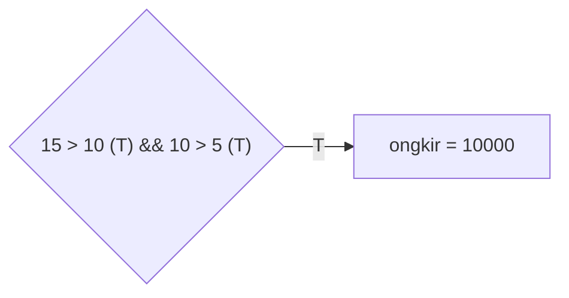
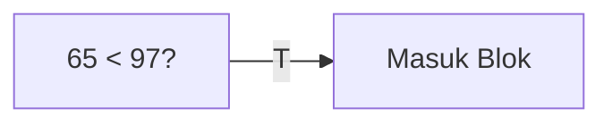
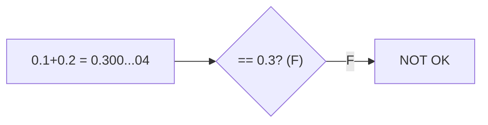
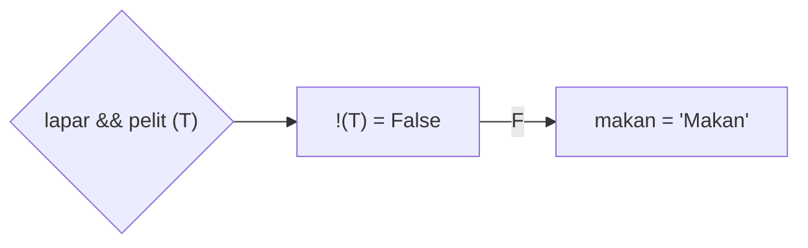
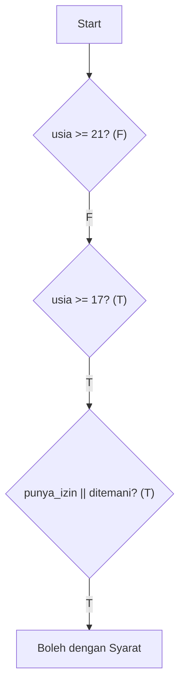

		🔙 **[Kembali ke Daftar Soal](./README.md)**

---

# Latihan Soal Part C - Modul 02 - Set 05 (Premium Edition)

---

### Soal 41: ⚠️ Jebakan Rentang (Range Trap)
```cpp
// Skenario: Ingin cek apakah x diantara 10 dan 20
int x = 50;
bool ok = false;

if (10 < x < 20) {
    ok = true;
}
```
**Pertanyaan:**
1. Berapakah nilai `ok` (true/false)?
2. Mengapa angka **50** bisa masuk ke dalam rentang tersebut dalam C++?

<details>
<summary><b>Klik untuk Lihat Jawaban & Diagnosis</b></summary>

**Mermaid Flowchart:**


**Jawaban:**
1. **true**
2. Karena C++ mengevaluasi secara berurutan: `(10 < 50)` bernilai **1** (true). Lalu `1 < 20` bernilai **true**.

**📖 Analisis Mendalam:**
Ini adalah jebakan maut! C++ tidak mengerti matematika rentang seperti `10 < x < 20`. Kamu harus menuliskannya sebagai `x > 10 && x < 20`. Di kode di atas, apapun nilai `x` yang lebih besar dari 10 akan menghasilkan `ok = true`.
</details>

---

### Soal 42: Flag Biner (Bitmask Shortcut)
```cpp
int flags = 5; // Biner: 101
bool bit_0 = false;

if (flags & 1) {
    bit_0 = true;
}
```
**Pertanyaan:**
1. Berapakah nilai `bit_0` (true/false)?
2. Apa guna operator `&` di dalam `if`?

<details>
<summary><b>Klik untuk Lihat Jawaban & Diagnosis</b></summary>

**Mermaid Flowchart:**


**Jawaban:**
1. **true**
2. Sebagai **Filter/Mask** untuk mengecek bit tertentu.

**📖 Analisis Mendalam:**
`5 & 1` $\rightarrow$ `101 & 001` $\rightarrow$ `001` (1). Karena hasilnya 1 (bukan nol), maka dianggap true oleh `if`.
</details>

---

### Soal 43: Switch Fallthrough (Missing Break)
```cpp
int n = 1;
int hasil = 0;

switch(n) {
    case 1: hasil += 10;
    case 2: hasil += 20; break;
    default: hasil += 30;
}
```
**Pertanyaan:**
1. Berapakah nilai `hasil`?
2. Kenapa `case 2` juga ikut dieksekusi?

<details>
<summary><b>Klik untuk Lihat Jawaban & Diagnosis</b></summary>

**Mermaid Flowchart:**


**Jawaban:**
1. **30** (10 + 20)
2. Karena tidak ada kata kunci `break;` di akhir `case 1`.

**📖 Analisis Mendalam:**
Inilah efek "terjun bebas" (*fallthrough*). Mesin akan mengeksekusi semua baris di bawahnya sampai bertemu `break` atau akhir blok `switch`.
</details>

---

### Soal 44: Ternary Operator Simulation (Conditional Expression)
```cpp
int a = 10, b = 20;
int max = (a > b) ? a : b;
```
**Pertanyaan:**
1. Berapakah nilai `max`?
2. Tunjukkan struktur `if-else` yang setara dengan satu baris di atas!

<details>
<summary><b>Klik untuk Lihat Jawaban & Diagnosis</b></summary>

**Mermaid Flowchart:**


**Jawaban:**
1. **20**
2. `if (a > b) max = a; else max = b;`
</details>

---

### Soal 45: Cabang Kosong (Empty Branch)
```cpp
int x = 5;
if (x > 10) ; 
else x = 100;
```
**Pertanyaan:**
1. Berapakah nilai `x` akhir?
2. Apa arti dari titik koma `;` setelah `if (x > 10)`?

<details>
<summary><b>Klik untuk Lihat Jawaban & Diagnosis</b></summary>

**Mermaid Flowchart:**


**Jawaban:**
1. **100**
2. Itu adalah **Null Statement**. Artinya "jika benar, jangan lakukan apa-apa".
</details>

---

### Soal 46: Ongkir Berlipat (And-Logic)
```cpp
int jarak = 15; // km
int berat = 10; // kg
int ongkir = 5000;

if (jarak > 10 && berat > 5) {
    ongkir *= 2;
}
```
**Pertanyaan:**
1. Berapakah nilai `ongkir`?
2. Jika `berat = 3`, berapakah `ongkir`?

<details>
<summary><b>Klik untuk Lihat Jawaban & Diagnosis</b></summary>

**Mermaid Flowchart:**


**Jawaban:**
1. **10000**
2. **5000**
</details>

---

### Soal 47: Adu ASCII (Char Compare)
```cpp
if ('A' < 'a') {
    // Masuk blok
}
```
**Pertanyaan:**
1. Apakah program masuk ke dalam blok `if`?
2. Mana yang nilainya lebih besar: Huruf besar atau Huruf kecil?

<details>
<summary><b>Klik untuk Lihat Jawaban & Diagnosis</b></summary>

**Mermaid Flowchart:**


**Jawaban:**
1. **Ya.** (65 < 97)
2. **Huruf kecil** bernilai lebih besar di tabel ASCII.
</details>

---

### Soal 48: Double Equality (Precision Trap)
```cpp
double x = 0.1 + 0.2;
if (x == 0.3) {
    // OK
} else {
    // NOT OK
}
```
**Pertanyaan:**
1. Blok mana yang dieksekusi?
2. Mengapa menjumlahkan `0.1 + 0.2` tidak menghasilkan `0.3` yang pas di memori?

<details>
<summary><b>Klik untuk Lihat Jawaban & Diagnosis</b></summary>

**Mermaid Flowchart:**


**Jawaban:**
1. **NOT OK**
2. Karena ada *Floating Point Inaccuracy*.
</details>

---

### Soal 49: Hukum De Morgan (Not Both)
```cpp
bool lapar = true;
bool pelit = true;
string makan = "Makan";

if (!(lapar && pelit)) {
    makan = "Lapar tapi tidak pelit";
}
```
**Pertanyaan:**
1. Berapakah nilai `makan` akhir?
2. Apa maksud dari `!(A && B)` secara logika bahasa?

<details>
<summary><b>Klik untuk Lihat Jawaban & Diagnosis</b></summary>

**Mermaid Flowchart:**


**Jawaban:**
1. **"Makan"** (Nilai awal tidak berubah)
2. **"Tidak benar bahwa (Lapar DAN Pelit)"**.
</details>

---

### Soal 50: Grand Final (Eligibility Flowchart)
```cpp
int usia = 18;
bool punya_izin = false;
bool ditemani_ortu = true;
string hasil = "Dilarang";

if (usia >= 21) {
    hasil = "Boleh";
} else if (usia >= 17) {
    if (punya_izin || ditemani_ortu) {
        hasil = "Boleh dengan Syarat";
    }
}
```
**Pertanyaan:**
1. Berapakah nilai `hasil`?
2. Jika `usia = 15`, apakah ia bisa "Boleh dengan Syarat"?

<details>
<summary><b>Klik untuk Lihat Jawaban & Diagnosis</b></summary>

**Mermaid Flowchart:**


**Jawaban:**
1. **"Boleh dengan Syarat"**
2. **Tidak.** Karena ia akan langsung gagal di syarat `else if (usia >= 17)`.
</details>
