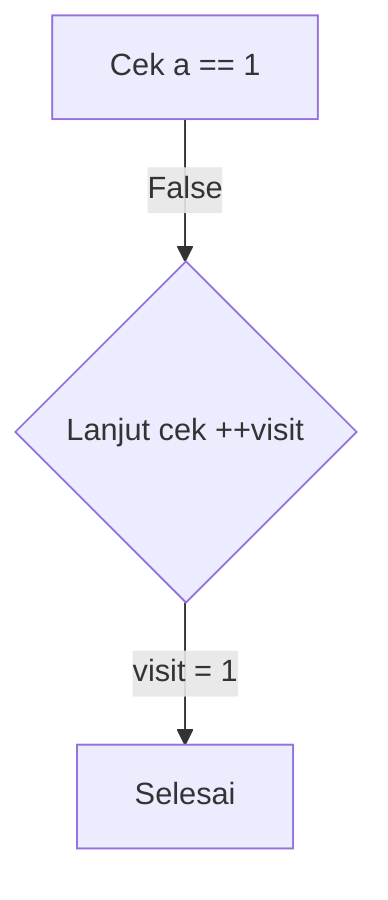
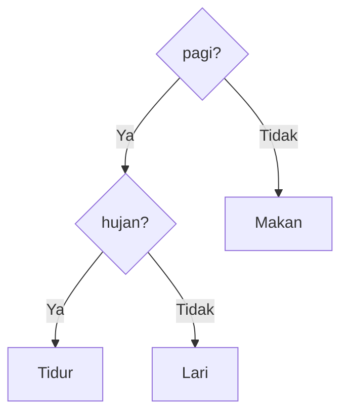
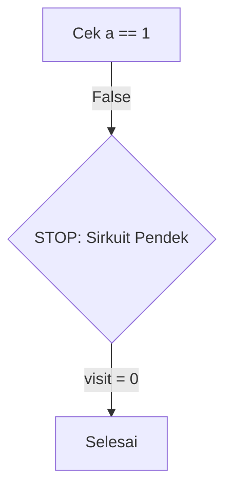
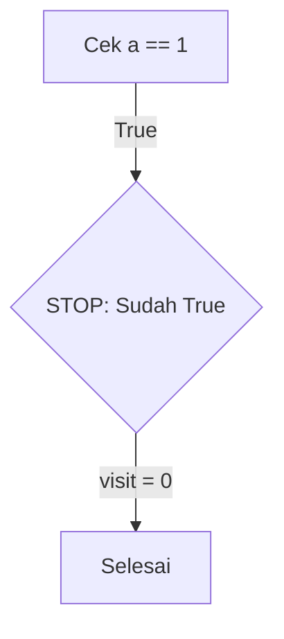
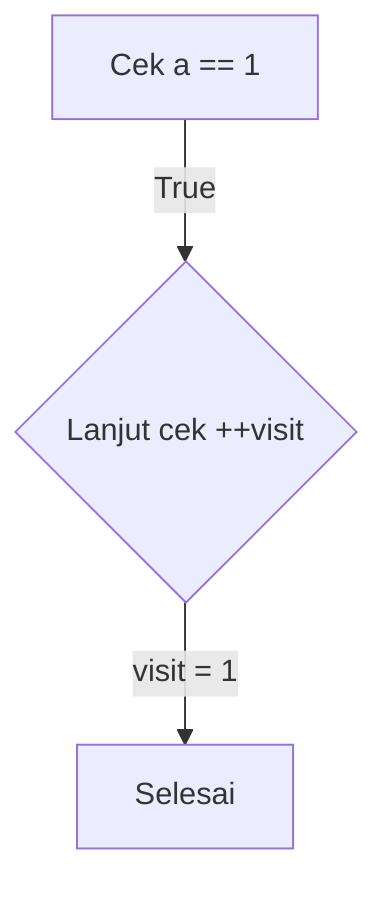
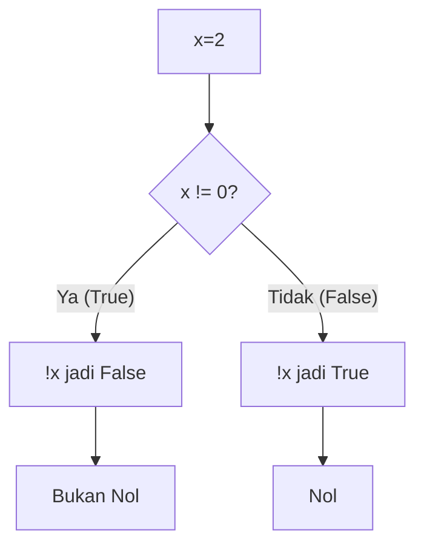

# Latihan Soal Part C - Modul 02 - Set 05

### Soal 101 (Boolean Logic Flip)
```cpp
int x = -6;
if (!x) printf("Nol");
else printf("Bukan Nol");
```
**Pertanyaan:**
1. Berapakah nilai `x`?
2. Apa output program tersebut?
3. Dalam C++, angka berapakah yang dianggap sebagai `false`?

**Jawaban & Diagnosis:**
1. **-6**
2. **Bukan Nol**
3. **Hanya angka 0. Selebihnya (positif maupun negatif) dianggap `true`.**

**Mermaid Flowchart:**


**📖 Cara Membaca Diagram:**
x=-6. Syarat `!x` (NOT x). Jika x=-6 (bukan 0), maka x dianggap true, !x jadi false. Maka cetak 'Bukan Nol'.

---
### Soal 102 (Short-Circuit OR)
```cpp
int a = 0;
int visit = 0;
if (a == 1 || ++visit > 0) { /* logic */ }
```
**Pertanyaan:**
1. Apakah kondisi `a == 1` bernilai benar?
2. Berapakah nilai akhir variabel `visit`?
3. Apa yang terjadi pada `++visit` jika `a` bernilai 1?

**Jawaban & Diagnosis:**
1. **Salah**
2. **1**
3. **Jika `a == 1` (True), maka syarat kedua tidak akan pernah dibaca (Short-Circuit OR).**

**Mermaid Flowchart:**


**📖 Cara Membaca Diagram:**
a=0. Cek `a == 1`. Hasil: False. Karena False, baru lanjut cek ++visit. visit jadi 1.

---
### Soal 103 (Nested If-Else)
```cpp
bool pagi = true;
bool hujan = true;
if (pagi) {
    if (hujan) printf("Tidur");
    else printf("Lari");
} else {
    printf("Makan");
}
```
**Pertanyaan:**
1. Apa output yang muncul di layar?
2. Jika `pagi` false, apakah kondisi `hujan` akan dicek?
3. Berapa jumlah total blok `printf` yang ada dalam kode ini?

**Jawaban & Diagnosis:**
1. **Tidur**
2. **Tidak, karena mesin langsung masuk ke blok `else` terluar.**
3. **3**

**Mermaid Flowchart:**


**📖 Cara Membaca Diagram:**
Pagi=1, Hujan=1. Masuk blok if(pagi). Cek hujan: Tidur.

---
### Soal 104 (Short-Circuit AND)
```cpp
int a = 0; int b = 0;
int visit = 0;
if (a == 1 && ++visit > 0) { /* visited */ }
// Note: ++visit adds 1 to visit
```
**Pertanyaan:**
1. Apakah kondisi `a == 1` bernilai true?
2. Berapakah nilai akhir variabel `visit`?
3. Mengapa `visit` bisa tetap bernilai 0 meskipun ada perintah `++visit`?

**Jawaban & Diagnosis:**
1. **Tidak**
2. **0**
3. **Karena sifat Short-Circuit AND: Jika syarat pertama sudah FALSE, C++ malas dan tidak akan mengecek/mengeksekusi syarat kedua.**

**Mermaid Flowchart:**


**📖 Cara Membaca Diagram:**
a=0. Cek `a == 1`. Hasil: False. Karena False, syarat kedua (++visit) DIABAIKAN. visit tetap 0.

---
### Soal 105 (Nested If-Else)
```cpp
bool pagi = false;
bool hujan = true;
if (pagi) {
    if (hujan) printf("Tidur");
    else printf("Lari");
} else {
    printf("Makan");
}
```
**Pertanyaan:**
1. Apa output yang muncul di layar?
2. Jika `pagi` false, apakah kondisi `hujan` akan dicek?
3. Berapa jumlah total blok `printf` yang ada dalam kode ini?

**Jawaban & Diagnosis:**
1. **Makan**
2. **Tidak, karena mesin langsung masuk ke blok `else` terluar.**
3. **3**

**Mermaid Flowchart:**


**📖 Cara Membaca Diagram:**
Pagi=0, Hujan=1. Masuk blok else terluar (Makan). 

---
### Soal 106 (Short-Circuit OR)
```cpp
int a = 0;
int visit = 0;
if (a == 1 || ++visit > 0) { /* logic */ }
```
**Pertanyaan:**
1. Apakah kondisi `a == 1` bernilai benar?
2. Berapakah nilai akhir variabel `visit`?
3. Apa yang terjadi pada `++visit` jika `a` bernilai 1?

**Jawaban & Diagnosis:**
1. **Salah**
2. **1**
3. **Jika `a == 1` (True), maka syarat kedua tidak akan pernah dibaca (Short-Circuit OR).**

**Mermaid Flowchart:**


**📖 Cara Membaca Diagram:**
a=0. Cek `a == 1`. Hasil: False. Karena False, baru lanjut cek ++visit. visit jadi 1.

---
### Soal 107 (Short-Circuit OR)
```cpp
int a = 1;
int visit = 0;
if (a == 1 || ++visit > 0) { /* logic */ }
```
**Pertanyaan:**
1. Apakah kondisi `a == 1` bernilai benar?
2. Berapakah nilai akhir variabel `visit`?
3. Apa yang terjadi pada `++visit` jika `a` bernilai 1?

**Jawaban & Diagnosis:**
1. **Benar**
2. **0**
3. **Jika `a == 1` (True), maka syarat kedua tidak akan pernah dibaca (Short-Circuit OR).**

**Mermaid Flowchart:**


**📖 Cara Membaca Diagram:**
a=1. Cek `a == 1`. Hasil: True. Karena True, syarat kedua di-skip. visit tetap 0.

---
### Soal 108 (Nested If-Else)
```cpp
bool pagi = true;
bool hujan = false;
if (pagi) {
    if (hujan) printf("Tidur");
    else printf("Lari");
} else {
    printf("Makan");
}
```
**Pertanyaan:**
1. Apa output yang muncul di layar?
2. Jika `pagi` false, apakah kondisi `hujan` akan dicek?
3. Berapa jumlah total blok `printf` yang ada dalam kode ini?

**Jawaban & Diagnosis:**
1. **Lari**
2. **Tidak, karena mesin langsung masuk ke blok `else` terluar.**
3. **3**

**Mermaid Flowchart:**


**📖 Cara Membaca Diagram:**
Pagi=1, Hujan=0. Masuk blok if(pagi). Cek hujan: Lari.

---
### Soal 109 (Short-Circuit OR)
```cpp
int a = 1;
int visit = 0;
if (a == 1 || ++visit > 0) { /* logic */ }
```
**Pertanyaan:**
1. Apakah kondisi `a == 1` bernilai benar?
2. Berapakah nilai akhir variabel `visit`?
3. Apa yang terjadi pada `++visit` jika `a` bernilai 1?

**Jawaban & Diagnosis:**
1. **Benar**
2. **0**
3. **Jika `a == 1` (True), maka syarat kedua tidak akan pernah dibaca (Short-Circuit OR).**

**Mermaid Flowchart:**


**📖 Cara Membaca Diagram:**
a=1. Cek `a == 1`. Hasil: True. Karena True, syarat kedua di-skip. visit tetap 0.

---
### Soal 110 (Short-Circuit AND)
```cpp
int a = 1; int b = 0;
int visit = 0;
if (a == 1 && ++visit > 0) { /* visited */ }
// Note: ++visit adds 1 to visit
```
**Pertanyaan:**
1. Apakah kondisi `a == 1` bernilai true?
2. Berapakah nilai akhir variabel `visit`?
3. Mengapa `visit` bisa tetap bernilai 0 meskipun ada perintah `++visit`?

**Jawaban & Diagnosis:**
1. **Ya**
2. **1**
3. **Karena sifat Short-Circuit AND: Jika syarat pertama sudah FALSE, C++ malas dan tidak akan mengecek/mengeksekusi syarat kedua.**

**Mermaid Flowchart:**


**📖 Cara Membaca Diagram:**
a=1. Cek `a == 1`. Hasil: True. Karena True, lanjat cek ++visit (visit jadi 1).

---
### Soal 111 (Boolean Logic Flip)
```cpp
int x = 1;
if (!x) printf("Nol");
else printf("Bukan Nol");
```
**Pertanyaan:**
1. Berapakah nilai `x`?
2. Apa output program tersebut?
3. Dalam C++, angka berapakah yang dianggap sebagai `false`?

**Jawaban & Diagnosis:**
1. **1**
2. **Bukan Nol**
3. **Hanya angka 0. Selebihnya (positif maupun negatif) dianggap `true`.**

**Mermaid Flowchart:**


**📖 Cara Membaca Diagram:**
x=1. Syarat `!x` (NOT x). Jika x=1 (bukan 0), maka x dianggap true, !x jadi false. Maka cetak 'Bukan Nol'.

---
### Soal 112 (Nested If-Else)
```cpp
bool pagi = true;
bool hujan = true;
if (pagi) {
    if (hujan) printf("Tidur");
    else printf("Lari");
} else {
    printf("Makan");
}
```
**Pertanyaan:**
1. Apa output yang muncul di layar?
2. Jika `pagi` false, apakah kondisi `hujan` akan dicek?
3. Berapa jumlah total blok `printf` yang ada dalam kode ini?

**Jawaban & Diagnosis:**
1. **Tidur**
2. **Tidak, karena mesin langsung masuk ke blok `else` terluar.**
3. **3**

**Mermaid Flowchart:**


**📖 Cara Membaca Diagram:**
Pagi=1, Hujan=1. Masuk blok if(pagi). Cek hujan: Tidur.

---
### Soal 113 (Short-Circuit AND)
```cpp
int a = 0; int b = 0;
int visit = 0;
if (a == 1 && ++visit > 0) { /* visited */ }
// Note: ++visit adds 1 to visit
```
**Pertanyaan:**
1. Apakah kondisi `a == 1` bernilai true?
2. Berapakah nilai akhir variabel `visit`?
3. Mengapa `visit` bisa tetap bernilai 0 meskipun ada perintah `++visit`?

**Jawaban & Diagnosis:**
1. **Tidak**
2. **0**
3. **Karena sifat Short-Circuit AND: Jika syarat pertama sudah FALSE, C++ malas dan tidak akan mengecek/mengeksekusi syarat kedua.**

**Mermaid Flowchart:**


**📖 Cara Membaca Diagram:**
a=0. Cek `a == 1`. Hasil: False. Karena False, syarat kedua (++visit) DIABAIKAN. visit tetap 0.

---
### Soal 114 (Short-Circuit OR)
```cpp
int a = 1;
int visit = 0;
if (a == 1 || ++visit > 0) { /* logic */ }
```
**Pertanyaan:**
1. Apakah kondisi `a == 1` bernilai benar?
2. Berapakah nilai akhir variabel `visit`?
3. Apa yang terjadi pada `++visit` jika `a` bernilai 1?

**Jawaban & Diagnosis:**
1. **Benar**
2. **0**
3. **Jika `a == 1` (True), maka syarat kedua tidak akan pernah dibaca (Short-Circuit OR).**

**Mermaid Flowchart:**


**📖 Cara Membaca Diagram:**
a=1. Cek `a == 1`. Hasil: True. Karena True, syarat kedua di-skip. visit tetap 0.

---
### Soal 115 (Short-Circuit OR)
```cpp
int a = 0;
int visit = 0;
if (a == 1 || ++visit > 0) { /* logic */ }
```
**Pertanyaan:**
1. Apakah kondisi `a == 1` bernilai benar?
2. Berapakah nilai akhir variabel `visit`?
3. Apa yang terjadi pada `++visit` jika `a` bernilai 1?

**Jawaban & Diagnosis:**
1. **Salah**
2. **1**
3. **Jika `a == 1` (True), maka syarat kedua tidak akan pernah dibaca (Short-Circuit OR).**

**Mermaid Flowchart:**


**📖 Cara Membaca Diagram:**
a=0. Cek `a == 1`. Hasil: False. Karena False, baru lanjut cek ++visit. visit jadi 1.

---
### Soal 116 (Boolean Logic Flip)
```cpp
int x = -3;
if (!x) printf("Nol");
else printf("Bukan Nol");
```
**Pertanyaan:**
1. Berapakah nilai `x`?
2. Apa output program tersebut?
3. Dalam C++, angka berapakah yang dianggap sebagai `false`?

**Jawaban & Diagnosis:**
1. **-3**
2. **Bukan Nol**
3. **Hanya angka 0. Selebihnya (positif maupun negatif) dianggap `true`.**

**Mermaid Flowchart:**


**📖 Cara Membaca Diagram:**
x=-3. Syarat `!x` (NOT x). Jika x=-3 (bukan 0), maka x dianggap true, !x jadi false. Maka cetak 'Bukan Nol'.

---
### Soal 117 (Short-Circuit AND)
```cpp
int a = 1; int b = 0;
int visit = 0;
if (a == 1 && ++visit > 0) { /* visited */ }
// Note: ++visit adds 1 to visit
```
**Pertanyaan:**
1. Apakah kondisi `a == 1` bernilai true?
2. Berapakah nilai akhir variabel `visit`?
3. Mengapa `visit` bisa tetap bernilai 0 meskipun ada perintah `++visit`?

**Jawaban & Diagnosis:**
1. **Ya**
2. **1**
3. **Karena sifat Short-Circuit AND: Jika syarat pertama sudah FALSE, C++ malas dan tidak akan mengecek/mengeksekusi syarat kedua.**

**Mermaid Flowchart:**


**📖 Cara Membaca Diagram:**
a=1. Cek `a == 1`. Hasil: True. Karena True, lanjat cek ++visit (visit jadi 1).

---
### Soal 118 (Boolean Logic Flip)
```cpp
int x = 2;
if (!x) printf("Nol");
else printf("Bukan Nol");
```
**Pertanyaan:**
1. Berapakah nilai `x`?
2. Apa output program tersebut?
3. Dalam C++, angka berapakah yang dianggap sebagai `false`?

**Jawaban & Diagnosis:**
1. **2**
2. **Bukan Nol**
3. **Hanya angka 0. Selebihnya (positif maupun negatif) dianggap `true`.**

**Mermaid Flowchart:**


**📖 Cara Membaca Diagram:**
x=2. Syarat `!x` (NOT x). Jika x=2 (bukan 0), maka x dianggap true, !x jadi false. Maka cetak 'Bukan Nol'.

---
### Soal 119 (Short-Circuit AND)
```cpp
int a = 1; int b = 1;
int visit = 0;
if (a == 1 && ++visit > 0) { /* visited */ }
// Note: ++visit adds 1 to visit
```
**Pertanyaan:**
1. Apakah kondisi `a == 1` bernilai true?
2. Berapakah nilai akhir variabel `visit`?
3. Mengapa `visit` bisa tetap bernilai 0 meskipun ada perintah `++visit`?

**Jawaban & Diagnosis:**
1. **Ya**
2. **1**
3. **Karena sifat Short-Circuit AND: Jika syarat pertama sudah FALSE, C++ malas dan tidak akan mengecek/mengeksekusi syarat kedua.**

**Mermaid Flowchart:**


**📖 Cara Membaca Diagram:**
a=1. Cek `a == 1`. Hasil: True. Karena True, lanjat cek ++visit (visit jadi 1).

---
### Soal 120 (Nested If-Else)
```cpp
bool pagi = false;
bool hujan = false;
if (pagi) {
    if (hujan) printf("Tidur");
    else printf("Lari");
} else {
    printf("Makan");
}
```
**Pertanyaan:**
1. Apa output yang muncul di layar?
2. Jika `pagi` false, apakah kondisi `hujan` akan dicek?
3. Berapa jumlah total blok `printf` yang ada dalam kode ini?

**Jawaban & Diagnosis:**
1. **Makan**
2. **Tidak, karena mesin langsung masuk ke blok `else` terluar.**
3. **3**

**Mermaid Flowchart:**


**📖 Cara Membaca Diagram:**
Pagi=0, Hujan=0. Masuk blok else terluar (Makan). 

---
### Soal 121 (Short-Circuit AND)
```cpp
int a = 1; int b = 1;
int visit = 0;
if (a == 1 && ++visit > 0) { /* visited */ }
// Note: ++visit adds 1 to visit
```
**Pertanyaan:**
1. Apakah kondisi `a == 1` bernilai true?
2. Berapakah nilai akhir variabel `visit`?
3. Mengapa `visit` bisa tetap bernilai 0 meskipun ada perintah `++visit`?

**Jawaban & Diagnosis:**
1. **Ya**
2. **1**
3. **Karena sifat Short-Circuit AND: Jika syarat pertama sudah FALSE, C++ malas dan tidak akan mengecek/mengeksekusi syarat kedua.**

**Mermaid Flowchart:**
```mermaid
graph TD
    A[Cek a == 1] -->|"True"| B{"Lanjut cek ++visit"}
    B -->|"visit = 1"| C[Selesai]
```

**📖 Cara Membaca Diagram:**
a=1. Cek `a == 1`. Hasil: True. Karena True, lanjat cek ++visit (visit jadi 1).

---
### Soal 122 (Boolean Logic Flip)
```cpp
int x = 4;
if (!x) printf("Nol");
else printf("Bukan Nol");
```
**Pertanyaan:**
1. Berapakah nilai `x`?
2. Apa output program tersebut?
3. Dalam C++, angka berapakah yang dianggap sebagai `false`?

**Jawaban & Diagnosis:**
1. **4**
2. **Bukan Nol**
3. **Hanya angka 0. Selebihnya (positif maupun negatif) dianggap `true`.**

**Mermaid Flowchart:**
```mermaid
graph TD
    A[x=4] --> B{x != 0?}
    B -- Ya (True) --> C["!x jadi False"]
    B -- Tidak (False) --> D["!x jadi True"]
    C --> E[Bukan Nol]
    D --> F[Nol]
```

**📖 Cara Membaca Diagram:**
x=4. Syarat `!x` (NOT x). Jika x=4 (bukan 0), maka x dianggap true, !x jadi false. Maka cetak 'Bukan Nol'.

---
### Soal 123 (Short-Circuit AND)
```cpp
int a = 0; int b = 0;
int visit = 0;
if (a == 1 && ++visit > 0) { /* visited */ }
// Note: ++visit adds 1 to visit
```
**Pertanyaan:**
1. Apakah kondisi `a == 1` bernilai true?
2. Berapakah nilai akhir variabel `visit`?
3. Mengapa `visit` bisa tetap bernilai 0 meskipun ada perintah `++visit`?

**Jawaban & Diagnosis:**
1. **Tidak**
2. **0**
3. **Karena sifat Short-Circuit AND: Jika syarat pertama sudah FALSE, C++ malas dan tidak akan mengecek/mengeksekusi syarat kedua.**

**Mermaid Flowchart:**
```mermaid
graph TD
    A[Cek a == 1] -->|"False"| B{"STOP: Sirkuit Pendek"}
    B -->|"visit = 0"| C[Selesai]
```

**📖 Cara Membaca Diagram:**
a=0. Cek `a == 1`. Hasil: False. Karena False, syarat kedua (++visit) DIABAIKAN. visit tetap 0.

---
### Soal 124 (Boolean Logic Flip)
```cpp
int x = -2;
if (!x) printf("Nol");
else printf("Bukan Nol");
```
**Pertanyaan:**
1. Berapakah nilai `x`?
2. Apa output program tersebut?
3. Dalam C++, angka berapakah yang dianggap sebagai `false`?

**Jawaban & Diagnosis:**
1. **-2**
2. **Bukan Nol**
3. **Hanya angka 0. Selebihnya (positif maupun negatif) dianggap `true`.**

**Mermaid Flowchart:**
```mermaid
graph TD
    A[x=-2] --> B{x != 0?}
    B -- Ya (True) --> C["!x jadi False"]
    B -- Tidak (False) --> D["!x jadi True"]
    C --> E[Bukan Nol]
    D --> F[Nol]
```

**📖 Cara Membaca Diagram:**
x=-2. Syarat `!x` (NOT x). Jika x=-2 (bukan 0), maka x dianggap true, !x jadi false. Maka cetak 'Bukan Nol'.

---
### Soal 125 (Short-Circuit AND)
```cpp
int a = 1; int b = 1;
int visit = 0;
if (a == 1 && ++visit > 0) { /* visited */ }
// Note: ++visit adds 1 to visit
```
**Pertanyaan:**
1. Apakah kondisi `a == 1` bernilai true?
2. Berapakah nilai akhir variabel `visit`?
3. Mengapa `visit` bisa tetap bernilai 0 meskipun ada perintah `++visit`?

**Jawaban & Diagnosis:**
1. **Ya**
2. **1**
3. **Karena sifat Short-Circuit AND: Jika syarat pertama sudah FALSE, C++ malas dan tidak akan mengecek/mengeksekusi syarat kedua.**

**Mermaid Flowchart:**
```mermaid
graph TD
    A[Cek a == 1] -->|"True"| B{"Lanjut cek ++visit"}
    B -->|"visit = 1"| C[Selesai]
```

**📖 Cara Membaca Diagram:**
a=1. Cek `a == 1`. Hasil: True. Karena True, lanjat cek ++visit (visit jadi 1).

---
