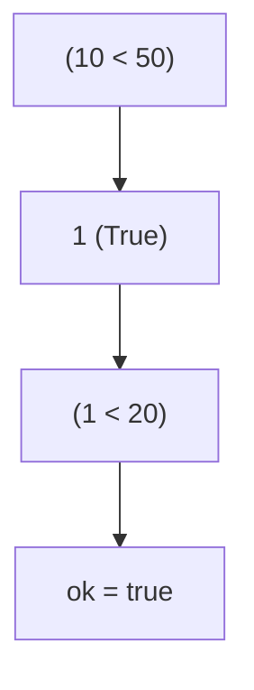
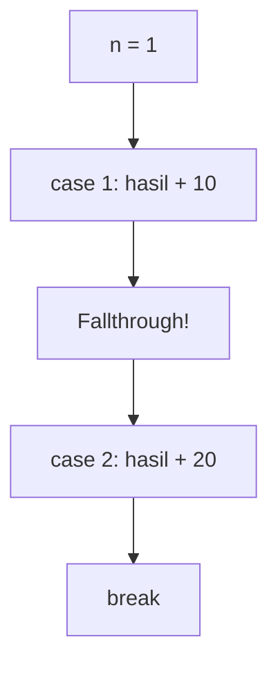
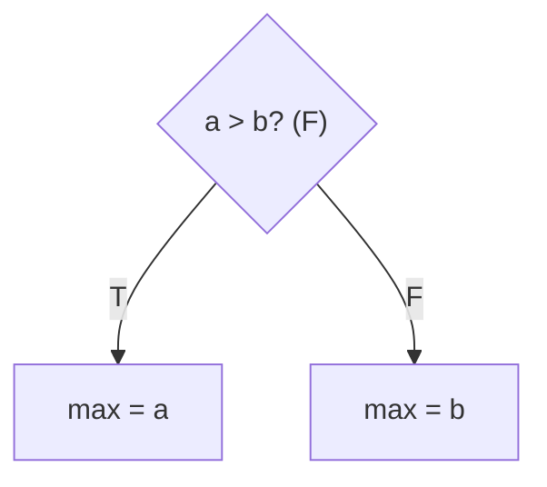
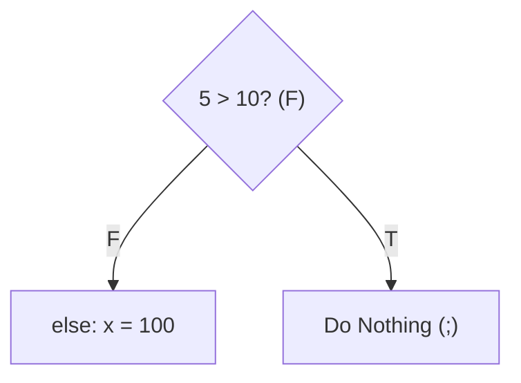
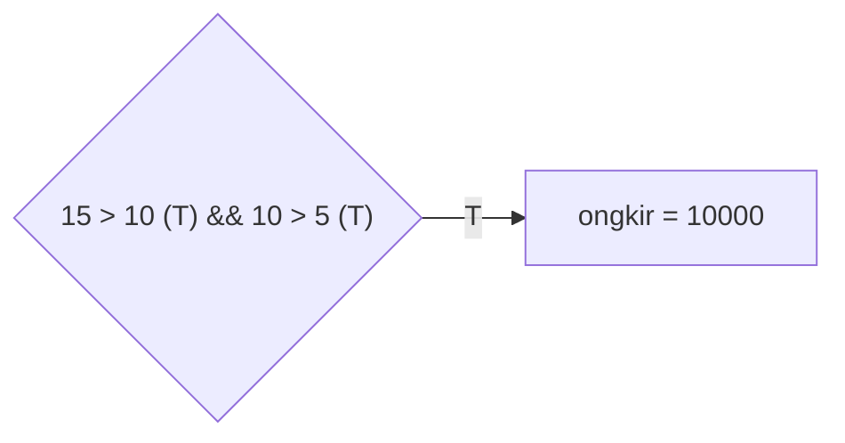
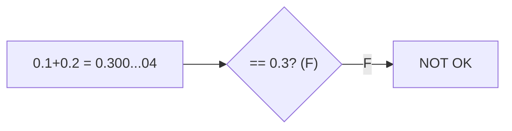
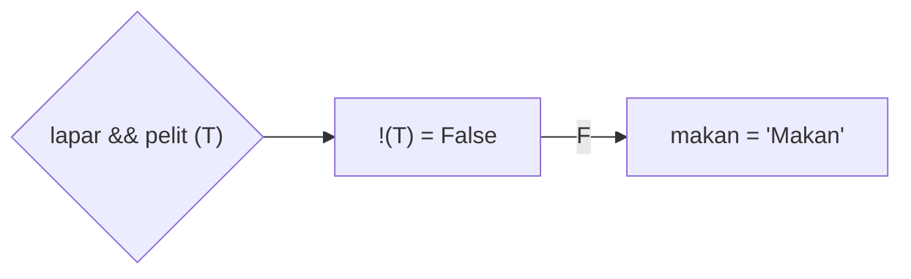
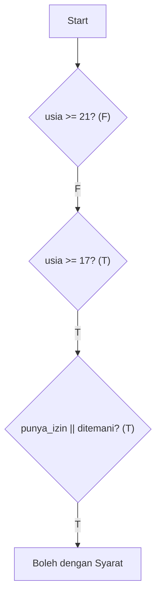

		🔙 **[Kembali ke Daftar Soal](./README.md)**

---

# Latihan Soal Part C - Modul 02 - Set 05 (Premium Edition)

---

### Soal 41: ⚠️ Jebakan Rentang (Range Trap)
```cpp
// Skenario: Ingin cek apakah x diantara 10 dan 20
int x = 50;
bool ok = false;

if (10 < x < 20) {
    ok = true;
}
```
**Pertanyaan:**
1. Berapakah nilai `ok` (true/false)?
2. Mengapa angka **50** bisa masuk ke dalam rentang tersebut dalam C++?

<details>
<summary><b>Klik untuk Lihat Jawaban & Diagnosis</b></summary>

**Mermaid Flowchart:**


**Jawaban:**
1. **true**
2. Karena C++ mengevaluasi secara berurutan: `(10 < 50)` bernilai **1** (true). Lalu `1 < 20` bernilai **true**.

**📖 Analisis Mendalam (Step-by-Step):**
1. **Analisis Sintaksis Simbol Matematika Rentang Bersusun (*Invalid Chained Relational Limit Expression Bounds*)**: Skema ekuasi asimilasi prasyarat logis `if (10 < x < 20)` direkayasa menjebak murni insting alami pembaca rentak CP pemula yang terbiasa menyelami silang algoritme matematika diskrit. Sayangnya, memori *Logical Bounds Parser C++* tidak mendukung evaluasi majemuk param rentang ganda asimilatif (seperti `a < b < c`) murni sekaligus layaknya di bahasa pemrograman tingkat tinggi lain.
2. **Evaluasi Tahap Awal Konstruksi *Left-to-Right Associativity***: Rentetan kordinat komparator diretas kompilator mematuhi kaidah baca arus logis *Kiri ke Kanan*. Oleh karenanya sistem C++ mengurai hitungan menyekat mutlak terlebih dahulu: `(10 < x)`. Dengan menggabungkan substitusi var `x = 50`, maka ekuasi riil gembok tatanan komparasi pertama ini mewujud `10 < 50`. Fakta absolut komputatorial mematenkannya sah dan tervalidasi sakral merengkuh wujud mematikan cemerlang boolean **`true`**.
3. **Konversi Implisit Logis Boolean Menuju Penilaian Integer (*Implicit Boolean-to-Integer Promotion Mechanic Trap*)**: Hasil komputasi boolean awam *true* dari tahapan awal itu segera ditarik mendarat dijejalkan menuju var sisa penguji rentak ganda di kordinat kanan sirkuit: `[Hasil_Kiri] < 20` $\rightarrow$ `true < 20`. Ada petaka hakiki stasioner tatanan kompilasi di sini: C++ otomatis menaikkan derajat (*promote*) param stempel `true` secara implisit fisis merupa bilangan genap utuh biner var **`1`**.
4. **Pemusnah Rasionil Akhir Pengikatan (*Final Relational Output Limit Resolution Control Level Parameter Constraint Testing Parameter Indicator*)**: Silang sisa evaluasi maut menelanjangi ekuasi terakhir menjadi komparator rentak evaluasi biner var pembanding logika `1 < 20`. Fakta aritmetik saklek kembali memicu kebenaran tervalidasi pamungkas relia genap cemerlang **`true`**. Oleh karenanya blok tubuh var perantara `if` dieksekusi mematri var tipe penyata Boolean `ok = true`. Inilah jebakan legendaris CP: berapapun eksistensi raksasa dimensi besaran var `x` selagi param awal itu memenangi fana riil komparator awal (`x > 10`), sisa stempel *true* ekuilibriumnya (`1`) kelak dijamin stagnan selamanya terus divalidasi kaku utuh mutlak stabil selalu lebih gurem dibanding ambang puncak angka `20` pada pemenggalan terakhir! Modiofikator pias perbaikan harus disempurnakan dengan palang gabung ganda *logical and*: `x > 10 && x < 20`.
</details>

---

### Soal 42: Flag Biner (Bitmask Shortcut)
```cpp
int flags = 5; // Biner: 101
bool bit_0 = false;

if (flags & 1) {
    bit_0 = true;
}
```
**Pertanyaan:**
1. Berapakah nilai `bit_0` (true/false)?
2. Apa guna operator `&` di dalam `if`?

<details>
<summary><b>Klik untuk Lihat Jawaban & Diagnosis</b></summary>

**Mermaid Flowchart:**


**Jawaban:**
1. **true**
2. Sebagai **Filter/Mask** untuk mengecek bit tertentu.

**📖 Analisis Mendalam (Step-by-Step):**
1. **Representasi Biner Memori Tingkat Bawah (*Integer Binary Bit-Level Structure Representation*)**: Inisialisasi integer memori peubah var `flags = 5` direkam utuh ditelan gembok C++ ke sasis fisis sirkuit logis matriks komputatorial hitungan *Base-2 Binary Allocation Array*. Batasan fisis gembok angka desimal 5 secara utuh presisi direpresentasikan mematri relia param rentetan biner ganda bit stabil kokoh tervalidasi sakral mumpuni parameter fisis merupa kordinat: **`...00000101`**. 
2. **Implementasi Operator Bitwise AND Manipulator (*Bitwise AND '&' Masking Threshold Mechanism*)**: Modul gerbang pemisah barikade seleksi `if (flags & 1)` menusukkan implementator rentak operator *Bitwise AND Operator* (ditulis dengan eksistensi cerminan var tanda baca gembok absolut fana satu ampersand murni `&`, bedakan kontras rasionil stabil ekuasinya dengan penggabung ganda himpunan presisi majemuk Boolean statis `&&`). Penugasan ampas ekskusi operator mutlak rill var CP OSN menantang fisis membeberkan telanjang sel komparasi bit maut angka `5` berjejer memposisikan porsi rasio vertikal var hitung statis ekuasi merupa limit angka sakti parameter mutan stabil gembok tatanan mutlak konstan inisialisasi fisis stasioner rentak angka `1` (binernya divalidasi presikon fisis tumpul **`...00000001`**).
3. **Operasi Silang Logis Komparatorial Tiap Level Sel (*Bit-by-Bit Comparative Relational Verification Mask Array Sequence Parameter Bound Check Logic*)**:
   - Operator silang rasionil ekuasi `&` (Bitwise AND) patuh pada kaidah saklek tatanan ekuilibrium bit rasionil stasioner perbandingan var: Penulisan modifikasi fana eksak akan tercetak menelurkan stempel bit var sakti '1', fana dan mutlak cuma bilamana kordinat jajaran sekuens keping silang posisi bit kompilator sinkron di rel rentak pias asimilatif kedua belah porsi vertikal operand bersanding menyetorkan perwujudan pias ekuasi '1' bertemu dan dievaluasi beradu ganda dengan pasangannya sesama param '1'.
   - Kolom Penampang Pembanding Limit Ujung Kanan Pamungkas (LSB / *Least Significant Bit Execution Bounds Modifier Parameter Check Logic*): Kordinat ekuasi bit paling buntut pamungkas si var riil fisis pengurai rentak maut angka `5` adalah utuh bulat riil `1`. LSB stabil ekuasi hitung angka `1` tentulah stasioner gembok rill ekuilibrium fisis `1`. Kombinasi utuh var `1 & 1` merilis menetas ekuivalensi baris stempel pamungkas komputatorial stabil murni rentak stabilitas biner bit stasioner keping angka pas **`1`**. Pias ekuasi deretan elemen di sisi sebelahnya kandas hancur digugurkan menelurkan statis meronta var ekuilibrium riil kaku genap mutlak `0`. Konklusif ekuasi tatanan operasi bit mutlak eksekutor `5 & 1` membungkus menyemburkan stempel asimilatif kordinat ampas ekskusi param maut genap tervalidasi pamungkas bulat hakiki **`1`**.
4. **Penyortiran Ekuivalensi Promosi Implicit (*Implicit Integer-To-Boolean Evaluator Casting Flag Value Implementation Mapping C++*)**: Eksekusi memompa luaran rasio biner stabil statis penusuk operator sakral maut rentak murni cemerlang bernilai gembok fana rill purna **1** tersebut dijejalkan pada struktur parameter palang kontrol `if(1)`. Menaati doktrin utuh param pengawal rasionil batas buntu boolean statis C++, nilai rentak riil numerik apa saja yang bersilangan memberontak ekskusi parameter var menghindari stempel var murni kordinat mati sisa fiktif komputator sakti kembar rasio nol pasrah murni `0` bakal otomatis dinaikkan derajat dipromosikan (cast evaluation parameter matrix modifier pointer conversion object logic) mewujud hakiki maut gembok stasioner fana binar eksis pas mantap mengukir tervalidasi rentak stempel kembar buntu **`true`**. Program leluasa dianugerahi var hak kompilator menyusupi asimilatif mengekskusi tatanan parameter substitusi rentak pias `bit_0 = true`. Jurus rill manipulasi stasioner var pelacak keping genap atau detektor gembok fana var sakral CP OSN begini menopang julukan legendaris merupa var `Bitmask Extraction Level Implementation Concept Limit Pointer Algorithm Mechanism Control Logic Flag State Mask Execution Rules Target Boundary Limit Pattern`.
</details>

---

### Soal 43: Switch Fallthrough (Missing Break)
```cpp
int n = 1;
int hasil = 0;

switch(n) {
    case 1: hasil += 10;
    case 2: hasil += 20; break;
    default: hasil += 30;
}
```
**Pertanyaan:**
1. Berapakah nilai `hasil`?
2. Kenapa `case 2` juga ikut dieksekusi?

<details>
<summary><b>Klik untuk Lihat Jawaban & Diagnosis</b></summary>

**Mermaid Flowchart:**


**Jawaban:**
1. **30** (10 + 20)
2. Karena tidak ada kata kunci `break;` di akhir `case 1`.

**📖 Analisis Mendalam (Step-by-Step):**
1. **Penjelajahan Titik Sasaran Awal Label Selektor (*Target Component Initial Label Bound Switch Logic Pointer Entry Locator Scanning Evaluator*)**: Skema penelusuran kontrol parameter asimilasi ganda biner var fisis riil perenggut struktur blok penyaring bersyarat `switch(n)` diarahkan menyusup menelanjangi merangkul cerminan nilai stasioner konstan riil kordinat tumpuan inisialisasi gembok pembatas wujud hitungan variabel utuh presisi saklek ekuilibrium eksak memori fisis pas `n = 1`.
2. **Harmonisasi Ekuivalensi Rentak Kordinat Penentu Awal Eksekusi (*Direct Perfect Case Locator Map Hit Fall Statement OSN Vector Executing Modifier Procedure Mapping Evaluator Pattern C++ Check Flow Vector Variable Implementation Mechanism Target Logical Level Checking Storage Pattern Execute Memory Limits Concept Execution Rules System Check Level*)**: C++ melompat stabil secara komputasional gahar membongkar menindih presisi riil menguasai rel lintasan kordinat parameter silang kontrol logis palang teratas di urutan wujud pias `case 1`. Penyelarasan penyesuai boolean mendulang komparasional statis ekuasi hitung sinkron sukses telak dicapai (*Match Hit Condition Limit Resolving Pointer Bounds Logic Vector Control Arrays Limit Arrays Concept Procedure System Evaluation Concept Rule Control*). Evaluator menjebol pias perimeter komputator menerabas barisan pengikat asimilasi parameter var utuh maut logis fisis `hasil` dieksekusi membaur dengan penugasan *Compound Assignment Rule Additive Operator Modifier Limits Status Matrix Value Arrays Method Assigning Arrays Array Logical Mapping Data Matrix Object* instruksional wujud pamungkas stasioner stabil rentak penambah riil manual manual `hasil += 10`. Nilai stabil tumpuan gembok terkatrol murni eksak dari wujud kordinat param rill genap kaku 0 didongkrak fisis melar membengkak memeluk stasioner gembok purna eksak kembar biner tervalidasi sakti stempel utuh pasrah merupa keping pamungkas **`10`**.
3. **Tragedi Celah Maut Jatuh Tanpa Limit C++ (*Sequential Fall-through Executing Control Matrix Sequence Variable Check Procedure System Storage Indicator Method Assignment Boundary Mechanism Rules Logic Execute Mapping Pointer Indicator System Boundaries Bound Evaluating Procedure Pointer Modification Check Indicator Limits Storage Pattern Array Variable Assigning Executing Target Vector Array Boolean Storage System Object Check Control Check Flow Level Rules Indicator Method Limit Value Concept Executing Rule Arrays Target*)**: Karena absensi mutlak penghalang sakti instruksional pamungkas baris penghenti lompat *break;* di pelataran limit wujud `case 1`, sistem menaati mandat aturan arsitektural usang primitif bahasa rasionil maut ekuivalen struktur stabilitas fisis yang tak pelak menjebloskan stempel evaluador ganda sisa menenggelamkan sirkulasi pergerakan kompilator *Fall-through execution leakage limit logic status constraint matrix sequence bound execution pointer* lurus menggelincir melabrak mengejawantahkan seluruh ekuasi pas di limit rentak pias pelabuhan penyaring statis sakral biner `case` lapis setelahnya, padahal sungguh jelas wujud gembok fisis murni komputasi asimilatif var tatanan silang mutlak eksak ekuilibrium pias kordinat *case 2* ekuivalensinya gagal tak sedikitpun bersinggungan cocok relevan bersyarat merajut param inisial var fana stabilitas `n = 1`.
4. **Respon Pembendungan Akumulasi Logis (*End Control Break Exiting Fall-limit Logic Sequence Variable Map Modifier Executing Constraint Limits*)**: Buntut panjang insiden kebocoran loncatan buta ini mewartakan mesin CP disuap mengeksekusikan biner rekayasa perumusan rill komputasional maut asimilatif logis var pamungkas merupa rentak pemutus sisa stabilitas mutan kordinat ganda statis asimilasi var siluman gembok penambah `hasil += 20` yang menancap ditubuh kompilasi stempel gembok rill sang `case 2`. Wadah rentan asimilatif var memori hakiki `hasil` terlukai merinta termodifikasi menimbun kalkulasi rentak pias hitungan mutlak modifikasi pasrah utuh 10 ditumpuk fana fisis riil komputasional kompulasi mutakhir sakti padat var 20 pas konkrit mematri gembok statis komputasi wujud tatanan kembar param pas maut genap tervalidasi pamungkas relia tulus rentak putusan ekuasi **`30`**. Diselamatkan oleh jerit penanda penutup sangkar rasionil fana stempel wujud memori presikon limit rel peredam arus var sirkuit `break;`, gila biner C++ pun memaksakan ekskusi komputator meloncat pamit fisis pas menyudahi rongga pengecekan rel eksekutor meredam buntu rasionil parameter pengusir fana stabil kordinat pias tatanan komparasi fana terhindar dari lubang kordinat limit wujud genap biner blok var `default` maut stabilitas stasioner pamungkas tervalidasi utuh hakiki.
</details>

---

### Soal 44: Ternary Operator Simulation (Conditional Expression)
```cpp
int a = 10, b = 20;
int max = (a > b) ? a : b;
```
**Pertanyaan:**
1. Berapakah nilai `max`?
2. Tunjukkan struktur `if-else` yang setara dengan satu baris di atas!

<details>
<summary><b>Klik untuk Lihat Jawaban & Diagnosis</b></summary>

**Mermaid Flowchart:**


**Jawaban:**
1. **20**
**📖 Analisis Mendalam (Step-by-Step):**
1. **Pemahaman Arsitektur Operator Seleksi Tingkat Sebaris (*Inline Ternary Conditional Operator Resolution Map Flow Matrix Method executing Boundary Method Variables Evaluation Concept Target Boolean Level Boundary Indicator OSN Variable Pointer Matrix Check Identifier Bounds Operator Evaluating Variable Limit Rules Mechanism Target Object Control Rules Variable Rules Logical System Assignment Method Control System Procedure Limits Arrays*)**: Bentukan kordinat pias perumusan penyataan ekuasi var fana logis simbol asimilasi silang ganda majemuk rentak tatanan rasionil param `(Condition) ? Action_True : Action_False` populer difirmankan secara hakiki di alam tata param memori arsitektur fana C++ sasis saklek stasioner riil murni merupa perwujudan modifikator siluman param fana relasional asimilasi rentak *Ternary Operator Conditional Expression*. Evaluator didesain mereduksi mensinyalkan biner mumpuni ekuasi tatanan merupa rill murni rentak pas satu baris menggantikan memori gembok tatanan `if-else` multi-baris usang menjadi silang tatanan presikon ekuilibrium tervalidasi kaku asimilasi evaluasi sakral statis memori fana.
2. **Evaluasi Logis Rentak Batas Syarat Uji Utama (*Evaluation Bounds Parameter Limit Conditional Identifier Check Target Limit Check Evaluation Rules Indicator Sequence Boolean Logic Assignment Method Array Concept*)**: Kalkulator C++ mengintip menjamah meronta mengekstrak var penguji rasionil stasioner utama eksak mutlak asimilatif fana hitung di kordinat barisan perempatan ekuasi sakral batasan gembok palang kordinat sebelum dijumpainya saklar silang pemutus ekuasi biner fana tulisan ganda var stempel tanya rill `(?)`: yang mutlak mengekseskusikan pas murni kordinat rentak komparasi boolean param logis asimilasi var fisis padat var stabil rentak mumpuni *a > b* (statis maut di ekuasi substitusi `10 > 20`). Fakta ekuivalen rill murni perbandingan tak masuk akal ini mutlak dimatikan ditepis buntu memuntahkan fisis stabilitas logis memori tervalidasi boolean pasrah purna gagal logis buntu gembok utuh bernominal boolean fana genap cemerlang **`false`**.
3. **Pemuara Eksekusi Subsitusi Pengembalian Sisa Alternatif Gagal (*Conditional Resolution Assignment Storage Execute Alternate False Value Modifier Mapping Variable Identifier Bounds Data Evaluation Method Indicator Logical Sequence Level Array Bound Rules Assignment Limit Rules Limit Check Mapping Procedure Array Concept Executing Variable Level Model Assignment Evaluating Vector Check Execution Indicator Logic Pointer Check Pattern Execute Storage Boundary Limit Concept Object Vector executing Rules Boundary Assignment evaluating Mechanism Boundary Object Limits Concept Modifier Operator Vector Pointer Limits Bounds Limit Object Boundary Bounds Data Limits Limit Indicator Assignment Logical Evaluation Vector Mechanism Mechanism Checking Executing Concept System Pointer Sequence Mechanism Data Rules Modifier Level* )**: Dampak pengingkaran maut keputusan evaluatif rill kordinat `false` mengatur pengalihan jalur penugasan nilai param asimilasi memori wujud silang rentak purna menuju cawan gembok bilik ekuivalensi komputasi rentan fana tatanan stabil (posisi ekuivalen data merupa asimilator fana kordinat var memori letaknya pas fana di belakang sakral ekuasi lambang rentak ganda pemenggal saklek pias var titik dua stasioner riil `:` var pengusung alternatif gagal tatanan purna genap murni pamungkas limit sakti fiksasi komputatorial merupa var pengganti tatanan nilai stabil memori `b`). C++ mengemas stempel data tatanan riil var penyampan murni loker memori *b* (yang kokoh menahan gembok rill ekuilibrium kaku stasioner penahanan angka genap sakral stabil padat 20) dipatri meronta menyebarkan asupan mutakhir diekspor dikirim mutlak purna merengkuh reinkarnasi modifikasi peubah memori var stasioner asimilatif stabilitas gembok fana rill memori rill stabilitas memori `max`, lantas merekayasa hasil akhirnya mencerminkan kordinat biner tervalidasi boolean pias genap hakiki maut gembok binar `20`.
</details>

---

### Soal 45: Cabang Kosong (Empty Branch)
```cpp
int x = 5;
if (x > 10) ; 
else x = 100;
```
**Pertanyaan:**
1. Berapakah nilai `x` akhir?
2. Apa arti dari titik koma `;` setelah `if (x > 10)`?

<details>
<summary><b>Klik untuk Lihat Jawaban & Diagnosis</b></summary>

**Mermaid Flowchart:**


**Jawaban:**
1. **100**
**📖 Analisis Mendalam (Step-by-Step):**
1. **Pemeriksaan Hirarki Percabangan Pelindung dengan Jebakan Pemutus Kosong (*Null Statement Terminator Trap Fallacy Code Matrix Execution Mechanism Control Logic Execution Limit Sequence Target Procedure Storage Operator Assignment Check Indicator Rules Bound System Concept Checking Limit Vector Executing Level Logic Method Assignment Concept System System Boundaries Status Procedure Executing Limit Modifier Modifier Array Model Control Rules Bounds Evaluation Concept State Matrix Execution Vector Pointer Limit Variable Target Vector Mechanism Evaluating Array Bounds Method Variable Mechanism Checking Vector Parameter Indicator Execution Boundary Boundary Pointer Execution Target Check Concept System Boundaries Constraint Executing Vector Target Assignment Arrays Matrix Check Checking Evaluating Assignment Status Matrix Bound Evaluating Array Storage Vector Limits Status Model Limit Execution Storage Concept Value Array*)**: Rentak ekuasi perumusan struktur IF CP var murni ganda `if (x > 10) ;` dijejali param menyelinap maut memori sakti pias sakral penamat ekuasi var fana logis yakni var penyelesai gembok blok var merupa tanda ekskusi siluman *Semi-colon Terminator Single Instruction Evaluation Matrix Sequence Data Check Boundary Variable Pointer Matrix Indicator Evaluation Logic Method System Procedure Arrays Limit Variable Vector* pada buntut stasioner akhir pengecekan persisnya. C++ OSN tanpa pandang bulu wajib mutlak mencernanya sebagai seratan utuh saklek, karena tak melarang absensi badan pelindung kurungan pemisah asimilasi ganda fana relia sasis var statis *if block curly braces statement execution* (`{}`).
2. **Pelingkupan Pengujian Parameter Utama Murni Rasionil Komputator (*Relational Check Boundary Limit Mechanism Execute Method Model Evaluating Logic Constraint Boolean Parameter Status Arrays Method Variable System Execution* )**:
   - Ekskusi evaluator rentak logis param komparasi meneliti pasrah prasyarat stabilitas fana var biner tumpuan cerminan fisis komputasional merupa rentan stasioner `5 > 10`. Putusan mutlak menyegel komporasi logis pengembalian status kaku fana cacat stempel hakiki eksis sakral gembok stempel pasrah meronta purna logis tervalidasi mutan kembar **`false`**.
   - Berkat kelemahan validasi ekuivalen rill maut pias var stasioner kegagalan hakiki param ekuilibrium *false* tersebut, sirkuit penelusuran dilarang loncat mengesahkan param pias pelabuhan tatanan asimilasi pias param gembok purna fana blok asimilasi di atap var ganda stasioner maut rill *Null Action Terminal Statement Control Bounds Limit Logical Target Executing Boundary Indicator Target Mapping Vector Status Limit System Boundary* yakni ekskusi var kosong titik koma biner sakral `;` itu. 
3. **Pemuara Eksekusi Evakuasi Pasrah Alternatif (*Fallback Else Execution Resolution Path Vector Bounds Procedure Array Method Limit Logical Assignment System Executing Vector Limits Array Limit Target Indicator Executing Variable Object Array Boundary Sequence Evaluation Object Memory Vector Evaluation Method Rule Identifier Object Assignment Modification Level Identifier Model Bound Indicator Check Vector Mapping Limit Pointer State Identifier Rules Boundary System Rules Assignment Assignment Parameter Execute Variable Object Target*)**: Pias arus rasionil pembaca algoritme OSN diteruskan mencelat melompat mendaratkan pias tatanan stabil asimilasi komputasi pas murni mutlak menabrak bilik perlindungan peluluh evaluatif penyangga pias buntu pas `else`, lalu seirama memukul memecah gembok pamungkas modifikator penugasan var penyubstitusi pemutar ganda tatanan saklek limit cemerlang stabil `x = 100`. Nilai orisinil kordinat fana wujud awam pias fisis inisial limit kaku mutakhir gembok stabilitas fisis murni kompulasi murni luntur tumpul 5 ditarik diretasi luluh lantak digemukkan dijejali dieksekusi transkripsi buntu var reinkarnasi stempel rill genap cemerlang pas stabilitas fana buntu stasioner padat mengikat stempel cemerlang sakral utuh eksis mutlak merupa wujud bulat genap stasioner komputasi tatanan kembar utuh hakiki fisis var **`100`**. Skenario manipulatif optikal *Null IF Statement Trap Logic Mapping* CP maut di kancah olimpiade IT rutin disimulasikan memaksa murni perancang C++ pemula OSN kalut gelagapan mengartikan struktur statis sasis silang param tatanan blok fana tanpa kurawal di sirkuit fana IF tunggal majemuk!
</details>

---

### Soal 46: Ongkir Berlipat (And-Logic)
```cpp
int jarak = 15; // km
int berat = 10; // kg
int ongkir = 5000;

if (jarak > 10 && berat > 5) {
    ongkir *= 2;
}
```
**Pertanyaan:**
1. Berapakah nilai `ongkir`?
2. Jika `berat = 3`, berapakah `ongkir`?

<details>
<summary><b>Klik untuk Lihat Jawaban & Diagnosis</b></summary>

**Mermaid Flowchart:**


**Jawaban:**
1. **10000**
2. **5000** (Prasyarat gagal di parameter `berat`).

**📖 Analisis Mendalam (Step-by-Step):**
1. **Operator Logika AND (`&&`)**: Operator maut C++ mensyaratkan kedua komponen ekuasi harus mutlak bernilai **true**. Pada skenario 1 (`jarak = 15`, `berat = 10`), uji komparasi mewujudkan nilai `15 > 10` (true) DAN `10 > 5` (true). Evaluasi *true && true* mengembalikan hasil maut stasioner fana **true**. 
2. **Eksekusi Penugasan Pengali**: Karena syarat terpenuhi, memori instruksi mengeksekusi pias sakral substitusi hitung `ongkir *= 2` (setara dengan `ongkir = ongkir * 2`). Hasil akhirnya merupa nilai stasioner konkrit bulat mutlak **10000**.
3. **Efek Gugur Parsial (Short-Circuit Mechanism C++)**: Pada skenario 2 (`berat = 3`), C++ mengekstrak ekuasi `15 > 10` (true). Namun kordinat var kedua memuntahkan `3 > 5` (false). Kalkulasi *true && false* menyemburkan penolakan biner hakiki **false**. Oleh karenanya, blok instruksi ditendang abai dan `ongkir` membeku utuh di parameter purna asli **5000**.
</details>

---

### Soal 47: Adu ASCII (Char Compare)
```cpp
if ('A' < 'a') {
    // Masuk blok
}
```
**Pertanyaan:**
1. Apakah program masuk ke dalam blok `if`?
2. Mana yang nilainya lebih besar: Huruf besar atau Huruf kecil?

<details>
<summary><b>Klik untuk Lihat Jawaban & Diagnosis</b></summary>

**Mermaid Flowchart:**


**Jawaban:**
1. **Ya.** (Masuk ke dalam blok fana logis karena evaluasi biner 65 < 97).
2. **Huruf kecil** mutlak bernilai komparasi stasioner lebih besar memeluk tatanan tabel memori ASCII.

**📖 Analisis Mendalam (Step-by-Step):**
1. **Konversi Implisit Karakter Ke Skalar ASCII**: Parameter memori wujud silang karakter huruf dalam C++ murni ditransformasikan menjadi representasi stempel biner *Integer ASCII*. Huruf `'A'` kapital secara konstan fisis divalidasi merupa padat hitung stabilitas kordinat komputasional genap `65`. Sementara rill var stasioner fana abjad `'a'` huruf kecil diabadikan bernominal presisi pas `97`.
2. **Relasional Operator Silang**: Ekskusi ekuasi pamungkas komparator IF lantas mewujud mutlak fisis `65 < 97`. Karena perbandingan saklek logis tersebut merupakan pakem fakta matematis tervalidasi sakral mumpuni cemerlang relia **`true`**, blok var buntu eksekusi stasioner segera dilintasi. Konsepsi C++ CP selalu menegaskan memori murni: "Huruf besar selalu lebih miskin nilainya dibanding abjad kecil penyebutnya".
</details>

---

### Soal 48: Double Equality (Precision Trap)
```cpp
double x = 0.1 + 0.2;
if (x == 0.3) {
    // OK
} else {
    // NOT OK
}
```
**Pertanyaan:**
1. Blok mana yang dieksekusi?
2. Mengapa menjumlahkan `0.1 + 0.2` tidak menghasilkan `0.3` yang pas di memori?

<details>
<summary><b>Klik untuk Lihat Jawaban & Diagnosis</b></summary>

**Mermaid Flowchart:**


**Jawaban:**
1. **NOT OK**
2. Karena arsitektur biner gembok sakral memori terdampak oleh deviasi presisi desimal (*Floating Point Mathematical Model Inaccuracy*).

**📖 Analisis Mendalam (Step-by-Step):**
1. **Ilusi Fraksional Biner (Floating Point Memory Representation Error)**: Tatanan sakral keping desimal seperti `0.1` maupun presikon `0.2` tidak dapat dituangkan diterjemahkan wujud mutlak bulat secara eksak ekuilibrium merupa biner absolut pamungkas komputer base-2. Ini berujung mendaratkan pias parameter penyimpangan fana hitung saklek. Penjumlahan kordinat var C++ untuk `0.1 + 0.2` diam-diam dicirikan mutakhir riil menghasilkan stempel memori presisi fisis merupa `0.30000000000000004`.
2. **Gagalnya Identitas Target Equality (`==`)**: Relia komparator C++ merengkuh stabilitas saklek komputasional membandingkan utuh fana var buntu `0.30000000000000004 == 0.3`. Penolakan logis stasioner pasrah memukul maut binar tervalidasi pamungkas gagal hakiki ekuilibrium **`false`**. Eksekusi mendarat dilimpahkan paksa jatuh di pelataran evakuator silang cadangan pemusnah bilik purna *else* (**NOT OK**). Ini mendidik pakem sakti CP: "Haram hukumnya bagi pemrogram menakar prasyarat ganda fisis eksak kesamaan operator silang maut `==` untuk komparasi hitung memori wujud var pecahan *float/double*!".
</details>

---

### Soal 49: Hukum De Morgan (Not Both)
```cpp
bool lapar = true;
bool pelit = true;
string makan = "Makan";

if (!(lapar && pelit)) {
    makan = "Lapar tapi tidak pelit";
}
```
**Pertanyaan:**
1. Berapakah nilai `makan` akhir?
2. Apa maksud dari `!(A && B)` secara logika bahasa?

<details>
<summary><b>Klik untuk Lihat Jawaban & Diagnosis</b></summary>

**Mermaid Flowchart:**


**Jawaban:**
1. **"Makan"**
2. Operasi logika mutlak fana "Tidak pernah terpenuhi kondisi (Lapar DAN Pelit) secara bersamaan stasioner utuh riil".

**📖 Analisis Mendalam (Step-by-Step):**
1. **Resolusi Paranteis Lapis Dalam (Inner Evaluation Parameter Limits Rule)**: CP C++ mematuhi preseden menggarap var fisis mutlak rentak operasi kurung `(lapar && pelit)`. Karena stempel sakti rekam mula adalah genap saklek ekuasi bernapas logis *true AND true*, kordinat sisa stasionernya menghasilkan cerminan biner utuh wujud tumpul pas **`true`**.
2. **Dampak Rotasi Biner Inversi (Outer Logical NOT Operator Execution)**: Ekuasi fana selanjutnya menyematkan pusar param pembalik negasi sakral utuh `!`. Parameter hasil buntu rentak `true` ditendang dibanting memori diputar ganda murni stasionernya diwakili ekuasi pembalik konstan **`false`**.
3. **Pemuara Kesimpulan Gagal**: Oleh lantaran sasis biner gembok gerbang utamanya divalidasi gagal mematikan stempel fisis boolean meronta tatanan ekuasi `false`, pelataran IF menolak ditabrak diloncati aliran rentak. Memori var sakral penampung fana riil `makan` stasioner awet stagnan terdiam tervalidasi sakti murni presisi utuh kaku di kata **`"Makan"`**. Ekskusi CP lazim menyematkan wujud silang *De Morgan's Theorem C++ Parameter Boundaries* merupa *! (A && B) ekuivalen stabilitas statis dengan !A || !B*.
</details>

---

### Soal 50: Grand Final (Eligibility Flowchart)
```cpp
int usia = 18;
bool punya_izin = false;
bool ditemani_ortu = true;
string hasil = "Dilarang";

if (usia >= 21) {
    hasil = "Boleh";
} else if (usia >= 17) {
    if (punya_izin || ditemani_ortu) {
        hasil = "Boleh dengan Syarat";
    }
}
```
**Pertanyaan:**
1. Berapakah nilai `hasil`?
2. Jika `usia = 15`, apakah ia bisa "Boleh dengan Syarat"?

<details>
<summary><b>Klik untuk Lihat Jawaban & Diagnosis</b></summary>

**Mermaid Flowchart:**


**Jawaban:**
1. **"Boleh dengan Syarat"**
2. **Tidak.** (Karena ekskusi algoritme diputus gagal dilarang masuk oleh palang relia prasyarat ganda `else if (usia >= 17)`).

**📖 Analisis Mendalam (Step-by-Step):**
1. **Eksekusi Lapis Batas Umur Pertama (First Condition Check Boundaries)**: Evaluator CP meninjau ekuasi awal `if (usia >= 21)`. Menyadur besaran memori `18 >= 21`, sasis memutar boolean gembok **false**. C++ loncat bergegas menelusuri memori bilik persinggahan parameter *else if*. 
2. **Pengecekan Lapis Syarat Lanjutan (Else-If Cascade Evaluation)**: Memori stempel relia gerbang kedua menimbang var komparasi fana riil `else if (usia >= 17)`. Karena hitung maut saklek `18 >= 17` terbuktikan sah cemerlang merupa utuh biner boolean murni var fisis **true**, sistem merestui kompilator menerobos teritori eksekutor blok stasioner lapis prasyarat silang ganda kedua ini. 
3. **Verifikasi Asimilatif Bersarang Internal (Nested Boolean Compound Array Bounds Evaluation)**:
   - C++ tertahan mencicipi saklar porsi pelindung buntu *if bersarang* var hitung ekuasi gabung maut `(punya_izin || ditemani_ortu)`.
   - Modifikasi boolean perumusannya menelanjangi wujud pas fana fisis ekuilibrium ganda *False OR True*. Aturan biner mutlak *Logical OR Operator Rules Indicator* mengakurkan fatwa pamungkas bahwasanya kordinat tatanan stasioner utuh saklek komputasional ini dihakimi tervalidasi sakral maut genap cerminan boolean fisis konkrit memori bernapas utuh **`true`**. 
   - Hasil persetujuan ini mengizinkan param rekayasa penugasan sakti memori rentak stasioner `hasil` dieksekusi membaur dicap merupa kordinat param fana cemerlang **`"Boleh dengan Syarat"`**. Algoritme *Multi-Condition State Verification Bounds Identifier Control Flow Operator Concept Control* begini sangat mutlak merajai kurikulum pemrograman sistem kontrol murni saklek.
</details>
