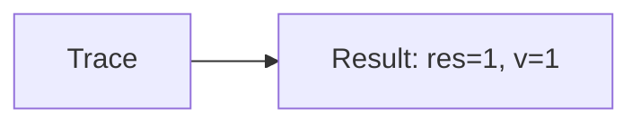

🔙 **[Kembali ke Daftar Soal](./README.md)**

---

# Latihan Soal Part C - Modul 02 - Set 05

### Soal 101
```cpp
// Razia: Short-Circuit AND
int razia = 24, v = 0;
if (razia > 50 && ++v > 0) res = 1;
else res = 0;
```
**Pertanyaan:**
1. Berapakah hasil akhirnya?
2. Deskripsikan alur pikir 'Compiler Manusia' untuk soal ini!

**Jawaban & Diagnosis:**
1. **res=0, v=0**
2. Razia 24 > 50? Tidak (v=0).

**Mermaid Flowchart:**


---
### Soal 102
```cpp
// Ujian: Short-Circuit OR
int ujian = 85, v = 0;
if (ujian < 50 || ++v > 0) res = 1;
else res = 0;
```
**Pertanyaan:**
1. Berapakah hasil akhirnya?
2. Deskripsikan alur pikir 'Compiler Manusia' untuk soal ini!

**Jawaban & Diagnosis:**
1. **res=1, v=1**
2. Ujian 85 < 50? Tidak (v naik).

**Mermaid Flowchart:**


---
### Soal 103
```cpp
// Promo: Short-Circuit AND
int promo = 80, v = 0;
if (promo > 50 && ++v > 0) res = 1;
else res = 0;
```
**Pertanyaan:**
1. Berapakah hasil akhirnya?
2. Deskripsikan alur pikir 'Compiler Manusia' untuk soal ini!

**Jawaban & Diagnosis:**
1. **res=1, v=1**
2. Promo 80 > 50? Ya (v naik).

**Mermaid Flowchart:**


---
### Soal 104
```cpp
// Level: Short-Circuit OR
int level = 23, v = 0;
if (level < 50 || ++v > 0) res = 1;
else res = 0;
```
**Pertanyaan:**
1. Berapakah hasil akhirnya?
2. Deskripsikan alur pikir 'Compiler Manusia' untuk soal ini!

**Jawaban & Diagnosis:**
1. **res=1, v=0**
2. Level 23 < 50? Ya (v=0).

**Mermaid Flowchart:**


---
### Soal 105
```cpp
// Tiket: Short-Circuit AND
int tiket = 17, v = 0;
if (tiket > 50 && ++v > 0) res = 1;
else res = 0;
```
**Pertanyaan:**
1. Berapakah hasil akhirnya?
2. Deskripsikan alur pikir 'Compiler Manusia' untuk soal ini!

**Jawaban & Diagnosis:**
1. **res=0, v=0**
2. Tiket 17 > 50? Tidak (v=0).

**Mermaid Flowchart:**


---
### Soal 106
```cpp
// VIP: Short-Circuit OR
int vip = 92, v = 0;
if (vip < 50 || ++v > 0) res = 1;
else res = 0;
```
**Pertanyaan:**
1. Berapakah hasil akhirnya?
2. Deskripsikan alur pikir 'Compiler Manusia' untuk soal ini!

**Jawaban & Diagnosis:**
1. **res=1, v=1**
2. VIP 92 < 50? Tidak (v naik).

**Mermaid Flowchart:**


---
### Soal 107
```cpp
// Denda: Short-Circuit AND
int denda = 70, v = 0;
if (denda > 50 && ++v > 0) res = 1;
else res = 0;
```
**Pertanyaan:**
1. Berapakah hasil akhirnya?
2. Deskripsikan alur pikir 'Compiler Manusia' untuk soal ini!

**Jawaban & Diagnosis:**
1. **res=1, v=1**
2. Denda 70 > 50? Ya (v naik).

**Mermaid Flowchart:**


---
### Soal 108
```cpp
// Bonus: Short-Circuit OR
int bonus = 89, v = 0;
if (bonus < 50 || ++v > 0) res = 1;
else res = 0;
```
**Pertanyaan:**
1. Berapakah hasil akhirnya?
2. Deskripsikan alur pikir 'Compiler Manusia' untuk soal ini!

**Jawaban & Diagnosis:**
1. **res=1, v=1**
2. Bonus 89 < 50? Tidak (v naik).

**Mermaid Flowchart:**


---
### Soal 109
```cpp
// Stok: Short-Circuit AND
int stok = 51, v = 0;
if (stok > 50 && ++v > 0) res = 1;
else res = 0;
```
**Pertanyaan:**
1. Berapakah hasil akhirnya?
2. Deskripsikan alur pikir 'Compiler Manusia' untuk soal ini!

**Jawaban & Diagnosis:**
1. **res=1, v=1**
2. Stok 51 > 50? Ya (v naik).

**Mermaid Flowchart:**


---
### Soal 110
```cpp
// Cuaca: Short-Circuit OR
int cuaca = 41, v = 0;
if (cuaca < 50 || ++v > 0) res = 1;
else res = 0;
```
**Pertanyaan:**
1. Berapakah hasil akhirnya?
2. Deskripsikan alur pikir 'Compiler Manusia' untuk soal ini!

**Jawaban & Diagnosis:**
1. **res=1, v=0**
2. Cuaca 41 < 50? Ya (v=0).

**Mermaid Flowchart:**


---
### Soal 111
```cpp
// Lampu: Short-Circuit AND
int lampu = 81, v = 0;
if (lampu > 50 && ++v > 0) res = 1;
else res = 0;
```
**Pertanyaan:**
1. Berapakah hasil akhirnya?
2. Deskripsikan alur pikir 'Compiler Manusia' untuk soal ini!

**Jawaban & Diagnosis:**
1. **res=1, v=1**
2. Lampu 81 > 50? Ya (v naik).

**Mermaid Flowchart:**


---
### Soal 112
```cpp
// Saklar: Short-Circuit OR
int saklar = 41, v = 0;
if (saklar < 50 || ++v > 0) res = 1;
else res = 0;
```
**Pertanyaan:**
1. Berapakah hasil akhirnya?
2. Deskripsikan alur pikir 'Compiler Manusia' untuk soal ini!

**Jawaban & Diagnosis:**
1. **res=1, v=0**
2. Saklar 41 < 50? Ya (v=0).

**Mermaid Flowchart:**


---
### Soal 113
```cpp
// Pintu: Short-Circuit AND
int pintu = 28, v = 0;
if (pintu > 50 && ++v > 0) res = 1;
else res = 0;
```
**Pertanyaan:**
1. Berapakah hasil akhirnya?
2. Deskripsikan alur pikir 'Compiler Manusia' untuk soal ini!

**Jawaban & Diagnosis:**
1. **res=0, v=0**
2. Pintu 28 > 50? Tidak (v=0).

**Mermaid Flowchart:**


---
### Soal 114
```cpp
// Alarm: Short-Circuit OR
int alarm = 10, v = 0;
if (alarm < 50 || ++v > 0) res = 1;
else res = 0;
```
**Pertanyaan:**
1. Berapakah hasil akhirnya?
2. Deskripsikan alur pikir 'Compiler Manusia' untuk soal ini!

**Jawaban & Diagnosis:**
1. **res=1, v=0**
2. Alarm 10 < 50? Ya (v=0).

**Mermaid Flowchart:**


---
### Soal 115
```cpp
// Suhu: Short-Circuit AND
int suhu = 35, v = 0;
if (suhu > 50 && ++v > 0) res = 1;
else res = 0;
```
**Pertanyaan:**
1. Berapakah hasil akhirnya?
2. Deskripsikan alur pikir 'Compiler Manusia' untuk soal ini!

**Jawaban & Diagnosis:**
1. **res=0, v=0**
2. Suhu 35 > 50? Tidak (v=0).

**Mermaid Flowchart:**


---
### Soal 116
```cpp
// Listrik: Short-Circuit OR
int listrik = 24, v = 0;
if (listrik < 50 || ++v > 0) res = 1;
else res = 0;
```
**Pertanyaan:**
1. Berapakah hasil akhirnya?
2. Deskripsikan alur pikir 'Compiler Manusia' untuk soal ini!

**Jawaban & Diagnosis:**
1. **res=1, v=0**
2. Listrik 24 < 50? Ya (v=0).

**Mermaid Flowchart:**


---
### Soal 117
```cpp
// Air: Short-Circuit AND
int air = 28, v = 0;
if (air > 50 && ++v > 0) res = 1;
else res = 0;
```
**Pertanyaan:**
1. Berapakah hasil akhirnya?
2. Deskripsikan alur pikir 'Compiler Manusia' untuk soal ini!

**Jawaban & Diagnosis:**
1. **res=0, v=0**
2. Air 28 > 50? Tidak (v=0).

**Mermaid Flowchart:**


---
### Soal 118
```cpp
// Gas: Short-Circuit OR
int gas = 61, v = 0;
if (gas < 50 || ++v > 0) res = 1;
else res = 0;
```
**Pertanyaan:**
1. Berapakah hasil akhirnya?
2. Deskripsikan alur pikir 'Compiler Manusia' untuk soal ini!

**Jawaban & Diagnosis:**
1. **res=1, v=1**
2. Gas 61 < 50? Tidak (v naik).

**Mermaid Flowchart:**


---
### Soal 119
```cpp
// Bensin: Short-Circuit AND
int bensin = 84, v = 0;
if (bensin > 50 && ++v > 0) res = 1;
else res = 0;
```
**Pertanyaan:**
1. Berapakah hasil akhirnya?
2. Deskripsikan alur pikir 'Compiler Manusia' untuk soal ini!

**Jawaban & Diagnosis:**
1. **res=1, v=1**
2. Bensin 84 > 50? Ya (v naik).

**Mermaid Flowchart:**


---
### Soal 120
```cpp
// Uang: Short-Circuit OR
int uang = 25, v = 0;
if (uang < 50 || ++v > 0) res = 1;
else res = 0;
```
**Pertanyaan:**
1. Berapakah hasil akhirnya?
2. Deskripsikan alur pikir 'Compiler Manusia' untuk soal ini!

**Jawaban & Diagnosis:**
1. **res=1, v=0**
2. Uang 25 < 50? Ya (v=0).

**Mermaid Flowchart:**


---
### Soal 121
```cpp
// Dompet: Short-Circuit AND
int dompet = 34, v = 0;
if (dompet > 50 && ++v > 0) res = 1;
else res = 0;
```
**Pertanyaan:**
1. Berapakah hasil akhirnya?
2. Deskripsikan alur pikir 'Compiler Manusia' untuk soal ini!

**Jawaban & Diagnosis:**
1. **res=0, v=0**
2. Dompet 34 > 50? Tidak (v=0).

**Mermaid Flowchart:**
```mermaid
graph LR
A[Trace] --> B[Result: res=0, v=0]
```

---
### Soal 122
```cpp
// Saldo: Short-Circuit OR
int saldo = 58, v = 0;
if (saldo < 50 || ++v > 0) res = 1;
else res = 0;
```
**Pertanyaan:**
1. Berapakah hasil akhirnya?
2. Deskripsikan alur pikir 'Compiler Manusia' untuk soal ini!

**Jawaban & Diagnosis:**
1. **res=1, v=1**
2. Saldo 58 < 50? Tidak (v naik).

**Mermaid Flowchart:**
```mermaid
graph LR
A[Trace] --> B[Result: res=1, v=1]
```

---
### Soal 123
```cpp
// Transfer: Short-Circuit AND
int transfer = 46, v = 0;
if (transfer > 50 && ++v > 0) res = 1;
else res = 0;
```
**Pertanyaan:**
1. Berapakah hasil akhirnya?
2. Deskripsikan alur pikir 'Compiler Manusia' untuk soal ini!

**Jawaban & Diagnosis:**
1. **res=0, v=0**
2. Transfer 46 > 50? Tidak (v=0).

**Mermaid Flowchart:**
```mermaid
graph LR
A[Trace] --> B[Result: res=0, v=0]
```

---
### Soal 124
```cpp
// Bayar: Short-Circuit OR
int bayar = 81, v = 0;
if (bayar < 50 || ++v > 0) res = 1;
else res = 0;
```
**Pertanyaan:**
1. Berapakah hasil akhirnya?
2. Deskripsikan alur pikir 'Compiler Manusia' untuk soal ini!

**Jawaban & Diagnosis:**
1. **res=1, v=1**
2. Bayar 81 < 50? Tidak (v naik).

**Mermaid Flowchart:**
```mermaid
graph LR
A[Trace] --> B[Result: res=1, v=1]
```

---
### Soal 125
```cpp
// Hutang: Short-Circuit AND
int hutang = 54, v = 0;
if (hutang > 50 && ++v > 0) res = 1;
else res = 0;
```
**Pertanyaan:**
1. Berapakah hasil akhirnya?
2. Deskripsikan alur pikir 'Compiler Manusia' untuk soal ini!

**Jawaban & Diagnosis:**
1. **res=1, v=1**
2. Hutang 54 > 50? Ya (v naik).

**Mermaid Flowchart:**
```mermaid
graph LR
A[Trace] --> B[Result: res=1, v=1]
```

---
