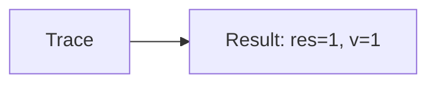

🔙 **[Kembali ke Daftar Soal](./README.md)**

---

# Latihan Soal Part C - Modul 02 - Set 06

### Soal 126
```cpp
// Piutang: Short-Circuit OR
int piutang = 50, v = 0;
if (piutang < 50 || ++v > 0) res = 1;
else res = 0;
```
**Pertanyaan:**
1. Berapakah hasil akhirnya?
2. Deskripsikan alur pikir 'Compiler Manusia' untuk soal ini!

**Jawaban & Diagnosis:**
1. **res=1, v=1**
2. Piutang 50 < 50? Tidak (v naik).

**Mermaid Flowchart:**


---
### Soal 127
```cpp
// Investasi: Short-Circuit AND
int investasi = 62, v = 0;
if (investasi > 50 && ++v > 0) res = 1;
else res = 0;
```
**Pertanyaan:**
1. Berapakah hasil akhirnya?
2. Deskripsikan alur pikir 'Compiler Manusia' untuk soal ini!

**Jawaban & Diagnosis:**
1. **res=1, v=1**
2. Investasi 62 > 50? Ya (v naik).

**Mermaid Flowchart:**


---
### Soal 128
```cpp
// Saham: Short-Circuit OR
int saham = 56, v = 0;
if (saham < 50 || ++v > 0) res = 1;
else res = 0;
```
**Pertanyaan:**
1. Berapakah hasil akhirnya?
2. Deskripsikan alur pikir 'Compiler Manusia' untuk soal ini!

**Jawaban & Diagnosis:**
1. **res=1, v=1**
2. Saham 56 < 50? Tidak (v naik).

**Mermaid Flowchart:**


---
### Soal 129
```cpp
// Emas: Short-Circuit AND
int emas = 88, v = 0;
if (emas > 50 && ++v > 0) res = 1;
else res = 0;
```
**Pertanyaan:**
1. Berapakah hasil akhirnya?
2. Deskripsikan alur pikir 'Compiler Manusia' untuk soal ini!

**Jawaban & Diagnosis:**
1. **res=1, v=1**
2. Emas 88 > 50? Ya (v naik).

**Mermaid Flowchart:**


---
### Soal 130
```cpp
// Kurs: Short-Circuit OR
int kurs = 46, v = 0;
if (kurs < 50 || ++v > 0) res = 1;
else res = 0;
```
**Pertanyaan:**
1. Berapakah hasil akhirnya?
2. Deskripsikan alur pikir 'Compiler Manusia' untuk soal ini!

**Jawaban & Diagnosis:**
1. **res=1, v=0**
2. Kurs 46 < 50? Ya (v=0).

**Mermaid Flowchart:**


---
### Soal 131
```cpp
// Pajak: Short-Circuit AND
int pajak = 22, v = 0;
if (pajak > 50 && ++v > 0) res = 1;
else res = 0;
```
**Pertanyaan:**
1. Berapakah hasil akhirnya?
2. Deskripsikan alur pikir 'Compiler Manusia' untuk soal ini!

**Jawaban & Diagnosis:**
1. **res=0, v=0**
2. Pajak 22 > 50? Tidak (v=0).

**Mermaid Flowchart:**


---
### Soal 132
```cpp
// Diskon: Short-Circuit OR
int diskon = 37, v = 0;
if (diskon < 50 || ++v > 0) res = 1;
else res = 0;
```
**Pertanyaan:**
1. Berapakah hasil akhirnya?
2. Deskripsikan alur pikir 'Compiler Manusia' untuk soal ini!

**Jawaban & Diagnosis:**
1. **res=1, v=0**
2. Diskon 37 < 50? Ya (v=0).

**Mermaid Flowchart:**


---
### Soal 133
```cpp
// Voucher: Short-Circuit AND
int voucher = 30, v = 0;
if (voucher > 50 && ++v > 0) res = 1;
else res = 0;
```
**Pertanyaan:**
1. Berapakah hasil akhirnya?
2. Deskripsikan alur pikir 'Compiler Manusia' untuk soal ini!

**Jawaban & Diagnosis:**
1. **res=0, v=0**
2. Voucher 30 > 50? Tidak (v=0).

**Mermaid Flowchart:**


---
### Soal 134
```cpp
// Kupon: Short-Circuit OR
int kupon = 93, v = 0;
if (kupon < 50 || ++v > 0) res = 1;
else res = 0;
```
**Pertanyaan:**
1. Berapakah hasil akhirnya?
2. Deskripsikan alur pikir 'Compiler Manusia' untuk soal ini!

**Jawaban & Diagnosis:**
1. **res=1, v=1**
2. Kupon 93 < 50? Tidak (v naik).

**Mermaid Flowchart:**


---
### Soal 135
```cpp
// Reward: Short-Circuit AND
int reward = 33, v = 0;
if (reward > 50 && ++v > 0) res = 1;
else res = 0;
```
**Pertanyaan:**
1. Berapakah hasil akhirnya?
2. Deskripsikan alur pikir 'Compiler Manusia' untuk soal ini!

**Jawaban & Diagnosis:**
1. **res=0, v=0**
2. Reward 33 > 50? Tidak (v=0).

**Mermaid Flowchart:**


---
### Soal 136
```cpp
// Poin: Short-Circuit OR
int poin = 40, v = 0;
if (poin < 50 || ++v > 0) res = 1;
else res = 0;
```
**Pertanyaan:**
1. Berapakah hasil akhirnya?
2. Deskripsikan alur pikir 'Compiler Manusia' untuk soal ini!

**Jawaban & Diagnosis:**
1. **res=1, v=0**
2. Poin 40 < 50? Ya (v=0).

**Mermaid Flowchart:**


---
### Soal 137
```cpp
// Ranking: Short-Circuit AND
int ranking = 21, v = 0;
if (ranking > 50 && ++v > 0) res = 1;
else res = 0;
```
**Pertanyaan:**
1. Berapakah hasil akhirnya?
2. Deskripsikan alur pikir 'Compiler Manusia' untuk soal ini!

**Jawaban & Diagnosis:**
1. **res=0, v=0**
2. Ranking 21 > 50? Tidak (v=0).

**Mermaid Flowchart:**


---
### Soal 138
```cpp
// Skor: Short-Circuit OR
int skor = 39, v = 0;
if (skor < 50 || ++v > 0) res = 1;
else res = 0;
```
**Pertanyaan:**
1. Berapakah hasil akhirnya?
2. Deskripsikan alur pikir 'Compiler Manusia' untuk soal ini!

**Jawaban & Diagnosis:**
1. **res=1, v=0**
2. Skor 39 < 50? Ya (v=0).

**Mermaid Flowchart:**


---
### Soal 139
```cpp
// Winrate: Short-Circuit AND
int winrate = 88, v = 0;
if (winrate > 50 && ++v > 0) res = 1;
else res = 0;
```
**Pertanyaan:**
1. Berapakah hasil akhirnya?
2. Deskripsikan alur pikir 'Compiler Manusia' untuk soal ini!

**Jawaban & Diagnosis:**
1. **res=1, v=1**
2. Winrate 88 > 50? Ya (v naik).

**Mermaid Flowchart:**


---
### Soal 140
```cpp
// KDR: Short-Circuit OR
int kdr = 77, v = 0;
if (kdr < 50 || ++v > 0) res = 1;
else res = 0;
```
**Pertanyaan:**
1. Berapakah hasil akhirnya?
2. Deskripsikan alur pikir 'Compiler Manusia' untuk soal ini!

**Jawaban & Diagnosis:**
1. **res=1, v=1**
2. KDR 77 < 50? Tidak (v naik).

**Mermaid Flowchart:**


---
### Soal 141
```cpp
// Ping: Short-Circuit AND
int ping = 31, v = 0;
if (ping > 50 && ++v > 0) res = 1;
else res = 0;
```
**Pertanyaan:**
1. Berapakah hasil akhirnya?
2. Deskripsikan alur pikir 'Compiler Manusia' untuk soal ini!

**Jawaban & Diagnosis:**
1. **res=0, v=0**
2. Ping 31 > 50? Tidak (v=0).

**Mermaid Flowchart:**


---
### Soal 142
```cpp
// FPS: Short-Circuit OR
int fps = 10, v = 0;
if (fps < 50 || ++v > 0) res = 1;
else res = 0;
```
**Pertanyaan:**
1. Berapakah hasil akhirnya?
2. Deskripsikan alur pikir 'Compiler Manusia' untuk soal ini!

**Jawaban & Diagnosis:**
1. **res=1, v=0**
2. FPS 10 < 50? Ya (v=0).

**Mermaid Flowchart:**


---
### Soal 143
```cpp
// Lag: Short-Circuit AND
int lag = 96, v = 0;
if (lag > 50 && ++v > 0) res = 1;
else res = 0;
```
**Pertanyaan:**
1. Berapakah hasil akhirnya?
2. Deskripsikan alur pikir 'Compiler Manusia' untuk soal ini!

**Jawaban & Diagnosis:**
1. **res=1, v=1**
2. Lag 96 > 50? Ya (v naik).

**Mermaid Flowchart:**


---
### Soal 144
```cpp
// Crash: Short-Circuit OR
int crash = 18, v = 0;
if (crash < 50 || ++v > 0) res = 1;
else res = 0;
```
**Pertanyaan:**
1. Berapakah hasil akhirnya?
2. Deskripsikan alur pikir 'Compiler Manusia' untuk soal ini!

**Jawaban & Diagnosis:**
1. **res=1, v=0**
2. Crash 18 < 50? Ya (v=0).

**Mermaid Flowchart:**


---
### Soal 145
```cpp
// Update: Short-Circuit AND
int update = 14, v = 0;
if (update > 50 && ++v > 0) res = 1;
else res = 0;
```
**Pertanyaan:**
1. Berapakah hasil akhirnya?
2. Deskripsikan alur pikir 'Compiler Manusia' untuk soal ini!

**Jawaban & Diagnosis:**
1. **res=0, v=0**
2. Update 14 > 50? Tidak (v=0).

**Mermaid Flowchart:**


---
### Soal 146
```cpp
// Patch: Short-Circuit OR
int patch = 71, v = 0;
if (patch < 50 || ++v > 0) res = 1;
else res = 0;
```
**Pertanyaan:**
1. Berapakah hasil akhirnya?
2. Deskripsikan alur pikir 'Compiler Manusia' untuk soal ini!

**Jawaban & Diagnosis:**
1. **res=1, v=1**
2. Patch 71 < 50? Tidak (v naik).

**Mermaid Flowchart:**
```mermaid
graph LR
A[Trace] --> B[Result: res=1, v=1]
```

---
### Soal 147
```cpp
// Server: Short-Circuit AND
int server = 56, v = 0;
if (server > 50 && ++v > 0) res = 1;
else res = 0;
```
**Pertanyaan:**
1. Berapakah hasil akhirnya?
2. Deskripsikan alur pikir 'Compiler Manusia' untuk soal ini!

**Jawaban & Diagnosis:**
1. **res=1, v=1**
2. Server 56 > 50? Ya (v naik).

**Mermaid Flowchart:**
```mermaid
graph LR
A[Trace] --> B[Result: res=1, v=1]
```

---
### Soal 148
```cpp
// Client: Short-Circuit OR
int client = 25, v = 0;
if (client < 50 || ++v > 0) res = 1;
else res = 0;
```
**Pertanyaan:**
1. Berapakah hasil akhirnya?
2. Deskripsikan alur pikir 'Compiler Manusia' untuk soal ini!

**Jawaban & Diagnosis:**
1. **res=1, v=0**
2. Client 25 < 50? Ya (v=0).

**Mermaid Flowchart:**
```mermaid
graph LR
A[Trace] --> B[Result: res=1, v=0]
```

---
### Soal 149
```cpp
// Database: Short-Circuit AND
int database = 49, v = 0;
if (database > 50 && ++v > 0) res = 1;
else res = 0;
```
**Pertanyaan:**
1. Berapakah hasil akhirnya?
2. Deskripsikan alur pikir 'Compiler Manusia' untuk soal ini!

**Jawaban & Diagnosis:**
1. **res=0, v=0**
2. Database 49 > 50? Tidak (v=0).

**Mermaid Flowchart:**
```mermaid
graph LR
A[Trace] --> B[Result: res=0, v=0]
```

---
### Soal 150
```cpp
// API: Short-Circuit OR
int api = 25, v = 0;
if (api < 50 || ++v > 0) res = 1;
else res = 0;
```
**Pertanyaan:**
1. Berapakah hasil akhirnya?
2. Deskripsikan alur pikir 'Compiler Manusia' untuk soal ini!

**Jawaban & Diagnosis:**
1. **res=1, v=0**
2. API 25 < 50? Ya (v=0).

**Mermaid Flowchart:**
```mermaid
graph LR
A[Trace] --> B[Result: res=1, v=0]
```

---
