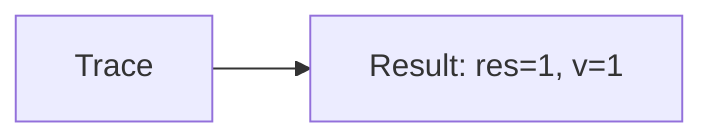
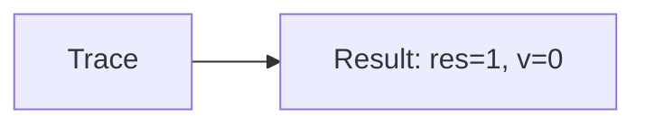

🔙 **[Kembali ke Daftar Soal](./README.md)**

---

# Latihan Soal Part C - Modul 02 - Set 08

### Soal 176
```cpp
// Bintang: Short-Circuit OR
int bintang = 61, v = 0;
if (bintang < 50 || ++v > 0) res = 1;
else res = 0;
```
**Pertanyaan:**
1. Berapakah hasil akhirnya?
2. Deskripsikan alur pikir 'Compiler Manusia' untuk soal ini!

**Jawaban & Diagnosis:**
1. **res=1, v=1**
2. Bintang 61 < 50? Tidak (v naik).

**Mermaid Flowchart:**


---
### Soal 177
```cpp
// Planet: Short-Circuit AND
int planet = 14, v = 0;
if (planet > 50 && ++v > 0) res = 1;
else res = 0;
```
**Pertanyaan:**
1. Berapakah hasil akhirnya?
2. Deskripsikan alur pikir 'Compiler Manusia' untuk soal ini!

**Jawaban & Diagnosis:**
1. **res=0, v=0**
2. Planet 14 > 50? Tidak (v=0).

**Mermaid Flowchart:**


---
### Soal 178
```cpp
// Bulan: Short-Circuit OR
int bulan = 49, v = 0;
if (bulan < 50 || ++v > 0) res = 1;
else res = 0;
```
**Pertanyaan:**
1. Berapakah hasil akhirnya?
2. Deskripsikan alur pikir 'Compiler Manusia' untuk soal ini!

**Jawaban & Diagnosis:**
1. **res=1, v=0**
2. Bulan 49 < 50? Ya (v=0).

**Mermaid Flowchart:**


---
### Soal 179
```cpp
// Matahari: Short-Circuit AND
int matahari = 73, v = 0;
if (matahari > 50 && ++v > 0) res = 1;
else res = 0;
```
**Pertanyaan:**
1. Berapakah hasil akhirnya?
2. Deskripsikan alur pikir 'Compiler Manusia' untuk soal ini!

**Jawaban & Diagnosis:**
1. **res=1, v=1**
2. Matahari 73 > 50? Ya (v naik).

**Mermaid Flowchart:**


---
### Soal 180
```cpp
// Langit: Short-Circuit OR
int langit = 72, v = 0;
if (langit < 50 || ++v > 0) res = 1;
else res = 0;
```
**Pertanyaan:**
1. Berapakah hasil akhirnya?
2. Deskripsikan alur pikir 'Compiler Manusia' untuk soal ini!

**Jawaban & Diagnosis:**
1. **res=1, v=1**
2. Langit 72 < 50? Tidak (v naik).

**Mermaid Flowchart:**


---
### Soal 181
```cpp
// Awan: Short-Circuit AND
int awan = 41, v = 0;
if (awan > 50 && ++v > 0) res = 1;
else res = 0;
```
**Pertanyaan:**
1. Berapakah hasil akhirnya?
2. Deskripsikan alur pikir 'Compiler Manusia' untuk soal ini!

**Jawaban & Diagnosis:**
1. **res=0, v=0**
2. Awan 41 > 50? Tidak (v=0).

**Mermaid Flowchart:**


---
### Soal 182
```cpp
// Hujan: Short-Circuit OR
int hujan = 21, v = 0;
if (hujan < 50 || ++v > 0) res = 1;
else res = 0;
```
**Pertanyaan:**
1. Berapakah hasil akhirnya?
2. Deskripsikan alur pikir 'Compiler Manusia' untuk soal ini!

**Jawaban & Diagnosis:**
1. **res=1, v=0**
2. Hujan 21 < 50? Ya (v=0).

**Mermaid Flowchart:**


---
### Soal 183
```cpp
// Angin: Short-Circuit AND
int angin = 15, v = 0;
if (angin > 50 && ++v > 0) res = 1;
else res = 0;
```
**Pertanyaan:**
1. Berapakah hasil akhirnya?
2. Deskripsikan alur pikir 'Compiler Manusia' untuk soal ini!

**Jawaban & Diagnosis:**
1. **res=0, v=0**
2. Angin 15 > 50? Tidak (v=0).

**Mermaid Flowchart:**


---
### Soal 184
```cpp
// Petir: Short-Circuit OR
int petir = 63, v = 0;
if (petir < 50 || ++v > 0) res = 1;
else res = 0;
```
**Pertanyaan:**
1. Berapakah hasil akhirnya?
2. Deskripsikan alur pikir 'Compiler Manusia' untuk soal ini!

**Jawaban & Diagnosis:**
1. **res=1, v=1**
2. Petir 63 < 50? Tidak (v naik).

**Mermaid Flowchart:**


---
### Soal 185
```cpp
// Salju: Short-Circuit AND
int salju = 94, v = 0;
if (salju > 50 && ++v > 0) res = 1;
else res = 0;
```
**Pertanyaan:**
1. Berapakah hasil akhirnya?
2. Deskripsikan alur pikir 'Compiler Manusia' untuk soal ini!

**Jawaban & Diagnosis:**
1. **res=1, v=1**
2. Salju 94 > 50? Ya (v naik).

**Mermaid Flowchart:**


---
### Soal 186
```cpp
// Es: Short-Circuit OR
int es = 66, v = 0;
if (es < 50 || ++v > 0) res = 1;
else res = 0;
```
**Pertanyaan:**
1. Berapakah hasil akhirnya?
2. Deskripsikan alur pikir 'Compiler Manusia' untuk soal ini!

**Jawaban & Diagnosis:**
1. **res=1, v=1**
2. Es 66 < 50? Tidak (v naik).

**Mermaid Flowchart:**


---
### Soal 187
```cpp
// Api: Short-Circuit AND
int api = 76, v = 0;
if (api > 50 && ++v > 0) res = 1;
else res = 0;
```
**Pertanyaan:**
1. Berapakah hasil akhirnya?
2. Deskripsikan alur pikir 'Compiler Manusia' untuk soal ini!

**Jawaban & Diagnosis:**
1. **res=1, v=1**
2. Api 76 > 50? Ya (v naik).

**Mermaid Flowchart:**


---
### Soal 188
```cpp
// Asap: Short-Circuit OR
int asap = 28, v = 0;
if (asap < 50 || ++v > 0) res = 1;
else res = 0;
```
**Pertanyaan:**
1. Berapakah hasil akhirnya?
2. Deskripsikan alur pikir 'Compiler Manusia' untuk soal ini!

**Jawaban & Diagnosis:**
1. **res=1, v=0**
2. Asap 28 < 50? Ya (v=0).

**Mermaid Flowchart:**


---
### Soal 189
```cpp
// Debu: Short-Circuit AND
int debu = 37, v = 0;
if (debu > 50 && ++v > 0) res = 1;
else res = 0;
```
**Pertanyaan:**
1. Berapakah hasil akhirnya?
2. Deskripsikan alur pikir 'Compiler Manusia' untuk soal ini!

**Jawaban & Diagnosis:**
1. **res=0, v=0**
2. Debu 37 > 50? Tidak (v=0).

**Mermaid Flowchart:**


---
### Soal 190
```cpp
// Polusi: Short-Circuit OR
int polusi = 46, v = 0;
if (polusi < 50 || ++v > 0) res = 1;
else res = 0;
```
**Pertanyaan:**
1. Berapakah hasil akhirnya?
2. Deskripsikan alur pikir 'Compiler Manusia' untuk soal ini!

**Jawaban & Diagnosis:**
1. **res=1, v=0**
2. Polusi 46 < 50? Ya (v=0).

**Mermaid Flowchart:**


---
### Soal 191
```cpp
// Sampah: Short-Circuit AND
int sampah = 91, v = 0;
if (sampah > 50 && ++v > 0) res = 1;
else res = 0;
```
**Pertanyaan:**
1. Berapakah hasil akhirnya?
2. Deskripsikan alur pikir 'Compiler Manusia' untuk soal ini!

**Jawaban & Diagnosis:**
1. **res=1, v=1**
2. Sampah 91 > 50? Ya (v naik).

**Mermaid Flowchart:**


---
### Soal 192
```cpp
// DaurUlang: Short-Circuit OR
int daurulang = 64, v = 0;
if (daurulang < 50 || ++v > 0) res = 1;
else res = 0;
```
**Pertanyaan:**
1. Berapakah hasil akhirnya?
2. Deskripsikan alur pikir 'Compiler Manusia' untuk soal ini!

**Jawaban & Diagnosis:**
1. **res=1, v=1**
2. DaurUlang 64 < 50? Tidak (v naik).

**Mermaid Flowchart:**


---
### Soal 193
```cpp
// Plastik: Short-Circuit AND
int plastik = 53, v = 0;
if (plastik > 50 && ++v > 0) res = 1;
else res = 0;
```
**Pertanyaan:**
1. Berapakah hasil akhirnya?
2. Deskripsikan alur pikir 'Compiler Manusia' untuk soal ini!

**Jawaban & Diagnosis:**
1. **res=1, v=1**
2. Plastik 53 > 50? Ya (v naik).

**Mermaid Flowchart:**


---
### Soal 194
```cpp
// Kaca: Short-Circuit OR
int kaca = 42, v = 0;
if (kaca < 50 || ++v > 0) res = 1;
else res = 0;
```
**Pertanyaan:**
1. Berapakah hasil akhirnya?
2. Deskripsikan alur pikir 'Compiler Manusia' untuk soal ini!

**Jawaban & Diagnosis:**
1. **res=1, v=0**
2. Kaca 42 < 50? Ya (v=0).

**Mermaid Flowchart:**


---
### Soal 195
```cpp
// Logam: Short-Circuit AND
int logam = 86, v = 0;
if (logam > 50 && ++v > 0) res = 1;
else res = 0;
```
**Pertanyaan:**
1. Berapakah hasil akhirnya?
2. Deskripsikan alur pikir 'Compiler Manusia' untuk soal ini!

**Jawaban & Diagnosis:**
1. **res=1, v=1**
2. Logam 86 > 50? Ya (v naik).

**Mermaid Flowchart:**


---
### Soal 196
```cpp
// Kayu: Short-Circuit OR
int kayu = 51, v = 0;
if (kayu < 50 || ++v > 0) res = 1;
else res = 0;
```
**Pertanyaan:**
1. Berapakah hasil akhirnya?
2. Deskripsikan alur pikir 'Compiler Manusia' untuk soal ini!

**Jawaban & Diagnosis:**
1. **res=1, v=1**
2. Kayu 51 < 50? Tidak (v naik).

**Mermaid Flowchart:**
```mermaid
graph LR
A[Trace] --> B[Result: res=1, v=1]
```

---
### Soal 197
```cpp
// Kertas: Short-Circuit AND
int kertas = 89, v = 0;
if (kertas > 50 && ++v > 0) res = 1;
else res = 0;
```
**Pertanyaan:**
1. Berapakah hasil akhirnya?
2. Deskripsikan alur pikir 'Compiler Manusia' untuk soal ini!

**Jawaban & Diagnosis:**
1. **res=1, v=1**
2. Kertas 89 > 50? Ya (v naik).

**Mermaid Flowchart:**
```mermaid
graph LR
A[Trace] --> B[Result: res=1, v=1]
```

---
### Soal 198
```cpp
// Razia: Short-Circuit OR
int razia = 13, v = 0;
if (razia < 50 || ++v > 0) res = 1;
else res = 0;
```
**Pertanyaan:**
1. Berapakah hasil akhirnya?
2. Deskripsikan alur pikir 'Compiler Manusia' untuk soal ini!

**Jawaban & Diagnosis:**
1. **res=1, v=0**
2. Razia 13 < 50? Ya (v=0).

**Mermaid Flowchart:**
```mermaid
graph LR
A[Trace] --> B[Result: res=1, v=0]
```

---
### Soal 199
```cpp
// Ujian: Short-Circuit AND
int ujian = 93, v = 0;
if (ujian > 50 && ++v > 0) res = 1;
else res = 0;
```
**Pertanyaan:**
1. Berapakah hasil akhirnya?
2. Deskripsikan alur pikir 'Compiler Manusia' untuk soal ini!

**Jawaban & Diagnosis:**
1. **res=1, v=1**
2. Ujian 93 > 50? Ya (v naik).

**Mermaid Flowchart:**
```mermaid
graph LR
A[Trace] --> B[Result: res=1, v=1]
```

---
### Soal 200
```cpp
// Promo: Short-Circuit OR
int promo = 59, v = 0;
if (promo < 50 || ++v > 0) res = 1;
else res = 0;
```
**Pertanyaan:**
1. Berapakah hasil akhirnya?
2. Deskripsikan alur pikir 'Compiler Manusia' untuk soal ini!

**Jawaban & Diagnosis:**
1. **res=1, v=1**
2. Promo 59 < 50? Tidak (v naik).

**Mermaid Flowchart:**
```mermaid
graph LR
A[Trace] --> B[Result: res=1, v=1]
```

---
