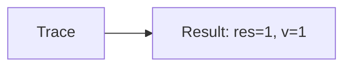
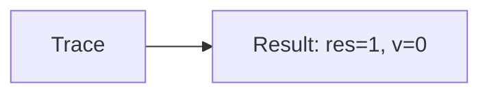

🔙 **[Kembali ke Daftar Soal](./README.md)**

---

# Latihan Soal Part C - Modul 02 - Set 09

### Soal 201
```cpp
// Razia: Short-Circuit AND
int razia = 51, v = 0;
if (razia > 50 && ++v > 0) res = 1;
else res = 0;
```
**Pertanyaan:**
1. Berapakah hasil akhirnya?
2. Deskripsikan alur pikir 'Compiler Manusia' untuk soal ini!

**Jawaban & Diagnosis:**
1. **res=1, v=1**
2. Razia 51 > 50? Ya (v naik).

**Mermaid Flowchart:**


---
### Soal 202
```cpp
// Ujian: Short-Circuit OR
int ujian = 81, v = 0;
if (ujian < 50 || ++v > 0) res = 1;
else res = 0;
```
**Pertanyaan:**
1. Berapakah hasil akhirnya?
2. Deskripsikan alur pikir 'Compiler Manusia' untuk soal ini!

**Jawaban & Diagnosis:**
1. **res=1, v=1**
2. Ujian 81 < 50? Tidak (v naik).

**Mermaid Flowchart:**


---
### Soal 203
```cpp
// Promo: Short-Circuit AND
int promo = 63, v = 0;
if (promo > 50 && ++v > 0) res = 1;
else res = 0;
```
**Pertanyaan:**
1. Berapakah hasil akhirnya?
2. Deskripsikan alur pikir 'Compiler Manusia' untuk soal ini!

**Jawaban & Diagnosis:**
1. **res=1, v=1**
2. Promo 63 > 50? Ya (v naik).

**Mermaid Flowchart:**


---
### Soal 204
```cpp
// Level: Short-Circuit OR
int level = 30, v = 0;
if (level < 50 || ++v > 0) res = 1;
else res = 0;
```
**Pertanyaan:**
1. Berapakah hasil akhirnya?
2. Deskripsikan alur pikir 'Compiler Manusia' untuk soal ini!

**Jawaban & Diagnosis:**
1. **res=1, v=0**
2. Level 30 < 50? Ya (v=0).

**Mermaid Flowchart:**


---
### Soal 205
```cpp
// Tiket: Short-Circuit AND
int tiket = 30, v = 0;
if (tiket > 50 && ++v > 0) res = 1;
else res = 0;
```
**Pertanyaan:**
1. Berapakah hasil akhirnya?
2. Deskripsikan alur pikir 'Compiler Manusia' untuk soal ini!

**Jawaban & Diagnosis:**
1. **res=0, v=0**
2. Tiket 30 > 50? Tidak (v=0).

**Mermaid Flowchart:**


---
### Soal 206
```cpp
// VIP: Short-Circuit OR
int vip = 42, v = 0;
if (vip < 50 || ++v > 0) res = 1;
else res = 0;
```
**Pertanyaan:**
1. Berapakah hasil akhirnya?
2. Deskripsikan alur pikir 'Compiler Manusia' untuk soal ini!

**Jawaban & Diagnosis:**
1. **res=1, v=0**
2. VIP 42 < 50? Ya (v=0).

**Mermaid Flowchart:**


---
### Soal 207
```cpp
// Denda: Short-Circuit AND
int denda = 86, v = 0;
if (denda > 50 && ++v > 0) res = 1;
else res = 0;
```
**Pertanyaan:**
1. Berapakah hasil akhirnya?
2. Deskripsikan alur pikir 'Compiler Manusia' untuk soal ini!

**Jawaban & Diagnosis:**
1. **res=1, v=1**
2. Denda 86 > 50? Ya (v naik).

**Mermaid Flowchart:**


---
### Soal 208
```cpp
// Bonus: Short-Circuit OR
int bonus = 44, v = 0;
if (bonus < 50 || ++v > 0) res = 1;
else res = 0;
```
**Pertanyaan:**
1. Berapakah hasil akhirnya?
2. Deskripsikan alur pikir 'Compiler Manusia' untuk soal ini!

**Jawaban & Diagnosis:**
1. **res=1, v=0**
2. Bonus 44 < 50? Ya (v=0).

**Mermaid Flowchart:**


---
### Soal 209
```cpp
// Stok: Short-Circuit AND
int stok = 47, v = 0;
if (stok > 50 && ++v > 0) res = 1;
else res = 0;
```
**Pertanyaan:**
1. Berapakah hasil akhirnya?
2. Deskripsikan alur pikir 'Compiler Manusia' untuk soal ini!

**Jawaban & Diagnosis:**
1. **res=0, v=0**
2. Stok 47 > 50? Tidak (v=0).

**Mermaid Flowchart:**


---
### Soal 210
```cpp
// Cuaca: Short-Circuit OR
int cuaca = 84, v = 0;
if (cuaca < 50 || ++v > 0) res = 1;
else res = 0;
```
**Pertanyaan:**
1. Berapakah hasil akhirnya?
2. Deskripsikan alur pikir 'Compiler Manusia' untuk soal ini!

**Jawaban & Diagnosis:**
1. **res=1, v=1**
2. Cuaca 84 < 50? Tidak (v naik).

**Mermaid Flowchart:**


---
### Soal 211
```cpp
// Lampu: Short-Circuit AND
int lampu = 35, v = 0;
if (lampu > 50 && ++v > 0) res = 1;
else res = 0;
```
**Pertanyaan:**
1. Berapakah hasil akhirnya?
2. Deskripsikan alur pikir 'Compiler Manusia' untuk soal ini!

**Jawaban & Diagnosis:**
1. **res=0, v=0**
2. Lampu 35 > 50? Tidak (v=0).

**Mermaid Flowchart:**


---
### Soal 212
```cpp
// Saklar: Short-Circuit OR
int saklar = 56, v = 0;
if (saklar < 50 || ++v > 0) res = 1;
else res = 0;
```
**Pertanyaan:**
1. Berapakah hasil akhirnya?
2. Deskripsikan alur pikir 'Compiler Manusia' untuk soal ini!

**Jawaban & Diagnosis:**
1. **res=1, v=1**
2. Saklar 56 < 50? Tidak (v naik).

**Mermaid Flowchart:**


---
### Soal 213
```cpp
// Pintu: Short-Circuit AND
int pintu = 34, v = 0;
if (pintu > 50 && ++v > 0) res = 1;
else res = 0;
```
**Pertanyaan:**
1. Berapakah hasil akhirnya?
2. Deskripsikan alur pikir 'Compiler Manusia' untuk soal ini!

**Jawaban & Diagnosis:**
1. **res=0, v=0**
2. Pintu 34 > 50? Tidak (v=0).

**Mermaid Flowchart:**


---
### Soal 214
```cpp
// Alarm: Short-Circuit OR
int alarm = 58, v = 0;
if (alarm < 50 || ++v > 0) res = 1;
else res = 0;
```
**Pertanyaan:**
1. Berapakah hasil akhirnya?
2. Deskripsikan alur pikir 'Compiler Manusia' untuk soal ini!

**Jawaban & Diagnosis:**
1. **res=1, v=1**
2. Alarm 58 < 50? Tidak (v naik).

**Mermaid Flowchart:**


---
### Soal 215
```cpp
// Suhu: Short-Circuit AND
int suhu = 77, v = 0;
if (suhu > 50 && ++v > 0) res = 1;
else res = 0;
```
**Pertanyaan:**
1. Berapakah hasil akhirnya?
2. Deskripsikan alur pikir 'Compiler Manusia' untuk soal ini!

**Jawaban & Diagnosis:**
1. **res=1, v=1**
2. Suhu 77 > 50? Ya (v naik).

**Mermaid Flowchart:**


---
### Soal 216
```cpp
// Listrik: Short-Circuit OR
int listrik = 36, v = 0;
if (listrik < 50 || ++v > 0) res = 1;
else res = 0;
```
**Pertanyaan:**
1. Berapakah hasil akhirnya?
2. Deskripsikan alur pikir 'Compiler Manusia' untuk soal ini!

**Jawaban & Diagnosis:**
1. **res=1, v=0**
2. Listrik 36 < 50? Ya (v=0).

**Mermaid Flowchart:**


---
### Soal 217
```cpp
// Air: Short-Circuit AND
int air = 61, v = 0;
if (air > 50 && ++v > 0) res = 1;
else res = 0;
```
**Pertanyaan:**
1. Berapakah hasil akhirnya?
2. Deskripsikan alur pikir 'Compiler Manusia' untuk soal ini!

**Jawaban & Diagnosis:**
1. **res=1, v=1**
2. Air 61 > 50? Ya (v naik).

**Mermaid Flowchart:**


---
### Soal 218
```cpp
// Gas: Short-Circuit OR
int gas = 25, v = 0;
if (gas < 50 || ++v > 0) res = 1;
else res = 0;
```
**Pertanyaan:**
1. Berapakah hasil akhirnya?
2. Deskripsikan alur pikir 'Compiler Manusia' untuk soal ini!

**Jawaban & Diagnosis:**
1. **res=1, v=0**
2. Gas 25 < 50? Ya (v=0).

**Mermaid Flowchart:**


---
### Soal 219
```cpp
// Bensin: Short-Circuit AND
int bensin = 32, v = 0;
if (bensin > 50 && ++v > 0) res = 1;
else res = 0;
```
**Pertanyaan:**
1. Berapakah hasil akhirnya?
2. Deskripsikan alur pikir 'Compiler Manusia' untuk soal ini!

**Jawaban & Diagnosis:**
1. **res=0, v=0**
2. Bensin 32 > 50? Tidak (v=0).

**Mermaid Flowchart:**


---
### Soal 220
```cpp
// Uang: Short-Circuit OR
int uang = 56, v = 0;
if (uang < 50 || ++v > 0) res = 1;
else res = 0;
```
**Pertanyaan:**
1. Berapakah hasil akhirnya?
2. Deskripsikan alur pikir 'Compiler Manusia' untuk soal ini!

**Jawaban & Diagnosis:**
1. **res=1, v=1**
2. Uang 56 < 50? Tidak (v naik).

**Mermaid Flowchart:**


---
### Soal 221
```cpp
// Dompet: Short-Circuit AND
int dompet = 26, v = 0;
if (dompet > 50 && ++v > 0) res = 1;
else res = 0;
```
**Pertanyaan:**
1. Berapakah hasil akhirnya?
2. Deskripsikan alur pikir 'Compiler Manusia' untuk soal ini!

**Jawaban & Diagnosis:**
1. **res=0, v=0**
2. Dompet 26 > 50? Tidak (v=0).

**Mermaid Flowchart:**
```mermaid
graph LR
A[Trace] --> B[Result: res=0, v=0]
```

---
### Soal 222
```cpp
// Saldo: Short-Circuit OR
int saldo = 49, v = 0;
if (saldo < 50 || ++v > 0) res = 1;
else res = 0;
```
**Pertanyaan:**
1. Berapakah hasil akhirnya?
2. Deskripsikan alur pikir 'Compiler Manusia' untuk soal ini!

**Jawaban & Diagnosis:**
1. **res=1, v=0**
2. Saldo 49 < 50? Ya (v=0).

**Mermaid Flowchart:**
```mermaid
graph LR
A[Trace] --> B[Result: res=1, v=0]
```

---
### Soal 223
```cpp
// Transfer: Short-Circuit AND
int transfer = 80, v = 0;
if (transfer > 50 && ++v > 0) res = 1;
else res = 0;
```
**Pertanyaan:**
1. Berapakah hasil akhirnya?
2. Deskripsikan alur pikir 'Compiler Manusia' untuk soal ini!

**Jawaban & Diagnosis:**
1. **res=1, v=1**
2. Transfer 80 > 50? Ya (v naik).

**Mermaid Flowchart:**
```mermaid
graph LR
A[Trace] --> B[Result: res=1, v=1]
```

---
### Soal 224
```cpp
// Bayar: Short-Circuit OR
int bayar = 71, v = 0;
if (bayar < 50 || ++v > 0) res = 1;
else res = 0;
```
**Pertanyaan:**
1. Berapakah hasil akhirnya?
2. Deskripsikan alur pikir 'Compiler Manusia' untuk soal ini!

**Jawaban & Diagnosis:**
1. **res=1, v=1**
2. Bayar 71 < 50? Tidak (v naik).

**Mermaid Flowchart:**
```mermaid
graph LR
A[Trace] --> B[Result: res=1, v=1]
```

---
### Soal 225
```cpp
// Hutang: Short-Circuit AND
int hutang = 62, v = 0;
if (hutang > 50 && ++v > 0) res = 1;
else res = 0;
```
**Pertanyaan:**
1. Berapakah hasil akhirnya?
2. Deskripsikan alur pikir 'Compiler Manusia' untuk soal ini!

**Jawaban & Diagnosis:**
1. **res=1, v=1**
2. Hutang 62 > 50? Ya (v naik).

**Mermaid Flowchart:**
```mermaid
graph LR
A[Trace] --> B[Result: res=1, v=1]
```

---
