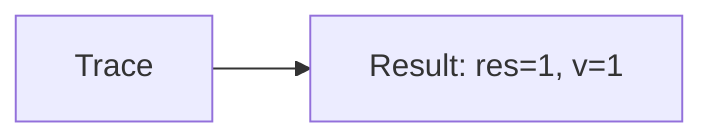

🔙 **[Kembali ke Daftar Soal](./README.md)**

---

# Latihan Soal Part C - Modul 02 - Set 10

### Soal 226
```cpp
// Piutang: Short-Circuit OR
int piutang = 45, v = 0;
if (piutang < 50 || ++v > 0) res = 1;
else res = 0;
```
**Pertanyaan:**
1. Berapakah hasil akhirnya?
2. Deskripsikan alur pikir 'Compiler Manusia' untuk soal ini!

**Jawaban & Diagnosis:**
1. **res=1, v=0**
2. Piutang 45 < 50? Ya (v=0).

**Mermaid Flowchart:**


---
### Soal 227
```cpp
// Investasi: Short-Circuit AND
int investasi = 34, v = 0;
if (investasi > 50 && ++v > 0) res = 1;
else res = 0;
```
**Pertanyaan:**
1. Berapakah hasil akhirnya?
2. Deskripsikan alur pikir 'Compiler Manusia' untuk soal ini!

**Jawaban & Diagnosis:**
1. **res=0, v=0**
2. Investasi 34 > 50? Tidak (v=0).

**Mermaid Flowchart:**


---
### Soal 228
```cpp
// Saham: Short-Circuit OR
int saham = 22, v = 0;
if (saham < 50 || ++v > 0) res = 1;
else res = 0;
```
**Pertanyaan:**
1. Berapakah hasil akhirnya?
2. Deskripsikan alur pikir 'Compiler Manusia' untuk soal ini!

**Jawaban & Diagnosis:**
1. **res=1, v=0**
2. Saham 22 < 50? Ya (v=0).

**Mermaid Flowchart:**


---
### Soal 229
```cpp
// Emas: Short-Circuit AND
int emas = 15, v = 0;
if (emas > 50 && ++v > 0) res = 1;
else res = 0;
```
**Pertanyaan:**
1. Berapakah hasil akhirnya?
2. Deskripsikan alur pikir 'Compiler Manusia' untuk soal ini!

**Jawaban & Diagnosis:**
1. **res=0, v=0**
2. Emas 15 > 50? Tidak (v=0).

**Mermaid Flowchart:**


---
### Soal 230
```cpp
// Kurs: Short-Circuit OR
int kurs = 53, v = 0;
if (kurs < 50 || ++v > 0) res = 1;
else res = 0;
```
**Pertanyaan:**
1. Berapakah hasil akhirnya?
2. Deskripsikan alur pikir 'Compiler Manusia' untuk soal ini!

**Jawaban & Diagnosis:**
1. **res=1, v=1**
2. Kurs 53 < 50? Tidak (v naik).

**Mermaid Flowchart:**


---
### Soal 231
```cpp
// Pajak: Short-Circuit AND
int pajak = 40, v = 0;
if (pajak > 50 && ++v > 0) res = 1;
else res = 0;
```
**Pertanyaan:**
1. Berapakah hasil akhirnya?
2. Deskripsikan alur pikir 'Compiler Manusia' untuk soal ini!

**Jawaban & Diagnosis:**
1. **res=0, v=0**
2. Pajak 40 > 50? Tidak (v=0).

**Mermaid Flowchart:**


---
### Soal 232
```cpp
// Diskon: Short-Circuit OR
int diskon = 48, v = 0;
if (diskon < 50 || ++v > 0) res = 1;
else res = 0;
```
**Pertanyaan:**
1. Berapakah hasil akhirnya?
2. Deskripsikan alur pikir 'Compiler Manusia' untuk soal ini!

**Jawaban & Diagnosis:**
1. **res=1, v=0**
2. Diskon 48 < 50? Ya (v=0).

**Mermaid Flowchart:**


---
### Soal 233
```cpp
// Voucher: Short-Circuit AND
int voucher = 13, v = 0;
if (voucher > 50 && ++v > 0) res = 1;
else res = 0;
```
**Pertanyaan:**
1. Berapakah hasil akhirnya?
2. Deskripsikan alur pikir 'Compiler Manusia' untuk soal ini!

**Jawaban & Diagnosis:**
1. **res=0, v=0**
2. Voucher 13 > 50? Tidak (v=0).

**Mermaid Flowchart:**


---
### Soal 234
```cpp
// Kupon: Short-Circuit OR
int kupon = 67, v = 0;
if (kupon < 50 || ++v > 0) res = 1;
else res = 0;
```
**Pertanyaan:**
1. Berapakah hasil akhirnya?
2. Deskripsikan alur pikir 'Compiler Manusia' untuk soal ini!

**Jawaban & Diagnosis:**
1. **res=1, v=1**
2. Kupon 67 < 50? Tidak (v naik).

**Mermaid Flowchart:**


---
### Soal 235
```cpp
// Reward: Short-Circuit AND
int reward = 33, v = 0;
if (reward > 50 && ++v > 0) res = 1;
else res = 0;
```
**Pertanyaan:**
1. Berapakah hasil akhirnya?
2. Deskripsikan alur pikir 'Compiler Manusia' untuk soal ini!

**Jawaban & Diagnosis:**
1. **res=0, v=0**
2. Reward 33 > 50? Tidak (v=0).

**Mermaid Flowchart:**


---
### Soal 236
```cpp
// Poin: Short-Circuit OR
int poin = 19, v = 0;
if (poin < 50 || ++v > 0) res = 1;
else res = 0;
```
**Pertanyaan:**
1. Berapakah hasil akhirnya?
2. Deskripsikan alur pikir 'Compiler Manusia' untuk soal ini!

**Jawaban & Diagnosis:**
1. **res=1, v=0**
2. Poin 19 < 50? Ya (v=0).

**Mermaid Flowchart:**


---
### Soal 237
```cpp
// Ranking: Short-Circuit AND
int ranking = 93, v = 0;
if (ranking > 50 && ++v > 0) res = 1;
else res = 0;
```
**Pertanyaan:**
1. Berapakah hasil akhirnya?
2. Deskripsikan alur pikir 'Compiler Manusia' untuk soal ini!

**Jawaban & Diagnosis:**
1. **res=1, v=1**
2. Ranking 93 > 50? Ya (v naik).

**Mermaid Flowchart:**


---
### Soal 238
```cpp
// Skor: Short-Circuit OR
int skor = 48, v = 0;
if (skor < 50 || ++v > 0) res = 1;
else res = 0;
```
**Pertanyaan:**
1. Berapakah hasil akhirnya?
2. Deskripsikan alur pikir 'Compiler Manusia' untuk soal ini!

**Jawaban & Diagnosis:**
1. **res=1, v=0**
2. Skor 48 < 50? Ya (v=0).

**Mermaid Flowchart:**


---
### Soal 239
```cpp
// Winrate: Short-Circuit AND
int winrate = 50, v = 0;
if (winrate > 50 && ++v > 0) res = 1;
else res = 0;
```
**Pertanyaan:**
1. Berapakah hasil akhirnya?
2. Deskripsikan alur pikir 'Compiler Manusia' untuk soal ini!

**Jawaban & Diagnosis:**
1. **res=0, v=0**
2. Winrate 50 > 50? Tidak (v=0).

**Mermaid Flowchart:**


---
### Soal 240
```cpp
// KDR: Short-Circuit OR
int kdr = 85, v = 0;
if (kdr < 50 || ++v > 0) res = 1;
else res = 0;
```
**Pertanyaan:**
1. Berapakah hasil akhirnya?
2. Deskripsikan alur pikir 'Compiler Manusia' untuk soal ini!

**Jawaban & Diagnosis:**
1. **res=1, v=1**
2. KDR 85 < 50? Tidak (v naik).

**Mermaid Flowchart:**


---
### Soal 241
```cpp
// Ping: Short-Circuit AND
int ping = 36, v = 0;
if (ping > 50 && ++v > 0) res = 1;
else res = 0;
```
**Pertanyaan:**
1. Berapakah hasil akhirnya?
2. Deskripsikan alur pikir 'Compiler Manusia' untuk soal ini!

**Jawaban & Diagnosis:**
1. **res=0, v=0**
2. Ping 36 > 50? Tidak (v=0).

**Mermaid Flowchart:**


---
### Soal 242
```cpp
// FPS: Short-Circuit OR
int fps = 44, v = 0;
if (fps < 50 || ++v > 0) res = 1;
else res = 0;
```
**Pertanyaan:**
1. Berapakah hasil akhirnya?
2. Deskripsikan alur pikir 'Compiler Manusia' untuk soal ini!

**Jawaban & Diagnosis:**
1. **res=1, v=0**
2. FPS 44 < 50? Ya (v=0).

**Mermaid Flowchart:**


---
### Soal 243
```cpp
// Lag: Short-Circuit AND
int lag = 34, v = 0;
if (lag > 50 && ++v > 0) res = 1;
else res = 0;
```
**Pertanyaan:**
1. Berapakah hasil akhirnya?
2. Deskripsikan alur pikir 'Compiler Manusia' untuk soal ini!

**Jawaban & Diagnosis:**
1. **res=0, v=0**
2. Lag 34 > 50? Tidak (v=0).

**Mermaid Flowchart:**


---
### Soal 244
```cpp
// Crash: Short-Circuit OR
int crash = 16, v = 0;
if (crash < 50 || ++v > 0) res = 1;
else res = 0;
```
**Pertanyaan:**
1. Berapakah hasil akhirnya?
2. Deskripsikan alur pikir 'Compiler Manusia' untuk soal ini!

**Jawaban & Diagnosis:**
1. **res=1, v=0**
2. Crash 16 < 50? Ya (v=0).

**Mermaid Flowchart:**


---
### Soal 245
```cpp
// Update: Short-Circuit AND
int update = 42, v = 0;
if (update > 50 && ++v > 0) res = 1;
else res = 0;
```
**Pertanyaan:**
1. Berapakah hasil akhirnya?
2. Deskripsikan alur pikir 'Compiler Manusia' untuk soal ini!

**Jawaban & Diagnosis:**
1. **res=0, v=0**
2. Update 42 > 50? Tidak (v=0).

**Mermaid Flowchart:**


---
### Soal 246
```cpp
// Patch: Short-Circuit OR
int patch = 36, v = 0;
if (patch < 50 || ++v > 0) res = 1;
else res = 0;
```
**Pertanyaan:**
1. Berapakah hasil akhirnya?
2. Deskripsikan alur pikir 'Compiler Manusia' untuk soal ini!

**Jawaban & Diagnosis:**
1. **res=1, v=0**
2. Patch 36 < 50? Ya (v=0).

**Mermaid Flowchart:**
```mermaid
graph LR
A[Trace] --> B[Result: res=1, v=0]
```

---
### Soal 247
```cpp
// Server: Short-Circuit AND
int server = 43, v = 0;
if (server > 50 && ++v > 0) res = 1;
else res = 0;
```
**Pertanyaan:**
1. Berapakah hasil akhirnya?
2. Deskripsikan alur pikir 'Compiler Manusia' untuk soal ini!

**Jawaban & Diagnosis:**
1. **res=0, v=0**
2. Server 43 > 50? Tidak (v=0).

**Mermaid Flowchart:**
```mermaid
graph LR
A[Trace] --> B[Result: res=0, v=0]
```

---
### Soal 248
```cpp
// Client: Short-Circuit OR
int client = 15, v = 0;
if (client < 50 || ++v > 0) res = 1;
else res = 0;
```
**Pertanyaan:**
1. Berapakah hasil akhirnya?
2. Deskripsikan alur pikir 'Compiler Manusia' untuk soal ini!

**Jawaban & Diagnosis:**
1. **res=1, v=0**
2. Client 15 < 50? Ya (v=0).

**Mermaid Flowchart:**
```mermaid
graph LR
A[Trace] --> B[Result: res=1, v=0]
```

---
### Soal 249
```cpp
// Database: Short-Circuit AND
int database = 96, v = 0;
if (database > 50 && ++v > 0) res = 1;
else res = 0;
```
**Pertanyaan:**
1. Berapakah hasil akhirnya?
2. Deskripsikan alur pikir 'Compiler Manusia' untuk soal ini!

**Jawaban & Diagnosis:**
1. **res=1, v=1**
2. Database 96 > 50? Ya (v naik).

**Mermaid Flowchart:**
```mermaid
graph LR
A[Trace] --> B[Result: res=1, v=1]
```

---
### Soal 250
```cpp
// API: Short-Circuit OR
int api = 29, v = 0;
if (api < 50 || ++v > 0) res = 1;
else res = 0;
```
**Pertanyaan:**
1. Berapakah hasil akhirnya?
2. Deskripsikan alur pikir 'Compiler Manusia' untuk soal ini!

**Jawaban & Diagnosis:**
1. **res=1, v=0**
2. API 29 < 50? Ya (v=0).

**Mermaid Flowchart:**
```mermaid
graph LR
A[Trace] --> B[Result: res=1, v=0]
```

---
