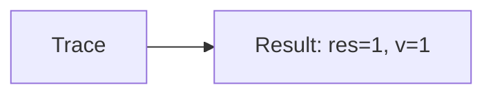
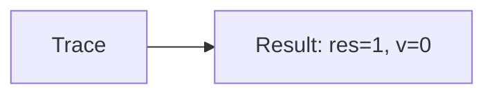

🔙 **[Kembali ke Daftar Soal](./README.md)**

---

# Latihan Soal Part C - Modul 02 - Set 12

### Soal 276
```cpp
// Bintang: Short-Circuit OR
int bintang = 71, v = 0;
if (bintang < 50 || ++v > 0) res = 1;
else res = 0;
```
**Pertanyaan:**
1. Berapakah hasil akhirnya?
2. Deskripsikan alur pikir 'Compiler Manusia' untuk soal ini!

**Jawaban & Diagnosis:**
1. **res=1, v=1**
2. Bintang 71 < 50? Tidak (v naik).

**Mermaid Flowchart:**


---
### Soal 277
```cpp
// Planet: Short-Circuit AND
int planet = 24, v = 0;
if (planet > 50 && ++v > 0) res = 1;
else res = 0;
```
**Pertanyaan:**
1. Berapakah hasil akhirnya?
2. Deskripsikan alur pikir 'Compiler Manusia' untuk soal ini!

**Jawaban & Diagnosis:**
1. **res=0, v=0**
2. Planet 24 > 50? Tidak (v=0).

**Mermaid Flowchart:**


---
### Soal 278
```cpp
// Bulan: Short-Circuit OR
int bulan = 69, v = 0;
if (bulan < 50 || ++v > 0) res = 1;
else res = 0;
```
**Pertanyaan:**
1. Berapakah hasil akhirnya?
2. Deskripsikan alur pikir 'Compiler Manusia' untuk soal ini!

**Jawaban & Diagnosis:**
1. **res=1, v=1**
2. Bulan 69 < 50? Tidak (v naik).

**Mermaid Flowchart:**


---
### Soal 279
```cpp
// Matahari: Short-Circuit AND
int matahari = 91, v = 0;
if (matahari > 50 && ++v > 0) res = 1;
else res = 0;
```
**Pertanyaan:**
1. Berapakah hasil akhirnya?
2. Deskripsikan alur pikir 'Compiler Manusia' untuk soal ini!

**Jawaban & Diagnosis:**
1. **res=1, v=1**
2. Matahari 91 > 50? Ya (v naik).

**Mermaid Flowchart:**


---
### Soal 280
```cpp
// Langit: Short-Circuit OR
int langit = 74, v = 0;
if (langit < 50 || ++v > 0) res = 1;
else res = 0;
```
**Pertanyaan:**
1. Berapakah hasil akhirnya?
2. Deskripsikan alur pikir 'Compiler Manusia' untuk soal ini!

**Jawaban & Diagnosis:**
1. **res=1, v=1**
2. Langit 74 < 50? Tidak (v naik).

**Mermaid Flowchart:**


---
### Soal 281
```cpp
// Awan: Short-Circuit AND
int awan = 31, v = 0;
if (awan > 50 && ++v > 0) res = 1;
else res = 0;
```
**Pertanyaan:**
1. Berapakah hasil akhirnya?
2. Deskripsikan alur pikir 'Compiler Manusia' untuk soal ini!

**Jawaban & Diagnosis:**
1. **res=0, v=0**
2. Awan 31 > 50? Tidak (v=0).

**Mermaid Flowchart:**


---
### Soal 282
```cpp
// Hujan: Short-Circuit OR
int hujan = 69, v = 0;
if (hujan < 50 || ++v > 0) res = 1;
else res = 0;
```
**Pertanyaan:**
1. Berapakah hasil akhirnya?
2. Deskripsikan alur pikir 'Compiler Manusia' untuk soal ini!

**Jawaban & Diagnosis:**
1. **res=1, v=1**
2. Hujan 69 < 50? Tidak (v naik).

**Mermaid Flowchart:**


---
### Soal 283
```cpp
// Angin: Short-Circuit AND
int angin = 29, v = 0;
if (angin > 50 && ++v > 0) res = 1;
else res = 0;
```
**Pertanyaan:**
1. Berapakah hasil akhirnya?
2. Deskripsikan alur pikir 'Compiler Manusia' untuk soal ini!

**Jawaban & Diagnosis:**
1. **res=0, v=0**
2. Angin 29 > 50? Tidak (v=0).

**Mermaid Flowchart:**


---
### Soal 284
```cpp
// Petir: Short-Circuit OR
int petir = 72, v = 0;
if (petir < 50 || ++v > 0) res = 1;
else res = 0;
```
**Pertanyaan:**
1. Berapakah hasil akhirnya?
2. Deskripsikan alur pikir 'Compiler Manusia' untuk soal ini!

**Jawaban & Diagnosis:**
1. **res=1, v=1**
2. Petir 72 < 50? Tidak (v naik).

**Mermaid Flowchart:**


---
### Soal 285
```cpp
// Salju: Short-Circuit AND
int salju = 71, v = 0;
if (salju > 50 && ++v > 0) res = 1;
else res = 0;
```
**Pertanyaan:**
1. Berapakah hasil akhirnya?
2. Deskripsikan alur pikir 'Compiler Manusia' untuk soal ini!

**Jawaban & Diagnosis:**
1. **res=1, v=1**
2. Salju 71 > 50? Ya (v naik).

**Mermaid Flowchart:**


---
### Soal 286
```cpp
// Es: Short-Circuit OR
int es = 79, v = 0;
if (es < 50 || ++v > 0) res = 1;
else res = 0;
```
**Pertanyaan:**
1. Berapakah hasil akhirnya?
2. Deskripsikan alur pikir 'Compiler Manusia' untuk soal ini!

**Jawaban & Diagnosis:**
1. **res=1, v=1**
2. Es 79 < 50? Tidak (v naik).

**Mermaid Flowchart:**


---
### Soal 287
```cpp
// Api: Short-Circuit AND
int api = 63, v = 0;
if (api > 50 && ++v > 0) res = 1;
else res = 0;
```
**Pertanyaan:**
1. Berapakah hasil akhirnya?
2. Deskripsikan alur pikir 'Compiler Manusia' untuk soal ini!

**Jawaban & Diagnosis:**
1. **res=1, v=1**
2. Api 63 > 50? Ya (v naik).

**Mermaid Flowchart:**


---
### Soal 288
```cpp
// Asap: Short-Circuit OR
int asap = 97, v = 0;
if (asap < 50 || ++v > 0) res = 1;
else res = 0;
```
**Pertanyaan:**
1. Berapakah hasil akhirnya?
2. Deskripsikan alur pikir 'Compiler Manusia' untuk soal ini!

**Jawaban & Diagnosis:**
1. **res=1, v=1**
2. Asap 97 < 50? Tidak (v naik).

**Mermaid Flowchart:**


---
### Soal 289
```cpp
// Debu: Short-Circuit AND
int debu = 23, v = 0;
if (debu > 50 && ++v > 0) res = 1;
else res = 0;
```
**Pertanyaan:**
1. Berapakah hasil akhirnya?
2. Deskripsikan alur pikir 'Compiler Manusia' untuk soal ini!

**Jawaban & Diagnosis:**
1. **res=0, v=0**
2. Debu 23 > 50? Tidak (v=0).

**Mermaid Flowchart:**


---
### Soal 290
```cpp
// Polusi: Short-Circuit OR
int polusi = 12, v = 0;
if (polusi < 50 || ++v > 0) res = 1;
else res = 0;
```
**Pertanyaan:**
1. Berapakah hasil akhirnya?
2. Deskripsikan alur pikir 'Compiler Manusia' untuk soal ini!

**Jawaban & Diagnosis:**
1. **res=1, v=0**
2. Polusi 12 < 50? Ya (v=0).

**Mermaid Flowchart:**


---
### Soal 291
```cpp
// Sampah: Short-Circuit AND
int sampah = 12, v = 0;
if (sampah > 50 && ++v > 0) res = 1;
else res = 0;
```
**Pertanyaan:**
1. Berapakah hasil akhirnya?
2. Deskripsikan alur pikir 'Compiler Manusia' untuk soal ini!

**Jawaban & Diagnosis:**
1. **res=0, v=0**
2. Sampah 12 > 50? Tidak (v=0).

**Mermaid Flowchart:**


---
### Soal 292
```cpp
// DaurUlang: Short-Circuit OR
int daurulang = 55, v = 0;
if (daurulang < 50 || ++v > 0) res = 1;
else res = 0;
```
**Pertanyaan:**
1. Berapakah hasil akhirnya?
2. Deskripsikan alur pikir 'Compiler Manusia' untuk soal ini!

**Jawaban & Diagnosis:**
1. **res=1, v=1**
2. DaurUlang 55 < 50? Tidak (v naik).

**Mermaid Flowchart:**


---
### Soal 293
```cpp
// Plastik: Short-Circuit AND
int plastik = 31, v = 0;
if (plastik > 50 && ++v > 0) res = 1;
else res = 0;
```
**Pertanyaan:**
1. Berapakah hasil akhirnya?
2. Deskripsikan alur pikir 'Compiler Manusia' untuk soal ini!

**Jawaban & Diagnosis:**
1. **res=0, v=0**
2. Plastik 31 > 50? Tidak (v=0).

**Mermaid Flowchart:**


---
### Soal 294
```cpp
// Kaca: Short-Circuit OR
int kaca = 40, v = 0;
if (kaca < 50 || ++v > 0) res = 1;
else res = 0;
```
**Pertanyaan:**
1. Berapakah hasil akhirnya?
2. Deskripsikan alur pikir 'Compiler Manusia' untuk soal ini!

**Jawaban & Diagnosis:**
1. **res=1, v=0**
2. Kaca 40 < 50? Ya (v=0).

**Mermaid Flowchart:**


---
### Soal 295
```cpp
// Logam: Short-Circuit AND
int logam = 65, v = 0;
if (logam > 50 && ++v > 0) res = 1;
else res = 0;
```
**Pertanyaan:**
1. Berapakah hasil akhirnya?
2. Deskripsikan alur pikir 'Compiler Manusia' untuk soal ini!

**Jawaban & Diagnosis:**
1. **res=1, v=1**
2. Logam 65 > 50? Ya (v naik).

**Mermaid Flowchart:**


---
### Soal 296
```cpp
// Kayu: Short-Circuit OR
int kayu = 57, v = 0;
if (kayu < 50 || ++v > 0) res = 1;
else res = 0;
```
**Pertanyaan:**
1. Berapakah hasil akhirnya?
2. Deskripsikan alur pikir 'Compiler Manusia' untuk soal ini!

**Jawaban & Diagnosis:**
1. **res=1, v=1**
2. Kayu 57 < 50? Tidak (v naik).

**Mermaid Flowchart:**
```mermaid
graph LR
A[Trace] --> B[Result: res=1, v=1]
```

---
### Soal 297
```cpp
// Kertas: Short-Circuit AND
int kertas = 87, v = 0;
if (kertas > 50 && ++v > 0) res = 1;
else res = 0;
```
**Pertanyaan:**
1. Berapakah hasil akhirnya?
2. Deskripsikan alur pikir 'Compiler Manusia' untuk soal ini!

**Jawaban & Diagnosis:**
1. **res=1, v=1**
2. Kertas 87 > 50? Ya (v naik).

**Mermaid Flowchart:**
```mermaid
graph LR
A[Trace] --> B[Result: res=1, v=1]
```

---
### Soal 298
```cpp
// Razia: Short-Circuit OR
int razia = 11, v = 0;
if (razia < 50 || ++v > 0) res = 1;
else res = 0;
```
**Pertanyaan:**
1. Berapakah hasil akhirnya?
2. Deskripsikan alur pikir 'Compiler Manusia' untuk soal ini!

**Jawaban & Diagnosis:**
1. **res=1, v=0**
2. Razia 11 < 50? Ya (v=0).

**Mermaid Flowchart:**
```mermaid
graph LR
A[Trace] --> B[Result: res=1, v=0]
```

---
### Soal 299
```cpp
// Ujian: Short-Circuit AND
int ujian = 22, v = 0;
if (ujian > 50 && ++v > 0) res = 1;
else res = 0;
```
**Pertanyaan:**
1. Berapakah hasil akhirnya?
2. Deskripsikan alur pikir 'Compiler Manusia' untuk soal ini!

**Jawaban & Diagnosis:**
1. **res=0, v=0**
2. Ujian 22 > 50? Tidak (v=0).

**Mermaid Flowchart:**
```mermaid
graph LR
A[Trace] --> B[Result: res=0, v=0]
```

---
### Soal 300
```cpp
// Promo: Short-Circuit OR
int promo = 19, v = 0;
if (promo < 50 || ++v > 0) res = 1;
else res = 0;
```
**Pertanyaan:**
1. Berapakah hasil akhirnya?
2. Deskripsikan alur pikir 'Compiler Manusia' untuk soal ini!

**Jawaban & Diagnosis:**
1. **res=1, v=0**
2. Promo 19 < 50? Ya (v=0).

**Mermaid Flowchart:**
```mermaid
graph LR
A[Trace] --> B[Result: res=1, v=0]
```

---
