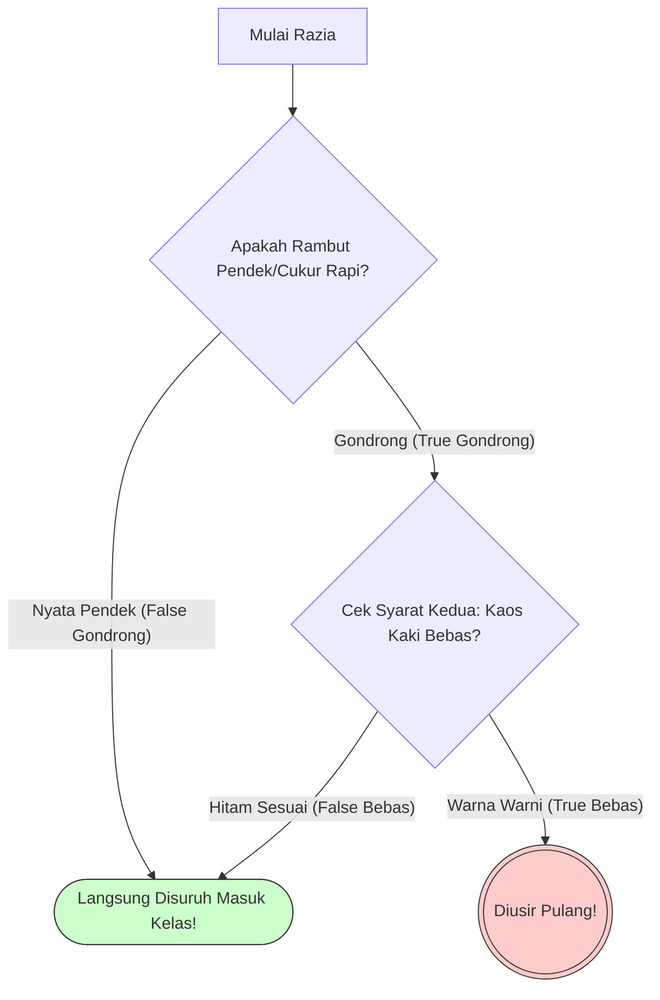
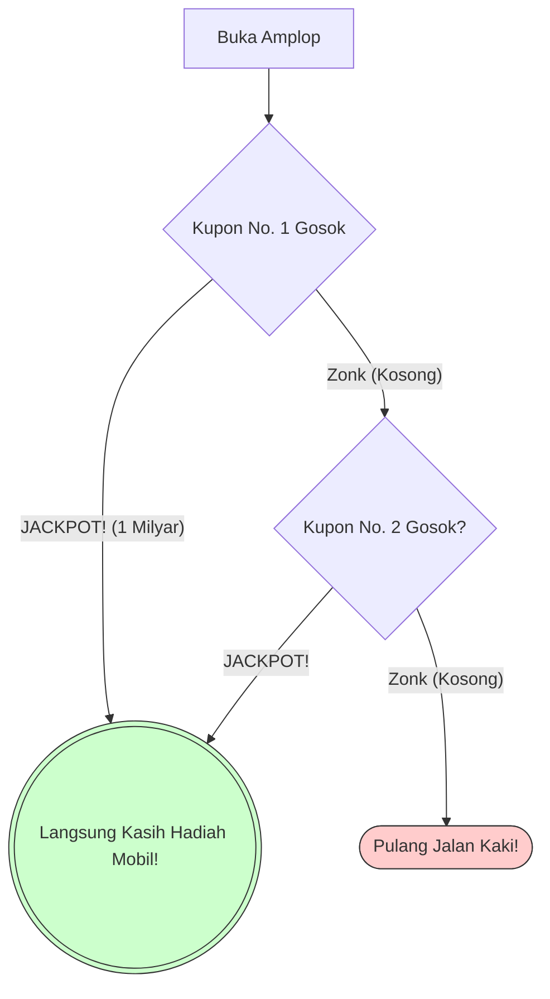

# 2. Percabangan & Logika Boolean (Seni Razia Komputer)

Sekarang saatnya kamu menjadi Pak Dengklek sebagai Polisi Gerbang Tol (atau Guru BP).
Kode di OSN-K penuh dengan blok pengawal keamanan yang disebut **Percabangan (`if`, `else if`, `else`)** yang dirakit menggunakan gembok kode **Logika Boolean (`&&` AND, `||` OR)**.

Mesin C++ itu **Super Kaku** dan **Super Egois Pemalas**. Mari kita bongkar anatomi kedua sikap buruk mesin ini supaya kamu tidak terjebak men-Trace cabang yang salah.


---

### 📝 Latihan Soal Tracing
Sudah paham teorinya? Uji ketajaman matamu di sini:
👉 **[Bank Soal Modul 02: Percabangan (300 Soal)](./latihan/README.md)**

---

## 🚦 A. Gembok Persyaratan (Kaku dan Buta Masa Lalu)

Percabangan `if` menuntut pelacakan variabel di lembar buram-mu harus **100% presisi**.

```cpp
int nyawa = 5;

if (nyawa > 5) {
    printf("Bos Nyala");
} else if (nyawa == 5) {
    printf("Siaga Satu");
} else {
    printf("Game Over");
}
```

**Analisis Compiler Manusia-mu:**
- Baris `if (nyawa > 5)`: Apakah $5$ lebih besar dari $5$? **SALAH (FALSE)**! ($5$ itu sama besar, bukan lebih besar). Karena itu, blok ini otomatis mental.
- Baris `else if (nyawa == 5)`: Apakah $5$ sama presisi eksak seidentik-identiknya dengan $5$?  **BENAR (TRUE)**. Cetak `Siaga Satu`.

### ⚠️ Jebakan Batman #3: Ketipu Tanda Sama Dengan Ganda (`==` vs `=`)
Hati-hati, OSN Informatika hobinya memakan *kewarasan* matamu:
- `x == 5`: Ini TANDA TANYA *"Apakah X itu 5?"*
- `x = 5`: Ini TANDA PERINTAH MUTLAK *"Ganti isi kotak X sekarang jadi bernilai 5, bodo amat tadinya isi apa!"*
Jadi kalau ketemu jebakan bodoh di percabangan:
```cpp
int x = 10;
if (x = 5) { // <--- JEBAKAN JAHAT INI VALID DI C++!
   // x benar-benar diobrak abrik jadi 5, dan kondisinya dianggap TRUE!
}
```
*(Tapi santai, standard etika silabus OSN-K Indonesia jarang mengeluarkan trik jahat receh syntax C++ level begini, rata-rata soal pure berfokus di algoritmanya).*

---

## 💤 B. Evaluasi Sirkuit-Pendek (Kemalasan Paripurna Mesin C++)

Nah ini dia **Senjata Utama Level Dewa** di kodingan panjang OSN-K. Seringkali percabangan menggunakan konektor ganda:
- `&&` (DAN / AND): DUA-DUANYA WAJIB BENAR!
- `||` (ATAU / OR): CUKUP SALAH SATU AJA BENAR, BERES!

Apa rahasianya? Mesin C++ itu sifatnya egois memikirkan jalan pintas (**Short-Circuit Evaluation**).

### 1. Kemalasan AND (`&&`) -> *Razia BP Rambut & Kaos Kaki*
Bayangkan peraturan BP Sekolah: 
> *"Kamu akan diusir pulang `JIKA (Rambut Gondrong && Kaos Kaki Bebas)`."*


**📖 Cara Membaca Grafik "*Short-Circuit AND*":**
- Saat murid masuk (Mulai Razia), Juru Cek **hanya mengecek Kotak B (Rambut)**.
- Jika syarat pertama sudah salah (Ternyata rambutnya pendek / *False Gondrong*), panah merah penalti langsung menembak ke titik putus **Kotak Hijau C**. 
- Perhatikan bahwa jika jalurnya ke Ciri-Ciri Hijau, **Kotak D (Syarat Kaos Kaki) SAMA SEKALI TIDAK PERNAH DILEWATI/DIBACA!** 
- Itulah sifat "Sirkuit-Pendek" *AND*. Kalau syarat ganda di kiri udah gagal, syarat kanan murni diabaikan abadi.

Sistem kerja Guru BP (C++): Beliau narik murid satu-satu. Cek kepalanya. Eh ternyata rambut sang murid **Pendek / Cukur Rapi (FALSE untuk gondrong)**. 
Apakah Guru BP sudi menengok melihat sepatu/kaos kaki murid itu? **NGGAK PENTING!** Tentu aja NGGAK! Toh, rambutnya aja udah nggak gondrong, syarat `&& (DAN DUA-DUANYA)` udah pasti ambyar gagal total. Guru BP langsung tendang murid itu untuk masuk kelas tanpa melirik kaos kaki!

**Hukum Sirkuit-Pendek AND:**
Dalam `A && B`, **JIKA KONDISI `A` SUDAH FALSE (SALAH)**, C++ **BUTA DAN MENOLAK MEMBACA KONDISI `B`!** Murni ter-skip diabaikan!

### 2. Kemalasan OR (`||`) -> *Event Undian Mobil*
Bayangkan syarat dapat Mobil di Mall: 
> *"Kamu berhak menang `JIKA (Kupon Nomor 1 Tembus || Kupon Nomor 2 Tembus)`."*


**📖 Cara Membaca Grafik "*Short-Circuit OR*":**
- Kita membuka Kupon 1 (Kotak B). Jika langsung tembus **JACKPOT**, panah lari secepat kilat ke Kotak Hijau C (Menang Mobil!).
- Panah dari B langsung ke C membuktikan bahwa **Kotak D (Kupon Ke-2) SAMA SEKALI BELUM DIGOSOK ATAU DIBACA**. Ya kan? Buat apa digosok lagi, hadiahnya udah di tangan!
- Inilah sifat pemalas "*Sirkuit-Pendek OR*". Syarat Kanan (`B` dari `A || B`) Kapan baru dibaca? Hanya jika dan hanya jika Syarat Kiri menderita kegagalan/ZONK.

Sistem C++: Menggosok Kupon Nomor 1. Eh, isinya **JACKPOT!! (TRUE)**.
Apakah sistem masih capek-capek menggosok melihat isi Kupon Nomor 2? **TIDAK PERLU!** Karena syarat `||` (ATAU), asal ada SATU saja yang nyantol lunas, seluruh gerbang tol langsung terbuka lebar kegirangan!

**Hukum Sirkuit-Pendek OR:**
Dalam `A || B`, **JIKA KONDISI `A` SUDAH TRUE (BENAR)**, C++ **BUTA DAN MENOLAK MEMBACA KONDISI `B`!** Pintu sukses langsung jebol saat iterasi pertama.

---

---
 
 ## 🚦 C. Analogi Tambahan: Navigasi Labirin Keputusan
 
 Jika kamu masih sering bingung membedakan kapan `else if` berhenti atau bagaimana `if` di dalam `if` bekerja, mari kita gunakan alat bantu imajinasi berikut:
 
 ### 🚪 1. Nested If: Pintu Keamanan Berlapis
 Kadang ada `if` yang berada di dalam `if` lain. 
 - **Analogi:** Bayangkan kamu masuk ke **Ruang Rahasia Bank**.
 - **Pintu 1:** Kamu harus punya Pin Kartu. Jika salah, kamu bahkan tidak bisa melihat pintu berikutnya.
 - **Pintu 2 (Nested):** Sudah masuk pintu 1, sekarang kamu harus scan sidik jari. 
 - **Poin Penting:** Kamu tidak akan pernah ditanya sidik jari kalau Pin Kartu-mu saja sudah salah. Inilah cara `if` bertingkat bekerja: Syarat dalam hanya diperiksa jika syarat luar sudah lolos.
 
 ### 🍜 2. Else-If Chain: Menu Kantin Sekolah
 Apa bedanya banyak `if` terpisah dengan rangkaian `if - else if - else`?
 - **Analogi:** Kamu sedang memesan makanan di kantin.
 - "Saya mau **Soto**. Kalau nggak ada, saya mau **Bakso**. Kalau nggak ada juga, ya sudah makan **Nasi Kuning** saja."
 - **Poin Penting:** Begitu penjual bilang "Soto ada!", kamu langsung pesan dan **TIDAK AKAN** menanyakan Bakso atau Nasi Kuning lagi. Di C++, sekali satu `else if` terpenuhi, mesin langsung "kenyang" dan melompat keluar dari seluruh rangkaian tersebut.
 
 ### 🙃 3. Operator NOT (`!`): Kacamata Kebalikan
 Simbol tanda seru `!` sering muncul untuk membalikkan logika.
 - **Analogi:** Ini adalah **Kacamata Hari Kebalikan**.
 - Jika `(lapar)` itu benar, maka `(!lapar)` itu salah (kenyang).
 - Di OSN-K, juri suka menulis `if (!menang)`. Artinya: "Jika TIDAK menang" atau dengan kata lain "Jika kalah". Kadang membaca kalimat kebalikannya jauh lebih mudah daripada men-trace variabelnya!
 
 ---
 
 ### Siap Di Uji Tracing?

Menguji tingkat kewaspadaan matamu sebagai *Compiler*:
```cpp
int uang = 100;
int dompet = 0;

if (uang > 500 && (dompet++ > 0)) {
    printf("Miliarder\n");
} else {
    printf("Dompet = %d", dompet);
}
```
*(Catatan: `dompet++` berfungsi menambah nyawa `dompet` sebesar 1 sesai evaluasi).*

**Diagnosis Logika Papan Tulis Juri C++:**
1. Mesin masuk ke `if (uang > 500)`. Apakah `100` lebih besar dari `500`? **BENAR-BENAR SALAH (FALSE)**!
2. Di sebelah teks ada konektor `&&`. 
3. *Short-Circuit Mode ON!* Karena sayap Kiri sudah **FALSE**, seluruh kalimat di kanan dipotong / dibuang sama mesin. C++ **MENOLAK** menjalankan `(dompet++ > 0)`.
4. Akibat hukum pemalasan ini, baris manipulasi mutasi `dompet++` sama sekali TIDAK PERNAH DIJALANKAN SEJARAH BUMI! Variable `dompet` tetap perawan tak tersentuh di angka `0`.
5. Mesin melompat ke `else`.
6. Teks mencetak mutlak `Dompet = 0`.

Apabila kamu dengan lugu mencetak "Dompet = 1" di jawaban Silangmu, kamu baru saja termakan ilusi dan kehilangan poin krusial OSN-K milikmu. Berhati-hatilah dengan egoisme mesin C++!

⏩ **Lanjut ke Modul Ketiga:** [Perulangan & Mesin Array (Trek Lari & Playlist Spotify)](./03-perulangan-dan-manipulasi-array.md)
