🔙 **[Kembali ke Daftar Soal](./README.md)**

---

# Latihan Soal Part C - Modul 03 - Set 01

### Soal 1
```cpp
int n = 10, s = 0;
while(n > 0) { s += n; n -= 1; }
```
**Pertanyaan:**
1. Berapakah hasil akhirnya?
2. Mengapa demikian?

**Jawaban & Diagnosis:**
1. **55**
2. Lihat Tracing.

**Mermaid Flowchart:**
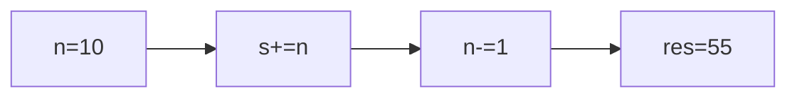

**📖 Penjelasan:**
**Langkah Tracing:**
1. Loop berjalan dengan langkah 1.
2. Hasil akumulasi: 55.

---
### Soal 2
```cpp
int s = 0;
for(int i=0; i<5; i+=3) s += i;
```
**Pertanyaan:**
1. Berapakah hasil akhirnya?
2. Mengapa demikian?

**Jawaban & Diagnosis:**
1. **3**
2. Lihat Tracing.

**Mermaid Flowchart:**
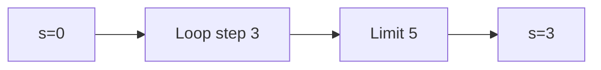

**📖 Penjelasan:**
**Langkah Tracing:**
1. Loop berjalan dengan langkah 3.
2. Hasil akumulasi: 3.

---
### Soal 3
```cpp
int s = 0;
for(int i=0; i<8; i+=3) s += i;
```
**Pertanyaan:**
1. Berapakah hasil akhirnya?
2. Mengapa demikian?

**Jawaban & Diagnosis:**
1. **9**
2. Lihat Tracing.

**Mermaid Flowchart:**
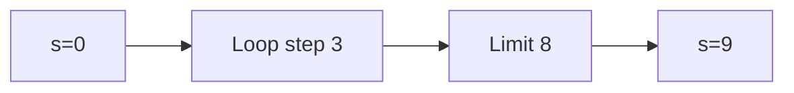

**📖 Penjelasan:**
**Langkah Tracing:**
1. Loop berjalan dengan langkah 3.
2. Hasil akumulasi: 9.

---
### Soal 4
```cpp
int s = 0;
for(int i=0; i<5; i+=1) s += i;
```
**Pertanyaan:**
1. Berapakah hasil akhirnya?
2. Mengapa demikian?

**Jawaban & Diagnosis:**
1. **10**
2. Lihat Tracing.

**Mermaid Flowchart:**
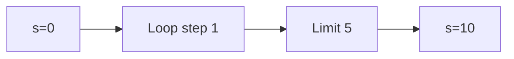

**📖 Penjelasan:**
**Langkah Tracing:**
1. Loop berjalan dengan langkah 1.
2. Hasil akumulasi: 10.

---
### Soal 5
```cpp
int n = 9, s = 0;
while(n > 0) { s += n; n -= 1; }
```
**Pertanyaan:**
1. Berapakah hasil akhirnya?
2. Mengapa demikian?

**Jawaban & Diagnosis:**
1. **45**
2. Lihat Tracing.

**Mermaid Flowchart:**
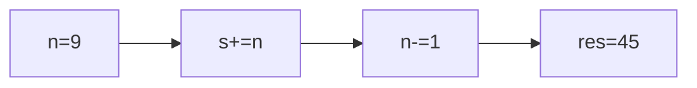

**📖 Penjelasan:**
**Langkah Tracing:**
1. Loop berjalan dengan langkah 1.
2. Hasil akumulasi: 45.

---
### Soal 6
```cpp
int n = 9, s = 0;
while(n > 0) { s += n; n -= 1; }
```
**Pertanyaan:**
1. Berapakah hasil akhirnya?
2. Mengapa demikian?

**Jawaban & Diagnosis:**
1. **45**
2. Lihat Tracing.

**Mermaid Flowchart:**


**📖 Penjelasan:**
**Langkah Tracing:**
1. Loop berjalan dengan langkah 1.
2. Hasil akumulasi: 45.

---
### Soal 7
```cpp
int s = 0;
for(int i=0; i<10; i+=1) s += i;
```
**Pertanyaan:**
1. Berapakah hasil akhirnya?
2. Mengapa demikian?

**Jawaban & Diagnosis:**
1. **45**
2. Lihat Tracing.

**Mermaid Flowchart:**
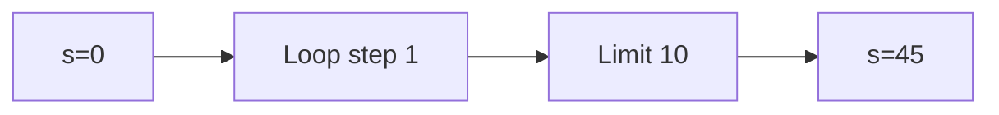

**📖 Penjelasan:**
**Langkah Tracing:**
1. Loop berjalan dengan langkah 1.
2. Hasil akumulasi: 45.

---
### Soal 8
```cpp
int n = 8, s = 0;
while(n > 0) { s += n; n -= 3; }
```
**Pertanyaan:**
1. Berapakah hasil akhirnya?
2. Mengapa demikian?

**Jawaban & Diagnosis:**
1. **15**
2. Lihat Tracing.

**Mermaid Flowchart:**
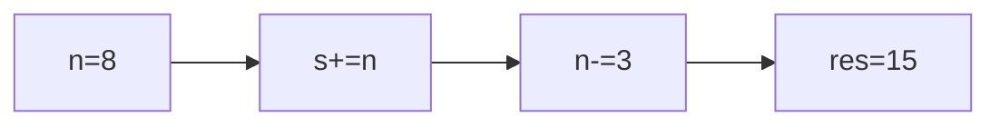

**📖 Penjelasan:**
**Langkah Tracing:**
1. Loop berjalan dengan langkah 3.
2. Hasil akumulasi: 15.

---
### Soal 9
```cpp
int s = 0;
for(int i=0; i<6; i+=1) s += i;
```
**Pertanyaan:**
1. Berapakah hasil akhirnya?
2. Mengapa demikian?

**Jawaban & Diagnosis:**
1. **15**
2. Lihat Tracing.

**Mermaid Flowchart:**
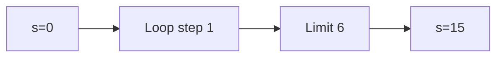

**📖 Penjelasan:**
**Langkah Tracing:**
1. Loop berjalan dengan langkah 1.
2. Hasil akumulasi: 15.

---
### Soal 10
```cpp
int s = 0;
for(int i=0; i<9; i+=3) s += i;
```
**Pertanyaan:**
1. Berapakah hasil akhirnya?
2. Mengapa demikian?

**Jawaban & Diagnosis:**
1. **9**
2. Lihat Tracing.

**Mermaid Flowchart:**


**📖 Penjelasan:**
**Langkah Tracing:**
1. Loop berjalan dengan langkah 3.
2. Hasil akumulasi: 9.

---
### Soal 11
```cpp
int s = 0;
for(int i=0; i<5; i+=2) s += i;
```
**Pertanyaan:**
1. Berapakah hasil akhirnya?
2. Mengapa demikian?

**Jawaban & Diagnosis:**
1. **6**
2. Lihat Tracing.

**Mermaid Flowchart:**


**📖 Penjelasan:**
**Langkah Tracing:**
1. Loop berjalan dengan langkah 2.
2. Hasil akumulasi: 6.

---
### Soal 12
```cpp
int s = 0;
for(int i=0; i<6; i+=1) s += i;
```
**Pertanyaan:**
1. Berapakah hasil akhirnya?
2. Mengapa demikian?

**Jawaban & Diagnosis:**
1. **15**
2. Lihat Tracing.

**Mermaid Flowchart:**


**📖 Penjelasan:**
**Langkah Tracing:**
1. Loop berjalan dengan langkah 1.
2. Hasil akumulasi: 15.

---
### Soal 13
```cpp
int n = 9, s = 0;
while(n > 0) { s += n; n -= 2; }
```
**Pertanyaan:**
1. Berapakah hasil akhirnya?
2. Mengapa demikian?

**Jawaban & Diagnosis:**
1. **25**
2. Lihat Tracing.

**Mermaid Flowchart:**
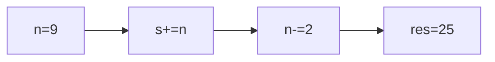

**📖 Penjelasan:**
**Langkah Tracing:**
1. Loop berjalan dengan langkah 2.
2. Hasil akumulasi: 25.

---
### Soal 14
```cpp
int s = 0;
for(int i=0; i<8; i+=1) s += i;
```
**Pertanyaan:**
1. Berapakah hasil akhirnya?
2. Mengapa demikian?

**Jawaban & Diagnosis:**
1. **28**
2. Lihat Tracing.

**Mermaid Flowchart:**
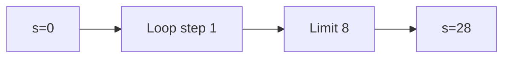

**📖 Penjelasan:**
**Langkah Tracing:**
1. Loop berjalan dengan langkah 1.
2. Hasil akumulasi: 28.

---
### Soal 15
```cpp
int s = 0;
for(int i=0; i<10; i+=1) s += i;
```
**Pertanyaan:**
1. Berapakah hasil akhirnya?
2. Mengapa demikian?

**Jawaban & Diagnosis:**
1. **45**
2. Lihat Tracing.

**Mermaid Flowchart:**


**📖 Penjelasan:**
**Langkah Tracing:**
1. Loop berjalan dengan langkah 1.
2. Hasil akumulasi: 45.

---
### Soal 16
```cpp
int n = 10, s = 0;
while(n > 0) { s += n; n -= 3; }
```
**Pertanyaan:**
1. Berapakah hasil akhirnya?
2. Mengapa demikian?

**Jawaban & Diagnosis:**
1. **22**
2. Lihat Tracing.

**Mermaid Flowchart:**
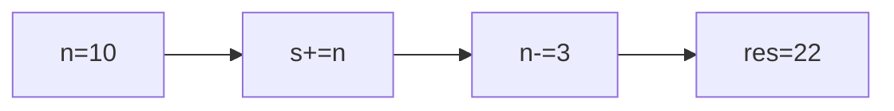

**📖 Penjelasan:**
**Langkah Tracing:**
1. Loop berjalan dengan langkah 3.
2. Hasil akumulasi: 22.

---
### Soal 17
```cpp
int n = 9, s = 0;
while(n > 0) { s += n; n -= 2; }
```
**Pertanyaan:**
1. Berapakah hasil akhirnya?
2. Mengapa demikian?

**Jawaban & Diagnosis:**
1. **25**
2. Lihat Tracing.

**Mermaid Flowchart:**


**📖 Penjelasan:**
**Langkah Tracing:**
1. Loop berjalan dengan langkah 2.
2. Hasil akumulasi: 25.

---
### Soal 18
```cpp
int n = 6, s = 0;
while(n > 0) { s += n; n -= 1; }
```
**Pertanyaan:**
1. Berapakah hasil akhirnya?
2. Mengapa demikian?

**Jawaban & Diagnosis:**
1. **21**
2. Lihat Tracing.

**Mermaid Flowchart:**
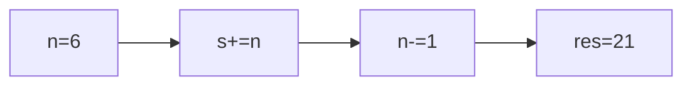

**📖 Penjelasan:**
**Langkah Tracing:**
1. Loop berjalan dengan langkah 1.
2. Hasil akumulasi: 21.

---
### Soal 19
```cpp
int s = 0;
for(int i=0; i<6; i+=2) s += i;
```
**Pertanyaan:**
1. Berapakah hasil akhirnya?
2. Mengapa demikian?

**Jawaban & Diagnosis:**
1. **6**
2. Lihat Tracing.

**Mermaid Flowchart:**
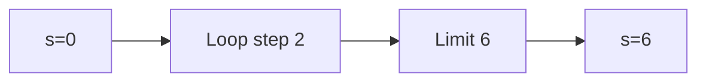

**📖 Penjelasan:**
**Langkah Tracing:**
1. Loop berjalan dengan langkah 2.
2. Hasil akumulasi: 6.

---
### Soal 20
```cpp
int n = 6, s = 0;
while(n > 0) { s += n; n -= 3; }
```
**Pertanyaan:**
1. Berapakah hasil akhirnya?
2. Mengapa demikian?

**Jawaban & Diagnosis:**
1. **9**
2. Lihat Tracing.

**Mermaid Flowchart:**
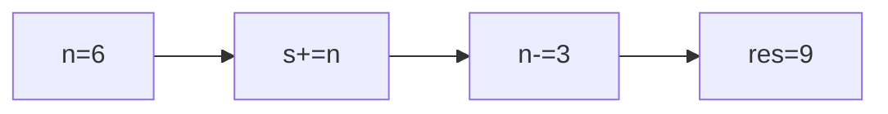

**📖 Penjelasan:**
**Langkah Tracing:**
1. Loop berjalan dengan langkah 3.
2. Hasil akumulasi: 9.

---
### Soal 21
```cpp
int n = 6, s = 0;
while(n > 0) { s += n; n -= 1; }
```
**Pertanyaan:**
1. Berapakah hasil akhirnya?
2. Mengapa demikian?

**Jawaban & Diagnosis:**
1. **21**
2. Lihat Tracing.

**Mermaid Flowchart:**
```mermaid
graph LR
A["n=6"] --> B["s+=n"]
B --> C["n-=1"]
C --> D["res=21"]
```

**📖 Penjelasan:**
**Langkah Tracing:**
1. Loop berjalan dengan langkah 1.
2. Hasil akumulasi: 21.

---
### Soal 22
```cpp
int s = 0;
for(int i=0; i<8; i+=3) s += i;
```
**Pertanyaan:**
1. Berapakah hasil akhirnya?
2. Mengapa demikian?

**Jawaban & Diagnosis:**
1. **9**
2. Lihat Tracing.

**Mermaid Flowchart:**
```mermaid
graph LR
A["s=0"] --> B["Loop step 3"]
B --> C["Limit 8"]
C --> D["s=9"]
```

**📖 Penjelasan:**
**Langkah Tracing:**
1. Loop berjalan dengan langkah 3.
2. Hasil akumulasi: 9.

---
### Soal 23
```cpp
int s = 0;
for(int i=0; i<8; i+=2) s += i;
```
**Pertanyaan:**
1. Berapakah hasil akhirnya?
2. Mengapa demikian?

**Jawaban & Diagnosis:**
1. **12**
2. Lihat Tracing.

**Mermaid Flowchart:**
```mermaid
graph LR
A["s=0"] --> B["Loop step 2"]
B --> C["Limit 8"]
C --> D["s=12"]
```

**📖 Penjelasan:**
**Langkah Tracing:**
1. Loop berjalan dengan langkah 2.
2. Hasil akumulasi: 12.

---
### Soal 24
```cpp
int n = 7, s = 0;
while(n > 0) { s += n; n -= 3; }
```
**Pertanyaan:**
1. Berapakah hasil akhirnya?
2. Mengapa demikian?

**Jawaban & Diagnosis:**
1. **12**
2. Lihat Tracing.

**Mermaid Flowchart:**
```mermaid
graph LR
A["n=7"] --> B["s+=n"]
B --> C["n-=3"]
C --> D["res=12"]
```

**📖 Penjelasan:**
**Langkah Tracing:**
1. Loop berjalan dengan langkah 3.
2. Hasil akumulasi: 12.

---
### Soal 25
```cpp
int n = 7, s = 0;
while(n > 0) { s += n; n -= 1; }
```
**Pertanyaan:**
1. Berapakah hasil akhirnya?
2. Mengapa demikian?

**Jawaban & Diagnosis:**
1. **28**
2. Lihat Tracing.

**Mermaid Flowchart:**
```mermaid
graph LR
A["n=7"] --> B["s+=n"]
B --> C["n-=1"]
C --> D["res=28"]
```

**📖 Penjelasan:**
**Langkah Tracing:**
1. Loop berjalan dengan langkah 1.
2. Hasil akumulasi: 28.

---
