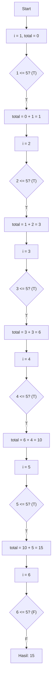
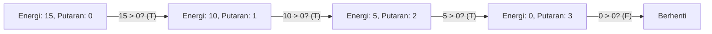
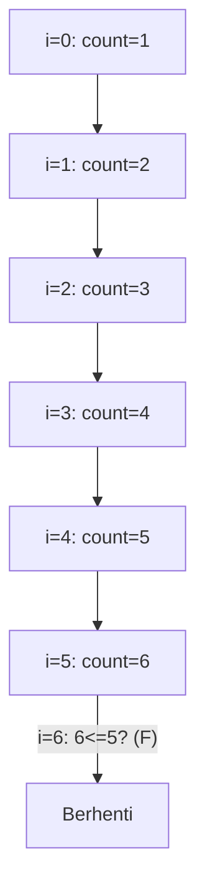
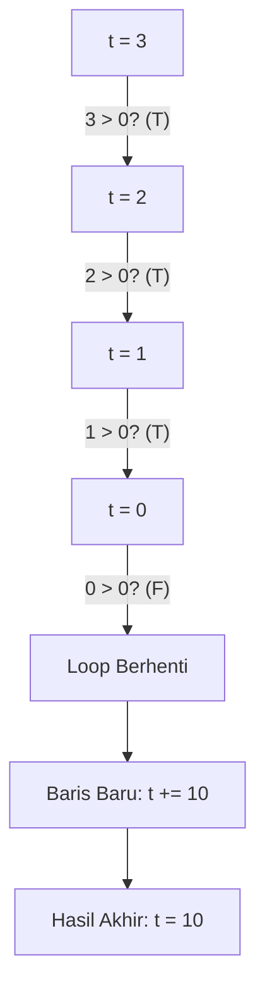
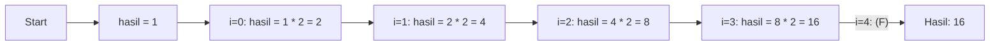
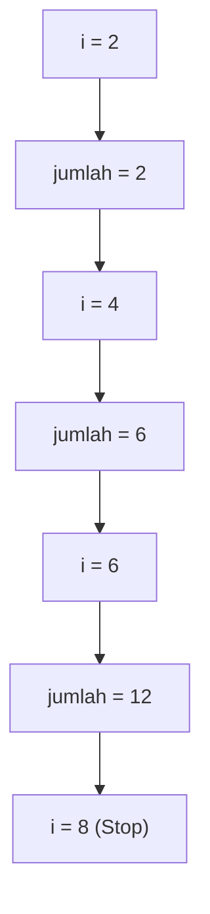
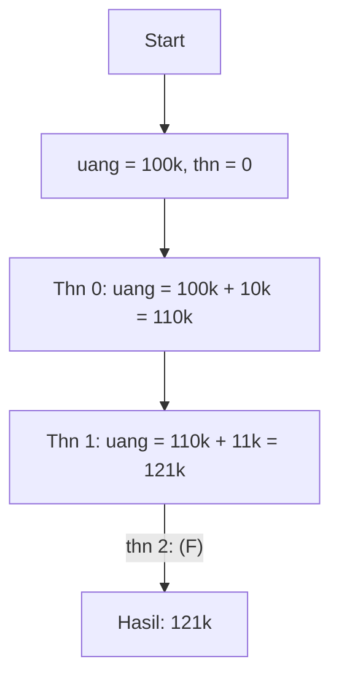
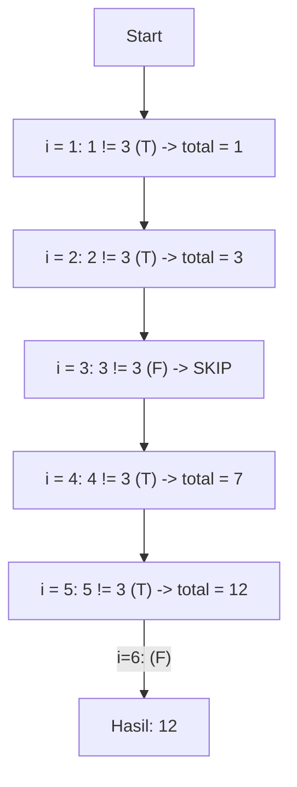

		🔙 **[Kembali ke Daftar Soal](./README.md)**

---

# Latihan Soal Part C - Modul 03 - Set 01 (Premium Edition)

> [!IMPORTANT]
> Fokus pada **Kondisi Berhenti** dan **Perubahan Variabel**. Ingat: Satu kesalahan kecil di `i++` bisa menyebabkan loop berjalan selamanya!

---

### Soal 1: Belajar Berhitung (Basic For Loop)
```cpp
// Skenario: Cetak angka 1 sampai 5
int total = 0;
for (int i = 1; i <= 5; i++) {
    total += i;
}
```
**Pertanyaan:**
1. Berapakah nilai `total` di akhir program?
2. Berapa kali blok di dalam `for` dieksekusi?

<details>
<summary><b>Klik untuk Lihat Jawaban & Diagnosis</b></summary>

**Mermaid Flowchart (Manual Trace):**


**Jawaban:**
1. **15** (1+2+3+4+5)
2. **5 kali**

**📖 Analisis Mendalam:**
Ini adalah struktur dasar loop `for`. Iterasi berhenti tepat saat `i` menjadi 6, karena kondisi `6 <= 5` bernilai false. Perhatikan bahwa perintah `i++` dijalankan **setelah** isi loop selesai, baru kemudian dicek kembali ke kondisi.
</details>

---

### Soal 2: Lari Keliling Lapangan (While Loop)
```cpp
// Skenario: Lari sampai lelah (energi habis)
int energi = 15;
int putaran = 0;

while (energi > 0) {
    energi -= 5;
    putaran++;
}
```
**Pertanyaan:**
1. Berapakah nilai `putaran` di akhir?
2. Berapakah nilai `energi` terakhir?

<details>
<summary><b>Klik untuk Lihat Jawaban & Diagnosis</b></summary>

**Mermaid Flowchart (State Changes):**


**Jawaban:**
1. **3**
2. **0**

**📖 Analisis Mendalam:**
Loop `while` mengecek kondisi di awal. Putaran terjadi 3 kali: (15->10, 10->5, 5->0). Saat energi tepat menyentuh angka 0, kondisi `0 > 0` sudah tidak terpenuhi, sehingga loop langsung berhenti sebelum sempat melakukan putaran ke-4.
</details>

---

### Soal 3: ⚠️ Batas Tipis (Off-by-One Error)
```cpp
// Skenario: Cetak pesan 5 kali?
int count = 0;
for (int i = 0; i <= 5; i++) {
    count++;
}
```
**Pertanyaan:**
1. Berapakah nilai `count`?
2. Mengapa hasilnya bukan 5?

<details>
<summary><b>Klik untuk Lihat Jawaban & Diagnosis</b></summary>

**Mermaid Flowchart (The Extra Iteration):**


**Jawaban:**
1. **6**
2. Karena loop dimulai dari **0** dan berhenti di **<= 5** (inklusif).

**📖 Analisis Mendalam:**
Ini adalah jebakan klasik *Off-by-One*. Banyak siswa mengira `i=0` sampai `i=5` adalah 5 kali, padahal jika dihitung manual (0, 1, 2, 3, 4, 5) totalnya ada 6 angka. Jika ingin 5 kali iterasi, gunakan `i < 5` atau mulailah dari `i = 1`.
</details>

---

### Soal 4: Hitung Mundur Roket (Decrement Loop)
```cpp
// Skenario: Countdown peluncuran
int t = 3;
while (t > 0) {
    t--;
}
// Di sini ada baris: t += 10;
```
**Pertanyaan:**
1. Berapakah nilai `t` tepat setelah loop selesai?
2. Berapakah nilai `t` di akhir seluruh program?

<details>
<summary><b>Klik untuk Lihat Jawaban & Diagnosis</b></summary>

**Mermaid Flowchart (Reverse Trace):**


**Jawaban:**
1. **0**
2. **10**
</details>

---

### Soal 5: Pangkat Manual (Power Simulation)
```cpp
// Skenario: Hitung 2 pangkat 4
int basis = 2;
int hasil = 1;

for (int i = 0; i < 4; i++) {
    hasil *= basis;
}
```
**Pertanyaan:**
1. Berapakah nilai `hasil`?
2. Apa guna `i < 4` dalam konteks perpangkatan ini?

<details>
<summary><b>Klik untuk Lihat Jawaban & Diagnosis</b></summary>

**Mermaid Flowchart (Exponential Accumulation):**


**Jawaban:**
1. **16**
2. Sebagai penentu berapa kali perkalian dengan basis dilakukan (eksponen).
</details>

---

### Soal 6: Kelipatan Genap (Step Change)
```cpp
// Skenario: Jumlahkan angka genap 2 sampai 6
int jumlah = 0;
for (int i = 2; i <= 6; i += 2) {
    jumlah += i;
}
```
**Pertanyaan:**
1. Berapakah nilai `jumlah`?
2. Berapa kali variabel `i` diubah nilainya?

<details>
<summary><b>Klik untuk Lihat Jawaban & Diagnosis</b></summary>

**Mermaid Flowchart:**


**Jawaban:**
1. **12** (2 + 4 + 6)
2. **3 kali** (menjadi 4, 6, lalu 8 untuk pengecekan gagal).
</details>

---

### Soal 7: Misteri ++i vs i++ (Prefix vs Postfix)
```cpp
// Skenario: Loop dengan increment berbeda
int a = 0, b = 0;

for (int i = 0; i < 3; i++) a++;
for (int j = 0; j < 3; ++j) b++;
```
**Pertanyaan:**
1. Berapakah nilai `a`?
2. Berapakah nilai `b`?
3. Apakah ada perbedaan hasil antara `i++` dan `++i` dalam bagian ketiga perintah `for`?

<details>
<summary><b>Klik untuk Lihat Jawaban & Diagnosis</b></summary>

**Jawaban:**
1. **3**
2. **3**
3. **Tidak ada.** Di dalam header `for`, post-increment dan pre-increment memberikan hasil iterasi yang sama.

**📖 Analisis Mendalam:**
Meskipun secara teori `++i` sedikit lebih cepat, compiler modern memperlakukan keduanya secara identik di dalam struktur `for`. Keduanya akan melakukan penambahan **setelah** blok kode di dalam loop selesai dikerjakan.
</details>

---

### Soal 8: Tabungan Berlipat (Compound Interest)
```cpp
// Skenario: Uang 100rb, tiap tahun naik 10% (dibulatkan ke bawah)
int uang = 100000;
for (int thn = 0; thn < 2; thn++) {
    uang += uang / 10;
}
```
**Pertanyaan:**
1. Berapakah nilai `uang` setelah 2 tahun?
2. Apa yang membedakan tahun ke-1 dan tahun ke-2?

<details>
<summary><b>Klik untuk Lihat Jawaban & Diagnosis</b></summary>

**Mermaid Flowchart (Step-2 Trace):**


**Jawaban:**
1. **121000**
2. Di tahun kedua, bunga 10% dihitung dari saldo yang sudah bertambah di tahun pertama (bunga berbunga).
</details>

---

### Soal 9: ⚠️ Loop Tanpa Henti? (Inversion Trap)
```cpp
// Skenario: Salah tanda di increment/decrement
int n = 5;
while (n < 10) {
    n--; // <-- Perhatikan ini!
    if (n < 0) break; // Penyelamat darurat
}
```
**Pertanyaan:**
1. Berapakah nilai `n` terakhir sebelum program berhenti?
2. Kenapa tanpa `break`, program ini akan menjadi *Infinite Loop*?

<details>
<summary><b>Klik untuk Lihat Jawaban & Diagnosis</b></summary>

**Mermaid Flowchart:**


**Jawaban:**
1. **-1**
2. Karena `n` terus mengecil (menjauh dari angka 10), sehingga kondisi `n < 10` akan **selalu benar** selamanya.
</details>

---

### Soal 10: Pemecah Kelompok (Skip Multiples)
```cpp
// Skenario: Jumlahkan angka dari 1 ke 5, tapi lewatkan angka 3
int total = 0;
for (int i = 1; i <= 5; i++) {
    if (i != 3) {
        total += i;
    }
}
```
**Pertanyaan:**
1. Berapakah nilai `total`?
2. Rumus matematika apa yang setara dengan `total` tersebut?

<details>
<summary><b>Klik untuk Lihat Jawaban & Diagnosis</b></summary>

**Mermaid Flowchart (Decision Filter):**


**Jawaban:**
1. **12**
2. $(1+2+3+4+5) - 3 = 12$.
</details>
