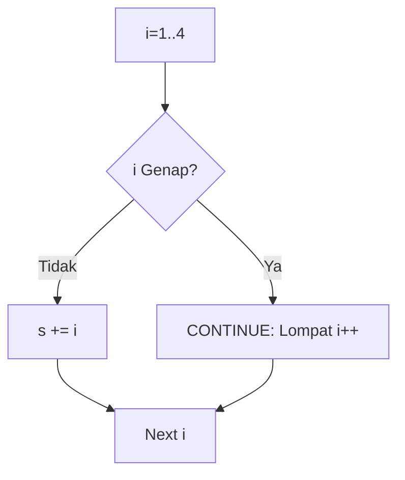
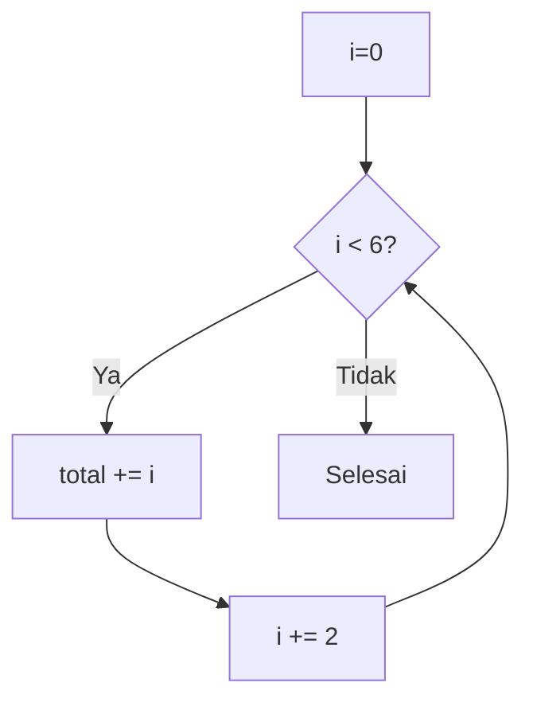
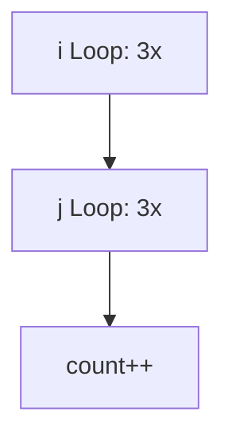
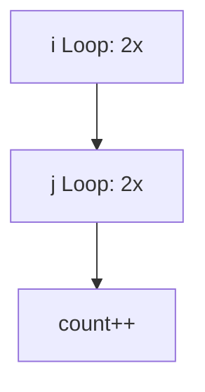
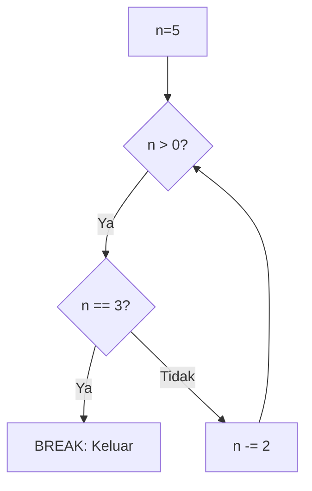

🔙 **[Kembali ke Daftar Soal](./README.md)**

---

# Latihan Soal Part C - Modul 03 - Set 01

### Soal 1 (Continue Skip)
```cpp
int s = 0;
for (int i=1; i<=4; i++) {
    if (i % 2 == 0) continue;
    s += i;
}
```
**Pertanyaan:**
1. Angka berapa saja yang masuk ke dalam `s`?
2. Berapakah nilai akhir `s`?
3. Apa arti perintah `continue`?

**Jawaban & Diagnosis:**
1. **1 dan 3 (Angka ganjil)**
2. **4**
3. **Melewatkan sisa perintah di bawahnya dan langsung lanjut ke putaran berikutnya.**

**Mermaid Flowchart:**


**📖 Cara Membaca Diagram:**
i=1 (Ganjil) -> s=1. i=2 (Genap) -> Skip/Continue. i=3 (Ganjil) -> s=1+3=4. i=4 (Genap) -> Skip.

---
### Soal 2 (For Loop Trace)
```cpp
int total = 0;
for (int i = 0; i < 6; i += 2) {
    total += i;
}
```
**Pertanyaan:**
1. Berapa kali perulangan `for` tersebut dieksekusi?
2. Berapakah nilai akhir variabel `total`?
3. Apa yang terjadi jika kondisi `i < {end}` diganti menjadi `i <= {end}`?

**Jawaban & Diagnosis:**
1. **3**
2. **6**
3. **Perulangan akan berjalan satu kali lebih banyak (jika end tercapai).**

**Mermaid Flowchart:**


**📖 Cara Membaca Diagram:**
Mulai i=0. Tiap langkah i bertambah 2. Berhenti saat i >= 6.

---
### Soal 3 (Nested Loop Matrix)
```cpp
int count = 0;
for (int i = 0; i < 3; i++) {
    for (int j = 0; j < 3; j++) {
        count++;
    }
}
```
**Pertanyaan:**
1. Berapakah nilai akhir variabel `count`?
2. Berapa kali perulangan terdalam (`j`) berjalan total?
3. Analogi apa yang paling cocok untuk perulangan bersarang?

**Jawaban & Diagnosis:**
1. **9**
2. **9**
3. **Jam Pasir atau Jarum Jam (Jarum panjang harus putar penuh sebelum jarum pendek gerak).**

**Mermaid Flowchart:**


**📖 Cara Membaca Diagram:**
Baris (3) x Kolom (3) = 9 total eksekusi.

---
### Soal 4 (Continue Skip)
```cpp
int s = 0;
for (int i=1; i<=4; i++) {
    if (i % 2 == 0) continue;
    s += i;
}
```
**Pertanyaan:**
1. Angka berapa saja yang masuk ke dalam `s`?
2. Berapakah nilai akhir `s`?
3. Apa arti perintah `continue`?

**Jawaban & Diagnosis:**
1. **1 dan 3 (Angka ganjil)**
2. **4**
3. **Melewatkan sisa perintah di bawahnya dan langsung lanjut ke putaran berikutnya.**

**Mermaid Flowchart:**


**📖 Cara Membaca Diagram:**
i=1 (Ganjil) -> s=1. i=2 (Genap) -> Skip/Continue. i=3 (Ganjil) -> s=1+3=4. i=4 (Genap) -> Skip.

---
### Soal 5 (Nested Loop Matrix)
```cpp
int count = 0;
for (int i = 0; i < 3; i++) {
    for (int j = 0; j < 3; j++) {
        count++;
    }
}
```
**Pertanyaan:**
1. Berapakah nilai akhir variabel `count`?
2. Berapa kali perulangan terdalam (`j`) berjalan total?
3. Analogi apa yang paling cocok untuk perulangan bersarang?

**Jawaban & Diagnosis:**
1. **9**
2. **9**
3. **Jam Pasir atau Jarum Jam (Jarum panjang harus putar penuh sebelum jarum pendek gerak).**

**Mermaid Flowchart:**


**📖 Cara Membaca Diagram:**
Baris (3) x Kolom (3) = 9 total eksekusi.

---
### Soal 6 (Nested Loop Matrix)
```cpp
int count = 0;
for (int i = 0; i < 3; i++) {
    for (int j = 0; j < 2; j++) {
        count++;
    }
}
```
**Pertanyaan:**
1. Berapakah nilai akhir variabel `count`?
2. Berapa kali perulangan terdalam (`j`) berjalan total?
3. Analogi apa yang paling cocok untuk perulangan bersarang?

**Jawaban & Diagnosis:**
1. **6**
2. **6**
3. **Jam Pasir atau Jarum Jam (Jarum panjang harus putar penuh sebelum jarum pendek gerak).**

**Mermaid Flowchart:**


**📖 Cara Membaca Diagram:**
Baris (3) x Kolom (2) = 6 total eksekusi.

---
### Soal 7 (Nested Loop Matrix)
```cpp
int count = 0;
for (int i = 0; i < 3; i++) {
    for (int j = 0; j < 3; j++) {
        count++;
    }
}
```
**Pertanyaan:**
1. Berapakah nilai akhir variabel `count`?
2. Berapa kali perulangan terdalam (`j`) berjalan total?
3. Analogi apa yang paling cocok untuk perulangan bersarang?

**Jawaban & Diagnosis:**
1. **9**
2. **9**
3. **Jam Pasir atau Jarum Jam (Jarum panjang harus putar penuh sebelum jarum pendek gerak).**

**Mermaid Flowchart:**


**📖 Cara Membaca Diagram:**
Baris (3) x Kolom (3) = 9 total eksekusi.

---
### Soal 8 (For Loop Trace)
```cpp
int total = 0;
for (int i = 3; i < 6; i += 1) {
    total += i;
}
```
**Pertanyaan:**
1. Berapa kali perulangan `for` tersebut dieksekusi?
2. Berapakah nilai akhir variabel `total`?
3. Apa yang terjadi jika kondisi `i < {end}` diganti menjadi `i <= {end}`?

**Jawaban & Diagnosis:**
1. **3**
2. **12**
3. **Perulangan akan berjalan satu kali lebih banyak (jika end tercapai).**

**Mermaid Flowchart:**


**📖 Cara Membaca Diagram:**
Mulai i=3. Tiap langkah i bertambah 1. Berhenti saat i >= 6.

---
### Soal 9 (Nested Loop Matrix)
```cpp
int count = 0;
for (int i = 0; i < 3; i++) {
    for (int j = 0; j < 2; j++) {
        count++;
    }
}
```
**Pertanyaan:**
1. Berapakah nilai akhir variabel `count`?
2. Berapa kali perulangan terdalam (`j`) berjalan total?
3. Analogi apa yang paling cocok untuk perulangan bersarang?

**Jawaban & Diagnosis:**
1. **6**
2. **6**
3. **Jam Pasir atau Jarum Jam (Jarum panjang harus putar penuh sebelum jarum pendek gerak).**

**Mermaid Flowchart:**


**📖 Cara Membaca Diagram:**
Baris (3) x Kolom (2) = 6 total eksekusi.

---
### Soal 10 (Nested Loop Matrix)
```cpp
int count = 0;
for (int i = 0; i < 3; i++) {
    for (int j = 0; j < 2; j++) {
        count++;
    }
}
```
**Pertanyaan:**
1. Berapakah nilai akhir variabel `count`?
2. Berapa kali perulangan terdalam (`j`) berjalan total?
3. Analogi apa yang paling cocok untuk perulangan bersarang?

**Jawaban & Diagnosis:**
1. **6**
2. **6**
3. **Jam Pasir atau Jarum Jam (Jarum panjang harus putar penuh sebelum jarum pendek gerak).**

**Mermaid Flowchart:**


**📖 Cara Membaca Diagram:**
Baris (3) x Kolom (2) = 6 total eksekusi.

---
### Soal 11 (For Loop Trace)
```cpp
int total = 0;
for (int i = 5; i < 11; i += 1) {
    total += i;
}
```
**Pertanyaan:**
1. Berapa kali perulangan `for` tersebut dieksekusi?
2. Berapakah nilai akhir variabel `total`?
3. Apa yang terjadi jika kondisi `i < {end}` diganti menjadi `i <= {end}`?

**Jawaban & Diagnosis:**
1. **6**
2. **45**
3. **Perulangan akan berjalan satu kali lebih banyak (jika end tercapai).**

**Mermaid Flowchart:**


**📖 Cara Membaca Diagram:**
Mulai i=5. Tiap langkah i bertambah 1. Berhenti saat i >= 11.

---
### Soal 12 (Nested Loop Matrix)
```cpp
int count = 0;
for (int i = 0; i < 3; i++) {
    for (int j = 0; j < 3; j++) {
        count++;
    }
}
```
**Pertanyaan:**
1. Berapakah nilai akhir variabel `count`?
2. Berapa kali perulangan terdalam (`j`) berjalan total?
3. Analogi apa yang paling cocok untuk perulangan bersarang?

**Jawaban & Diagnosis:**
1. **9**
2. **9**
3. **Jam Pasir atau Jarum Jam (Jarum panjang harus putar penuh sebelum jarum pendek gerak).**

**Mermaid Flowchart:**


**📖 Cara Membaca Diagram:**
Baris (3) x Kolom (3) = 9 total eksekusi.

---
### Soal 13 (For Loop Trace)
```cpp
int total = 0;
for (int i = 4; i < 9; i += 1) {
    total += i;
}
```
**Pertanyaan:**
1. Berapa kali perulangan `for` tersebut dieksekusi?
2. Berapakah nilai akhir variabel `total`?
3. Apa yang terjadi jika kondisi `i < {end}` diganti menjadi `i <= {end}`?

**Jawaban & Diagnosis:**
1. **5**
2. **30**
3. **Perulangan akan berjalan satu kali lebih banyak (jika end tercapai).**

**Mermaid Flowchart:**


**📖 Cara Membaca Diagram:**
Mulai i=4. Tiap langkah i bertambah 1. Berhenti saat i >= 9.

---
### Soal 14 (Nested Loop Matrix)
```cpp
int count = 0;
for (int i = 0; i < 3; i++) {
    for (int j = 0; j < 3; j++) {
        count++;
    }
}
```
**Pertanyaan:**
1. Berapakah nilai akhir variabel `count`?
2. Berapa kali perulangan terdalam (`j`) berjalan total?
3. Analogi apa yang paling cocok untuk perulangan bersarang?

**Jawaban & Diagnosis:**
1. **9**
2. **9**
3. **Jam Pasir atau Jarum Jam (Jarum panjang harus putar penuh sebelum jarum pendek gerak).**

**Mermaid Flowchart:**


**📖 Cara Membaca Diagram:**
Baris (3) x Kolom (3) = 9 total eksekusi.

---
### Soal 15 (Nested Loop Matrix)
```cpp
int count = 0;
for (int i = 0; i < 2; i++) {
    for (int j = 0; j < 2; j++) {
        count++;
    }
}
```
**Pertanyaan:**
1. Berapakah nilai akhir variabel `count`?
2. Berapa kali perulangan terdalam (`j`) berjalan total?
3. Analogi apa yang paling cocok untuk perulangan bersarang?

**Jawaban & Diagnosis:**
1. **4**
2. **4**
3. **Jam Pasir atau Jarum Jam (Jarum panjang harus putar penuh sebelum jarum pendek gerak).**

**Mermaid Flowchart:**


**📖 Cara Membaca Diagram:**
Baris (2) x Kolom (2) = 4 total eksekusi.

---
### Soal 16 (While Loop Break)
```cpp
int n = 5;
while (n > 0) {
    if (n == 3) break;
    n -= 2;
}
```
**Pertanyaan:**
1. Berapakah nilai akhir variabel `n`?
2. Berapa kali blok di dalam `while` dijalankan?
3. Apa perbedaan `break` dan `continue`?

**Jawaban & Diagnosis:**
1. **3**
2. **1**
3. **Break keluar dari loop, Continue lompat ke iterasi berikutnya.**

**Mermaid Flowchart:**


**📖 Cara Membaca Diagram:**
n=5. Kurangi 2 tiap putaran. Jika n=3, paku rem (Break) ditekan.

---
### Soal 17 (Nested Loop Matrix)
```cpp
int count = 0;
for (int i = 0; i < 3; i++) {
    for (int j = 0; j < 2; j++) {
        count++;
    }
}
```
**Pertanyaan:**
1. Berapakah nilai akhir variabel `count`?
2. Berapa kali perulangan terdalam (`j`) berjalan total?
3. Analogi apa yang paling cocok untuk perulangan bersarang?

**Jawaban & Diagnosis:**
1. **6**
2. **6**
3. **Jam Pasir atau Jarum Jam (Jarum panjang harus putar penuh sebelum jarum pendek gerak).**

**Mermaid Flowchart:**


**📖 Cara Membaca Diagram:**
Baris (3) x Kolom (2) = 6 total eksekusi.

---
### Soal 18 (Continue Skip)
```cpp
int s = 0;
for (int i=1; i<=4; i++) {
    if (i % 2 == 0) continue;
    s += i;
}
```
**Pertanyaan:**
1. Angka berapa saja yang masuk ke dalam `s`?
2. Berapakah nilai akhir `s`?
3. Apa arti perintah `continue`?

**Jawaban & Diagnosis:**
1. **1 dan 3 (Angka ganjil)**
2. **4**
3. **Melewatkan sisa perintah di bawahnya dan langsung lanjut ke putaran berikutnya.**

**Mermaid Flowchart:**


**📖 Cara Membaca Diagram:**
i=1 (Ganjil) -> s=1. i=2 (Genap) -> Skip/Continue. i=3 (Ganjil) -> s=1+3=4. i=4 (Genap) -> Skip.

---
### Soal 19 (Nested Loop Matrix)
```cpp
int count = 0;
for (int i = 0; i < 2; i++) {
    for (int j = 0; j < 2; j++) {
        count++;
    }
}
```
**Pertanyaan:**
1. Berapakah nilai akhir variabel `count`?
2. Berapa kali perulangan terdalam (`j`) berjalan total?
3. Analogi apa yang paling cocok untuk perulangan bersarang?

**Jawaban & Diagnosis:**
1. **4**
2. **4**
3. **Jam Pasir atau Jarum Jam (Jarum panjang harus putar penuh sebelum jarum pendek gerak).**

**Mermaid Flowchart:**


**📖 Cara Membaca Diagram:**
Baris (2) x Kolom (2) = 4 total eksekusi.

---
### Soal 20 (While Loop Break)
```cpp
int n = 8;
while (n > 0) {
    if (n == 4) break;
    n -= 2;
}
```
**Pertanyaan:**
1. Berapakah nilai akhir variabel `n`?
2. Berapa kali blok di dalam `while` dijalankan?
3. Apa perbedaan `break` dan `continue`?

**Jawaban & Diagnosis:**
1. **4**
2. **2**
3. **Break keluar dari loop, Continue lompat ke iterasi berikutnya.**

**Mermaid Flowchart:**


**📖 Cara Membaca Diagram:**
n=8. Kurangi 2 tiap putaran. Jika n=4, paku rem (Break) ditekan.

---
### Soal 21 (For Loop Trace)
```cpp
int total = 0;
for (int i = 0; i < 3; i += 2) {
    total += i;
}
```
**Pertanyaan:**
1. Berapa kali perulangan `for` tersebut dieksekusi?
2. Berapakah nilai akhir variabel `total`?
3. Apa yang terjadi jika kondisi `i < {end}` diganti menjadi `i <= {end}`?

**Jawaban & Diagnosis:**
1. **2**
2. **2**
3. **Perulangan akan berjalan satu kali lebih banyak (jika end tercapai).**

**Mermaid Flowchart:**
```mermaid
graph TD
    A[i=0] --> B{i < 3?}
    B -- Ya --> C[total += i]
    C --> D[i += 2]
    D --> B
    B -- Tidak --> E[Selesai]
```

**📖 Cara Membaca Diagram:**
Mulai i=0. Tiap langkah i bertambah 2. Berhenti saat i >= 3.

---
### Soal 22 (Nested Loop Matrix)
```cpp
int count = 0;
for (int i = 0; i < 2; i++) {
    for (int j = 0; j < 3; j++) {
        count++;
    }
}
```
**Pertanyaan:**
1. Berapakah nilai akhir variabel `count`?
2. Berapa kali perulangan terdalam (`j`) berjalan total?
3. Analogi apa yang paling cocok untuk perulangan bersarang?

**Jawaban & Diagnosis:**
1. **6**
2. **6**
3. **Jam Pasir atau Jarum Jam (Jarum panjang harus putar penuh sebelum jarum pendek gerak).**

**Mermaid Flowchart:**
```mermaid
graph TD
    A[i Loop: 2x] --> B[j Loop: 3x]
    B --> C[count++]
```

**📖 Cara Membaca Diagram:**
Baris (2) x Kolom (3) = 6 total eksekusi.

---
### Soal 23 (While Loop Break)
```cpp
int n = 5;
while (n > 0) {
    if (n == 3) break;
    n -= 2;
}
```
**Pertanyaan:**
1. Berapakah nilai akhir variabel `n`?
2. Berapa kali blok di dalam `while` dijalankan?
3. Apa perbedaan `break` dan `continue`?

**Jawaban & Diagnosis:**
1. **3**
2. **1**
3. **Break keluar dari loop, Continue lompat ke iterasi berikutnya.**

**Mermaid Flowchart:**
```mermaid
graph TD
    A[n=5] --> B{n > 0?}
    B -- Ya --> C{n == 3?}
    C -- Ya --> D[BREAK: Keluar]
    C -- Tidak --> E[n -= 2]
    E --> B
```

**📖 Cara Membaca Diagram:**
n=5. Kurangi 2 tiap putaran. Jika n=3, paku rem (Break) ditekan.

---
### Soal 24 (For Loop Trace)
```cpp
int total = 0;
for (int i = 4; i < 10; i += 2) {
    total += i;
}
```
**Pertanyaan:**
1. Berapa kali perulangan `for` tersebut dieksekusi?
2. Berapakah nilai akhir variabel `total`?
3. Apa yang terjadi jika kondisi `i < {end}` diganti menjadi `i <= {end}`?

**Jawaban & Diagnosis:**
1. **3**
2. **18**
3. **Perulangan akan berjalan satu kali lebih banyak (jika end tercapai).**

**Mermaid Flowchart:**
```mermaid
graph TD
    A[i=4] --> B{i < 10?}
    B -- Ya --> C[total += i]
    C --> D[i += 2]
    D --> B
    B -- Tidak --> E[Selesai]
```

**📖 Cara Membaca Diagram:**
Mulai i=4. Tiap langkah i bertambah 2. Berhenti saat i >= 10.

---
### Soal 25 (Nested Loop Matrix)
```cpp
int count = 0;
for (int i = 0; i < 3; i++) {
    for (int j = 0; j < 3; j++) {
        count++;
    }
}
```
**Pertanyaan:**
1. Berapakah nilai akhir variabel `count`?
2. Berapa kali perulangan terdalam (`j`) berjalan total?
3. Analogi apa yang paling cocok untuk perulangan bersarang?

**Jawaban & Diagnosis:**
1. **9**
2. **9**
3. **Jam Pasir atau Jarum Jam (Jarum panjang harus putar penuh sebelum jarum pendek gerak).**

**Mermaid Flowchart:**
```mermaid
graph TD
    A[i Loop: 3x] --> B[j Loop: 3x]
    B --> C[count++]
```

**📖 Cara Membaca Diagram:**
Baris (3) x Kolom (3) = 9 total eksekusi.

---
