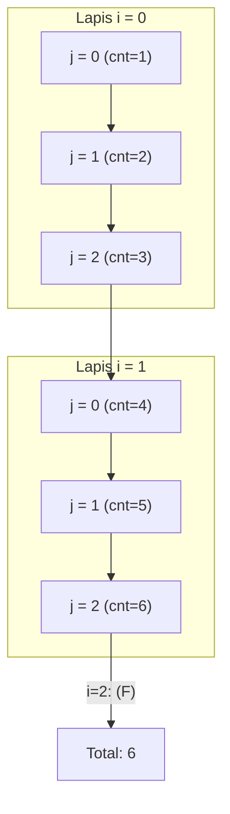
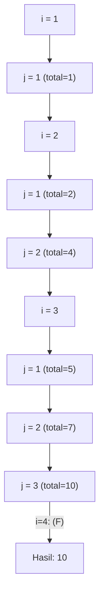
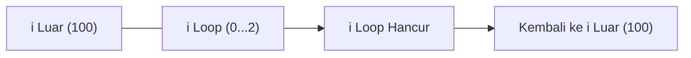
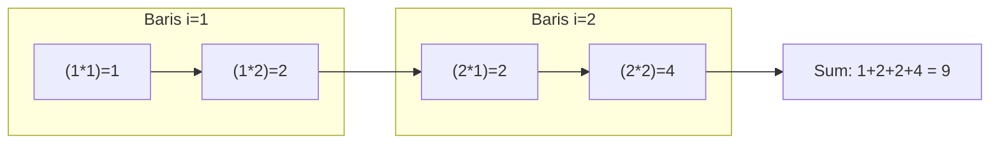
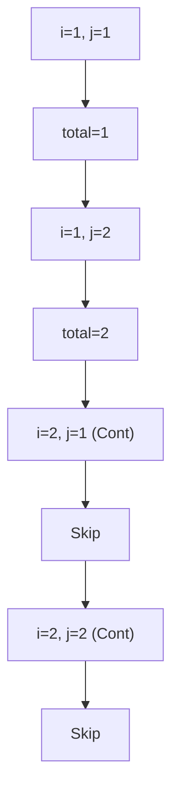
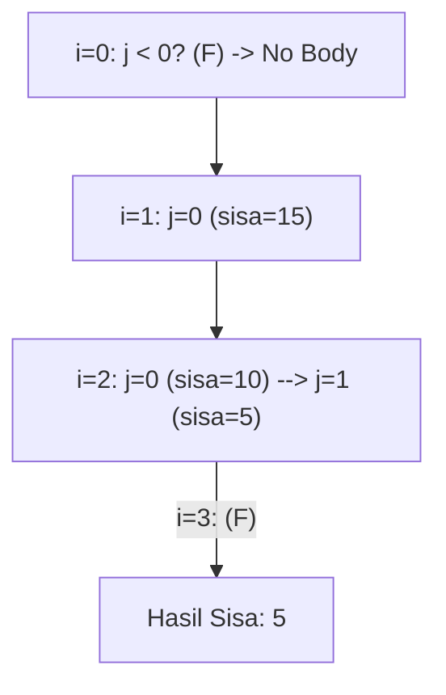
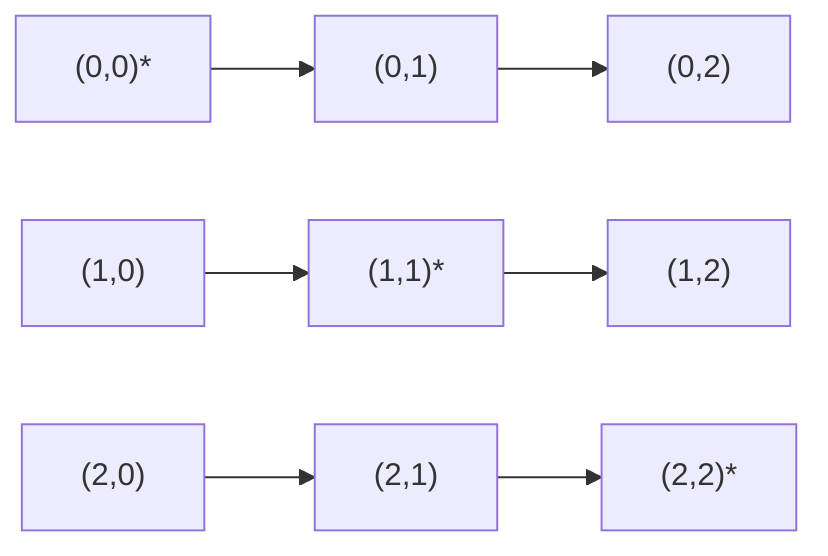
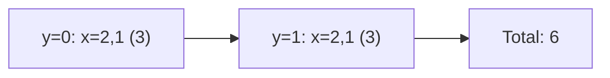
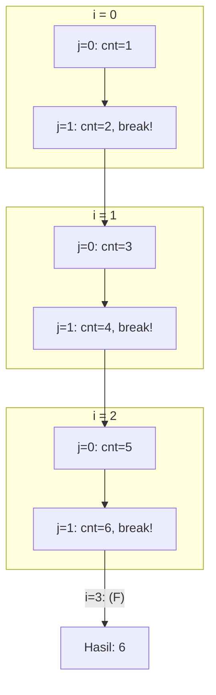
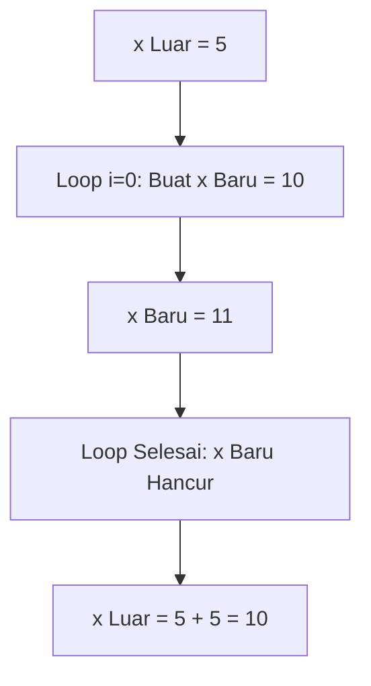

		🔙 **[Kembali ke Daftar Soal](./README.md)**

---

# Latihan Soal Part C - Modul 03 - Set 02 (Premium Edition)

---

### Soal 11: Barisan Bintang (2D Pattern)
```cpp
// Skenario: Cetak kotak bintang 2x3
int count = 0;
for (int i = 0; i < 2; i++) {
    for (int j = 0; j < 3; j++) {
        count++;
    }
}
```
**Pertanyaan:**
1. Berapakah nilai `count` akhir?
2. Berapa kali loop **dalam** (`j`) dieksekusi secara total?

<details>
<summary><b>Klik untuk Lihat Jawaban & Diagnosis</b></summary>

**Mermaid Flowchart (Matrix Expansion):**


**Jawaban:**
1. **6**
2. **6 kali** (2 kali iterasi luar, tiap iterasi luar melakukan 3 iterasi dalam).

**📖 Analisis Mendalam:**
Nested loop bekerja seperti perkalian. Jumlah total eksekusi adalah `baris * kolom`. Setiap kali `i` bertambah, loop `j` akan di-reset dan berjalan penuh dari 0 sampai 2.
</details>

---

### Soal 12: Segitiga Siku-Siku (Dynamic Limit)
```cpp
// Skenario: Cetak pola segitiga
int total = 0;
for (int i = 1; i <= 3; i++) {
    for (int j = 1; j <= i; j++) {
        total += j;
    }
}
```
**Pertanyaan:**
1. Berapakah nilai `total`?
2. Apa yang unik dari kondisi `j <= i`?

<details>
<summary><b>Klik untuk Lihat Jawaban & Diagnosis</b></summary>

**Mermaid Flowchart (Dynamic Limit Trace):**


**Jawaban:**
1. **10**
2. Batas loop dalam **berubah-ubah** mengikuti nilai loop luar.

**📖 Analisis Mendalam:**
Iterasi 1: `j=1` (1). 
Iterasi 2: `j=1,2` (1+2=3). 
Iterasi 3: `j=1,2,3` (1+2+3=6). 
Total akhir: `1 + 3 + 6 = 10`. Perhatikan bagaimana loop dalam menjadi semakin panjang seiring bertambahnya `i`.
</details>

---

### Soal 13: Tabrakan Variabel (Shadowing Trace)
```cpp
// Skenario: Nama variabel sama di beda scope
int i = 100;
for (int i = 0; i < 2; i++) {
    // Sesuatu di sini
}
// i di sini tetap 100?
```
**Pertanyaan:**
1. Berapakah nilai `i` tepat setelah loop selesai?
2. Mengapa `i` di dalam loop tidak merusak `i` di luar loop?

<details>
<summary><b>Klik untuk Lihat Jawaban & Diagnosis</b></summary>

**Mermaid Flowchart:**


**Jawaban:**
1. **100**
2. Karena variabel `i` di dalam `for` memiliki **scope** (ruang lingkup) lokal yang hanya hidup di dalam loop tersebut.

**📖 Analisis Mendalam:**
C++ mengijinkan kita menggunakan nama yang sama di scope yang lebih dalam. Variabel lokal akan "menutup" (shadow) variabel global sementara waktu.
</details>

---

### Soal 14: Perkalian Tabel (Matrix Trace)
```cpp
int hasil = 0;
for (int i = 1; i <= 2; i++) {
    for (int j = 1; j <= 2; j++) {
        hasil += (i * j);
    }
}
```
**Pertanyaan:**
1. Berapakah nilai `hasil`?
2. Tunjukkan baris operasinya!

<details>
<summary><b>Klik untuk Lihat Jawaban & Diagnosis</b></summary>

**Mermaid Flowchart (Manual Cell Multiplier):**


**Jawaban:**
1. **9**
2. `(1*1) + (1*2) + (2*1) + (2*2) = 1 + 2 + 2 + 4 = 9`.
</details>

---

### Soal 15: Melewati Koordinat (If inside Nested)
```cpp
// Skenario: Melewati baris kedua
int total = 0;
for (int i = 1; i <= 2; i++) {
    for (int j = 1; j <= 2; j++) {
        if (i == 2) continue;
        total += 1;
    }
}
```
**Pertanyaan:**
1. Berapakah nilai `total`?
2. Perintah `continue` tersebut menghentikan loop yang mana?

<details>
<summary><b>Klik untuk Lihat Jawaban & Diagnosis</b></summary>

**Mermaid Flowchart:**


**Jawaban:**
1. **2**
2. Menghentikan iterasi loop **dalam** (`j`) pada saat itu saja.

**📖 Analisis Mendalam:**
Saat `i == 2`, perintah `total += 1` tidak pernah dijalankan untuk kedua nilai `j`.
</details>

---

### Soal 16: Pengurangan Bertingkat (Decrement Trace)
```cpp
int n = 3;
int sisa = 20;

for (int i = 0; i < n; i++) {
    for (int j = 0; j < i; j++) {
        sisa -= 5;
    }
}
```
**Pertanyaan:**
1. Berapakah nilai `sisa` akhir?
2. Berapa kali `sisa -= 5` dieksekusi?

<details>
<summary><b>Klik untuk Lihat Jawaban & Diagnosis</b></summary>

**Mermaid Flowchart (Nested Decrement Trace):**


**Jawaban:**
1. **5**
2. **3 kali** (0 + 1 + 2 = 3). Maka `20 - (3 * 5) = 5`.
</details>

---

### Soal 17: Radar Scan (Matrix Symmetry)
```cpp
int deteksi = 0;
for (int i = 0; i < 3; i++) {
    for (int j = 0; j < 3; j++) {
        if (i == j) deteksi++;
    }
}
```
**Pertanyaan:**
1. Berapakah nilai `deteksi`?
2. Syarat `i == j` mendeteksi bagian mana di dalam sebuah matriks (kotak)?

<details>
<summary><b>Klik untuk Lihat Jawaban & Diagnosis</b></summary>

**Mermaid Flowchart:**


**Jawaban:**
1. **3**
2. **Diagonal Utama.** (Titik di mana indeks baris sama dengan kolom).
</details>

---

### Soal 18: Labirin Koordinat (X-Y Flip)
```cpp
int sum = 0;
for (int y = 0; y < 2; y++) {
    for (int x = 2; x > 0; x--) {
        sum += x;
    }
}
```
**Pertanyaan:**
1. Berapakah nilai `sum`?
2. Apa perbedaan cara jalan loop `x` dibanding loop sebelumnya?

<details>
<summary><b>Klik untuk Lihat Jawaban & Diagnosis</b></summary>

**Mermaid Flowchart:**


**Jawaban:**
1. **6**
2. Loop `x` berjalan **mundur** (*decrement*) dari 2 ke 1.
</details>

---

### Soal 19: Filter Dua Lapis (Break inside Nested)
```cpp
int count = 0;
for (int i = 0; i < 3; i++) {
    for (int j = 0; j < 3; j++) {
        count++;
        if (j == 1) break;
    }
}
```
**Pertanyaan:**
1. Berapakah nilai `count`?
2. Apakah `break` menghentikan loop `i` juga?

<details>
<summary><b>Klik untuk Lihat Jawaban & Diagnosis</b></summary>

**Mermaid Flowchart (Nested Break Boundary):**


**Jawaban:**
1. **6**
2. **Tidak.** `break` hanya menghancurkan loop terdalam (`j`). Meskipun loop `j` berbatas sampai 3, ia selalu hancur di angka 1. Namun loop `i` tetap berlanjut sampai angka 2.
</details>

---

### Soal 20: ⚠️ Shadowing Ekstrim (Same Variable Different Context)
```cpp
int x = 5;
for (int i = 0; i < 2; i++) {
    int x = 10;
    x++;
}
// Di sini: x += 5;
```
**Pertanyaan:**
1. Berapakah nilai `x` di akhir program?
2. Mengapa perubahan `x++` di dalam loop seolah-olah menguap?

<details>
<summary><b>Klik untuk Lihat Jawaban & Diagnosis</b></summary>

**Mermaid Flowchart:**


**Jawaban:**
1. **10**
2. Karena `int x = 10` di dalam loop adalah variabel yang **berbeda** sama sekali dengan `x` di luar. Semua perubahan padanya tidak berpengaruh ke `x` luar.
</details>
