🔙 **[Kembali ke Daftar Soal](./README.md)**

---

# Latihan Soal Part C - Modul 03 - Set 02

### Soal 26
```cpp
int n = 9, s = 0;
while(n > 0) { s += n; n -= 3; }
```
**Pertanyaan:**
1. Berapakah hasil akhirnya?
2. Mengapa demikian?

**Jawaban & Diagnosis:**
1. **18**
2. Lihat Tracing.

**Mermaid Flowchart:**
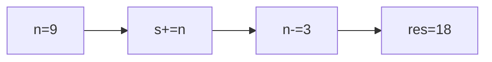

**📖 Penjelasan:**
**Langkah Tracing:**
1. Loop berjalan dengan langkah 3.
2. Hasil akumulasi: 18.

---
### Soal 27
```cpp
int n = 8, s = 0;
while(n > 0) { s += n; n -= 2; }
```
**Pertanyaan:**
1. Berapakah hasil akhirnya?
2. Mengapa demikian?

**Jawaban & Diagnosis:**
1. **20**
2. Lihat Tracing.

**Mermaid Flowchart:**
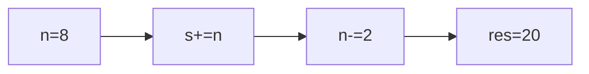

**📖 Penjelasan:**
**Langkah Tracing:**
1. Loop berjalan dengan langkah 2.
2. Hasil akumulasi: 20.

---
### Soal 28
```cpp
int s = 0;
for(int i=0; i<7; i+=1) s += i;
```
**Pertanyaan:**
1. Berapakah hasil akhirnya?
2. Mengapa demikian?

**Jawaban & Diagnosis:**
1. **21**
2. Lihat Tracing.

**Mermaid Flowchart:**
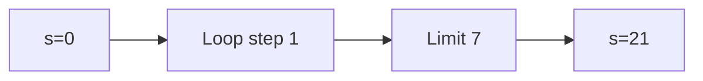

**📖 Penjelasan:**
**Langkah Tracing:**
1. Loop berjalan dengan langkah 1.
2. Hasil akumulasi: 21.

---
### Soal 29
```cpp
int s = 0;
for(int i=0; i<6; i+=3) s += i;
```
**Pertanyaan:**
1. Berapakah hasil akhirnya?
2. Mengapa demikian?

**Jawaban & Diagnosis:**
1. **3**
2. Lihat Tracing.

**Mermaid Flowchart:**
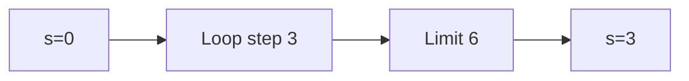

**📖 Penjelasan:**
**Langkah Tracing:**
1. Loop berjalan dengan langkah 3.
2. Hasil akumulasi: 3.

---
### Soal 30
```cpp
int s = 0;
for(int i=0; i<9; i+=1) s += i;
```
**Pertanyaan:**
1. Berapakah hasil akhirnya?
2. Mengapa demikian?

**Jawaban & Diagnosis:**
1. **36**
2. Lihat Tracing.

**Mermaid Flowchart:**
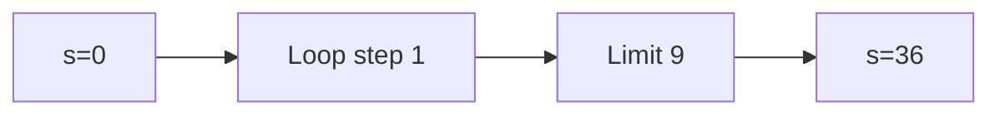

**📖 Penjelasan:**
**Langkah Tracing:**
1. Loop berjalan dengan langkah 1.
2. Hasil akumulasi: 36.

---
### Soal 31
```cpp
int n = 7, s = 0;
while(n > 0) { s += n; n -= 2; }
```
**Pertanyaan:**
1. Berapakah hasil akhirnya?
2. Mengapa demikian?

**Jawaban & Diagnosis:**
1. **16**
2. Lihat Tracing.

**Mermaid Flowchart:**
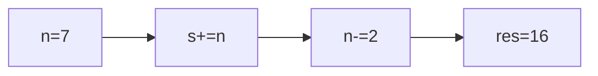

**📖 Penjelasan:**
**Langkah Tracing:**
1. Loop berjalan dengan langkah 2.
2. Hasil akumulasi: 16.

---
### Soal 32
```cpp
int s = 0;
for(int i=0; i<7; i+=1) s += i;
```
**Pertanyaan:**
1. Berapakah hasil akhirnya?
2. Mengapa demikian?

**Jawaban & Diagnosis:**
1. **21**
2. Lihat Tracing.

**Mermaid Flowchart:**


**📖 Penjelasan:**
**Langkah Tracing:**
1. Loop berjalan dengan langkah 1.
2. Hasil akumulasi: 21.

---
### Soal 33
```cpp
int n = 10, s = 0;
while(n > 0) { s += n; n -= 1; }
```
**Pertanyaan:**
1. Berapakah hasil akhirnya?
2. Mengapa demikian?

**Jawaban & Diagnosis:**
1. **55**
2. Lihat Tracing.

**Mermaid Flowchart:**
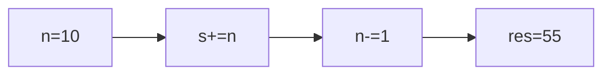

**📖 Penjelasan:**
**Langkah Tracing:**
1. Loop berjalan dengan langkah 1.
2. Hasil akumulasi: 55.

---
### Soal 34
```cpp
int n = 10, s = 0;
while(n > 0) { s += n; n -= 1; }
```
**Pertanyaan:**
1. Berapakah hasil akhirnya?
2. Mengapa demikian?

**Jawaban & Diagnosis:**
1. **55**
2. Lihat Tracing.

**Mermaid Flowchart:**


**📖 Penjelasan:**
**Langkah Tracing:**
1. Loop berjalan dengan langkah 1.
2. Hasil akumulasi: 55.

---
### Soal 35
```cpp
int s = 0;
for(int i=0; i<9; i+=1) s += i;
```
**Pertanyaan:**
1. Berapakah hasil akhirnya?
2. Mengapa demikian?

**Jawaban & Diagnosis:**
1. **36**
2. Lihat Tracing.

**Mermaid Flowchart:**


**📖 Penjelasan:**
**Langkah Tracing:**
1. Loop berjalan dengan langkah 1.
2. Hasil akumulasi: 36.

---
### Soal 36
```cpp
int s = 0;
for(int i=0; i<7; i+=2) s += i;
```
**Pertanyaan:**
1. Berapakah hasil akhirnya?
2. Mengapa demikian?

**Jawaban & Diagnosis:**
1. **12**
2. Lihat Tracing.

**Mermaid Flowchart:**
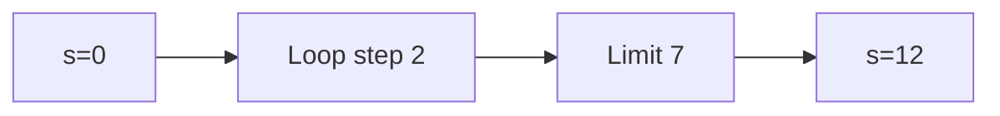

**📖 Penjelasan:**
**Langkah Tracing:**
1. Loop berjalan dengan langkah 2.
2. Hasil akumulasi: 12.

---
### Soal 37
```cpp
int n = 9, s = 0;
while(n > 0) { s += n; n -= 3; }
```
**Pertanyaan:**
1. Berapakah hasil akhirnya?
2. Mengapa demikian?

**Jawaban & Diagnosis:**
1. **18**
2. Lihat Tracing.

**Mermaid Flowchart:**


**📖 Penjelasan:**
**Langkah Tracing:**
1. Loop berjalan dengan langkah 3.
2. Hasil akumulasi: 18.

---
### Soal 38
```cpp
int s = 0;
for(int i=0; i<8; i+=2) s += i;
```
**Pertanyaan:**
1. Berapakah hasil akhirnya?
2. Mengapa demikian?

**Jawaban & Diagnosis:**
1. **12**
2. Lihat Tracing.

**Mermaid Flowchart:**
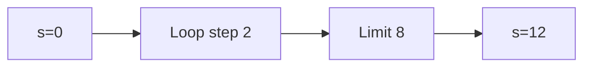

**📖 Penjelasan:**
**Langkah Tracing:**
1. Loop berjalan dengan langkah 2.
2. Hasil akumulasi: 12.

---
### Soal 39
```cpp
int s = 0;
for(int i=0; i<5; i+=3) s += i;
```
**Pertanyaan:**
1. Berapakah hasil akhirnya?
2. Mengapa demikian?

**Jawaban & Diagnosis:**
1. **3**
2. Lihat Tracing.

**Mermaid Flowchart:**
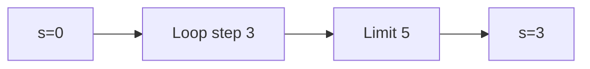

**📖 Penjelasan:**
**Langkah Tracing:**
1. Loop berjalan dengan langkah 3.
2. Hasil akumulasi: 3.

---
### Soal 40
```cpp
int n = 5, s = 0;
while(n > 0) { s += n; n -= 2; }
```
**Pertanyaan:**
1. Berapakah hasil akhirnya?
2. Mengapa demikian?

**Jawaban & Diagnosis:**
1. **9**
2. Lihat Tracing.

**Mermaid Flowchart:**
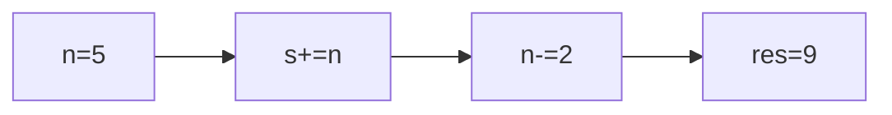

**📖 Penjelasan:**
**Langkah Tracing:**
1. Loop berjalan dengan langkah 2.
2. Hasil akumulasi: 9.

---
### Soal 41
```cpp
int s = 0;
for(int i=0; i<9; i+=1) s += i;
```
**Pertanyaan:**
1. Berapakah hasil akhirnya?
2. Mengapa demikian?

**Jawaban & Diagnosis:**
1. **36**
2. Lihat Tracing.

**Mermaid Flowchart:**


**📖 Penjelasan:**
**Langkah Tracing:**
1. Loop berjalan dengan langkah 1.
2. Hasil akumulasi: 36.

---
### Soal 42
```cpp
int n = 7, s = 0;
while(n > 0) { s += n; n -= 1; }
```
**Pertanyaan:**
1. Berapakah hasil akhirnya?
2. Mengapa demikian?

**Jawaban & Diagnosis:**
1. **28**
2. Lihat Tracing.

**Mermaid Flowchart:**
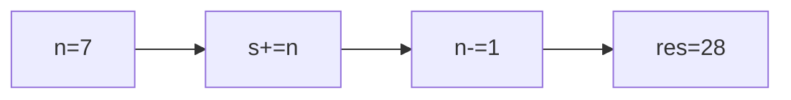

**📖 Penjelasan:**
**Langkah Tracing:**
1. Loop berjalan dengan langkah 1.
2. Hasil akumulasi: 28.

---
### Soal 43
```cpp
int n = 6, s = 0;
while(n > 0) { s += n; n -= 3; }
```
**Pertanyaan:**
1. Berapakah hasil akhirnya?
2. Mengapa demikian?

**Jawaban & Diagnosis:**
1. **9**
2. Lihat Tracing.

**Mermaid Flowchart:**
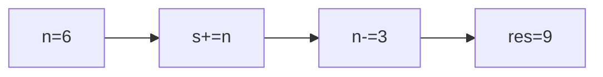

**📖 Penjelasan:**
**Langkah Tracing:**
1. Loop berjalan dengan langkah 3.
2. Hasil akumulasi: 9.

---
### Soal 44
```cpp
int s = 0;
for(int i=0; i<10; i+=2) s += i;
```
**Pertanyaan:**
1. Berapakah hasil akhirnya?
2. Mengapa demikian?

**Jawaban & Diagnosis:**
1. **20**
2. Lihat Tracing.

**Mermaid Flowchart:**
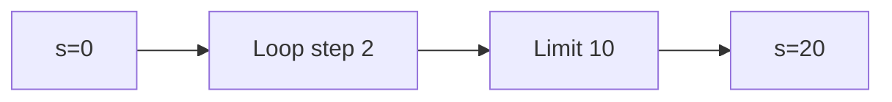

**📖 Penjelasan:**
**Langkah Tracing:**
1. Loop berjalan dengan langkah 2.
2. Hasil akumulasi: 20.

---
### Soal 45
```cpp
int s = 0;
for(int i=0; i<5; i+=3) s += i;
```
**Pertanyaan:**
1. Berapakah hasil akhirnya?
2. Mengapa demikian?

**Jawaban & Diagnosis:**
1. **3**
2. Lihat Tracing.

**Mermaid Flowchart:**


**📖 Penjelasan:**
**Langkah Tracing:**
1. Loop berjalan dengan langkah 3.
2. Hasil akumulasi: 3.

---
### Soal 46
```cpp
int n = 9, s = 0;
while(n > 0) { s += n; n -= 2; }
```
**Pertanyaan:**
1. Berapakah hasil akhirnya?
2. Mengapa demikian?

**Jawaban & Diagnosis:**
1. **25**
2. Lihat Tracing.

**Mermaid Flowchart:**
```mermaid
graph LR
A["n=9"] --> B["s+=n"]
B --> C["n-=2"]
C --> D["res=25"]
```

**📖 Penjelasan:**
**Langkah Tracing:**
1. Loop berjalan dengan langkah 2.
2. Hasil akumulasi: 25.

---
### Soal 47
```cpp
int n = 5, s = 0;
while(n > 0) { s += n; n -= 1; }
```
**Pertanyaan:**
1. Berapakah hasil akhirnya?
2. Mengapa demikian?

**Jawaban & Diagnosis:**
1. **15**
2. Lihat Tracing.

**Mermaid Flowchart:**
```mermaid
graph LR
A["n=5"] --> B["s+=n"]
B --> C["n-=1"]
C --> D["res=15"]
```

**📖 Penjelasan:**
**Langkah Tracing:**
1. Loop berjalan dengan langkah 1.
2. Hasil akumulasi: 15.

---
### Soal 48
```cpp
int s = 0;
for(int i=0; i<8; i+=2) s += i;
```
**Pertanyaan:**
1. Berapakah hasil akhirnya?
2. Mengapa demikian?

**Jawaban & Diagnosis:**
1. **12**
2. Lihat Tracing.

**Mermaid Flowchart:**
```mermaid
graph LR
A["s=0"] --> B["Loop step 2"]
B --> C["Limit 8"]
C --> D["s=12"]
```

**📖 Penjelasan:**
**Langkah Tracing:**
1. Loop berjalan dengan langkah 2.
2. Hasil akumulasi: 12.

---
### Soal 49
```cpp
int n = 8, s = 0;
while(n > 0) { s += n; n -= 1; }
```
**Pertanyaan:**
1. Berapakah hasil akhirnya?
2. Mengapa demikian?

**Jawaban & Diagnosis:**
1. **36**
2. Lihat Tracing.

**Mermaid Flowchart:**
```mermaid
graph LR
A["n=8"] --> B["s+=n"]
B --> C["n-=1"]
C --> D["res=36"]
```

**📖 Penjelasan:**
**Langkah Tracing:**
1. Loop berjalan dengan langkah 1.
2. Hasil akumulasi: 36.

---
### Soal 50
```cpp
int n = 5, s = 0;
while(n > 0) { s += n; n -= 3; }
```
**Pertanyaan:**
1. Berapakah hasil akhirnya?
2. Mengapa demikian?

**Jawaban & Diagnosis:**
1. **7**
2. Lihat Tracing.

**Mermaid Flowchart:**
```mermaid
graph LR
A["n=5"] --> B["s+=n"]
B --> C["n-=3"]
C --> D["res=7"]
```

**📖 Penjelasan:**
**Langkah Tracing:**
1. Loop berjalan dengan langkah 3.
2. Hasil akumulasi: 7.

---
