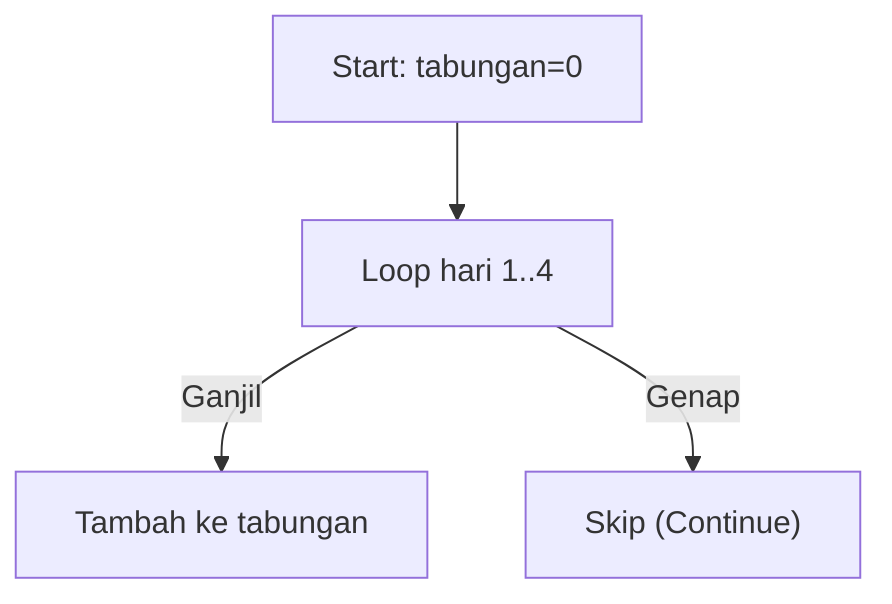

🔙 **[Kembali ke Daftar Soal](./README.md)**

---

# Latihan Soal Part C - Modul 03 - Set 02

### Soal 26
```cpp
int tabungan = 0;
for(int hari=1; hari<=6; hari++) {
  if (hari % 2 == 0) continue;
  tabungan += hari;
}
```
**Pertanyaan:**
1. Berapakah hasil akhirnya?
2. Deskripsikan langkah robot compiler saat memproses kode ini!

**Jawaban & Diagnosis:**
1. **9**
2. Baca bagian 'Analisis Mendalam' di bawah.

**Mermaid Flowchart:**


**📖 Penjelasan Komprehensif:**
**Analisis Mendalam (Compiler Manusia):**
1. **Misi**: Menghitung tabungan yang hanya diisi pada hari ganjil saja.
2. **Tracing**: Hari ganjil yang masuk adalah [1, 3, 5].
3. **Alur**: `continue` memaksa mesin melompati hari genap.
4. **Hasil Akhir**: Total `tabungan` adalah **9**.

---
### Soal 27
```cpp
int tabungan = 0;
for(int hari=1; hari<=3; hari++) {
  if (hari % 2 == 0) continue;
  tabungan += hari;
}
```
**Pertanyaan:**
1. Berapakah hasil akhirnya?
2. Deskripsikan langkah robot compiler saat memproses kode ini!

**Jawaban & Diagnosis:**
1. **4**
2. Baca bagian 'Analisis Mendalam' di bawah.

**Mermaid Flowchart:**


**📖 Penjelasan Komprehensif:**
**Analisis Mendalam (Compiler Manusia):**
1. **Misi**: Menghitung tabungan yang hanya diisi pada hari ganjil saja.
2. **Tracing**: Hari ganjil yang masuk adalah [1, 3].
3. **Alur**: `continue` memaksa mesin melompati hari genap.
4. **Hasil Akhir**: Total `tabungan` adalah **4**.

---
### Soal 28
```cpp
int tabungan = 0;
for(int hari=1; hari<=3; hari++) {
  if (hari % 2 == 0) continue;
  tabungan += hari;
}
```
**Pertanyaan:**
1. Berapakah hasil akhirnya?
2. Deskripsikan langkah robot compiler saat memproses kode ini!

**Jawaban & Diagnosis:**
1. **4**
2. Baca bagian 'Analisis Mendalam' di bawah.

**Mermaid Flowchart:**


**📖 Penjelasan Komprehensif:**
**Analisis Mendalam (Compiler Manusia):**
1. **Misi**: Menghitung tabungan yang hanya diisi pada hari ganjil saja.
2. **Tracing**: Hari ganjil yang masuk adalah [1, 3].
3. **Alur**: `continue` memaksa mesin melompati hari genap.
4. **Hasil Akhir**: Total `tabungan` adalah **4**.

---
### Soal 29
```cpp
int tabungan = 0;
for(int hari=1; hari<=5; hari++) {
  if (hari % 2 == 0) continue;
  tabungan += hari;
}
```
**Pertanyaan:**
1. Berapakah hasil akhirnya?
2. Deskripsikan langkah robot compiler saat memproses kode ini!

**Jawaban & Diagnosis:**
1. **9**
2. Baca bagian 'Analisis Mendalam' di bawah.

**Mermaid Flowchart:**


**📖 Penjelasan Komprehensif:**
**Analisis Mendalam (Compiler Manusia):**
1. **Misi**: Menghitung tabungan yang hanya diisi pada hari ganjil saja.
2. **Tracing**: Hari ganjil yang masuk adalah [1, 3, 5].
3. **Alur**: `continue` memaksa mesin melompati hari genap.
4. **Hasil Akhir**: Total `tabungan` adalah **9**.

---
### Soal 30
```cpp
int tabungan = 0;
for(int hari=1; hari<=4; hari++) {
  if (hari % 2 == 0) continue;
  tabungan += hari;
}
```
**Pertanyaan:**
1. Berapakah hasil akhirnya?
2. Deskripsikan langkah robot compiler saat memproses kode ini!

**Jawaban & Diagnosis:**
1. **4**
2. Baca bagian 'Analisis Mendalam' di bawah.

**Mermaid Flowchart:**


**📖 Penjelasan Komprehensif:**
**Analisis Mendalam (Compiler Manusia):**
1. **Misi**: Menghitung tabungan yang hanya diisi pada hari ganjil saja.
2. **Tracing**: Hari ganjil yang masuk adalah [1, 3].
3. **Alur**: `continue` memaksa mesin melompati hari genap.
4. **Hasil Akhir**: Total `tabungan` adalah **4**.

---
### Soal 31
```cpp
int tabungan = 0;
for(int hari=1; hari<=4; hari++) {
  if (hari % 2 == 0) continue;
  tabungan += hari;
}
```
**Pertanyaan:**
1. Berapakah hasil akhirnya?
2. Deskripsikan langkah robot compiler saat memproses kode ini!

**Jawaban & Diagnosis:**
1. **4**
2. Baca bagian 'Analisis Mendalam' di bawah.

**Mermaid Flowchart:**


**📖 Penjelasan Komprehensif:**
**Analisis Mendalam (Compiler Manusia):**
1. **Misi**: Menghitung tabungan yang hanya diisi pada hari ganjil saja.
2. **Tracing**: Hari ganjil yang masuk adalah [1, 3].
3. **Alur**: `continue` memaksa mesin melompati hari genap.
4. **Hasil Akhir**: Total `tabungan` adalah **4**.

---
### Soal 32
```cpp
int tabungan = 0;
for(int hari=1; hari<=6; hari++) {
  if (hari % 2 == 0) continue;
  tabungan += hari;
}
```
**Pertanyaan:**
1. Berapakah hasil akhirnya?
2. Deskripsikan langkah robot compiler saat memproses kode ini!

**Jawaban & Diagnosis:**
1. **9**
2. Baca bagian 'Analisis Mendalam' di bawah.

**Mermaid Flowchart:**


**📖 Penjelasan Komprehensif:**
**Analisis Mendalam (Compiler Manusia):**
1. **Misi**: Menghitung tabungan yang hanya diisi pada hari ganjil saja.
2. **Tracing**: Hari ganjil yang masuk adalah [1, 3, 5].
3. **Alur**: `continue` memaksa mesin melompati hari genap.
4. **Hasil Akhir**: Total `tabungan` adalah **9**.

---
### Soal 33
```cpp
int tabungan = 0;
for(int hari=1; hari<=6; hari++) {
  if (hari % 2 == 0) continue;
  tabungan += hari;
}
```
**Pertanyaan:**
1. Berapakah hasil akhirnya?
2. Deskripsikan langkah robot compiler saat memproses kode ini!

**Jawaban & Diagnosis:**
1. **9**
2. Baca bagian 'Analisis Mendalam' di bawah.

**Mermaid Flowchart:**


**📖 Penjelasan Komprehensif:**
**Analisis Mendalam (Compiler Manusia):**
1. **Misi**: Menghitung tabungan yang hanya diisi pada hari ganjil saja.
2. **Tracing**: Hari ganjil yang masuk adalah [1, 3, 5].
3. **Alur**: `continue` memaksa mesin melompati hari genap.
4. **Hasil Akhir**: Total `tabungan` adalah **9**.

---
### Soal 34
```cpp
int tabungan = 0;
for(int hari=1; hari<=6; hari++) {
  if (hari % 2 == 0) continue;
  tabungan += hari;
}
```
**Pertanyaan:**
1. Berapakah hasil akhirnya?
2. Deskripsikan langkah robot compiler saat memproses kode ini!

**Jawaban & Diagnosis:**
1. **9**
2. Baca bagian 'Analisis Mendalam' di bawah.

**Mermaid Flowchart:**


**📖 Penjelasan Komprehensif:**
**Analisis Mendalam (Compiler Manusia):**
1. **Misi**: Menghitung tabungan yang hanya diisi pada hari ganjil saja.
2. **Tracing**: Hari ganjil yang masuk adalah [1, 3, 5].
3. **Alur**: `continue` memaksa mesin melompati hari genap.
4. **Hasil Akhir**: Total `tabungan` adalah **9**.

---
### Soal 35
```cpp
int tabungan = 0;
for(int hari=1; hari<=3; hari++) {
  if (hari % 2 == 0) continue;
  tabungan += hari;
}
```
**Pertanyaan:**
1. Berapakah hasil akhirnya?
2. Deskripsikan langkah robot compiler saat memproses kode ini!

**Jawaban & Diagnosis:**
1. **4**
2. Baca bagian 'Analisis Mendalam' di bawah.

**Mermaid Flowchart:**


**📖 Penjelasan Komprehensif:**
**Analisis Mendalam (Compiler Manusia):**
1. **Misi**: Menghitung tabungan yang hanya diisi pada hari ganjil saja.
2. **Tracing**: Hari ganjil yang masuk adalah [1, 3].
3. **Alur**: `continue` memaksa mesin melompati hari genap.
4. **Hasil Akhir**: Total `tabungan` adalah **4**.

---
### Soal 36
```cpp
int tabungan = 0;
for(int hari=1; hari<=5; hari++) {
  if (hari % 2 == 0) continue;
  tabungan += hari;
}
```
**Pertanyaan:**
1. Berapakah hasil akhirnya?
2. Deskripsikan langkah robot compiler saat memproses kode ini!

**Jawaban & Diagnosis:**
1. **9**
2. Baca bagian 'Analisis Mendalam' di bawah.

**Mermaid Flowchart:**


**📖 Penjelasan Komprehensif:**
**Analisis Mendalam (Compiler Manusia):**
1. **Misi**: Menghitung tabungan yang hanya diisi pada hari ganjil saja.
2. **Tracing**: Hari ganjil yang masuk adalah [1, 3, 5].
3. **Alur**: `continue` memaksa mesin melompati hari genap.
4. **Hasil Akhir**: Total `tabungan` adalah **9**.

---
### Soal 37
```cpp
int tabungan = 0;
for(int hari=1; hari<=4; hari++) {
  if (hari % 2 == 0) continue;
  tabungan += hari;
}
```
**Pertanyaan:**
1. Berapakah hasil akhirnya?
2. Deskripsikan langkah robot compiler saat memproses kode ini!

**Jawaban & Diagnosis:**
1. **4**
2. Baca bagian 'Analisis Mendalam' di bawah.

**Mermaid Flowchart:**


**📖 Penjelasan Komprehensif:**
**Analisis Mendalam (Compiler Manusia):**
1. **Misi**: Menghitung tabungan yang hanya diisi pada hari ganjil saja.
2. **Tracing**: Hari ganjil yang masuk adalah [1, 3].
3. **Alur**: `continue` memaksa mesin melompati hari genap.
4. **Hasil Akhir**: Total `tabungan` adalah **4**.

---
### Soal 38
```cpp
int tabungan = 0;
for(int hari=1; hari<=3; hari++) {
  if (hari % 2 == 0) continue;
  tabungan += hari;
}
```
**Pertanyaan:**
1. Berapakah hasil akhirnya?
2. Deskripsikan langkah robot compiler saat memproses kode ini!

**Jawaban & Diagnosis:**
1. **4**
2. Baca bagian 'Analisis Mendalam' di bawah.

**Mermaid Flowchart:**


**📖 Penjelasan Komprehensif:**
**Analisis Mendalam (Compiler Manusia):**
1. **Misi**: Menghitung tabungan yang hanya diisi pada hari ganjil saja.
2. **Tracing**: Hari ganjil yang masuk adalah [1, 3].
3. **Alur**: `continue` memaksa mesin melompati hari genap.
4. **Hasil Akhir**: Total `tabungan` adalah **4**.

---
### Soal 39
```cpp
int tabungan = 0;
for(int hari=1; hari<=3; hari++) {
  if (hari % 2 == 0) continue;
  tabungan += hari;
}
```
**Pertanyaan:**
1. Berapakah hasil akhirnya?
2. Deskripsikan langkah robot compiler saat memproses kode ini!

**Jawaban & Diagnosis:**
1. **4**
2. Baca bagian 'Analisis Mendalam' di bawah.

**Mermaid Flowchart:**


**📖 Penjelasan Komprehensif:**
**Analisis Mendalam (Compiler Manusia):**
1. **Misi**: Menghitung tabungan yang hanya diisi pada hari ganjil saja.
2. **Tracing**: Hari ganjil yang masuk adalah [1, 3].
3. **Alur**: `continue` memaksa mesin melompati hari genap.
4. **Hasil Akhir**: Total `tabungan` adalah **4**.

---
### Soal 40
```cpp
int tabungan = 0;
for(int hari=1; hari<=4; hari++) {
  if (hari % 2 == 0) continue;
  tabungan += hari;
}
```
**Pertanyaan:**
1. Berapakah hasil akhirnya?
2. Deskripsikan langkah robot compiler saat memproses kode ini!

**Jawaban & Diagnosis:**
1. **4**
2. Baca bagian 'Analisis Mendalam' di bawah.

**Mermaid Flowchart:**


**📖 Penjelasan Komprehensif:**
**Analisis Mendalam (Compiler Manusia):**
1. **Misi**: Menghitung tabungan yang hanya diisi pada hari ganjil saja.
2. **Tracing**: Hari ganjil yang masuk adalah [1, 3].
3. **Alur**: `continue` memaksa mesin melompati hari genap.
4. **Hasil Akhir**: Total `tabungan` adalah **4**.

---
### Soal 41
```cpp
int tabungan = 0;
for(int hari=1; hari<=3; hari++) {
  if (hari % 2 == 0) continue;
  tabungan += hari;
}
```
**Pertanyaan:**
1. Berapakah hasil akhirnya?
2. Deskripsikan langkah robot compiler saat memproses kode ini!

**Jawaban & Diagnosis:**
1. **4**
2. Baca bagian 'Analisis Mendalam' di bawah.

**Mermaid Flowchart:**


**📖 Penjelasan Komprehensif:**
**Analisis Mendalam (Compiler Manusia):**
1. **Misi**: Menghitung tabungan yang hanya diisi pada hari ganjil saja.
2. **Tracing**: Hari ganjil yang masuk adalah [1, 3].
3. **Alur**: `continue` memaksa mesin melompati hari genap.
4. **Hasil Akhir**: Total `tabungan` adalah **4**.

---
### Soal 42
```cpp
int tabungan = 0;
for(int hari=1; hari<=5; hari++) {
  if (hari % 2 == 0) continue;
  tabungan += hari;
}
```
**Pertanyaan:**
1. Berapakah hasil akhirnya?
2. Deskripsikan langkah robot compiler saat memproses kode ini!

**Jawaban & Diagnosis:**
1. **9**
2. Baca bagian 'Analisis Mendalam' di bawah.

**Mermaid Flowchart:**


**📖 Penjelasan Komprehensif:**
**Analisis Mendalam (Compiler Manusia):**
1. **Misi**: Menghitung tabungan yang hanya diisi pada hari ganjil saja.
2. **Tracing**: Hari ganjil yang masuk adalah [1, 3, 5].
3. **Alur**: `continue` memaksa mesin melompati hari genap.
4. **Hasil Akhir**: Total `tabungan` adalah **9**.

---
### Soal 43
```cpp
int tabungan = 0;
for(int hari=1; hari<=3; hari++) {
  if (hari % 2 == 0) continue;
  tabungan += hari;
}
```
**Pertanyaan:**
1. Berapakah hasil akhirnya?
2. Deskripsikan langkah robot compiler saat memproses kode ini!

**Jawaban & Diagnosis:**
1. **4**
2. Baca bagian 'Analisis Mendalam' di bawah.

**Mermaid Flowchart:**


**📖 Penjelasan Komprehensif:**
**Analisis Mendalam (Compiler Manusia):**
1. **Misi**: Menghitung tabungan yang hanya diisi pada hari ganjil saja.
2. **Tracing**: Hari ganjil yang masuk adalah [1, 3].
3. **Alur**: `continue` memaksa mesin melompati hari genap.
4. **Hasil Akhir**: Total `tabungan` adalah **4**.

---
### Soal 44
```cpp
int tabungan = 0;
for(int hari=1; hari<=5; hari++) {
  if (hari % 2 == 0) continue;
  tabungan += hari;
}
```
**Pertanyaan:**
1. Berapakah hasil akhirnya?
2. Deskripsikan langkah robot compiler saat memproses kode ini!

**Jawaban & Diagnosis:**
1. **9**
2. Baca bagian 'Analisis Mendalam' di bawah.

**Mermaid Flowchart:**


**📖 Penjelasan Komprehensif:**
**Analisis Mendalam (Compiler Manusia):**
1. **Misi**: Menghitung tabungan yang hanya diisi pada hari ganjil saja.
2. **Tracing**: Hari ganjil yang masuk adalah [1, 3, 5].
3. **Alur**: `continue` memaksa mesin melompati hari genap.
4. **Hasil Akhir**: Total `tabungan` adalah **9**.

---
### Soal 45
```cpp
int tabungan = 0;
for(int hari=1; hari<=4; hari++) {
  if (hari % 2 == 0) continue;
  tabungan += hari;
}
```
**Pertanyaan:**
1. Berapakah hasil akhirnya?
2. Deskripsikan langkah robot compiler saat memproses kode ini!

**Jawaban & Diagnosis:**
1. **4**
2. Baca bagian 'Analisis Mendalam' di bawah.

**Mermaid Flowchart:**


**📖 Penjelasan Komprehensif:**
**Analisis Mendalam (Compiler Manusia):**
1. **Misi**: Menghitung tabungan yang hanya diisi pada hari ganjil saja.
2. **Tracing**: Hari ganjil yang masuk adalah [1, 3].
3. **Alur**: `continue` memaksa mesin melompati hari genap.
4. **Hasil Akhir**: Total `tabungan` adalah **4**.

---
### Soal 46
```cpp
int tabungan = 0;
for(int hari=1; hari<=5; hari++) {
  if (hari % 2 == 0) continue;
  tabungan += hari;
}
```
**Pertanyaan:**
1. Berapakah hasil akhirnya?
2. Deskripsikan langkah robot compiler saat memproses kode ini!

**Jawaban & Diagnosis:**
1. **9**
2. Baca bagian 'Analisis Mendalam' di bawah.

**Mermaid Flowchart:**
```mermaid
graph TD
A["Start: tabungan=0"] --> B["Loop hari 1..5"]
B -- Ganjil --> C["Tambah ke tabungan"]
B -- Genap --> D["Skip (Continue)"]
```

**📖 Penjelasan Komprehensif:**
**Analisis Mendalam (Compiler Manusia):**
1. **Misi**: Menghitung tabungan yang hanya diisi pada hari ganjil saja.
2. **Tracing**: Hari ganjil yang masuk adalah [1, 3, 5].
3. **Alur**: `continue` memaksa mesin melompati hari genap.
4. **Hasil Akhir**: Total `tabungan` adalah **9**.

---
### Soal 47
```cpp
int tabungan = 0;
for(int hari=1; hari<=6; hari++) {
  if (hari % 2 == 0) continue;
  tabungan += hari;
}
```
**Pertanyaan:**
1. Berapakah hasil akhirnya?
2. Deskripsikan langkah robot compiler saat memproses kode ini!

**Jawaban & Diagnosis:**
1. **9**
2. Baca bagian 'Analisis Mendalam' di bawah.

**Mermaid Flowchart:**
```mermaid
graph TD
A["Start: tabungan=0"] --> B["Loop hari 1..6"]
B -- Ganjil --> C["Tambah ke tabungan"]
B -- Genap --> D["Skip (Continue)"]
```

**📖 Penjelasan Komprehensif:**
**Analisis Mendalam (Compiler Manusia):**
1. **Misi**: Menghitung tabungan yang hanya diisi pada hari ganjil saja.
2. **Tracing**: Hari ganjil yang masuk adalah [1, 3, 5].
3. **Alur**: `continue` memaksa mesin melompati hari genap.
4. **Hasil Akhir**: Total `tabungan` adalah **9**.

---
### Soal 48
```cpp
int tabungan = 0;
for(int hari=1; hari<=4; hari++) {
  if (hari % 2 == 0) continue;
  tabungan += hari;
}
```
**Pertanyaan:**
1. Berapakah hasil akhirnya?
2. Deskripsikan langkah robot compiler saat memproses kode ini!

**Jawaban & Diagnosis:**
1. **4**
2. Baca bagian 'Analisis Mendalam' di bawah.

**Mermaid Flowchart:**
```mermaid
graph TD
A["Start: tabungan=0"] --> B["Loop hari 1..4"]
B -- Ganjil --> C["Tambah ke tabungan"]
B -- Genap --> D["Skip (Continue)"]
```

**📖 Penjelasan Komprehensif:**
**Analisis Mendalam (Compiler Manusia):**
1. **Misi**: Menghitung tabungan yang hanya diisi pada hari ganjil saja.
2. **Tracing**: Hari ganjil yang masuk adalah [1, 3].
3. **Alur**: `continue` memaksa mesin melompati hari genap.
4. **Hasil Akhir**: Total `tabungan` adalah **4**.

---
### Soal 49
```cpp
int tabungan = 0;
for(int hari=1; hari<=6; hari++) {
  if (hari % 2 == 0) continue;
  tabungan += hari;
}
```
**Pertanyaan:**
1. Berapakah hasil akhirnya?
2. Deskripsikan langkah robot compiler saat memproses kode ini!

**Jawaban & Diagnosis:**
1. **9**
2. Baca bagian 'Analisis Mendalam' di bawah.

**Mermaid Flowchart:**
```mermaid
graph TD
A["Start: tabungan=0"] --> B["Loop hari 1..6"]
B -- Ganjil --> C["Tambah ke tabungan"]
B -- Genap --> D["Skip (Continue)"]
```

**📖 Penjelasan Komprehensif:**
**Analisis Mendalam (Compiler Manusia):**
1. **Misi**: Menghitung tabungan yang hanya diisi pada hari ganjil saja.
2. **Tracing**: Hari ganjil yang masuk adalah [1, 3, 5].
3. **Alur**: `continue` memaksa mesin melompati hari genap.
4. **Hasil Akhir**: Total `tabungan` adalah **9**.

---
### Soal 50
```cpp
int tabungan = 0;
for(int hari=1; hari<=4; hari++) {
  if (hari % 2 == 0) continue;
  tabungan += hari;
}
```
**Pertanyaan:**
1. Berapakah hasil akhirnya?
2. Deskripsikan langkah robot compiler saat memproses kode ini!

**Jawaban & Diagnosis:**
1. **4**
2. Baca bagian 'Analisis Mendalam' di bawah.

**Mermaid Flowchart:**
```mermaid
graph TD
A["Start: tabungan=0"] --> B["Loop hari 1..4"]
B -- Ganjil --> C["Tambah ke tabungan"]
B -- Genap --> D["Skip (Continue)"]
```

**📖 Penjelasan Komprehensif:**
**Analisis Mendalam (Compiler Manusia):**
1. **Misi**: Menghitung tabungan yang hanya diisi pada hari ganjil saja.
2. **Tracing**: Hari ganjil yang masuk adalah [1, 3].
3. **Alur**: `continue` memaksa mesin melompati hari genap.
4. **Hasil Akhir**: Total `tabungan` adalah **4**.

---
