🔙 **[Kembali ke Daftar Soal](./README.md)**

---

# Latihan Soal Part C - Modul 03 - Set 03

### Soal 51
```cpp
int s = 0;
for(int i=0; i<10; i+=2) s += i;
```
**Pertanyaan:**
1. Berapakah hasil akhirnya?
2. Mengapa demikian?

**Jawaban & Diagnosis:**
1. **20**
2. Lihat Tracing.

**Mermaid Flowchart:**
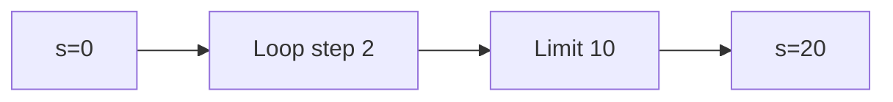

**📖 Penjelasan:**
**Langkah Tracing:**
1. Loop berjalan dengan langkah 2.
2. Hasil akumulasi: 20.

---
### Soal 52
```cpp
int n = 7, s = 0;
while(n > 0) { s += n; n -= 3; }
```
**Pertanyaan:**
1. Berapakah hasil akhirnya?
2. Mengapa demikian?

**Jawaban & Diagnosis:**
1. **12**
2. Lihat Tracing.

**Mermaid Flowchart:**
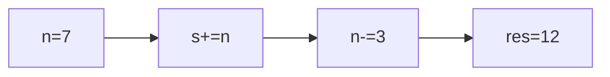

**📖 Penjelasan:**
**Langkah Tracing:**
1. Loop berjalan dengan langkah 3.
2. Hasil akumulasi: 12.

---
### Soal 53
```cpp
int n = 7, s = 0;
while(n > 0) { s += n; n -= 2; }
```
**Pertanyaan:**
1. Berapakah hasil akhirnya?
2. Mengapa demikian?

**Jawaban & Diagnosis:**
1. **16**
2. Lihat Tracing.

**Mermaid Flowchart:**
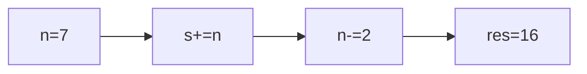

**📖 Penjelasan:**
**Langkah Tracing:**
1. Loop berjalan dengan langkah 2.
2. Hasil akumulasi: 16.

---
### Soal 54
```cpp
int n = 5, s = 0;
while(n > 0) { s += n; n -= 1; }
```
**Pertanyaan:**
1. Berapakah hasil akhirnya?
2. Mengapa demikian?

**Jawaban & Diagnosis:**
1. **15**
2. Lihat Tracing.

**Mermaid Flowchart:**
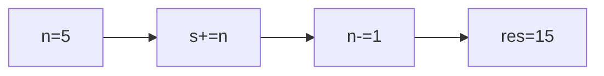

**📖 Penjelasan:**
**Langkah Tracing:**
1. Loop berjalan dengan langkah 1.
2. Hasil akumulasi: 15.

---
### Soal 55
```cpp
int s = 0;
for(int i=0; i<8; i+=3) s += i;
```
**Pertanyaan:**
1. Berapakah hasil akhirnya?
2. Mengapa demikian?

**Jawaban & Diagnosis:**
1. **9**
2. Lihat Tracing.

**Mermaid Flowchart:**
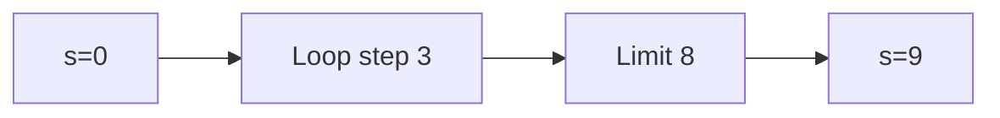

**📖 Penjelasan:**
**Langkah Tracing:**
1. Loop berjalan dengan langkah 3.
2. Hasil akumulasi: 9.

---
### Soal 56
```cpp
int n = 9, s = 0;
while(n > 0) { s += n; n -= 3; }
```
**Pertanyaan:**
1. Berapakah hasil akhirnya?
2. Mengapa demikian?

**Jawaban & Diagnosis:**
1. **18**
2. Lihat Tracing.

**Mermaid Flowchart:**
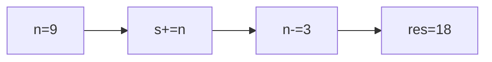

**📖 Penjelasan:**
**Langkah Tracing:**
1. Loop berjalan dengan langkah 3.
2. Hasil akumulasi: 18.

---
### Soal 57
```cpp
int s = 0;
for(int i=0; i<10; i+=2) s += i;
```
**Pertanyaan:**
1. Berapakah hasil akhirnya?
2. Mengapa demikian?

**Jawaban & Diagnosis:**
1. **20**
2. Lihat Tracing.

**Mermaid Flowchart:**


**📖 Penjelasan:**
**Langkah Tracing:**
1. Loop berjalan dengan langkah 2.
2. Hasil akumulasi: 20.

---
### Soal 58
```cpp
int s = 0;
for(int i=0; i<10; i+=2) s += i;
```
**Pertanyaan:**
1. Berapakah hasil akhirnya?
2. Mengapa demikian?

**Jawaban & Diagnosis:**
1. **20**
2. Lihat Tracing.

**Mermaid Flowchart:**


**📖 Penjelasan:**
**Langkah Tracing:**
1. Loop berjalan dengan langkah 2.
2. Hasil akumulasi: 20.

---
### Soal 59
```cpp
int n = 6, s = 0;
while(n > 0) { s += n; n -= 2; }
```
**Pertanyaan:**
1. Berapakah hasil akhirnya?
2. Mengapa demikian?

**Jawaban & Diagnosis:**
1. **12**
2. Lihat Tracing.

**Mermaid Flowchart:**
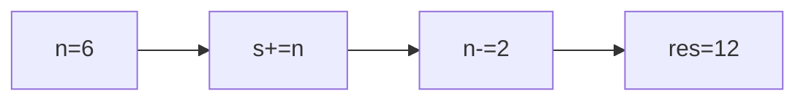

**📖 Penjelasan:**
**Langkah Tracing:**
1. Loop berjalan dengan langkah 2.
2. Hasil akumulasi: 12.

---
### Soal 60
```cpp
int s = 0;
for(int i=0; i<8; i+=1) s += i;
```
**Pertanyaan:**
1. Berapakah hasil akhirnya?
2. Mengapa demikian?

**Jawaban & Diagnosis:**
1. **28**
2. Lihat Tracing.

**Mermaid Flowchart:**
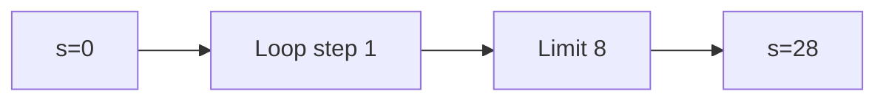

**📖 Penjelasan:**
**Langkah Tracing:**
1. Loop berjalan dengan langkah 1.
2. Hasil akumulasi: 28.

---
### Soal 61
```cpp
int n = 8, s = 0;
while(n > 0) { s += n; n -= 2; }
```
**Pertanyaan:**
1. Berapakah hasil akhirnya?
2. Mengapa demikian?

**Jawaban & Diagnosis:**
1. **20**
2. Lihat Tracing.

**Mermaid Flowchart:**
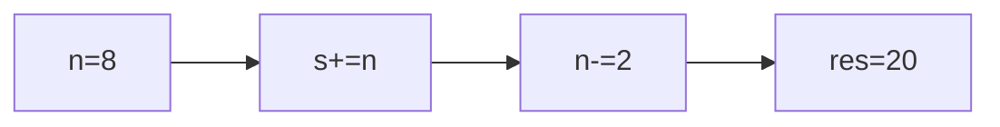

**📖 Penjelasan:**
**Langkah Tracing:**
1. Loop berjalan dengan langkah 2.
2. Hasil akumulasi: 20.

---
### Soal 62
```cpp
int n = 6, s = 0;
while(n > 0) { s += n; n -= 2; }
```
**Pertanyaan:**
1. Berapakah hasil akhirnya?
2. Mengapa demikian?

**Jawaban & Diagnosis:**
1. **12**
2. Lihat Tracing.

**Mermaid Flowchart:**


**📖 Penjelasan:**
**Langkah Tracing:**
1. Loop berjalan dengan langkah 2.
2. Hasil akumulasi: 12.

---
### Soal 63
```cpp
int s = 0;
for(int i=0; i<6; i+=1) s += i;
```
**Pertanyaan:**
1. Berapakah hasil akhirnya?
2. Mengapa demikian?

**Jawaban & Diagnosis:**
1. **15**
2. Lihat Tracing.

**Mermaid Flowchart:**
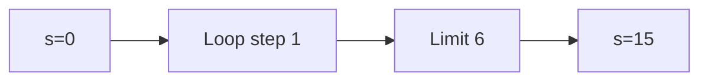

**📖 Penjelasan:**
**Langkah Tracing:**
1. Loop berjalan dengan langkah 1.
2. Hasil akumulasi: 15.

---
### Soal 64
```cpp
int s = 0;
for(int i=0; i<10; i+=1) s += i;
```
**Pertanyaan:**
1. Berapakah hasil akhirnya?
2. Mengapa demikian?

**Jawaban & Diagnosis:**
1. **45**
2. Lihat Tracing.

**Mermaid Flowchart:**
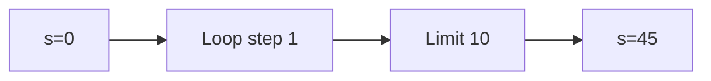

**📖 Penjelasan:**
**Langkah Tracing:**
1. Loop berjalan dengan langkah 1.
2. Hasil akumulasi: 45.

---
### Soal 65
```cpp
int s = 0;
for(int i=0; i<10; i+=3) s += i;
```
**Pertanyaan:**
1. Berapakah hasil akhirnya?
2. Mengapa demikian?

**Jawaban & Diagnosis:**
1. **18**
2. Lihat Tracing.

**Mermaid Flowchart:**
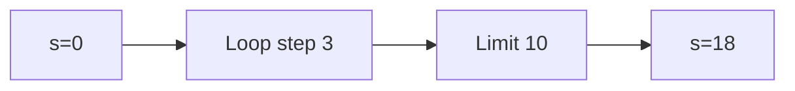

**📖 Penjelasan:**
**Langkah Tracing:**
1. Loop berjalan dengan langkah 3.
2. Hasil akumulasi: 18.

---
### Soal 66
```cpp
int s = 0;
for(int i=0; i<10; i+=2) s += i;
```
**Pertanyaan:**
1. Berapakah hasil akhirnya?
2. Mengapa demikian?

**Jawaban & Diagnosis:**
1. **20**
2. Lihat Tracing.

**Mermaid Flowchart:**


**📖 Penjelasan:**
**Langkah Tracing:**
1. Loop berjalan dengan langkah 2.
2. Hasil akumulasi: 20.

---
### Soal 67
```cpp
int n = 10, s = 0;
while(n > 0) { s += n; n -= 1; }
```
**Pertanyaan:**
1. Berapakah hasil akhirnya?
2. Mengapa demikian?

**Jawaban & Diagnosis:**
1. **55**
2. Lihat Tracing.

**Mermaid Flowchart:**
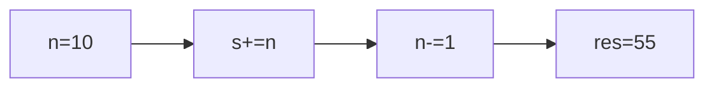

**📖 Penjelasan:**
**Langkah Tracing:**
1. Loop berjalan dengan langkah 1.
2. Hasil akumulasi: 55.

---
### Soal 68
```cpp
int n = 8, s = 0;
while(n > 0) { s += n; n -= 3; }
```
**Pertanyaan:**
1. Berapakah hasil akhirnya?
2. Mengapa demikian?

**Jawaban & Diagnosis:**
1. **15**
2. Lihat Tracing.

**Mermaid Flowchart:**
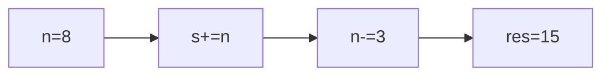

**📖 Penjelasan:**
**Langkah Tracing:**
1. Loop berjalan dengan langkah 3.
2. Hasil akumulasi: 15.

---
### Soal 69
```cpp
int n = 10, s = 0;
while(n > 0) { s += n; n -= 3; }
```
**Pertanyaan:**
1. Berapakah hasil akhirnya?
2. Mengapa demikian?

**Jawaban & Diagnosis:**
1. **22**
2. Lihat Tracing.

**Mermaid Flowchart:**
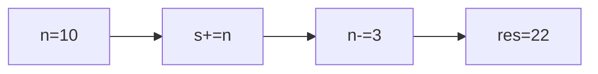

**📖 Penjelasan:**
**Langkah Tracing:**
1. Loop berjalan dengan langkah 3.
2. Hasil akumulasi: 22.

---
### Soal 70
```cpp
int s = 0;
for(int i=0; i<10; i+=2) s += i;
```
**Pertanyaan:**
1. Berapakah hasil akhirnya?
2. Mengapa demikian?

**Jawaban & Diagnosis:**
1. **20**
2. Lihat Tracing.

**Mermaid Flowchart:**


**📖 Penjelasan:**
**Langkah Tracing:**
1. Loop berjalan dengan langkah 2.
2. Hasil akumulasi: 20.

---
### Soal 71
```cpp
int s = 0;
for(int i=0; i<10; i+=1) s += i;
```
**Pertanyaan:**
1. Berapakah hasil akhirnya?
2. Mengapa demikian?

**Jawaban & Diagnosis:**
1. **45**
2. Lihat Tracing.

**Mermaid Flowchart:**
```mermaid
graph LR
A["s=0"] --> B["Loop step 1"]
B --> C["Limit 10"]
C --> D["s=45"]
```

**📖 Penjelasan:**
**Langkah Tracing:**
1. Loop berjalan dengan langkah 1.
2. Hasil akumulasi: 45.

---
### Soal 72
```cpp
int n = 6, s = 0;
while(n > 0) { s += n; n -= 2; }
```
**Pertanyaan:**
1. Berapakah hasil akhirnya?
2. Mengapa demikian?

**Jawaban & Diagnosis:**
1. **12**
2. Lihat Tracing.

**Mermaid Flowchart:**
```mermaid
graph LR
A["n=6"] --> B["s+=n"]
B --> C["n-=2"]
C --> D["res=12"]
```

**📖 Penjelasan:**
**Langkah Tracing:**
1. Loop berjalan dengan langkah 2.
2. Hasil akumulasi: 12.

---
### Soal 73
```cpp
int n = 10, s = 0;
while(n > 0) { s += n; n -= 3; }
```
**Pertanyaan:**
1. Berapakah hasil akhirnya?
2. Mengapa demikian?

**Jawaban & Diagnosis:**
1. **22**
2. Lihat Tracing.

**Mermaid Flowchart:**
```mermaid
graph LR
A["n=10"] --> B["s+=n"]
B --> C["n-=3"]
C --> D["res=22"]
```

**📖 Penjelasan:**
**Langkah Tracing:**
1. Loop berjalan dengan langkah 3.
2. Hasil akumulasi: 22.

---
### Soal 74
```cpp
int n = 7, s = 0;
while(n > 0) { s += n; n -= 3; }
```
**Pertanyaan:**
1. Berapakah hasil akhirnya?
2. Mengapa demikian?

**Jawaban & Diagnosis:**
1. **12**
2. Lihat Tracing.

**Mermaid Flowchart:**
```mermaid
graph LR
A["n=7"] --> B["s+=n"]
B --> C["n-=3"]
C --> D["res=12"]
```

**📖 Penjelasan:**
**Langkah Tracing:**
1. Loop berjalan dengan langkah 3.
2. Hasil akumulasi: 12.

---
### Soal 75
```cpp
int s = 0;
for(int i=0; i<9; i+=2) s += i;
```
**Pertanyaan:**
1. Berapakah hasil akhirnya?
2. Mengapa demikian?

**Jawaban & Diagnosis:**
1. **20**
2. Lihat Tracing.

**Mermaid Flowchart:**
```mermaid
graph LR
A["s=0"] --> B["Loop step 2"]
B --> C["Limit 9"]
C --> D["s=20"]
```

**📖 Penjelasan:**
**Langkah Tracing:**
1. Loop berjalan dengan langkah 2.
2. Hasil akumulasi: 20.

---
