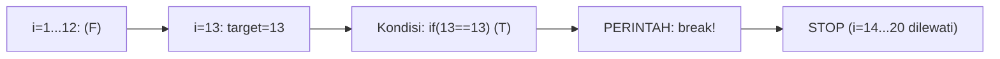
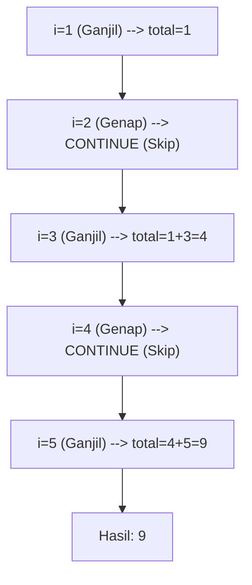
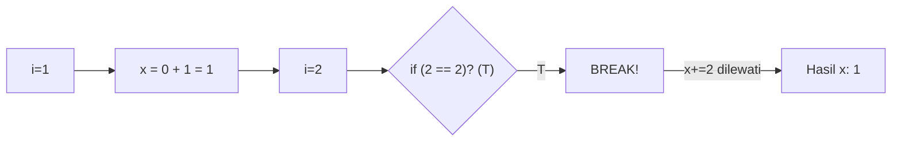
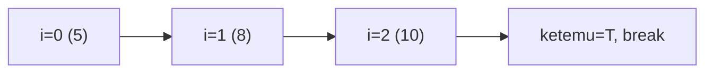
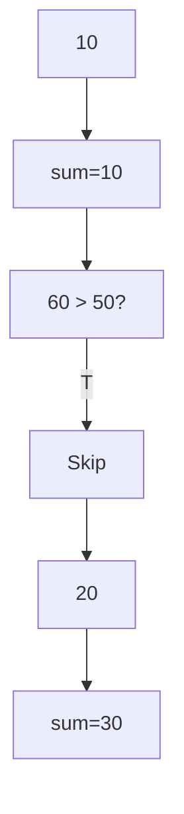
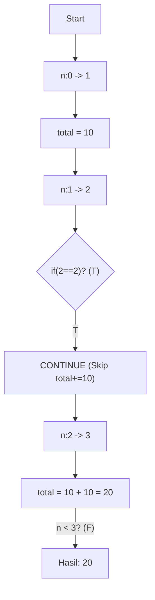
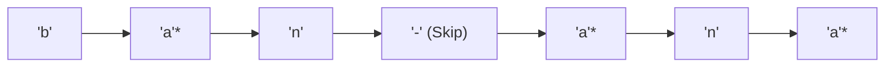
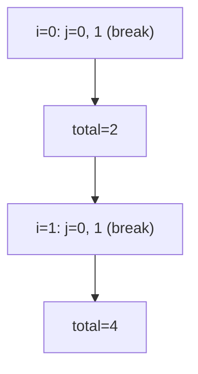
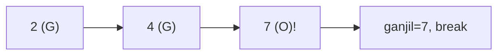
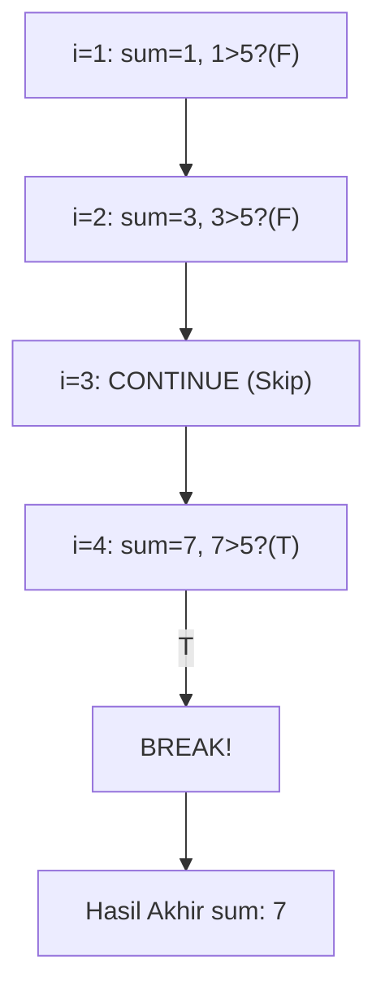

		🔙 **[Kembali ke Daftar Soal](./README.md)**

---

# Latihan Soal Part C - Modul 03 - Set 03 (Premium Edition)

---

### Soal 21: Sensor Keamanan (Break Logic)
```cpp
// Skenario: Cari angka 13 di antara 1-20
int target = 0;
for (int i = 1; i <= 20; i++) {
    if (i == 13) {
        target = i;
        break;
    }
}
```
**Pertanyaan:**
1. Berapakah nilai `target` akhir?
2. Berapa kali loop ini berputar?

<details>
<summary><b>Klik untuk Lihat Jawaban & Diagnosis</b></summary>

**Mermaid Flowchart (Pre-Break Sequence):**


**Jawaban:**
1. **13**
2. **13 kali**

**📖 Analisis Mendalam:**
`break` menghentikan loop seketika. Meskipun batasnya sampai 20, mesin berhenti tepat saat menemukan angka 13. Sisa angka (14, 15, dst) tidak pernah disentuh oleh komputer.
</details>

---

### Soal 22: Antrian Ganjil (Continue Logic)
```cpp
// Skenario: Lewati angka genap, jumlahkan ganjil 1-5
int total = 0;
for (int i = 1; i <= 5; i++) {
    if (i % 2 == 0) continue;
    total += i;
}
```
**Pertanyaan:**
1. Berapakah nilai `total`?
2. Apa perbedaan `continue` dengan `break`?

<details>
<summary><b>Klik untuk Lihat Jawaban & Diagnosis</b></summary>

**Mermaid Flowchart (Skip Sequence):**


**Jawaban:**
1. **9** (1 + 3 + 5)
2. `break` keluar dari loop selamanya, `continue` hanya melewati iterasi saat ini dan lanjut ke angka berikutnya.
</details>

---

### Soal 23: ⚠️ Jebakan Urutan (Break Before Change)
```cpp
int x = 0;
for (int i = 1; i <= 3; i++) {
    if (i == 2) break;
    x += i;
}
```
**Pertanyaan:**
1. Berapakah nilai `x`?
2. Apakah angka **2** sempat dijumlahkan ke `x`?

<details>
<summary><b>Klik untuk Lihat Jawaban & Diagnosis</b></summary>

**Mermaid Flowchart (The Wall):**


**Jawaban:**
1. **1**
2. **Tidak.** Karena perintah `break` berada di atas `x += i`. Begitu `i == 2`, mesin langsung kabur sebelum sempat menjumlahkan angka tersebut.
</details>

---

### Soal 24: Pencarian Linier (Flag Simulation)
```cpp
int data[] = {5, 8, 10, 2};
bool ketemu = false;
for (int i = 0; i < 4; i++) {
    if (data[i] == 10) {
        ketemu = true;
        break;
    }
}
```
**Pertanyaan:**
1. Berapakah nilai `ketemu` (true/false)?
2. Pada indeks ke berapa mesin berhenti mencari?

<details>
<summary><b>Klik untuk Lihat Jawaban & Diagnosis</b></summary>

**Mermaid Flowchart:**


**Jawaban:**
1. **true**
2. **Indeks 2.**
</details>

---

### Soal 25: Sensor Polusi (Skip Logic)
```cpp
// Skip jika nilai > 50
int sensor[] = {10, 60, 20};
int total = 0;
for (int i = 0; i < 3; i++) {
    if (sensor[i] > 50) continue;
    total += sensor[i];
}
```
**Pertanyaan:**
1. Berapakah nilai `total`?
2. Nilai mana yang dilewati oleh program?

<details>
<summary><b>Klik untuk Lihat Jawaban & Diagnosis</b></summary>

**Mermaid Flowchart:**


**Jawaban:**
1. **30**
2. **60**
</details>

---

### Soal 26: ⚠️ Jebakan Increment (Continue + Manual Inc)
```cpp
int n = 0, total = 0;
while (n < 3) {
    n++;
    if (n == 2) continue;
    total += 10;
}
```
**Pertanyaan:**
1. Berapakah nilai `total`?
2. Apa yang terjadi jika `n++` ditaruh di bawah `continue`?

<details>
<summary><b>Klik untuk Lihat Jawaban & Diagnosis</b></summary>

**Mermaid Flowchart (While-Increment Trace):**


**Jawaban:**
1. **20**
2. **Infinite Loop.** Karena `n` tidak akan pernah bertambah jika ia terus menerus dilewati oleh `continue`.

**📖 Analisis Mendalam:**
Pada loop `while`, posisi increment sangat krusial jika menggunakan `continue`. Di `for`, increment sudah otomatis dilakukan di header, sehingga lebih aman dari jebakan *Infinite Loop* saat melakukan skip.
</details>

---

### Soal 27: Filter Karakter (Char Skip)
```cpp
string kata = "bana-na";
int huruf_a = 0;
for (int i = 0; i < 7; i++) {
    if (kata[i] == '-') continue;
    if (kata[i] == 'a') huruf_a++;
}
```
**Pertanyaan:**
1. Berapakah nilai `huruf_a`?
2. Berapa kali perintah `continue` dijalankan?

<details>
<summary><b>Klik untuk Lihat Jawaban & Diagnosis</b></summary>

**Mermaid Flowchart:**


**Jawaban:**
1. **3**
2. **1 kali** (pada karakter ke-5).
</details>

---

### Soal 28: Break Bersarang (Nested Break)
```cpp
int total = 0;
for (int i = 0; i < 2; i++) {
    for (int j = 0; j < 5; j++) {
        if (j == 2) break;
        total++;
    }
}
```
**Pertanyaan:**
1. Berapakah nilai `total`?
2. Apakah `break` menghentikan loop `i`?

<details>
<summary><b>Klik untuk Lihat Jawaban & Diagnosis</b></summary>

**Mermaid Flowchart:**


**Jawaban:**
1. **4**
2. **Tidak.** `break` hanya menghancurkan loop terdalam (`j`).
</details>

---

### Soal 29: Mencari Bilangan Ganjil Pertama
```cpp
int angka[] = {2, 4, 7, 8, 9};
int ganjil = 0;
for (int x : angka) {
    if (x % 2 != 0) {
        ganjil = x;
        break;
    }
}
```
**Pertanyaan:**
1. Berapakah nilai `ganjil`?
2. Mengapa angka **9** tidak masuk ke variabel `ganjil`?

<details>
<summary><b>Klik untuk Lihat Jawaban & Diagnosis</b></summary>

**Mermaid Flowchart:**


**Jawaban:**
1. **7**
2. Karena mesin sudah menemukan angka ganjil pertama (7) dan langsung melakukan `break`.
</details>

---

### Soal 30: ⚠️ Total Sisa (Continue Flow)
```cpp
int sum = 0;
for (int i = 1; i <= 4; i++) {
    if (i == 3) continue;
    sum += i;
    if (sum > 5) break;
}
```
**Pertanyaan:**
1. Berapakah nilai `sum` akhir?
2. Berapakah nilai `i` terakhir saat program berhenti?

<details>
<summary><b>Klik untuk Lihat Jawaban & Diagnosis</b></summary>

**Mermaid Flowchart (Double Constraint Trace):**


**Jawaban:**
1. **7**
2. **4**
</details>
