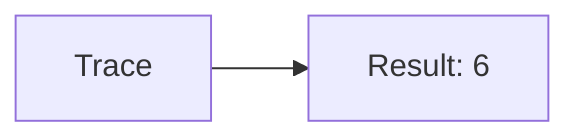
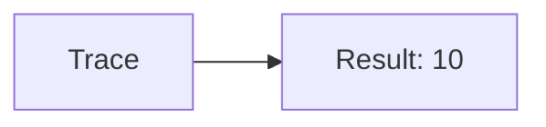
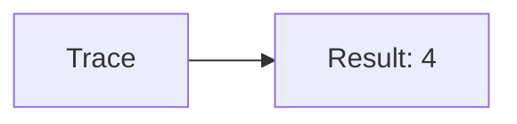
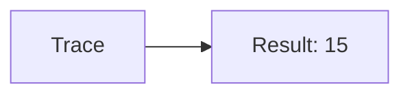
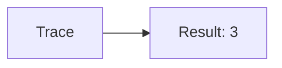

🔙 **[Kembali ke Daftar Soal](./README.md)**

---

# Latihan Soal Part C - Modul 03 - Set 04

### Soal 76
```cpp
// Semifinal: Counter
int n=6, count=0;
while(n > 0) { count++; n--; }
```
**Pertanyaan:**
1. Berapakah hasil akhirnya?
2. Deskripsikan alur pikir 'Compiler Manusia' untuk soal ini!

**Jawaban & Diagnosis:**
1. **6**
2. Loop berjalan 6 kali sampai n=0.

**Mermaid Flowchart:**


---
### Soal 77
```cpp
// Quarterfinal: Akumulasi
int total_quarterfinal = 0;
for(int i=1; i<=4; i++) total_quarterfinal += i;
```
**Pertanyaan:**
1. Berapakah hasil akhirnya?
2. Deskripsikan alur pikir 'Compiler Manusia' untuk soal ini!

**Jawaban & Diagnosis:**
1. **10**
2. Menghitung total dari 1 sampai 4.

**Mermaid Flowchart:**


---
### Soal 78
```cpp
// Round: Counter
int n=4, count=0;
while(n > 0) { count++; n--; }
```
**Pertanyaan:**
1. Berapakah hasil akhirnya?
2. Deskripsikan alur pikir 'Compiler Manusia' untuk soal ini!

**Jawaban & Diagnosis:**
1. **4**
2. Loop berjalan 4 kali sampai n=0.

**Mermaid Flowchart:**


---
### Soal 79
```cpp
// Stage: Akumulasi
int total_stage = 0;
for(int i=1; i<=5; i++) total_stage += i;
```
**Pertanyaan:**
1. Berapakah hasil akhirnya?
2. Deskripsikan alur pikir 'Compiler Manusia' untuk soal ini!

**Jawaban & Diagnosis:**
1. **15**
2. Menghitung total dari 1 sampai 5.

**Mermaid Flowchart:**


---
### Soal 80
```cpp
// Level: Counter
int n=6, count=0;
while(n > 0) { count++; n--; }
```
**Pertanyaan:**
1. Berapakah hasil akhirnya?
2. Deskripsikan alur pikir 'Compiler Manusia' untuk soal ini!

**Jawaban & Diagnosis:**
1. **6**
2. Loop berjalan 6 kali sampai n=0.

**Mermaid Flowchart:**


---
### Soal 81
```cpp
// World: Akumulasi
int total_world = 0;
for(int i=1; i<=6; i++) total_world += i;
```
**Pertanyaan:**
1. Berapakah hasil akhirnya?
2. Deskripsikan alur pikir 'Compiler Manusia' untuk soal ini!

**Jawaban & Diagnosis:**
1. **21**
2. Menghitung total dari 1 sampai 6.

**Mermaid Flowchart:**


---
### Soal 82
```cpp
// Map: Counter
int n=5, count=0;
while(n > 0) { count++; n--; }
```
**Pertanyaan:**
1. Berapakah hasil akhirnya?
2. Deskripsikan alur pikir 'Compiler Manusia' untuk soal ini!

**Jawaban & Diagnosis:**
1. **5**
2. Loop berjalan 5 kali sampai n=0.

**Mermaid Flowchart:**


---
### Soal 83
```cpp
// Boss: Akumulasi
int total_boss = 0;
for(int i=1; i<=5; i++) total_boss += i;
```
**Pertanyaan:**
1. Berapakah hasil akhirnya?
2. Deskripsikan alur pikir 'Compiler Manusia' untuk soal ini!

**Jawaban & Diagnosis:**
1. **15**
2. Menghitung total dari 1 sampai 5.

**Mermaid Flowchart:**


---
### Soal 84
```cpp
// Dungeon: Counter
int n=3, count=0;
while(n > 0) { count++; n--; }
```
**Pertanyaan:**
1. Berapakah hasil akhirnya?
2. Deskripsikan alur pikir 'Compiler Manusia' untuk soal ini!

**Jawaban & Diagnosis:**
1. **3**
2. Loop berjalan 3 kali sampai n=0.

**Mermaid Flowchart:**


---
### Soal 85
```cpp
// Raid: Akumulasi
int total_raid = 0;
for(int i=1; i<=5; i++) total_raid += i;
```
**Pertanyaan:**
1. Berapakah hasil akhirnya?
2. Deskripsikan alur pikir 'Compiler Manusia' untuk soal ini!

**Jawaban & Diagnosis:**
1. **15**
2. Menghitung total dari 1 sampai 5.

**Mermaid Flowchart:**


---
### Soal 86
```cpp
// Quest: Counter
int n=4, count=0;
while(n > 0) { count++; n--; }
```
**Pertanyaan:**
1. Berapakah hasil akhirnya?
2. Deskripsikan alur pikir 'Compiler Manusia' untuk soal ini!

**Jawaban & Diagnosis:**
1. **4**
2. Loop berjalan 4 kali sampai n=0.

**Mermaid Flowchart:**


---
### Soal 87
```cpp
// Exp: Akumulasi
int total_exp = 0;
for(int i=1; i<=3; i++) total_exp += i;
```
**Pertanyaan:**
1. Berapakah hasil akhirnya?
2. Deskripsikan alur pikir 'Compiler Manusia' untuk soal ini!

**Jawaban & Diagnosis:**
1. **6**
2. Menghitung total dari 1 sampai 3.

**Mermaid Flowchart:**


---
### Soal 88
```cpp
// Gold: Counter
int n=5, count=0;
while(n > 0) { count++; n--; }
```
**Pertanyaan:**
1. Berapakah hasil akhirnya?
2. Deskripsikan alur pikir 'Compiler Manusia' untuk soal ini!

**Jawaban & Diagnosis:**
1. **5**
2. Loop berjalan 5 kali sampai n=0.

**Mermaid Flowchart:**


---
### Soal 89
```cpp
// Item: Akumulasi
int total_item = 0;
for(int i=1; i<=6; i++) total_item += i;
```
**Pertanyaan:**
1. Berapakah hasil akhirnya?
2. Deskripsikan alur pikir 'Compiler Manusia' untuk soal ini!

**Jawaban & Diagnosis:**
1. **21**
2. Menghitung total dari 1 sampai 6.

**Mermaid Flowchart:**


---
### Soal 90
```cpp
// Equip: Counter
int n=5, count=0;
while(n > 0) { count++; n--; }
```
**Pertanyaan:**
1. Berapakah hasil akhirnya?
2. Deskripsikan alur pikir 'Compiler Manusia' untuk soal ini!

**Jawaban & Diagnosis:**
1. **5**
2. Loop berjalan 5 kali sampai n=0.

**Mermaid Flowchart:**


---
### Soal 91
```cpp
// Weapon: Akumulasi
int total_weapon = 0;
for(int i=1; i<=6; i++) total_weapon += i;
```
**Pertanyaan:**
1. Berapakah hasil akhirnya?
2. Deskripsikan alur pikir 'Compiler Manusia' untuk soal ini!

**Jawaban & Diagnosis:**
1. **21**
2. Menghitung total dari 1 sampai 6.

**Mermaid Flowchart:**


---
### Soal 92
```cpp
// Armor: Counter
int n=6, count=0;
while(n > 0) { count++; n--; }
```
**Pertanyaan:**
1. Berapakah hasil akhirnya?
2. Deskripsikan alur pikir 'Compiler Manusia' untuk soal ini!

**Jawaban & Diagnosis:**
1. **6**
2. Loop berjalan 6 kali sampai n=0.

**Mermaid Flowchart:**


---
### Soal 93
```cpp
// Skill: Akumulasi
int total_skill = 0;
for(int i=1; i<=4; i++) total_skill += i;
```
**Pertanyaan:**
1. Berapakah hasil akhirnya?
2. Deskripsikan alur pikir 'Compiler Manusia' untuk soal ini!

**Jawaban & Diagnosis:**
1. **10**
2. Menghitung total dari 1 sampai 4.

**Mermaid Flowchart:**


---
### Soal 94
```cpp
// Stat: Counter
int n=4, count=0;
while(n > 0) { count++; n--; }
```
**Pertanyaan:**
1. Berapakah hasil akhirnya?
2. Deskripsikan alur pikir 'Compiler Manusia' untuk soal ini!

**Jawaban & Diagnosis:**
1. **4**
2. Loop berjalan 4 kali sampai n=0.

**Mermaid Flowchart:**


---
### Soal 95
```cpp
// Build: Akumulasi
int total_build = 0;
for(int i=1; i<=5; i++) total_build += i;
```
**Pertanyaan:**
1. Berapakah hasil akhirnya?
2. Deskripsikan alur pikir 'Compiler Manusia' untuk soal ini!

**Jawaban & Diagnosis:**
1. **15**
2. Menghitung total dari 1 sampai 5.

**Mermaid Flowchart:**


---
### Soal 96
```cpp
// Meta: Counter
int n=3, count=0;
while(n > 0) { count++; n--; }
```
**Pertanyaan:**
1. Berapakah hasil akhirnya?
2. Deskripsikan alur pikir 'Compiler Manusia' untuk soal ini!

**Jawaban & Diagnosis:**
1. **3**
2. Loop berjalan 3 kali sampai n=0.

**Mermaid Flowchart:**
```mermaid
graph LR
A[Trace] --> B[Result: 3]
```

---
### Soal 97
```cpp
// Patch: Akumulasi
int total_patch = 0;
for(int i=1; i<=5; i++) total_patch += i;
```
**Pertanyaan:**
1. Berapakah hasil akhirnya?
2. Deskripsikan alur pikir 'Compiler Manusia' untuk soal ini!

**Jawaban & Diagnosis:**
1. **15**
2. Menghitung total dari 1 sampai 5.

**Mermaid Flowchart:**
```mermaid
graph LR
A[Trace] --> B[Result: 15]
```

---
### Soal 98
```cpp
// Update: Counter
int n=5, count=0;
while(n > 0) { count++; n--; }
```
**Pertanyaan:**
1. Berapakah hasil akhirnya?
2. Deskripsikan alur pikir 'Compiler Manusia' untuk soal ini!

**Jawaban & Diagnosis:**
1. **5**
2. Loop berjalan 5 kali sampai n=0.

**Mermaid Flowchart:**
```mermaid
graph LR
A[Trace] --> B[Result: 5]
```

---
### Soal 99
```cpp
// Bug: Akumulasi
int total_bug = 0;
for(int i=1; i<=6; i++) total_bug += i;
```
**Pertanyaan:**
1. Berapakah hasil akhirnya?
2. Deskripsikan alur pikir 'Compiler Manusia' untuk soal ini!

**Jawaban & Diagnosis:**
1. **21**
2. Menghitung total dari 1 sampai 6.

**Mermaid Flowchart:**
```mermaid
graph LR
A[Trace] --> B[Result: 21]
```

---
### Soal 100
```cpp
// Cheat: Counter
int n=4, count=0;
while(n > 0) { count++; n--; }
```
**Pertanyaan:**
1. Berapakah hasil akhirnya?
2. Deskripsikan alur pikir 'Compiler Manusia' untuk soal ini!

**Jawaban & Diagnosis:**
1. **4**
2. Loop berjalan 4 kali sampai n=0.

**Mermaid Flowchart:**
```mermaid
graph LR
A[Trace] --> B[Result: 4]
```

---
