🔙 **[Kembali ke Daftar Soal](./README.md)**

---

# Latihan Soal Part C - Modul 03 - Set 04

### Soal 76
```cpp
int s = 0;
for(int i=0; i<5; i+=3) s += i;
```
**Pertanyaan:**
1. Berapakah hasil akhirnya?
2. Mengapa demikian?

**Jawaban & Diagnosis:**
1. **3**
2. Lihat Tracing.

**Mermaid Flowchart:**
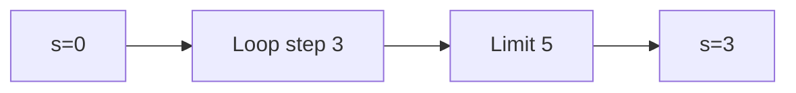

**📖 Penjelasan:**
**Langkah Tracing:**
1. Loop berjalan dengan langkah 3.
2. Hasil akumulasi: 3.

---
### Soal 77
```cpp
int n = 6, s = 0;
while(n > 0) { s += n; n -= 3; }
```
**Pertanyaan:**
1. Berapakah hasil akhirnya?
2. Mengapa demikian?

**Jawaban & Diagnosis:**
1. **9**
2. Lihat Tracing.

**Mermaid Flowchart:**
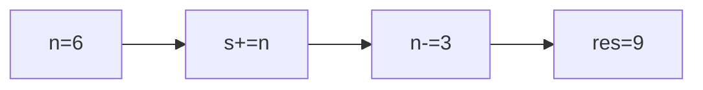

**📖 Penjelasan:**
**Langkah Tracing:**
1. Loop berjalan dengan langkah 3.
2. Hasil akumulasi: 9.

---
### Soal 78
```cpp
int s = 0;
for(int i=0; i<5; i+=3) s += i;
```
**Pertanyaan:**
1. Berapakah hasil akhirnya?
2. Mengapa demikian?

**Jawaban & Diagnosis:**
1. **3**
2. Lihat Tracing.

**Mermaid Flowchart:**


**📖 Penjelasan:**
**Langkah Tracing:**
1. Loop berjalan dengan langkah 3.
2. Hasil akumulasi: 3.

---
### Soal 79
```cpp
int s = 0;
for(int i=0; i<7; i+=2) s += i;
```
**Pertanyaan:**
1. Berapakah hasil akhirnya?
2. Mengapa demikian?

**Jawaban & Diagnosis:**
1. **12**
2. Lihat Tracing.

**Mermaid Flowchart:**
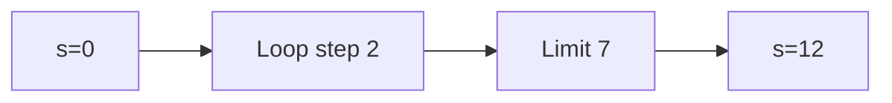

**📖 Penjelasan:**
**Langkah Tracing:**
1. Loop berjalan dengan langkah 2.
2. Hasil akumulasi: 12.

---
### Soal 80
```cpp
int n = 7, s = 0;
while(n > 0) { s += n; n -= 1; }
```
**Pertanyaan:**
1. Berapakah hasil akhirnya?
2. Mengapa demikian?

**Jawaban & Diagnosis:**
1. **28**
2. Lihat Tracing.

**Mermaid Flowchart:**
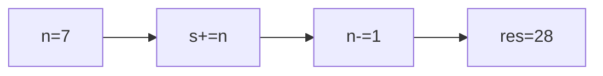

**📖 Penjelasan:**
**Langkah Tracing:**
1. Loop berjalan dengan langkah 1.
2. Hasil akumulasi: 28.

---
### Soal 81
```cpp
int n = 7, s = 0;
while(n > 0) { s += n; n -= 3; }
```
**Pertanyaan:**
1. Berapakah hasil akhirnya?
2. Mengapa demikian?

**Jawaban & Diagnosis:**
1. **12**
2. Lihat Tracing.

**Mermaid Flowchart:**
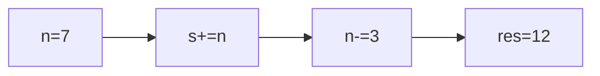

**📖 Penjelasan:**
**Langkah Tracing:**
1. Loop berjalan dengan langkah 3.
2. Hasil akumulasi: 12.

---
### Soal 82
```cpp
int s = 0;
for(int i=0; i<6; i+=2) s += i;
```
**Pertanyaan:**
1. Berapakah hasil akhirnya?
2. Mengapa demikian?

**Jawaban & Diagnosis:**
1. **6**
2. Lihat Tracing.

**Mermaid Flowchart:**
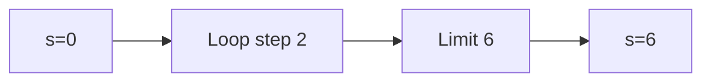

**📖 Penjelasan:**
**Langkah Tracing:**
1. Loop berjalan dengan langkah 2.
2. Hasil akumulasi: 6.

---
### Soal 83
```cpp
int s = 0;
for(int i=0; i<10; i+=1) s += i;
```
**Pertanyaan:**
1. Berapakah hasil akhirnya?
2. Mengapa demikian?

**Jawaban & Diagnosis:**
1. **45**
2. Lihat Tracing.

**Mermaid Flowchart:**
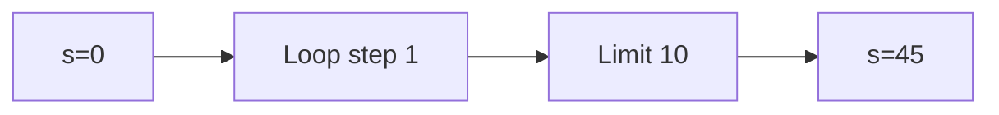

**📖 Penjelasan:**
**Langkah Tracing:**
1. Loop berjalan dengan langkah 1.
2. Hasil akumulasi: 45.

---
### Soal 84
```cpp
int s = 0;
for(int i=0; i<7; i+=2) s += i;
```
**Pertanyaan:**
1. Berapakah hasil akhirnya?
2. Mengapa demikian?

**Jawaban & Diagnosis:**
1. **12**
2. Lihat Tracing.

**Mermaid Flowchart:**


**📖 Penjelasan:**
**Langkah Tracing:**
1. Loop berjalan dengan langkah 2.
2. Hasil akumulasi: 12.

---
### Soal 85
```cpp
int s = 0;
for(int i=0; i<5; i+=3) s += i;
```
**Pertanyaan:**
1. Berapakah hasil akhirnya?
2. Mengapa demikian?

**Jawaban & Diagnosis:**
1. **3**
2. Lihat Tracing.

**Mermaid Flowchart:**


**📖 Penjelasan:**
**Langkah Tracing:**
1. Loop berjalan dengan langkah 3.
2. Hasil akumulasi: 3.

---
### Soal 86
```cpp
int n = 8, s = 0;
while(n > 0) { s += n; n -= 3; }
```
**Pertanyaan:**
1. Berapakah hasil akhirnya?
2. Mengapa demikian?

**Jawaban & Diagnosis:**
1. **15**
2. Lihat Tracing.

**Mermaid Flowchart:**
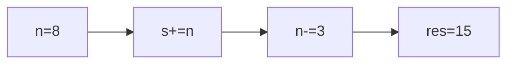

**📖 Penjelasan:**
**Langkah Tracing:**
1. Loop berjalan dengan langkah 3.
2. Hasil akumulasi: 15.

---
### Soal 87
```cpp
int n = 8, s = 0;
while(n > 0) { s += n; n -= 1; }
```
**Pertanyaan:**
1. Berapakah hasil akhirnya?
2. Mengapa demikian?

**Jawaban & Diagnosis:**
1. **36**
2. Lihat Tracing.

**Mermaid Flowchart:**
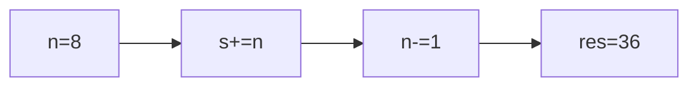

**📖 Penjelasan:**
**Langkah Tracing:**
1. Loop berjalan dengan langkah 1.
2. Hasil akumulasi: 36.

---
### Soal 88
```cpp
int n = 9, s = 0;
while(n > 0) { s += n; n -= 1; }
```
**Pertanyaan:**
1. Berapakah hasil akhirnya?
2. Mengapa demikian?

**Jawaban & Diagnosis:**
1. **45**
2. Lihat Tracing.

**Mermaid Flowchart:**
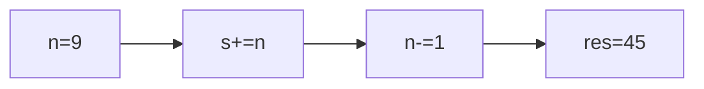

**📖 Penjelasan:**
**Langkah Tracing:**
1. Loop berjalan dengan langkah 1.
2. Hasil akumulasi: 45.

---
### Soal 89
```cpp
int n = 6, s = 0;
while(n > 0) { s += n; n -= 1; }
```
**Pertanyaan:**
1. Berapakah hasil akhirnya?
2. Mengapa demikian?

**Jawaban & Diagnosis:**
1. **21**
2. Lihat Tracing.

**Mermaid Flowchart:**
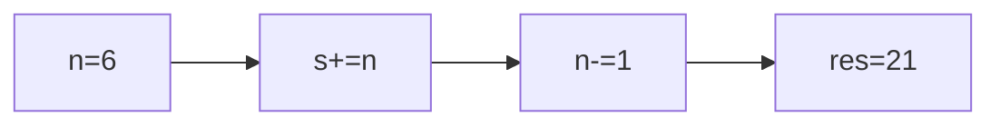

**📖 Penjelasan:**
**Langkah Tracing:**
1. Loop berjalan dengan langkah 1.
2. Hasil akumulasi: 21.

---
### Soal 90
```cpp
int s = 0;
for(int i=0; i<9; i+=1) s += i;
```
**Pertanyaan:**
1. Berapakah hasil akhirnya?
2. Mengapa demikian?

**Jawaban & Diagnosis:**
1. **36**
2. Lihat Tracing.

**Mermaid Flowchart:**
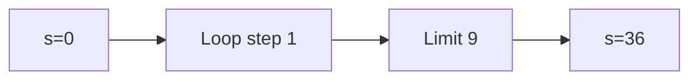

**📖 Penjelasan:**
**Langkah Tracing:**
1. Loop berjalan dengan langkah 1.
2. Hasil akumulasi: 36.

---
### Soal 91
```cpp
int n = 6, s = 0;
while(n > 0) { s += n; n -= 1; }
```
**Pertanyaan:**
1. Berapakah hasil akhirnya?
2. Mengapa demikian?

**Jawaban & Diagnosis:**
1. **21**
2. Lihat Tracing.

**Mermaid Flowchart:**


**📖 Penjelasan:**
**Langkah Tracing:**
1. Loop berjalan dengan langkah 1.
2. Hasil akumulasi: 21.

---
### Soal 92
```cpp
int s = 0;
for(int i=0; i<8; i+=1) s += i;
```
**Pertanyaan:**
1. Berapakah hasil akhirnya?
2. Mengapa demikian?

**Jawaban & Diagnosis:**
1. **28**
2. Lihat Tracing.

**Mermaid Flowchart:**


**📖 Penjelasan:**
**Langkah Tracing:**
1. Loop berjalan dengan langkah 1.
2. Hasil akumulasi: 28.

---
### Soal 93
```cpp
int s = 0;
for(int i=0; i<9; i+=3) s += i;
```
**Pertanyaan:**
1. Berapakah hasil akhirnya?
2. Mengapa demikian?

**Jawaban & Diagnosis:**
1. **9**
2. Lihat Tracing.

**Mermaid Flowchart:**
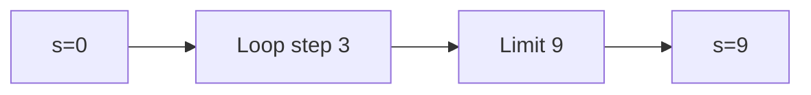

**📖 Penjelasan:**
**Langkah Tracing:**
1. Loop berjalan dengan langkah 3.
2. Hasil akumulasi: 9.

---
### Soal 94
```cpp
int s = 0;
for(int i=0; i<6; i+=2) s += i;
```
**Pertanyaan:**
1. Berapakah hasil akhirnya?
2. Mengapa demikian?

**Jawaban & Diagnosis:**
1. **6**
2. Lihat Tracing.

**Mermaid Flowchart:**


**📖 Penjelasan:**
**Langkah Tracing:**
1. Loop berjalan dengan langkah 2.
2. Hasil akumulasi: 6.

---
### Soal 95
```cpp
int s = 0;
for(int i=0; i<10; i+=3) s += i;
```
**Pertanyaan:**
1. Berapakah hasil akhirnya?
2. Mengapa demikian?

**Jawaban & Diagnosis:**
1. **18**
2. Lihat Tracing.

**Mermaid Flowchart:**
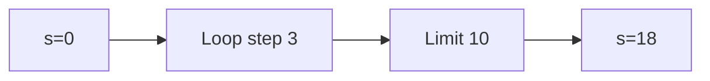

**📖 Penjelasan:**
**Langkah Tracing:**
1. Loop berjalan dengan langkah 3.
2. Hasil akumulasi: 18.

---
### Soal 96
```cpp
int s = 0;
for(int i=0; i<6; i+=2) s += i;
```
**Pertanyaan:**
1. Berapakah hasil akhirnya?
2. Mengapa demikian?

**Jawaban & Diagnosis:**
1. **6**
2. Lihat Tracing.

**Mermaid Flowchart:**
```mermaid
graph LR
A["s=0"] --> B["Loop step 2"]
B --> C["Limit 6"]
C --> D["s=6"]
```

**📖 Penjelasan:**
**Langkah Tracing:**
1. Loop berjalan dengan langkah 2.
2. Hasil akumulasi: 6.

---
### Soal 97
```cpp
int n = 6, s = 0;
while(n > 0) { s += n; n -= 2; }
```
**Pertanyaan:**
1. Berapakah hasil akhirnya?
2. Mengapa demikian?

**Jawaban & Diagnosis:**
1. **12**
2. Lihat Tracing.

**Mermaid Flowchart:**
```mermaid
graph LR
A["n=6"] --> B["s+=n"]
B --> C["n-=2"]
C --> D["res=12"]
```

**📖 Penjelasan:**
**Langkah Tracing:**
1. Loop berjalan dengan langkah 2.
2. Hasil akumulasi: 12.

---
### Soal 98
```cpp
int n = 9, s = 0;
while(n > 0) { s += n; n -= 3; }
```
**Pertanyaan:**
1. Berapakah hasil akhirnya?
2. Mengapa demikian?

**Jawaban & Diagnosis:**
1. **18**
2. Lihat Tracing.

**Mermaid Flowchart:**
```mermaid
graph LR
A["n=9"] --> B["s+=n"]
B --> C["n-=3"]
C --> D["res=18"]
```

**📖 Penjelasan:**
**Langkah Tracing:**
1. Loop berjalan dengan langkah 3.
2. Hasil akumulasi: 18.

---
### Soal 99
```cpp
int n = 5, s = 0;
while(n > 0) { s += n; n -= 2; }
```
**Pertanyaan:**
1. Berapakah hasil akhirnya?
2. Mengapa demikian?

**Jawaban & Diagnosis:**
1. **9**
2. Lihat Tracing.

**Mermaid Flowchart:**
```mermaid
graph LR
A["n=5"] --> B["s+=n"]
B --> C["n-=2"]
C --> D["res=9"]
```

**📖 Penjelasan:**
**Langkah Tracing:**
1. Loop berjalan dengan langkah 2.
2. Hasil akumulasi: 9.

---
### Soal 100
```cpp
int n = 6, s = 0;
while(n > 0) { s += n; n -= 2; }
```
**Pertanyaan:**
1. Berapakah hasil akhirnya?
2. Mengapa demikian?

**Jawaban & Diagnosis:**
1. **12**
2. Lihat Tracing.

**Mermaid Flowchart:**
```mermaid
graph LR
A["n=6"] --> B["s+=n"]
B --> C["n-=2"]
C --> D["res=12"]
```

**📖 Penjelasan:**
**Langkah Tracing:**
1. Loop berjalan dengan langkah 2.
2. Hasil akumulasi: 12.

---
