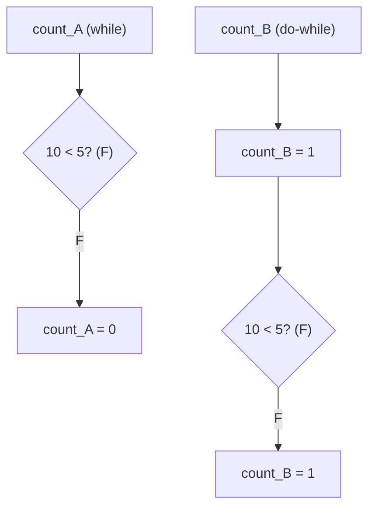
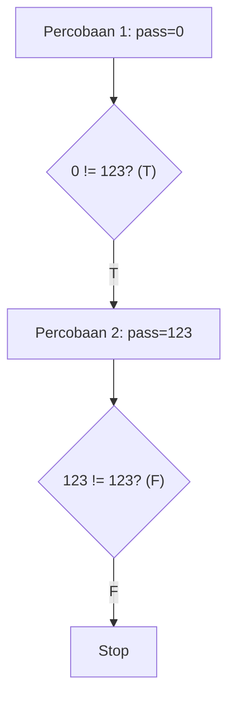
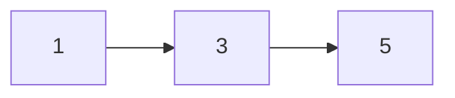
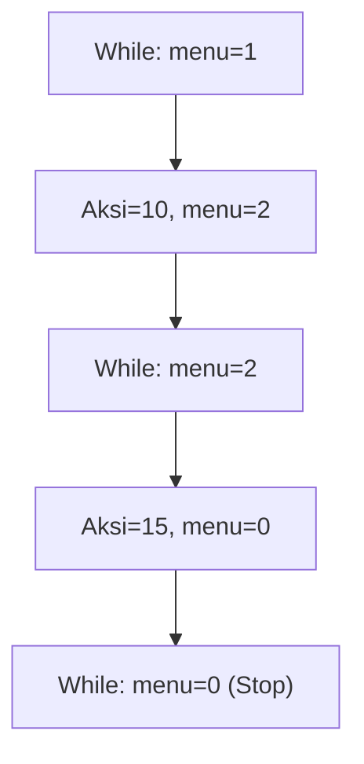
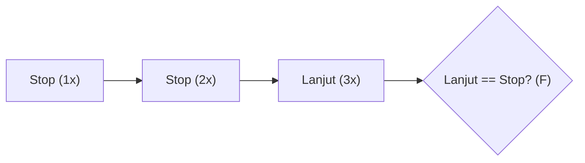
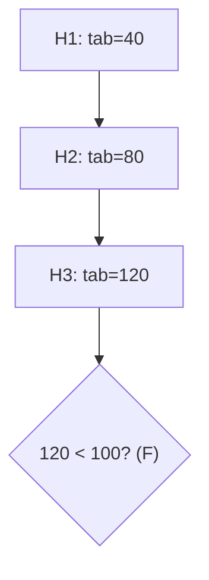
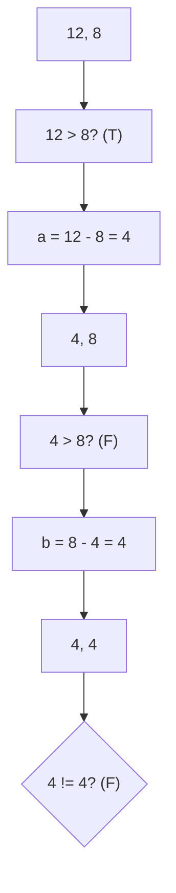
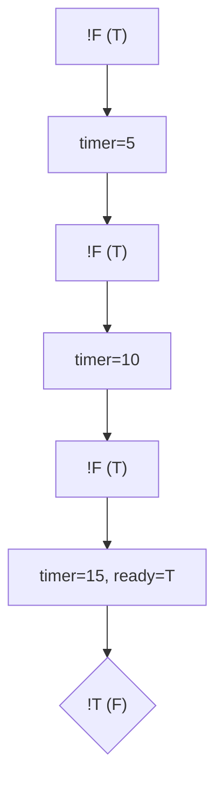
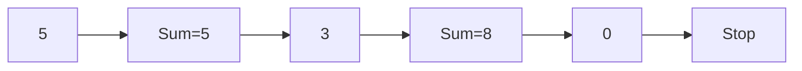

		🔙 **[Kembali ke Daftar Soal](./README.md)**

---

# Latihan Soal Part C - Modul 03 - Set 04 (Premium Edition)

---

### Soal 31: Eksekusi Pertama (While vs Do-While)
```cpp
int x = 10;
int count_A = 0;
while (x < 5) {
    count_A++;
}

int y = 10;
int count_B = 0;
do {
    count_B++;
} while (y < 5);
```
**Pertanyaan:**
1. Berapakah nilai `count_A`?
2. Berapakah nilai `count_B`?
3. Apa perbedaan utama antara `while` dan `do-while`?

<details>
<summary><b>Klik untuk Lihat Jawaban & Diagnosis</b></summary>

**Mermaid Flowchart:**


**Jawaban:**
1. **0**
2. **1**
3. `while` mengecek kondisi **sebelum** masuk, sedangkan `do-while` mengecek **setelah** menjalankan isi loop minimal satu kali.
</details>

---

### Soal 32: Validasi Password (Input Simulation)
```cpp
// Skenario: Ulangi sampai password benar (123)
int pass = 0;
int percobaan = 0;

do {
    percobaan++;
    if (percobaan == 2) pass = 123;
} while (pass != 123);
```
**Pertanyaan:**
1. Berapakah nilai `percobaan` akhir?
2. Berapa kali kondisi `while` dicek?

<details>
<summary><b>Klik untuk Lihat Jawaban & Diagnosis</b></summary>

**Mermaid Flowchart:**


**Jawaban:**
1. **2**
2. **2 kali** (setelah percobaan 1 dan setelah percobaan 2).
</details>

---

### Soal 33: ⚠️ Jebakan Pintu Keluar (Logical Exit)
```cpp
int n = 1;
while (n != 5) {
    n += 2;
    if (n > 10) break;
}
```
**Pertanyaan:**
1. Berapakah nilai `n` terakhir?
2. Mengapa kondisi `n != 5` tidak pernah menghentikan loop ini?

<details>
<summary><b>Klik untuk Lihat Jawaban & Diagnosis</b></summary>

**Mermaid Flowchart:**

*Tunggu, mari kita lihat batinnya:*
1. n=1 $\rightarrow$ 3
2. n=3 $\rightarrow$ 5
3. Oh, ternyata **berhenti!**

**Jawaban:**
1. **5**
2. **Dia berhenti.** Karena `n` tepat menginjak angka 5. 

**📖 Diagnosis Khusus:**
Hati-hati! Jika kita mulai dari `n = 2`, maka `n` akan menjadi `2, 4, 6...` dan **melewati** angka 5, sehingga menjadi *infinite loop* (jika tidak ada `break`). Di soal ini, karena mulai dari 1, kebetulan aman.
</details>

---

### Soal 34: Menu Navigasi (Switch inside While)
```cpp
int menu = 1;
int aksi = 0;
while (menu != 0) {
    switch(menu) {
        case 1: aksi += 10; menu = 2; break;
        case 2: aksi += 5; menu = 0; break;
    }
}
```
**Pertanyaan:**
1. Berapakah nilai `aksi`?
2. Berapa kali loop `while` berjalan?

<details>
<summary><b>Klik untuk Lihat Jawaban & Diagnosis</b></summary>

**Mermaid Flowchart:**


**Jawaban:**
1. **15**
2. **2 kali** iterasi isi loop.
</details>

---

### Soal 35: Detektor Somasi (String Repeat)
```cpp
string pesan = "Stop";
int kirim = 0;
while (pesan == "Stop") {
    kirim++;
    if (kirim == 3) pesan = "Lanjut";
}
```
**Pertanyaan:**
1. Berapakah nilai `kirim`?
2. Apa yang membuat loop ini berhenti?

<details>
<summary><b>Klik untuk Lihat Jawaban & Diagnosis</b></summary>

**Mermaid Flowchart:**


**Jawaban:**
1. **3**
2. Perubahan variabel `pesan` di dalam loop yang membuat kondisi `while` menjadi false.
</details>

---

### Soal 36: Tabungan Target (Until Condition)
```cpp
int tabungan = 0;
int hari = 0;
while (tabungan < 100) {
    hari++;
    tabungan += 40;
}
```
**Pertanyaan:**
1. Berapakah nilai `hari`?
2. Berapakah nilai `tabungan` akhir?

<details>
<summary><b>Klik untuk Lihat Jawaban & Diagnosis</b></summary>

**Mermaid Flowchart:**


**Jawaban:**
1. **3**
2. **120**
</details>

---

### Soal 37: ⚠️ Jebakan Titik Koma (The Empty Loop)
```cpp
int i = 0;
while (i < 5) ; 
{
    i++;
}
```
**Pertanyaan:**
1. Apa yang terjadi pada program ini?
2. Mengapa `i++` tidak pernah dijalankan?

<details>
<summary><b>Klik untuk Lihat Jawaban & Diagnosis</b></summary>

**Jawaban:**
1. **Infinite Loop.** Program akan "hang" atau macet.
2. Karena ada titik koma `;` tepat setelah `while (i < 5)`.

**📖 Analisis Mendalam:**
Titik koma tersebut dianggap sebagai **Null Statement** (isi loop kosong). Akibatnya, mesin terus mengecek `0 < 5` selamanya tanpa pernah menambah `i`. Blok `{ i++; }` dianggap kode terpisah yang tidak punya hubungan dengan loop.
</details>

---

### Soal 38: Pembagi Terbesar (GCD Simulation)
```cpp
int a = 12, b = 8;
while (a != b) {
    if (a > b) a -= b;
    else b -= a;
}
```
**Pertanyaan:**
1. Berapakah nilai `a` akhir?
2. Algoritma terkenal apa yang sedang disimulasikan di atas?

<details>
<summary><b>Klik untuk Lihat Jawaban & Diagnosis</b></summary>

**Mermaid Flowchart:**


**Jawaban:**
1. **4**
2. **Algoritma Euclidean** (untuk mencari FPB/GCD).
</details>

---

### Soal 39: Busy Waiting (Flag State)
```cpp
bool ready = false;
int timer = 0;
while (!ready) {
    timer += 5;
    if (timer >= 15) ready = true;
}
```
**Pertanyaan:**
1. Berapakah nilai `timer` akhir?
2. Berapa kali syarat `!ready` bernilai true?

<details>
<summary><b>Klik untuk Lihat Jawaban & Diagnosis</b></summary>

**Mermaid Flowchart:**


**Jawaban:**
1. **15**
2. **3 kali** (saat timer 0, 5, dan 10).
</details>

---

### Soal 40: Total Hingga Nol (Sentinel Value)
```cpp
int input[] = {5, 3, 0, 2};
int total = 0;
int i = 0;
while (input[i] != 0) {
    total += input[i];
    i++;
}
```
**Pertanyaan:**
1. Berapakah nilai `total`?
2. Apakah angka **2** dijumlahkan ke `total`?

<details>
<summary><b>Klik untuk Lihat Jawaban & Diagnosis</b></summary>

**Mermaid Flowchart:**


**Jawaban:**
1. **8**
2. **Tidak.** Karena loop berhenti tepat saat menemukan angka 0.
</details>
