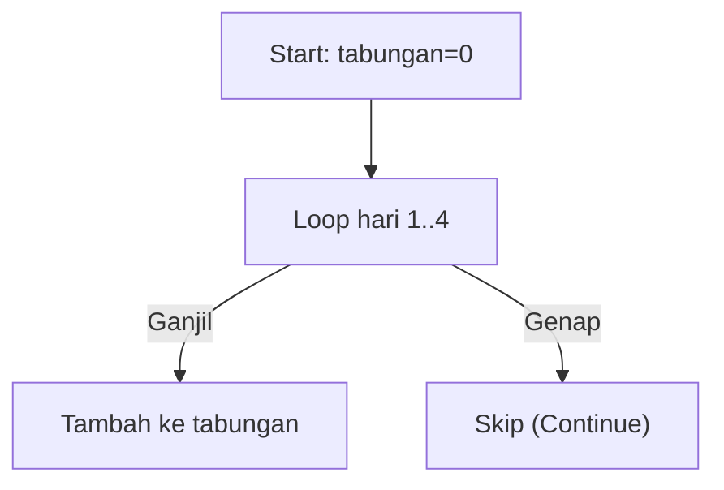

🔙 **[Kembali ke Daftar Soal](./README.md)**

---

# Latihan Soal Part C - Modul 03 - Set 04

### Soal 76
```cpp
int tabungan = 0;
for(int hari=1; hari<=3; hari++) {
  if (hari % 2 == 0) continue;
  tabungan += hari;
}
```
**Pertanyaan:**
1. Berapakah hasil akhirnya?
2. Deskripsikan langkah robot compiler saat memproses kode ini!

**Jawaban & Diagnosis:**
1. **4**
2. Baca bagian 'Analisis Mendalam' di bawah.

**Mermaid Flowchart:**


**📖 Penjelasan Komprehensif:**
**Analisis Mendalam (Compiler Manusia):**
1. **Misi**: Menghitung tabungan yang hanya diisi pada hari ganjil saja.
2. **Tracing**: Hari ganjil yang masuk adalah [1, 3].
3. **Alur**: `continue` memaksa mesin melompati hari genap.
4. **Hasil Akhir**: Total `tabungan` adalah **4**.

---
### Soal 77
```cpp
int tabungan = 0;
for(int hari=1; hari<=6; hari++) {
  if (hari % 2 == 0) continue;
  tabungan += hari;
}
```
**Pertanyaan:**
1. Berapakah hasil akhirnya?
2. Deskripsikan langkah robot compiler saat memproses kode ini!

**Jawaban & Diagnosis:**
1. **9**
2. Baca bagian 'Analisis Mendalam' di bawah.

**Mermaid Flowchart:**


**📖 Penjelasan Komprehensif:**
**Analisis Mendalam (Compiler Manusia):**
1. **Misi**: Menghitung tabungan yang hanya diisi pada hari ganjil saja.
2. **Tracing**: Hari ganjil yang masuk adalah [1, 3, 5].
3. **Alur**: `continue` memaksa mesin melompati hari genap.
4. **Hasil Akhir**: Total `tabungan` adalah **9**.

---
### Soal 78
```cpp
int tabungan = 0;
for(int hari=1; hari<=4; hari++) {
  if (hari % 2 == 0) continue;
  tabungan += hari;
}
```
**Pertanyaan:**
1. Berapakah hasil akhirnya?
2. Deskripsikan langkah robot compiler saat memproses kode ini!

**Jawaban & Diagnosis:**
1. **4**
2. Baca bagian 'Analisis Mendalam' di bawah.

**Mermaid Flowchart:**


**📖 Penjelasan Komprehensif:**
**Analisis Mendalam (Compiler Manusia):**
1. **Misi**: Menghitung tabungan yang hanya diisi pada hari ganjil saja.
2. **Tracing**: Hari ganjil yang masuk adalah [1, 3].
3. **Alur**: `continue` memaksa mesin melompati hari genap.
4. **Hasil Akhir**: Total `tabungan` adalah **4**.

---
### Soal 79
```cpp
int tabungan = 0;
for(int hari=1; hari<=6; hari++) {
  if (hari % 2 == 0) continue;
  tabungan += hari;
}
```
**Pertanyaan:**
1. Berapakah hasil akhirnya?
2. Deskripsikan langkah robot compiler saat memproses kode ini!

**Jawaban & Diagnosis:**
1. **9**
2. Baca bagian 'Analisis Mendalam' di bawah.

**Mermaid Flowchart:**


**📖 Penjelasan Komprehensif:**
**Analisis Mendalam (Compiler Manusia):**
1. **Misi**: Menghitung tabungan yang hanya diisi pada hari ganjil saja.
2. **Tracing**: Hari ganjil yang masuk adalah [1, 3, 5].
3. **Alur**: `continue` memaksa mesin melompati hari genap.
4. **Hasil Akhir**: Total `tabungan` adalah **9**.

---
### Soal 80
```cpp
int tabungan = 0;
for(int hari=1; hari<=4; hari++) {
  if (hari % 2 == 0) continue;
  tabungan += hari;
}
```
**Pertanyaan:**
1. Berapakah hasil akhirnya?
2. Deskripsikan langkah robot compiler saat memproses kode ini!

**Jawaban & Diagnosis:**
1. **4**
2. Baca bagian 'Analisis Mendalam' di bawah.

**Mermaid Flowchart:**


**📖 Penjelasan Komprehensif:**
**Analisis Mendalam (Compiler Manusia):**
1. **Misi**: Menghitung tabungan yang hanya diisi pada hari ganjil saja.
2. **Tracing**: Hari ganjil yang masuk adalah [1, 3].
3. **Alur**: `continue` memaksa mesin melompati hari genap.
4. **Hasil Akhir**: Total `tabungan` adalah **4**.

---
### Soal 81
```cpp
int tabungan = 0;
for(int hari=1; hari<=3; hari++) {
  if (hari % 2 == 0) continue;
  tabungan += hari;
}
```
**Pertanyaan:**
1. Berapakah hasil akhirnya?
2. Deskripsikan langkah robot compiler saat memproses kode ini!

**Jawaban & Diagnosis:**
1. **4**
2. Baca bagian 'Analisis Mendalam' di bawah.

**Mermaid Flowchart:**


**📖 Penjelasan Komprehensif:**
**Analisis Mendalam (Compiler Manusia):**
1. **Misi**: Menghitung tabungan yang hanya diisi pada hari ganjil saja.
2. **Tracing**: Hari ganjil yang masuk adalah [1, 3].
3. **Alur**: `continue` memaksa mesin melompati hari genap.
4. **Hasil Akhir**: Total `tabungan` adalah **4**.

---
### Soal 82
```cpp
int tabungan = 0;
for(int hari=1; hari<=4; hari++) {
  if (hari % 2 == 0) continue;
  tabungan += hari;
}
```
**Pertanyaan:**
1. Berapakah hasil akhirnya?
2. Deskripsikan langkah robot compiler saat memproses kode ini!

**Jawaban & Diagnosis:**
1. **4**
2. Baca bagian 'Analisis Mendalam' di bawah.

**Mermaid Flowchart:**


**📖 Penjelasan Komprehensif:**
**Analisis Mendalam (Compiler Manusia):**
1. **Misi**: Menghitung tabungan yang hanya diisi pada hari ganjil saja.
2. **Tracing**: Hari ganjil yang masuk adalah [1, 3].
3. **Alur**: `continue` memaksa mesin melompati hari genap.
4. **Hasil Akhir**: Total `tabungan` adalah **4**.

---
### Soal 83
```cpp
int tabungan = 0;
for(int hari=1; hari<=6; hari++) {
  if (hari % 2 == 0) continue;
  tabungan += hari;
}
```
**Pertanyaan:**
1. Berapakah hasil akhirnya?
2. Deskripsikan langkah robot compiler saat memproses kode ini!

**Jawaban & Diagnosis:**
1. **9**
2. Baca bagian 'Analisis Mendalam' di bawah.

**Mermaid Flowchart:**


**📖 Penjelasan Komprehensif:**
**Analisis Mendalam (Compiler Manusia):**
1. **Misi**: Menghitung tabungan yang hanya diisi pada hari ganjil saja.
2. **Tracing**: Hari ganjil yang masuk adalah [1, 3, 5].
3. **Alur**: `continue` memaksa mesin melompati hari genap.
4. **Hasil Akhir**: Total `tabungan` adalah **9**.

---
### Soal 84
```cpp
int tabungan = 0;
for(int hari=1; hari<=3; hari++) {
  if (hari % 2 == 0) continue;
  tabungan += hari;
}
```
**Pertanyaan:**
1. Berapakah hasil akhirnya?
2. Deskripsikan langkah robot compiler saat memproses kode ini!

**Jawaban & Diagnosis:**
1. **4**
2. Baca bagian 'Analisis Mendalam' di bawah.

**Mermaid Flowchart:**


**📖 Penjelasan Komprehensif:**
**Analisis Mendalam (Compiler Manusia):**
1. **Misi**: Menghitung tabungan yang hanya diisi pada hari ganjil saja.
2. **Tracing**: Hari ganjil yang masuk adalah [1, 3].
3. **Alur**: `continue` memaksa mesin melompati hari genap.
4. **Hasil Akhir**: Total `tabungan` adalah **4**.

---
### Soal 85
```cpp
int tabungan = 0;
for(int hari=1; hari<=6; hari++) {
  if (hari % 2 == 0) continue;
  tabungan += hari;
}
```
**Pertanyaan:**
1. Berapakah hasil akhirnya?
2. Deskripsikan langkah robot compiler saat memproses kode ini!

**Jawaban & Diagnosis:**
1. **9**
2. Baca bagian 'Analisis Mendalam' di bawah.

**Mermaid Flowchart:**


**📖 Penjelasan Komprehensif:**
**Analisis Mendalam (Compiler Manusia):**
1. **Misi**: Menghitung tabungan yang hanya diisi pada hari ganjil saja.
2. **Tracing**: Hari ganjil yang masuk adalah [1, 3, 5].
3. **Alur**: `continue` memaksa mesin melompati hari genap.
4. **Hasil Akhir**: Total `tabungan` adalah **9**.

---
### Soal 86
```cpp
int tabungan = 0;
for(int hari=1; hari<=4; hari++) {
  if (hari % 2 == 0) continue;
  tabungan += hari;
}
```
**Pertanyaan:**
1. Berapakah hasil akhirnya?
2. Deskripsikan langkah robot compiler saat memproses kode ini!

**Jawaban & Diagnosis:**
1. **4**
2. Baca bagian 'Analisis Mendalam' di bawah.

**Mermaid Flowchart:**


**📖 Penjelasan Komprehensif:**
**Analisis Mendalam (Compiler Manusia):**
1. **Misi**: Menghitung tabungan yang hanya diisi pada hari ganjil saja.
2. **Tracing**: Hari ganjil yang masuk adalah [1, 3].
3. **Alur**: `continue` memaksa mesin melompati hari genap.
4. **Hasil Akhir**: Total `tabungan` adalah **4**.

---
### Soal 87
```cpp
int tabungan = 0;
for(int hari=1; hari<=5; hari++) {
  if (hari % 2 == 0) continue;
  tabungan += hari;
}
```
**Pertanyaan:**
1. Berapakah hasil akhirnya?
2. Deskripsikan langkah robot compiler saat memproses kode ini!

**Jawaban & Diagnosis:**
1. **9**
2. Baca bagian 'Analisis Mendalam' di bawah.

**Mermaid Flowchart:**


**📖 Penjelasan Komprehensif:**
**Analisis Mendalam (Compiler Manusia):**
1. **Misi**: Menghitung tabungan yang hanya diisi pada hari ganjil saja.
2. **Tracing**: Hari ganjil yang masuk adalah [1, 3, 5].
3. **Alur**: `continue` memaksa mesin melompati hari genap.
4. **Hasil Akhir**: Total `tabungan` adalah **9**.

---
### Soal 88
```cpp
int tabungan = 0;
for(int hari=1; hari<=5; hari++) {
  if (hari % 2 == 0) continue;
  tabungan += hari;
}
```
**Pertanyaan:**
1. Berapakah hasil akhirnya?
2. Deskripsikan langkah robot compiler saat memproses kode ini!

**Jawaban & Diagnosis:**
1. **9**
2. Baca bagian 'Analisis Mendalam' di bawah.

**Mermaid Flowchart:**


**📖 Penjelasan Komprehensif:**
**Analisis Mendalam (Compiler Manusia):**
1. **Misi**: Menghitung tabungan yang hanya diisi pada hari ganjil saja.
2. **Tracing**: Hari ganjil yang masuk adalah [1, 3, 5].
3. **Alur**: `continue` memaksa mesin melompati hari genap.
4. **Hasil Akhir**: Total `tabungan` adalah **9**.

---
### Soal 89
```cpp
int tabungan = 0;
for(int hari=1; hari<=6; hari++) {
  if (hari % 2 == 0) continue;
  tabungan += hari;
}
```
**Pertanyaan:**
1. Berapakah hasil akhirnya?
2. Deskripsikan langkah robot compiler saat memproses kode ini!

**Jawaban & Diagnosis:**
1. **9**
2. Baca bagian 'Analisis Mendalam' di bawah.

**Mermaid Flowchart:**


**📖 Penjelasan Komprehensif:**
**Analisis Mendalam (Compiler Manusia):**
1. **Misi**: Menghitung tabungan yang hanya diisi pada hari ganjil saja.
2. **Tracing**: Hari ganjil yang masuk adalah [1, 3, 5].
3. **Alur**: `continue` memaksa mesin melompati hari genap.
4. **Hasil Akhir**: Total `tabungan` adalah **9**.

---
### Soal 90
```cpp
int tabungan = 0;
for(int hari=1; hari<=3; hari++) {
  if (hari % 2 == 0) continue;
  tabungan += hari;
}
```
**Pertanyaan:**
1. Berapakah hasil akhirnya?
2. Deskripsikan langkah robot compiler saat memproses kode ini!

**Jawaban & Diagnosis:**
1. **4**
2. Baca bagian 'Analisis Mendalam' di bawah.

**Mermaid Flowchart:**


**📖 Penjelasan Komprehensif:**
**Analisis Mendalam (Compiler Manusia):**
1. **Misi**: Menghitung tabungan yang hanya diisi pada hari ganjil saja.
2. **Tracing**: Hari ganjil yang masuk adalah [1, 3].
3. **Alur**: `continue` memaksa mesin melompati hari genap.
4. **Hasil Akhir**: Total `tabungan` adalah **4**.

---
### Soal 91
```cpp
int tabungan = 0;
for(int hari=1; hari<=3; hari++) {
  if (hari % 2 == 0) continue;
  tabungan += hari;
}
```
**Pertanyaan:**
1. Berapakah hasil akhirnya?
2. Deskripsikan langkah robot compiler saat memproses kode ini!

**Jawaban & Diagnosis:**
1. **4**
2. Baca bagian 'Analisis Mendalam' di bawah.

**Mermaid Flowchart:**


**📖 Penjelasan Komprehensif:**
**Analisis Mendalam (Compiler Manusia):**
1. **Misi**: Menghitung tabungan yang hanya diisi pada hari ganjil saja.
2. **Tracing**: Hari ganjil yang masuk adalah [1, 3].
3. **Alur**: `continue` memaksa mesin melompati hari genap.
4. **Hasil Akhir**: Total `tabungan` adalah **4**.

---
### Soal 92
```cpp
int tabungan = 0;
for(int hari=1; hari<=4; hari++) {
  if (hari % 2 == 0) continue;
  tabungan += hari;
}
```
**Pertanyaan:**
1. Berapakah hasil akhirnya?
2. Deskripsikan langkah robot compiler saat memproses kode ini!

**Jawaban & Diagnosis:**
1. **4**
2. Baca bagian 'Analisis Mendalam' di bawah.

**Mermaid Flowchart:**


**📖 Penjelasan Komprehensif:**
**Analisis Mendalam (Compiler Manusia):**
1. **Misi**: Menghitung tabungan yang hanya diisi pada hari ganjil saja.
2. **Tracing**: Hari ganjil yang masuk adalah [1, 3].
3. **Alur**: `continue` memaksa mesin melompati hari genap.
4. **Hasil Akhir**: Total `tabungan` adalah **4**.

---
### Soal 93
```cpp
int tabungan = 0;
for(int hari=1; hari<=5; hari++) {
  if (hari % 2 == 0) continue;
  tabungan += hari;
}
```
**Pertanyaan:**
1. Berapakah hasil akhirnya?
2. Deskripsikan langkah robot compiler saat memproses kode ini!

**Jawaban & Diagnosis:**
1. **9**
2. Baca bagian 'Analisis Mendalam' di bawah.

**Mermaid Flowchart:**


**📖 Penjelasan Komprehensif:**
**Analisis Mendalam (Compiler Manusia):**
1. **Misi**: Menghitung tabungan yang hanya diisi pada hari ganjil saja.
2. **Tracing**: Hari ganjil yang masuk adalah [1, 3, 5].
3. **Alur**: `continue` memaksa mesin melompati hari genap.
4. **Hasil Akhir**: Total `tabungan` adalah **9**.

---
### Soal 94
```cpp
int tabungan = 0;
for(int hari=1; hari<=5; hari++) {
  if (hari % 2 == 0) continue;
  tabungan += hari;
}
```
**Pertanyaan:**
1. Berapakah hasil akhirnya?
2. Deskripsikan langkah robot compiler saat memproses kode ini!

**Jawaban & Diagnosis:**
1. **9**
2. Baca bagian 'Analisis Mendalam' di bawah.

**Mermaid Flowchart:**


**📖 Penjelasan Komprehensif:**
**Analisis Mendalam (Compiler Manusia):**
1. **Misi**: Menghitung tabungan yang hanya diisi pada hari ganjil saja.
2. **Tracing**: Hari ganjil yang masuk adalah [1, 3, 5].
3. **Alur**: `continue` memaksa mesin melompati hari genap.
4. **Hasil Akhir**: Total `tabungan` adalah **9**.

---
### Soal 95
```cpp
int tabungan = 0;
for(int hari=1; hari<=3; hari++) {
  if (hari % 2 == 0) continue;
  tabungan += hari;
}
```
**Pertanyaan:**
1. Berapakah hasil akhirnya?
2. Deskripsikan langkah robot compiler saat memproses kode ini!

**Jawaban & Diagnosis:**
1. **4**
2. Baca bagian 'Analisis Mendalam' di bawah.

**Mermaid Flowchart:**


**📖 Penjelasan Komprehensif:**
**Analisis Mendalam (Compiler Manusia):**
1. **Misi**: Menghitung tabungan yang hanya diisi pada hari ganjil saja.
2. **Tracing**: Hari ganjil yang masuk adalah [1, 3].
3. **Alur**: `continue` memaksa mesin melompati hari genap.
4. **Hasil Akhir**: Total `tabungan` adalah **4**.

---
### Soal 96
```cpp
int tabungan = 0;
for(int hari=1; hari<=6; hari++) {
  if (hari % 2 == 0) continue;
  tabungan += hari;
}
```
**Pertanyaan:**
1. Berapakah hasil akhirnya?
2. Deskripsikan langkah robot compiler saat memproses kode ini!

**Jawaban & Diagnosis:**
1. **9**
2. Baca bagian 'Analisis Mendalam' di bawah.

**Mermaid Flowchart:**
```mermaid
graph TD
A["Start: tabungan=0"] --> B["Loop hari 1..6"]
B -- Ganjil --> C["Tambah ke tabungan"]
B -- Genap --> D["Skip (Continue)"]
```

**📖 Penjelasan Komprehensif:**
**Analisis Mendalam (Compiler Manusia):**
1. **Misi**: Menghitung tabungan yang hanya diisi pada hari ganjil saja.
2. **Tracing**: Hari ganjil yang masuk adalah [1, 3, 5].
3. **Alur**: `continue` memaksa mesin melompati hari genap.
4. **Hasil Akhir**: Total `tabungan` adalah **9**.

---
### Soal 97
```cpp
int tabungan = 0;
for(int hari=1; hari<=6; hari++) {
  if (hari % 2 == 0) continue;
  tabungan += hari;
}
```
**Pertanyaan:**
1. Berapakah hasil akhirnya?
2. Deskripsikan langkah robot compiler saat memproses kode ini!

**Jawaban & Diagnosis:**
1. **9**
2. Baca bagian 'Analisis Mendalam' di bawah.

**Mermaid Flowchart:**
```mermaid
graph TD
A["Start: tabungan=0"] --> B["Loop hari 1..6"]
B -- Ganjil --> C["Tambah ke tabungan"]
B -- Genap --> D["Skip (Continue)"]
```

**📖 Penjelasan Komprehensif:**
**Analisis Mendalam (Compiler Manusia):**
1. **Misi**: Menghitung tabungan yang hanya diisi pada hari ganjil saja.
2. **Tracing**: Hari ganjil yang masuk adalah [1, 3, 5].
3. **Alur**: `continue` memaksa mesin melompati hari genap.
4. **Hasil Akhir**: Total `tabungan` adalah **9**.

---
### Soal 98
```cpp
int tabungan = 0;
for(int hari=1; hari<=5; hari++) {
  if (hari % 2 == 0) continue;
  tabungan += hari;
}
```
**Pertanyaan:**
1. Berapakah hasil akhirnya?
2. Deskripsikan langkah robot compiler saat memproses kode ini!

**Jawaban & Diagnosis:**
1. **9**
2. Baca bagian 'Analisis Mendalam' di bawah.

**Mermaid Flowchart:**
```mermaid
graph TD
A["Start: tabungan=0"] --> B["Loop hari 1..5"]
B -- Ganjil --> C["Tambah ke tabungan"]
B -- Genap --> D["Skip (Continue)"]
```

**📖 Penjelasan Komprehensif:**
**Analisis Mendalam (Compiler Manusia):**
1. **Misi**: Menghitung tabungan yang hanya diisi pada hari ganjil saja.
2. **Tracing**: Hari ganjil yang masuk adalah [1, 3, 5].
3. **Alur**: `continue` memaksa mesin melompati hari genap.
4. **Hasil Akhir**: Total `tabungan` adalah **9**.

---
### Soal 99
```cpp
int tabungan = 0;
for(int hari=1; hari<=4; hari++) {
  if (hari % 2 == 0) continue;
  tabungan += hari;
}
```
**Pertanyaan:**
1. Berapakah hasil akhirnya?
2. Deskripsikan langkah robot compiler saat memproses kode ini!

**Jawaban & Diagnosis:**
1. **4**
2. Baca bagian 'Analisis Mendalam' di bawah.

**Mermaid Flowchart:**
```mermaid
graph TD
A["Start: tabungan=0"] --> B["Loop hari 1..4"]
B -- Ganjil --> C["Tambah ke tabungan"]
B -- Genap --> D["Skip (Continue)"]
```

**📖 Penjelasan Komprehensif:**
**Analisis Mendalam (Compiler Manusia):**
1. **Misi**: Menghitung tabungan yang hanya diisi pada hari ganjil saja.
2. **Tracing**: Hari ganjil yang masuk adalah [1, 3].
3. **Alur**: `continue` memaksa mesin melompati hari genap.
4. **Hasil Akhir**: Total `tabungan` adalah **4**.

---
### Soal 100
```cpp
int tabungan = 0;
for(int hari=1; hari<=6; hari++) {
  if (hari % 2 == 0) continue;
  tabungan += hari;
}
```
**Pertanyaan:**
1. Berapakah hasil akhirnya?
2. Deskripsikan langkah robot compiler saat memproses kode ini!

**Jawaban & Diagnosis:**
1. **9**
2. Baca bagian 'Analisis Mendalam' di bawah.

**Mermaid Flowchart:**
```mermaid
graph TD
A["Start: tabungan=0"] --> B["Loop hari 1..6"]
B -- Ganjil --> C["Tambah ke tabungan"]
B -- Genap --> D["Skip (Continue)"]
```

**📖 Penjelasan Komprehensif:**
**Analisis Mendalam (Compiler Manusia):**
1. **Misi**: Menghitung tabungan yang hanya diisi pada hari ganjil saja.
2. **Tracing**: Hari ganjil yang masuk adalah [1, 3, 5].
3. **Alur**: `continue` memaksa mesin melompati hari genap.
4. **Hasil Akhir**: Total `tabungan` adalah **9**.

---
