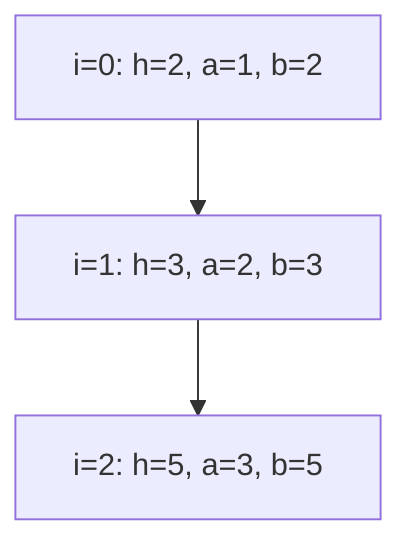
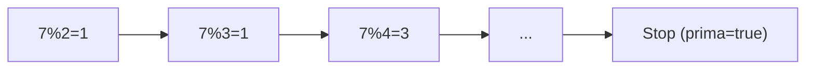
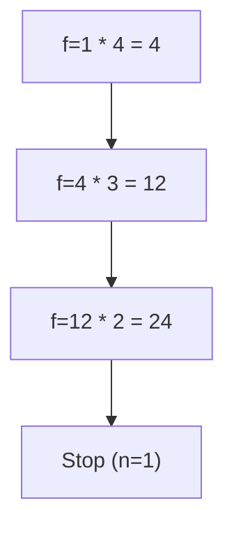
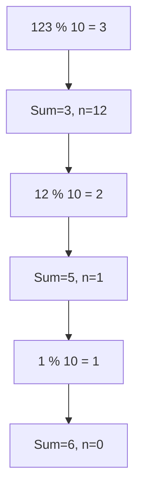
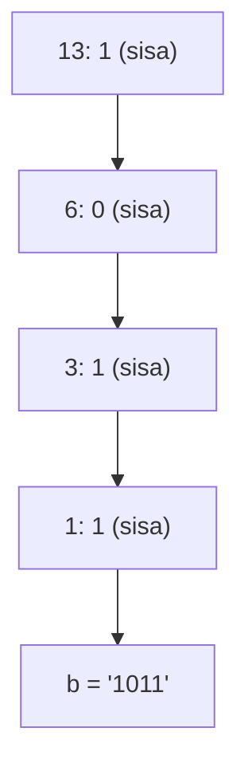
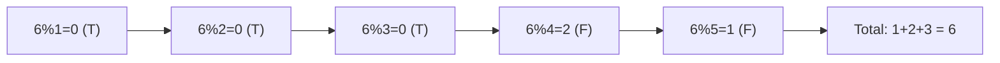
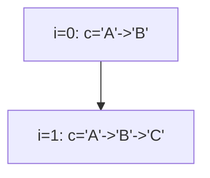
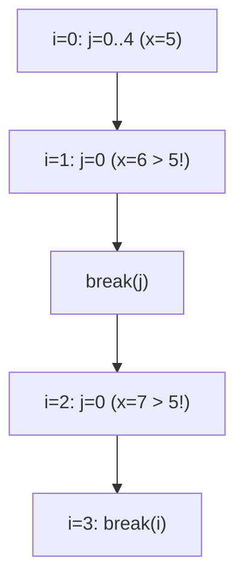
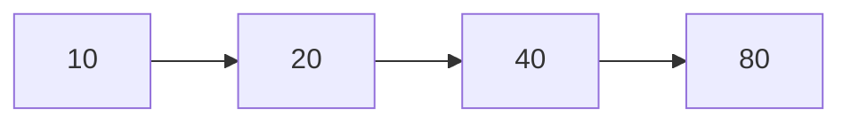
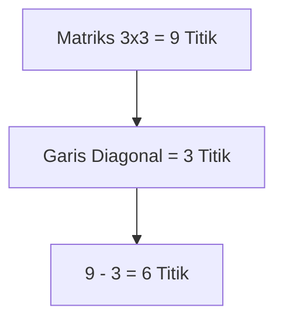

		🔙 **[Kembali ke Daftar Soal](./README.md)**

---

# Latihan Soal Part C - Modul 03 - Set 05 (Premium Edition)

---

### Soal 41: Deret Fibonacci (Sequence Trace)
```cpp
// Skenario: Cetak 5 angka pertama Fibonacci
int a = 1, b = 1;
int hasil = 0;
for (int i = 0; i < 3; i++) {
    hasil = a + b;
    a = b;
    b = hasil;
}
```
**Pertanyaan:**
1. Berapakah nilai `hasil` di akhir?
2. Berapakah nilai `a` dan `b` di akhir?

<details>
<summary><b>Klik untuk Lihat Jawaban & Diagnosis</b></summary>

**Mermaid Flowchart:**


**Jawaban:**
1. **5**
2. **a = 3, b = 5**

**📖 Analisis Mendalam:**
Ini adalah logika "Geser Gelas" untuk Fibonacci. Setiap iterasi menjumlahkan dua angka terakhir dan menggeser posisinya ke depan.
</details>

---

### Soal 42: Deteksi Prima (Flag Check)
```cpp
// Skenario: Cek apakah 7 bilangan prima
int n = 7;
bool prima = true;
for (int i = 2; i < n; i++) {
    if (n % i == 0) {
        prima = false;
        break;
    }
}
```
**Pertanyaan:**
1. Berapakah nilai `prima` (true/false)?
2. Mengapa loop dimulai dari **2**?

<details>
<summary><b>Klik untuk Lihat Jawaban & Diagnosis</b></summary>

**Mermaid Flowchart:**


**Jawaban:**
1. **true**
2. Karena angka 1 pasti bisa membagi semua bilangan, sehingga tidak berguna untuk mendeteksi ke-prima-an.
</details>

---

### Soal 43: Faktorial (Factorial Trace)
```cpp
// Skenario: Hitung 4! (4*3*2*1)
int n = 4;
int f = 1;
while (n > 1) {
    f *= n;
    n--;
}
```
**Pertanyaan:**
1. Berapakah nilai `f`?
2. Apa yang terjadi jika loop diteruskan sampai `n > 0`?

<details>
<summary><b>Klik untuk Lihat Jawaban & Diagnosis</b></summary>

**Mermaid Flowchart:**


**Jawaban:**
1. **24**
2. **Hasil tetap sama.** Karena perkalian dengan 1 tidak mengubah nilai.

**📖 Analisis Mendalam:**
Faktorial sering muncul di olimpiade. Tracing manual membantu siswa memahami betapa cepat angka ini membesar.
</details>

---

### Soal 44: Jumlah Digit (Modulo 10 Loop)
```cpp
// Skenario: Ambil digit dari 123
int n = 123;
int total = 0;
while (n > 0) {
    total += n % 10;
    n /= 10;
}
```
**Pertanyaan:**
1. Berapakah nilai `total`?
2. Berapakah nilai `n` akhir?

<details>
<summary><b>Klik untuk Lihat Jawaban & Diagnosis</b></summary>

**Mermaid Flowchart:**


**Jawaban:**
1. **6** (1 + 2 + 3)
2. **0**

**📖 Analisis Mendalam:**
Kombinasi `% 10` dan `/ 10` adalah trik maut untuk "mempreteli" angka per digit dari belakang ke depan.
</details>

---

### Soal 45: Konversi Biner Sederhana
```cpp
// Skenario: Cari biner dari 13 (terbalik)
int n = 13;
string b = "";
while (n > 0) {
    if (n % 2 == 0) b += "0";
    else b += "1";
    n /= 2;
}
```
**Pertanyaan:**
1. Berapakah nilai `b` (string)?
2. Bagaimana urutan bit aslinya jika dibaca dari belakang?

<details>
<summary><b>Klik untuk Lihat Jawaban & Diagnosis</b></summary>

**Mermaid Flowchart:**


**Jawaban:**
1. **"1011"**
2. **1101** (Angka 13 dalam biner).

**📖 Analisis Mendalam:**
Algoritma "bagi dua" memberikan bit dari yang paling rendah (*least significant*). Itu sebabnya hasil string di atas terbalik secara visual.
</details>

---

### Soal 46: Bilangan Sempurna (Perfect Number Check)
```cpp
// Sempurna jika jum_faktor == n (Contoh: 6 = 1+2+3)
int n = 6;
int jum = 0;
for (int i = 1; i < n; i++) {
    if (n % i == 0) jum += i;
}
```
**Pertanyaan:**
1. Berapakah nilai `jum`?
2. Apakah angka 6 di atas termasuk bilangan sempurna?

<details>
<summary><b>Klik untuk Lihat Jawaban & Diagnosis</b></summary>

**Mermaid Flowchart:**


**Jawaban:**
1. **6**
2. **Ya.** 
</details>

---

### Soal 47: Tangga Karakter (Nested Char)
```cpp
for (int i = 0; i < 2; i++) {
    char c = 'A';
    for (int j = 0; j <= i; j++) {
        c++;
    }
}
```
**Pertanyaan:**
1. Berapakah nilai `c` terakhir di akhir loop?
2. Mengapa variabel `c` seolah "direset" berkali-kali?

<details>
<summary><b>Klik untuk Lihat Jawaban & Diagnosis</b></summary>

**Mermaid Flowchart:**


**Jawaban:**
1. **'C'**
2. Karena deklarasi `char c = 'A'` berada **di dalam** loop `i`, maka setiap ganti baris, variabel `c` lama dihancurkan dan dibuat baru dari 'A'.
</details>

---

### Soal 48: Filter Dua Tahap (Double Break)
```cpp
int x = 0;
for (int i = 0; i < 5; i++) {
    if (i == 3) break;
    for (int j = 0; j < 5; j++) {
        x++;
        if (x > 5) break; 
    }
}
```
**Pertanyaan:**
1. Berapakah nilai `x`?
2. Loop `i` sempat berjalan berapa kali?

<details>
<summary><b>Klik untuk Lihat Jawaban & Diagnosis</b></summary>

**Mermaid Flowchart:**


**Jawaban:**
1. **8**
2. **3 kali** (i=0, i=1, i=2). Tepat saat `i=3`, loop luar hancur.
</details>

---

### Soal 49: Pertumbuhan Penduduk (Geometric Trace)
```cpp
int pop = 10;
int thn = 0;
while (pop < 50) {
    pop *= 2;
    thn++;
}
```
**Pertanyaan:**
1. Berapakah nilai `thn`?
2. Berapakah populasi akhir?

<details>
<summary><b>Klik untuk Lihat Jawaban & Diagnosis</b></summary>

**Mermaid Flowchart:**


**Jawaban:**
1. **3**
2. **80**
</details>

---

### Soal 50: Grand Final (Matrix Sum with Skip)
```cpp
int total = 0;
for (int i = 1; i <= 3; i++) {
    for (int j = 1; j <= 3; j++) {
        if (i == j) continue;
        total += 1;
    }
}
```
**Pertanyaan:**
1. Berapakah nilai `total`?
2. Secara logika, kode ini menghitung apa di dalam matriks 3x3?

<details>
<summary><b>Klik untuk Lihat Jawaban & Diagnosis</b></summary>

**Mermaid Flowchart:**


**Jawaban:**
1. **6**
2. Menghitung jumlah elemen yang **bukan** berada pada diagonal utama.

**📖 Pesan Penutup:**
Selamat! Kamu telah menuntaskan 50 soal Perulangan. Jika kamu bisa menyelesaikan semua soal di Set 05 ini tanpa salah, kamu sudah sangat siap menghadapi OSN-K Informatika di bagian Pemahaman Kode! 🚀
</details>
