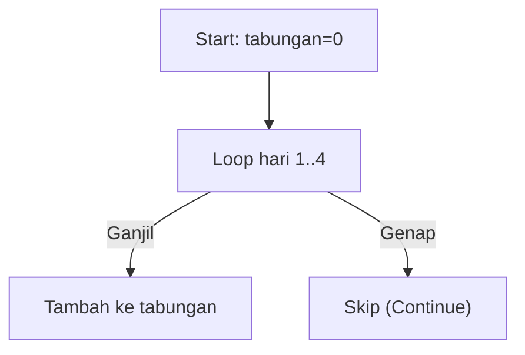

🔙 **[Kembali ke Daftar Soal](./README.md)**

---

# Latihan Soal Part C - Modul 03 - Set 05

### Soal 101
```cpp
int tabungan = 0;
for(int hari=1; hari<=4; hari++) {
  if (hari % 2 == 0) continue;
  tabungan += hari;
}
```
**Pertanyaan:**
1. Berapakah hasil akhirnya?
2. Deskripsikan langkah robot compiler saat memproses kode ini!

**Jawaban & Diagnosis:**
1. **4**
2. Baca bagian 'Analisis Mendalam' di bawah.

**Mermaid Flowchart:**


**📖 Penjelasan Komprehensif:**
**Analisis Mendalam (Compiler Manusia):**
1. **Misi**: Menghitung tabungan yang hanya diisi pada hari ganjil saja.
2. **Tracing**: Hari ganjil yang masuk adalah [1, 3].
3. **Alur**: `continue` memaksa mesin melompati hari genap.
4. **Hasil Akhir**: Total `tabungan` adalah **4**.

---
### Soal 102
```cpp
int tabungan = 0;
for(int hari=1; hari<=6; hari++) {
  if (hari % 2 == 0) continue;
  tabungan += hari;
}
```
**Pertanyaan:**
1. Berapakah hasil akhirnya?
2. Deskripsikan langkah robot compiler saat memproses kode ini!

**Jawaban & Diagnosis:**
1. **9**
2. Baca bagian 'Analisis Mendalam' di bawah.

**Mermaid Flowchart:**


**📖 Penjelasan Komprehensif:**
**Analisis Mendalam (Compiler Manusia):**
1. **Misi**: Menghitung tabungan yang hanya diisi pada hari ganjil saja.
2. **Tracing**: Hari ganjil yang masuk adalah [1, 3, 5].
3. **Alur**: `continue` memaksa mesin melompati hari genap.
4. **Hasil Akhir**: Total `tabungan` adalah **9**.

---
### Soal 103
```cpp
int tabungan = 0;
for(int hari=1; hari<=6; hari++) {
  if (hari % 2 == 0) continue;
  tabungan += hari;
}
```
**Pertanyaan:**
1. Berapakah hasil akhirnya?
2. Deskripsikan langkah robot compiler saat memproses kode ini!

**Jawaban & Diagnosis:**
1. **9**
2. Baca bagian 'Analisis Mendalam' di bawah.

**Mermaid Flowchart:**


**📖 Penjelasan Komprehensif:**
**Analisis Mendalam (Compiler Manusia):**
1. **Misi**: Menghitung tabungan yang hanya diisi pada hari ganjil saja.
2. **Tracing**: Hari ganjil yang masuk adalah [1, 3, 5].
3. **Alur**: `continue` memaksa mesin melompati hari genap.
4. **Hasil Akhir**: Total `tabungan` adalah **9**.

---
### Soal 104
```cpp
int tabungan = 0;
for(int hari=1; hari<=6; hari++) {
  if (hari % 2 == 0) continue;
  tabungan += hari;
}
```
**Pertanyaan:**
1. Berapakah hasil akhirnya?
2. Deskripsikan langkah robot compiler saat memproses kode ini!

**Jawaban & Diagnosis:**
1. **9**
2. Baca bagian 'Analisis Mendalam' di bawah.

**Mermaid Flowchart:**


**📖 Penjelasan Komprehensif:**
**Analisis Mendalam (Compiler Manusia):**
1. **Misi**: Menghitung tabungan yang hanya diisi pada hari ganjil saja.
2. **Tracing**: Hari ganjil yang masuk adalah [1, 3, 5].
3. **Alur**: `continue` memaksa mesin melompati hari genap.
4. **Hasil Akhir**: Total `tabungan` adalah **9**.

---
### Soal 105
```cpp
int tabungan = 0;
for(int hari=1; hari<=3; hari++) {
  if (hari % 2 == 0) continue;
  tabungan += hari;
}
```
**Pertanyaan:**
1. Berapakah hasil akhirnya?
2. Deskripsikan langkah robot compiler saat memproses kode ini!

**Jawaban & Diagnosis:**
1. **4**
2. Baca bagian 'Analisis Mendalam' di bawah.

**Mermaid Flowchart:**


**📖 Penjelasan Komprehensif:**
**Analisis Mendalam (Compiler Manusia):**
1. **Misi**: Menghitung tabungan yang hanya diisi pada hari ganjil saja.
2. **Tracing**: Hari ganjil yang masuk adalah [1, 3].
3. **Alur**: `continue` memaksa mesin melompati hari genap.
4. **Hasil Akhir**: Total `tabungan` adalah **4**.

---
### Soal 106
```cpp
int tabungan = 0;
for(int hari=1; hari<=5; hari++) {
  if (hari % 2 == 0) continue;
  tabungan += hari;
}
```
**Pertanyaan:**
1. Berapakah hasil akhirnya?
2. Deskripsikan langkah robot compiler saat memproses kode ini!

**Jawaban & Diagnosis:**
1. **9**
2. Baca bagian 'Analisis Mendalam' di bawah.

**Mermaid Flowchart:**


**📖 Penjelasan Komprehensif:**
**Analisis Mendalam (Compiler Manusia):**
1. **Misi**: Menghitung tabungan yang hanya diisi pada hari ganjil saja.
2. **Tracing**: Hari ganjil yang masuk adalah [1, 3, 5].
3. **Alur**: `continue` memaksa mesin melompati hari genap.
4. **Hasil Akhir**: Total `tabungan` adalah **9**.

---
### Soal 107
```cpp
int tabungan = 0;
for(int hari=1; hari<=3; hari++) {
  if (hari % 2 == 0) continue;
  tabungan += hari;
}
```
**Pertanyaan:**
1. Berapakah hasil akhirnya?
2. Deskripsikan langkah robot compiler saat memproses kode ini!

**Jawaban & Diagnosis:**
1. **4**
2. Baca bagian 'Analisis Mendalam' di bawah.

**Mermaid Flowchart:**


**📖 Penjelasan Komprehensif:**
**Analisis Mendalam (Compiler Manusia):**
1. **Misi**: Menghitung tabungan yang hanya diisi pada hari ganjil saja.
2. **Tracing**: Hari ganjil yang masuk adalah [1, 3].
3. **Alur**: `continue` memaksa mesin melompati hari genap.
4. **Hasil Akhir**: Total `tabungan` adalah **4**.

---
### Soal 108
```cpp
int tabungan = 0;
for(int hari=1; hari<=4; hari++) {
  if (hari % 2 == 0) continue;
  tabungan += hari;
}
```
**Pertanyaan:**
1. Berapakah hasil akhirnya?
2. Deskripsikan langkah robot compiler saat memproses kode ini!

**Jawaban & Diagnosis:**
1. **4**
2. Baca bagian 'Analisis Mendalam' di bawah.

**Mermaid Flowchart:**


**📖 Penjelasan Komprehensif:**
**Analisis Mendalam (Compiler Manusia):**
1. **Misi**: Menghitung tabungan yang hanya diisi pada hari ganjil saja.
2. **Tracing**: Hari ganjil yang masuk adalah [1, 3].
3. **Alur**: `continue` memaksa mesin melompati hari genap.
4. **Hasil Akhir**: Total `tabungan` adalah **4**.

---
### Soal 109
```cpp
int tabungan = 0;
for(int hari=1; hari<=3; hari++) {
  if (hari % 2 == 0) continue;
  tabungan += hari;
}
```
**Pertanyaan:**
1. Berapakah hasil akhirnya?
2. Deskripsikan langkah robot compiler saat memproses kode ini!

**Jawaban & Diagnosis:**
1. **4**
2. Baca bagian 'Analisis Mendalam' di bawah.

**Mermaid Flowchart:**


**📖 Penjelasan Komprehensif:**
**Analisis Mendalam (Compiler Manusia):**
1. **Misi**: Menghitung tabungan yang hanya diisi pada hari ganjil saja.
2. **Tracing**: Hari ganjil yang masuk adalah [1, 3].
3. **Alur**: `continue` memaksa mesin melompati hari genap.
4. **Hasil Akhir**: Total `tabungan` adalah **4**.

---
### Soal 110
```cpp
int tabungan = 0;
for(int hari=1; hari<=3; hari++) {
  if (hari % 2 == 0) continue;
  tabungan += hari;
}
```
**Pertanyaan:**
1. Berapakah hasil akhirnya?
2. Deskripsikan langkah robot compiler saat memproses kode ini!

**Jawaban & Diagnosis:**
1. **4**
2. Baca bagian 'Analisis Mendalam' di bawah.

**Mermaid Flowchart:**


**📖 Penjelasan Komprehensif:**
**Analisis Mendalam (Compiler Manusia):**
1. **Misi**: Menghitung tabungan yang hanya diisi pada hari ganjil saja.
2. **Tracing**: Hari ganjil yang masuk adalah [1, 3].
3. **Alur**: `continue` memaksa mesin melompati hari genap.
4. **Hasil Akhir**: Total `tabungan` adalah **4**.

---
### Soal 111
```cpp
int tabungan = 0;
for(int hari=1; hari<=4; hari++) {
  if (hari % 2 == 0) continue;
  tabungan += hari;
}
```
**Pertanyaan:**
1. Berapakah hasil akhirnya?
2. Deskripsikan langkah robot compiler saat memproses kode ini!

**Jawaban & Diagnosis:**
1. **4**
2. Baca bagian 'Analisis Mendalam' di bawah.

**Mermaid Flowchart:**


**📖 Penjelasan Komprehensif:**
**Analisis Mendalam (Compiler Manusia):**
1. **Misi**: Menghitung tabungan yang hanya diisi pada hari ganjil saja.
2. **Tracing**: Hari ganjil yang masuk adalah [1, 3].
3. **Alur**: `continue` memaksa mesin melompati hari genap.
4. **Hasil Akhir**: Total `tabungan` adalah **4**.

---
### Soal 112
```cpp
int tabungan = 0;
for(int hari=1; hari<=5; hari++) {
  if (hari % 2 == 0) continue;
  tabungan += hari;
}
```
**Pertanyaan:**
1. Berapakah hasil akhirnya?
2. Deskripsikan langkah robot compiler saat memproses kode ini!

**Jawaban & Diagnosis:**
1. **9**
2. Baca bagian 'Analisis Mendalam' di bawah.

**Mermaid Flowchart:**


**📖 Penjelasan Komprehensif:**
**Analisis Mendalam (Compiler Manusia):**
1. **Misi**: Menghitung tabungan yang hanya diisi pada hari ganjil saja.
2. **Tracing**: Hari ganjil yang masuk adalah [1, 3, 5].
3. **Alur**: `continue` memaksa mesin melompati hari genap.
4. **Hasil Akhir**: Total `tabungan` adalah **9**.

---
### Soal 113
```cpp
int tabungan = 0;
for(int hari=1; hari<=5; hari++) {
  if (hari % 2 == 0) continue;
  tabungan += hari;
}
```
**Pertanyaan:**
1. Berapakah hasil akhirnya?
2. Deskripsikan langkah robot compiler saat memproses kode ini!

**Jawaban & Diagnosis:**
1. **9**
2. Baca bagian 'Analisis Mendalam' di bawah.

**Mermaid Flowchart:**


**📖 Penjelasan Komprehensif:**
**Analisis Mendalam (Compiler Manusia):**
1. **Misi**: Menghitung tabungan yang hanya diisi pada hari ganjil saja.
2. **Tracing**: Hari ganjil yang masuk adalah [1, 3, 5].
3. **Alur**: `continue` memaksa mesin melompati hari genap.
4. **Hasil Akhir**: Total `tabungan` adalah **9**.

---
### Soal 114
```cpp
int tabungan = 0;
for(int hari=1; hari<=5; hari++) {
  if (hari % 2 == 0) continue;
  tabungan += hari;
}
```
**Pertanyaan:**
1. Berapakah hasil akhirnya?
2. Deskripsikan langkah robot compiler saat memproses kode ini!

**Jawaban & Diagnosis:**
1. **9**
2. Baca bagian 'Analisis Mendalam' di bawah.

**Mermaid Flowchart:**


**📖 Penjelasan Komprehensif:**
**Analisis Mendalam (Compiler Manusia):**
1. **Misi**: Menghitung tabungan yang hanya diisi pada hari ganjil saja.
2. **Tracing**: Hari ganjil yang masuk adalah [1, 3, 5].
3. **Alur**: `continue` memaksa mesin melompati hari genap.
4. **Hasil Akhir**: Total `tabungan` adalah **9**.

---
### Soal 115
```cpp
int tabungan = 0;
for(int hari=1; hari<=3; hari++) {
  if (hari % 2 == 0) continue;
  tabungan += hari;
}
```
**Pertanyaan:**
1. Berapakah hasil akhirnya?
2. Deskripsikan langkah robot compiler saat memproses kode ini!

**Jawaban & Diagnosis:**
1. **4**
2. Baca bagian 'Analisis Mendalam' di bawah.

**Mermaid Flowchart:**


**📖 Penjelasan Komprehensif:**
**Analisis Mendalam (Compiler Manusia):**
1. **Misi**: Menghitung tabungan yang hanya diisi pada hari ganjil saja.
2. **Tracing**: Hari ganjil yang masuk adalah [1, 3].
3. **Alur**: `continue` memaksa mesin melompati hari genap.
4. **Hasil Akhir**: Total `tabungan` adalah **4**.

---
### Soal 116
```cpp
int tabungan = 0;
for(int hari=1; hari<=5; hari++) {
  if (hari % 2 == 0) continue;
  tabungan += hari;
}
```
**Pertanyaan:**
1. Berapakah hasil akhirnya?
2. Deskripsikan langkah robot compiler saat memproses kode ini!

**Jawaban & Diagnosis:**
1. **9**
2. Baca bagian 'Analisis Mendalam' di bawah.

**Mermaid Flowchart:**


**📖 Penjelasan Komprehensif:**
**Analisis Mendalam (Compiler Manusia):**
1. **Misi**: Menghitung tabungan yang hanya diisi pada hari ganjil saja.
2. **Tracing**: Hari ganjil yang masuk adalah [1, 3, 5].
3. **Alur**: `continue` memaksa mesin melompati hari genap.
4. **Hasil Akhir**: Total `tabungan` adalah **9**.

---
### Soal 117
```cpp
int tabungan = 0;
for(int hari=1; hari<=3; hari++) {
  if (hari % 2 == 0) continue;
  tabungan += hari;
}
```
**Pertanyaan:**
1. Berapakah hasil akhirnya?
2. Deskripsikan langkah robot compiler saat memproses kode ini!

**Jawaban & Diagnosis:**
1. **4**
2. Baca bagian 'Analisis Mendalam' di bawah.

**Mermaid Flowchart:**


**📖 Penjelasan Komprehensif:**
**Analisis Mendalam (Compiler Manusia):**
1. **Misi**: Menghitung tabungan yang hanya diisi pada hari ganjil saja.
2. **Tracing**: Hari ganjil yang masuk adalah [1, 3].
3. **Alur**: `continue` memaksa mesin melompati hari genap.
4. **Hasil Akhir**: Total `tabungan` adalah **4**.

---
### Soal 118
```cpp
int tabungan = 0;
for(int hari=1; hari<=4; hari++) {
  if (hari % 2 == 0) continue;
  tabungan += hari;
}
```
**Pertanyaan:**
1. Berapakah hasil akhirnya?
2. Deskripsikan langkah robot compiler saat memproses kode ini!

**Jawaban & Diagnosis:**
1. **4**
2. Baca bagian 'Analisis Mendalam' di bawah.

**Mermaid Flowchart:**


**📖 Penjelasan Komprehensif:**
**Analisis Mendalam (Compiler Manusia):**
1. **Misi**: Menghitung tabungan yang hanya diisi pada hari ganjil saja.
2. **Tracing**: Hari ganjil yang masuk adalah [1, 3].
3. **Alur**: `continue` memaksa mesin melompati hari genap.
4. **Hasil Akhir**: Total `tabungan` adalah **4**.

---
### Soal 119
```cpp
int tabungan = 0;
for(int hari=1; hari<=4; hari++) {
  if (hari % 2 == 0) continue;
  tabungan += hari;
}
```
**Pertanyaan:**
1. Berapakah hasil akhirnya?
2. Deskripsikan langkah robot compiler saat memproses kode ini!

**Jawaban & Diagnosis:**
1. **4**
2. Baca bagian 'Analisis Mendalam' di bawah.

**Mermaid Flowchart:**


**📖 Penjelasan Komprehensif:**
**Analisis Mendalam (Compiler Manusia):**
1. **Misi**: Menghitung tabungan yang hanya diisi pada hari ganjil saja.
2. **Tracing**: Hari ganjil yang masuk adalah [1, 3].
3. **Alur**: `continue` memaksa mesin melompati hari genap.
4. **Hasil Akhir**: Total `tabungan` adalah **4**.

---
### Soal 120
```cpp
int tabungan = 0;
for(int hari=1; hari<=4; hari++) {
  if (hari % 2 == 0) continue;
  tabungan += hari;
}
```
**Pertanyaan:**
1. Berapakah hasil akhirnya?
2. Deskripsikan langkah robot compiler saat memproses kode ini!

**Jawaban & Diagnosis:**
1. **4**
2. Baca bagian 'Analisis Mendalam' di bawah.

**Mermaid Flowchart:**


**📖 Penjelasan Komprehensif:**
**Analisis Mendalam (Compiler Manusia):**
1. **Misi**: Menghitung tabungan yang hanya diisi pada hari ganjil saja.
2. **Tracing**: Hari ganjil yang masuk adalah [1, 3].
3. **Alur**: `continue` memaksa mesin melompati hari genap.
4. **Hasil Akhir**: Total `tabungan` adalah **4**.

---
### Soal 121
```cpp
int tabungan = 0;
for(int hari=1; hari<=3; hari++) {
  if (hari % 2 == 0) continue;
  tabungan += hari;
}
```
**Pertanyaan:**
1. Berapakah hasil akhirnya?
2. Deskripsikan langkah robot compiler saat memproses kode ini!

**Jawaban & Diagnosis:**
1. **4**
2. Baca bagian 'Analisis Mendalam' di bawah.

**Mermaid Flowchart:**
```mermaid
graph TD
A["Start: tabungan=0"] --> B["Loop hari 1..3"]
B -- Ganjil --> C["Tambah ke tabungan"]
B -- Genap --> D["Skip (Continue)"]
```

**📖 Penjelasan Komprehensif:**
**Analisis Mendalam (Compiler Manusia):**
1. **Misi**: Menghitung tabungan yang hanya diisi pada hari ganjil saja.
2. **Tracing**: Hari ganjil yang masuk adalah [1, 3].
3. **Alur**: `continue` memaksa mesin melompati hari genap.
4. **Hasil Akhir**: Total `tabungan` adalah **4**.

---
### Soal 122
```cpp
int tabungan = 0;
for(int hari=1; hari<=3; hari++) {
  if (hari % 2 == 0) continue;
  tabungan += hari;
}
```
**Pertanyaan:**
1. Berapakah hasil akhirnya?
2. Deskripsikan langkah robot compiler saat memproses kode ini!

**Jawaban & Diagnosis:**
1. **4**
2. Baca bagian 'Analisis Mendalam' di bawah.

**Mermaid Flowchart:**
```mermaid
graph TD
A["Start: tabungan=0"] --> B["Loop hari 1..3"]
B -- Ganjil --> C["Tambah ke tabungan"]
B -- Genap --> D["Skip (Continue)"]
```

**📖 Penjelasan Komprehensif:**
**Analisis Mendalam (Compiler Manusia):**
1. **Misi**: Menghitung tabungan yang hanya diisi pada hari ganjil saja.
2. **Tracing**: Hari ganjil yang masuk adalah [1, 3].
3. **Alur**: `continue` memaksa mesin melompati hari genap.
4. **Hasil Akhir**: Total `tabungan` adalah **4**.

---
### Soal 123
```cpp
int tabungan = 0;
for(int hari=1; hari<=5; hari++) {
  if (hari % 2 == 0) continue;
  tabungan += hari;
}
```
**Pertanyaan:**
1. Berapakah hasil akhirnya?
2. Deskripsikan langkah robot compiler saat memproses kode ini!

**Jawaban & Diagnosis:**
1. **9**
2. Baca bagian 'Analisis Mendalam' di bawah.

**Mermaid Flowchart:**
```mermaid
graph TD
A["Start: tabungan=0"] --> B["Loop hari 1..5"]
B -- Ganjil --> C["Tambah ke tabungan"]
B -- Genap --> D["Skip (Continue)"]
```

**📖 Penjelasan Komprehensif:**
**Analisis Mendalam (Compiler Manusia):**
1. **Misi**: Menghitung tabungan yang hanya diisi pada hari ganjil saja.
2. **Tracing**: Hari ganjil yang masuk adalah [1, 3, 5].
3. **Alur**: `continue` memaksa mesin melompati hari genap.
4. **Hasil Akhir**: Total `tabungan` adalah **9**.

---
### Soal 124
```cpp
int tabungan = 0;
for(int hari=1; hari<=6; hari++) {
  if (hari % 2 == 0) continue;
  tabungan += hari;
}
```
**Pertanyaan:**
1. Berapakah hasil akhirnya?
2. Deskripsikan langkah robot compiler saat memproses kode ini!

**Jawaban & Diagnosis:**
1. **9**
2. Baca bagian 'Analisis Mendalam' di bawah.

**Mermaid Flowchart:**
```mermaid
graph TD
A["Start: tabungan=0"] --> B["Loop hari 1..6"]
B -- Ganjil --> C["Tambah ke tabungan"]
B -- Genap --> D["Skip (Continue)"]
```

**📖 Penjelasan Komprehensif:**
**Analisis Mendalam (Compiler Manusia):**
1. **Misi**: Menghitung tabungan yang hanya diisi pada hari ganjil saja.
2. **Tracing**: Hari ganjil yang masuk adalah [1, 3, 5].
3. **Alur**: `continue` memaksa mesin melompati hari genap.
4. **Hasil Akhir**: Total `tabungan` adalah **9**.

---
### Soal 125
```cpp
int tabungan = 0;
for(int hari=1; hari<=6; hari++) {
  if (hari % 2 == 0) continue;
  tabungan += hari;
}
```
**Pertanyaan:**
1. Berapakah hasil akhirnya?
2. Deskripsikan langkah robot compiler saat memproses kode ini!

**Jawaban & Diagnosis:**
1. **9**
2. Baca bagian 'Analisis Mendalam' di bawah.

**Mermaid Flowchart:**
```mermaid
graph TD
A["Start: tabungan=0"] --> B["Loop hari 1..6"]
B -- Ganjil --> C["Tambah ke tabungan"]
B -- Genap --> D["Skip (Continue)"]
```

**📖 Penjelasan Komprehensif:**
**Analisis Mendalam (Compiler Manusia):**
1. **Misi**: Menghitung tabungan yang hanya diisi pada hari ganjil saja.
2. **Tracing**: Hari ganjil yang masuk adalah [1, 3, 5].
3. **Alur**: `continue` memaksa mesin melompati hari genap.
4. **Hasil Akhir**: Total `tabungan` adalah **9**.

---
